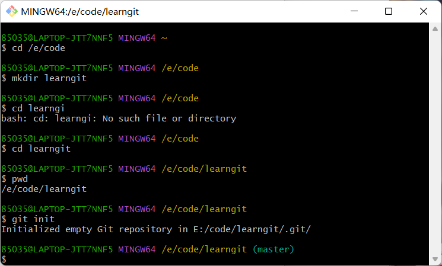
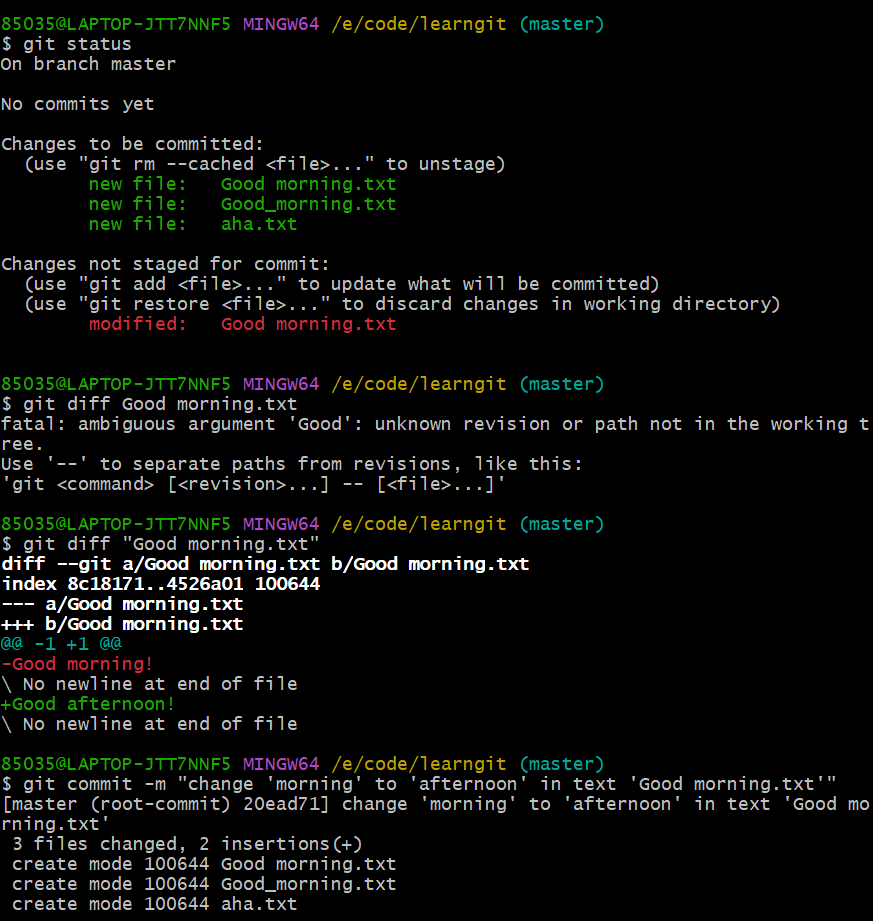

# Git 学习笔记

参考资料：
[1] [GitHub 官方文档](https://docs.github.com/zh)
[2] [Git 教程|菜鸟教程](https://www.runoob.com/git/git-tutorial.html)
[3] [Git 教程 by 廖雪峰](https://liaoxuefeng.com/books/git/introduction/index.html)
[4] [CSDN：Git 安装教程（超详细）](https://blog.csdn.net/qq_45281589/article/details/134650456)

扩展知识：
[震惊！竟然有人在 GitHub 上冒充我的身份！](https://spencerwoo.com/blog/wait-this-is-not-my-commit)

如果需要学习 GitHub 相关拓展知识，请移步以下链接：
[1] [GitHub 汉化教程](https://blog.csdn.net/chu1025631/article/details/138764774)
[2] [GitHub 学习笔记](.\GitHub学习笔记.md)

写在前面：
当前是学习笔记的初稿，大部分参照廖雪峰的 Git 教程完成的记录。其课程特点是案例式教学，但我在记录笔记时，并没有完整记录他的场景描述，而是侧重于记录教程中的指令以及我在学习、实操过程中自己的一些看法，如果你对我记录的信息有疑问，可以给我提一些建议，也可以通过前面的链接直接通过廖雪峰的教程。

初稿为您的学习之路带来的不便还请谅解！

## Git 简介

git 的特点：
版本控制系统

## 安装 Git

参考资料：[廖雪峰：安装 Git](https://liaoxuefeng.com/books/git/install-git/index.html)

安装程序参照参考资料[4]，下面讲一下安装后必要的设置。

### 指定用户名和邮箱地址

用户名和邮箱地址是 Git 记录提交信息的关键凭据，在 Windows 环境（命令行）下可以用以下命令设定：

```sh
git config --global user.name "Your Name"
git config --global user.email "youremail@example.com"
```

`global`表示命令对这台电脑上的所有用户生效。若使用的命令行工具是`Git Bash`，则每条指令前会有`$`，一般会自动加上。

在引号中填写你的昵称和邮箱即可。

然后你可以通过以下命令查看你刚设定的信息：

```sh
git config --global user.name
git config --global user.email
```

也可以输入以下命令查看所有配置信息：

```sh
git config --list
```

## Git 基本操作

### 创建 Git 版本库（仓库）

由于每个人的习惯不同，或许你现在正在使用的是`Shell`或者其他的一些工具，但本教程将使用刚才安装上的`Git Bash`进行讲解。

你如果是一个图方便的初学者，你可以依次在`bash`中输入以下命令，这样做你就建好了第一个 git 仓库。

```bash
$ mkdir learngit
$ cd learngit
$ pwd
$ git init
```

下面我们来解释下它们的含义：

1. `mkdir learngit`：在当前目录下创建一个名为`learngit`的文件夹。
2. `cd learngit`：切换到`learngit`文件夹。
3. `pwd`：查看当前所在目录。
4. `git init`：在当前目录下创建一个 git 仓库。

具体的效果如下图所示：


从上图中可以发现，git 给了你如下提示：

```sh
Initialized empty Git repository in ???
```

这条提示表示，git 已经成功创建了一个空的 git 仓库。
这样创建的仓库会被创建在默认的 c 盘当中，所以下面我们来介绍一种可以将仓库创建在任意目录下的方法。

```bash
$ cd /e/code
$ mkdir learngit
$ cd learngit
$ pwd
$ git init
```

如下图所示：


`cd /e/code`：切换到`/e/code`目录。注意，第一个斜线必须加，表示这个路径是**绝对路径**，不然`Git Bash`找不到路径。

好吧，或许你非常的轴，还在用 Shell，然后发现`$ pwd`和`$ cd /e/`用不了，偷偷告诉你，你只需要输入`cd`就可以查看当前路径（但前面有显示的啊），输入`e:`然后回车，就可以跳转到别的盘了。

无论如何，你现在已经成功创建了一个 git 仓库了，在你创建的仓库中，你会发现一个名为`.git`的文件夹，众所周知，前面带个点八成是个配置文件，这个文件中存了所有的提交记录，不要动它就对了。

### 一些常用指令

创建一个文件是十分简单的事情，直接右键就可以了。这么简单的当然不是我们要讲的，我们要讲的是如何让 git 追踪到这些文件。
下面我将用一个例子来讲明`Git Bash`常用命令：

首先，我们在之前建立的仓库`learngit`中创建一个名为`Good morning.txt`和一个名为`Good_morning.txt`的文本文件，并输入以下内容：

```txt
Good morning!
```

1. `git add`
   好了，现在我们需要让 git 和我们刚创建的这个文件认识一下了。
   使用如下命令将文件添加进 git 仓库：

```bash
$ git add Good_morning.txt text.txt     #可以用这个方法添加多个文件
$ git add "Good morning.txt"            #当添加的文件名中有空格时，需要用双引号括起来
$ git add .                             #添加所有文件进入仓库
$ git add *                             #功能同上一条
```

2. `git status`
   命令用于查看当前仓库的状态。
   可以通过输入这条命令，查看当前仓库中哪些文件被修改了，哪些文件被删除了，哪些文件被添加了。

3. `git commit`
   用于提交更改，具体命令如下所示：

   ```bash
   $ git commit -m "commit message"         #这是一个普通的提交信息
   $ git commit --allow-empty-message -m "" #这是一个允许提交空信息的方法，但不推荐使用。

   $ git commit amend -m "commit message"   # amend表示修改上一次的提交信息
   ```

   一般来说，一条提交信息应该在其后面写明当前提交的信息做了什么修改，以便多人协作时，能快速了解修改情况。当然，也可以不写，方法已经给出，但是不推荐。

4. `git diff`
   用于查看文件的具体修改情况。
   比如我现在将`Good_morning.txt`中的`morning`改为`afternoon`，然后输入`git diff`，就会看到如下结果：
   

5. `git log`
   用于查看当前仓库的历史日志。
   可以用下列命令精准查看日志：

   ```bash
   $ git log --pretty=oneline #只显示一条日志

   #
   $ git log --graph --pretty=oneline --abbrev-commit
   ```

6. `git reset`
   用于版本回退，具体用法如下

   ```bash
   $ git reset --hard HEAD^
   $ git reset --hard HEAD~1        # 回退到上一版本已提交时的状态
   $ git reset --soft HEAD~1        # 回退到上一版本未提交时的状态
   $ git reset --mixed HEAD~1       # 回退到上一个版本已添加但未提交的状态
   $ git reset --hard < commit id > # 回退到指定版本

   $ git reset HEAD < filename >    # 将指定文件状态恢复到最后一次提交后的状态。
   ```

   前两条指令效果一样，`HEAD`后面`^`的个数代表回退的版本数，当回退版本过多时，也可以选择使用`~`，例如`HEAD~10`。
   也可以用`commit id`（就是`git log`中每条提交记录后面那一长串哈希值，可以通过指令`git reflog`找到）回退到指定版本。
   **注意**：也可以直接使用`HEAD`在不改变版本的情况下，只针对最后一次提交后的操作进行修改。

   详细点讲：

   1. `--hard`会清除暂存区和工作区的全部修改，然后回到指定版本提交完的时点。
   2. `--soft`不清除、修改任何区域的数据，仅回退到指定版本提交后的时间点，此时，`git status`会将暂存区和工作区修改与上一个版本提交时的状态进行比较，并显示出修改情况。
   3. `--mixed`仅会清除暂存区记录，并回到指定版本提交后的时间点。

   换个方式理解：`hard`硬回退，抹除所有未提交数据；`soft`软回退，只改变版本，不影响数据；`mixed`混合回退,只清除暂存区。

7. `cat <filename>`
   用于查看某一文件的具体内容，如：

   ```bash
   cat Good_morning.txt
   ```

8. `git checkout --  <filename>`
   这条指令将放弃目标文件未添加进暂存区的所有修改。也可以理解为，将当前文件还原到最后一次向暂存区提交时的状态。
   这里的`--`表示后面不是一条指令，而是一个文件路径，`--`须加一个空格，不然会被识别成命令。

9. `git rm <filename>`
   用于将指定文件移出 git 仓库。

10. `git rebase`
    用于整理提交历史（？？？）

## 使用 GitHub 远程仓库

### 基本设置

以 Windows 为例，查看当前用户主目录下，有无`.ssh`文件夹，其中有没有`id_rsa`和`id_rsa.pub`文件，如果没有，则需要生成密钥对，打开`Git Bash`并输入以下命令：

```bash
$ ssh-keygen -t rsa -C "your_email@example.com"
```

其中：
`ssh-keygen`是生成密钥对的命令；
`-t rsa`表示生成 rsa 类型的密钥对；
`-C "your_email@example.com"`表示生成密钥对的备注信息，这里可以写上自己的邮箱，易于识别设备。

然后你可以注册一个 GitHub 账号，通过`'Account Settings'->'SSH and GPG keys'`将文件`id_rsa.pub`中的内容粘贴到`SSH Keys`中。

**在最新的 GitHub 中，需要选择使用认证密钥（Authorized keys）还是签名密钥（signed keys），这里我选择的签名密钥，至于为什么，我是问的通义千问，等我搞明白了再回来改**
通义千问都是骗人的！我用的认证密钥，然后过了。

### 将本地仓库与远程仓库关联(本节仍可完善)

配置好密钥后，就可以向 GitHub 推送仓库了。

现在，先在你的 GitHub 上创建一个名为`learngit`的仓库，然后你可以通过下述命令将本地仓库与远程仓库关联：

```bash
# 将远程仓库添加进本地仓库，并命名为origin
$ git remote add origin git@github.com:your_username/your_repo_name.git

# 将本地仓库的master分支推送到远程仓库origin，并与仓库建立关联
$ git push -u origin master
$ git push --set-upstream origin master
```

1. `origin`是自定义的远程仓库名称，叫做`origin`是一种惯例。
2. `-u` 或 `--set-upstream` 选项用于设置本地分支与远程分支之间的跟踪关系。这通常在**第一次推送**时使用，以便以后可以方便地推送或拉取。
   这里是将`master`分支推送到了远程仓库`origin`中，并建立联系。
   然后你就可以在对应的仓库中看到刚刚创建的`master`分支了。
3. 关联好远程仓库后，就可以通过`git push origin master`将本地仓库中的修改直接推送到远程仓库了。

其他关于远程仓库的一些指令：

1. `git remote -v`：查看所有远程仓库的信息，包括名称、地址等。
2. `git remote rm origin`：删除远程仓库`origin`。

### 从远程库克隆

用如下命令可以克隆远程仓库（即将目标位置的代码下载到本地当前位置）：

```bash
$ git clone https://github.com/your_username/your_repo_name.git <dirname>             # 使用https协议克隆项目
$ git clone git@github.com:your_username/your_repo_name.git <dirname>                 # 使用ssh协议克隆项目
$ git clone https://github.com/your_username/your_repo_name.git
$ git clone git@github.com:your_username/your_repo_name.git
```

可以使用 ssh 或 https 协议克隆项目，若在网址后加上名称`<dirname>`，则项目会被下载到名为`<dirname>`的文件夹中，否则，将下载到与仓库同名的`your_repo_name`文件夹中。

**据廖雪峰说，http 速度慢且每次需要输入口令，所以建议使用 ssh，但我没搞明白为什么，搞明白了我回来补**

## Git 分支

Git 分支的本质，就是控制指针的位置。从之前的内容可知，Git 中有一个指针`HEAD`会指向一个版本，你之后做的一切更改都是在这个版本基础上。但实际上，这个指针并不是直接指向版本，而是指向一个分支（如`master`），而分支同样是一个指针，它才是真正指向了一个版本。所以，Git 分支的控制，实际上就是一个创建、删除、移动指针的过程。

### 创建与合并分支

可以使用如下指令创建、切换分支：

```bash
$ git branch <branch_name>          # 创建分支
$ git checkout <branch_name>        # 切换分支

$ git checkout -b <branch_name>     # 创建并切换分支
$ git checkout -b <branch_name> <branch_name_exist>     # 创建并切换分支，分支指向已存在的分支


# 在较新的Git版本中，还可以使用以下命令
$ git switch <branch_name>          # 切换分支
$ git switch -c <branch_name>       # 创建并切换分支
```

切换分支时，你在该分支上提交的所有修改都不会被保留，但工作区和暂存区的更改会被保留。

可以使用如下命令合并分支：

```bash
$ git merge <branch_name>        # 合并其他分支到当前分支
$ git merge                      # （具体功能不明）

# 合并结束后，可以用此命令删除多余的分支
$ git branch -d <branch_name>    # 删除分支

$ git merge --abort              # 放弃合并（当发生合并冲突时使用此命令退出merging状态）
```

**注意**：合并其他分支的`git merge <branch_name>`命令，会将当前分支的指针挪到`<branch_name>`分支的版本。但前提是`<branch_name>`相较于当前分支有更改，否则，不会产生任何影响。换句话说，指针在当前情况下只会前进。

一些反馈信息：

```bash
# 由于指令不完全，给出报错：未关联远程分支。merge一般情况下要跟一个分支名。
85035@LAPTOP-JTT7NNF5 MINGW64 /e/code/learngit (new_branch)
$ git merge
fatal: No remote for the current branch.

# 此时new_branch分支在master分支之前，无法merge。
85035@LAPTOP-JTT7NNF5 MINGW64 /e/code/learngit (new_branch)
$ git merge master
Already up to date.

# 这里表示merge成功，返回信息显示使用Fast-forward模式将指针前移。
85035@LAPTOP-JTT7NNF5 MINGW64 /e/code/learngit (master)
$ git merge new_branch
Updating becd9a0..53ebf79
Fast-forward
 aha.txt | 4 +++-
 1 file changed, 3 insertions(+), 1 deletion(-)


```

### 解决冲突

当你创建一个新分支，然后基于两个不同的分支作了不同的修改时，Git 就会提示你分支发生了冲突。
这时就需要对产生冲突的文件进行手动修改，然后提交。
在一个文件发生冲突的位置，通常会呈现如下形式：

```text
<<<<<<< HEAD
this is line 1
===========
this is line 2
>>>>>>>> new_branch
```

将这一部分修改后提交，即可合并分支。

当然，还有别的方法。

```bash
# 在不触发Fast-forward的情况下，提交一个新版本并完成合并。
$ git merge --no-ff -m "merge message" <branch_name>
```

这条指令的好处是可以保留分支历史（别问我，我不懂，自己理解一下）
据我实测，两种方式都可以保留分支信息，可能是版本更新了的缘故。

可以采用以下命令查看分支发生的事：

```bash
$ git log --graph --pretty=oneline --abbrev-commit
```

## 分支策略

所谓分支策略，就是尽量不动主分支（`master`或`main`），创建多条分支用于多人协作提交代码，最后将所有人的工作成果汇总到一起。

## Bug 分支

假设现在主分支`master`上出现了一个 bug，但切到 master 分支不可避免的会丢掉你当前所在的分支`my_branch`的工作进度，可是工作没有做完让你无法提交更改，那么我们可以：

```bash
$ git stash
```

这样可以将当前工作现场暂存起来，等 bug 解决后再恢复回来：

```bash

$ git stash pop         # 弹出当前最新的更改，同时将此项更改从暂存区移除

$ git stash list        # 查看暂存区中的更改

# 本方法
$ git stash apply        # 恢复暂存区中的更改
$ git stash drop        # 删除暂存区中最新的更改
$ git stash clear       # 清空暂存区

```

当然，在`master`上存在的 bug 自然也存在于`my_branch`上，所以：

```bash
$ git cherry-pick <commit_id>
```

以此法复制更改。

## feature 分支（删除分支）

当开发一个新功能时，建议在新建的一个 feature 分支上进行，当功能完成后，再合并到`master`分支。

```bash
$ git branch -d <branch_name> # 删除分支
$ git branch -D <branch_name> # 强制删除分支
```

两者的区别在于，如果分支有未提交的更改，`-d`命令会提示你，但`-D`命令会强制删除。

## 多人协作基础

### 远程仓库相关指令

```bash
#查看远程仓库信息
$ git remote # 查看远程仓库
$ git remote -v  # 查看远程仓库的详细信息fetch与push，有push证明对该仓库有提交权限。

# 向远程仓库推送
$ git push origin <branch_name> # 将本地分支推送到远程仓库origin的同名分支

# 从远程仓库拉取
$ git clone <remote_repo_url> <local_repo_name> # 从远程仓库克隆到本地
$ git checkout -b <branch_name> <remote_repo_url>/<branch_name> # 创建一个跟随远程分支的分支

```

### 意外事件

1. push 时与远程仓库发生冲突

   这时就需要用`pull`将远程仓库的提交抓取到本地，然后进行分支合并。

   ```bash
   $ git pull # 将远程仓库的提交抓取到本地

   # 如果抓取失败，输入下方命令
   $ git branch --set-upstream-to=origin/<branch_name> <branch_name> # 将本地分支与远程分支关联


   ```

## 标签管理

```bash
$ git tag <tag_name> <commit_id> # 创建一个标签
$ git tag <tag_name>             # 为当前分支的最新提交（HEAD）创建一个标签
$ git tag -a <tag_name> -m "tag message" <commit_id> # 为指定提交创建一个标签，并附简单描述。

$ git tag                        # 查看所有标签
$ git show <tag_name>            # 查看标签信息（名称、创建时间、创建者、描述等）

```

对标签的一些操作

```bash
$ git tag -d <tag_name>          # 删除标签
$ git push origin <tag_name>     # 推送标签至远程仓库
$ git push origin --tags         # 推送所有标签至远程仓库

# 删除远程仓库的标签
$ git tag -d <tag_name>                   # 先在本地删除
$ git push origin :refs/tags/<tag_name>   # 再推送
```

## 关于 GitHub

你的 GitHub 仓库中一般有这两类代码：自己的和别人的。自己的代码通过自己 push 得到，而别人的代码通常通过 Fork 得到。（Fork 是 GitHub 的功能，一般在项目页的右上方。

当你 Fork 了别人的代码，发现了一些问题，想告诉原作者时，你可以通过 GitHub 中`Pull Request`功能向原作者提交你的修改。具体流程为：

```bash
Fork别人的代码到自己的仓库->克隆自己仓库的代码到本地->修改代码后提交->在GitHub中提交Pull Request->原作者审核
```

这样你就可以在使用其他作者的作品同时，为其提一些宝贵的建议了。

## 关于 Gitee （码云）

与 GitHub 类似，在 Gitee 上存储代码，也需要 SSH 密钥、创建项目、关联远程库等操作。**但请注意**，之前讲过，我们将远程仓库 GitHub 命名为`origin`，那么 Gitee 就不能使用这个名字了，你需要给这个远程库起一个新名字比如`gitee`。

```bash
$ git remote add gitee <gitee_repo_url> # 创建一个新的远程仓库，位于Gitee，名为'gitee'


# 也可以先将GitHub的关联信息删除，再关联Gitee
$ git remote rm origin
$ git remote add origin <gitee_repo_url>
```

如果你同时关联了多个远程仓库，那么`git remote -v`的信息也会增多。

## 玩转 Git

1. `.gitignore`
   总会有一些文件，你需要将其放在 Git 的工作目录中，但又不能随项目上传（比如数据库密码配置文件等）。这时，你可以创建一个名为`.gitignore`的文件，将这些文件名填入其中。GitHub 有一些 `.gitignore` 模板，可以参考：
   https://github.com/github/gitignore
   [廖雪峰：忽略特殊文件](https://liaoxuefeng.com/books/git/customize/ignore/index.html)

   - 当你成功忽略掉部分文件后，当你再尝试将这些文件`add`到 Git 中时就会报错，这时也是有办法的，通过`git add -f <file_name>`就可以强制添加了。
   - 还可以用`git check-ignore -v <file_name>`来查看为什么`<file_name>`不能添加。
   - 还可以在`.gitignore`文件中的规则以`!`开头来表示例外，比如`!.gitignore`，即为不忽略`.gitignore`文件（类似于白名单）。
   - `.gitignore`还可以放在某个子文件夹下，表示忽略只针对该子目录。

2. 配置别名
   那么多指令，不仅不好记，还容易输错！
   下面的这个方法可以将 Git 的常用指令配置为别名，这样你就可以输入`git st`来代替`git status`。其他命令同理

   ```bash
   $ git config --global alias.st status # 将git status命令配置为st

   ```

   或许你在想，正经命令还没记全，这些骚操作还是算了吧。别急，还记得前面输的哪条指令不变，还又臭又长吗？

   ```bash
   $ git config --global alias.lg "log --color --graph --pretty=format:'%Cred%h%Creset -%C(yellow)%d%Creset %s %Cgreen(%cr) %C(bold blue)<%an>%Creset' --abbrev-commit"
   ```

   下回我就可以用`git lg`来代替`git log --color --graph --pretty=format:'%Cred%h%Creset -%C(yellow)%d%Creset %s %Cgreen(%cr) %C(bold blue)<%an>%Creset' --abbrev-com`了，输出的历史记录简洁又美观。

3. 配置服务器
   开始偷懒，先不写了。
   [廖雪峰：配置 Git 服务器](https://liaoxuefeng.com/books/git/customize/server/index.html)

## GUI 工具 SourceTree

可以通过[SourceTree 官网](https://www.sourcetreeapp.com/)下载这个工具。
