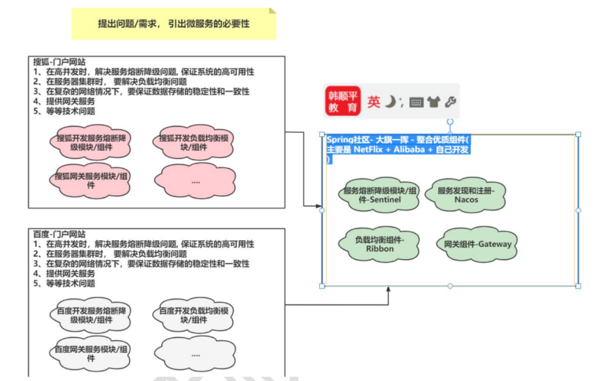
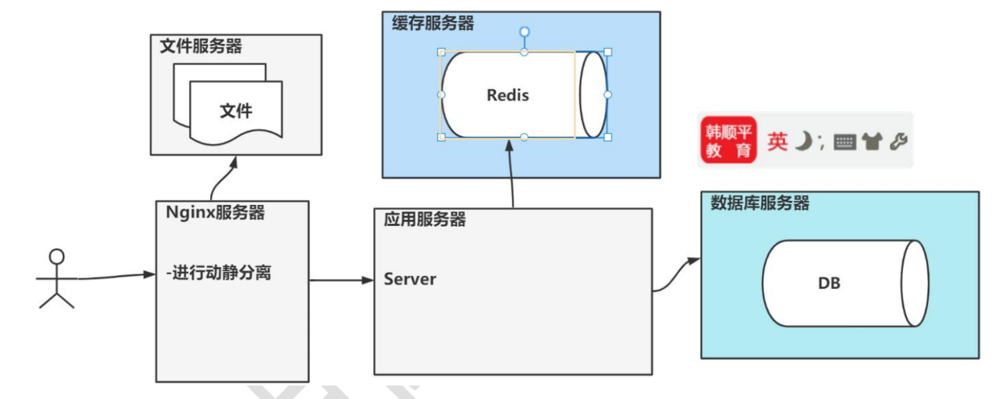
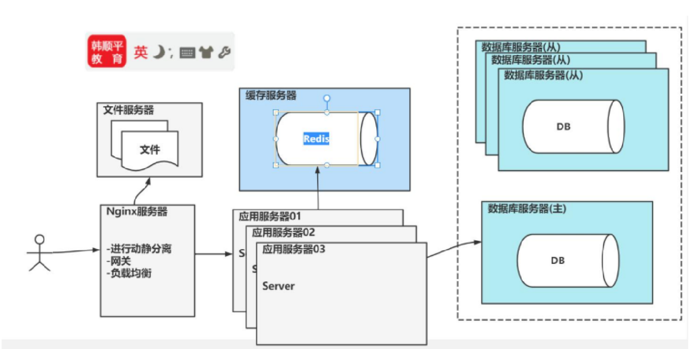
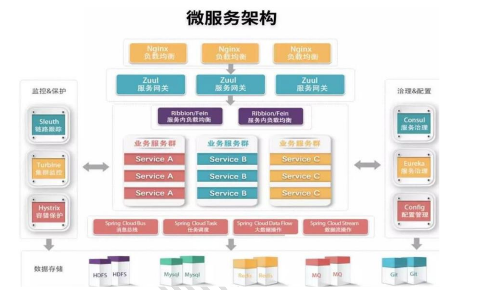
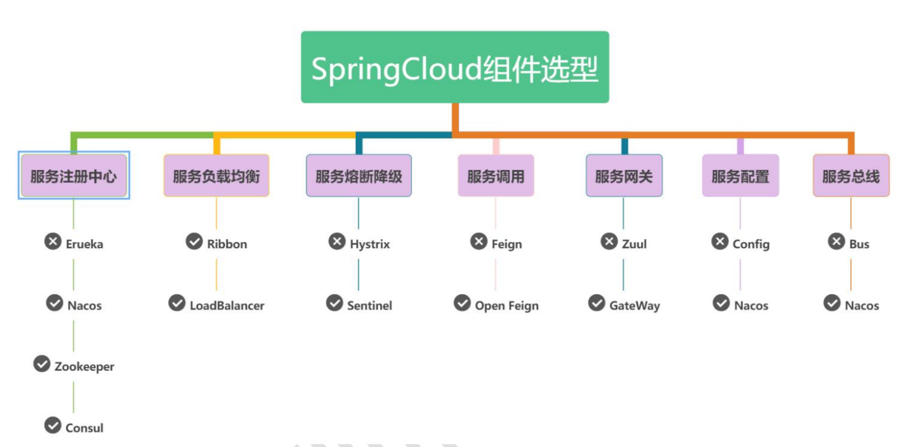

# Spring Cloud & Cloud Alibaba

## 介绍

### Spring Cloud

#### 官方文档

1. https://spring.io/projects/spring-cloud

#### 微服务发展

1. 微服务出现前，程序员如何工作？

    * 微服务出现前，程序员也能开发大型项目，并不是“没有微服务就做不了大系统”。
    * 当时通常会先按照业务功能进行模块划分，例如用户、好友、消息、搜索、支付等模块，再由不同程序员或团队分别实现。
    * 模块之间一般通过 API、自定义协议、RPC 或 HTTP 调用进行协作。很多系统其实已经具备“微服务思想”，只是当时没有成熟、统一、标准化的微服务治理体系。
    * 问题在于，模块之间耦合较高，服务地址管理、负载均衡、限流、熔断、配置管理、监控追踪、高并发通信等基础能力，往往需要程序员自己实现。
    * 课程中提到的新浪好友状态例子就体现了这一点：为了让用户实时看到好友在线状态，系统需要不停轮询或维护状态变化。当时没有成熟统一的方案，程序员不仅要写业务逻辑，还可能要处理底层网络通信、高并发连接、状态缓存、心跳检测，甚至编写 Linux C 等底层代码。
    * 因此，微服务出现前的开发模式可以概括为：**业务模块可以拆，但服务治理能力不成熟；业务代码和底层基础设施代码经常混在一起，开发和维护压力较大。**

2. 微服务的价值是什么？

    * 微服务的价值，不是让程序员“从不能做大项目变成能做大项目”，而是让大型系统的拆分、调用、治理和扩展变得更加标准化。
    * 微服务可以把一个大系统拆分成多个边界清楚的小服务，例如用户服务、好友服务、状态服务、消息服务、网关服务、配置服务、存储服务等。每个服务可以独立开发、独立部署、独立扩容、独立维护。
    * 以新浪好友状态为例，过去可能需要程序员自己实现底层轮询、状态维护、网络通信和高并发处理；微服务体系下，可以把“好友状态”独立成状态服务，再配合缓存、注册中心、网关、限流、监控、配置中心等组件进行治理。
    * Spring Cloud / Spring Cloud Alibaba 的价值，就是把服务注册与发现、负载均衡、远程调用、网关、链路追踪、配置中心、限流熔断、分布式事务等通用能力组件化，让程序员不必每次都从底层重复造轮子。
    * 因此，微服务的核心价值可以概括为：**把大型系统拆得更清楚，把服务调用管得更规范，把高并发和分布式问题交给成熟组件处理，从而提升系统的扩展性、稳定性和可维护性。**

#### 一图胜千言

1. 图解
    

2. 解释

    - 在微服务体系成熟之前，大型互联网公司已经会按照业务模块拆分系统，例如门户网站中的用户、搜索、好友、消息、网关等模块。
    - 但是高并发、服务集群、负载均衡、服务熔断、网关转发、数据一致性等问题，往往需要各家公司自己开发底层组件解决。
    - 图中以搜狐、百度门户网站为例，说明不同公司虽然业务不同，但都会遇到类似的分布式系统问题，例如服务降级、负载均衡、网关服务、数据稳定性等。
    - Spring Cloud / Spring Cloud Alibaba 的价值，就是把这些大厂反复遇到的共性问题抽象出来，整合 Netflix、Alibaba 以及 Spring 自身生态中的优质组件，形成一套标准化的微服务解决方案。
    - 其中，Sentinel 解决服务熔断降级和限流问题，Nacos 解决服务注册发现问题，Ribbon 解决负载均衡问题，Gateway 解决统一网关入口问题。
    - 因此，微服务框架的意义不是让程序员第一次能够开发大型项目，而是让大型项目中的通用分布式问题有一套成熟、统一、可复用的解决方案。


#### 系统架构演变过程

1. 单机架构
    *   **结构**：`用户` -> `应用服务器 (含业务逻辑/静态资源)` -> `数据库服务器`
    *   **特点**：部署简单，但扩展性差，单点故障风险高。
2. 动静分离架构
    静态资源与动态资源分离
    

3. 分布式架构
    *   **定义**：将一个单体系统拆分为多个独立部署的子系统，通过远程调用协议（如 RPC、HTTP）进行协作，以提高系统的处理能力和可靠性。
    *   **结构**：`用户` -> `负载均衡层` -> `服务集群A` / `服务集群B` -> `数据库集群`

    

4. 微服务架构

    *   **结构**：`用户` -> `Nginx` -> `API Gateway` -> `微服务A / 微服务B / 微服务C` -> `注册配置中心(Nacos)` -> `数据库`
    * "微服务" 一词源于 Martin Fowler 的名为 Microservices 的博文，简单地说， 微服务是系统架构上的一种设计风格，它的主旨是将一个原本独立的系统拆分成多个小型服务，这些小型服务都在各自独立的进程中运行，服务之间通过基于 HTTP 的 RESTfulAPI 进行通信协作。
    * 被拆分成的每一个小型服务都围绕着系统中的某一项或一些耦合度较高的业务功能进行构建， 并且每个服务都维护着自身的数据存储、 业务开发、自动化测试案例以及独立部署机制。 由于有轻量级的通信协作基础， 所以这些微服务可以使用不同的语言来编写 , 这里我们使用 java

    

### Spring Cloud 核心组件

1. 核心三组
    - 官方：`Spring Cloud`
    - 阿里：`Spring Cloud Alibaba`
    - 网飞：`Spring Cloud Netflix`

2. Alibaba文档
    https://github.com/alibaba/spring-cloud-alibaba

3. 网飞文档
    https://github.com/Netflix

4. 社区核心组件一览
    - 消息驱动组件：Stream
    - 声明式服务调用组件：Open Feign
    - AIP网关：Gateway
    - 分布式服务跟踪组件：Sleuth
    - 消息总线组件：Bus
    - Config分布式配置中心组件


2. Alibaba核心组件一览
    - 服务降级熔断：Sentinel
    - 服务注册与发现组件：Nacos
    - 分布式事务治理组件：Seata
    - 对象存储组件：Alibaba Cloud OSS

5. Netflix核心组件一览
    - 服务熔断保护组件：Hystrix
    - 网关治理组件：zuul
    - 治理组件：Eureka
    - 客户端负载均衡组件：Ribbon

7. 技术选型
        

### 分布式微服务技术选型

#### Spring Cloud 原生组件的痛点

- 部分 Spring Cloud 原生组件已经停止维护或更新，后续开发和维护不够方便。
- 部分组件环境搭建较复杂，缺少完善的可视化界面。
- 在实际项目中，可能需要大量二次开发和定制。
- 配置相对复杂，初学者上手成本较高。

#### Spring Cloud Alibaba 的优势

- Spring Cloud Alibaba 中的很多组件经过了阿里真实业务场景的检验，具备高并发、高性能、高可用的特点。
- 这些组件设计较成熟，并且已经开源，开发者可以直接使用。
- Spring Cloud Alibaba 通常配套较完善的可视化界面，例如 Nacos 控制台、Sentinel 控制台，方便开发和运维。
- 相比部分 Spring Cloud 原生组件，Spring Cloud Alibaba 搭建更简单，学习曲线相对较低。
- 它可以较好地解决服务注册发现、配置管理、限流熔断、分布式事务等微服务核心问题。

#### 技术选型建议

- 课程建议采用**Spring Cloud Alibaba 组件为主，Spring Cloud 组件为辅**的学习和选型思路。
- Spring Cloud Alibaba 主线组件：
  - Nacos：服务注册与发现、配置中心。
  - Sentinel：服务限流、熔断、降级。
  - Seata：分布式事务治理。
- Spring Cloud 中仍然值得学习和使用的组件：
  - Ribbon：负载均衡。
  - OpenFeign：远程服务调用。
  - Gateway：API 网关。
  - Sleuth：调用链监控。

### 技术栈更新说明

1. 简述
    因相关课程技术栈过于落后，笔记后面部分将依据主流技术栈做出更新，这里列出技术栈对照表

    | 课程技术               | 落后在哪里                       | 现代替代方案                                               | 现在怎么学                             |
    | ------------------ | --------------------------- | ---------------------------------------------------- | --------------------------------- |
    | Java 8             | 不能运行Boot 3/4，语言、JVM能力落后     | Java 17/21/25                                        | 你使用Java 17完全可以                    |
    | Boot 2.2 + Hoxton  | 已结束维护，还是`javax.*`体系         | Boot 4.1 + Cloud 2025.1                              | 当前项目先用Boot 3.5过渡                  |
    | Ribbon             | Spring Cloud已经移除相关集成        | Spring Cloud LoadBalancer                            | 原理保留，代码重写                         |
    | Hystrix            | Netflix停止维护，Spring Cloud已移除 | Spring Cloud CircuitBreaker + Resilience4j，或Sentinel | 学超时、熔断、隔离，不再学Hystrix API          |
    | Sleuth             | 不支持Boot 3及以后                | Micrometer Tracing                                   | 使用Brave或OpenTelemetry桥接           |
    | `bootstrap.yml`    | 旧的早期配置加载机制                  | `spring.config.import`                               | 新项目不要再依赖Bootstrap                 |
    | Seata 0.9配置        | 配置结构、包名、Starter整合均已变化       | Apache Seata 2.6                                     | 原理保留，部署代码重做                       |
    | `RestTemplate`主力调用 | 新主线中已经让位                    | `RestClient`、HTTP Service Clients、`WebClient`        | 旧代码会看，新代码学后面三种                    |
    | MD5密码              | 抗暴力破解能力差，没有合理的密码散列设计        | BCrypt或Argon2                                        | 使用Spring Security PasswordEncoder |

2. by deepseek

    你列出的技术清单里，有一部分（主要是Spring Cloud Netflix组件）已经进入维护状态，不再推荐在新项目中使用。社区和官方目前更推荐你清单里后半部分的Spring Cloud Alibaba组件，以及其他一些云原生方案。

    具体情况可以参考下面这个对比表格：

    | 功能领域 | 你清单中的过时/维护中技术 | 对应的新技术/替代方案 | 说明 |
    | :--- | :--- | :--- | :--- |
    | **服务注册与发现** | **Eureka** | **Nacos** (你清单中已有) <br> **Consul** <br> **Kubernetes Service** | Eureka已基本停更。Nacos集服务发现与配置管理于一体，是国内社区的主流选择。Consul基于Raft协议，提供强一致性。在K8s环境中，其原生服务发现能力是未来趋势。 |
    | **客户端负载均衡** | **Ribbon** | **Spring Cloud LoadBalancer** | Ribbon已被Spring官方标记为维护模式并逐步淘汰。`Spring Cloud LoadBalancer`是官方推荐的替代品，更轻量且与当前生态集成更好。 |
    | **API网关** | **Zuul (1.x)** | **Spring Cloud Gateway** (你清单中已有) | Spring Cloud Gateway是Spring官方为替代Zuul 1.x而推出的新一代网关。它基于响应式编程，性能远超Zuul 1.x。 |
    | **分布式链路追踪** | **Sleuth** | **Micrometer Tracing** | Sleuth已废弃并被移除。核心功能已迁移至Micrometer Tracing，它支持Brave或OpenTelemetry等桥接库。 |
    | **服务容错/流量控制** | (你清单中未列) | **Sentinel** (你清单中已有) | Sentinel是Spring Cloud Alibaba提供的强大的流量控制、熔断降级组件，是目前该领域的主流选择。 |
    | **分布式事务** | (你清单中未列) | **Seata** (你清单中已有) | Seata是Spring Cloud Alibaba生态中解决分布式事务问题的核心组件。 |
    | **配置中心** | (你清单中未列) | **Nacos** (你清单中已有) <br> **Apollo** | Nacos集成了配置管理功能。Apollo是携程开源的配置中心，功能强大，适合大型企业级应用。 |

    💡 关于其他未提及的技术
    你清单中未提及，但微服务架构中常见的组件还包括：

    *   **消息驱动**：**Spring Cloud Stream**，用于构建消息驱动的微服务应用。
    *   **声明式HTTP客户端**：**OpenFeign** (你清单中已有)，它通常与`Spring Cloud LoadBalancer`配合使用。
    *   **远程调用框架**：**Dubbo**，常与ZooKeeper等搭配，是高性能RPC调用的流行选择。

    总的来说，微服务技术栈正从以Netflix OSS为核心，向以Spring Cloud Alibaba和云原生基础设施（如Kubernetes）为核心的方向演进。


## 微服务基础环境

### 基本框架

### 父工程创建（`pom.xml`）

#### 源码

1. 源码

    ```xml
    <?xml version="1.0" encoding="UTF-8"?>
    <project xmlns="http://maven.apache.org/POM/4.0.0"
            xmlns:xsi="http://www.w3.org/2001/XMLSchema-instance"
            xsi:schemaLocation="http://maven.apache.org/POM/4.0.0 https://maven.apache.org/xsd/maven-4.0.0.xsd">
    <modelVersion>4.0.0</modelVersion>

    <groupId>com.lcq.sc</groupId>
    <artifactId>sc-modern</artifactId>
    <version>1.0.0-SNAPSHOT</version>
    <packaging>pom</packaging>
    <name>sc-modern</name>
    <description>Java 17 Spring Cloud Alibaba parent project</description>

    <modules>
        <module>sc-common-api</module>
        <module>member-service-provider</module>
        <module>member-service-consumer</module>
        <module>sc-gateway</module>
    </modules>

    <properties>
        <java.version>17</java.version>
        <maven.compiler.release>${java.version}</maven.compiler.release>
        <project.build.sourceEncoding>UTF-8</project.build.sourceEncoding>
        <project.reporting.outputEncoding>UTF-8</project.reporting.outputEncoding>

        <spring-boot.version>3.5.16</spring-boot.version>
        <spring-cloud.version>2025.0.3</spring-cloud.version>
        <spring-cloud-alibaba.version>2025.0.0.0</spring-cloud-alibaba.version>

        <maven-compiler-plugin.version>3.13.0</maven-compiler-plugin.version>
        <maven-surefire-plugin.version>3.5.2</maven-surefire-plugin.version>
        <maven-enforcer-plugin.version>3.5.0</maven-enforcer-plugin.version>
    </properties>

    <dependencyManagement>
        <dependencies>
            <dependency>
                <groupId>org.springframework.boot</groupId>
                <artifactId>spring-boot-dependencies</artifactId>
                <version>${spring-boot.version}</version>
                <type>pom</type>
                <scope>import</scope>
            </dependency>
            <dependency>
                <groupId>org.springframework.cloud</groupId>
                <artifactId>spring-cloud-dependencies</artifactId>
                <version>${spring-cloud.version}</version>
                <type>pom</type>
                <scope>import</scope>
            </dependency>
            <dependency>
                <groupId>com.alibaba.cloud</groupId>
                <artifactId>spring-cloud-alibaba-dependencies</artifactId>
                <version>${spring-cloud-alibaba.version}</version>
                <type>pom</type>
                <scope>import</scope>
            </dependency>
        </dependencies>
    </dependencyManagement>

    <build>
        <pluginManagement>
            <plugins>
                <plugin>
                    <groupId>org.springframework.boot</groupId>
                    <artifactId>spring-boot-maven-plugin</artifactId>
                    <version>${spring-boot.version}</version>
                </plugin>
                <plugin>
                    <groupId>org.apache.maven.plugins</groupId>
                    <artifactId>maven-compiler-plugin</artifactId>
                    <version>${maven-compiler-plugin.version}</version>
                    <configuration>
                        <release>${maven.compiler.release}</release>
                        <parameters>true</parameters>
                    </configuration>
                </plugin>
                <plugin>
                    <groupId>org.apache.maven.plugins</groupId>
                    <artifactId>maven-surefire-plugin</artifactId>
                    <version>${maven-surefire-plugin.version}</version>
                </plugin>
            </plugins>
        </pluginManagement>
        <plugins>
            <plugin>
                <groupId>org.apache.maven.plugins</groupId>
                <artifactId>maven-enforcer-plugin</artifactId>
                <version>${maven-enforcer-plugin.version}</version>
                <executions>
                    <execution>
                        <id>enforce-build-environment</id>
                        <goals>
                            <goal>enforce</goal>
                        </goals>
                        <configuration>
                            <rules>
                                <requireJavaVersion>
                                    <version>[17,18)</version>
                                </requireJavaVersion>
                                <requireMavenVersion>
                                    <version>[3.9,)</version>
                                </requireMavenVersion>
                            </rules>
                        </configuration>
                    </execution>
                </executions>
            </plugin>
        </plugins>
    </build>
    </project>

    ```

#### POM基本介绍

1. 什么是POM

    POM（`Project Object Model`,项目对象模型），`pom.xml` 是 Maven 项目的配置文件

    它主要回答几个问题：

    - 当前项目叫什么？
    - 当前项目有哪些子模块？
    - 使用哪些依赖？
    - 依赖版本是多少？
    - 使用哪个 Java 版本？
    - 编译、测试、打包时执行哪些插件？
    - 当前模块继承哪个父工程？

    一个最基本的 POM 可以写成：
    ```xml
    <?xml version="1.0" encoding="UTF-8"?>

    <project xmlns="http://maven.apache.org/POM/4.0.0"
            xmlns:xsi="http://www.w3.org/2001/XMLSchema-instance"
            xsi:schemaLocation="
                http://maven.apache.org/POM/4.0.0
                https://maven.apache.org/xsd/maven-4.0.0.xsd">

        <modelVersion>4.0.0</modelVersion>

        <groupId>com.lcq.sc</groupId>
        <artifactId>demo-service</artifactId>
        <version>1.0-SNAPSHOT</version>

    </project>
    ```

2. POM 几大部分

    ```xml
    <project>

        <!-- Maven POM 模型版本 -->
        <modelVersion>4.0.0</modelVersion>

        <!-- 当前父工程的坐标 -->
        <groupId>com.lcq.sc</groupId>
        <artifactId>sc-modern</artifactId>
        <version>1.0.0-SNAPSHOT</version>

        <!-- 表示这是父工程，不生成普通 jar -->
        <packaging>pom</packaging>

        <!-- 聚合哪些子模块 -->
        <modules>
            ...
        </modules>

        <!-- 定义公共变量 -->
        <properties>
            ...
        </properties>

        <!-- 统一管理依赖版本 -->
        <dependencyManagement>
            ...
        </dependencyManagement>

        <!-- 管理编译、测试、打包插件 -->
        <build>
            ...
        </build>

    </project>
    ```

#### POM 模块简介

1. `<modelVersion>`：标识使用`Maven POM x.x.x`模型

2. `<packaging>`：表示打包类型
    - 参数为`pom`：表示这是一个管理子模块、提供公共配置的项目
    - 参数为`jar`等：表示这是一个将被打包成jar的项目，如果子模块不写，则默认为`jar`。

2. `<modules>`：放置当前工程的子模块目录，构建时统一于一次maven构建。

2. `<properties>`：用于集中定义版本号、编码格式等变量
    - 引用时，使用`${xxx}`。


5. 导入BOM
    - 在`<dependencyManagement>`标签下导入官方的版本依赖清单。

6. `<build>`：用于配置项目构建过程，一般存在`<plugins>`和`<pluginManagement>`两个标签
    - java编译
    - 单元测试
    - JAR打包
    - Spring Boot重新打包
    - 环境检查
    - 资源文件处理

7. `<plugins>`：真正启用的插件

8. `<pluginManagement>`：管理插件版本

### 创建中转模块

#### 简介

1. 为了引出不使用SC的痛点，我们通过一个转发的例子说明。

2. 本节采用的是`RestTemplate`该技术已被淘汰，在最新的SpringBoot4及SpringCloud2025中，已由HtpClient等非阻塞中间件替代。

    `RestTemplate` 是同步阻塞式 HTTP 客户端。在当前项目使用的 Spring Framework 6.2 中仍可维护旧代码，但已不适合作为新代码的首选；从 Spring Framework 7.0 开始，它已正式被弃用，并计划在未来版本移除。普通同步调用优先使用 `RestClient`，响应式和流式调用使用 `WebClient`，声明式调用可以使用 Spring HTTP Service Clients。

    还需要区分：

    - `RestClient` 是同步阻塞客户端。
    - `WebClient` 是非阻塞响应式客户端。
    - HTTP Service Clients 是基于注解接口生成的声明式代理。
    - JDK `HttpClient`、Apache HttpClient、Jetty HttpClient 等通常是更底层的 HTTP 实现。
    - Spring `RestClient` 可以建立在这些底层客户端之上。
    - `HttpClient` 不是 Spring Cloud 注册发现、负载均衡和熔断能力的替代品。

3. 本节创建 `member-service-consumer`，让它接收客户端请求，再通过 HTTP 调用 `member-service-provider`。

    本节目的不是把 Consumer 设计成正式业务网关，而是通过最原始的远程调用暴露以下问题：

    - 服务地址写死。
    - Provider 端口变化后需要修改 Consumer。
    - Provider 存在多个实例时，不知道选择哪个。
    - 调用失败时缺少统一的超时、重试、熔断和降级机制。
    - 每个接口都要手动拼接 URL、发送请求和解析响应。

    这些问题会继续引出：

    ```text
    Nacos
    ↓ 服务注册与发现
    Spring Cloud LoadBalancer
    ↓ 多实例选择
    OpenFeign或HTTP Service Clients
    ↓ 声明式调用
    Sentinel或Resilience4j
    ↓ 限流、熔断与降级
    Gateway
    ↓ 统一外部入口
    ```

#### RestTemplate 的定位

`RestTemplate` 是 Spring Framework 提供的同步阻塞式 HTTP 客户端，不属于 Spring Cloud。

它的作用是：

- 构造 HTTP 请求。
- 发送 HTTP 请求。
- 接收 HTTP 响应。
- 将 JSON 响应转换为 Java 对象。

在单体应用中，模块之间可以直接调用 Java 方法：

```java
memberService.getMemberById(1L);
```

当 Provider 和 Consumer 成为两个独立进程后，Consumer 无法直接调用 Provider 内存中的 Java 对象，只能通过 HTTP 等网络协议通信：

```java
restTemplate.getForObject(
        "http://localhost:10001/members/{id}",
        MemberDTO.class,
        1L
);
```

因此课程引入 `RestTemplate` 的核心目的，是先展示最基础的服务间 HTTP 调用，再引出 Spring Cloud 要解决的服务治理问题。

#### RestTemplate 依赖

`RestTemplate` 位于 Spring Web 中。引入下面的依赖后即可使用：

```xml
<dependency>
    <groupId>org.springframework.boot</groupId>
    <artifactId>spring-boot-starter-web</artifactId>
</dependency>
```

不需要再单独添加一个名为 `RestTemplate` 的依赖。

#### 使用 RestClient 改写 Consumer

`RestClient` 是当前项目中最适合替换 `RestTemplate` 的客户端，因为它与原调用一样是同步阻塞模型，不要求把整个项目改造成 WebFlux。

```java
package com.lcq.sc.consumer.service;

import java.time.Duration;

import com.lcq.sc.api.member.dto.MemberDTO;
import org.springframework.beans.factory.annotation.Value;
import org.springframework.boot.http.client.ClientHttpRequestFactoryBuilder;
import org.springframework.boot.http.client.ClientHttpRequestFactorySettings;
import org.springframework.http.client.ClientHttpRequestFactory;
import org.springframework.stereotype.Service;
import org.springframework.web.client.RestClient;

@Service
public class MemberRestClientService {

    private final RestClient restClient;

    public MemberRestClientService(
            RestClient.Builder builder,
            @Value("${remote.member-service.base-url}") String baseUrl) {

        ClientHttpRequestFactorySettings settings =
                ClientHttpRequestFactorySettings.defaults()
                        .withConnectTimeout(Duration.ofSeconds(2))
                        .withReadTimeout(Duration.ofSeconds(3));

        ClientHttpRequestFactory requestFactory =
                ClientHttpRequestFactoryBuilder.detect().build(settings);

        this.restClient = builder
                .baseUrl(baseUrl)
                .requestFactory(requestFactory)
                .build();
    }

    public MemberDTO getMemberById(Long id) {
        return restClient.get()
                .uri("/members/{id}", id)
                .retrieve()
                .body(MemberDTO.class);
    }
}
```

与 `RestTemplate` 对照：

```java
restTemplate.getForObject(
        baseUrl + "/members/{id}",
        MemberDTO.class,
        id
);
```

`RestClient` 写法为：

```java
restClient.get()
        .uri("/members/{id}", id)
        .retrieve()
        .body(MemberDTO.class);
```

二者底层仍然在发送 HTTP 请求，变化主要是 API 风格和后续演进方向。


## 服务注册与发现

### 基本介绍

在没有注册中心时，服务消费者通常直接写死服务提供者的地址：

```java
String url = "http://localhost:10001/member/get/1";
```

这种写法存在以下问题：

* Provider 修改端口后，Consumer 也必须修改代码或配置。
* Provider 部署多个实例后，Consumer 不知道应该调用哪个实例。
* Provider 下线后，Consumer 无法及时感知。
* 服务数量增加后，所有服务地址难以统一维护。

因此，微服务系统通常引入注册中心。

注册中心主要保存：

* 服务名称。
* 服务实例的 IP 地址。
* 服务实例的端口。
* 服务实例的健康状态。
* 服务实例的权重、集群和其他元数据。

例如，会员服务启动两个实例：

```text
member-service-provider
├── 192.168.1.10:10001
└── 192.168.1.11:10001
```

两个实例启动后，都会向注册中心注册。Consumer 调用会员服务时，只需要使用服务名称：

```text
http://member-service-provider/member/get/1
```

完整过程为：

```text
Provider启动
    ↓
向注册中心登记服务名称、IP和端口
    ↓
Consumer向注册中心查询Provider实例
    ↓
注册中心返回可用实例列表
    ↓
LoadBalancer选择一个实例
    ↓
HTTP客户端向该实例发送请求
```

需要注意：

> 注册中心一般不负责转发业务请求，它主要负责保存和提供服务地址。

各组件的职责如下：

| 组件                                | 主要职责             |
| --------------------------------- | ---------------- |
| Eureka/Nacos                      | 保存、发现和管理服务实例     |
| Spring Cloud LoadBalancer         | 从多个实例中选择一个       |
| RestTemplate/RestClient/OpenFeign | 向选中的实例发送HTTP请求   |
| Gateway                           | 接收外部请求并将其路由到内部服务 |

### 服务注册

服务注册是指服务启动后，将自己的信息提交给注册中心。

例如：

```text
服务名称：member-service-provider
IP地址：192.168.1.10
端口：10001
状态：健康
```

Provider 启动后，会完成类似下面的操作：

```text
member-service-provider
        ↓ 注册
注册中心
```

如果同一个服务启动多个实例，它们通常使用相同的服务名称，但具有不同的 IP 或端口。

### 服务发现

服务发现是指 Consumer 根据服务名称，从注册中心获取可用实例。

例如，Consumer 查询：

```text
member-service-provider
```

注册中心返回：

```text
192.168.1.10:10001
192.168.1.11:10001
```

随后，Spring Cloud LoadBalancer 从中选择一个实例，再由 HTTP 客户端发送请求。

因此：

```text
服务发现负责找到实例
负载均衡负责选择实例
HTTP客户端负责调用实例
```

这三者不是同一个功能。

### 老技术：Eureka

Eureka 是 Netflix 开源的服务注册与发现组件，课程中的 Spring Cloud Netflix 技术体系通常使用它。

Eureka 包含两个主要角色：

| 角色            | 作用             |
| ------------- | -------------- |
| Eureka Server | 注册中心服务器，保存服务实例 |
| Eureka Client | 注册或发现服务的微服务应用  |

Provider 和 Consumer 都可以是 Eureka Client：

```text
Eureka Server
    ↑                 ↑
注册Provider       注册Consumer
    ↑                 ↑
Provider           Consumer
```

Consumer 调用 Provider 时，还会从 Eureka Server 获取 Provider 的实例列表。

Spring Cloud Netflix 目前仍提供 Eureka Server 和 Eureka Client，因此不能简单表述为“Eureka 已经被淘汰”。它更适合被称为课程中的旧技术路线。[Spring Cloud Netflix官方文档](https://docs.spring.io/spring-cloud-netflix/reference/spring-cloud-netflix.html)


- Eureka Server 提供注册服务, 各个微服务节点通过配置启动后，会在 Eureka Server 中进行注册，这样 EurekaServer 中的服务注册表中将会存储所有可用服务节点的信息，服务节点的信息可以在界面中直观看到。

- EurekaClient 通过注册中心进行访问, 是一个 Java 客户端，用于简化 Eureka Server 的交互，客户端同时也具备一个内置的、使用轮询(round-robin) 负载算法的负载均衡器。在应用启动后，将会向 Eureka Server 发送心跳(默认周期为 30 秒)。如果 Eureka Server 在多个心跳周期内没有接收到某个节点的心跳，EurekaServer 将会从服务注册表中把这个服务节点移除(默认 90 秒)


- Eureka采用了CS的设计架构，Eureka Server 作为服务注册功能的服务器，它是服务注册中心。

- 系统中的其他微服务，使用 Eureka的客户端连接到 Eureka Server并维持心跳连接，通过 Eureka Server 来监控系统中各个微服务是否正常运行。

- 在服务注册与发现中，有一个注册中心。当服务器启动的时候，会把当前自己服务器的信息 比如 服务地址通讯地址等以别名方式注册到注册中心上。

- 服务消费者或者服务提供者，以服务别名的方式去注册中心上获取到实际的服务提供者通讯地址，然后通过RPC调用服务

### 创建Eureka Server

首先创建一个注册中心模块，例如：

```text
eureka-server
```

添加依赖：

```xml
<dependency>
    <groupId>org.springframework.cloud</groupId>
    <artifactId>spring-cloud-starter-netflix-eureka-server</artifactId>
</dependency>
```

在启动类上添加 `@EnableEurekaServer`：

```java
package com.lcq.sc.eureka;

import org.springframework.boot.SpringApplication;
import org.springframework.boot.autoconfigure.SpringBootApplication;
import org.springframework.cloud.netflix.eureka.server.EnableEurekaServer;

@EnableEurekaServer
@SpringBootApplication
public class EurekaServerApplication {

    public static void main(String[] args) {
        SpringApplication.run(EurekaServerApplication.class, args);
    }
}
```

配置 `application.yml`：

```yaml
server:
  port: 7001

spring:
  application:
    name: eureka-server

eureka:
  client:
    register-with-eureka: false
    fetch-registry: false
    service-url:
      defaultZone: http://localhost:7001/eureka/
```

配置说明：
由于注册中心可能是一个集群，所以单个服务器也可以是client，此时要防止我注册我自己。

* `register-with-eureka: false`：当前注册中心不把自己注册到自己。
* `fetch-registry: false`：当前注册中心不需要从自己获取服务列表。
* `defaultZone`：Eureka Server 的访问地址。

启动后，可以通过下面的地址查看 Eureka 控制台：

```text
http://localhost:7001
```

### Provider注册到Eureka

在 Provider 中添加依赖：

```xml
<dependency>
    <groupId>org.springframework.cloud</groupId>
    <artifactId>spring-cloud-starter-netflix-eureka-client</artifactId>
</dependency>
```

配置 `application.yml`：

```yaml
server:
  port: 10001

spring:
  application:
    name: member-service-provider

eureka:
  client:
    register-with-eureka: true
    fetch-registry: true
    service-url:
      defaultZone: http://localhost:7001/eureka/
  instance:
    prefer-ip-address: true
```

其中：

```yaml
spring:
  application:
    name: member-service-provider
```

决定了服务注册到 Eureka 后使用的服务名称。

旧课程可能会在启动类中添加：

```java
@EnableEurekaClient
```

现代 Spring Cloud 通常只要引入 Eureka Client Starter 并完成配置，就可以通过自动配置注册服务，不必再显式添加该注解。

### Consumer通过Eureka发现服务

Consumer 同样添加 Eureka Client 依赖：

```xml
<dependency>
    <groupId>org.springframework.cloud</groupId>
    <artifactId>spring-cloud-starter-netflix-eureka-client</artifactId>
</dependency>
```

同时添加负载均衡依赖：

```xml
<dependency>
    <groupId>org.springframework.cloud</groupId>
    <artifactId>spring-cloud-starter-loadbalancer</artifactId>
</dependency>
```

旧课程通常配置带有 `@LoadBalanced` 的 `RestTemplate`：

```java
@Configuration
public class RestTemplateConfig {

    @Bean
    @LoadBalanced
    public RestTemplate restTemplate() {
        return new RestTemplate();
    }
}
```

调用时不再写死端口，而是使用服务名称：

```java
String url =
        "http://member-service-provider/member/get/" + id;

Member member = restTemplate.getForObject(
        url,
        Member.class
);
```

处理过程如下：

```text
member-service-provider
        ↓
Eureka返回服务实例列表
        ↓
LoadBalancer选择一个实例
        ↓
将服务名转换为实际IP和端口
        ↓
RestTemplate发送HTTP请求
```

### Eureka集群

单个 Eureka Server 存在单点故障问题：

```text
Provider和Consumer
        ↓
单个Eureka Server
        ↓
Eureka宕机后无法更新注册表
```

虽然 Eureka Client 会在本地缓存服务注册信息，注册中心短暂宕机时，已运行的 Consumer 仍可能继续调用已缓存的 Provider，但会出现以下问题：

* 新启动的服务无法注册。
* 新启动的 Consumer 无法获取注册表。
* 已下线或新增的服务实例无法及时同步。
* 本地缓存逐渐失去时效性。

因此，可以部署多个 Eureka Server 组成集群。

**Eureka集群原理**

Eureka Server 之间采用对等节点结构，不是传统的主从结构。每个 Eureka Server 同时也是 Eureka Client，它们相互注册并复制服务注册信息。

```text
          相互注册与同步
Eureka Server 7001  ←→  Eureka Server 7002
        ↑                        ↑
        └──── Provider注册 ──────┘
        └──── Consumer发现 ──────┘
```

当服务向其中一个 Eureka Server 注册后，该节点会把注册信息同步给其他节点。

例如：

```text
Provider
    ↓ 注册
Eureka Server 7001
    ↓ 同步注册信息
Eureka Server 7002
```

因此，任意一个 Eureka Server 出现故障时，客户端可以连接其他可用节点。Eureka Server 使用内存保存注册表，各节点之间进行注册信息复制；Eureka Client 本身也会缓存注册表。[Spring Cloud Netflix官方文档](https://docs.spring.io/spring-cloud-netflix/reference/spring-cloud-netflix.html#high-availability-zones-and-regions)

**创建双节点Eureka集群**

可以使用同一个 Eureka Server 项目，通过不同的 Profile 启动两个实例。

公共配置 `application.yml`：

```yaml
spring:
  application:
    name: eureka-server
```

节点一配置 `application-peer1.yml`：

```yaml
server:
  port: 7001

eureka:
  instance:
    hostname: peer1

  client:
    register-with-eureka: true
    fetch-registry: true
    service-url:
      defaultZone: http://peer2:7002/eureka/
```

节点二配置 `application-peer2.yml`：

```yaml
server:
  port: 7002

eureka:
  instance:
    hostname: peer2

  client:
    register-with-eureka: true
    fetch-registry: true
    service-url:
      defaultZone: http://peer1:7001/eureka/
```

配置关系为：

```text
peer1:7001 → 注册到peer2:7002
peer2:7002 → 注册到peer1:7001
```

这里不能继续使用单机模式中的配置：

```yaml
register-with-eureka: false
fetch-registry: false
```

因为集群中的 Eureka Server 需要把自己注册到其他节点，并从其他节点获取注册信息。

**配置主机名映射**

如果在同一台 Windows 计算机上进行双节点实验，需要修改：

```text
C:\Windows\System32\drivers\etc\hosts
```

添加：

```text
127.0.0.1 peer1
127.0.0.1 peer2
```

Linux或macOS修改：

```text
/etc/hosts
```

在真实的多服务器环境中，应将主机名分别解析到不同服务器的实际 IP 地址。

**启动两个节点**

先打包项目：

```bash
mvn clean package
```

启动节点一：

```bash
java -jar eureka-server.jar --spring.profiles.active=peer1
```

启动节点二：

```bash
java -jar eureka-server.jar --spring.profiles.active=peer2
```

也可以在 IDEA 中将同一个启动配置复制两份，分别设置程序参数：

```text
--spring.profiles.active=peer1
```

```text
--spring.profiles.active=peer2
```

启动后分别访问：

```text
http://peer1:7001
http://peer2:7002
```

正常情况下，两个控制台都能看到对方节点。

**服务连接Eureka集群**

Provider 和 Consumer 应同时配置多个 Eureka Server 地址：

```yaml
eureka:
  client:
    service-url:
      defaultZone: http://peer1:7001/eureka/,http://peer2:7002/eureka/

  instance:
    prefer-ip-address: true
```

多个地址之间使用英文逗号分隔：

```text
http://peer1:7001/eureka/,
http://peer2:7002/eureka/
```

需要注意，`defaultZone` 是固定的 Map 键名，区分大小写，不能写成：

```yaml
default-zone:
```

Spring Cloud 官方文档明确说明这里必须使用 `defaultZone`。[Eureka Client配置说明](https://docs.spring.io/spring-cloud-netflix/reference/spring-cloud-netflix.html#registering-with-eureka)

**集群故障实验**

可以按照下面的步骤验证集群效果：

* 启动两个 Eureka Server。
* 启动 Provider 和 Consumer。
* 检查两个 Eureka 控制台是否都能看到服务。
* 关闭 `peer1:7001`。
* 继续通过 Consumer 调用 Provider。
* 检查客户端是否转而连接 `peer2:7002`。
* 重新启动 `peer1:7001`，观察注册信息是否恢复同步。

正常情况下：

```text
peer1正常 + peer2正常
    → 服务正常注册与发现

peer1宕机 + peer2正常
    → 客户端通过peer2继续注册与发现

peer1宕机 + peer2宕机
    → 已有客户端可能依靠本地缓存短暂调用
    → 新服务无法注册
    → 注册信息无法继续更新
```

**Eureka集群的特点**

* 多个 Eureka Server 之间相互注册。
* 各节点复制服务注册信息。
* Eureka Server 之间没有固定的主节点。
* 客户端可以配置多个注册中心地址。
* 单个节点故障不会立即导致注册与发现功能完全失效。
* 节点之间采用最终一致性，不保证注册信息瞬间完全一致。
* Eureka 集群只提高注册中心的可用性，不会自动增加 Provider 的业务处理能力。

因此，需要区分：

```text
Eureka Server集群
= 避免注册中心单点故障

Provider服务集群
= 提高业务服务的并发能力和可用性

Spring Cloud LoadBalancer
= 从多个Provider实例中选择一个
```

实验环境可以在同一台计算机上启动两个节点，但生产环境应部署在不同服务器或可用区，否则主机故障时，两个 Eureka 节点仍会同时失效。


### Eureka的主要特点

* 主要负责服务注册与发现。
* 具有客户端注册表缓存。
* 服务实例通过心跳维持注册状态。
* 支持多个 Eureka Server 相互复制注册信息。
* 具有自我保护机制，网络异常时不会立即大量删除实例。
* 与 Spring Cloud Netflix 体系结合紧密。
* 不直接提供完整的配置中心能力。
* 控制台功能相对简单。

Eureka Client 默认会周期性获取注册表，因此服务实例变化不一定立即反映到所有客户端。[Eureka配置属性](https://docs.spring.io/spring-cloud-netflix/reference/configprops.html)

### DiscoveryClient获取服务实例

`DiscoveryClient` 是 Spring Cloud 提供的服务发现统一接口。它可以根据服务名称，从 Eureka、Nacos 等注册中心获取服务实例信息。

需要先区分两个概念：

```text
DiscoveryClient
= 服务发现客户端
= 用来查询注册中心

ServiceInstance
= 某个具体的服务实例
= 包含IP、端口、服务名等信息
```

例如：

```text
DiscoveryClient查询：
member-service-provider

返回多个ServiceInstance：
├── 127.0.0.1:10001
├── 127.0.0.1:10002
└── 127.0.0.1:10003
```

#### DiscoveryClient的来源

项目引入服务发现依赖后，Spring Cloud 会自动向 Spring 容器中注册 `DiscoveryClient` 对象。

使用 Nacos：

```xml
<dependency>
    <groupId>com.alibaba.cloud</groupId>
    <artifactId>spring-cloud-starter-alibaba-nacos-discovery</artifactId>
</dependency>
```

使用 Eureka：

```xml
<dependency>
    <groupId>org.springframework.cloud</groupId>
    <artifactId>spring-cloud-starter-netflix-eureka-client</artifactId>
</dependency>
```

业务代码使用的都是 Spring Cloud 提供的统一接口：

```java
import org.springframework.cloud.client.discovery.DiscoveryClient;
```

底层实际注入的对象则取决于使用的注册中心：

```text
使用Eureka
    → EurekaDiscoveryClient

使用Nacos
    → NacosDiscoveryClient

业务代码
    → 统一使用DiscoveryClient接口
```

因此，从 Eureka 切换到 Nacos 时，查询服务实例的业务代码通常不需要大改。

现代 Spring Cloud 中，只要引入对应的服务发现实现并完成配置，一般不再要求显式添加 `@EnableDiscoveryClient`。[Spring Cloud Commons官方说明](https://docs.spring.io/spring-cloud-commons/reference/spring-cloud-commons/common-abstractions.html)

#### DiscoveryClient的主要方法

`DiscoveryClient` 最常用的两个方法是：

```java
List<String> getServices();
```

获取注册中心中的所有服务名称。

```java
List<ServiceInstance> getInstances(String serviceId);
```

根据服务名称获取该服务的所有实例。[DiscoveryClient接口说明](https://javadoc.io/doc/org.springframework.cloud/spring-cloud-commons/latest/org/springframework/cloud/client/discovery/DiscoveryClient.html)

例如：

```java
List<String> services = discoveryClient.getServices();
```

可能得到：

```text
member-service-provider
member-service-consumer
order-service-provider
```

查询会员服务实例：

```java
List<ServiceInstance> instances =
        discoveryClient.getInstances(
                "member-service-provider"
        );
```

可能得到：

```text
127.0.0.1:10001
127.0.0.1:10002
127.0.0.1:10003
```

#### 查询注册中心中的服务

可以在 Consumer 中编写测试接口：

```java
package com.lcq.memberserviceconsumer.controller;

import org.springframework.cloud.client.ServiceInstance;
import org.springframework.cloud.client.discovery.DiscoveryClient;
import org.springframework.web.bind.annotation.GetMapping;
import org.springframework.web.bind.annotation.PathVariable;
import org.springframework.web.bind.annotation.RequestMapping;
import org.springframework.web.bind.annotation.RestController;

import java.util.List;

@RestController
@RequestMapping("/discovery")
public class DiscoveryController {

    private final DiscoveryClient discoveryClient;

    public DiscoveryController(
            DiscoveryClient discoveryClient
    ) {
        this.discoveryClient = discoveryClient;
    }

    /**
     * 获取注册中心中的全部服务名称
     */
    @GetMapping("/services")
    public List<String> getServices() {
        return discoveryClient.getServices();
    }

    /**
     * 根据服务名称获取全部服务实例
     */
    @GetMapping("/instances/{serviceId}")
    public List<ServiceInstance> getInstances(
            @PathVariable String serviceId
    ) {
        return discoveryClient.getInstances(serviceId);
    }
}
```

访问：

```text
http://localhost:10080/discovery/services
```

可以查看注册中心中的所有服务。

访问：

```text
http://localhost:10080/discovery/instances/member-service-provider
```

可以查看会员服务的全部实例。

返回结果可能类似：

```json
[
  {
    "instanceId": "member-service-provider:10001",
    "serviceId": "member-service-provider",
    "host": "192.168.1.10",
    "port": 10001,
    "secure": false,
    "uri": "http://192.168.1.10:10001",
    "metadata": {}
  },
  {
    "instanceId": "member-service-provider:10002",
    "serviceId": "member-service-provider",
    "host": "192.168.1.10",
    "port": 10002,
    "secure": false,
    "uri": "http://192.168.1.10:10002",
    "metadata": {}
  }
]
```

实际字段和显示格式可能因 Eureka、Nacos 及其版本不同而略有差异。

#### ServiceInstance中的信息

`getInstances()` 返回的是：

```java
List<ServiceInstance>
```

因为同一个服务可能部署多个实例，所以返回的不是一个对象，而是一个集合。

`ServiceInstance` 常用方法如下：

| 方法                | 作用        | 示例                              |
| ----------------- | --------- | ------------------------------- |
| `getInstanceId()` | 获取实例唯一标识  | `member-service-provider:10001` |
| `getServiceId()`  | 获取服务名称    | `member-service-provider`       |
| `getHost()`       | 获取服务主机或IP | `192.168.1.10`                  |
| `getPort()`       | 获取服务端口    | `10001`                         |
| `getUri()`        | 获取完整基础地址  | `http://192.168.1.10:10001`     |
| `isSecure()`      | 是否使用HTTPS | `false`                         |
| `getMetadata()`   | 获取实例元数据   | 权重、集群、版本等                       |

`ServiceInstance` 表示注册中心中的一个服务实例记录。[ServiceInstance接口源码](https://github.com/spring-cloud/spring-cloud-commons/blob/master/spring-cloud-commons/src/main/java/org/springframework/cloud/client/ServiceInstance.java)

可以遍历输出实例信息：

```java
@GetMapping("/info/{serviceId}")
public void printInstanceInfo(
        @PathVariable String serviceId
) {
    List<ServiceInstance> instances =
            discoveryClient.getInstances(serviceId);

    for (ServiceInstance instance : instances) {
        System.out.println(
                "实例ID：" + instance.getInstanceId()
        );
        System.out.println(
                "服务名称：" + instance.getServiceId()
        );
        System.out.println(
                "主机地址：" + instance.getHost()
        );
        System.out.println(
                "服务端口：" + instance.getPort()
        );
        System.out.println(
                "访问地址：" + instance.getUri()
        );
        System.out.println(
                "元数据：" + instance.getMetadata()
        );
    }
}
```

#### 手动选择实例并发起请求

获取服务实例后，可以手动选择一个实例：

```java
List<ServiceInstance> instances =
        discoveryClient.getInstances(
                "member-service-provider"
        );

if (instances.isEmpty()) {
    throw new IllegalStateException(
            "没有可用的会员服务实例"
    );
}

ServiceInstance instance = instances.get(0);

String url = instance.getUri()
        + "/member/get/1";
```

假设第一个实例是：

```text
192.168.1.10:10001
```

最终生成的地址就是：

```text
http://192.168.1.10:10001/member/get/1
```

完整调用示例：

```java
package com.lcq.memberserviceconsumer.service;

import com.lcq.sc.api.dto.MemberDTO;
import org.springframework.cloud.client.ServiceInstance;
import org.springframework.cloud.client.discovery.DiscoveryClient;
import org.springframework.stereotype.Service;
import org.springframework.web.client.RestClient;

import java.util.List;

@Service
public class MemberDiscoveryService {

    private static final String SERVICE_NAME =
            "member-service-provider";

    private final DiscoveryClient discoveryClient;
    private final RestClient restClient;

    public MemberDiscoveryService(
            DiscoveryClient discoveryClient,
            RestClient.Builder builder
    ) {
        this.discoveryClient = discoveryClient;
        this.restClient = builder.build();
    }

    public MemberDTO getMemberById(Long id) {
        List<ServiceInstance> instances =
                discoveryClient.getInstances(
                        SERVICE_NAME
                );

        if (instances.isEmpty()) {
            throw new IllegalStateException(
                    "没有可用的会员服务实例"
            );
        }

        ServiceInstance instance = instances.get(0);

        return restClient.get()
                .uri(
                    instance.getUri()
                            + "/member/get/{id}",
                    id
                )
                .retrieve()
                .body(MemberDTO.class);
    }
}
```

这里选择：

```java
instances.get(0);
```

只是为了演示 `DiscoveryClient` 的工作原理。它始终选择第一个实例，不是真正完善的负载均衡。

#### DiscoveryClient与LoadBalancer的区别

`DiscoveryClient` 只负责查询服务，不负责合理选择实例：

```text
DiscoveryClient
    → 查询member-service-provider
    → 返回10001、10002、10003

LoadBalancer
    → 从三个实例中选择一个
```

| 组件                | 主要职责           |
| ----------------- | -------------- |
| `DiscoveryClient` | 根据服务名获取服务实例列表  |
| `ServiceInstance` | 保存某个具体实例的信息    |
| `LoadBalancer`    | 从多个实例中选择一个     |
| `RestClient`      | 向选中的实例发送HTTP请求 |

手动方式：

```text
DiscoveryClient.getInstances()
        ↓
程序员手动选择ServiceInstance
        ↓
拼接实际IP和端口
        ↓
RestClient发送请求
```

自动负载均衡方式：

```text
RestClient请求服务名称
        ↓
LoadBalancer通过DiscoveryClient获取实例
        ↓
LoadBalancer自动选择ServiceInstance
        ↓
把服务名替换成实际IP和端口
        ↓
RestClient发送请求
```

因此，实际业务中一般不需要手动编写：

```java
instances.get(0);
```

而是使用：

```java
@Bean
@LoadBalanced
public RestClient.Builder restClientBuilder() {
    return RestClient.builder();
}
```

然后直接调用服务名称：

```java
restClient.get()
        .uri(
            "http://member-service-provider/member/get/{id}",
            id
        )
        .retrieve()
        .body(MemberDTO.class);
```

Spring Cloud LoadBalancer 底层仍然需要通过服务发现客户端获得可用实例，然后再执行实例选择。[Spring Cloud LoadBalancer官方说明](https://docs.spring.io/spring-cloud-commons/reference/spring-cloud-commons/loadbalancer.html)

最终可以总结为：

```text
DiscoveryClient
= 我帮你查出有哪些实例

ServiceInstance
= 我代表其中一个具体实例

LoadBalancer
= 我帮你从这些实例中选择一个

RestClient
= 我负责把HTTP请求发过去
```

手动使用 `DiscoveryClient` 适合理解服务发现原理、调试注册信息或实现特殊实例选择逻辑；普通业务调用通常直接使用 `@LoadBalanced RestClient` 或 OpenFeign。


### 新技术：Nacos

Nacos 是 Spring Cloud Alibaba 中常用的注册中心和配置中心。

Nacos 的名称来源于：

```text
Dynamic Naming and Configuration Service
```

它不仅可以完成服务注册与发现，还可以提供：

* 服务健康检查。
* 服务实例管理。
* 权重调整。
* 命名空间隔离。
* 集群管理。
* 动态配置管理。
* 配置历史与回滚。
* 可视化管理控制台。

Nacos 官方将其定位为动态服务发现、配置管理和服务管理平台。[Nacos官方介绍](https://nacos.io/docs/latest/what-is-nacos/)

在 Spring Cloud Alibaba 中，主要使用两个 Starter：

```text
spring-cloud-starter-alibaba-nacos-discovery
    → 服务注册与发现

spring-cloud-starter-alibaba-nacos-config
    → 配置中心
```

本节只使用第一个。

### 启动Nacos Server

Nacos 可以使用安装包、Docker 或 Docker Compose 启动。

安装包单机启动方式：

```bash
startup.cmd -m standalone
```

Linux、macOS 下使用：

```bash
sh startup.sh -m standalone
```

Nacos 3.x 需要区分两个地址：

```text
客户端连接地址：http://127.0.0.1:8848
控制台地址：http://127.0.0.1:8080
```

因此，Spring Boot 项目中的配置仍然是：

```yaml
server-addr: 127.0.0.1:8848
```

不要错误地写成控制台端口 `8080`。

Nacos 3.x 的客户端通常还会使用 `9848` 端口进行 gRPC 通信。因此在 Docker、虚拟机或远程服务器中，需要同时检查相关端口是否放通。[Nacos 3.x端口说明](https://nacos.io/docs/latest/manual/admin/deployment/deployment-overview/)

### Provider注册到Nacos

在 Provider 中添加依赖：

```xml
<dependency>
    <groupId>com.alibaba.cloud</groupId>
    <artifactId>spring-cloud-starter-alibaba-nacos-discovery</artifactId>
</dependency>
```

父工程已经导入 Spring Cloud Alibaba BOM，因此这里不要单独填写版本号。

配置 `application.yml`：

```yaml
server:
  port: 10001

spring:
  application:
    name: member-service-provider

  cloud:
    nacos:
      discovery:
        server-addr: 127.0.0.1:8848
```

启动 Provider 后，它会自动向 Nacos 注册：

```text
member-service-provider
    192.168.1.10:10001
```

通常不需要在启动类上添加：

```java
@EnableDiscoveryClient
```

只要引入 Nacos Discovery Starter 并完成配置，Spring Cloud 的自动配置就会完成服务注册。

Nacos 官方的 Spring Cloud 集成同样使用 `spring-cloud-starter-alibaba-nacos-discovery` 和 `spring.cloud.nacos.discovery.server-addr` 完成注册发现。[Nacos与Spring Cloud集成说明](https://nacos.io/docs/latest/ecology/use-nacos-with-spring-cloud/)

### Consumer接入Nacos

Consumer 添加相同的 Nacos Discovery 依赖：

```xml
<dependency>
    <groupId>com.alibaba.cloud</groupId>
    <artifactId>spring-cloud-starter-alibaba-nacos-discovery</artifactId>
</dependency>
```

同时添加 Spring Cloud LoadBalancer：

```xml
<dependency>
    <groupId>org.springframework.cloud</groupId>
    <artifactId>spring-cloud-starter-loadbalancer</artifactId>
</dependency>
```

Consumer 配置：

```yaml
server:
  port: 10080

spring:
  application:
    name: member-service-consumer

  cloud:
    nacos:
      discovery:
        server-addr: 127.0.0.1:8848
```

Consumer 自己也会注册到 Nacos，同时能够发现 Provider。

### 使用现代RestClient调用服务

在当前 Spring Boot 3.5 项目中，可以使用带负载均衡功能的 `RestClient.Builder`：

```java
package com.lcq.memberserviceconsumer.config;

import org.springframework.cloud.client.loadbalancer.LoadBalanced;
import org.springframework.context.annotation.Bean;
import org.springframework.context.annotation.Configuration;
import org.springframework.web.client.RestClient;

@Configuration
public class RestClientConfig {

    @Bean
    @LoadBalanced
    public RestClient.Builder loadBalancedRestClientBuilder() {
        return RestClient.builder();
    }
}
```

在 Service 中注入并调用：

```java
package com.lcq.memberserviceconsumer.service;

import com.lcq.sc.api.dto.MemberDTO;
import org.springframework.stereotype.Service;
import org.springframework.web.client.RestClient;

@Service
public class MemberRemoteService {

    private final RestClient restClient;

    public MemberRemoteService(RestClient.Builder builder) {
        this.restClient = builder.build();
    }

    public MemberDTO getMemberById(Long id) {
        return restClient.get()
                .uri(
                    "http://member-service-provider/member/get/{id}",
                    id
                )
                .retrieve()
                .body(MemberDTO.class);
    }
}
```

这里的地址：

```text
http://member-service-provider/member/get/{id}
```

并不是实际的网络地址。

执行时会经历：

```text
RestClient读取服务名称
        ↓
Nacos提供可用实例列表
        ↓
LoadBalancer选择一个实例
        ↓
服务名被转换为实际IP和端口
        ↓
RestClient发送HTTP请求
```

### 启动顺序

建议按照下面的顺序启动：

```text
Nacos Server
    ↓
member-service-provider
    ↓
member-service-consumer
```

启动后，在 Nacos 3.x 控制台中应该能够看到：

```text
member-service-provider
member-service-consumer
```

如果看不到服务，需要检查：

* Nacos Server 是否正常启动。
* `server-addr` 是否填写为 `127.0.0.1:8848`。
* 服务与 Nacos 是否位于不同容器或虚拟机。
* 注册的 IP 是否能够被其他服务访问。
* `8848` 和 `9848` 端口是否放通。
* `spring.application.name` 是否已经配置。
* Nacos 鉴权开启后，客户端是否提供了正确的身份信息。

### Eureka与Nacos对比

| 对比项     | Eureka               | Nacos                   |
| ------- | -------------------- | ----------------------- |
| 所属体系    | Spring Cloud Netflix | Spring Cloud Alibaba    |
| 服务注册与发现 | 支持                   | 支持                      |
| 健康检查    | 支持                   | 支持                      |
| 配置中心    | 不直接提供                | 支持                      |
| 服务权重    | 功能较弱                 | 控制台可调整                  |
| 环境隔离    | Region、Zone等         | Namespace、Group、Cluster |
| 管理控制台   | 相对简单                 | 功能较完整                   |
| 当前状态    | 仍然维护                 | 持续活跃开发                  |
| 课程定位    | 理解经典注册中心             | 当前项目实际使用                |

Eureka 和 Nacos 解决的核心问题相同：

```text
服务实例在哪里？
服务实例是否健康？
当前有哪些实例可以调用？
```

主要区别是：

```text
Eureka
    = 重点解决服务注册与发现

Nacos
    = 服务注册与发现
    + 配置中心
    + 服务管理
    + 更完整的可视化控制台
```

### 当前项目的技术选择

当前项目采用：

```text
Spring Boot 3.5.16
Spring Cloud 2025.0.3
Spring Cloud Alibaba 2025.0.0.0
Nacos Discovery
Spring Cloud LoadBalancer
RestClient或OpenFeign
```

Spring Cloud Alibaba `2025.0.0.0` 使用 Nacos Client 3.0.3，因此已经属于 Nacos 3.x 技术线。[Spring Cloud Alibaba 2025.0.0.0发布说明](https://github.com/alibaba/spring-cloud-alibaba/releases)

推荐学习方式为：

```text
先学习Eureka
    ↓
理解注册、发现、心跳和服务名调用
    ↓
再改用Nacos
    ↓
掌握当前Spring Cloud Alibaba项目写法
```

最终应当形成下面的认识：

```text
Eureka不是无用的淘汰技术
    → 仍可用于理解和维护Spring Cloud Netflix项目

Nacos也不是单纯换了一个注册中心
    → 它同时承担服务发现、服务管理和配置中心等职责

当前项目
    → 使用Nacos完成实际开发
    → 使用Eureka理解课程的演进过程
```

## 负载均衡

### Ribbon

#### 基本介绍

1. Spring Cloud Ribbon 是基于 Netflix Ribbon 实现的一套客户端 负载均衡的工具。
2. Ribbon 主要功能是提供客户端负载均衡算法和服务调用
3. Ribbon 客户端组件提供一系列完善的配置项如连接超时，重试等。
4. Ribbon 会基于某种规则（如简单轮询，随机连接等）去连接指定服务
5. 程序员很容易使用 Ribbon 的负载均衡算法实现负载均衡
6. 一句话: Ribbon: 负载均衡+RestTemplate 调用


#### LB(Load Balance)
1. 集中式 LB
    - 即在服务的消费方和提供方之间使用独立的LB设施（可以是硬件，如F5，也可以是软件，如Nginx），由该设施负责把访问请求通过某种策略转发至服务的提供方;
    - LB(Load Balance 负载均衡)
2. 进程内 LB
    - 将LB逻辑集成到消费方，消费方从服务注册中心获知有哪些服务地址可用，然后再从这些地址中选择出一个合适的服务地址。
    - Ribbon就属于进程内LB，它只是一个类库，集成于消费方进程，消费方通过它来获取到服务提供方的地址

### OpenFeign （服务调用）

#### 简介

1. OpenFeign 是什么？（核心定义）
    - **本质**：一个**声明式**的 WebService 客户端。你只需定义一个接口并在上面添加注解，即可完成对远程服务的调用，无需编写繁琐的 HTTP 请求代码。
    - **底层机制**：通过**动态代理**生成实现类，在调用时进行负载均衡并发起远程请求。
    - **核心优势**：让编写 Web Service 客户端变得非常简单。

2. OpenFeign 的核心特性
    - **可插拔**：支持可拔插式的编码器（Encoder）和解码器（Decoder）。
    - **原生集成**：Spring Cloud 对其封装后，完美支持 **Spring MVC 标准注解**（如 `@RequestMapping`）和 `HttpMessageConverters`。
    - **配合服务发现与负载均衡**：可以与 **Eureka**（服务注册/发现）和 **Ribbon**（客户端负载均衡）组合使用，实现服务间带负载均衡的调用。


3. Feign 与 OpenFeign 的区别（重点对比）

    | 对比维度 | **Feign（原生）** | **OpenFeign（Spring Cloud 增强版）** |
    | :--- | :--- | :--- |
    | **所属体系** | Netflix 旗下的独立 HTTP 客户端组件 | Spring Cloud 对 Feign 的封装与增强 |
    | **注解支持** | 只支持 **Feign 自有的注解**（如 `@RequestLine`） | 支持 **Spring MVC 注解**（如 `@RequestMapping`、`@GetMapping`） |
    | **功能完善度** | 轻量级，内置 Ribbon 做负载均衡 | 在 Feign 基础上增加了编码器、解码器、重试等更强大的扩展机制 |
    | **引入依赖** | `feign-core` 等原生依赖 | `spring-cloud-starter-openfeign` |
    | **一句话总结** | 基础实现 | **Feign 的加强版**（实际工作中混用时，通常默认指 OpenFeign） |

    > **精简记忆**：OpenFeign = Feign + 支持 Spring MVC 注解 + 增强功能。

    

4. 工作原理简析
    1. 在启动类上添加 `@EnableFeignClients` 注解，开启扫描。
    2. 在需要调用的接口上使用 `@FeignClient` 注解，并指定要调用的服务名（配合 Eureka）。
    3. Spring 容器启动时，通过动态代理生成接口的实现类。
    4. 调用时，结合 Ribbon 进行负载均衡，选出具体实例，拼接 URL 并发起 HTTP 请求。
    5. 接收响应后，利用解码器将数据转换为目标对象返回给调用方。


5. 官方参考
    - GitHub 地址：https://github.com/spring-cloud/spring-cloud-openfeign
    - Feign 原生参考：https://github.com/OpenFeign/feign

#### 日志配置

1. 基本介绍
    说明: Feign 提供了日志打印功能，可以通过配置来调整日志级别，从而对 Feign 接口的调用情况进行监控和输出
2. 日志级别
    - `NONE`：默认的，不显示任何日志
    - `BASIC`：仅记录请求方法、URL、响应状态码及执行时间;
    - `HEADERS`：除了 BASIC中定义的信息之外，还有请求和响应的头信息; 
    - `FULL`：除了HEADERS中定义的信息之外，还有请求和响应的正文及元数据。

3. 配置日志-应用实例
    ```java
    @Configuration
    public class OpenFeignConfig {

        @Bean
        Logger.Level loggerLevel(){
            //日志级别指定为 FULL
            return Logger.Level.FULL;
        }
    }
    ```
    
2. 修改 application.yml
    常见的日志级别有 5 种，分别是 error、warn、info、debug、trace
    - `error`：错误日志，指比较严重的错误，对正常业务有影响，需要运维配置监控的；
    - `warn`：警告日志，一般的错误，对业务影响不大，但是需要开发关注；
    - `info`：信息日志，记录排查问题的关键信息，如调用时间、出参入参等等；
    - `debug`：用于开发 DEBUG 的，关键逻辑里面的运行时数据；
    - `trace`：最详细的信息，一般这些信息只记录到日志文件中。

    ```yml
    eureka:
        client:
            register-with-eureka: true #将自己注册到 EurekaServer
            fetchRegistry: true #配置从 EurekaServer 抓取其它服务注册信息
            service-url:
                defaultZone: http://eureka9001.com:9001/eureka,
                http://eureka9002.com:9002/eureka
    logging:
        level:
            #对 MemberFeignService 接口调用过程 打印的日志信息-debug 级别
            com.hspedu.springcloud.service.MemberFeignService: debug
    ```

#### 调用超时

1. Openfeign默认1s超时

2. 配置
    ```yml
    ribbon:
        #设置 feign 客户端超时时间（openFeign 默认支持 ribbon)
        #指的是建立连接后从服务器读取到可用资源所用的时间，
        #时间单位是毫秒
        ReadTimeout: 8000
        #指的是建立连接所用的时间，适用于网络状况正常的情况下，
        #两端连接所用的时间
        ConnectTimeout: 8000
    ```

## 负载均衡

### 负载均衡的基本概念

负载均衡是指将请求分配给同一个服务的多个实例，避免所有请求都集中到某一个实例。

例如，会员服务部署了三个实例：

```text
member-service-provider
├── 192.168.1.10:10001
├── 192.168.1.11:10001
└── 192.168.1.12:10001
```

Consumer 调用会员服务时，需要从这三个实例中选择一个：

```text
Consumer发起请求
        ↓
获得会员服务实例列表
        ↓
负载均衡器选择一个实例
        ↓
向选中的实例发送请求
```

负载均衡主要解决以下问题：

* 分散请求压力。
* 提高系统并发处理能力。
* 避免某个实例长期过载。
* 某个实例故障时，可以继续调用其他实例。
* 为服务水平扩容提供基础。

需要注意：

```text
服务集群
= 同一个服务部署多个实例

服务发现
= 找出当前有哪些可用实例

负载均衡
= 从可用实例中选择一个

HTTP客户端
= 向选中的实例发送请求
```

负载均衡并不负责启动服务实例，也不负责保存业务数据。

### 服务端负载均衡与客户端负载均衡

负载均衡可以分为服务端负载均衡和客户端负载均衡。

| 对比项       | 服务端负载均衡               | 客户端负载均衡                          |
| --------- | --------------------- | -------------------------------- |
| 负载均衡器位置   | 服务调用方与服务实例之间          | 服务调用方内部                          |
| 实例选择者     | Nginx、Gateway、硬件负载均衡器 | Ribbon、Spring Cloud LoadBalancer |
| 调用方是否知道实例 | 不知道                   | 知道实例列表                           |
| 实例来源      | 静态配置或服务发现             | 通常来自注册中心                         |
| 常见用途      | 外部流量进入系统              | 微服务之间相互调用                        |

服务端负载均衡：

```text
浏览器
   ↓
Nginx
   ├── Provider 10001
   ├── Provider 10002
   └── Provider 10003
```

浏览器只知道 Nginx 的地址，由 Nginx 选择后端服务器。

客户端负载均衡：

```text
Consumer
   ↓
DiscoveryClient查询注册中心
   ↓
获得10001、10002、10003
   ↓
LoadBalancer选择一个实例
   ↓
发送HTTP请求
```

这里的“客户端”不是浏览器，而是发起服务调用的微服务。

例如：

```text
member-service-consumer
```

相对于 Provider 来说，它就是客户端。

### 常见负载均衡算法


| 算法    | 工作方式           | 特点              |
| ----- | -------------- | --------------- |
| 轮询    | 按顺序依次选择实例      | 简单、常用           |
| 随机    | 随机选择一个实例       | 实现简单            |
| 加权轮询  | 权重越大的实例获得越多请求  | 适合配置不同的服务器      |
| 加权随机  | 根据权重随机选择       | 兼顾随机性与实例性能      |
| 最少连接  | 选择当前连接数最少的实例   | 适合请求处理时间差异较大的场景 |
| 最快响应  | 选择历史响应速度较快的实例  | 需要收集响应时间        |
| IP哈希  | 根据客户端IP固定选择实例  | 可以实现一定程度的会话保持   |
| 一致性哈希 | 相同业务键尽量落到相同实例  | 常用于缓存和分片        |
| 区域优先  | 优先选择同区域或同机房实例  | 减少跨机房调用         |
| 元数据筛选 | 根据版本、集群、标签选择实例 | 适合灰度发布和环境隔离     |

轮询不等于真正的负载绝对均衡。

例如：

```text
实例A处理请求需要10毫秒
实例B处理请求需要5秒
```

即使请求数量相同，实例 B 的实际负载也可能更高。

### Ribbon旧负载均衡方案

Ribbon 是 Netflix 开源的客户端负载均衡组件，曾经是 Spring Cloud Netflix 的核心组件之一。

经典调用链为：

```text
RestTemplate
     ↓
Ribbon
     ↓
Eureka
     ↓
获得服务实例列表
     ↓
IRule选择实例
     ↓
发送HTTP请求
```

Ribbon 主要负责：

* 从服务实例列表中选择实例。
* 实现轮询、随机、响应时间等算法。
* 与 Eureka 服务发现结合。
* 将服务名称转换为实际 IP 和端口。

Netflix 已将 Ribbon 置于维护模式，当前 Spring Cloud 新项目不再使用 Ribbon。[Ribbon项目状态](https://github.com/Netflix/ribbon)

**旧项目依赖**

旧版 Spring Cloud 项目可能显式引入：

```xml
<dependency>
    <groupId>org.springframework.cloud</groupId>
    <artifactId>spring-cloud-starter-netflix-ribbon</artifactId>
</dependency>
```

某些旧版本的 Eureka Client、Feign 或 Zuul 也会间接引入 Ribbon。

当前项目不要再添加该依赖。

**配置RestTemplate**

```java
package com.lcq.memberserviceconsumer.config;

import org.springframework.cloud.client.loadbalancer.LoadBalanced;
import org.springframework.context.annotation.Bean;
import org.springframework.context.annotation.Configuration;
import org.springframework.web.client.RestTemplate;

@Configuration
public class RestTemplateConfig {

    @Bean
    @LoadBalanced
    public RestTemplate restTemplate() {
        return new RestTemplate();
    }
}
```

调用服务：

```java
@Service
public class MemberRemoteService {

    private final RestTemplate restTemplate;

    public MemberRemoteService(RestTemplate restTemplate) {
        this.restTemplate = restTemplate;
    }

    public MemberDTO getMemberById(Long id) {
        return restTemplate.getForObject(
                "http://member-service-provider/member/get/{id}",
                MemberDTO.class,
                id
        );
    }
}
```

这里使用的是服务名称：

```text
member-service-provider
```

Ribbon 会把它转换成类似下面的实际地址：

```text
http://192.168.1.10:10001/member/get/1
```

**Ribbon中的IRule**

Ribbon 使用 `IRule` 接口表示负载均衡规则。

| 实现类                         | 作用            |
| --------------------------- | ------------- |
| `RoundRobinRule`            | 轮询选择实例        |
| `RandomRule`                | 随机选择实例        |
| `RetryRule`                 | 在原有规则基础上增加重试  |
| `WeightedResponseTimeRule`  | 根据响应时间计算权重    |
| `BestAvailableRule`         | 选择并发请求较少的可用实例 |
| `AvailabilityFilteringRule` | 过滤故障或高并发实例    |
| `ZoneAvoidanceRule`         | 综合区域和实例可用性选择  |

| 策略名 | 描述 |
|---|---|
| BestAvailableRule | 选择一个最小的并发请求的server。逐个考察Server，如果Server被tripped（跳闸）了，则忽略，再选择其中ActiveRequestsCount最小的server。 |
| AvailabilityFilteringRule | 过滤掉那些因为一直连接失败的被标记为circuit tripped的后端server，并过滤掉那些高并发的后端server（active connections超过配置的阈值）。 |
| WeightedResponseTimeRule | 根据响应时间分配一个weight，响应时间越长，weight越小，被选中的可能性越低。 |
| RetryRule | 对选定的负载均衡策略机上重试机制。在一个配置时间段内当选择server不成功，则一直尝试使用subRule的方式选择一个可用的server。 |
| RoundRobinRule | 轮询index，选择index对应位置的server。 |
| RandomRule | 随机选择一个server。在index上随机，选择index对应位置的server。 |
| ZoneAvoidanceRule | 复合判断server所在区域的性能和server的可用性选择server。 |

配置随机规则：

```java
import com.netflix.loadbalancer.IRule;
import com.netflix.loadbalancer.RandomRule;
import org.springframework.context.annotation.Bean;

public class RibbonRuleConfig {

    @Bean
    public IRule ribbonRule() {
        return new RandomRule();
    }
}
```

然后为指定服务启用：

```java
@SpringBootApplication
@RibbonClient(
        name = "member-service-provider",
        configuration = RibbonRuleConfig.class
)
public class MemberServiceConsumerApplication {
}
```

Ribbon 的规则配置类通常需要放在主启动类默认扫描范围之外，否则可能影响所有 Ribbon 客户端。

旧版本也可以通过配置文件指定：

```yaml
member-service-provider:
  ribbon:
    NFLoadBalancerRuleClassName: >
      com.netflix.loadbalancer.RandomRule
```

这些写法只用于理解和维护旧项目。

### Spring Cloud LoadBalancer新方案

Spring Cloud LoadBalancer 是 Spring Cloud 官方提供的客户端负载均衡组件，用来替代 Ribbon。

当前项目采用：

```text
Nacos Discovery
        +
Spring Cloud LoadBalancer
        +
RestClient或OpenFeign
```

添加依赖：

```xml
<dependency>
    <groupId>org.springframework.cloud</groupId>
    <artifactId>spring-cloud-starter-loadbalancer</artifactId>
</dependency>
```

同时需要服务发现依赖：

```xml
<dependency>
    <groupId>com.alibaba.cloud</groupId>
    <artifactId>
        spring-cloud-starter-alibaba-nacos-discovery
    </artifactId>
</dependency>
```

Spring Cloud LoadBalancer 可以与 Eureka、Nacos、Consul、Zookeeper 等服务发现实现配合使用。

### 使用RestClient实现负载均衡

当前 Spring Boot 3.5 项目可以使用 `RestClient` 完成同步 HTTP 调用。

配置带负载均衡功能的 `RestClient.Builder`：

```java
package com.lcq.memberserviceconsumer.config;

import org.springframework.cloud.client.loadbalancer.LoadBalanced;
import org.springframework.context.annotation.Bean;
import org.springframework.context.annotation.Configuration;
import org.springframework.web.client.RestClient;

@Configuration
public class RestClientConfig {

    @Bean
    @LoadBalanced
    public RestClient.Builder loadBalancedRestClientBuilder() {
        return RestClient.builder();
    }
}
```

在 Service 中调用：

```java
package com.lcq.memberserviceconsumer.service;

import com.lcq.sc.api.dto.MemberDTO;
import org.springframework.stereotype.Service;
import org.springframework.web.client.RestClient;

@Service
public class MemberRemoteService {

    private final RestClient restClient;

    public MemberRemoteService(
            RestClient.Builder restClientBuilder
    ) {
        this.restClient = restClientBuilder.build();
    }

    public MemberDTO getMemberById(Long id) {
        return restClient.get()
                .uri(
                    "http://member-service-provider/member/get/{id}",
                    id
                )
                .retrieve()
                .body(MemberDTO.class);
    }
}
```

执行过程为：

```text
RestClient读取URL
        ↓
识别member-service-provider为服务名称
        ↓
LoadBalancer获取服务实例列表
        ↓
选择一个ServiceInstance
        ↓
服务名替换为实际IP和端口
        ↓
RestClient发送HTTP请求
```

Spring Cloud LoadBalancer 默认提供轮询选择方式，也提供随机、权重、区域、健康检查、实例缓存和提示筛选等扩展能力。[Spring Cloud LoadBalancer官方文档](https://docs.spring.io/spring-cloud-commons/reference/spring-cloud-commons/loadbalancer.html)

### 配置随机负载均衡

可以为指定服务配置 `RandomLoadBalancer`：

```java
import org.springframework.cloud.client.ServiceInstance;
import org.springframework.cloud.loadbalancer.annotation.LoadBalancerClient;
import org.springframework.cloud.loadbalancer.core.RandomLoadBalancer;
import org.springframework.cloud.loadbalancer.core.ReactorLoadBalancer;
import org.springframework.cloud.loadbalancer.core.ServiceInstanceListSupplier;
import org.springframework.cloud.loadbalancer.support.LoadBalancerClientFactory;
import org.springframework.context.annotation.Bean;
import org.springframework.core.env.Environment;

public class RandomLoadBalancerConfig {

    @Bean
    ReactorLoadBalancer<ServiceInstance> randomLoadBalancer(
            Environment environment,
            LoadBalancerClientFactory factory
    ) {
        String serviceId = environment.getProperty(
                LoadBalancerClientFactory.PROPERTY_NAME
        );

        return new RandomLoadBalancer(
                factory.getLazyProvider(
                        serviceId,
                        ServiceInstanceListSupplier.class
                ),
                serviceId
        );
    }
}
```

为会员服务启用：

```java
@Configuration
@LoadBalancerClient(
        name = "member-service-provider",
        configuration = RandomLoadBalancerConfig.class
)
public class LoadBalancerConfig {
}
```

自定义 LoadBalancer 配置类也不应被普通组件扫描提前加载，否则可能变成所有服务共用的全局配置。

普通项目初期一般使用默认轮询即可，不需要过早自定义算法。

### 普通RestClient与负载均衡RestClient

如果项目既要调用注册中心中的微服务，又要调用外部固定地址，可以创建两个 Builder：

```java
@Configuration
public class RestClientConfig {

    @Bean
    @LoadBalanced
    public RestClient.Builder loadBalancedBuilder() {
        return RestClient.builder();
    }

    @Bean
    @Primary
    public RestClient.Builder plainBuilder() {
        return RestClient.builder();
    }
}
```

注入负载均衡 Builder：

```java
public MemberRemoteService(
        @LoadBalanced RestClient.Builder builder
) {
    this.restClient = builder.build();
}
```

它适合调用：

```text
http://member-service-provider/member/get/1
```

普通 Builder 适合调用：

```text
https://api.example.com/data
```

不要使用带负载均衡的客户端调用任意外部域名，否则 LoadBalancer 可能把域名当成注册中心中的服务名称。

### LoadBalancer与DiscoveryClient的关系

```text
DiscoveryClient
= 查询服务实例

ServiceInstance
= 表示一个具体实例

LoadBalancer
= 从实例列表中选择一个

RestClient
= 发送HTTP请求
```

完整关系为：

```text
RestClient
    ↓
Spring Cloud LoadBalancer
    ↓
DiscoveryClient
    ↓
Nacos或Eureka
    ↓
ServiceInstance列表
    ↓
选择一个实例
```

`DiscoveryClient` 本身不等于负载均衡器。

下面的写法只是手动选择第一个实例：

```java
List<ServiceInstance> instances =
        discoveryClient.getInstances(
                "member-service-provider"
        );

ServiceInstance instance = instances.get(0);
```

它不能实现合理的轮询、随机或故障切换。

### LoadBalancer与OpenFeign的关系

OpenFeign 负责声明式服务调用：

```java
@FeignClient(name = "member-service-provider")
public interface MemberFeignClient {

    @GetMapping("/member/get/{id}")
    MemberDTO getMemberById(@PathVariable Long id);
}
```

Spring Cloud LoadBalancer 负责为 OpenFeign 选择具体实例。

```text
OpenFeign
= 根据Java接口生成HTTP请求

LoadBalancer
= 选择服务实例

Nacos
= 提供实例列表
```

因此：

```text
OpenFeign不是负载均衡器
```

如果项目没有引入 LoadBalancer，OpenFeign 就无法依靠服务名称完成客户端负载均衡。

### 负载均衡与重试

负载均衡只是选择实例，不代表请求失败后一定会自动调用其他实例。

```text
选择实例
    ≠
失败后自动重试
```

重试需要单独配置，并且应注意：

* GET 等幂等请求通常可以谨慎重试。
* 新增订单、扣款等非幂等请求不能随意重试。
* 重试次数过多可能放大服务压力。
* 请求超时之后，原服务可能已经完成业务操作。
* 重试必须配合幂等控制、超时、熔断和降级。

例如：

```text
Consumer调用Provider A
        ↓
请求超时
        ↓
Consumer改为调用Provider B
        ↓
Provider A实际上也完成了写操作
        ↓
可能产生重复数据
```

因此，负载均衡不能替代业务幂等设计。

### 负载均衡与Session问题

如果登录状态保存在某个实例本地：

```text
第一次请求 → Provider 10001 → 登录成功
第二次请求 → Provider 10002 → 找不到Session
```

常见解决方式包括：

* 使用 JWT 等无状态令牌。
* 使用 Redis 共享 Session。
* 将登录状态统一交给认证服务。
* 使用会话保持，但不能把它作为唯一可靠方案。

会话保持会削弱负载均衡效果，并且当固定实例故障时仍然需要处理状态迁移问题。

### 负载均衡常见错误

**调用时写死端口**

错误：

```java
http://localhost:10001/member/get/1
```

这样无法使用服务发现和负载均衡。

正确：

```java
http://member-service-provider/member/get/1
```

**没有添加LoadBalancer依赖**

可能出现：

```text
UnknownHostException:
member-service-provider
```

因为普通 HTTP 客户端会把服务名当成真实 DNS 域名。

**没有添加@LoadBalanced**

即使依赖存在，如果 Builder 没有经过负载均衡增强，也无法解析服务名称。

**服务名称不一致**

Provider：

```yaml
spring:
  application:
    name: member-service-provider
```

Consumer 调用时必须使用：

```text
member-service-provider
```

**注册中心没有可用实例**

需要检查：

* Provider 是否成功注册。
* Nacos 中实例是否健康。
* Namespace、Group、Cluster 是否一致。
* 服务 IP 是否可以从 Consumer 访问。
* Consumer 是否连接到正确的 Nacos。
* 服务实例是否已经下线。
* 服务名称大小写是否一致。

### Ribbon与LoadBalancer对比

| 对比项    | Ribbon  | Spring Cloud LoadBalancer |
| ------ | ------- | ------------------------- |
| 所属体系   | Netflix | Spring Cloud              |
| 当前状态   | 维护模式    | 当前方案                      |
| 主要规则接口 | `IRule` | `ReactorLoadBalancer`     |
| 服务实例来源 | Eureka等 | `DiscoveryClient`         |
| 同步调用   | 支持      | 支持                        |
| 响应式调用  | 支持有限    | 原生支持                      |
| 当前项目   | 不使用     | 使用                        |

当前项目应记成：

```text
Ribbon
    ↓ 被替代
Spring Cloud LoadBalancer
```

---

## 网关

### 网关的基本概念

网关是整个微服务系统对外提供的统一入口。

没有网关时：

```text
前端
├── 调用会员服务10001
├── 调用订单服务11001
├── 调用商品服务12001
└── 调用支付服务13001
```

前端需要知道每个微服务的实际地址和端口。

使用网关后：

```text
前端
   ↓
Gateway
   ├── 会员服务
   ├── 订单服务
   ├── 商品服务
   └── 支付服务
```

前端只需要知道网关地址：

```text
http://localhost:9000
```

例如：

```text
http://localhost:9000/api/member/1
http://localhost:9000/api/order/1001
http://localhost:9000/api/product/2001
```

Gateway 根据路径将请求转发到对应服务。

### 网关的主要职责

网关通常承担以下公共功能：

* 请求路由。
* 服务发现。
* 负载均衡。
* 统一身份认证。
* 权限初步校验。
* 跨域处理。
* 请求日志。
* 链路标识。
* 限流。
* 熔断与降级。
* 请求重试。
* 请求头处理。
* 路径改写。
* 灰度发布。
* API版本控制。
* 统一异常响应。
* 监控与指标收集。

不适合放在网关中的内容：

* 具体业务逻辑。
* 数据库 CRUD。
* 复杂订单计算。
* 会员积分计算。
* 业务事务。
* 服务内部领域规则。

正确分工为：

```text
Gateway
= 入口和通用横切逻辑

Controller
= 接收具体业务请求

Service
= 执行业务规则

Mapper
= 操作数据库
```

1. Route(路由) 
    路由是构建网关的基本模块，它由 ID，目标 URI，一系列的断言和过滤器组成，如果断言为 true 则匹配该路由

2. Predicate(断言)
    - 对 HTTP 请求中的所有内容（例如请求头或请求参数）进行匹配，如果请求与断言相匹配则进行路由
    - 简单举例: 比如配置路径, 
        ```yml
        Path=/member/get/** #断言,路径相匹配的进行路由转发 , 如果 Http 请求的路径不匹配, 则不进行路由转发. 
        ```
3. Filter(过滤)
    - 一句话: 使用过滤器，可以在请求被路由前或者之后对请求进行处理
    - 你可以理解成, 在对 Http 请求断言匹配成功后, 可以通过网关的过滤机制, 对 Http 请求处理
    - 简单举例:
        ```yml
        filter:
            - AddRequestParameter=color, blue 
            #过滤器在匹配的请求头加上一对请求头，名称为 color 值为 blue, 比如原来的 http 请求是 `http://localhost:10000/member/get/1` ==过滤器处理=> `http://localhost:10000/member/get/1?color=blue`
        ```

### 配置类举例

```java
@Configuration
public class GatewayRoutesConfig {

    @Bean
    public RouteLocator customRoutes(RouteLocatorBuilder builder) {
        return builder.routes()
                .route("route_id_1", r -> r          // 开始定义第一个路由
                        .path("/api/**")             // 断言
                        .filters(f -> {              // 过滤器链
                            f.stripPrefix(1);
                            f.addRequestHeader("X-Request-Foo", "Bar");
                            return f;
                        })
                        .uri("http://example.com")   // 目标地址
                )
                .route("route_id_2", r -> r
                        .host("**.example.com")
                        .uri("lb://service-name")
                )
                .build();                            // 构建完成
    }
}
```

### Gateway工作流程
1. 客户端向 Spring Cloud Gateway 发出请求。然后在 Gateway Handler Mapping 中找到与请求相匹配的路由，将其发送到 Gateway Web Handler。
2. Handler 再通过指定的过滤器链来将请求发送到我们实际的服务执行业务逻辑，然后返回。
3. 过滤器之间用虚线分开是因为过滤器可能会在发送代理请求之前（"pre"）或之后（"post"）执行业务逻辑。
4. Filter 在"pre"类型的过滤器可以做参数校验、权限校验、流量监控、日志输出、协议转换等，
5. 在"post"类型的过滤器中可以做响应内容、响应头的修改，日志的输出，流量监控等有着非常重要的作用。

### 网关、注册中心和负载均衡器的关系

```text
Nacos
= 服务在哪里

Gateway
= 请求应该进入哪个服务

LoadBalancer
= 请求应该进入该服务的哪个实例
```

完整调用过程：

```text
浏览器请求Gateway
        ↓
Gateway根据Predicate匹配路由
        ↓
根据服务名查询Nacos
        ↓
LoadBalancer选择服务实例
        ↓
Gateway执行过滤器
        ↓
转发到具体Provider
        ↓
将响应返回浏览器
```

因此：

```text
Gateway不是注册中心
Gateway也不是单纯的LoadBalancer
```

Gateway 内部可以使用 Spring Cloud LoadBalancer。

### Zuul旧网关方案

Zuul 是 Netflix 开源的七层网关，曾经是 Spring Cloud Netflix 的主要网关组件。

经典技术组合为：

```text
Eureka
+ Ribbon
+ Feign
+ Hystrix
+ Zuul
```

Zuul 可以完成：

* 动态路由。
* 请求过滤。
* 身份校验。
* 请求监控。
* 服务负载均衡。
* 故障处理。

Zuul 项目本身仍然存在，但旧版 Spring Cloud Zuul 集成已经不是当前 Spring Cloud 项目的主流选择。[Netflix Zuul项目](https://github.com/Netflix/zuul)

**旧版依赖**

```xml
<dependency>
    <groupId>org.springframework.cloud</groupId>
    <artifactId>
        spring-cloud-starter-netflix-zuul
    </artifactId>
</dependency>
```

**旧版启动类**

```java
@SpringBootApplication
@EnableZuulProxy
public class ZuulGatewayApplication {

    public static void main(String[] args) {
        SpringApplication.run(
                ZuulGatewayApplication.class,
                args
        );
    }
}
```

**旧版路由配置**

```yaml
server:
  port: 9000

spring:
  application:
    name: zuul-gateway

zuul:
  routes:
    member-service:
      path: /api/member/**
      service-id: member-service-provider
      strip-prefix: true

eureka:
  client:
    service-url:
      defaultZone: http://localhost:7001/eureka/
```

请求：

```text
http://localhost:9000/api/member/get/1
```

经过路径处理后转发到：

```text
http://member-service-provider/member/get/1
```

**Zuul过滤器类型**

| 类型      | 执行阶段  | 典型用途       |
| ------- | ----- | ---------- |
| `pre`   | 路由前   | 认证、日志、参数检查 |
| `route` | 路由时   | 请求转发       |
| `post`  | 路由后   | 响应头、统计     |
| `error` | 发生异常时 | 异常处理       |

Zuul 1 主要建立在传统 Servlet 阻塞模型上。Zuul 2 转向异步模型，但没有成为 Spring Cloud Netflix 中广泛使用的正式后继集成方案。

对于 Spring Cloud 项目，可以直接记成：

```text
Zuul
    ↓
Spring Cloud Gateway
```

### Spring Cloud Gateway新方案

Spring Cloud Gateway 是 Spring Cloud 官方网关，当前项目使用它替代 Zuul。

它提供：

* 路由。
* 断言。
* 过滤器。
* 服务发现。
* 负载均衡。
* 限流。
* 熔断。
* 重试。
* 监控。
* WebSocket转发。

Spring Cloud Gateway 当前提供两个主要服务器版本：

| 版本                     | 底层技术                  | 运行环境                   |
| ---------------------- | --------------------- | ---------------------- |
| Gateway Server WebFlux | WebFlux、Reactor、Netty | 响应式、非阻塞                |
| Gateway Server Web MVC | Spring MVC函数式API      | Tomcat、Jetty等Servlet容器 |

当前微服务网关项目推荐先使用 WebFlux 版本。

### 当前项目的Gateway版本写法

当前项目使用：

```text
Spring Boot 3.5.x
Spring Cloud 2025.0.3
Spring Cloud Gateway 4.3.x
```

Spring Cloud 2025.0 将 Gateway Starter 和配置前缀进行了重命名：

| 旧写法                                | 当前写法                                          |
| ---------------------------------- | --------------------------------------------- |
| `spring-cloud-starter-gateway`     | `spring-cloud-starter-gateway-server-webflux` |
| `spring.cloud.gateway.routes`      | `spring.cloud.gateway.server.webflux.routes`  |
| `spring-cloud-starter-gateway-mvc` | `spring-cloud-starter-gateway-server-webmvc`  |

旧名称仍可能暂时兼容，但已经被标记为弃用，会输出迁移警告。当前项目直接采用新名称。[Spring Cloud 2025.0发布说明](https://github.com/spring-cloud/spring-cloud-release/wiki/Spring-Cloud-2025.0-Release-Notes)

需要特别注意：

```text
Spring Cloud 2025.0
= Spring Boot 3.5
= Gateway 4.3

Spring Cloud 2025.1
= Spring Boot 4.0
= Gateway 5.0
```

不要因为 Gateway 官网默认打开 5.x 文档，就给当前 Boot 3.5 项目引入 Gateway 5.x。[Spring Cloud版本对应关系](https://github.com/spring-cloud/spring-cloud-release/wiki/Supported-Versions)

### 创建Gateway模块

可以在父工程中增加：

```text
sc-gateway
```

模块结构：

```text
sc-modern
├── sc-common-api
├── member-service-provider
├── member-service-consumer
└── sc-gateway
```

父工程添加：

```xml
<module>sc-gateway</module>
```

Gateway 模块一般不需要：

* MyBatis-Plus。
* Druid。
* 数据库驱动。
* Entity。
* Mapper。

它主要负责路由和过滤。

### Gateway依赖

```xml
<dependencies>
    <dependency>
        <groupId>org.springframework.cloud</groupId>
        <artifactId>
            spring-cloud-starter-gateway-server-webflux
        </artifactId>
    </dependency>

    <dependency>
        <groupId>com.alibaba.cloud</groupId>
        <artifactId>
            spring-cloud-starter-alibaba-nacos-discovery
        </artifactId>
    </dependency>

    <dependency>
        <groupId>org.springframework.cloud</groupId>
        <artifactId>
            spring-cloud-starter-loadbalancer
        </artifactId>
    </dependency>

    <dependency>
        <groupId>org.springframework.boot</groupId>
        <artifactId>
            spring-boot-starter-actuator
        </artifactId>
    </dependency>
</dependencies>
```

WebFlux Gateway Starter 已经提供所需的 WebFlux 和 Netty 环境，通常不需要再手动添加：

```xml
spring-boot-starter-webflux
```

尤其不要同时添加传统的：

```xml
spring-boot-starter-web
```

否则可能产生 Web 应用类型、Servlet 与响应式组件冲突。

### Gateway启动类

```java
package com.lcq.scgateway;

import org.springframework.boot.SpringApplication;
import org.springframework.boot.autoconfigure.SpringBootApplication;

@SpringBootApplication
public class ScGatewayApplication {

    public static void main(String[] args) {
        SpringApplication.run(
                ScGatewayApplication.class,
                args
        );
    }
}
```

一般不需要添加：

```java
@EnableDiscoveryClient
```

引入 Nacos Discovery Starter 后，自动配置会完成服务注册与发现。

### Gateway基本配置

```yaml
server:
  port: 9000

spring:
  application:
    name: sc-gateway

  cloud:
    nacos:
      discovery:
        server-addr: 127.0.0.1:8848

    gateway:
      server:
        webflux:
          routes:
            - id: member-service-route
              uri: lb://member-service-provider
              predicates:
                - Path=/api/member/**
              filters:
                - StripPrefix=1
```

请求：

```text
http://localhost:9000/api/member/get/1
```

首先匹配：

```text
Path=/api/member/**
```

然后执行：

```text
StripPrefix=1
```

删除第一个路径片段：

```text
/api/member/get/1
        ↓
/member/get/1
```

最后通过：

```text
lb://member-service-provider
```

找到会员服务实例并转发。

### Route的核心组成

一条 Gateway 路由主要包含四部分：

```yaml
- id: member-service-route
  uri: lb://member-service-provider
  predicates:
    - Path=/api/member/**
  filters:
    - StripPrefix=1
```

| 配置           | 作用          |
| ------------ | ----------- |
| `id`         | 路由唯一标识      |
| `uri`        | 请求转发目标      |
| `predicates` | 判断请求是否匹配该路由 |
| `filters`    | 转发前后处理请求和响应 |

可以把它理解为：

```text
Predicate
= 这个请求是否归我处理？

Filter
= 转发前后需要做什么？

URI
= 最终转发到哪里？
```

### Gateway中的URI

固定地址：

```yaml
uri: http://localhost:10001
```

这种写法不会使用注册中心，也无法自动负载均衡。

服务名称：

```yaml
uri: lb://member-service-provider
```

其中：

```text
lb
= LoadBalancer

member-service-provider
= 服务名称
```

执行过程：

```text
lb://member-service-provider
        ↓
查询Nacos
        ↓
获得10001、10002、10003
        ↓
LoadBalancer选择一个实例
        ↓
生成实际转发地址
```

如果找不到可用实例，Gateway 默认通常返回：

```text
503 Service Unavailable
```

### 常用Predicate断言

Predicate 决定一条路由是否匹配当前请求。

| Predicate    | 作用         | 示例               |
| ------------ | ---------- | ---------------- |
| `Path`       | 根据路径匹配     | `/api/member/**` |
| `Method`     | 根据HTTP方法匹配 | `GET,POST`       |
| `Host`       | 根据请求域名匹配   | `**.example.com` |
| `Header`     | 根据请求头匹配    | `X-Version=v2`   |
| `Query`      | 根据查询参数匹配   | `version=2`      |
| `Cookie`     | 根据Cookie匹配 | `token=...`      |
| `RemoteAddr` | 根据客户端IP匹配  | `192.168.1.0/24` |
| `After`      | 指定时间之后匹配   | 活动开始             |
| `Before`     | 指定时间之前匹配   | 活动结束             |
| `Between`    | 指定时间段内匹配   | 限时活动             |
| `Weight`     | 按路由权重分流    | 灰度发布             |

组合多个断言：

```yaml
predicates:
  - Path=/api/member/**
  - Method=GET
```

表示请求必须同时满足：

```text
路径匹配/api/member/**
并且
请求方法是GET
```

需要区分：

```text
Gateway的Weight Predicate
= 在多条路由之间按权重分流

LoadBalancer的实例权重
= 在同一服务的多个实例之间分流
```

它们不是同一层的权重。

---

1. 什么是断言（Predicate）？

    在 Spring Cloud Gateway 中，**断言**是路由匹配的条件。网关接收一个请求后，会依次遍历所有路由，检查该请求是否满足路由下定义的**所有断言**（逻辑与关系）。只有全部满足时，请求才会被转发到该路由指向的目标服务。

    Gateway 内置了丰富的工厂类（`RoutePredicateFactory`），覆盖了绝大多数常见的路由匹配场景。

2.  常用断言一览（含详细示例）

    | 断言名称 | 作用 | 配置示例（YAML） | 典型场景 |
    |---------|------|----------------|---------|
    | **Path** | 根据请求路径匹配 | `- Path=/api/user/**` | RESTful API 路由 |
    | **Method** | 根据 HTTP 方法匹配 | `- Method=GET,POST` | 仅允许特定方法的操作 |
    | **Host** | 根据请求头中的 `Host` 匹配 | `- Host=**.example.com` | 多域名服务分发 |
    | **Header** | 根据请求头是否存在及值匹配 | `- Header=X-Request-Version, v2` | 版本控制、灰度发布 |
    | **Query** | 根据查询参数（及可选值）匹配 | `- Query=page, \\d+` | 分页请求路由 |
    | **Cookie** | 根据 Cookie 名称及值（支持正则）匹配 | `- Cookie=sessionId, [a-f0-9]+` | 会话保持 |
    | **RemoteAddr** | 根据客户端 IP 地址或 CIDR 匹配 | `- RemoteAddr=192.168.1.0/24` | 内网访问限制 |
    | **After** | 在指定时间之后匹配 | `- After=2026-08-02T10:00:00+08:00` | 活动开启 |
    | **Before** | 在指定时间之前匹配 | `- Before=2026-08-02T18:00:00+08:00` | 活动结束 |
    | **Between** | 在指定时间段内匹配 | `- Between=2026-08-02T10:00, 2026-08-02T18:00` | 限时优惠 |
    | **Weight** | 按权重将请求分发到不同路由（按比例分流） | `- Weight=groupA, 80` | 灰度发布、AB测试 |

    > **注意**：所有断言可以组合使用，请求需要同时满足所有条件才会匹配。

1. Path 断言 – 路径匹配
    最常用，支持 `**`（任意层级）、`*`（单级）、`?`（单个字符）等通配符，也支持使用 `{segment}` 捕获路径变量。

    ```yaml
    spring:
    cloud:
        gateway:
        routes:
            - id: user_route
            uri: lb://user-service
            predicates:
                - Path=/api/user/**, /api/admin/**
    ```

    **捕获变量**：
    ```yaml
    - Path=/order/{id}
    ```
    可以通过 `ServerWebExchange.getAttribute("id")` 获取。


2. Method 断言 – HTTP 方法
    限制请求必须为指定方法（GET、POST、PUT、DELETE 等）。

    ```yaml
    - Method=GET,HEAD
    ```

    常用于对写操作路由单独处理。


3. Host 断言 – 域名匹配
    支持通配符 `*` 和 `?`。例如：
    - `*.example.com` 匹配 `api.example.com`, `www.example.com`
    - `??.example.com` 匹配 `ab.example.com` 但不匹配 `abc.example.com`

    ```yaml
    - Host=api.example.com, **.test.com
    ```


4. Header 断言 – 请求头
    需要同时指定头名称和期望的值（支持正则表达式）。

    ```yaml
    - Header=X-User-Role, admin|manager
    ```

    若只检查头是否存在，可以使用 `Header=MyHeader`（Spring Cloud 2021+ 支持）。

    

5. Query 断言 – 查询参数
    可以仅指定参数名，或同时指定参数名和值的正则。

    ```yaml
    - Query=token                 # 存在 token 参数即可
    - Query=page, \\d+            # page 必须是数字
    ```


6. Cookie 断言
    需要 Cookie 名称和值的正则表达式。

    ```yaml
    - Cookie=JSESSIONID, [A-Z0-9]+
    ```


7. RemoteAddr 断言 – IP 白名单
    支持单个 IP 或 CIDR 网段（如 `192.168.1.0/24`）。

    ```yaml
    - RemoteAddr=10.0.0.0/8, 172.16.0.0/12
    ```

8. 时间断言（After / Before / Between）
    时间格式为 ZonedDateTime（ISO 8601），例如 `2026-08-02T10:00:00+08:00`。

    - **After**：当前时间 >= 指定时间
    - **Before**：当前时间 <= 指定时间
    - **Between**：指定时间段内

    ```yaml
    - Between=2026-08-02T09:00+08:00, 2026-08-02T17:00+08:00
    ```

9. Weight 断言 – 路由级别权重分流
    这是一个**针对同一组内的多个路由**按比例分配流量的机制。

#### 配置方式
每个路由需要指定**组名**和**权重值**（整数），同一组内权重之和不必为 100，实际比例 = 该路由权重 / 同组所有路由权重之和。

```yaml
spring:
  cloud:
    gateway:
      routes:
        - id: v1_route
          uri: http://v1.example.com
          predicates:
            - Path=/api/**
            - Weight=groupA, 80   # 占 80%

        - id: v2_route
          uri: http://v2.example.com
          predicates:
            - Path=/api/**
            - Weight=groupA, 20   # 占 20%
```

这样，访问 `/api/**` 的请求会按 8:2 比例分流到 v1 和 v2 服务。

> **注意**：Weight 断言必须与其他断言（如 Path）配合使用，因为它本身只做权重分配，不限制请求特征。

---

#### 组合断言实例

一个真实的灰度发布场景：只允许携带 `X-Version=v2` 头的、来自内网 IP 的 GET 请求，在某个时间段内路由到新版服务。

```yaml
- id: gray_route
  uri: lb://new-service
  predicates:
    - Method=GET
    - Header=X-Version, v2
    - RemoteAddr=192.168.0.0/16
    - Between=2026-08-02T00:00+08:00, 2026-08-03T00:00+08:00
    - Weight=gray-group, 30   # 在满足上述条件的请求中，再按30%比例进入该路由
```

#### 进阶：自定义断言

如果内置断言无法满足业务需求，你可以实现 `AbstractRoutePredicateFactory` 并扩展配置类，然后通过 `META-INF/spring.factories` 注册。例如实现一个“根据用户等级”的断言。

```java
@Component
public class UserLevelRoutePredicateFactory 
        extends AbstractRoutePredicateFactory<UserLevelRoutePredicateFactory.Config> {

    public UserLevelRoutePredicateFactory() {
        super(Config.class);
    }

    @Override
    public Predicate<ServerWebExchange> apply(Config config) {
        return exchange -> {
            // 从请求头或token中获取用户等级，与config.getLevel()比较
            return config.getLevel().equals("VIP");
        };
    }

    public static class Config {
        private String level;
        // getter/setter
    }
}
```

YAML 中使用：
```yaml
- UserLevel=VIP
```


#### 小结

- 断言是 Gateway 路由匹配的核心机制，所有断言共同构成 **AND** 条件。
- 掌握常用断言，能覆盖 90% 以上的路由需求。
- **Weight** 断言用于在**路由之间**进行流量比例分配，是灰度发布的重要工具。
- 务必区分路由权重与实例权重，它们在不同层次解决不同问题。

通过灵活组合这些断言，你可以构建出强大、精细的流量治理网关。


### 常用Gateway Filter

| Filter                 | 作用       |
| ---------------------- | -------- |
| `StripPrefix`          | 删除路径前缀   |
| `PrefixPath`           | 增加路径前缀   |
| `SetPath`              | 重新设置路径   |
| `RewritePath`          | 使用正则改写路径 |
| `AddRequestHeader`     | 增加请求头    |
| `RemoveRequestHeader`  | 删除请求头    |
| `SetRequestHeader`     | 设置请求头    |
| `AddResponseHeader`    | 增加响应头    |
| `RemoveResponseHeader` | 删除响应头    |
| `AddRequestParameter`  | 增加请求参数   |
| `SetStatus`            | 修改响应状态码  |
| `RequestSize`          | 限制请求体大小  |
| `Retry`                | 请求失败后重试  |
| `CircuitBreaker`       | 熔断和降级    |
| `RequestRateLimiter`   | 请求限流     |

增加请求头：

```yaml
filters:
  - AddRequestHeader=X-Gateway-Source, sc-gateway
```

Provider 可以读取：

```text
X-Gateway-Source: sc-gateway
```

删除请求头：

```yaml
filters:
  - RemoveRequestHeader=X-Internal-Token
```

限制请求体大小：

```yaml
filters:
  - name: RequestSize
    args:
      maxSize: 10MB
```

### 路由过滤器与全局过滤器

路由过滤器只对指定 Route 生效：

```yaml
routes:
  - id: member-route
    filters:
      - StripPrefix=1
```

全局过滤器对所有经过 Gateway 的请求生效。

适合全局过滤器的功能：

* 请求日志。
* 请求链路 ID。
* 统一认证。
* 请求耗时统计。
* 公共请求头。
* 全局异常处理。

### 自定义全局过滤器

下面的过滤器为请求增加链路 ID，并记录请求耗时：

```java
package com.lcq.scgateway.filter;

import org.springframework.cloud.gateway.filter.GatewayFilterChain;
import org.springframework.cloud.gateway.filter.GlobalFilter;
import org.springframework.core.Ordered;
import org.springframework.http.server.reactive.ServerHttpRequest;
import org.springframework.stereotype.Component;
import org.springframework.web.server.ServerWebExchange;
import reactor.core.publisher.Mono;

import java.util.UUID;

@Component
public class RequestTraceGlobalFilter
        implements GlobalFilter, Ordered {

    @Override
    public Mono<Void> filter(
            ServerWebExchange exchange,
            GatewayFilterChain chain
    ) {
        long startTime = System.currentTimeMillis();
        String requestId = UUID.randomUUID().toString();

        ServerHttpRequest request = exchange.getRequest()
                .mutate()
                .header("X-Request-Id", requestId)
                .build();

        ServerWebExchange newExchange = exchange.mutate()
                .request(request)
                .build();

        return chain.filter(newExchange)
                .then(Mono.fromRunnable(() -> {
                    long duration =
                            System.currentTimeMillis()
                                    - startTime;

                    System.out.println(
                            "requestId=" + requestId
                                    + ", path="
                                    + request.getURI().getPath()
                                    + ", duration="
                                    + duration
                                    + "ms"
                    );
                }));
    }

    @Override
    public int getOrder() {
        return -100;
    }
}
```

`getOrder()` 的值越小，过滤器优先级通常越高。

请求阶段：

```text
Order值小的过滤器
        ↓
Order值大的过滤器
        ↓
下游服务
```

响应返回时顺序相反：

```text
下游服务
        ↓
Order值大的过滤器
        ↓
Order值小的过滤器
```

路由过滤器和全局过滤器会组成同一条有序过滤链。[Gateway全局过滤器](https://docs.spring.io/spring-cloud-gateway/reference/spring-cloud-gateway-server-webflux/global-filters.html)

### Gateway接入Nacos自动创建路由

Gateway 可以根据注册中心中的服务自动创建路由：

```yaml
spring:
  cloud:
    gateway:
      server:
        webflux:
          discovery:
            locator:
              enabled: true
              lower-case-service-id: true
```

假设 Nacos 中有：

```text
member-service-provider
```

默认可以通过类似地址访问：

```text
http://localhost:9000/member-service-provider/member/get/1
```

Gateway 会：

* 从路径中识别服务名称。
* 根据服务名称查询注册中心。
* 使用 `lb://` 负载均衡转发。
* 默认删除路径中的服务名部分。

自动路由的默认逻辑由 `DiscoveryClient Route Definition Locator` 提供。[Gateway自动服务发现路由](https://docs.spring.io/spring-cloud-gateway/reference/spring-cloud-gateway-server-webflux/the-discoveryclient-route-definition-locator.html)

### 自动路由与显式路由对比

| 对比项        | 自动路由       | 显式路由      |
| ---------- | ---------- | --------- |
| 配置量        | 少          | 较多        |
| URL是否暴露服务名 | 是          | 可以隐藏      |
| 路径控制       | 较弱         | 灵活        |
| 过滤器配置      | 统一为主       | 每条路由可单独控制 |
| 适用场景       | 开发、测试、内部系统 | 正式外部API   |
| 当前项目建议     | 可用于理解      | 推荐正式使用    |

自动路由：

```text
/member-service-provider/member/get/1
```

显式路由：

```text
/api/member/get/1
```

正式项目通常使用显式路由，因为对外 API 不应该完全依赖内部服务名称。

内部服务将来可能改名：

```text
member-service-provider
        ↓
member-service-v2
```

但外部接口仍可以保持：

```text
/api/member/**
```

### Gateway跨域配置

前端开发服务器可能运行在：

```text
http://localhost:5173
```

Gateway 运行在：

```text
http://localhost:9000
```

协议、主机或端口任意一个不同，都属于不同源。

可以在 Gateway 统一配置 CORS：

```yaml
spring:
  cloud:
    gateway:
      server:
        webflux:
          globalcors:
            add-to-simple-url-handler-mapping: true
            cors-configurations:
              '[/**]':
                allowedOrigins:
                  - http://localhost:5173
                allowedMethods:
                  - GET
                  - POST
                  - PUT
                  - DELETE
                  - OPTIONS
                allowedHeaders:
                  - "*"
                allowCredentials: true
```

Gateway 支持全局或按路由配置 CORS。[Gateway CORS配置](https://docs.spring.io/spring-cloud-gateway/reference/spring-cloud-gateway-server-webflux/cors-configuration.html)

使用 Cookie 时不能随意组合：

```yaml
allowedOrigins:
  - "*"

allowCredentials: true
```

生产环境应明确填写允许访问的前端域名。

跨域只控制浏览器能否跨源调用，不等于身份认证，也不等于接口授权。

### Gateway超时配置

```yaml
spring:
  cloud:
    gateway:
      server:
        webflux:
          httpclient:
            connect-timeout: 3000
            response-timeout: 5s
```

其中：

```text
connect-timeout
= 与下游服务建立连接的最长等待时间

response-timeout
= 等待下游服务响应的最长时间
```

超时时间过短会导致正常慢请求被误判为失败。

超时时间过长又会造成：

* 请求长期占用连接。
* 故障服务拖慢整个系统。
* 用户等待时间过长。
* 重试和熔断反应迟缓。

### Gateway重试

```yaml
filters:
  - name: Retry
    args:
      retries: 2
      statuses:
        - BAD_GATEWAY
        - SERVICE_UNAVAILABLE
      methods:
        - GET
```

表示特定 GET 请求发生指定错误时，最多重试两次。

需要注意：

* 优先只对 GET 等幂等请求启用。
* 不要轻易重试支付、下单等写操作。
* 重试可能选择另一个服务实例。
* 重试会放大故障服务压力。
* 重试应配合超时和熔断。

Spring Cloud Gateway 的 Retry 过滤器支持状态码、请求方法、异常、退避和抖动等配置。[Gateway Retry过滤器](https://docs.spring.io/spring-cloud-gateway/reference/spring-cloud-gateway-server-webflux/gatewayfilter-factories/retry-factory.html)

### Gateway熔断与降级

添加 Resilience4j 依赖：

```xml
<dependency>
    <groupId>org.springframework.cloud</groupId>
    <artifactId>
        spring-cloud-starter-circuitbreaker-reactor-resilience4j
    </artifactId>
</dependency>
```

配置：

```yaml
filters:
  - name: CircuitBreaker
    args:
      name: memberCircuitBreaker
      fallbackUri: forward:/fallback/member
```

当下游服务持续失败时：

```text
正常请求
    ↓
Gateway调用会员服务
    ↓
失败次数达到阈值
    ↓
熔断器打开
    ↓
不再继续压垮会员服务
    ↓
转发到fallback
```

Spring Cloud Gateway 的 CircuitBreaker 过滤器建立在 Spring Cloud CircuitBreaker API 上，通用 Spring Cloud 项目通常使用 Resilience4j。[Gateway CircuitBreaker过滤器](https://docs.spring.io/spring-cloud-gateway/reference/spring-cloud-gateway-server-webflux/gatewayfilter-factories/circuitbreaker-filter-factory.html)

在 Spring Cloud Alibaba 项目中，也可以使用 Sentinel 对 Gateway 进行限流和熔断保护，但它属于后面的服务容错内容。

### Gateway限流

限流用于限制某个时间段内允许通过的请求数量。

例如：

```text
登录接口
= 每个IP每秒最多5次

查询接口
= 每个用户每秒最多20次
```

超过限制时通常返回：

```text
429 Too Many Requests
```

Spring Cloud Gateway 提供 `RequestRateLimiter`，常见实现依赖 Redis。

限流维度可以是：

* 客户端 IP。
* 用户 ID。
* API 路径。
* 请求头。
* 租户 ID。
* 服务名称。

你当前还没有学习 Redis，可以先理解限流的位置和作用，后续学习 Redis 后再完成具体实验。

### Gateway统一认证

统一认证的基本过程：

```text
前端携带Token
        ↓
Gateway读取Token
        ↓
验证Token是否合法
        ↓
提取用户身份
        ↓
将可信身份传递给下游服务
        ↓
下游服务执行具体权限判断
```

需要区分：

```text
认证
= 你是谁

授权
= 你能做什么
```

Gateway 可以完成统一身份认证，但具体业务授权不能全部依赖 Gateway。

例如：

```text
是否已经登录
→ Gateway可以统一判断

是否有权修改订单1001
→ 订单服务必须结合业务数据判断
```

生产环境还需要防止客户端伪造：

```text
X-User-Id
X-User-Role
```

正确处理方式通常是：

* Gateway 先删除外部传入的内部身份请求头。
* 验证 Token。
* 由 Gateway 重新写入可信身份信息。
* 内部服务不能直接暴露到公网。
* 关键服务仍需进行必要的二次权限校验。

正式认证推荐结合 Spring Security，不应只靠一个简单的自定义 Filter 判断字符串。

### Gateway与Nginx的区别

| 对比项      | Nginx         | Spring Cloud Gateway |
| -------- | ------------- | -------------------- |
| 类型       | 通用反向代理和Web服务器 | 微服务API网关             |
| 实现语言     | C             | Java                 |
| 静态资源     | 擅长            | 不适合作为主要静态服务器         |
| TLS终止    | 擅长            | 支持但通常不是首选位置          |
| 服务发现     | 需要配置或扩展       | 可直接结合DiscoveryClient |
| Spring生态 | 无直接业务集成       | 与Spring Cloud深度集成    |
| Java过滤器  | 不支持           | 支持                   |
| 认证与业务上下文 | 扩展成本较高        | 容易结合Spring Security  |
| 内部服务负载均衡 | 可做            | 结合LoadBalancer实现     |
| 配置方式     | Nginx配置文件     | YAML、Java、配置中心       |

Nginx 和 Gateway 不是只能二选一。

生产环境常见结构：

```text
浏览器
   ↓
CDN或WAF
   ↓
Nginx或云负载均衡器
   ↓
Gateway集群
   ↓
业务服务集群
```

各层职责：

```text
Nginx
= TLS、静态资源、外层反向代理、Gateway集群负载均衡

Gateway
= 微服务路由、认证、限流、服务发现、业务API治理

Spring Cloud LoadBalancer
= 从某个业务服务的多个实例中选择一个
```

### Gateway集群部署

单个 Gateway 同样存在单点故障：

```text
Gateway宕机
    ↓
所有外部API都无法访问
```

因此，生产环境通常部署多个 Gateway 实例：

```text
Nginx或云负载均衡器
├── Gateway 9000
├── Gateway 9001
└── Gateway 9002
```

多个 Gateway 应尽量保持无状态：

* 不在本地内存保存登录状态。
* 不在本地文件保存关键共享数据。
* 路由配置保持一致。
* 限流状态使用共享存储。
* 统一连接相同的注册中心。
* 统一接入监控和日志系统。

需要区分两层负载均衡：

```text
Nginx
= 在多个Gateway实例之间负载均衡

Gateway中的LoadBalancer
= 在多个业务服务实例之间负载均衡
```

### Gateway监控

添加 Actuator 后，可以查看路由和过滤器信息。

当前 Gateway 4.3 的 `/actuator/gateway` 默认不开放，建议只启用只读访问：

```yaml
management:
  endpoint:
    gateway:
      access: read-only

  endpoints:
    web:
      exposure:
        include:
          - health
          - info
          - gateway
```

常用端点：

```text
GET /actuator/gateway/routes
GET /actuator/gateway/routes/{id}
GET /actuator/gateway/globalfilters
GET /actuator/gateway/routefilters
```

生产环境必须保护 Actuator，不能直接对公网开放。官方也建议优先使用 `read-only`，避免通过管理接口修改和删除路由。[Gateway Actuator API](https://docs.spring.io/spring-cloud-gateway/reference/4.3/spring-cloud-gateway-server-webflux/actuator-api.html)

### Gateway常见错误

**出现404**

可能原因：

* 没有任何 Predicate 匹配请求。
* Path 配置错误。
* `StripPrefix` 删除路径数量不正确。
* 转发后的路径与 Provider Controller 不一致。
* 使用了旧配置前缀，路由没有被加载。
* 请求进入了错误的 Gateway 端口。

排查：

```text
原始请求路径
        ↓
Predicate是否匹配
        ↓
Filter处理后的路径
        ↓
Provider是否存在对应Controller
```

**出现503**

可能原因：

* Nacos 中没有对应服务。
* 服务名称填写错误。
* Provider 实例全部下线。
* Gateway 与 Provider 所在 Namespace 或 Group 不一致。
* Gateway 缺少 LoadBalancer 依赖。
* Provider 注册的 IP 无法访问。

**出现UnknownHostException**

如果错误中出现：

```text
UnknownHostException:
member-service-provider
```

通常说明：

* 没有使用 `lb://`。
* 缺少 LoadBalancer。
* 使用了普通 HTTP 客户端。
* 服务名没有被转换为实际地址。

**跨域失败**

需要检查：

* Gateway 是否响应 OPTIONS 预检请求。
* `allowedOrigins` 是否包含前端地址。
* 请求头是否在 `allowedHeaders` 中。
* 是否同时在 Gateway 和 Provider 重复配置 CORS。
* Cookie 场景是否启用了 `allowCredentials`。

**路径重复**

例如：

```text
前端请求：
/api/member/member/get/1
```

经过 `StripPrefix=1` 后：

```text
/member/member/get/1
```

而 Provider 实际接口是：

```text
/member/get/1
```

这属于网关路径设计错误。

**Gateway启动失败**

需要检查：

* WebFlux Gateway 是否同时引入 `spring-boot-starter-web`。
* Spring Boot 与 Spring Cloud 版本是否匹配。
* 是否错误引入 Gateway 5.x。
* YAML 缩进是否正确。
* 新旧 Gateway 配置前缀是否混用。
* Nacos 客户端版本是否由父 POM 正确管理。

### Zuul与Gateway对比

| 对比项  | Zuul旧方案            | Spring Cloud Gateway           |
| ---- | ------------------ | ------------------------------ |
| 所属体系 | Netflix            | Spring Cloud                   |
| 主要模型 | Zuul 1为Servlet阻塞模型 | WebFlux响应式模型或Web MVC模型         |
| 负载均衡 | 常结合Ribbon          | 结合Spring Cloud LoadBalancer    |
| 服务发现 | 常结合Eureka          | 支持Nacos、Eureka等                |
| 过滤器  | `ZuulFilter`       | `GatewayFilter`、`GlobalFilter` |
| 当前项目 | 不使用                | 使用                             |
| 课程作用 | 理解经典网关             | 实际开发方案                         |

技术演进可以记成：

```text
Zuul
    ↓
Spring Cloud Gateway

Ribbon
    ↓
Spring Cloud LoadBalancer

Eureka
    ↓
当前Alibaba项目使用Nacos
```

### 当前项目的完整调用链

当前会员中心微服务的推荐结构为：

```text
Vue前端
    ↓
Nginx或开发代理
    ↓
sc-gateway
    ↓
路由Predicate
    ↓
认证、日志等Filter
    ↓
Nacos Discovery
    ↓
Spring Cloud LoadBalancer
    ↓
member-service-provider实例
    ↓
MySQL
```

例如：

```text
Vue请求：
GET http://localhost:9000/api/member/get/1
```

执行过程：

```text
Gateway接收/api/member/get/1
        ↓
匹配member-service-route
        ↓
StripPrefix删除/api
        ↓
得到/member/get/1
        ↓
Nacos返回Provider实例列表
        ↓
LoadBalancer选择10001或10002
        ↓
Gateway转发请求
        ↓
Provider查询数据库
        ↓
响应经过Gateway返回Vue
```

### 当前技术选择总结

当前项目最终采用：

```text
注册与发现
→ Nacos Discovery

客户端负载均衡
→ Spring Cloud LoadBalancer

同步服务调用
→ RestClient

声明式服务调用
→ OpenFeign

统一服务入口
→ Spring Cloud Gateway Server WebFlux

外层反向代理
→ Nginx或云负载均衡器

熔断与降级
→ Sentinel或Resilience4j

限流
→ Sentinel或Gateway RequestRateLimiter
```

学习顺序建议为：

```text
先理解Ribbon
    ↓
掌握客户端负载均衡原理
    ↓
切换到Spring Cloud LoadBalancer
    ↓
理解Zuul的网关职责
    ↓
实际使用Spring Cloud Gateway
    ↓
接入Nacos
    ↓
再学习认证、限流、熔断和监控
```


## Spring Cloud Sleuth + Zipkin

### 分布式链路追踪

在微服务系统中，一个客户端请求通常需要经过多个服务节点，多个服务共同协作才能得到最终结果。

例如：

```text
客户端
  ↓
会员服务消费者
  ↓
会员服务提供者
  ↓
数据库
```

一次请求会形成一条完整的分布式服务调用链路。

当链路中的某个服务出现高延迟或者错误时，整个请求都可能执行失败。因此，需要对服务调用过程进行链路追踪和分析。

链路追踪可以帮助开发人员：

* 查看一次请求经过了哪些服务。
* 查看服务之间的调用顺序。
* 查看每个服务的执行耗时。
* 查找请求执行缓慢的位置。
* 定位发生异常的服务。
* 查看微服务之间的依赖关系。

### Sleuth和Zipkin的作用

课程中的技术组合为：

* `Spring Cloud Sleuth`：负责生成链路追踪信息，并在服务之间传递链路信息。
* `Zipkin`：负责链路数据的收集、存储、查询和可视化。

韩顺平老师的总结是：

* Sleuth 做链路追踪。
* Zipkin 做数据收集、存储和可视化。

二者的关系可以理解为：

```text
用户发起请求
    ↓
Sleuth记录服务调用信息
    ↓
生成Trace和Span
    ↓
将链路信息发送给Zipkin
    ↓
Zipkin收集并存储数据
    ↓
在Zipkin页面中查看调用链
```

Zipkin 并不负责完成业务请求，它只负责接收和展示链路追踪数据。

### Trace

`Trace` 表示一条完整的调用链路。

一次客户端请求从进入系统到返回响应，整个过程可以看作一个 Trace。

Trace 的特点：

* 一条调用链由多个 Span 组成。
* 每条调用链都有唯一的 `Trace ID`。
* 同一条调用链中的 Span 使用相同的 Trace ID。
* Trace 可以理解为一个树形结构的 Span 集合。

例如：

```text
查询会员请求
├── 消费者接收请求
├── 消费者调用提供者
├── 提供者处理请求
└── 提供者查询数据库
```

以上多个处理过程共同组成一条 Trace。

### Span

`Span` 是链路追踪中的基本工作单元。

可以将 Span 理解为一次服务调用或者一次请求处理信息。

每个 Span 通常包含：

* `Trace ID`：当前 Span 属于哪条调用链。
* `Span ID`：当前 Span 的唯一标识。
* `Parent ID`：当前 Span 的上一个节点。
* 服务名称。
* 操作名称。
* 开始时间。
* 结束时间。
* 执行耗时。
* 调用是否发生错误。

多个 Span 组合起来，就形成一条完整的调用链。

### Parent ID

后一个 Span 通过 `Parent ID` 指向前一个 Span。

例如：

```text
Span A
  ↓
Span B的Parent ID指向Span A
  ↓
Span C的Parent ID指向Span B
```

如果某个 Span 同时调用了多个服务，就会形成分支：

```text
Span A
  ↓
Span B
 ├── Span C
 └── Span D
```

其中：

* Span C 的 Parent ID 指向 Span B。
* Span D 的 Parent ID 也指向 Span B。
* Span B 是 Span C 和 Span D 的父节点。

需要记住：

* `Trace ID` 标识整条调用链。
* `Span ID` 标识链路中的一个处理节点。
* `Parent ID` 表示 Span 之间的父子关系。

### Trace和Span的关系

| 对比项  | Trace              | Span               |
| ---- | ------------------ | ------------------ |
| 表示内容 | 一条完整调用链            | 一次调用或处理单元          |
| 标识   | Trace ID           | Span ID            |
| 数量关系 | 一个 Trace 包含多个 Span | 多个 Span 组成一个 Trace |
| 结构   | 类似树形结构             | 树中的一个节点            |
| 主要作用 | 还原完整请求过程           | 记录具体调用信息           |

### Zipkin的安装和启动

课程使用的 Zipkin 版本为：

```text
zipkin-server-2.12.9-exec.jar
```

下载地址：

```text
https://repo1.maven.org/maven2/io/zipkin/java/zipkin-server/2.12.9/
```

将下载后的文件放入指定目录，例如：

```text
D:\program\zipkin
```

进入该目录并执行：

```bash
java -jar zipkin-server-2.12.9-exec.jar
```

Zipkin 默认端口为：

```text
9411
```

课程版本的访问地址为：

```text
http://localhost:9411/zipkin/
```

Zipkin 官方当前也支持 Java 17 可执行 JAR 和 Docker 两种启动方式；当前还未完成 Docker 学习时，继续使用 JAR 方式即可。[Zipkin官方启动说明](https://zipkin.io/pages/quickstart)

### 服务提供方集成Sleuth和Zipkin

课程中的服务提供方为：

```text
member-service-provider-10000
```

在服务提供方的 `pom.xml` 中添加：

```xml
<dependency>
    <groupId>org.springframework.cloud</groupId>
    <artifactId>spring-cloud-starter-zipkin</artifactId>
</dependency>
```

该 Starter 包含课程所需的 Sleuth 和 Zipkin 相关功能。

在服务提供方的 `application.yml` 中配置：

```yaml
spring:
  application:
    name: member-service-provider

  zipkin:
    base-url: http://localhost:9411

  sleuth:
    sampler:
      # 采样率范围为0～1，1表示全部采集
      probability: 1
```

### 服务消费方集成Sleuth和Zipkin

课程中的服务消费方为：

```text
member-service-consumer-80
```

在服务消费方的 `pom.xml` 中添加：

```xml
<dependency>
    <groupId>org.springframework.cloud</groupId>
    <artifactId>spring-cloud-starter-zipkin</artifactId>
</dependency>
```

在服务消费方的 `application.yml` 中配置：

```yaml
spring:
  application:
    name: member-service-consumer

  zipkin:
    base-url: http://localhost:9411

  sleuth:
    sampler:
      # 采样率范围为0～1，1表示全部采集
      probability: 1
```

参与调用链的服务都需要接入链路追踪。如果只在消费者中添加依赖，而提供者没有添加，Zipkin 中就无法完整显示提供者内部的执行过程。

### 采样率

课程配置为：

```yaml
spring:
  sleuth:
    sampler:
      probability: 1
```

`probability` 表示链路采样率，取值范围为：

```text
0～1
```

常见取值：

| 配置值   | 含义         |
| ----- | ---------- |
| `0`   | 不采集链路      |
| `0.1` | 大约采集10%的链路 |
| `0.5` | 大约采集50%的链路 |
| `1`   | 采集全部链路     |

学习和测试阶段可以使用：

```yaml
probability: 1
```

这样每次请求都能在 Zipkin 中看到。

生产环境请求量较大时，不宜长期全部采集，否则会增加数据传输、存储和查询压力。

### 课程案例测试

按照课程顺序启动：

* 启动 `e-commerce-eureka-server-9001`。
* 启动 `member-service-provider-10000`。
* 启动 `member-service-consumer-80`。
* 启动 Zipkin Server。

在浏览器中访问：

```text
http://localhost/member/consumer/get/1
```

可以多访问几次，以便 Zipkin 收集足够的链路数据。

然后访问：

```text
http://localhost:9411/zipkin/
```

在 Zipkin 中选择对应的服务并查询链路。

### Zipkin监控结果

在 Zipkin 中可以查看：

* 一次请求经过的服务。
* 调用链路的深度。
* 一条链路包含的请求数量。
* 每次请求的执行耗时。
* 整条链路的总耗时。
* 服务之间的调用关系。
* 请求执行过程中的异常。
* 微服务之间的依赖关系。

通过对各个 Span 耗时的分析，可以找到请求瓶颈，为后续优化提供依据。

---

## 当前项目的现代写法

### Sleuth已经停止继续演进

课程中的 Sleuth 属于 Spring Boot 2.x 时代的技术。

Spring Cloud Sleuth 的最后一个次版本是 `3.1`，不支持 Spring Boot 3.x，其核心能力已经迁移到 `Micrometer Tracing`。[Spring Cloud Sleuth官方说明](https://docs.spring.io/spring-cloud-sleuth/docs/current/reference/html/index.html)

因此，当前项目：

```text
Java 17
Spring Boot 3.5.16
Spring Cloud 2025.0.3
```

不能继续使用：

```xml
<artifactId>spring-cloud-starter-zipkin</artifactId>
```

也不能继续使用：

```yaml
spring:
  sleuth:
  zipkin:
```

当前技术关系应记成：

```text
Sleuth
   ↓ 被替代
Micrometer Tracing

Zipkin
   ↓ 仍然可以继续使用
链路数据存储、查询和可视化平台
```

需要特别注意：

* 被替代的是 Sleuth。
* Zipkin 并没有被 Micrometer Tracing 替代。
* Micrometer Tracing 负责链路追踪抽象。
* Brave 或 OpenTelemetry 提供具体追踪实现。
* Zipkin 负责接收、存储和展示追踪数据。

### 当前技术结构

当前项目可以采用：

```text
Spring Boot Actuator
        ↓
Micrometer Tracing
        ↓
Brave
        ↓
Zipkin Reporter
        ↓
Zipkin Server
```

其中：

| 组件                   | 作用                |
| -------------------- | ----------------- |
| Spring Boot Actuator | 提供监控与链路追踪自动配置     |
| Micrometer Tracing   | 提供统一链路追踪API       |
| Brave                | 具体生成和传播Trace、Span |
| Zipkin Reporter      | 将Span数据发送给Zipkin  |
| Zipkin Server        | 收集、存储、查询和展示链路     |

这种组合与课程中的 Sleuth + Zipkin 最接近。

### 当前项目依赖

参与调用链的模块都需要添加以下依赖：

```xml
<dependencies>
    <dependency>
        <groupId>org.springframework.boot</groupId>
        <artifactId>spring-boot-starter-actuator</artifactId>
    </dependency>

    <dependency>
        <groupId>io.micrometer</groupId>
        <artifactId>micrometer-tracing-bridge-brave</artifactId>
    </dependency>

    <dependency>
        <groupId>io.zipkin.reporter2</groupId>
        <artifactId>zipkin-reporter-brave</artifactId>
    </dependency>
</dependencies>
```

当前父工程已经统一管理 Spring Boot 版本，因此这些依赖通常不需要单独填写版本号。

Spring Boot 3.5 同时支持 Brave 和 OpenTelemetry。当前会员中心项目先使用 Brave + Zipkin，概念上更接近课程内容，也更容易完成技术迁移。[Spring Boot 3.5链路追踪文档](https://docs.spring.io/spring-boot/3.5/reference/actuator/tracing.html)

### 当前项目配置

在各个服务的 `application.yml` 中添加：

```yaml
spring:
  application:
    name: member-service-provider

management:
  tracing:
    sampling:
      # 学习阶段采集全部请求
      probability: 1.0

  zipkin:
    tracing:
      endpoint: http://localhost:9411/api/v2/spans
```

消费者修改服务名称：

```yaml
spring:
  application:
    name: member-service-consumer
```

Gateway 修改为：

```yaml
spring:
  application:
    name: sc-gateway
```

需要区分两个地址：

```text
http://localhost:9411/
```

用于打开 Zipkin 管理页面。

```text
http://localhost:9411/api/v2/spans
```

用于 Spring Boot 向 Zipkin 上报 Span 数据。

### 新旧配置对照

| 课程旧写法                               | 当前写法                                                    |
| ----------------------------------- | ------------------------------------------------------- |
| `spring-cloud-starter-zipkin`       | Actuator + Micrometer Tracing + Brave + Zipkin Reporter |
| `spring.zipkin.base-url`            | `management.zipkin.tracing.endpoint`                    |
| `spring.sleuth.sampler.probability` | `management.tracing.sampling.probability`               |
| Sleuth                              | Micrometer Tracing                                      |
| Zipkin                              | Zipkin，仍然可以继续使用                                         |
| Spring Boot 2.x                     | Spring Boot 3.5.x                                       |

### HTTP调用中的链路传播

当前项目使用 `RestClient` 调用会员服务时，必须使用 Spring Boot 自动配置的 `RestClient.Builder` 创建客户端。

例如：

```java
@Service
public class MemberRemoteService {

    private final RestClient restClient;

    public MemberRemoteService(
            @LoadBalanced RestClient.Builder builder
    ) {
        this.restClient = builder.build();
    }
}
```

不要直接使用：

```java
RestClient.create();
```

也不要自行创建一个完全没有经过 Spring Boot 自动配置的 Builder。

否则可能出现：

* Consumer 中存在 Trace ID。
* Provider 中也产生了 Trace ID。
* 两个 Trace ID 不相同。
* Zipkin 将其识别为两条独立链路。

Spring Boot 官方明确说明，`RestClient`、`RestTemplate` 和 `WebClient` 必须通过自动配置的 Builder 创建，才能自动传播链路上下文。

### 当前项目测试过程

启动顺序为：

* 启动 Zipkin Server。
* 启动 Nacos。
* 启动 `member-service-provider`。
* 启动 `member-service-consumer`。
* 启动 `sc-gateway`。
* 通过 Gateway 发送会员查询请求。

例如：

```text
GET http://localhost:9000/api/member/get/1
```

多访问几次，然后打开：

```text
http://localhost:9411/
```

一条完整链路应包含：

```text
sc-gateway
    ↓
member-service-consumer
    ↓
member-service-provider
```

如果 Consumer 没有参与当前请求，链路也可能是：

```text
sc-gateway
    ↓
member-service-provider
```

### 常见错误

* Zipkin 没有启动，导致链路数据无法上报。
* Boot 3 项目仍然引入 `spring-cloud-starter-zipkin`。
* 仍然使用 `spring.sleuth.*` 旧配置。
* Zipkin 上报地址没有填写 `/api/v2/spans`。
* 只给其中一个微服务添加了链路追踪依赖。
* 多个服务使用了相同的 `spring.application.name`。
* 采样率较低，只请求一次时没有被采样。
* 手动创建 RestClient，导致 Trace 上下文无法传播。
* 请求没有真正经过多个服务，因此 Zipkin 中只有一个 Span。
* Zipkin 页面使用的是查询地址，而项目配置需要的是数据上报地址。

### 最终记忆

```text
课程旧项目：
Sleuth负责追踪
Zipkin负责收集、存储和展示

当前Boot 3项目：
Micrometer Tracing替代Sleuth
Brave提供具体追踪实现
Zipkin Reporter负责上报
Zipkin继续负责存储、查询和展示
```

因此，学习时理解韩顺平课程中的 Sleuth 原理；实际写入当前 `sc-modern` 项目时，使用：

```text
Actuator
+ Micrometer Tracing
+ Brave
+ Zipkin Reporter
+ Zipkin Server
```


下面内容可直接接入原笔记。课程部分严格依据 PDF 第 270—334 页整理，最后单独补充当前 `sc-modern` 项目的现代写法。

---

## Spring Cloud Alibaba Nacos

### Nacos基本介绍

Nacos 的完整名称是：

```text
Dynamic Naming and Configuration Service
```

课程中对 Nacos 的概括是：

```text
Nacos
= 注册中心 + 配置中心
```

对应替代关系：

```text
Nacos注册中心
→ 替代Eureka

Nacos配置中心
→ 替代Spring Cloud Config
```

Nacos 同时支持：

* 服务注册。
* 服务发现。
* 服务健康检查。
* 配置集中管理。
* 配置动态刷新。
* 不同环境之间的配置隔离。

### Nacos的两个核心功能

Nacos 同时承担注册中心和配置中心的职责。

| 功能   | 主要作用                          |
| ---- | ----------------------------- |
| 服务注册 | 服务启动后，将自己的服务名称、IP和端口注册到Nacos  |
| 服务发现 | 消费者根据服务名称查询可用实例               |
| 健康检查 | 判断服务实例是否仍然可用                  |
| 配置管理 | 将配置统一保存在Nacos Server中         |
| 动态刷新 | Nacos配置改变后，客户端获取最新配置          |
| 配置隔离 | 通过Namespace、Group和Data ID区分配置 |

可以把两个功能分别理解为：

```text
注册中心
= 管理服务地址

配置中心
= 管理服务配置
```

### 没有注册中心时的问题

如果没有注册中心，消费者通常需要写死服务地址：

```java
public static final String MEMBER_SERVICE_URL =
        "http://localhost:10004";
```

这种方式存在以下问题：

* Provider 地址写死在代码中。
* Provider 端口变化后必须修改 Consumer。
* 增加新的 Provider 实例后，Consumer 无法自动发现。
* Provider 下线后，Consumer 仍可能继续访问旧地址。
* 难以完成服务集群和负载均衡。

使用 Nacos 后，Consumer 不再直接保存 Provider 的实际地址，而是使用服务名称：

```text
http://member-service-nacos-provider
```

Nacos 负责维护该服务的实例列表：

```text
member-service-nacos-provider
├── localhost:10004
└── localhost:10006
```

### Nacos注册中心工作过程

Provider 启动后执行服务注册：

```text
Provider启动
    ↓
读取spring.application.name
    ↓
读取当前服务IP和端口
    ↓
向Nacos Server注册
    ↓
Nacos保存服务实例
```

Consumer 调用服务时执行服务发现：

```text
Consumer发起请求
    ↓
使用服务名称查询Nacos
    ↓
Nacos返回可用实例列表
    ↓
负载均衡器选择一个实例
    ↓
发送实际HTTP请求
```

因此需要区分：

```text
Nacos
= 提供服务实例列表

负载均衡器
= 从实例列表中选择一个实例

RestTemplate
= 发送HTTP请求
```

### 课程版本Nacos下载与启动

课程使用的 Nacos 版本为：

```text
Nacos 1.2.1
```

下载地址：

```text
https://github.com/alibaba/nacos/releases/tag/1.2.1
```

课程环境要求：

```text
Java 8
Maven 3.2.x+
```

解压后，在 Windows 中运行：

```bat
bin\startup.cmd
```

课程版本的控制台地址：

```text
http://localhost:8848/nacos
```

课程版本默认用户名和密码：

```text
用户名：nacos
密码：nacos
```

以上内容仅对应课程使用的 Nacos 1.2.1，不能直接套用到当前 Nacos 3.x。

### 父工程引入Spring Cloud Alibaba

课程首先在父工程中统一管理 Spring Cloud Alibaba 版本：

```xml
<dependencyManagement>
    <dependencies>
        <dependency>
            <groupId>com.alibaba.cloud</groupId>
            <artifactId>
                spring-cloud-alibaba-dependencies
            </artifactId>
            <version>2.1.0.RELEASE</version>
            <type>pom</type>
            <scope>import</scope>
        </dependency>
    </dependencies>
</dependencyManagement>
```

该 BOM 的作用是：

* 统一管理 Spring Cloud Alibaba 组件版本。
* 子模块引入 Nacos 时不再单独填写版本。
* 避免不同模块使用不同版本的 Nacos Client。

需要注意：

```text
dependencyManagement
= 管理依赖版本

dependencies
= 真正引入依赖
```

因此，父工程导入 BOM 后，Provider 和 Consumer 仍然需要在自己的 `pom.xml` 中声明 Nacos Starter。

### 创建Nacos服务提供者

课程创建了两个 Provider：

```text
member-service-nacos-provider-10004
member-service-nacos-provider-10006
```

它们的端口不同，但服务名称相同：

```text
member-service-nacos-provider
```

因此，Nacos 会将它们识别为同一个服务的两个实例。

结构如下：

```text
member-service-nacos-provider
├── 10004实例
└── 10006实例
```

### Provider引入Nacos依赖

Provider 模块添加：

```xml
<dependency>
    <groupId>com.alibaba.cloud</groupId>
    <artifactId>
        spring-cloud-starter-alibaba-nacos-discovery
    </artifactId>
</dependency>
```

该依赖用于：

* 将当前服务注册到 Nacos。
* 从 Nacos 中发现其他服务。
* 接入 Spring Cloud 服务发现体系。

### Provider配置Nacos

`member-service-nacos-provider-10004` 的配置为：

```yaml
server:
  port: 10004

spring:
  application:
    name: member-service-nacos-provider

  datasource:
    type: com.alibaba.druid.pool.DruidDataSource
    driver-class-name: org.gjt.mm.mysql.Driver
    url: jdbc:mysql://localhost:3306/e_commerce_center_db?useUnicode=true&characterEncoding=utf-8&useSSL=false
    username: root
    password: hsp

  cloud:
    nacos:
      discovery:
        server-addr: localhost:8848

management:
  endpoints:
    web:
      exposure:
        include: "*"

mybatis:
  mapper-locations: classpath:mapper/*.xml
  type-aliases-package: com.hspedu.springcloud.entity
```

其中：

```yaml
spring:
  application:
    name: member-service-nacos-provider
```

表示注册到 Nacos 中的服务名称。

```yaml
spring:
  cloud:
    nacos:
      discovery:
        server-addr: localhost:8848
```

表示 Nacos Server 的地址。

第二个 Provider 只需要修改端口：

```yaml
server:
  port: 10006
```

但必须保持相同的服务名称：

```yaml
spring:
  application:
    name: member-service-nacos-provider
```

如果两个 Provider 的 `spring.application.name` 不同，Nacos 就会把它们识别为两个不同的服务，无法组成同一个服务集群。

### Provider主启动类

课程在启动类中添加：

```java
package com.hspedu.springcloud;

import org.springframework.boot.SpringApplication;
import org.springframework.boot.autoconfigure.SpringBootApplication;
import org.springframework.cloud.client.discovery.EnableDiscoveryClient;

@EnableDiscoveryClient
@SpringBootApplication
public class MemberNacosProviderApplication10004 {

    public static void main(String[] args) {
        SpringApplication.run(
                MemberNacosProviderApplication10004.class,
                args
        );
    }
}
```

课程版本中：

```java
@EnableDiscoveryClient
```

用于启用服务注册与发现功能。

### Provider注册测试

启动顺序：

* 启动 Nacos Server 8848。
* 启动 Provider 10004。
* 启动 Provider 10006。
* 打开 Nacos 控制台。
* 查看服务列表。

Provider 直接测试地址：

```text
http://localhost:10004/member/get/1
```

```text
http://localhost:10006/member/get/1
```

Nacos 控制台中应出现：

```text
member-service-nacos-provider
```

并且实例数量为两个。

### 创建Nacos服务消费者

课程创建的 Consumer 为：

```text
member-service-nacos-consumer-80
```

Consumer 同样需要注册到 Nacos，因为它本身也是一个微服务。

### Consumer引入Nacos依赖

```xml
<dependency>
    <groupId>com.alibaba.cloud</groupId>
    <artifactId>
        spring-cloud-starter-alibaba-nacos-discovery
    </artifactId>
</dependency>
```

### Consumer配置Nacos

```yaml
server:
  port: 80

spring:
  application:
    name: member-service-nacos-consumer

  cloud:
    nacos:
      discovery:
        server-addr: localhost:8848
```

注册到 Nacos 中的服务名称为：

```text
member-service-nacos-consumer
```

### 课程版本的RestTemplate配置

课程说明，当前版本的 Nacos Discovery 已经结合 Ribbon，可以通过 `@LoadBalanced` 让 `RestTemplate` 使用服务名称调用。

```java
package com.hspedu.springcloud.config;

import org.springframework.cloud.client.loadbalancer.LoadBalanced;
import org.springframework.context.annotation.Bean;
import org.springframework.context.annotation.Configuration;
import org.springframework.web.client.RestTemplate;

@Configuration
public class CustomizationBean {

    @Bean
    @LoadBalanced
    public RestTemplate getRestTemplate() {
        return new RestTemplate();
    }
}
```

`@LoadBalanced` 的作用是：

```text
让RestTemplate识别服务名称
    ↓
根据服务名称查询注册中心
    ↓
获得服务实例列表
    ↓
通过Ribbon选择实例
    ↓
将服务名称转换为真实IP和端口
```

如果没有 `@LoadBalanced`，下面的地址会被当成普通域名：

```text
http://member-service-nacos-provider
```

最终可能出现：

```text
UnknownHostException
```

### Consumer通过服务名称调用Provider

```java
package com.hspedu.springcloud.controller;

import com.hspedu.springcloud.entity.Member;
import com.hspedu.springcloud.entity.Result;
import jakarta.annotation.Resource;
import org.springframework.web.bind.annotation.*;
import org.springframework.web.client.RestTemplate;

@RestController
public class MemberNacosConsumerController {

    public static final String
            MEMBER_SERVICE_NACOS_PROVIDER_URL =
            "http://member-service-nacos-provider";

    @Resource
    private RestTemplate restTemplate;

    @PostMapping("/member/nacos/consumer/save")
    public Result<Member> save(Member member) {
        return restTemplate.postForObject(
                MEMBER_SERVICE_NACOS_PROVIDER_URL
                        + "/member/save",
                member,
                Result.class
        );
    }

    @GetMapping("/member/nacos/consumer/get/{id}")
    public Result<Member> getMemberById(
            @PathVariable("id") Long id
    ) {
        return restTemplate.getForObject(
                MEMBER_SERVICE_NACOS_PROVIDER_URL
                        + "/member/get/" + id,
                Result.class
        );
    }
}
```

课程代码原本使用 `javax.annotation.Resource`。上面如果放入较新的 Jakarta 项目，需要使用 `jakarta.annotation.Resource`；跟随课程旧项目时仍使用课程对应的 `javax` 包。

服务名称需要与 Nacos 中注册的服务名称保持一致：

```text
member-service-nacos-provider
```

### Consumer调用测试

启动：

* Nacos Server。
* Provider 10004。
* Provider 10006。
* Consumer 80。

访问：

```text
http://localhost/member/nacos/consumer/get/1
```

请求过程：

```text
浏览器
    ↓
Consumer 80
    ↓
member-service-nacos-provider
    ↓
Nacos返回10004和10006
    ↓
Ribbon轮询选择一个实例
    ↓
Provider处理请求
```

连续访问时，可以观察请求是否在 10004 和 10006 之间轮询。

### 课程版本的负载均衡

课程版本的默认负载均衡方式为轮询：

```text
第1次请求 → 10004
第2次请求 → 10006
第3次请求 → 10004
第4次请求 → 10006
```

课程还演示了使用随机算法：

```java
package com.hspedu.springcloud.config;

import com.netflix.loadbalancer.IRule;
import com.netflix.loadbalancer.RandomRule;
import org.springframework.context.annotation.Bean;
import org.springframework.context.annotation.Configuration;

@Configuration
public class RibbonRule {

    @Bean
    public IRule myRibbonRule() {
        return new RandomRule();
    }
}
```

修改后：

```text
10004
或
10006
```

由 Ribbon 随机选择。

课程要求测试完成后恢复原来的轮询算法。

需要注意：

```text
Nacos
= 服务注册与发现

Ribbon
= 课程版本的客户端负载均衡
```

Nacos 并不是直接代替 Ribbon 完成请求选择。

### Nacos与CAP

课程中对 CP 和 AP 的总结为：

```text
CP
= 服务可以暂时不可用
= 但必须保证数据一致性
```

```text
AP
= 数据可以短暂不一致
= 但必须保证服务可用
= 最终仍需要达到一致
```

| 模式 | 重点        |
| -- | --------- |
| CP | 一致性和分区容错性 |
| AP | 可用性和分区容错性 |

课程认为，大多数注册中心场景通常更加重视可用性，因此一般选择 AP。

### 课程版本的AP和CP切换

课程说明 Nacos 集群默认支持 AP，也可以切换为 CP，但一般不切换。

课程给出的命令为：

```bash
curl -X PUT \
"$NACOS_SERVER:8848/nacos/v1/ns/operator/switches?entry=serverMode&value=CP"
```

该命令属于 Nacos 1.x 课程内容，不应直接用于当前 Nacos 3.x。

---

## Nacos配置中心

### 配置中心的作用

传统方式中，配置分别保存在每个微服务的本地文件中：

```text
Provider
└── application.yml

Consumer
└── application.yml

Gateway
└── application.yml
```

这种方式存在以下问题：

* 配置分散在多个项目中。
* 修改配置后通常需要重新启动服务。
* 不同环境配置容易混乱。
* 多个实例的配置难以保持一致。

使用 Nacos 配置中心后：

```text
Nacos Server
    ↓
集中保存配置
    ↓
各个微服务启动时读取配置
    ↓
配置改变后通知客户端
```

### 创建配置客户端

课程创建：

```text
e-commerce-nacos-config-client5000
```

该模块同时使用：

* Nacos Config。
* Nacos Discovery。

### 引入配置中心依赖

```xml
<dependency>
    <groupId>com.alibaba.cloud</groupId>
    <artifactId>
        spring-cloud-starter-alibaba-nacos-config
    </artifactId>
</dependency>

<dependency>
    <groupId>com.alibaba.cloud</groupId>
    <artifactId>
        spring-cloud-starter-alibaba-nacos-discovery
    </artifactId>
</dependency>
```

两个依赖的职责不同：

```text
nacos-config
= 从Nacos读取配置

nacos-discovery
= 将服务注册到Nacos并发现其他服务
```

### 在Nacos中创建配置

课程创建的 Data ID 为：

```text
e-commerce-nacos-config-client-dev.yaml
```

配置内容示例：

```yaml
config:
  ip: "122.11.11.11"
  name: "韩顺平教育"
```

课程特别强调文件扩展名使用：

```text
.yaml
```

而不是：

```text
.yml
```

### 课程版本的application.yml

```yaml
spring:
  profiles:
    active: dev
```

表示当前激活的环境为：

```text
dev
```

也可以切换为：

```text
test
prod
```

### 课程版本的bootstrap.yml

```yaml
server:
  port: 5000

spring:
  application:
    name: e-commerce-nacos-config-client

  cloud:
    nacos:
      discovery:
        server-addr: localhost:8848

      config:
        server-addr: localhost:8848
        file-extension: yaml
```

课程版本使用 `bootstrap.yml`，因为应用需要在普通业务配置加载前，先连接 Nacos 并拉取远程配置。

### 课程版本的Data ID生成规则

Nacos Client 根据以下配置确定 Data ID：

```text
spring.application.name
spring.profiles.active
spring.cloud.nacos.config.file-extension
```

组合规则：

```text
${spring.application.name}
-
${spring.profiles.active}
.
${spring.cloud.nacos.config.file-extension}
```

当前课程配置代入后：

```text
e-commerce-nacos-config-client
-
dev
.
yaml
```

最终得到：

```text
e-commerce-nacos-config-client-dev.yaml
```

完整查找过程：

```text
Nacos地址
localhost:8848
    ↓
应用名称
e-commerce-nacos-config-client
    ↓
环境名称
dev
    ↓
扩展名
yaml
    ↓
Data ID
e-commerce-nacos-config-client-dev.yaml
```

### 读取Nacos配置

课程使用 `@Value` 读取配置：

```java
package com.hspedu.springcloud.controller;

import org.springframework.beans.factory.annotation.Value;
import org.springframework.cloud.context.config.annotation.RefreshScope;
import org.springframework.web.bind.annotation.GetMapping;
import org.springframework.web.bind.annotation.RestController;

@RestController
@RefreshScope
public class NacosConfigClientController {

    @Value("${config.ip}")
    private String configIp;

    @Value("${config.name}")
    private String configName;

    @GetMapping("/nacos/config/ip")
    public String getConfigIp() {
        return configIp;
    }

    @GetMapping("/nacos/config/name")
    public String getConfigName() {
        return configName;
    }
}
```

需要注意 `@Value` 的正确导包：

```java
import org.springframework.beans.factory.annotation.Value;
```

不能错误导入 Lombok 中的同名注解。

### RefreshScope

```java
@RefreshScope
```

是 Spring Cloud 提供的动态刷新注解。

课程中的执行过程为：

```text
Nacos Server修改配置
    ↓
Nacos通知配置客户端
    ↓
客户端获取最新配置
    ↓
RefreshScope中的Bean重新获取属性
    ↓
接口返回最新配置
```

如果没有动态刷新，修改配置后可能仍然需要重启应用。

### 配置中心测试

启动：

* Nacos Server。
* `e-commerce-nacos-config-client5000`。

访问：

```text
http://localhost:5000/nacos/config/ip
```

修改 Nacos 中的：

```yaml
config:
  ip: "新的IP地址"
```

再次访问接口，观察配置是否自动更新。

### 课程中的配置加载注意事项

* `application.yml` 和 `bootstrap.yml` 共同确定远程配置地址。
* 课程版本中，`bootstrap.yml` 的加载优先级高于 `application.yml`。
* 项目启动时需要先从 Nacos 拉取必要配置。
* 如果必要配置无法获取，项目可能启动失败。
* Nacos Server 中的 Data ID 必须正确。
* Data ID 的扩展名必须与客户端配置一致。
* `spring.application.name` 必须与 Data ID 的应用名称部分一致。
* `spring.profiles.active` 决定读取哪个环境的配置。
* `@RefreshScope` 用于实现课程版本的动态刷新。

---

## Nacos配置隔离

### Data ID方案

Data ID 用来标识一份具体配置。

课程首先创建：

```text
e-commerce-nacos-config-client-dev.yaml
```

然后创建测试环境配置：

```text
e-commerce-nacos-config-client-test.yaml
```

通过修改：

```yaml
spring:
  profiles:
    active: test
```

客户端就会读取：

```text
e-commerce-nacos-config-client-test.yaml
```

因此可以理解为：

```text
dev环境
→ e-commerce-nacos-config-client-dev.yaml

test环境
→ e-commerce-nacos-config-client-test.yaml
```

Data ID 方案适合通过不同的配置文件名称区分环境。

### Group方案

课程创建了两个 Group：

```text
order
seckill
```

两个 Group 中可以存在相同的 Data ID：

```text
order
└── e-commerce-nacos-config-client-dev.yaml

seckill
└── e-commerce-nacos-config-client-dev.yaml
```

客户端通过以下配置选择 Group：

```yaml
spring:
  cloud:
    nacos:
      config:
        server-addr: localhost:8848
        file-extension: yaml
        group: order
```

如果不写 `group`，默认使用：

```text
DEFAULT_GROUP
```

Group 可以用于区分：

* 不同业务。
* 不同项目。
* 不同微服务组。
* 相同 Data ID 的不同配置。

### Namespace方案

课程创建了不同的 Namespace，例如：

```text
baidu
alibaba
```

Namespace 用于完成更大范围的配置隔离。

客户端配置：

```yaml
spring:
  cloud:
    nacos:
      config:
        server-addr: localhost:8848
        file-extension: yaml
        group: seckill
        namespace: e37564de-2e0a-4f79-96e9-23ac35b90936
```

`namespace` 中通常填写的是：

```text
Namespace ID
```

而不是控制台中显示的 Namespace 名称。

如果 Namespace、Group 或 Data ID 任意一项不匹配，客户端都无法找到目标配置。

### Namespace、Group和Data ID关系

一份 Nacos 配置由以下三项共同确定：

```text
Namespace
+ Group
+ Data ID
```

例如：

```text
Namespace：alibaba
Group：seckill
Data ID：e-commerce-nacos-config-client-dev.yaml
```

三者共同定位唯一配置。

| 层级        | 默认值             | 主要作用       |
| --------- | --------------- | ---------- |
| Namespace | `public`        | 大范围隔离      |
| Group     | `DEFAULT_GROUP` | 对配置或服务进行分组 |
| Data ID   | 无               | 标识具体配置文件   |

可以理解为：

```text
Namespace
└── Group
    └── Data ID
```

课程中的总结：

* Nacos 默认 Namespace 为 `public`。
* Namespace 主要用于配置隔离，隔离范围较大。
* Group 默认值为 `DEFAULT_GROUP`。
* Group 可以把不同微服务划分到同一分组。
* Service 表示微服务。
* 相同 Service 下可以存在不同 Cluster。
* Instance 表示具体的微服务实例。

注册中心结构可以理解为：

```text
Namespace
└── Group
    └── Service
        └── Cluster
            └── Instance
```

配置中心结构可以理解为：

```text
Namespace
└── Group
    └── Data ID
```

---

## 当前sc-modern项目的现代写法

### 当前项目版本

当前项目使用：

```text
Java 17
Spring Boot 3.5.16
Spring Cloud 2025.0.3
Spring Cloud Alibaba 2025.0.0.0
Nacos Server 3.2.3
```

Spring Cloud Alibaba `2025.0.x` 对应 Spring Boot 3.5、Spring Cloud 2025.0 和 Java 17；`2025.0.0.0` 内部使用 Nacos Client 3.0.3，因此当前选择 Nacos Server 3.2.3 保持在同一个 3.x 大版本内。[Spring Cloud Alibaba版本说明](https://github.com/alibaba/spring-cloud-alibaba), [2025.0.0.0发布说明](https://github.com/alibaba/spring-cloud-alibaba/releases)

### Nacos 3.2.3启动方式

当前 Nacos 官方推荐的稳定版本为 `3.2.3`，要求 JDK 17 及以上。[Nacos官方快速开始](https://nacos.io/en/docs/latest/quickstart/quick-start/)

Windows 解压后运行：

```bat
startup.cmd -m standalone
```

其中：

```text
-m standalone
= 使用单机模式启动
```

Nacos 3.x 的地址与课程版本不同：

| 用途        | 课程Nacos 1.2.1                 | 当前Nacos 3.2.3           |
| --------- | ----------------------------- | ----------------------- |
| 控制台       | `http://localhost:8848/nacos` | `http://localhost:8080` |
| 客户端主端口    | `8848`                        | `8848`                  |
| 客户端gRPC端口 | 无需关注                          | `9848`                  |
| Java版本    | Java 8                        | Java 17+                |
| 默认密码      | `nacos/nacos`                 | 首次启动时初始化                |

因此当前打开控制台应使用：

```text
http://localhost:8080
```

微服务连接地址仍然填写：

```text
127.0.0.1:8848
```

Nacos 3.x 将控制台端口与客户端主端口分开。存在端口转发、防火墙或容器映射时，还需要保证客户端能够访问 `9848`；该端口用于客户端与 Nacos Server 的 gRPC 通信。[Nacos端口说明](https://nacos.io/docs/latest/manual/admin/deployment/deployment-overview/)

### 当前项目依赖

需要服务注册与发现时添加：

```xml
<dependency>
    <groupId>com.alibaba.cloud</groupId>
    <artifactId>
        spring-cloud-starter-alibaba-nacos-discovery
    </artifactId>
</dependency>
```

需要配置中心时添加：

```xml
<dependency>
    <groupId>com.alibaba.cloud</groupId>
    <artifactId>
        spring-cloud-starter-alibaba-nacos-config
    </artifactId>
</dependency>
```

当前父工程已经通过 BOM 管理版本，因此子模块不要单独填写版本号。

### 当前项目的服务注册配置

```yaml
spring:
  application:
    name: member-service-provider

  cloud:
    nacos:
      discovery:
        server-addr: ${NACOS_SERVER_ADDR:127.0.0.1:8848}
        namespace: ${NACOS_NAMESPACE:}
        group: ${NACOS_GROUP:DEFAULT_GROUP}
```

环境变量没有设置时，默认值为：

```text
NACOS_SERVER_ADDR
→ 127.0.0.1:8848

NACOS_NAMESPACE
→ public命名空间

NACOS_GROUP
→ DEFAULT_GROUP
```

当前 Spring Cloud 已经可以根据 classpath 中的 DiscoveryClient 实现自动注册服务，因此 `@EnableDiscoveryClient` 不再是必需注解。保留它可以表达服务发现意图，但不添加也能通过自动配置完成注册。[Spring Cloud Commons服务发现说明](https://docs.spring.io/spring-cloud-commons/reference/spring-cloud-commons/common-abstractions.html)

### 当前项目部署多个Provider实例

两个实例保持相同服务名称：

```yaml
spring:
  application:
    name: member-service-provider
```

使用不同端口启动：

```bash
java -jar member-service-provider.jar \
  --server.port=10001
```

```bash
java -jar member-service-provider.jar \
  --server.port=10002
```

Nacos 中将显示：

```text
member-service-provider
├── 127.0.0.1:10001
└── 127.0.0.1:10002
```

### 当前项目的服务调用

课程旧版：

```text
Nacos
+ Ribbon
+ RestTemplate
```

当前项目：

```text
Nacos
+ Spring Cloud LoadBalancer
+ RestClient或OpenFeign
```

调用过程：

```text
Consumer使用服务名称
    ↓
Nacos Discovery返回实例列表
    ↓
Spring Cloud LoadBalancer选择实例
    ↓
RestClient或OpenFeign发送请求
```

Gateway 中：

```yaml
uri: lb://member-service-provider
```

执行过程：

```text
lb://member-service-provider
    ↓
查询Nacos
    ↓
获得10001和10002
    ↓
Spring Cloud LoadBalancer选择实例
    ↓
Gateway完成转发
```

因此当前项目不能继续使用 Ribbon 的：

```java
IRule
RandomRule
RoundRobinRule
```

这些属于课程旧技术。

### 当前项目的配置中心写法

当前项目不再照搬课程中的 `bootstrap.yml` 隐式拼接规则，而是在 `application.yml` 中显式导入 Nacos 配置：

```yaml
spring:
  application:
    name: member-service-provider

  config:
    import:
      - optional:nacos:${spring.application.name}.yaml?group=${NACOS_GROUP:DEFAULT_GROUP}&refreshEnabled=true

  cloud:
    nacos:
      config:
        server-addr: ${NACOS_SERVER_ADDR:127.0.0.1:8848}
        namespace: ${NACOS_NAMESPACE:}
        group: ${NACOS_GROUP:DEFAULT_GROUP}
```

对应的 Data ID 为：

```text
member-service-provider.yaml
```

配置分解：

```text
optional:
= Nacos配置无法获取时，不因为这一项直接阻止应用启动

nacos:
= 从Nacos配置中心导入

${spring.application.name}.yaml
= Data ID

group
= 配置所属Group

refreshEnabled=true
= 启用配置刷新监听
```

如果远程配置是项目启动的必要条件，可以去掉：

```text
optional:
```

这样远程配置无法获取时，应用启动失败，能够避免使用缺失配置继续运行。

Spring Cloud Alibaba 2025 使用 `spring.config.import` 显式导入配置，官方仓库也给出了这一类写法。[Spring Cloud Alibaba Nacos配置说明](https://github.com/alibaba/spring-cloud-alibaba/issues/4098)

### 当前项目按环境组织Data ID

简单方式：

```text
member-service-provider.yaml
member-service-consumer.yaml
sc-gateway.yaml
```

如果需要区分环境，可以显式导入：

```yaml
spring:
  profiles:
    active: dev

  config:
    import:
      - optional:nacos:${spring.application.name}-${spring.profiles.active}.yaml?group=${NACOS_GROUP:DEFAULT_GROUP}&refreshEnabled=true
```

对应：

```text
member-service-provider-dev.yaml
member-service-provider-test.yaml
member-service-provider-prod.yaml
```

与课程的主要区别是：

```text
课程旧版
= 框架根据application name、profile和扩展名隐式拼接

当前版本
= 在spring.config.import中明确写出Data ID
```

### 当前项目的配置隔离方案

建议关系：

```text
Namespace
→ 区分dev、test、prod等环境

Group
→ 区分项目或业务组

Data ID
→ 区分具体微服务配置
```

例如：

```text
Namespace：dev
Group：SC_MODERN_GROUP
Data ID：member-service-provider.yaml
```

Nacos 官方对三个概念的定义仍然是：

* Namespace 用于环境或租户级隔离。
* Group 用于对配置集合进行分组，默认是 `DEFAULT_GROUP`。
* Data ID 用于唯一标识具体配置集合。[Nacos概念说明](https://nacos.io/en-us/docs/concepts.html)

### 当前版本的AP和CP理解

课程中的“整个 Nacos 在 AP 和 CP 之间切换”是 Nacos 1.x 时期的讲解方式。

当前 Nacos 同时使用 AP 和 CP 能力：

```text
临时服务实例
→ 偏向AP
→ 使用Distro同步

持久化服务实例
→ 偏向CP
→ 使用Raft类协议保证一致性
```

因此，当前 Nacos 3.x 不应该继续执行课程中的全局 `serverMode=CP` 切换命令。Nacos 会根据数据类型和服务类型使用相应的一致性机制。[Nacos服务发现说明](https://nacos.io/en/docs/latest/manual/user/naming/overview/)

### 当前版本动态刷新注意事项

当前配置中：

```yaml
refreshEnabled=true
```

表示启用配置刷新监听。

使用 `@Value` 时，仍可以结合：

```java
@RefreshScope
@RestController
public class ConfigController {

    @Value("${config.ip}")
    private String configIp;

    @GetMapping("/config/ip")
    public String getConfigIp() {
        return configIp;
    }
}
```

但 Spring Cloud Alibaba `2025.0.0.0` 在 `spring.config.import` 场景下存在上游已报告的动态刷新问题：配置可能在启动时正确加载，但运行期间修改后未刷新。因此，当前项目不能只看到 `refreshEnabled=true` 就认定动态刷新一定成功，必须实际修改配置并调用接口验证；未确认修复前，重启服务仍是可靠的兜底方式。[Spring Cloud Alibaba动态刷新问题](https://github.com/alibaba/spring-cloud-alibaba/issues/4331)

### 新旧写法对照

| 对比项          | 课程旧写法                    | 当前项目写法                    |
| ------------ | ------------------------ | ------------------------- |
| Java         | Java 8                   | Java 17                   |
| Nacos Server | 1.2.1                    | 3.2.3                     |
| Alibaba版本    | 2.1.0.RELEASE            | 2025.0.0.0                |
| 控制台地址        | `8848/nacos`             | `8080`                    |
| 客户端地址        | `8848`                   | `8848`                    |
| 配置文件         | `bootstrap.yml`          | `application.yml`         |
| 配置导入         | 自动拼接Data ID              | `spring.config.import`    |
| 注册注解         | `@EnableDiscoveryClient` | 通常不再必需                    |
| 负载均衡         | Ribbon                   | Spring Cloud LoadBalancer |
| HTTP调用       | RestTemplate             | RestClient或OpenFeign      |
| AP/CP        | 课程演示全局切换                 | AP和CP机制并存                 |
| 配置隔离         | Data ID、Group、Namespace  | 三者仍然使用                    |

### 当前项目完整调用链

```text
Vue前端
    ↓
Spring Cloud Gateway
    ↓
Nacos查询服务实例
    ↓
Spring Cloud LoadBalancer选择实例
    ↓
member-service-provider
    ↓
MySQL
```

配置读取链路：

```text
微服务启动
    ↓
读取application.yml
    ↓
解析spring.config.import
    ↓
连接Nacos Config
    ↓
根据Namespace、Group、Data ID查找配置
    ↓
将远程配置加入Spring Environment
    ↓
业务Bean读取配置
```

### Nacos常见错误

* Nacos 3.x 仍访问 `http://localhost:8848/nacos`，导致控制台打不开。
* 将控制台端口 `8080` 填入 `server-addr`。
* Provider 和 Consumer 所在 Namespace 不一致。
* Provider 和 Consumer 所在 Group 不一致。
* 服务名称大小写或拼写不一致。
* 两个 Provider 使用了不同的 `spring.application.name`。
* Consumer 缺少 Spring Cloud LoadBalancer。
* 当前项目继续使用 Ribbon 的 `IRule`。
* 配置中心缺少 `spring.config.import`。
* Data ID 的 `.yaml`、`.yml` 后缀不一致。
* Namespace 配置填写显示名称，而不是 Namespace ID。
* 使用 `optional:nacos:` 后，远程配置缺失但应用仍然启动，导致误以为配置已加载。
* Nacos Client 3.x 与 Nacos Server 2.x 跨大版本混用。
* 防火墙或端口映射只开放 `8848`，没有保证 `9848` 可访问。
* 只配置 `refreshEnabled=true`，却没有实际验证当前版本的动态刷新结果。

### 最终记忆

```text
Nacos
= 注册中心 + 配置中心
```

```text
注册中心：
Provider向Nacos注册
Consumer通过服务名发现Provider
LoadBalancer负责选择实例
```

```text
配置中心：
Namespace负责大范围隔离
Group负责配置分组
Data ID负责标识具体配置
```

```text
课程旧项目：
Nacos + Ribbon + RestTemplate
bootstrap.yml隐式加载配置
```

```text
当前sc-modern项目：
Nacos + Spring Cloud LoadBalancer
+ RestClient/OpenFeign/Gateway
application.yml通过spring.config.import显式导入配置
```
