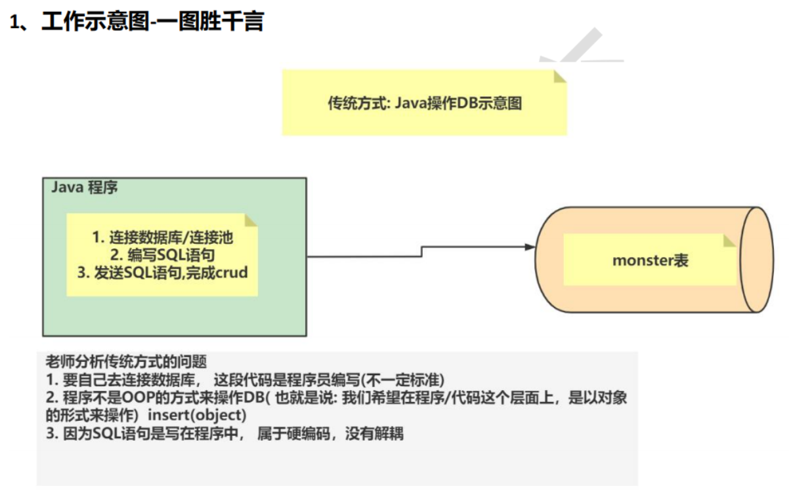
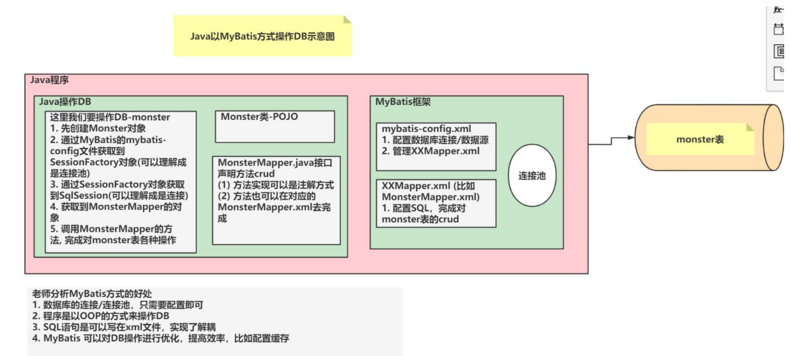
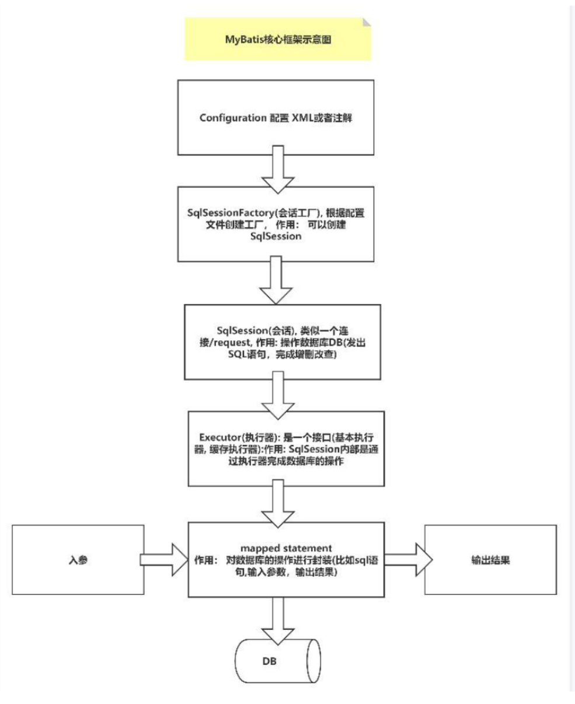
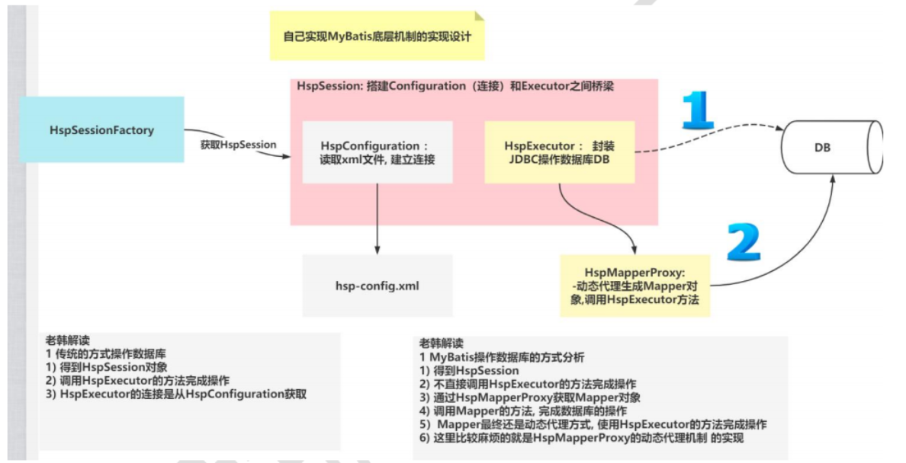
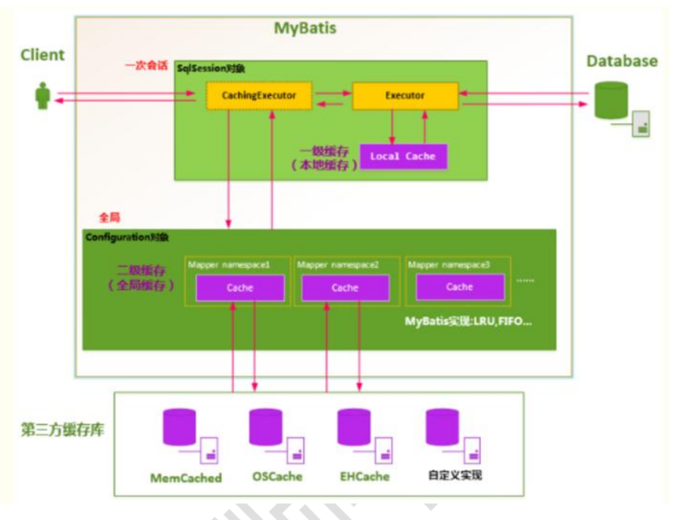

# 【韩顺平主流框架】 MyBatis

## MyBatis 介绍

### 资料汇总

1. MyBatis 中文文档
    - https://mybatis.org/mybatis-3/zh/index.html
    - https://mybatis.net.cn/
    - **[MyBatis-Plus，需学完SpringBoot](https://baomidou.com/)**

2. Maven 仓库
    https://mvnrepository.com/


### 为什么需要 MyBatis

1. 传统 Java 程序操作数据库的问题

     

    传统写法中，Java 程序通常需要自己完成下面这些事情：

    ```text
    连接数据库 / 获取连接
            ↓
    编写 SQL 语句
            ↓
    通过 JDBC 发送 SQL
            ↓
    执行增删改查
            ↓
    手动处理 ResultSet
            ↓
    把查询结果封装成 Java 对象
    ```

    PDF 中的示意图是：Java 程序直接通过 JDBC 操作 `monster` 表。Java 程序既要负责连接数据库，也要负责发送 SQL，还要负责把 SQL 返回结果转换成对象。

2. 传统方式的主要问题

    | 问题 | 说明 |
    |---|---|
    | 连接处理重复 | 每次操作数据库都要关注连接获取、关闭等细节 |
    | SQL 和 Java 代码耦合 | SQL 写在 Java 代码中，后续修改 SQL 时容易影响业务代码 |
    | 手动封装结果集 | 查询结果需要自己从 `ResultSet` 中取字段，再设置到对象属性 |
    | CRUD 代码重复 | 增删改查中有大量模板式代码，真正变化的主要是 SQL |

    所以，MyBatis 要解决的核心问题不是“让程序员不写 SQL”，而是：

    ```text
    让 SQL 和 Java 代码解耦，
    同时减少 JDBC 中大量重复的数据库操作代码。
    ```

### MyBatis 基本介绍

1. MyBatis 是一个持久层框架

    持久层主要负责和数据库打交道，常见任务包括：

    ```text
    添加数据
    删除数据
    修改数据
    查询数据
    ```

2. MyBatis 的前身是 iBatis

    课程中提到，MyBatis 的前身是 `iBatis`，在 `iBatis 3.x` 时更名为 MyBatis。

3. MyBatis 的主要特点

    | 特点 | 说明 |
    |---|---|
    | 保留 SQL | SQL 仍然由程序员编写，适合需要控制 SQL 的场景 |
    | Java 和 SQL 解耦 | SQL 可以写到 `XxxMapper.xml` 中，不直接写死在 Java 代码里 |
    | 自动封装结果 | 查询结果可以自动映射成 Java 对象 |
    | 更灵活 | 相比完全自动生成 SQL 的框架，MyBatis 更适合复杂 SQL 场景 |

    这里需要注意：

    ```text
    MyBatis 不是替你建库建表。
    数据库、数据表、字段设计仍然需要程序员自己完成。
    ```

4. 图解
    


### 工程延伸：MyBatis 在现代后端架构中的位置

1. 先把课程中的 MyBatis 放回真实项目里看

    课程入门阶段重点讲的是：

    ```text
    Java 测试类
            ↓
    SqlSession
            ↓
    Mapper 接口代理对象
            ↓
    Mapper.xml 中的 SQL
            ↓
    MySQL 数据库
    ```

    这是理解 MyBatis 底层的必要步骤，但在现在的企业项目中，一般不会在业务代码里手动创建 `SqlSession`。

    更常见的结构是：

    ```text
    Controller 接收请求
            ↓
    Service 处理业务逻辑和事务
            ↓
    Mapper 负责数据库操作
            ↓
    MyBatis 执行 SQL
            ↓
    MySQL 保存核心业务数据
    ```

2. 为什么现代项目常配 Spring Boot

    Spring Boot 并不是替代 MyBatis，而是帮我们减少配置工作。

    在传统 MyBatis 中，需要自己写：

    ```text
    mybatis-config.xml
    MyBatisUtils
    SqlSessionFactoryBuilder
    SqlSessionFactory
    openSession()
    commit()
    close()
    ```

    整合 Spring Boot 后，这些重复性的对象创建和资源管理，基本交给 Spring 容器完成。

    开发者更关注：

    ```text
    Mapper 接口怎么写
    SQL 怎么写
    Service 事务怎么控制
    接口返回什么数据
    ```

3. Redis 在这个架构中的位置

    Redis 不是用来替代 MySQL 的。

    MySQL 更适合保存核心业务数据，Redis 更适合保存访问频率高、允许短时间缓存的数据。

    可以这样理解：

    ```text
    第一次查询
    Controller → Service → Mapper → MySQL
                         ↓
                       写入 Redis 缓存
    ```

    ```text
    后续相同查询
    Controller → Service → Redis
                         ↓
                       直接返回缓存结果
    ```

    所以，MyBatis 解决的是“如何操作关系型数据库”，Redis 解决的是“如何减少频繁访问数据库带来的压力”。

4. 入门阶段和现代项目的关系

    本章课程中的写法偏底层，是为了让我们看懂 MyBatis 的工作过程。

    后面真正做项目时，一般会升级成：

    ```text
    Spring Boot
        + MyBatis / MyBatis-Plus
        + MySQL
        + Redis
        + Spring Cache
        + 统一异常处理
        + 分层架构 Controller / Service / Mapper
    ```

    但无论上层框架怎么封装，底层仍然绕不开这一章的几个核心点：

    ```text
    Mapper 接口
    Mapper.xml
    SQL 映射
    参数绑定
    结果封装
    事务提交
    ```


### MyBatis 工作原理

1. 从整体上看 MyBatis

    PDF 中的工作示意图可以整理成下面这条链：

    ```text
    Java 程序
            ↓
    读取 mybatis-config.xml
            ↓
    创建 SqlSessionFactory
            ↓
    获取 SqlSession
            ↓
    通过 SqlSession 获取 Mapper 接口代理对象
            ↓
    调用 Mapper 接口方法
            ↓
    根据 namespace + id 找到 Mapper.xml 中的 SQL
            ↓
    执行 SQL
            ↓
    把结果映射成 Java 对象
            ↓
    返回给 Java 程序
    ```

2. 几个核心文件的作用

    | 文件 / 对象 | 作用 |
    |---|---|
    | `mybatis-config.xml` | MyBatis 全局配置文件，配置数据库连接、事务、Mapper 文件等 |
    | `MonsterMapper.java` | Mapper 接口，只声明数据库操作方法 |
    | `MonsterMapper.xml` | Mapper 映射文件，真正编写 SQL 的地方 |
    | `Monster.java` | 实体类，用来封装数据库表中的一行记录 |
    | `SqlSessionFactory` | 根据配置文件创建出来的会话工厂 |
    | `SqlSession` | 和数据库交互的会话对象，可以获取 Mapper、执行 SQL |

3. `Mapper 接口` 和 `Mapper.xml` 的对应关系

    MyBatis 的一个重点是：接口方法本身不写实现类，而是由 MyBatis 根据 XML 配置动态实现。

    对应关系可以这样看：

    ```text
    MonsterMapper.java
    public void addMonster(Monster monster);
            ↓
    MonsterMapper.xml
    <insert id="addMonster" parameterType="Monster">
        SQL...
    </insert>
    ```

    这里最需要关注的是：

    ```text
    Mapper 接口方法名
            ↓
    Mapper.xml 中 SQL 标签的 id
    ```

    方法名和 `id` 对应上以后，MyBatis 才知道调用哪个 SQL。

## MyBatis 快速入门

### 需求说明

1. 本章要完成的任务

    通过 MyBatis 操作 `monster` 表，完成基本的 CRUD：

    ```text
    添加 Monster
    删除 Monster
    修改 Monster
    根据 id 查询 Monster
    查询所有 Monster
    ```

2. 本章的重点不是页面开发

    本章主要是搭建 MyBatis 的基本工程结构，重点理解：

    ```text
    数据库表
            ↓
    实体类
            ↓
    Mapper 接口
            ↓
    Mapper.xml
            ↓
    mybatis-config.xml
            ↓
    SqlSession
            ↓
    测试方法
    ```

### 创建数据库和表

1. 创建数据库

    ```sql
    CREATE DATABASE `mybatis`;
    ```

2. 创建 `monster` 表

    ```sql
    CREATE TABLE `monster` (
        `id` INT NOT NULL AUTO_INCREMENT,
        `age` INT NOT NULL,
        `birthday` DATE DEFAULT NULL,
        `email` VARCHAR(255) NOT NULL,
        `gender` TINYINT NOT NULL,
        `name` VARCHAR(255) NOT NULL,
        `salary` DOUBLE NOT NULL,
        PRIMARY KEY (`id`)
    ) CHARSET=utf8;
    ```

    这里的字段后面会和 `Monster` 实体类属性对应。

### 创建 Maven 项目并引入依赖

1. 创建父项目
    - 创建一个空的MAVEN项目，并删除源码文件夹。
    - 父项目中可以管理多个子模块/子项目
    - 父项目的完整坐标为：`groupId`+`artifactId`，如：`com.lcq`+`.mybatis`

1. Maven 依赖

    课程中使用的是 MyBatis 3.5.7、MySQL 驱动 5.1.49 和 JUnit 4.12。

    ```xml
    <dependencies>
        <!-- MySQL 驱动 -->
        <dependency>
            <groupId>mysql</groupId>
            <artifactId>mysql-connector-java</artifactId>
            <version>5.1.49</version>
        </dependency>

        <!-- MyBatis 核心依赖 -->
        <dependency>
            <groupId>org.mybatis</groupId>
            <artifactId>mybatis</artifactId>
            <version>3.5.7</version>
        </dependency>

        <!-- 单元测试 -->
        <dependency>
            <groupId>junit</groupId>
            <artifactId>junit</artifactId>
            <version>4.12</version>
            <scope>test</scope>
        </dependency>
    </dependencies>
    ```

2. 工程目录建议

    课程中的结构可以整理成这样：

    ```text
    src
    ├─ main
    │  ├─ java
    │  │  └─ com.hspedu
    │  │     ├─ entity
    │  │     │  └─ Monster.java
    │  │     ├─ mapper
    │  │     │  ├─ MonsterMapper.java
    │  │     │  └─ MonsterMapper.xml
    │  │     └─ util
    │  │        └─ MyBatisUtils.java
    │  └─ resources
    │     └─ mybatis-config.xml
    └─ test
       └─ java
          └─ com.hspedu.mapper
             └─ MonsterMapperTest.java
    ```

    注意：如果 `MonsterMapper.xml` 放在 `src/main/java` 下，需要额外配置 Maven 资源导出，否则运行时可能找不到 XML 文件。


### 工程延伸：Spring Boot 项目中的依赖写法

1. 课程写法和现代写法的区别

    课程中是普通 Maven 项目，所以直接引入：

    ```text
    mybatis
    mysql-connector-java
    junit
    ```

    如果换成 Spring Boot 项目，一般会引入 MyBatis 的 Spring Boot Starter，让 MyBatis 自动接入 Spring 容器。

2. Spring Boot + MyBatis 常用依赖

    ```xml
    <dependencies>
        <!-- Spring Boot Web，用来开发 Controller 接口 -->
        <dependency>
            <groupId>org.springframework.boot</groupId>
            <artifactId>spring-boot-starter-web</artifactId>
        </dependency>

        <!-- MyBatis 和 Spring Boot 整合 -->
        <dependency>
            <groupId>org.mybatis.spring.boot</groupId>
            <artifactId>mybatis-spring-boot-starter</artifactId>
            <version>${mybatis-spring-boot.version}</version>
        </dependency>

        <!-- MySQL 驱动，Spring Boot 3 常用这个坐标 -->
        <dependency>
            <groupId>com.mysql</groupId>
            <artifactId>mysql-connector-j</artifactId>
            <scope>runtime</scope>
        </dependency>

        <!-- 测试 -->
        <dependency>
            <groupId>org.springframework.boot</groupId>
            <artifactId>spring-boot-starter-test</artifactId>
            <scope>test</scope>
        </dependency>
    </dependencies>
    ```

    这里的版本号不要机械照抄，实际项目中要和 Spring Boot 大版本匹配。

    课程中的写法更适合学习底层流程，Spring Boot Starter 的写法更接近现在项目开发。

3. 配置文件从 XML 变成 `application.yml`

    传统 MyBatis 里，数据库连接写在 `mybatis-config.xml` 中。

    Spring Boot 项目中，通常写到 `application.yml`：

    ```yaml
    spring:
      datasource:
        driver-class-name: com.mysql.cj.jdbc.Driver
        url: jdbc:mysql://localhost:3306/mybatis?useUnicode=true&characterEncoding=utf8&serverTimezone=Asia/Shanghai
        username: root
        password: lcq

    mybatis:
      mapper-locations: classpath:mapper/*.xml
      type-aliases-package: com.hspedu.entity
      configuration:
        log-impl: org.apache.ibatis.logging.stdout.StdOutImpl
    ```

    对应关系可以这样看：

    | 传统 MyBatis | Spring Boot 项目 |
    |---|---|
    | `mybatis-config.xml` 中配置数据库连接 | `spring.datasource` |
    | `<mappers>` 注册 Mapper.xml | `mybatis.mapper-locations` |
    | `<typeAliases>` 配置别名 | `mybatis.type-aliases-package` |
    | `<settings>` 配置日志 | `mybatis.configuration.log-impl` |

    这种写法不是改变 MyBatis 原理，而是把 XML 配置换成了 Spring Boot 的统一配置方式。


### 配置 MyBatis 核心配置文件

1. 创建 `mybatis-config.xml`

    `mybatis-config.xml` 是 MyBatis 的全局配置文件，主要配置数据库连接、事务管理、数据源和 Mapper 文件。

    1. **`jdbc:mysql://`**：协议名称，告诉驱动我们要使用 JDBC 连接 MySQL 数据库。
    2. **`127.0.0.1:3306`**：指定连接 MySQL 的 IP 地址（本机）和端口号（默认 `3306`）。*（注：`127.0.0.1` 也可以写成 `localhost`）*
    3. **`mybatis`**：你要连接的具体数据库（Database）的名称。
    4. **`useSSL=true`**：表示使用 SSL 安全连接。
    5. **`&amp;`**：在 XML 文件中，`&` 属于特殊字符，不能直接书写。必须转义为 `&amp;` 来连接多个参数，以**防止 XML 解析错误**。
    6. **`useUnicode=true`**：表示使用 Unicode 字符集，作用是**防止编码错误**。
    7. **`characterEncoding=UTF-8`**：指定具体的字符编码为 `UTF-8`，最主要的作用是**防止存取中文数据时出现乱码**。
    ```xml
    <?xml version="1.0" encoding="UTF-8" ?>
    <!DOCTYPE configuration
            PUBLIC "-//mybatis.org//DTD Config 3.0//EN"
            "http://mybatis.org/dtd/mybatis-3-config.dtd">
    <configuration>
        <environments default="development">
            <environment id="development">
                <!--配置事务管理器-->
                <transactionManager type="JDBC"/>

                <!--配置数据源-->
                <dataSource type="POOLED">
                    <property name="driver" value="com.mysql.cj.jdbc.Driver"/>
                    <property name="url" value="jdbc:mysql://localhost:3306/mybatis?useSSL=true&amp;useUnicode=true&amp;characterEncoding=UTF-8"/>
                    <property name="username" value="root"/>
                    <property name="password" value="lcq"/>
                </dataSource>
            </environment>
        </environments>
        <!--<mappers>-->
        <!--    <mapper resource="org/mybatis/example/BlogMapper.xml"/>-->
        <!--</mappers>-->
    </configuration>
    ```

2. 关键配置说明

    | 配置 | 作用 |
    |---|---|
    | `environments` | 配置数据库环境，可以配置多个环境 |
    | `default="development"` | 指定默认使用哪个环境 |
    | `transactionManager type="JDBC"` | 使用 JDBC 事务管理 |
    | `dataSource type="POOLED"` | 使用连接池数据源 |
    | `driver` | 数据库驱动 |
    | `url` | 数据库连接地址 |
    | `username` / `password` | 数据库用户名和密码 |
    | `mappers` | 注册 Mapper.xml 文件 |

3. `mappers` 的作用

    ```xml
    <mapper resource="com/hspedu/mapper/MonsterMapper.xml"/>
    ```

    这句话表示：

    ```text
    MyBatis 启动时，去 classpath 下寻找
    com/hspedu/mapper/MonsterMapper.xml
    并读取里面配置的 SQL。
    ```

    如果这里路径写错，或者 XML 没有被 Maven 复制到 `target/classes`，运行时就会报找不到 Mapper.xml 的错误。

### 创建实体类 Monster

1. `Monster` 实体类

    PDF 中要求实体类属性名和表字段名保持一致，这样 MyBatis 才能更自然地完成结果映射。

    ```java
    public class Monster {
        private Integer id;
        private Integer age;
        private String name;
        private String email;
        private Date birthday;
        private double salary;
        private Integer gender;

        // 无参构造器
        // 全参构造器
        // getter / setter
        // toString
    }
    ```

2. 属性名和字段名的对应关系

    | 数据库字段 | Java 属性 |
    |---|---|
    | `id` | `id` |
    | `age` | `age` |
    | `birthday` | `birthday` |
    | `email` | `email` |
    | `gender` | `gender` |
    | `name` | `name` |
    | `salary` | `salary` |

    课程入门阶段先保持字段名和属性名一致，这样可以避免额外配置结果映射。

### 创建 Mapper 接口

1. Mapper 接口的作用

    Mapper 接口只负责声明方法，不写实现类。

    ```java
    public interface MonsterMapper {

        // 添加 Monster
        void addMonster(Monster monster);

        // 根据 id 删除 Monster
        void delMonster(Integer id);

        // 修改 Monster
        void updateMonster(Monster monster);

        // 根据 id 查询 Monster
        Monster getMonsterById(Integer id);

        // 查询所有 Monster
        List<Monster> findAllMonster();
    }
    ```

2. 为什么没有实现类

    传统 Java 中，接口通常要写实现类。但 MyBatis 中不需要自己写 `MonsterMapperImpl`。

    可以这样理解：

    ```text
    程序员写 Mapper 接口
            ↓
    程序员写 Mapper.xml
            ↓
    MyBatis 根据接口和 XML 动态生成代理对象
            ↓
    调用接口方法时，实际执行 XML 中配置的 SQL
    ```

### 创建 Mapper.xml

1. Mapper.xml 的基本结构

    ```xml
    <!DOCTYPE mapper
            PUBLIC "-//mybatis.org//DTD Mapper 3.0//EN"
            "http://mybatis.org/dtd/mybatis-3-mapper.dtd">

    <mapper namespace="com.hspedu.mapper.MonsterMapper">

    </mapper>
    ```

2. `namespace` 的作用

    ```xml
    <mapper namespace="com.hspedu.mapper.MonsterMapper">
    ```

    `namespace` 要写 Mapper 接口的全类名。

    它的作用是把这个 XML 文件和接口绑定起来：

    ```text
    com.hspedu.mapper.MonsterMapper
            ↓
    MonsterMapper.xml
    ```

### 添加 Monster

1. 接口方法

    ```java
    void addMonster(Monster monster);
    ```

2. XML 实现

    ```xml
    <insert id="addMonster"
            parameterType="com.hspedu.entity.Monster"
            useGeneratedKeys="true"
            keyProperty="id">
        INSERT INTO monster (age, birthday, email, gender, name, salary)
        VALUES (#{age}, #{birthday}, #{email}, #{gender}, #{name}, #{salary})
    </insert>
    ```

3. 关键点说明

    | 配置 | 说明 |
    |---|---|
    | `id="addMonster"` | 对应 Mapper 接口中的 `addMonster` 方法 |
    | `parameterType` | 表示方法参数类型 |
    | `#{age}` | 取 `Monster` 对象的 `age` 属性值 |
    | `useGeneratedKeys="true"` | 使用数据库自增主键 |
    | `keyProperty="id"` | 把自增主键回填到 `monster.id` 中 |

    执行添加后，可以通过：

    ```java
    System.out.println(monster.getId());
    ```

    看到刚刚插入记录的自增 id。

#### `keyProperty` 的三种协作模式

1. 模式一：和 `useGeneratedKeys="true"` 协作（最常见，针对 MySQL）

    这是我们上一回合讨论的经典组合，主要用于**支持自增主键**的数据库（如 MySQL、SQL Server）。

    * **工作原理：** 底层利用 JDBC 的 `getGeneratedKeys` 获取数据库自己生成的自增 ID。
    * **代码示例：**
    ```xml
    <insert id="add" useGeneratedKeys="true" keyProperty="id">
        INSERT INTO monster(name) VALUES(#{name})
    </insert>

    ```


2. 模式二：和 `<selectKey>` 标签协作（应对 Oracle、UUID 等复杂场景）

    这是 `keyProperty` 的另一个“黄金搭档”。有些数据库（比如早期的 Oracle）**没有自增主键**功能，它们通过“序列（Sequence）”来生成 ID；或者你的主键不是自增数字，而是一串 **UUID** 字符串。

    这时候 `useGeneratedKeys` 就彻底失效了，你必须用 `<selectKey>` 自己写一段 SQL 来生成主键，并把结果交给 `keyProperty`：

    * **工作原理：** MyBatis 会先执行 `<selectKey>` 里面的 SQL 获取一个值，然后把这个值赋给 `keyProperty` 指定的属性，最后再执行外部的 Insert。
    * **代码示例（比如生成 UUID）：**

        ```xml
        <insert id="add">
            <!-- 注意：这里的 keyProperty 写在了 selectKey 标签里面！ -->
            <selectKey keyProperty="id" resultType="String" order="BEFORE">
                SELECT UUID() <!-- MySQL自带函数，生成一段随机字符串 -->
            </selectKey>
            
            <!-- 执行到这里时，对象的 id 已经被赋上了 UUID 的值 -->
            INSERT INTO monster(id, name) VALUES(#{id}, #{name})
        </insert>
        ```
    在这段代码里，`keyProperty` 完美地工作着，但它并没有和 `useGeneratedKeys` 协作。

3. 💡 追问：那 `keyColumn` 是干嘛的？它是必须的吗？

    **绝大多数情况下，`keyColumn` 是不需要写的！** 它是这三兄弟里存在感最低的。

    `keyColumn` 的作用是告诉 JDBC：“你要返回的主键在数据库表里叫什么列名”。

    *   **为什么平时不写？** 因为当你使用 MySQL 且只有 1 个自增主键时，JDBC 闭着眼睛都知道返回的那一列就是主键，不需要你废话。
    *   **什么时候必须写？** 
        1. 当你在某些特定的数据库（比如 PostgreSQL 的某些驱动版本）下，驱动比较“笨”，你不告诉它列名，它就报错说找不到生成的主键。
        2. 当你需要回填**多个字段**时（我们在上上回合讲过多属性回填），由于返回了多个列，你必须用 `keyColumn="id,create_time"` 明确告诉 MyBatis 第一个值对应什么列，第二个值对应什么列。

    给你一个“老程序员”的极简记忆法：

    1.  **接收器：** `keyProperty` 永远是**必须填**的（只要你想在 Java 里拿到回填的主键）。
    2.  **发送器：** `useGeneratedKeys` 和 `<selectKey>` **二选一**。MySQL 自增选前者，UUID/Oracle 序列选后者。
    3.  **辅助器：** `keyColumn` 是**非必须**的，除非报错或者回填多个字段，否则直接省略！


### 删除 Monster

1. 接口方法

    ```java
    void delMonster(Integer id);
    ```

2. XML 实现

    ```xml
    <delete id="delMonster" parameterType="Integer">
        DELETE FROM monster
        WHERE id = #{id}
    </delete>
    ```

    如果参数是 Java 自带类型，例如 `Integer`、`String`，`parameterType` 可以直接写类名。

### 配置类型别名

1. 为什么要配置别名

    如果不配置别名，`parameterType` 和 `resultType` 经常要写全类名：

    ```xml
    parameterType="com.hspedu.entity.Monster"
    resultType="com.hspedu.entity.Monster"
    ```

    为了简化 XML，可以在 `mybatis-config.xml` 中配置别名。

2. 配置 `typeAliases`

    ```xml
    <configuration>
        <typeAliases>
            <typeAlias type="com.hspedu.entity.Monster" alias="Monster"/>
        </typeAliases>

        <!-- environments、mappers 等配置 -->
    </configuration>
    ```

    配置后，Mapper.xml 中就可以直接写：

    ```xml
    parameterType="Monster"
    resultType="Monster"
    ```

### 修改和查询 Monster

1. 修改 Monster

    接口方法：

    ```java
    void updateMonster(Monster monster);
    ```

    XML 实现：

    ```xml
    <update id="updateMonster" parameterType="Monster">
        UPDATE monster
        SET age = #{age},
            birthday = #{birthday},
            email = #{email},
            gender = #{gender},
            name = #{name},
            salary = #{salary}
        WHERE id = #{id}
    </update>
    ```

2. 根据 id 查询

    接口方法：

    ```java
    Monster getMonsterById(Integer id);
    ```

    XML 实现：

    ```xml
    <select id="getMonsterById"
            parameterType="Integer"
            resultType="Monster">
        SELECT * FROM monster WHERE id = #{id}
    </select>
    ```

3. 查询所有 Monster

    接口方法：

    ```java
    List<Monster> findAllMonster();
    ```

    XML 实现：

    ```xml
    <select id="findAllMonster" resultType="Monster">
        SELECT * FROM monster
    </select>
    ```

    这里 `resultType="Monster"` 指的是集合中每一个元素的类型，而不是 `List` 本身。

### 创建 MyBatis 工具类

1. 工具类要解决的问题

    每次使用 MyBatis 都要读取配置文件、创建 `SqlSessionFactory`，这部分代码比较固定，所以可以封装成工具类。

2. `MyBatisUtils`

    ```java
    public class MyBatisUtils {

        private static SqlSessionFactory sqlSessionFactory;

        static {
            try {
                String resource = "mybatis-config.xml";
                InputStream inputStream = Resources.getResourceAsStream(resource);
                sqlSessionFactory = new SqlSessionFactoryBuilder().build(inputStream);
            } catch (IOException e) {
                e.printStackTrace();
            }
        }

        public static SqlSession getSqlSession() {
            return sqlSessionFactory.openSession();
        }
    }
    ```

3. 执行流程

    ```text
    读取 mybatis-config.xml
            ↓
    SqlSessionFactoryBuilder 构建 SqlSessionFactory
            ↓
    调用 openSession()
            ↓
    得到 SqlSession
            ↓
    通过 SqlSession 获取 Mapper 代理对象
    ```

    这里最需要关注的是：

    ```java
    sqlSessionFactory.openSession()
    ```

    默认情况下，这种方式打开的 `SqlSession` 不会自动提交事务，所以增删改后需要手动 `commit()`。


### 工程延伸：Spring Boot 中不再手动创建 SqlSession

1. 课程写法为什么要写工具类

    课程中为了让我们看清楚 MyBatis 的执行过程，手动封装了 `MyBatisUtils`：

    ```text
    读取 mybatis-config.xml
            ↓
    创建 SqlSessionFactory
            ↓
    openSession()
            ↓
    getMapper()
            ↓
    手动 commit / close
    ```

    这套写法适合学习 MyBatis 原理，但不适合直接作为现代业务项目的常规写法。

2. 现代项目中的 Mapper 注入

    在 Spring Boot 整合 MyBatis 后，Mapper 接口会被 Spring 管理，业务层可以直接注入使用。

    Mapper 接口：

    ```java
    @Mapper
    public interface MonsterMapper {
        Monster getMonsterById(Integer id);
        List<Monster> findAllMonster();
        void addMonster(Monster monster);
        void updateMonster(Monster monster);
        void delMonster(Integer id);
    }
    ```

    Service 层：

    ```java
    @Service
    public class MonsterService {

        private final MonsterMapper monsterMapper;

        public MonsterService(MonsterMapper monsterMapper) {
            this.monsterMapper = monsterMapper;
        }

        public Monster getMonsterById(Integer id) {
            return monsterMapper.getMonsterById(id);
        }
    }
    ```

    这里没有再出现：

    ```java
    SqlSession sqlSession = MyBatisUtils.getSqlSession();
    MonsterMapper mapper = sqlSession.getMapper(MonsterMapper.class);
    ```

    因为这些工作已经由 Spring Boot 和 MyBatis-Spring 帮我们完成。

3. 事务交给 `@Transactional`

    课程入门案例中，增删改之后要手动写：

    ```java
    sqlSession.commit();
    sqlSession.close();
    ```

    在 Spring 项目中，通常把事务放在 Service 层，用 `@Transactional` 控制。

    ```java
    @Service
    public class MonsterService {

        private final MonsterMapper monsterMapper;

        public MonsterService(MonsterMapper monsterMapper) {
            this.monsterMapper = monsterMapper;
        }

        @Transactional
        public void addMonster(Monster monster) {
            monsterMapper.addMonster(monster);
        }

        @Transactional
        public void updateMonster(Monster monster) {
            monsterMapper.updateMonster(monster);
        }
    }
    ```

    可以这样理解：

    ```text
    课程阶段：自己控制 SqlSession 的提交和关闭
    现代项目：Spring 通过事务管理器统一控制提交和回滚
    ```

    这也是为什么现代项目中通常不建议在 Controller 里直接调用 Mapper。

    更合理的调用链是：

    ```text
    Controller
            ↓
    Service 处理业务和事务
            ↓
    Mapper 操作数据库
    ```


### 编写测试类

1. 初始化 Mapper

    ```java
    public class MonsterMapperTest {

        private SqlSession sqlSession;
        private MonsterMapper monsterMapper;

        @Before
        public void init() {
            sqlSession = MyBatisUtils.getSqlSession();
            monsterMapper = sqlSession.getMapper(MonsterMapper.class);
            System.out.println(monsterMapper.getClass());
        }
    }
    ```

    这里打印 `monsterMapper.getClass()`，可以看到它并不是我们自己写的实现类，而是 MyBatis 生成的代理对象。

2. 添加测试

    ```java
    @Test
    public void addMonster() {
        Monster monster = new Monster();
        monster.setAge(100);
        monster.setBirthday(new Date());
        monster.setEmail("tn@sohu.com");
        monster.setGender(1);
        monster.setName("松鼠精");
        monster.setSalary(9234.89);

        monsterMapper.addMonster(monster);

        System.out.println("刚刚添加的对象 id=" + monster.getId());

        sqlSession.commit();
        sqlSession.close();
    }
    ```

3. 删除测试

    ```java
    @Test
    public void delMonster() {
        monsterMapper.delMonster(2);
        sqlSession.commit();
        sqlSession.close();
        System.out.println("删除 ok");
    }
    ```

4. 修改测试

    ```java
    @Test
    public void updateMonster() {
        Monster monster = new Monster();
        monster.setId(2);
        monster.setAge(200);
        monster.setBirthday(new Date());
        monster.setEmail("hspedu@sohu.com");
        monster.setGender(2);
        monster.setName("狐狸精");
        monster.setSalary(9234.89);

        monsterMapper.updateMonster(monster);

        sqlSession.commit();
        sqlSession.close();
        System.out.println("修改 ok");
    }
    ```

5. 查询测试

    ```java
    @Test
    public void getMonsterById() {
        Monster monster = monsterMapper.getMonsterById(2);
        System.out.println(monster);
        sqlSession.close();
    }

    @Test
    public void findAllMonster() {
        List<Monster> monsterList = monsterMapper.findAllMonster();
        for (Monster monster : monsterList) {
            System.out.println(monster);
        }
        sqlSession.close();
    }
    ```

6. 增删改查中的事务问题

    | 操作 | 是否需要 `commit()` | 原因 |
    |---|---|---|
    | 添加 | 需要 | 改变数据库数据 |
    | 删除 | 需要 | 改变数据库数据 |
    | 修改 | 需要 | 改变数据库数据 |
    | 查询 | 不需要 | 只读取数据 |

### 解决 Mapper.xml 找不到的问题

1. 错误现象

    PDF 截图中显示，运行测试时可能出现类似错误：

    ```text
    Could not find resource com/hspedu/mapper/MonsterMapper.xml
    ```

    这个错误的意思是：

    ```text
    mybatis-config.xml 中注册了 MonsterMapper.xml，
    但是运行时在 classpath 下找不到这个 XML 文件。
    ```

2. 常见原因

    课程中 `MonsterMapper.xml` 放在了：

    ```text
    src/main/java/com/hspedu/mapper/MonsterMapper.xml
    ```

    但是 Maven 默认主要编译 Java 文件，`src/main/java` 下的 XML 不一定会被复制到 `target/classes` 中。

3. 解决方式

    在父工程 `pom.xml` 中加入资源导出配置：

    ```xml
    <build>
        <resources>
            <resource>
                <directory>src/main/java</directory>
                <includes>
                    <include>**/*.xml</include>
                </includes>
            </resource>

            <resource>
                <directory>src/main/resources</directory>
                <includes>
                    <include>**/*.xml</include>
                    <include>**/*.properties</include>
                </includes>
            </resource>
        </resources>
    </build>
    ```

4. 处理后还不生效怎么办

    PDF 中还提示，如果仍然有问题，可以执行：

    ```text
    Maven clean
            ↓
    重新运行测试
    ```

    关键是检查 `target/classes` 下有没有实际生成：

    ```text
    com/hspedu/mapper/MonsterMapper.xml
    ```

### 日志输出：查看 SQL

1. 为什么要配置日志

    写 MyBatis 程序时，经常需要确认底层真正发给 MySQL 的 SQL 是什么。

    例如：

    ```text
    SQL 有没有拼错
    参数有没有传进去
    update/delete 有没有真正执行
    查询条件是否正确
    ```

2. 配置日志输出

    在 `mybatis-config.xml` 中添加 `settings` 配置：

    ```xml
    <configuration>
        <settings>
            <setting name="logImpl" value="STDOUT_LOGGING"/>
        </settings>

        <!-- typeAliases、environments、mappers 等配置 -->
    </configuration>
    ```

    `STDOUT_LOGGING` 表示把 MyBatis 日志输出到控制台。

3. 日志中重点看什么

    控制台会出现类似信息：

    ```text
    Opening JDBC Connection
    Preparing: UPDATE monster SET ... WHERE id=?
    Parameters: 10(Integer), 4(Integer)
    Updates: 1
    Closing JDBC Connection
    ```

    这些信息可以帮助判断：

    | 日志内容 | 说明 |
    |---|---|
    | `Preparing` | MyBatis 实际准备执行的 SQL |
    | `Parameters` | SQL 中 `?` 对应的真实参数 |
    | `Updates` | 影响的记录行数 |
    | `Opening / Closing JDBC Connection` | 数据库连接打开和关闭情况 |

### 工程延伸：Controller / Service / Mapper 分层写法

1. 为什么不要把 Mapper 直接暴露给 Controller

    入门测试中，我们直接在测试类里拿到 `monsterMapper`，这是为了验证 MyBatis 是否能正常操作数据库。

    真实项目中一般不这样写。

    如果 Controller 直接调用 Mapper，容易出现几个问题：

    ```text
    Controller 既处理请求，又处理业务规则
    事务不好统一管理
    后续加缓存、日志、权限校验时不好扩展
    代码层次混乱
    ```

2. 更常见的分层结构

    ```text
    controller
        MonsterController.java

    service
        MonsterService.java

    mapper
        MonsterMapper.java
        MonsterMapper.xml

    entity
        Monster.java
    ```

3. Controller 示例

    ```java
    @RestController
    @RequestMapping("/monsters")
    public class MonsterController {

        private final MonsterService monsterService;

        public MonsterController(MonsterService monsterService) {
            this.monsterService = monsterService;
        }

        @GetMapping("/{id}")
        public Monster getById(@PathVariable Integer id) {
            return monsterService.getMonsterById(id);
        }
    }
    ```

4. Service 示例

    ```java
    @Service
    public class MonsterService {

        private final MonsterMapper monsterMapper;

        public MonsterService(MonsterMapper monsterMapper) {
            this.monsterMapper = monsterMapper;
        }

        public Monster getMonsterById(Integer id) {
            return monsterMapper.getMonsterById(id);
        }
    }
    ```

    这样写的好处是：

    ```text
    Controller 只关心请求和响应
    Service 负责业务逻辑、事务和缓存
    Mapper 只负责 SQL
    ```

    后面即使加入 Redis、权限校验、统一返回结果，也主要改 Service 或公共组件，不会把 Controller 写得很乱。

### 工程延伸：Redis 缓存与 MyBatis 的配合

1. 为什么 MyBatis 项目中常见 Redis

    MyBatis 每次查询默认都会访问数据库。

    如果某些数据访问特别频繁，例如：

    ```text
    商品详情
    用户基础信息
    字典数据
    首页推荐数据
    热门榜单
    ```

    每次都查 MySQL，就会增加数据库压力。

    Redis 常用来做缓存层，把访问频率高的数据临时保存起来。

2. Redis 缓存的基本流程

    查询时：

    ```text
    先查 Redis
            ↓
    Redis 有数据：直接返回
            ↓
    Redis 没数据：查询 MySQL
            ↓
    查询结果写入 Redis
            ↓
    返回结果
    ```

    修改时：

    ```text
    修改 MySQL
            ↓
    删除或更新 Redis 缓存
            ↓
    下次查询重新加载最新数据
    ```

    这里最需要注意的是：

    ```text
    加了缓存以后，重点不是“怎么存进去”，而是“数据库和缓存如何保持一致”。
    ```

3. Spring Boot 中引入 Redis 缓存依赖

    ```xml
    <dependency>
        <groupId>org.springframework.boot</groupId>
        <artifactId>spring-boot-starter-cache</artifactId>
    </dependency>

    <dependency>
        <groupId>org.springframework.boot</groupId>
        <artifactId>spring-boot-starter-data-redis</artifactId>
    </dependency>
    ```

4. Redis 基本配置

    ```yaml
    spring:
      data:
        redis:
          host: localhost
          port: 6379
      cache:
        type: redis
        redis:
          time-to-live: 10m
    ```

    如果是较老版本 Spring Boot，Redis 配置前缀可能是 `spring.redis`，需要按项目版本调整。

5. 在 Service 层使用缓存注解

    启动类开启缓存：

    ```java
    @EnableCaching
    @SpringBootApplication
    public class Application {
        public static void main(String[] args) {
            SpringApplication.run(Application.class, args);
        }
    }
    ```

    查询方法加缓存：

    ```java
    @Service
    public class MonsterService {

        private final MonsterMapper monsterMapper;

        public MonsterService(MonsterMapper monsterMapper) {
            this.monsterMapper = monsterMapper;
        }

        @Cacheable(value = "monster", key = "#id")
        public Monster getMonsterById(Integer id) {
            return monsterMapper.getMonsterById(id);
        }
    }
    ```

    这段代码的意思是：

    ```text
    第一次查询 id=1 的 Monster：访问 MySQL，并把结果放入 Redis
    第二次查询 id=1 的 Monster：直接从 Redis 返回，不再访问 MySQL
    ```

6. 修改数据时清理缓存

    ```java
    @Transactional
    @CacheEvict(value = "monster", key = "#monster.id")
    public void updateMonster(Monster monster) {
        monsterMapper.updateMonster(monster);
    }
    ```

    `@CacheEvict` 的作用是清除缓存。

    原因是：

    ```text
    数据库中的 Monster 已经更新了，
    Redis 中原来的 Monster 就可能变成旧数据，
    所以修改成功后要删除旧缓存。
    ```

7. 哪些数据适合放 Redis

    | 数据类型 | 是否适合缓存 | 说明 |
    |---|---|---|
    | 查询频率高、修改少的数据 | 适合 | 例如商品详情、字典表 |
    | 每次都要实时准确的数据 | 谨慎 | 例如余额、库存扣减 |
    | 查询很慢但允许短时间延迟的数据 | 适合 | 例如统计结果、排行榜 |
    | 频繁修改的数据 | 不太适合 | 缓存会频繁失效，收益不明显 |

    Redis 很强，但不能乱加。

    如果业务对实时性要求很高，缓存设计就要更谨慎，不能只想着“加 Redis 提速”。

### 工程延伸：MyBatis、MyBatis-Plus 和 JPA 的关系

1. MyBatis

    本章学习的是 MyBatis，它的特点是 SQL 可控。

    ```text
    SQL 自己写
    映射关系自己配置
    复杂查询更灵活
    ```

    它适合对 SQL 有较强控制需求的项目。

2. MyBatis-Plus

    MyBatis-Plus 是在 MyBatis 基础上进一步封装的工具，常用于减少简单 CRUD 代码。

    例如普通的新增、删除、修改、分页查询，很多可以直接由框架提供。

    但要注意：

    ```text
    MyBatis-Plus 不是 MyBatis 的替代知识，
    而是在 MyBatis 基础上的开发效率工具。
    ```

    如果完全不理解 Mapper、SQL 映射和结果封装，直接用 MyBatis-Plus，后面遇到复杂 SQL 或排错时会很难受。

3. JPA

    JPA 更偏向对象关系映射，强调通过对象操作数据库。

    它和 MyBatis 的思路不一样：

    | 技术 | 主要特点 |
    |---|---|
    | MyBatis | SQL 手写，灵活可控 |
    | MyBatis-Plus | 在 MyBatis 基础上简化 CRUD |
    | JPA | 更偏向对象映射，SQL 感知较弱 |

    国内很多业务系统仍然偏爱 MyBatis 或 MyBatis-Plus，一个重要原因就是 SQL 可控、排查直观。

    所以，当前阶段先把 MyBatis 的底层映射关系学清楚，是很有必要的。


### 常见错误总结

| 错误现象 | 可能原因 | 解决思路 |
|---|---|---|
| 找不到 `MonsterMapper.xml` | XML 放在 `src/main/java` 下，但 Maven 没有导出 | 在 `pom.xml` 中配置 resources，或把 XML 放到 resources 下对应路径 |
| 调用 Mapper 方法时报错找不到语句 | Mapper 接口方法名和 XML 中 `id` 不一致 | 检查方法名、`id`、`namespace` 是否对应 |
| `resultType` 写了但封装对象为空 | 数据库字段名和 Java 属性名对不上 | 入门阶段先保持字段名和属性名一致 |
| 添加、删除、修改后数据库没变化 | 没有提交事务 | 增删改后执行 `sqlSession.commit()` |
| `mapper resource` 路径错误 | 路径没有按 classpath 写法写 | 使用 `/` 分隔，例如 `com/hspedu/mapper/MonsterMapper.xml` |
| 控制台看不到 SQL | 没有配置日志输出 | 在 `mybatis-config.xml` 中添加 `logImpl=STDOUT_LOGGING` |

### Maven build 资源导出规则

1. 为什么会出现 Mapper.xml 找不到

    在 MyBatis 工程中，`MonsterMapper.xml` 是 SQL 映射文件，运行时必须能被加载到 `target/classes` 目录下。

    但是 Maven 默认有一条规则：

    ```text
    src/main/java       默认只编译 Java 源代码
    src/main/resources  默认复制配置文件、XML、properties 等资源文件
    ```

    所以如果把 `MonsterMapper.xml` 放在：

    ```text
    src/main/java/com/hspedu/mapper/MonsterMapper.xml
    ```

    Maven 默认不会把它复制到最终的 classpath 中。

    运行时 MyBatis 按下面的配置去找文件：

    ```xml
    <mapper resource="com/hspedu/mapper/MonsterMapper.xml"/>
    ```

    但 `target/classes/com/hspedu/mapper/MonsterMapper.xml` 中没有这个文件，就会报错。

2. 更规范的目录写法

    按照 Maven 标准目录结构，更推荐这样放：

    ```text
    src/main/java
        com/hspedu/mapper/MonsterMapper.java

    src/main/resources
        com/hspedu/mapper/MonsterMapper.xml
        mybatis-config.xml
    ```

    这样写的好处是：

    ```text
    Java 接口放 java 目录
    XML 配置放 resources 目录
    Maven 会自动把 resources 下的 XML 复制到 target/classes
    ```

    对初学者来说，这种方式最稳，不容易因为资源没有导出导致报错。

3. 课程中的写法为什么也能运行

    课程中把 `MonsterMapper.java` 和 `MonsterMapper.xml` 放在同一个包下：

    ```text
    src/main/java/com/hspedu/mapper/
        MonsterMapper.java
        MonsterMapper.xml
    ```

    这种写法查看起来比较方便：

    ```text
    Mapper 接口
            ↓
    对应的 Mapper.xml
    ```

    两个文件放在一起，写 SQL 和对照方法名时比较直观。

    但是这种写法有一个前提：

    ```text
    必须额外配置 Maven build 资源导出规则
    ```

    否则 `src/main/java` 下的 XML 不会被复制到 `target/classes`。

4. 在 pom.xml 中添加 build 配置

    如果坚持把 Mapper.xml 放在 `src/main/java` 下，就需要在 `pom.xml` 中加入：

    ```xml
    <build>
        <resources>
            <!-- 让 Maven 也复制 src/main/java 下面的 XML / properties 文件 -->
            <resource>
                <directory>src/main/java</directory>
                <includes>
                    <include>**/*.xml</include>
                    <include>**/*.properties</include>
                </includes>
                <filtering>false</filtering>
            </resource>

            <!-- 保留默认的 resources 资源导出规则 -->
            <resource>
                <directory>src/main/resources</directory>
                <includes>
                    <include>**/*.xml</include>
                    <include>**/*.properties</include>
                </includes>
                <filtering>false</filtering>
            </resource>
        </resources>
    </build>
    ```

    这里最需要关注的是第一段：

    ```xml
    <directory>src/main/java</directory>
    ```

    它的意思是告诉 Maven：

    ```text
    不要只编译 src/main/java 里的 Java 文件，
    也要把里面的 xml / properties 文件复制到 target/classes。
    ```

5. 两种写法对比

    | 写法 | Mapper.java 位置 | Mapper.xml 位置 | 是否需要 build 配置 | 特点 |
    |---|---|---|---|---|
    | 标准 Maven 写法 | `src/main/java` | `src/main/resources` | 不需要 | 规范、稳定、不容易踩坑 |
    | 课程常见写法 | `src/main/java` | `src/main/java` | 需要 | 接口和 XML 放一起，查看方便 |

6. 常见报错理解

    如果没有正确导出 Mapper.xml，可能会出现类似错误：

    ```text
    Could not find resource com/hspedu/mapper/MonsterMapper.xml
    ```

    或者：

    ```text
    Invalid bound statement (not found)
    ```

    这类问题通常不是 SQL 写错了，而是 MyBatis 根本没有加载到对应的 Mapper.xml。

    排查时按下面顺序看：

    ```text
    Mapper.xml 是否存在
            ↓
    mybatis-config.xml 中 mapper resource 路径是否正确
            ↓
    Mapper.xml 是否被复制到了 target/classes
            ↓
    如果 XML 放在 src/main/java，下方是否配置了 build resources
    ```

7. 建议

    初学阶段更推荐使用标准 Maven 目录：

    ```text
    Mapper.java 放在 src/main/java
    Mapper.xml 放在 src/main/resources 对应包路径下
    ```

    等熟悉 Maven 的资源打包规则后，再考虑把 Mapper 接口和 XML 放在同一个目录，并通过 `build` 配置解决资源导出问题。

## 手动实现MyBatis

### 核心框架

1. 图解
    

2. 细节
    - mybatis 的核心配置文件
        - `mybatis-config.xml`: 进行全局配置，全局只能有一个这样的配置文件
        - `XxxMapper.xml` 配置多个 SQL，可以有多个 `XxxMappe.xml` 配置文件
    - 通过 `mybatis-config.xml` 配置文件得到 `SqlSessionFactory`
    - 通过 `SqlSessionFactory` 得到 `SqlSession`，用 `SqlSession` 就可以操作数据了
    - `SqlSession` 底层是 `Executor`(执行器), 有 2 重要的实现类, 有很多方法
    - `MappedStatement` 是通过 `XxxMapper.xml` 中定义, 生成的 `statement` 对象
    - 参数输入执行并输出结果集, 无需手动判断参数类型和参数下标位置, 且自动将结果集映射为 Java 对象

3. 本章主线

    ```text
    读取配置文件
            ↓
    得到数据库连接
            ↓
    Executor 执行 SQL
            ↓
    SqlSession 对外提供统一入口
            ↓
    MapperProxy 代理 Mapper 接口方法
            ↓
    根据方法名找到 Mapper.xml 中的 SQL
            ↓
    执行 SQL，并把结果封装成对象
    ```

### 设计思路

1. 为什么要手动实现？
    手动实现一个简化版 MyBatis，重点不是为了真的替代官方框架，而是为了理解这些问题：

    1. `mybatis-config.xml` 为什么能决定数据库连接信息
    2. `SqlSessionFactory` 为什么能创建 `SqlSession`
    3. `SqlSession` 为什么能执行 SQL
    4. Mapper 接口为什么没有实现类，却能调用方法
    5. Mapper.xml 中的 SQL 最后是怎么被执行的
    6. 查询结果为什么能自动封装成 Java 对象

    主要实现：
    
    - 阶段 1：读取 XML 配置文件，得到数据库连接
    - 阶段 2：编写 Executor，输入 SQL 和参数，完成查询操作
    
2. 图解 
    

3. 任务阶段
    - 完成读取配置文件，得到数据库连接
    - 编写执行器，输入SQL完成操作
    - 将SqlSession封装到执行器
    - 开发Mapper接口与Mapper.xml
    - 开发和Mapper接口相映射的MapperBean
    - 在MyConfiguration中读取XxxMapper.xml，创建MapperBean对象。
    - 实现动态代理Mapper


4. 小结
    - 在MyBatis底层中，最难理解的时动态代理。动态代理实质上是一种拦截所有代理类实现方法的一种手段，在Spring中，我们通过动态代理机制配置通知，本质上还是完成了方法的实现。而在MyBatis中，我们写的只有接口与Mapper配置，并没有真正的实现类，相应的，代理拦截后并没有真的找接口的实现方法，而是去找了SQL执行器，通过对不同SQL语句的分发实现了数据库查询。

### 开发环境

1. Maven 依赖

    手动实现 MyBatis 这一章不再直接使用官方 MyBatis，而是自己写一个简化版框架，因此核心依赖主要是：

    ```text
    dom4j       读取和解析 XML
    mysql       连接 MySQL 数据库
    lombok      简化实体类 getter / setter / toString 等代码
    junit       编写测试方法
    ```

    `pom.xml` 中可以这样配置：

    ```xml
    <dependencies>
        <!-- 读取 XML 配置文件 -->
        <dependency>
            <groupId>dom4j</groupId>
            <artifactId>dom4j</artifactId>
            <version>1.6.1</version>
        </dependency>

        <!-- MySQL 驱动 -->
        <dependency>
            <groupId>mysql</groupId>
            <artifactId>mysql-connector-java</artifactId>
            <version>5.1.49</version>
        </dependency>

        <!-- Lombok：简化实体类代码 -->
        <dependency>
            <groupId>org.projectlombok</groupId>
            <artifactId>lombok</artifactId>
            <version>1.18.20</version>
        </dependency>

        <!-- 单元测试 -->
        <dependency>
            <groupId>junit</groupId>
            <artifactId>junit</artifactId>
            <version>4.12</version>
            <scope>test</scope>
        </dependency>
    </dependencies>
    ```

2. 数据库和表

    当前案例仍然使用 `monster` 表，目的是让注意力集中在 MyBatis 底层机制上，而不是换一套新业务。

    ```sql
    CREATE DATABASE `mybatis`;

    USE `mybatis`;

    CREATE TABLE `monster` (
      `id` INT NOT NULL AUTO_INCREMENT,
      `age` INT NOT NULL,
      `birthday` DATE DEFAULT NULL,
      `email` VARCHAR(255) NOT NULL,
      `gender` TINYINT NOT NULL,
      `name` VARCHAR(255) NOT NULL,
      `salary` DOUBLE NOT NULL,
      PRIMARY KEY (`id`)
    ) CHARSET=utf8;
    ```

3. 推荐目录结构

    这一章的代码可以按下面方式放置：

    ```text
    src/main/java
        com/lcq/entity
            Monster.java
        com/lcq/mapper
            MonsterMapper.java
        com/lcq/mymybatis/config
            Function.java
            MapperBean.java
        com/lcq/mymybatis/sqlsession
            Executor.java
            MyExecutor.java
            MyConfiguration.java
            MySqlSession.java
            MyMapperProxy.java

    src/main/resources
        mybatis.xml
        MonsterMapper.xml

    src/test/java
        TestA.java
    ```

    如果把 `MonsterMapper.xml` 放在 `src/main/java` 下，也不是不能运行，但需要配置 Maven 的资源导出规则。更稳的做法还是放在 `resources` 目录下。

### 代码

#### 主体


0. 本节代码关系

    先把几个类之间的关系理清楚：

    | 类 / 接口 | 作用 |
    |---|---|
    | `MyConfiguration` | 读取 `mybatis.xml` 和 `MonsterMapper.xml` |
    | `Executor` | 定义执行 SQL 的统一方法 |
    | `MyExecutor` | 真正使用 JDBC 执行 SQL |
    | `MySqlSession` | 对外提供查询和获取 Mapper 代理对象的入口 |
    | `MyMapperProxy` | 拦截 Mapper 接口方法，转而执行 XML 中的 SQL |
    | `Function` | 保存一个 SQL 节点的信息 |
    | `MapperBean` | 保存一个 Mapper.xml 对应的接口名和 SQL 列表 |

    它们之间的调用关系大致是：

    ```text
    测试类
        ↓
    MySqlSession.getMapper()
        ↓
    Proxy.newProxyInstance()
        ↓
    MyMapperProxy.invoke()
        ↓
    MyConfiguration.readMapper()
        ↓
    找到 Function 中保存的 SQL
        ↓
    MySqlSession.queryOne()
        ↓
    MyExecutor.query()
        ↓
    JDBC 查询数据库
    ```


1. 配置类`MyConfiguration.java`
    - 用于实现配置与Mapper文件的读取

    ```java
    package com.lcq.mymybatis.sqlsession;

    import com.lcq.mymybatis.config.Function;
    import com.lcq.mymybatis.config.MapperBean;
    import org.dom4j.Document;
    import org.dom4j.DocumentException;
    import org.dom4j.Element;
    import org.dom4j.io.SAXReader;

    import java.io.InputStream;
    import java.sql.Connection;
    import java.sql.DriverManager;
    import java.sql.SQLException;
    import java.util.ArrayList;
    import java.util.Iterator;
    import java.util.List;
    import java.util.Properties;

    public class MyConfiguration {

        private static ClassLoader loader = ClassLoader.getSystemClassLoader();

        public Connection build(String resource) {
            Connection conn = null;
            try {
                InputStream resourceAsStream = loader.getResourceAsStream(resource);
                SAXReader saxReader = new SAXReader();

                Document document = saxReader.read(resourceAsStream);

                Element rootElement = document.getRootElement();

                System.out.println("root:" + rootElement);

                conn = evalDataSource(rootElement);


            } catch (DocumentException e) {
                throw new RuntimeException(e);
            }
            return conn;
        }

        private Connection evalDataSource(Element rootElement) {

            if (!"database".equals(rootElement.getName())) {
                throw new RuntimeException("root 节点应为<database>");
            }

            String driver = "";
            String url = "";
            String username = "";
            String password = "";

            for (Object property : rootElement.elements("property")) {
                Element i = (Element) property;
                String name = i.attributeValue("name");
                String value = i.attributeValue("value");
                if (name == null || value == null) {
                    throw new RuntimeException("???");
                }
                switch (name) {
                    case "driver":
                        driver = value;
                        break;
                    case "url":
                        url = value;
                        break;
                    case "username":
                        username = value;
                        break;
                    case "password":
                        password = value;
                        break;
                    default:
                        throw new RuntimeException("属性名不匹配");
                }

            }  Connection connection=null;
            try {
                Class.forName(driver);
                connection = DriverManager.getConnection(url, username, password);
            } catch (ClassNotFoundException e) {
                throw new RuntimeException(e);
            } catch (SQLException e) {
                throw new RuntimeException(e);
            }


            return connection;
        }
        public MapperBean readMapper(String resource) {

            MapperBean mapperBean = new MapperBean();

            InputStream resourceAsStream = loader.getResourceAsStream(resource);

            SAXReader saxReader = new SAXReader();
            try {
                Document document = saxReader.read(resourceAsStream);
                Element rootElement = document.getRootElement();
                if (!"mapper".equals(rootElement.getName())) {
                    throw new RuntimeException("<mapper>!!!");
                }
                System.out.println("root:" + rootElement);

                String namespace = rootElement.attributeValue("namespace");

                mapperBean.setInterfaceName(namespace);


                Iterator iterator = rootElement.elementIterator();
                ArrayList<Function> functions = new ArrayList<>();
                while (iterator.hasNext()) {
                    //    <select id = "queryById" resultType="com.lcq.entity.Monster">
                    //        select * from monster where id = ?
                    //    </select>
                    Element next = (Element)iterator.next();
                    Function function = new Function();
                    function.setSqlType(next.getName().trim());
                    function.setFunctionName(next.attributeValue("id"));
                    function.setSql(next.getText().trim());
                    function.setParameterType(next.attributeValue("parameterType"));
                    String resultTypeString = next.attributeValue("resultType").trim();
                    function.setResultType(Class.forName(resultTypeString).newInstance());
                    functions.add(function);
                }
                mapperBean.setFunctions(functions);
            } catch (DocumentException e) {
                throw new RuntimeException(e);
            } catch (ClassNotFoundException e) {
                throw new RuntimeException(e);
            } catch (InstantiationException e) {
                throw new RuntimeException(e);
            } catch (IllegalAccessException e) {
                throw new RuntimeException(e);
            }

            return mapperBean;
        }
    }

    ```


    这段配置类主要做两件事：

    ```text
    build("mybatis.xml")
            ↓
    读取数据库连接信息
            ↓
    返回 Connection
    ```

    以及：

    ```text
    readMapper("MonsterMapper.xml")
            ↓
    读取 namespace
            ↓
    遍历 select / insert / update / delete 节点
            ↓
    每个 SQL 节点封装成一个 Function
            ↓
    所有 Function 再封装到 MapperBean 中
    ```

    这里最需要关注的是 `readMapper()`。

    因为后面动态代理执行 Mapper 接口方法时，并不是去找接口实现类，而是根据方法名去 `MapperBean.functions` 中找对应的 SQL。

    ```text
    Mapper 接口方法名 queryById
            ↓
    Function.functionName = queryById
            ↓
    找到 SQL：select * from monster where id = ?
    ```

    当前代码为了简化，把 `resultType` 直接创建成了对象：

    ```java
    function.setResultType(Class.forName(resultTypeString).newInstance());
    ```

    更合理的做法其实是保存 `Class<?>`，等真正封装结果集时再创建对象。这里先按简化版理解即可。

2. 执行器`Executor.java`

    执行器这一层先定义一个接口，表示“只要是执行器，都应该具备执行 SQL 的能力”。

    ```java
    public interface Executor {
        <T> T query(String statement, Object param);
    }
    ```

    当前案例只实现查询，所以接口里只保留了一个 `query()` 方法。

    真实 MyBatis 中，Executor 不只负责查询，还会涉及更新、缓存、事务、批处理等更多能力。

    ```java
    package com.lcq.mymybatis.sqlsession;

    import com.lcq.entity.Monster;

    import java.sql.Connection;
    import java.sql.PreparedStatement;
    import java.sql.ResultSet;
    import java.sql.SQLException;

    public class MyExecutor implements Executor {

        private MyConfiguration myConfiguration = new MyConfiguration();

        @Override
        public <T> T query(String statement, Object param) {


            try (Connection connection = getConnection();

                PreparedStatement preparedStatement = connection.prepareStatement(statement)) {

                preparedStatement.setString(1, param.toString());

                try (ResultSet resultSet = preparedStatement.executeQuery()) {


                    Monster monster = new Monster();

                    while (resultSet.next()) {
                        monster.setId(resultSet.getInt("id"));
                        monster.setName(resultSet.getString("name"));
                        monster.setEmail(resultSet.getString("email"));
                        monster.setAge(resultSet.getInt("age"));
                        monster.setGender(resultSet.getInt("gender"));
                        monster.setBirthday(resultSet.getDate("birthday"));
                        monster.setSalary(resultSet.getDouble("salary"));
                    }

                    return (T) monster;
                }
            } catch (SQLException e) {
                throw new RuntimeException(e);
            }


        }

        private Connection getConnection() {
            return myConfiguration.build("mybatis.xml");
        }
    }

    ```

    `MyExecutor` 是当前版本里真正执行数据库操作的地方。

    它的核心流程是：

    ```text
    获取 Connection
            ↓
    创建 PreparedStatement
            ↓
    设置 ? 参数
            ↓
    执行查询
            ↓
    遍历 ResultSet
            ↓
    手动封装 Monster 对象
    ```

    这里其实暴露了简化版实现的局限：

    ```text
    只能处理一个参数
    只能处理 select
    结果集只能手动封装成 Monster
    ```

    真正的 MyBatis 会把这些工作拆得更细，例如参数处理、结果集映射、类型转换都会由专门组件完成。

3. 代理类`MapperProxy.java`
    ```java
    package com.lcq.mymybatis.sqlsession;

    import com.lcq.mymybatis.config.Function;
    import com.lcq.mymybatis.config.MapperBean;

    import java.lang.reflect.InvocationHandler;
    import java.lang.reflect.Method;
    import java.util.List;

    public class MyMapperProxy implements InvocationHandler {


        private MySqlSession mySqlSession;
        private String mapperFile;
        private MyConfiguration myConfiguration;

        public MyMapperProxy(MySqlSession mySqlSession, Class clazz, MyConfiguration myConfiguration) {
            this.mySqlSession = mySqlSession;
            this.mapperFile = clazz.getSimpleName() + ".xml";
            this.myConfiguration = myConfiguration;
        }

        @Override
        public Object invoke(Object proxy, Method method, Object[] args) throws Throwable {

            MapperBean mapperBean = myConfiguration.readMapper(mapperFile);
            // 确保是接口方法
            if (!method.getDeclaringClass().getName().equals(mapperBean.getInterfaceName())) {
                return null;
            }

            List<Function> functions = mapperBean.getFunctions();

            if (null != functions && mapperBean.getFunctions().size() > 0) {
                for (Function function : functions) {
                    System.out.println(function);
                    if (method.getName().equals(function.getFunctionName())) {
                        if("select".equals(function.getSqlType())){
                            System.out.println("ok");
                            return mySqlSession.queryOne(function.getSql(), args[0]);// 这里接收一个值而非一组值，因为我们只编写了一个例子
                        }
                    }
                }
            }
            return null;
        }
    }
    ```


    `MyMapperProxy` 是这一章最关键的类。

    因为 Mapper 接口没有实现类，真正执行方法时，进入的是代理对象的 `invoke()` 方法。

    可以把它理解成下面这条链：

    ```text
    mapper.queryById(4)
            ↓
    进入 MyMapperProxy.invoke()
            ↓
    读取 MonsterMapper.xml
            ↓
    判断 namespace 是否等于接口全类名
            ↓
    遍历 Function 列表
            ↓
    找到 id 和方法名相同的 SQL 节点
            ↓
    调用 mySqlSession.queryOne()
    ```

    这里有两个对应关系必须保持一致：

    ```text
    namespace = Mapper 接口全类名
    select 的 id = Mapper 接口方法名
    ```

    例如：

    ```xml
    <mapper namespace="com.lcq.mapper.MonsterMapper">
        <select id="queryById" resultType="com.lcq.entity.Monster">
    ```

    要对应：

    ```java
    public interface MonsterMapper {
        Monster queryById(Integer id);
    }
    ```

    如果这两个地方对不上，代理类就找不到应该执行哪条 SQL。

4. `MySqlSession.java`
    ```java
    package com.lcq.mymybatis.sqlsession;

    import java.lang.reflect.Proxy;

    public class MySqlSession {

        private Executor executor = new MyExecutor();
        private MyConfiguration myConfiguration = new MyConfiguration();

        public <T> T queryOne(String sql, Object param) {
            return executor.query(sql, param);
        }

        public <T> T getMapper(Class<T> type) {
            return (T) Proxy.newProxyInstance(type.getClassLoader(),new Class[]{type},
                    new MyMapperProxy(this,type,myConfiguration));
        }
    }
    ```

    `MySqlSession` 在这里相当于一个统一入口。

    一方面，它可以直接执行 SQL：

    ```java
    mySqlSession.queryOne("select * from monster where id = ?", 4);
    ```

    另一方面，它也可以返回 Mapper 接口的代理对象：

    ```java
    MonsterMapper mapper = mySqlSession.getMapper(MonsterMapper.class);
    ```

    后一种写法更接近真正 MyBatis 的使用方式，因为业务代码不需要直接关心 SQL 执行细节。

5. `Function.java`
    - 用于存放一个完整的SQL索引
    ```java
    package com.lcq.mymybatis.config;

    import lombok.Data;
    import lombok.NoArgsConstructor;

    @Data
    @NoArgsConstructor
    public class Function {
        private String sqlType;//CRUD
        private String functionName;// id
        private String sql;
        private Object resultType;
        private String parameterType;
    }

    ```
6. `MapperBean.java`
    ```java

    package com.lcq.mymybatis.config;

    import lombok.Data;
    import lombok.NoArgsConstructor;

    import java.lang.reflect.Method;
    import java.util.List;

    @Data
    @NoArgsConstructor
    public class MapperBean {
        private String InterfaceName;
        private List<Function> functions;
    }

    ```


    `Function` 和 `MapperBean` 的关系可以这样理解：

    ```text
    一个 Mapper.xml
            ↓
    对应一个 MapperBean
            ↓
    MapperBean 中保存 namespace 和多个 Function
            ↓
    每个 Function 对应一条 SQL
    ```

    例如：

    ```xml
    <select id="queryById" resultType="com.lcq.entity.Monster">
        select * from monster where id = ?
    </select>
    ```

    会被封装成类似下面的数据：

    ```text
    sqlType = select
    functionName = queryById
    sql = select * from monster where id = ?
    resultType = Monster
    ```

    所以，动态代理执行方法时，本质上是在查这个结构：

    ```text
    方法名 queryById
            ↓
    找到 functionName=queryById 的 Function
            ↓
    取出其中的 SQL 交给 Executor
    ```

#### 配置文件


0. `MonsterMapper.java`

    Mapper 接口中只声明方法，不写实现类。

    ```java
    package com.lcq.mapper;

    import com.lcq.entity.Monster;

    public interface MonsterMapper {
        Monster queryById(Integer id);
    }
    ```

    这里的 `queryById` 要和 `MonsterMapper.xml` 中的 `<select id="queryById">` 保持一致。

    这一点就是 MyBatis 接口代理的基础：

    ```text
    接口方法名
            ↓
    Mapper.xml 中 SQL 节点 id
    ```

1. `MonsterMapper.xml`
    ```xml
    <?xml version="1.0" encoding="UTF-8" ?>

    <mapper namespace="com.lcq.mapper.MonsterMapper">
        <select id = "queryById" resultType="com.lcq.entity.Monster">
            select * from monster where id = ?
        </select>
    </mapper>
    ```

2. `mybatis.xml`
    ```xml
    <?xml version="1.0" encoding="UTF-8"?>
    <database>

        <property name="driver" value="com.mysql.jdbc.Driver"/>
        <property name="url" value="jdbc:mysql://localhost:3306/mybatis?useSSL=true&amp;useUnicode=true&amp;characterEncoding=UTF-8"/>
        <property name="username" value="root"/>
        <property name="password" value="lcq"/>

    </database>

    ```


    这两个配置文件分别解决两个问题：

    ```text
    mybatis.xml
            ↓
    解决数据库怎么连接
    ```

    ```text
    MonsterMapper.xml
            ↓
    解决接口方法对应哪条 SQL
    ```

    当前简化版没有做官方 MyBatis 那种总配置文件统一注册 Mapper 的机制，所以在代理类中通过：

    ```java
    this.mapperFile = clazz.getSimpleName() + ".xml";
    ```

    默认认为：

    ```text
    MonsterMapper 接口
            ↓
    MonsterMapper.xml 文件
    ```

    这种写法简单，但要求文件名必须严格对应。

#### 测试类

1. 代码
    ```java
    import com.lcq.entity.Monster;
    import com.lcq.mapper.MonsterMapper;
    import com.lcq.mymybatis.config.MapperBean;
    import com.lcq.mymybatis.sqlsession.Executor;
    import com.lcq.mymybatis.sqlsession.MyConfiguration;
    import com.lcq.mymybatis.sqlsession.MyExecutor;
    import com.lcq.mymybatis.sqlsession.MySqlSession;
    import org.junit.jupiter.api.Test;

    import java.sql.Connection;

    public class TestA {


        @Test
        public void testConnection(){
            Connection build = new MyConfiguration().build("mybatis.xml");
            System.out.println(build);
        }

        @Test
        public void testLombok(){}

        @Test
        public void testExecutor01(){
            Executor executor = new MyExecutor();

            Object query = executor.query("select * from monster where id = ?", 5);
            System.out.println(query);
        }

        @Test
        public void testMySqlSession(){
            MySqlSession mySqlSession = new MySqlSession();
            Object o = mySqlSession.queryOne("select * from monster where id = ?", 4);
            System.out.println(o);
        }

        @Test
        public void testMapperReader(){
            MapperBean mapperBean = new MyConfiguration().readMapper("MonsterMapper.xml");
            System.out.println(mapperBean);
        }

        @Test
        public void testProxy(){
            MySqlSession mySqlSession = new MySqlSession();
            MonsterMapper mapper = mySqlSession.getMapper(MonsterMapper.class);
            System.out.println(mapper.getClass());
            Monster monster = mapper.queryById(4);
            System.out.println(monster);
        }
    }
    ```


### 当前手写版和真正 MyBatis 的差距

1. 当前手写版已经实现了什么

    这一版已经抓住了 MyBatis 最核心的几件事：

    | 能力 | 当前是否实现 |
    |---|---|
    | 读取数据库配置 | 已实现 |
    | 获取数据库连接 | 已实现 |
    | 读取 Mapper.xml | 已实现 |
    | 将 SQL 节点封装成对象 | 已实现 |
    | 使用 Executor 执行查询 | 已实现 |
    | 使用动态代理调用 Mapper 接口方法 | 已实现 |
    | 将结果封装成 Java 对象 | 简化实现 |

2. 还缺少什么

    当前版本只是帮助理解底层思想，离真正 MyBatis 还有明显差距。

    | 对比点 | 当前手写版 | 真正 MyBatis |
    |---|---|---|
    | XML 解析 | 每次调用时读取 Mapper.xml | 启动时解析成统一配置对象 |
    | SQL 封装 | 用 `Function` 简化保存 | 使用 `MappedStatement` 保存完整 SQL 信息 |
    | 参数处理 | 只支持一个 `?` 参数 | 支持多参数、对象参数、`#{}`、`@Param` |
    | SQL 类型 | 主要演示 `select` | 支持完整 CRUD |
    | 结果封装 | 手动封装 `Monster` | 根据结果映射自动封装对象 |
    | 类型转换 | 几乎没有处理 | 有 TypeHandler 机制 |
    | 事务 | 没有单独封装 | 有事务管理机制 |
    | 连接管理 | 每次查询创建连接 | 可结合连接池 |
    | 缓存 | 没有缓存 | 支持一级缓存、二级缓存 |
    | 插件 | 没有扩展点 | 支持拦截器插件机制 |

3. 对应关系

    可以把当前写的类和 MyBatis 中的概念做一个对应：

    | 手写版 | MyBatis 中的相近概念 |
    |---|---|
    | `MyConfiguration` | `Configuration` |
    | `MySqlSession` | `SqlSession` |
    | `MyExecutor` | `Executor` |
    | `MapperBean` / `Function` | `MappedStatement` 的简化理解 |
    | `MyMapperProxy` | Mapper 动态代理机制 |

    这里不用死记类名，重点理解：

    ```text
    XML 不是运行时临时看一眼，
    而是会被解析成框架内部可执行的数据结构。
    ```

    Mapper 接口方法也不是自己执行 SQL，而是通过代理把方法调用转成 SQL 执行。

### 常见错误总结

| 错误现象 | 可能原因 | 解决思路 |
|---|---|---|
| `getResourceAsStream()` 返回 `null` | 配置文件没有放到 classpath 下 | 检查文件是否在 `resources` 目录，或是否被 Maven 打包 |
| 提示根节点不正确 | `mybatis.xml` 根节点不是 `<database>` | 检查 XML 根标签 |
| 数据库连接失败 | driver、url、username、password 配置错误 | 先单独测试 `MyConfiguration.build()` |
| 找不到 Mapper 方法对应的 SQL | XML 中 `id` 和接口方法名不一致 | 保证 `queryById` 两边一致 |
| 代理方法返回 `null` | `namespace` 和接口全类名不一致 | 检查 `<mapper namespace="...">` |
| `ClassNotFoundException` | `resultType` 写错 | 使用实体类全类名 |
| 查询结果字段为空 | 表字段名和实体类属性封装逻辑不对应 | 检查 `resultSet.getXxx("字段名")` |
| 只能查一个参数 | 当前 Executor 只写了 `setString(1, param)` | 后续可扩展为数组或参数映射 |
| 每次调用都读取 XML | 简化版没有缓存 MapperBean | 可以把 MapperBean 缓存到 Map 中 |

### 现代项目中的对应关系

1. 为什么现在很少手写这些代码

    在实际项目中，我们一般不会自己写 `MyConfiguration`、`MyExecutor`、`MyMapperProxy`。

    Spring Boot + MyBatis 项目通常是这样：

    ```text
    Controller
            ↓
    Service
            ↓
    Mapper 接口
            ↓
    MyBatis 生成代理对象
            ↓
    SqlSessionTemplate / SqlSession
            ↓
    Executor
            ↓
    JDBC / 数据库
    ```

    也就是说，底层代理和 SQL 执行仍然存在，只是被框架封装起来了。

2. 和 Spring Boot 的关系

    在 Spring Boot 项目中，常见写法是：

    ```java
    @Mapper
    public interface MonsterMapper {
        Monster queryById(Integer id);
    }
    ```

    或者在启动类上统一扫描：

    ```java
    @MapperScan("com.lcq.mapper")
    ```

    这些注解背后做的事情，本质上仍然是：

    ```text
    找到 Mapper 接口
            ↓
    读取对应 SQL
            ↓
    创建 Mapper 代理对象
            ↓
    放入 Spring 容器
    ```

    所以学习手写版不是为了以后真的自己写框架，而是为了看懂：

    ```text
    为什么 Mapper 只有接口也能注入
    为什么调用 mapper.queryById() 就能执行 SQL
    为什么 XML 的 namespace 和 id 必须对应接口和方法
    ```

3. 和 Redis 缓存的关系

    现代项目中，数据库查询通常不会每次都直接打到 MySQL，常见做法是在 Service 层加入缓存。

    例如查询妖怪信息：

    ```text
    Controller 调用 Service
            ↓
    Service 先查 Redis
            ↓
    Redis 有数据：直接返回
            ↓
    Redis 没数据：调用 Mapper 查 MySQL
            ↓
    查询结果写入 Redis
            ↓
    返回结果
    ```

    这样可以减少数据库压力。

    但要注意：

    ```text
    Redis 缓存不是 Mapper 的替代品，
    Mapper 仍然负责数据库访问。
    Redis 主要用于加速热点数据读取。
    ```

    如果发生更新操作，还要考虑缓存一致性：

    ```text
    修改数据库
            ↓
    删除或更新 Redis 缓存
    ```

    否则可能出现数据库已经更新，但 Redis 里还是旧数据的问题。

### 附加内容

#### Lombok

1. 基本介绍

2. MAVEN

3. 基本使用

2. 代码与编译结果
    ```java
    package com.lcq.entity;

    import lombok.*;

    import java.util.Date;

    @Getter
    @Setter
    @ToString
    @NoArgsConstructor
    @AllArgsConstructor
    public class Monster {
        private Integer id;
        private Integer age;
        private String name;
        private String email;
        private Date birthday;
        private double salary;
        private Integer gender;
    }

    /*
    //
    // Source code recreated from a .class file by IntelliJ IDEA
    // (powered by FernFlower decompiler)
    //

    package com.lcq.entity;

    import java.util.Date;

    public class Monster {
        private Integer id;
        private Integer age;
        private String name;
        private String email;
        private Date birthday;
        private double salary;
        private Integer gender;

        public Integer getId() {
            return this.id;
        }

        public Integer getAge() {
            return this.age;
        }

        public String getName() {
            return this.name;
        }

        public String getEmail() {
            return this.email;
        }

        public Date getBirthday() {
            return this.birthday;
        }

        public double getSalary() {
            return this.salary;
        }

        public Integer getGender() {
            return this.gender;
        }

        public void setId(Integer id) {
            this.id = id;
        }

        public void setAge(Integer age) {
            this.age = age;
        }

        public void setName(String name) {
            this.name = name;
        }

        public void setEmail(String email) {
            this.email = email;
        }

        public void setBirthday(Date birthday) {
            this.birthday = birthday;
        }

        public void setSalary(double salary) {
            this.salary = salary;
        }

        public void setGender(Integer gender) {
            this.gender = gender;
        }

        public String toString() {
            return "Monster(id=" + this.getId() + ", age=" + this.getAge() + ", name=" + this.getName() + ", email=" + this.getEmail() + ", birthday=" + this.getBirthday() + ", salary=" + this.getSalary() + ", gender=" + this.getGender() + ")";
        }

        public Monster() {
        }

        public Monster(Integer id, Integer age, String name, String email, Date birthday, double salary, Integer gender) {
            this.id = id;
            this.age = age;
            this.name = name;
            this.email = email;
            this.birthday = birthday;
            this.salary = salary;
            this.gender = gender;
        }
    }

    */

    ```

5. 进阶使用
    - 注解`@Data`
    - 同时生成多个注解
    - `@AllArgsConstructor`构造全参构造器，`@RequiredArgsConstructor`仅构造必须初始化的`final`、`@NOTNULL`字段。
    ```java
    /*
    * Copyright (C) 2009-2017 The Project Lombok Authors.
    * 
    * Permission is hereby granted, free of charge, to any person obtaining a copy
    * of this software and associated documentation files (the "Software"), to deal
    * in the Software without restriction, including without limitation the rights
    * to use, copy, modify, merge, publish, distribute, sublicense, and/or sell
    * copies of the Software, and to permit persons to whom the Software is
    * furnished to do so, subject to the following conditions:
    * 
    * The above copyright notice and this permission notice shall be included in
    * all copies or substantial portions of the Software.
    * 
    * THE SOFTWARE IS PROVIDED "AS IS", WITHOUT WARRANTY OF ANY KIND, EXPRESS OR
    * IMPLIED, INCLUDING BUT NOT LIMITED TO THE WARRANTIES OF MERCHANTABILITY,
    * FITNESS FOR A PARTICULAR PURPOSE AND NONINFRINGEMENT. IN NO EVENT SHALL THE
    * AUTHORS OR COPYRIGHT HOLDERS BE LIABLE FOR ANY CLAIM, DAMAGES OR OTHER
    * LIABILITY, WHETHER IN AN ACTION OF CONTRACT, TORT OR OTHERWISE, ARISING FROM,
    * OUT OF OR IN CONNECTION WITH THE SOFTWARE OR THE USE OR OTHER DEALINGS IN
    * THE SOFTWARE.
    */
    package lombok;

    import java.lang.annotation.ElementType;
    import java.lang.annotation.Retention;
    import java.lang.annotation.RetentionPolicy;
    import java.lang.annotation.Target;

    /**
    * Generates getters for all fields, a useful toString method, and hashCode and equals implementations that check
    * all non-transient fields. Will also generate setters for all non-final fields, as well as a constructor.
    * <p>
    * Equivalent to {@code @Getter @Setter @RequiredArgsConstructor @ToString @EqualsAndHashCode}.
    * <p>
    * Complete documentation is found at <a href="https://projectlombok.org/features/Data">the project lombok features page for &#64;Data</a>.
    * 
    * @see Getter
    * @see Setter
    * @see RequiredArgsConstructor
    * @see ToString
    * @see EqualsAndHashCode
    * @see lombok.Value
    */
    @Target(ElementType.TYPE)
    @Retention(RetentionPolicy.SOURCE)
    public @interface Data {
        /**
        * If you specify a static constructor name, then the generated constructor will be private, and
        * instead a static factory method is created that other classes can use to create instances.
        * We suggest the name: "of", like so:
        * 
        * <pre>
        *     public @Data(staticConstructor = "of") class Point { final int x, y; }
        * </pre>
        * 
        * Default: No static constructor, instead the normal constructor is public.
        * 
        * @return Name of static 'constructor' method to generate (blank = generate a normal constructor).
        */
        String staticConstructor() default "";
    }

    ```

## 原生API与注解

### 原生API

1. 说明

    - 基本的增删改查，在MyBatis中也可以通过原生的API，通过SqlSession接口的方法直接实现。

2. 代码示例
    ```java
    @Test
    public void test01(){
        Monster monster = new Monster(100,"100a",10,"100a@lcq.com",new Date(), 10000, 1);
        int insert = sqlSession.insert("com.lcq.mapper.MonsterMapper.addMonster", monster);
        System.out.println(insert);
        sqlSession.commit();
        sqlSession.close();
    }
    ```

### 注解

1. 代码示例
    ```java
    public interface MonsterMapperAnnotation {
        //     <insert id="addMonster" parameterType="com.lcq.entity.Monster" useGeneratedKeys="true" keyProperty="id">
        //        insert into `monster`(age, birthday, email, gender, name, salary)
        //        VALUES (#{age}, #{birthday}, #{email}, #{gender}, #{name}, #{salary});
        //    </insert>
        @Insert("insert into `monster` (age, birthday, email, gender, name, salary) VALUES (#{age}, #{birthday}, #{email}, #{gender}, #{name}, #{salary})")
        @Options(useGeneratedKeys = true, keyProperty = "id", keyColumn = "id")
        public void addMonster(Monster monster);
        
        //     <delete id="delMonsterById" parameterType="Integer" >
        //        delete
        //        from `monster`
        //        where `id` = #{id};
        //    </delete>
        @Delete("delete from monster where id=#{id}")
        public void delMonsterById(int id);

        public void updateById(Monster monster);
    }
    ```

2. 配置类注册
    - 由于没有使用xml，所以注册方式与之前有差别
    ```xml
    <mappers>
        <!-- <mapper resource="MonsterMapper.xml"/> -->
        <mapper class="com.lcq.mapper.MonsterMapperAnnotation"/>
    </mappers>
    ```

3. `@Option`
    - 即xml配置中的标签属性
    - `useGeneratedKeys = true`：用于获取主键
    - `keyProperty = "id"`：：用于指示回填的位置
    - `keyColumn = "id"`：用于指定数据库列名，作辅助验证

## 核心配置文件`mybatis-config.xml`详解

1. 文档
    - https://mybatis.net.cn/configuration.html

### 通过外部文件配置

1. 说明
    - 需要引入外部文件
    - 用`${}`引用

2. `jdbc.properties`
    ```properties
    jdbc.driver=com.mysql.cj.jdbc.Driver
    jdbc.url=jdbc:mysql://localhost:3306/mybatis?useSSL=true&amp;useUnicode=true&amp;characterEncoding=UTF-8
    jdbc.username=root
    jdbc.password=lcq
    ```

3. xml
    ```xml
    <?xml version="1.0" encoding="UTF-8" ?>
    <!DOCTYPE configuration
            PUBLIC "-//mybatis.org//DTD Config 3.0//EN"
            "http://mybatis.org/dtd/mybatis-3-config.dtd">
    <configuration>

        <!--引入外部文件-->
        <properties resource="jdbc.properties"/>

        <settings>
            <setting name="logImpl" value="STDOUT_LOGGING"/>
        </settings>
        <environments default="development">
            <environment id="development">
                <!--配置事务管理器-->
                <transactionManager type="JDBC"/>

                <!--配置数据源-->
                <dataSource type="POOLED">
                    <property name="driver" value="${jdbc.driver}"/>
                    <property name="url"
                            value="${jdbc.url}"/>
                    <property name="username" value="${jdbc.username}"/>
                    <property name="password" value="${jdbc.password}"/>
                </dataSource>
            </environment>
        </environments>
        <mappers>
            <mapper resource="MonsterMapper.xml"/>
            <mapper class="com.lcq.mapper.MonsterMapperAnnotation"/>
        </mappers>
    </configuration>
    ```

### `settings`

1. 常用设置一览
    - `logImpl`：设置日志格式
    - `cacheEnabled`：缓存配置
    - `useGeneratedKeys`：允许使用主键

### `typeAlias`

1. 说明
    - 配置别名，可以简化配置书写

2. 通过引入包简化配置信息

    ```xml
    <typeAliases>
        <package name=com.lcq.entity>
    </typeAliases>
    
    ```

### `typeHandler`

1. 说明
    - 用于java类型与jdbc类型映射
    - MyBatis映射基本满足，所以这个配置存在感不高
    - 一般使用默认即可
    - 映射关系一览：https://mybatis.net.cn/configuration.html#typeHandlers

### `environments`

1. Mapper注册

    - resource：xml配置
    - class：接口形式配置
    - url：引入外部路径的配置
    - package：当一个包下有很多配置，可以直接引入包

## XML 映射器`XxxMapper.xml`

### 基本介绍

1. 参考文档
    - https://mybatis.net.cn/sqlmap-xml.html

2. 说明
    - MyBatis以强大的语句映射能力，取代了大量数据库操作代码，令程序员可以仅凭SQL语句完成对数据库的操作
    > MyBatis是简化数据库操作的持久层框架。

3. SQL 映射文件常用的几个顶级元素（按照应被定义的顺序列出）：
    - `cache`：该命名空间的缓存配置。
    - `cache-ref`：引用其它命名空间的缓存配置。
    - `resultMap`：描述如何从数据库结果集中加载对象，是最复杂也是最强大的元素。
    - `parameterType`：将会**传入**这条语句的参数的类全限定名或别名
    - `sql`：可被其它语句引用的可重用语句块。
    - `insert`：映射插入语句。
    - `update`：映射更新语句。
    - `delete`：映射删除语句。
    - `select`：映射查询语句。

### `parameterType`

1. `parameterType` 的使用场景
    `parameterType` 用于指定传入 SQL 语句的参数类型，主要有以下几种情况：

    *   **传入简单类型**：例如按照 ID 查询 Monster（基础类型如 int, String 等）。
    *   **传入 POJO 类型（多个筛选条件）**：当查询条件有多个时（例如同时按 ID 和 Name 查询），通常将这些条件封装成一个 Java 对象（POJO），然后传入该对象。
    *   **传入 String 类型时的特殊处理**：当传入的参数类是 `String` 时，除了使用 `#{}`，也可以使用 `${}` 方法来接收参数（通常用于动态 SQL 或排序等场景）。

2. 应用案例 (代码示例)

    **案例 1：查询 id = 1 或者 name = '白骨精' 的妖怪**
    *   **需求分析**：这是一个多条件查询，适合使用 POJO 对象来传递参数。
    *   **Java 接口代码**：
        ```java
        // 通过id 或者 名字查询
        public List<Monster> findMonsterByNameORId(Monster monster);
        ```
    * xml配置
        ```xml
        <select id="findMonsterByNameORId" parameterType="Monster" resultType="Monster">
            select *
            from monster
            where id = #{id}
            or name = #{name}
        </select>
        ```
        - **注意**：select必须指定`resultType`，否则MyBatis无法确认返回值类型。

    **案例 2：查询 name 中包含 "牛魔王" 的妖怪**
    *   **需求分析**：这是一个模糊查询，参数是一个字符串。
    *   **Java 接口代码**：
        ```java
        // 查询名字中含精的妖怪 (注：图片原文可能有笔误，推测意为"含义妖"或特定字眼，但代码逻辑是按名字查)
        public List<Monster> findMonsterByName(String name);
        ```
    * xml配置
        ```xml
        <select id="findMonsterByName" parameterType="String" resultType="Monster">
            select *
            from monster
            where name like '%${value}%'
        </select>

        <!-- 安全的模糊查询 -->
        <select id="findMonsterByName" resultType="com.lcq.entity.Monster">
            <bind name="pattern" value="'%' + name + '%'" />
            select * from monster 
            where name like #{pattern}
        </select>
        ```
        - **注意**：尽量避免使用`${}`这类早期约定，这是纯粹的字符串拼接，存在SQL注入风险。
        
3. **传入 HashMap 作为参数**

    1. Java 接口代码 (Mapper Interface)

        使用 `Map<String, Object>` 作为参数类型，可以非常灵活地传递多个查询条件，而不受限于固定的实体类属性。

        ```java
        import org.apache.ibatis.annotations.Param;
        import java.util.List;
        import java.util.Map;

        public interface MonsterMapper {
            /**
             * 根据 HashMap 参数查询 id > 10 且 salary > 40 的妖怪
            * @param map 包含查询条件的 Map，key 为 "minId" 和 "minSalary"
            * @return 妖怪列表
            */
            public List<Monster> findMonsterByIdAndSalary_ParameterHashMap(Map<String, Object> map);
        }
        ```

    2. XML 配置文件 (Mapper XML)

        在 `MonsterMapper.xml` 中实现具体的 SQL 逻辑。重点在于如何在 XML 中获取 Map 中的值。

        ```xml
        <select id="findMonsterByIdAndSalary_ParameterHashMap" parameterTypr = "map" resultType="com.lcq.entity.Monster">
            select * 
            from monster 
            where id > #{minId} 
            and salary > #{minSalary}
        </select>
        ```

        **关键点解析：**
        *   **取值方式**：在 XML 中，通过 `#{key名}` 来获取 Map 中对应的值。例如，我们在 Java 代码中放入的 key 是 `"minId"`，那么在 XML 中就用 `#{minId}`。

    3. 测试类代码 (Test Case)

        编写测试代码来验证功能。这里演示了如何创建 HashMap 并传入参数。

        ```java
        import org.apache.ibatis.session.SqlSession;
        import org.junit.Test;
        import java.util.HashMap;
        import java.util.List;
        import java.util.Map;

        public class MonsterMapperTest {

            @Test
            public void testFindMonsterByHashMap() {
                try (SqlSession sqlSession = MyBatisUtils.getSqlSession()) {
                    MonsterMapper mapper = sqlSession.getMapper(MonsterMapper.class);

                    // 1. 创建 HashMap 并填充参数
                    Map<String, Object> map = new HashMap<>();
                    map.put("minId", 10);        // 对应 XML 中的 #{minId}
                    map.put("minSalary", 40);    // 对应 XML 中的 #{minSalary}

                    // 2. 调用方法
                    List<Monster> monsters = mapper.findMonsterByIdAndSalary_ParameterHashMap(map);

                    // 3. 打印结果
                    for (Monster m : monsters) {
                        System.out.println(m);
                    }
                }
            }
        }
        ```

    4. 为什么要用 HashMap？
        *   **灵活度高**：如果你有一个复杂的查询，涉及到的条件非常多，或者某些条件是可有可无的（比如同时按名字、年龄、性别、创建时间查询），你不需要去修改你的实体类（POJO），只需要往 Map 里 `put` 你需要的条件即可。
        *   **不受限 POJO 属性**：有时候查询条件可能包含一些临时的计算字段或者非数据库表字段，用 Map 传参就非常方便。

### 返回`HashMap`

1. 基本用法
    *   **需求**：查询 id > 10 并且 salary 大于 40 的所有妖怪，参数和返回类型均为 HashMap。
    *   **接口**：
        ```java
        public List<Map<String, Object>> findMonsterByIdAndSalary_ParameterHashMap_ReturnHashMap(Map<String, Object> map);
        ```
    *   **XML**：
        ```xml
        <select id="findMonsterByIdAndSalary_ParameterHashMap_ReturnHashMap" parameterType="map" resultType="map">
            SELECT * FROM `monster` WHERE `id` > #{id} AND `salary` > #{salary}
        </select>
        ```
    *   **测试代码**：
        ```java
        public void findMonsterByIdAndSalary_ParameterHashMap_ReturnHashMap() {
            try (SqlSession sqlSession = MyBatisUtils.getSqlSession()) {
                MonsterMapper mapper = sqlSession.getMapper(MonsterMapper.class);
                
                Map<String, Object> map = new HashMap<>();
                map.put("id", 10);
                map.put("salary", 40);
                
                List<Map<String, Object>> monsterList = mapper.findMonsterByIdAndSalary_ParameterHashMap_ReturnHashMap(map);
                
                // 遍历结果
                for (Map<String, Object> monsterMap : monsterList) {
                    System.out.println("monsterMap-" + monsterMap);
                }
            }
        }
        ```

2. 知识点总结
    1.  **灵活性**：使用 HashMap 传参更加灵活，不受限于 Monster POJO 的属性，可以随时增加查询条件。
    2.  **参数引用**：在 XML 中通过 `#{key名}` 获取 Map 中的值（如 `#{id}`, `#{salary}`）。
    3.  **返回类型**：当 `resultType="map"` 时，MyBatis 会将每一条查询结果映射为一个 Map（键为列名，值为数据），适合动态查询或不关心具体实体类的场景。
    4.  **遍历方式**：返回的 `List<Map<String, Object>>` 可通过增强 for 循环遍历，获取每一行的数据。


### `ResultMap`

1. 问题提出

    - 如果类的属性名和数据库字段名不一致，设定了`resultType`也会导致对应属性赋值失败。

2. 在`XxxMapper.xml`中配置`resultMap`
    ```xml
    <!-- 
    id: resultMap 的唯一标识
    type: 对应的 Java 实体类全路径
    -->
    <resultMap id="UserMap" type="com.lcq.entity.User">
        <!-- 
            id 标签: 映射主键字段
            column: 数据库表的字段名
            property: Java 实体类的属性名
        -->
        <id column="user_id" property="userId" />
        
        <!-- 
            result 标签: 映射普通字段
        -->
        <result column="user_name" property="username" />
        <result column="user_email" property="useremail" />
    </resultMap>
    ```

3. 配置SQL时引用`resultMap`
    ```xml
    <select id="findAllUser" resultMap="UserMap">
        SELECT * FROM `user`
    </select>
    ```

4. 注意事项和细节
    - 不设置`resultMap`时，如果表字段与属性名相同，则设置值，不同，则设置默认值（初始化类属性时赋的值）。

5. MyBatis 字段名与属性名不一致解决方案

    当数据库表的字段名（Column）与 Java 实体类的属性名（Property）不一致时，MyBatis 无法自动完成映射，会导致查询结果为 `null`。以下是三种常见的解决方案：

    1. SQL 别名法（快速但不推荐）

        通过在 SQL 语句中使用 `AS` 关键字为字段起别名，使其与实体类属性名保持一致。

        **适用场景**：临时测试、字段较少且不想编写额外 XML 配置的情况。

        ```xml
        <!-- 使用 resultType 指定返回类型 -->
        <select id="findAllUser" resultType="User">
            SELECT 
                user_id AS userId, 
                user_name AS username, 
                user_email AS useremail 
            FROM user
        </select>
        ```

        **优缺点**：
        *   ✅ **优点**：简单直接，无需额外配置。
        *   ❌ **缺点**：SQL 语句冗长，复用性差，维护成本高。

    2. ResultMap 映射法（标准推荐）

        使用 MyBatis 提供的 `<resultMap>` 标签，显式定义数据库字段与 Java 对象属性的映射关系。

        **适用场景**：正式项目，特别是表字段较多或命名规范差异较大的情况。

        ```xml
        <!-- 
            定义 resultMap
            id: 唯一标识，供后续引用
            type: 对应的实体类全限定名
        -->
        <resultMap id="UserResultMap" type="User">
            <!-- 映射主键 -->
            <id column="user_id" property="userId" />
            
            <!-- 映射普通字段 -->
            <result column="user_name" property="username" />
            <result column="user_email" property="useremail" />
        </resultMap>

        <!-- 在 SQL 中引用 resultMap -->
        <select id="findAllUser" resultMap="UserResultMap">
            SELECT * FROM user
        </select>
        ```

        **优缺点**：
        *   ✅ **优点**：结构清晰，SQL 语句简洁（无需 `SELECT *`），映射关系集中管理，复用性强。
        *   ❌ **缺点**：每个表需要单独定义映射配置。

    3. MyBatis-Plus 注解法（扩展）

        如果项目使用了 **MyBatis-Plus (MP)** 框架，可以直接在实体类上使用注解进行映射，无需编写 XML 文件。

        **适用场景**：使用 MyBatis-Plus 作为持久层框架的项目。

        ```java
        public class User {

            // 指定主键字段映射
            @TableId(value = "user_id")
            private Integer userId;

            // 指定普通字段映射
            @TableField(value = "user_name")
            private String username;

            // 若属性名与字段名一致（如 user_email 对应 useremail），可省略注解
            private String useremail; 
        }
        ```

        **优缺点**：
        *   ✅ **优点**：代码侵入性低，实体类即文档，配置直观，开发效率高。
        *   ❌ **缺点**：仅适用于 MyBatis-Plus 环境。

## 动态SQL

### 基本介绍

1. 文档
    - https://mybatis.net.cn/dynamic-sql.html

2. 为什么需要动态SQL

    - 动态 SQL 是 MyBatis 的强大特性之一
    - 使用 JDBC 或其它类似框架时，如果根据不同条件拼接 SQL，代码会很麻烦
    - 手动拼接时不仅要判断条件，还要注意空格、`AND`、`WHERE`、逗号等细节
    - MyBatis 通过 XML 标签，把这些容易出错的字符串拼接逻辑交给框架处理

3. 基本介绍
    - **背景**：为了满足复杂的业务需求，MyBatis 设计了动态生成 SQL 的功能。
    - **核心思想**：允许在 XML 映射文件中编写可变的 SQL 片段，根据传入参数的不同动态生成最终的 SQL 语句。

4. 动态 SQL 的必要性

    *   **场景一：条件查询**
        *   **需求**：查询 Monster 时，如果用户输入的年龄 (`age`) 不大于 0，则 SQL 中不加入年龄条件。
        *   **作用**：避免无效的查询条件，提高查询灵活性。

    *   **场景二：选择性更新**
        *   **需求**：更新 Monster 对象时，只有设置了新值的属性才参与更新，未设置的属性保持原值。
        *   **作用**：防止不必要的字段被覆盖，保证数据安全。
    *   **场景三：集合查询**
        *   **需求**：根据多个 id 查询数据，例如 `id in (1, 2, 3)`
        *   **作用**：避免手写循环拼接 `IN` 条件

5. 解决方案分析
    -  **问题本质**：在同一个方法中，需要根据不同的情况生成不同的 SQL 语句。
    -  **MyBatis 方案**：提供了一套专门的动态 SQL 机制（标签），简化了这一过程。

6. 常用标签（类比 Java 控制语句）

    MyBatis 的动态 SQL 标签类似于 Java 中的控制流语句，常用的包括：

    | 标签 | 作用 | 类比 Java |
    | :--- | :--- | :--- |
    | `<if>` | 条件判断，满足条件时才拼接 SQL 片段 | `if` 语句 |
    | `<choose>` / `<when>` / `<otherwise>` | 多选一，只执行第一个满足条件的分支 | `switch-case` / `if-else if` |
    | `<where>` | 动态添加 `WHERE`，并处理开头多余的 `AND` / `OR` | 条件拼接辅助 |
    | `<trim>` | 自定义处理 SQL 前缀、后缀和多余内容 | 字符串修剪 |
    | `<set>` | 动态更新时添加 `SET`，并去掉结尾多余逗号 | 更新语句辅助 |
    | `<foreach>` | 遍历集合，常用于 `IN` 查询或批量操作 | `for` 循环 |
    | `<bind>` | 创建临时变量，常用于模糊查询参数拼接 | 变量赋值 |

    这里最需要注意的是：

    
    动态 SQL 不是直接拼接用户输入的字符串，`#{xxx}` 仍然会走预编译参数绑定。
    

    所以正常使用 `#{}` 时，不需要把参数值手动拼进 SQL 字符串中。

### 应用实例

#### `<if>`

1. 需求举例
    - 查询`age>10`的所有对象。若输入的值为负数，即不合法，改为输出所有对象

2. 接口方法
    ```java
    public List<Monster> getMonstersByAge(@Param("age") Integer age);
    ```

3. 配置
    - 注意：test中无法通过`#{}`取值。
    ```xml
    <select id="getMonstersByAge" resultType="Monster">
        select * from monster
        where 1=1
        <if test="age!=null and age>=0">
            and age > #{age}
        </if>
    </select>
    ```

#### `<where>`

1. 需求举例
    *   **查询条件**：`id > 20` 且 `name = '牛魔王'` 的对象
    *   **条件规则**：
        *   如果 `id` 为负数，则不添加 `id` 的条件
        *   如果 `name` 为空，则不添加 `name` 的条件
    *   **使用技术**：`<where>` 和 `<if>` 标签实现动态 SQL

2. 接口方法
    ```java
    // 修正后的接口方法，明确指定参数名
    public List<Monster> getMonstersByNameAndId(
        @Param("name") String name, 
        @Param("id") String id
    );
    ```

3. 配置
    ```xml
    <!-- 使用 <where> 和 <if> 实现动态条件查询 -->
    <select id="getMonstersByNameAndId" resultType="Monster">
        select * from monster
        <where>
            <!-- id 条件：不为空且为正数才添加 -->
            <if test="id != null and id > 0">
                and id > #{id}
            </if>
            
            <!-- name 条件：不为空且不为空字符串才添加 -->
            <if test="name != null and name != ''">
                and name = #{name}
            </if>
        </where>
    </select>
    ```

3. 逻辑说明

    1. `<where>` 标签的作用
        *   **智能添加 WHERE**：只有当 `<if>` 条件满足时，才会添加 `WHERE` 关键字
        *   **自动去前缀**：自动移除第一个条件前的 `and` 或 `or`

    2. `<if>` 条件的含义
        1.  **`id` 条件**：`test="id != null and id > 0"`
            *   `id != null`：防止传入 null 值
            *   `id > 0`：确保 `id` 是正数（满足 `id > 20` 的前提）

        2.  **`name` 条件**：`test="name != null and name != ''"`
            *   `name != null`：防止传入 null 值
            *   `name != ''`：防止传入空字符串

#### `<choose>`

1. 需求分析
    实现多条件选择查询，类似 Java 中的 `switch-case` 语句：

    **查询逻辑优先级**：
    1.  **第一优先级**：如果传入的 `name` 不为空，则按名字查询
    2.  **第二优先级**：如果 `name` 为空但 `id` 大于 0，则按 ID 查询
    3.  **默认情况**：如果以上条件都不满足，则查询所有 `salary > 100` 的妖怪

2.  接口方法
    ```java
    // 使用 Map 作为参数，方便传递多个条件
    public List<Monster> findMonsterByIdAndName_choose(Map<String, Object> map);
    ```

3. XML 配置
    ```xml
    <select id="findMonsterByIdAndName_choose" parameterType="map" resultType="Monster">
        SELECT * FROM monster
        <where>
            <!-- choose-when-otherwise 实现多条件选择 -->
            <choose>
                <!-- 条件1：name 不为空 -->
                <when test="name != null and name != ''">
                    AND name = #{name}
                </when>
                
                <!-- 条件2：name 为空，但 id > 0 -->
                <when test="id != null and id > 0">
                    AND id = #{id}
                </when>
                
                <!-- 默认条件：前面都不满足时执行 -->
                <otherwise>
                    AND salary > 100
                </otherwise>
            </choose>
        </where>
    </select>
    ```

3. 逻辑说明

    - `<choose>` 标签的作用
        `<choose>` 标签类似于 Java 中的 `switch-case` 语句，具有以下特点：

        1.  **多选一逻辑**：从多个 `<when>` 条件中选择第一个满足的条件执行
        2.  **顺序判断**：按照 `<when>` 标签的顺序依次判断
        3.  **默认选项**：所有 `<when>` 都不满足时，执行 `<otherwise>` 中的内容
        4.  **排他性**：一旦某个 `<when>` 条件满足，就不再判断后续条件

    - 执行示例

        **场景1：传入 name 参数**
        ```java
        // Java 调用
        Map<String, Object> map = new HashMap<>();
        map.put("name", "牛魔王");
        map.put("id", 999);

        List<Monster> monsters = mapper.findMonsterByIdAndName_choose(map);
        ```
        ```sql
        -- 生成的 SQL
        SELECT * FROM monster WHERE name = '牛魔王'
        -- 注意：虽然 id=999 也满足条件，但不会执行，因为 name 条件优先
        ```

        **场景2：不传 name，传入合法 id**
        ```java
        Map<String, Object> map = new HashMap<>();
        map.put("name", null);
        map.put("id", 25);
        ```
        ```sql
        -- 生成的 SQL
        SELECT * FROM monster WHERE id = 25
        ```

        **场景3：所有条件都不满足**
        ```java
        Map<String, Object> map = new HashMap<>();
        map.put("name", null);
        map.put("id", -5);  // id 为负数，不满足 id > 0
        ```
        ```sql
        -- 生成的 SQL
        SELECT * FROM monster WHERE salary > 100
        ```

4. 与多个 `<if>` 的区别

    | 特性 | `<choose>` | 多个 `<if>` |
    |:------:|:------------:|:-------------:|
    | 执行逻辑 | 多选一，只执行第一个满足的条件 | 每个条件独立判断，可能执行多个 |
    | 类比 | `switch-case` 语句 | 多个 `if` 语句 |
    | 适用场景 | 互斥条件，优先级明确 | 可同时满足的多个条件 |


5. 最佳实践

    1.  **明确优先级**：将最可能满足或最重要的条件放在最前面
    2.  **避免重复条件**：确保 `<when>` 条件之间是互斥的
    3.  **合理使用 `<otherwise>`**：为未覆盖的情况提供默认查询逻辑
    4.  **组合使用**：可以在 `<when>` 内部再使用 `<if>` 等标签
    5.  **保持可读性**：复杂的条件判断建议提取到 Java 代码中处理


#### `<foreach>`


1. **需求**：根据传入的一个 ID 列表（例如 `[10, 12, 14]`），查询出所有匹配这些 ID 的 `Monster` 记录。这对应 SQL 中的 `IN` 查询。
2. **接口方法**：通常接收一个 ID 列表作为参数。

    ```java
    // 在 Mapper 接口中定义方法
    public List<Monster> findMonsterById_foreach(List<Integer> ids);
    ```

3. XML 映射配置
    在对应的 `Mapper.xml` 文件中，使用 `<foreach>` 标签动态生成 `IN` 子句。

    ```xml
    <select id="findMonsterById_foreach" resultType="Monster">
        SELECT * FROM monster
        WHERE id IN
        <foreach collection="list" item="id" open="(" separator="," close=")">
            #{id}
        </foreach>
    </select>

    <select id="findMonsterById_foreach" resultType="Monster">
        SELECT * FROM monster
        <where>
            <choose>
                <when test="list != null and list.size > 0">
                    id IN
                    <foreach collection="list" item="id" open="(" separator="," close=")">
                        #{id}
                    </foreach>
                </when>
                
                <otherwise>
                    AND 1 = 0
                </otherwise>
            </choose>
        </where>
    </select>
    ```

4. 代码逻辑与标签属性解析
    `<foreach>` 标签各属性的作用如下：
    *   `collection="list"`：指定要遍历的集合。**当接口方法参数是单个 `List` 时，MyBatis 默认将其放入一个名为 `"list"` 的键中**，因此这里必须写 `"list"`。如果使用 `@Param` 注解指定了参数名，则应使用指定的名字。
    *   `item="id"`：定义遍历时每个元素的变量名，在 `#{id}` 中引用。
    *   `open="("`：指定整个循环内容开始时要添加的字符串。
    *   `separator=","`：指定每个迭代项之间的分隔符。
    *   `close=")"`：指定整个循环内容结束时要添加的字符串。

    **执行结果示例**：
    当传入 `ids = [10, 12, 14]` 时，MyBatis 会动态生成如下 SQL 语句：
    ```sql
    SELECT * FROM monster WHERE id IN (10, 12, 14)
    ```

4. 补充说明与进阶用法
    1.  **参数为 `Map` 或使用 `@Param`**：如果方法签名是 `findMonsterById_foreach(@Param(“idList“) List<Integer> ids)`，则 XML 中的 `collection` 属性应写为 `“idList“`。
    2.  **空集合处理**：直接传入空列表可能导致 SQL 语法错误（`WHERE id IN ()`）。建议在业务层进行判断，或在 XML 中使用 `<if>` 标签进行防护。
    3.  **批量插入**：`<foreach>` 标签同样广泛用于批量插入操作，通过遍历对象列表，生成 `VALUES` 子句。

#### `<trim>` 

1. 需求与接口定义
    *   **需求**：根据名字查询妖怪。如果 SQL 语句开头有 `AND` 或 `OR`，就替换成 `WHERE`。
    *   **技术点**：使用 `<trim>` 标签的 `prefixOverrides` 属性来去除多余的前缀。
    *   **接口方法**：

    ```java
    // 在 MonsterMapper.java 中添加
    public List<Monster> findMonsterByName_Trim(Map<String, Object> map);
    ```

2. XML 映射配置
    在 `MonsterMapper.xml` 中实现具体的 SQL 逻辑。

    ```xml
    <!-- 实现 findMonsterByName_Trim [使用 trim] -->
    <select id="findMonsterByName_Trim" parameterType="map" resultType="Monster">
        select * from monster
        <!-- 
            prefix="where": 如果子元素返回内容，则在前面添加 "WHERE" 关键字
            prefixOverrides="and|or": 如果子元素返回的内容以 "AND" 或 "OR" 开头，则将其去除
        -->
        <trim prefix="where" prefixOverrides="and|or">
            <if test="name != null and name != ''">
                and name = #{name}
            </if>
        </trim>
    </select>
    ```

3. 逻辑解析与测试场景

    **场景：传入 name 参数**
    *   **Java 调用**：
        ```java
        Map<String, Object> map = new HashMap<>();
        map.put("name", "牛魔王");
        List<Monster> list = mapper.findMonsterByName_Trim(map);
        ```
    *   **生成的 SQL**：
        ```sql
        select * from monster where name = '牛魔王'
        ```
    *   **解析**：
        1.  因为 `<if>` 条件满足，所以 `<trim>` 内部返回了 `and name = '牛魔王'`。
        2.  `<trim>` 检测到内容以 `and` 开头，根据 `prefixOverrides="and|or"` 规则，去掉了开头的 `and`。
        3.  根据 `prefix="where"` 规则，在最前面加上了 `where`。
        4.  最终结果如上所示。

4. `<trim>` 标签核心属性说明

    | 属性 | 说明 |
    | :--- | :--- |
    | `prefix` | 在包裹的内容**前面**添加指定字符串。 |
    | `suffix` | 在包裹的内容**后面**添加指定字符串。 |
    | `prefixOverrides` | 如果内容**以**指定字符串开头，则将其**去除**。 |
    | `suffixOverrides` | 如果内容**以**指定字符串结尾，则将其**去除**。 |

5. 扩展：`<trim>` 替代 `<set>`（用于 Update）
    正如图片背景知识中提到的，`<trim>` 也可以完美替代 `<set>` 标签，用于处理更新语句中的逗号问题：

    ```xml
    <update id="updateMonster" parameterType="Monster">
        update monster
        <!-- 
            使用 suffixOverrides="," 去除最后一个字段后面多余的逗号
            使用 prefix="set" 在前面加上 set 关键字 
        -->
        <trim prefix="set" suffixOverrides=",">
            <if test="name != null">name=#{name},</if>
            <if test="age != null">age=#{age},</if>
            <if test="salary != null">salary=#{salary},</if>
        </trim>
        where id = #{id}
    </update>
    ```

6. `trim`的企业级应用
    ```xml
    <insert id="insertMonsterDynamic">
        INSERT INTO monster
        
        <trim prefix="(" suffix=")" suffixOverrides=",">
            <if test="name != null">name,</if>
            <if test="age != null">age,</if>
            <if test="email != null">email,</if>
        </trim>
        
        VALUES
        
        <trim prefix="(" suffix=")" suffixOverrides=",">
            <if test="name != null">#{name},</if>
            <if test="age != null">#{age},</if>
            <if test="email != null">#{email},</if>
        </trim>
    </insert>
    ```

#### `<set>` 

1. 需求分析
    *   **功能**：根据传入的 ID 修改妖怪的信息。
    *   **特点**：这是一个动态更新操作。传入的 Map 中可能只包含需要修改的字段，未传入的字段保持原值不变。
    *   **技术点**：使用 `<set>` 标签自动处理 SQL 语句末尾多余的逗号，并智能添加 `SET` 关键字。

2. 完整代码实现

    - `**MonsterMapper.java**`
    ```java
    // 测试 Set 标签
    public void updateMonster_set(Map<String, Object> map);
    ```

    - `**MonsterMapper.xml**`
    ```xml
    <!-- updateMonster_set set标签 -->
    <update id="updateMonster_set" parameterType="map">
        UPDATE monster
        <!-- 
            set 标签作用：
            1. 会自动在前面加上 "SET" 关键字
            2. 会自动剔除最后一个字段后面多余的逗号
        -->
        <set>
            <!-- 根据传入的值是否为空，决定是否进行修改 -->
            <if test="name != null and name != ''">
                name = #{name},
            </if>
            <if test="salary != null">
                salary = #{salary},
            </if>
            <!-- 可以继续添加其他需要更新的字段 -->
        </set>
        WHERE id = #{id}
    </update>
    ```

3. 逻辑解析与易错点提示

    1.  **`<set>` 标签的自动处理**：
        *   **自动加 SET**：如果 `<set>` 标签体内有内容（即有字段需要更新），MyBatis 会自动在前面加上 `SET` 关键字。
        *   **去尾随逗号**：这是 `<set>` 标签最大的用处。因为每个 `<if>` 语句后面都有逗号（`,`），如果没有 `<set>`，SQL 语句最后会多出一个逗号导致语法错误。`<set>` 会自动识别并去掉最后一个满足条件的字段后面的逗号。

    2.  **对比传统方式（trim）**：
        *   正如背景知识中提到的，`<set>` 标签本质上是 `<trim>` 标签的一个快捷方式。
        *   上面的代码完全等价于使用 `<trim>`：
            ```xml
            <trim prefix="SET" suffixOverrides=",">
                <if test="name != null">name = #{name},</if>
                ...
            </trim>
            ```

## 映射


### 映射关系：一对一

1. 基本介绍

    一对一关系是项目中很常见的表关系，例如：

    ```text
    Person  人
        ↓
    IdenCard 身份证
    ```

    在 Java 对象中，可以这样表示：

    ```java
    public class Person {
        private Integer id;
        private String name;
        private IdenCard card;
    }
    ```

    这里最需要关注的是：

    person 表中保存的是 card_id，而Java 对象中希望拿到的是 IdenCard 对象
    

    所以，一对一映射要解决的问题是：

    ```text
    数据库中的外键字段
            ↓
    映射成 Java 对象中的关联对象
    ```

2. 数据表设计

    课程中使用 `person` 和 `idencard` 两张表演示一对一关系。

    ```sql
    CREATE TABLE idencard (
        id INT PRIMARY KEY AUTO_INCREMENT,
        card_sn VARCHAR(32) NOT NULL DEFAULT ''
    ) CHARSET utf8;

    CREATE TABLE person (
        id INT PRIMARY KEY AUTO_INCREMENT,
        name VARCHAR(32) NOT NULL DEFAULT '',
        card_id INT,
        FOREIGN KEY (card_id) REFERENCES idencard(id)
    ) CHARSET utf8;
    ```

    
3. 实体类设计

    身份证实体类：

    ```java
    public class IdenCard {
        private Integer id;
        private String card_sn;
    }
    ```

    人员实体类：

    ```java
    public class Person {
        private Integer id;
        private String name;
        private IdenCard card;
    }
    ```

    `Person` 中没有直接保存 `card_id`，而是保存了一个 `IdenCard` 对象。

    这正是 MyBatis 级联映射要做的事情：

    ```text
    查询 person 表时得到 card_id
            ↓
    根据 card_id 找到对应的 idencard 记录
            ↓
    封装成 IdenCard 对象
            ↓
    放入 Person.card 属性中
    ```

4. 方式一：联合查询 + `association` 嵌套结果

    第一种方式是直接使用多表联合查询，一次性查出 `person` 和 `idencard` 的字段。

    Mapper 接口：

    ```java
    public interface PersonMapper {
        Person getPersonById(Integer id);
    }
    ```

    XML 配置：

    ```xml
    <resultMap type="Person" id="personResultMap">
        <id property="id" column="id"/>
        <result property="name" column="name"/>

        <association property="card" javaType="com.hspedu.entity.IdenCard">
            <result property="id" column="id"/>
            <result property="card_sn" column="card_sn"/>
        </association>
    </resultMap>

    <select id="getPersonById" parameterType="Integer" resultMap="personResultMap">
        SELECT *
        FROM person, idencard
        WHERE person.id = #{id}
          AND person.card_id = idencard.id
    </select>
    ```

    `association` 用来映射一个复杂对象属性。

    这里的含义是：

    ```text
    Person.card 是一个 IdenCard 类型的对象
            ↓
    查询结果中的 id、card_sn 字段
            ↓
    封装到 card 对象中
    ```

    这种方式的特点是：

    | 特点 | 说明 |
    |---|---|
    | SQL 写法 | 使用联合查询，一条 SQL 查出所有数据 |
    | 优点 | 查询次数少 |
    | 缺点 | 多表字段重名时容易混乱，需要注意列名冲突 |

    这里有一个细节：

    ```xml
    <id property="id" column="id"/>
    ```

    如果 `person` 和 `idencard` 都有 `id` 字段，直接 `select *` 容易造成字段名冲突。实际项目中更推荐使用别名：

    ```sql
    SELECT p.id AS person_id,
           p.name AS person_name,
           c.id AS card_id,
           c.card_sn AS card_sn
    FROM person p
    JOIN idencard c ON p.card_id = c.id
    WHERE p.id = #{id}
    ```

    然后在 `resultMap` 中按别名映射，代码更清楚。

5. 方式二：分步查询 + `association select`（推荐理解）

    第二种方式是先查 `person`，再根据 `person.card_id` 去查 `idencard`。

    `IdenCardMapper`：

    ```java
    public interface IdenCardMapper {
        IdenCard getIdenCardById(Integer id);
    }
    ```

    `IdenCardMapper.xml`：

    ```xml
    <select id="getIdenCardById" resultType="IdenCard" parameterType="Integer">
        SELECT * FROM idencard WHERE id = #{id}
    </select>
    ```

    `PersonMapper`：

    ```java
    public interface PersonMapper {
        Person getPersonById2(Integer id);
    }
    ```

    `PersonMapper.xml`：

    ```xml
    <resultMap type="Person" id="personResultMap2">
        <id property="id" column="id"/>
        <result property="name" column="name"/>

        <association property="card"
                     column="card_id"
                     select="com.hspedu.mapper.IdenCardMapper.getIdenCardById"/>
    </resultMap>

    <select id="getPersonById2" parameterType="Integer" resultMap="personResultMap2">
        SELECT * FROM person WHERE id = #{id}
    </select>
    ```

    这里最关键的是：

    ```xml
    <association property="card"
                 column="card_id"
                 select="com.hspedu.mapper.IdenCardMapper.getIdenCardById"/>
    ```

    它的执行逻辑是：

    ```text
    先执行 SELECT * FROM person WHERE id = ?
            ↓
    得到 person 记录中的 card_id
            ↓
    把 card_id 作为参数
            ↓
    调用 IdenCardMapper.getIdenCardById(card_id)
            ↓
    查到 IdenCard 对象
            ↓
    放入 Person.card
    ```

    这种方式相当于把多表查询拆成两个单表查询。

    | 特点 | 说明 |
    |---|---|
    | SQL 写法 | 分步查询，每个 Mapper 负责自己的表 |
    | 优点 | 结构清晰，容易维护 |
    | 缺点 | 可能多发 SQL，复杂场景要注意性能 |

6. 注解方式实现一对一

    一对一也可以通过注解实现。

    `IdenCardMapperAnnotation`：

    ```java
    public interface IdenCardMapperAnnotation {

        @Select("SELECT * FROM idencard WHERE id = #{id}")
        IdenCard getIdenCardById(Integer id);
    }
    ```

    `PersonMapperAnnotation`：

    ```java
    public interface PersonMapperAnnotation {

        @Select("SELECT * FROM person WHERE id = #{id}")
        @Results({
            @Result(id = true, property = "id", column = "id"),
            @Result(property = "name", column = "name"),
            @Result(
                property = "card",
                column = "card_id",
                one = @One(select = "com.hspedu.mapper.IdenCardMapperAnnotation.getIdenCardById")
            )
        })
        Person getPersonById(Integer id);
    }
    ```

    注解中的 `@One` 对应 XML 中的：

    ```xml
    <association select="..."/>
    ```

    这里要注意：课程中也强调，实际开发中复杂 SQL 更推荐放到 XML 中。注解适合简单 SQL，XML 更适合复杂映射、动态 SQL 和后期维护。

7. 测试方法

    ```java
    @Test
    public void getPersonById2() {
        Person person = personMapper.getPersonById2(1);
        System.out.println(person);
        sqlSession.close();
    }
    ```

    控制台输出大致可以理解成：

    ```text
    Person{id=1, name='张三', card=IdenCard{id=1, card_sn='111111111111110'}}
    ```

    说明 `Person` 对象中的 `card` 属性已经被级联查询出来。

8. 注意事项

    | 问题 | 说明 |
    |---|---|
    | 表是否一定要设置外键 | 不一定。MyBatis 的对象映射主要依赖 SQL 和 resultMap，不依赖数据库必须有外键约束 |
    | 一对一用什么标签 | XML 中使用 `<association>` |
    | 联合查询适合什么场景 | 想减少 SQL 次数，字段关系比较简单 |
    | 分步查询适合什么场景 | 结构更清晰，多个 Mapper 可以复用 |
    | 注解方式是否推荐 | 简单 SQL 可以用，复杂映射更推荐 XML |


### 映射关系：多对一 / 一对多

1. 基本介绍

    多对一和一对多本质上是同一组关系从不同方向观察。

    典型的例子有：

    - 一个 User 可以养多只 Pet
    - 一个 Pet 只对应一个 User


2. 数据表设计

    ```sql
    CREATE TABLE mybatis_user (
        id INT PRIMARY KEY AUTO_INCREMENT,
        name VARCHAR(32) NOT NULL DEFAULT ''
    ) CHARSET=utf8;

    CREATE TABLE mybatis_pet (
        id INT PRIMARY KEY AUTO_INCREMENT,
        nickname VARCHAR(32) NOT NULL DEFAULT '',
        user_id INT,
        FOREIGN KEY (user_id) REFERENCES mybatis_user(id)
    ) CHARSET=utf8;
    ```

    测试数据：

    ```sql
    INSERT INTO mybatis_user VALUES(NULL, '宋江'), (NULL, '张飞');
    INSERT INTO mybatis_pet VALUES(1, '黑背', 1), (2, '小哈', 1);
    INSERT INTO mybatis_pet VALUES(3, '波斯猫', 2), (4, '贵妃猫', 2);
    ```


3. 实体类设计

    - `Pet`：

        ```java
        public class Pet {
            private Integer id;
            private String nickname;
            private User user;
        }
        ```

    - `User`：

        ```java
        public class User {
            private Integer id;
            private String name;
            private List<Pet> pets;
        }
        ```

    这里两个对象互相引用：`User` 中有 `List<Pet>`，`Pet` 中有 `User`。
    这能表示双向关系，但打印 `toString()` 时要小心，避免两个对象互相打印导致循环引用。

4. Mapper 接口

    `PetMapper`：

    ```java
    public interface PetMapper {

        // 根据用户 id 查询该用户的所有宠物
        List<Pet> getPetByUserId(Integer userId);

        // 根据宠物 id 查询宠物，并级联查询主人
        Pet getPetById(Integer id);
    }
    ```

    `UserMapper`：

    ```java
    public interface UserMapper {

        // 根据用户 id 查询用户，并级联查询其所有宠物
        User getUserById(Integer id);
    }
    ```

5. `UserMapper.xml`：通过 User 查询所有 Pet

    ```xml
    <resultMap type="com.hspedu.entity.User" id="UserResultMap">
        <id property="id" column="id"/>
        <result property="name" column="name"/>

        <collection property="pets"
                    ofType="com.hspedu.entity.Pet"
                    column="id"
                    select="com.hspedu.mapper.PetMapper.getPetByUserId"/>
    </resultMap>

    <select id="getUserById" parameterType="Integer" resultMap="UserResultMap">
        SELECT * FROM mybatis_user WHERE id = #{id}
    </select>
    ```

    `collection` 用来处理集合属性。

    这里的意思是：

    ```text
    User.pets 是一个集合
            ↓
    集合中的元素类型是 Pet
            ↓
    当前 User 的 id 作为参数
            ↓
    调用 PetMapper.getPetByUserId(id)
            ↓
    查询该用户的所有宠物
            ↓
    放入 User.pets
    ```

    `collection` 和 `association` 的区别：

    | 标签 | 映射对象 | Java 属性类型 |
    |---|---|---|
    | `association` | 一个关联对象 | `User user`、`IdenCard card` |
    | `collection` | 多个关联对象 | `List<Pet> pets` |

6. `PetMapper.xml`：通过 Pet 查询 User

    ```xml
    <resultMap type="com.hspedu.entity.Pet" id="PetResultMap">
        <id property="id" column="id"/>
        <result property="nickname" column="nickname"/>

        <association property="user"
                     column="user_id"
                     select="com.hspedu.mapper.UserMapper.getUserById"/>
    </resultMap>

    <select id="getPetByUserId" parameterType="Integer" resultMap="PetResultMap">
        SELECT * FROM mybatis_pet WHERE user_id = #{userId}
    </select>

    <select id="getPetById" parameterType="Integer" resultMap="PetResultMap">
        SELECT * FROM mybatis_pet WHERE id = #{id}
    </select>
    ```

    通过 `Pet` 查询主人时使用的是 `association`，因为一个宠物只对应一个主人。

7. 测试：通过 User 查询 Pet

    ```java
    @Test
    public void getUserById() {
        User user = userMapper.getUserById(2);
        System.out.println("主人是" + user.getName());

        List<Pet> pets = user.getPets();
        for (Pet pet : pets) {
            System.out.println(pet.getNickname());
        }

        sqlSession.close();
    }
    ```

    执行链路：

    ```text
    调用 userMapper.getUserById(2)
            ↓
    查询 mybatis_user 表
            ↓
    得到 User.id
            ↓
    collection 调用 PetMapper.getPetByUserId(User.id)
            ↓
    查询该用户所有 Pet
            ↓
    封装到 user.pets
    ```

8. 测试：通过 Pet 查询 User

    ```java
    @Test
    public void getPetById() {
        Pet pet = petMapper.getPetById(2);
        System.out.println(pet.getNickname() + " 主人 " + pet.getUser().getName());
        sqlSession.close();
    }
    ```

    执行链路：

    ```text
    调用 petMapper.getPetById(2)
            ↓
    查询 mybatis_pet 表
            ↓
    得到 user_id
            ↓
    association 调用 UserMapper.getUserById(user_id)
            ↓
    查询主人 User
            ↓
    封装到 pet.user
    ```

9. 注解方式实现多对一
    - `@Results`的`id`属性如果填写，则其代表的ResultMap可以复用：`@ResultMap("[id]")`

    `UserMapperAnnotation`：

    ```java
    public interface UserMapperAnnotation {

        @Select("SELECT * FROM mybatis_user WHERE id = #{id}")
        @Results({
            @Result(id = true, property = "id", column = "id"),
            @Result(property = "name", column = "name"),
            @Result(
                property = "pets",
                column = "id",
                many = @Many(select = "com.hspedu.mapper.PetMapperAnnotation.getPetByUserId")
            )
        })
        User getUserById(Integer id);
    }
    ```

    `PetMapperAnnotation`：

    ```java
    public interface PetMapperAnnotation {

        @Select("SELECT * FROM mybatis_pet WHERE user_id = #{userId}")
        List<Pet> getPetByUserId(Integer userId);

        @Select("SELECT * FROM mybatis_pet WHERE id = #{id}")
        @Results({
            @Result(id = true, property = "id", column = "id"),
            @Result(property = "nickname", column = "nickname"),
            @Result(
                property = "user",
                column = "user_id",
                one = @One(select = "com.hspedu.mapper.UserMapperAnnotation.getUserById")
            )
        })
        Pet getPetById(Integer id);
    }
    ```

    注解对应关系：

    | 注解 | XML 标签 | 作用 |
    |---|---|---|
    | `@One` | `<association>` | 映射一个对象 |
    | `@Many` | `<collection>` | 映射一个集合 |
    | `@Results` | `<resultMap>` | 定义结果映射规则 |
    | `@Result` | `<id>` / `<result>` | 映射具体字段 |

10. 多对一使用时容易踩的点

    | 问题 | 原因 | 处理方式 |
    |---|---|---|
    | 打印对象时循环输出 | User 中有 Pet，Pet 中又有 User | `toString()` 中不要无限打印关联对象 |
    | 查询次数变多 | 分步查询会触发额外 SQL | 小数据量没问题，复杂场景注意性能 |
    | 分不清 `association` 和 `collection` | 一个对象和集合对象混淆 | 单个对象用 `association`，集合用 `collection` |
    | 注解写起来很长 | 复杂映射不适合注解堆叠 | 复杂业务推荐 XML |

### 工程延伸：现代项目中的对象映射关系

1. MyBatis 映射和真实业务对象

    在真实项目中，表关系不会只停留在 `User` 和 `Pet`，更常见的是：

    ```text
    用户 User
        ↓
    订单 Order
        ↓
    订单明细 OrderItem
        ↓
    商品 Product
    ```

    MyBatis 的 `association` 和 `collection` 就是用来处理这种对象之间的关联关系。

2. 现代项目中是否一定要做级联查询

    不一定。

    课程中演示级联查询，是为了让我们理解 MyBatis 的映射能力。真实项目中，有时会更倾向于在 Service 层拆开查询：

    ```text
    先查 User
            ↓
    再查 Order 列表
            ↓
    在 Service 层组装返回 DTO
    ```

    这样做的好处是查询过程更可控，避免不小心触发大量级联查询。

3. DTO 和数据库实体的区别

    入门阶段我们经常直接返回实体类，但现代项目中通常会区分：

    | 类型 | 作用 |
    |---|---|
    | Entity / DO | 和数据库表结构对应 |
    | DTO | 接口层传输数据 |
    | VO | 返回给前端展示的数据 |

    也就是说，MyBatis 负责把数据库结果映射成 Java 对象，但最终返回给前端的不一定就是数据库实体类。


## 缓存

### 一级缓存

1. 基本介绍

    - MyBatis 默认开启一级缓存，也叫本地会话缓存。

    - 一级缓存的作用范围是同一个 `SqlSession`。
    - 在同一个 `SqlSession` 中，如果执行相同的查询语句，并且参数也相同，MyBatis 可以直接从一级缓存中取结果，不再访问数据库。

    ```text
    第一次查询 id=2
            ↓
    发送 SQL 到数据库
            ↓
    查询结果放入一级缓存
            ↓
    第二次查询 id=2
            ↓
    直接从一级缓存取
    ```

2. 测试代码

    ```java
    @Test
    public void level1CacheTest() {
        Monster monster = monsterMapper.getMonsterById(2);
        System.out.println(monster);

        monster = monsterMapper.getMonsterById(2);
        System.out.println(monster);

        sqlSession.commit();
        sqlSession.close();
    }
    ```

    如果日志开启了 SQL 输出，可以看到第二次查询不会再次发出 SQL。

3. 一级缓存的命中条件

    一级缓存要生效，至少要满足：    
    - 同一个 SqlSession
    - 相同的 SQL
    - 相同的参数
    - 中间没有清空缓存
    - 中间没有执行会影响缓存的增删改
    

4. 一级缓存失效情况

    | 失效情况 | 原因 |
    |---|---|
    | 关闭 `SqlSession` 后重新查询 | 一级缓存属于 `SqlSession`，会话关闭后缓存消失 |
    | 执行 `sqlSession.clearCache()` | 主动清空当前会话缓存 |
    | 执行增删改操作 | 数据可能变化，MyBatis 会让缓存失效 |
    | 查询条件不同 | SQL 或参数不同，不算同一次查询 |

    例如：

    ```java
    sqlSession.clearCache();
    monster = monsterMapper.getMonsterById(2);
    ```

    这时会重新查询数据库。

5. 对同一数据执行修改后缓存失效

    ```java
    monsterMapper.updateMonster(new Monster(2, 1200, "白蛇精", "bs@sohu.com", new Date(), 2345.6, 1));

    Monster monster = monsterMapper.getMonsterById(2);
    ```

    修改操作执行后，再查询同一个对象，会重新发送 SQL。

    原因是：

    ```text
    增删改可能改变数据库数据
            ↓
    原缓存结果可能不准确
            ↓
    MyBatis 让一级缓存失效
    ```

### 二级缓存

1. 基本介绍

    二级缓存和一级缓存都是为了减少数据库查询次数，但作用范围不同。

    | 缓存 | 作用范围 | 是否默认开启 |
    |---|---|---|
    | 一级缓存 | `SqlSession` 级别 | 默认开启 |
    | 二级缓存 | Mapper / namespace 级别 | 需要配置 |

    一级缓存只在一次会话中有效，二级缓存可以跨多个 `SqlSession` 使用。

    可以这样理解：

    ```text
    SqlSession A 查询数据
            ↓
    会话关闭后，数据进入二级缓存
            ↓
    SqlSession B 查询相同数据
            ↓
    可以从二级缓存读取
    ```

2. 开启二级缓存

    在 `mybatis-config.xml` 中确认开启：

    ```xml
    <settings>
        <setting name="cacheEnabled" value="true"/>
    </settings>
    ```

    在对应的 `Mapper.xml` 中配置缓存策略：

    ```xml
    <mapper namespace="com.hspedu.mapper.MonsterMapper">
        <cache eviction="FIFO" flushInterval="30000" size="360" readOnly="true"/>
    </mapper>
    ```  
    - `eviction`：缓存淘汰策略，可选值 `LRU`、`FIFO`、`SOFT`、`WEAK`（默认 `LRU`）。  
        - `LRU` – 最近最少使用：优先清除最长时间未被访问的对象，适合保留热点数据，最通用。  
        - `FIFO` – 先进先出：按进入缓存的顺序清除，完全不关心数据热度，容易误删高频对象。  
        - `SOFT` – 软引用：当 JVM 内存不足时由 GC 回收，适合大型缓存但要接受回收的不确定性。  
        - `WEAK` – 弱引用：只要发生 GC 就会被回收，很少在生产中使用。

    - `flushInterval`：缓存整体强制清空间隔（毫秒）。任意正整数，`0` 表示永不清空（默认值）。  
        这不是单个 key 的过期时间，而是**无差别清空整个 namespace 的全部缓存**。下一次查询全部回源数据库，可能引发周期性数据库压力尖峰。可配合 `cron` 等外部任务做兜底刷新。

    - `size`：缓存中最多能保存的**结果对象引用数量**（正整数，默认 `1024`）。  
        这里指的是查询结果条数，而不是内存字节数。若每条 SQL 返回的集合很大（如 `selectAll`），单条就可能占大量内存，需结合堆内存合理设置上限，避免 OOM。

    - `readOnly`：缓存数据是否以只读方式共享，可选 `true` 或 `false`（默认 `false`）。  
        - `true` – 直接将缓存对象的引用返回，**性能最高**，但不允许任何业务代码修改该对象，否则会污染缓存。  
        - `false` – 每次返回时通过序列化/反序列化生成**深拷贝对象**，绝对安全，但要求实体类实现 `Serializable`，且会有序列化性能开销。

    - `type`：自定义缓存实现的全限定类名，可省略。默认使用 MyBatis 自带的 `PerpetualCache`（本质是一个 HashMap）。  
        可指定为 `org.mybatis.caches.ehcache.EhcacheCache`、`org.mybatis.caches.redis.RedisCache` 等第三方实现，以实现分布式缓存、持久化到磁盘等高级功能。

    - `blocking`：是否使用阻塞式缓存，可选 `true` 或 `false`（默认 `false`）。  
        当 `blocking="true"` 时，若一条查询未命中缓存，会锁定该 key，让后续相同查询等待，直到第一个线程完成数据库查询并放入缓存，可有效**防止缓存击穿**，但需注意线程阻塞超时。

    如果使用二级缓存，对应的实体类通常要实现序列化接口：

    ```java
    public class Monster implements Serializable {
        private Integer id;
        private Integer age;
        private String name;
    }
    ```

3. 二级缓存测试代码

    ```java
    @Test
    public void level2CacheTest() {
        Monster monster = monsterMapper.getMonsterById(2);
        System.out.println(monster);

        sqlSession.close();

        sqlSession = MyBatisUtils.getSqlSession();
        monsterMapper = sqlSession.getMapper(MonsterMapper.class);
        monster = monsterMapper.getMonsterById(2);
        System.out.println(monster);

        sqlSession.commit();
        sqlSession.close();
    }
    ```

    注意：**二级缓存通常在 `SqlSession` 关闭或提交后才会写入**，所以测试二级缓存时，必须注意 `sqlSession.close()` 或 `commit()` 的时机。

4. `<cache>` 常用属性

    ```xml
    <cache eviction="FIFO" flushInterval="30000" size="360" readOnly="true"/>
    ```

    | 属性 | 说明 |
    |---|---|
    | `eviction` | 缓存回收策略 |
    | `flushInterval` | 缓存刷新间隔，单位毫秒 |
    | `size` | 最多缓存对象数量 |
    | `readOnly` | 是否只读，设置为 true 时效率更高，但对象不能被修改 |

5. 缓存回收策略

    | 策略 | 含义 |
    |---|---|
    | `LRU` | 最近最少使用，移除最长时间未被使用的对象，默认策略 |
    | `FIFO` | 先进先出，按进入缓存的顺序移除 |
    | `SOFT` | 软引用，基于垃圾回收器状态移除对象 |
    | `WEAK` | 弱引用，更积极地基于垃圾回收器状态移除对象 |

6. 禁用二级缓存的几种方式

    全局关闭：

    ```xml
    <settings>
        <setting name="cacheEnabled" value="false"/>
    </settings>
    ```

    Mapper 中不配置 `<cache>`：

    ```xml
    <!-- <cache eviction="FIFO" flushInterval="30000" size="360" readOnly="true"/> -->
    ```

    单个查询禁用缓存：

    ```xml
    <select id="getMonsterById" parameterType="Integer" resultType="Monster" useCache="false">
        SELECT * FROM monster WHERE id = #{id}
    </select>
    ```

    `useCache="false"` 表示当前查询语句不使用二级缓存。

7. 增删改后刷新缓存

    ```xml
    <update id="updateMonster" parameterType="Monster" flushCache="true">
        UPDATE monster SET name = #{name}, age = #{age} WHERE id = #{id}
    </update>
    ```

    对于 `insert`、`update`、`delete` 操作，默认会刷新缓存。

    原因是：

    ```text
    数据发生变化
            ↓
    原来的缓存可能已经不准确
            ↓
    需要清空相关缓存，避免脏读
    ```

### 一级缓存和二级缓存的执行顺序

1. 查询顺序

    ```text
    二级缓存 → 一级缓存 → 数据库
    ```

    这句话要结合实际执行理解。

    当二级缓存开启后，MyBatis 查询时会先尝试从二级缓存中找数据；如果二级缓存没有命中，再看一级缓存；一级缓存也没有，才真正访问数据库。

2. 为什么不会出现同一份数据同时存在一级缓存和二级缓存

    二级缓存的数据通常是在 `SqlSession` 关闭之后才写入。

    所以在一个 `SqlSession` 还没关闭时，查询结果主要保存在一级缓存中。

    ```text
    SqlSession 正在使用
            ↓
    查询结果在一级缓存中
            ↓
    SqlSession close / commit
            ↓
    数据进入二级缓存
    ```

3. 测试现象

    第一次查询：

    ```text
    二级缓存没有命中
            ↓
    一级缓存没有命中
            ↓
    发出 SQL 查询数据库
    ```

    关闭会话后第二次查询：

    ```text
    二级缓存命中
            ↓
    不再发送 SQL
    ```

    同一个会话中连续查询：

    ```text
    二级缓存没有数据
            ↓
    一级缓存命中
            ↓
    不再访问数据库
    ```

### EhCache 缓存

1. 基本介绍
    - [【博客园】Ehcache配置文件ehcache.xml](https://www.cnblogs.com/zqyanywn/p/10861103.html)
    - 图解
        
    
    EhCache 是一个纯 Java 的缓存框架。

    MyBatis 自带默认二级缓存，但在实际项目中，也可以接入第三方缓存产品作为二级缓存实现，这里使用 EhCache 举例。

    它的本质是：

    ```text
    MyBatis 提供 Cache 接口
            ↓
    EhCache 实现这个接口
            ↓
    MyBatis 把二级缓存交给 EhCache 管理
    ```

2. Maven 依赖

    ```xml
    <dependency>
        <groupId>net.sf.ehcache</groupId>
        <artifactId>ehcache-core</artifactId>
        <version>2.6.11</version>
    </dependency>

    <dependency>
        <groupId>org.slf4j</groupId>
        <artifactId>slf4j-api</artifactId>
        <version>1.7.25</version>
    </dependency>

    <dependency>
        <groupId>org.mybatis.caches</groupId>
        <artifactId>mybatis-ehcache</artifactId>
        <version>1.2.1</version>
    </dependency>
    ```

3. `mybatis-config.xml` 开启二级缓存

    ```xml
    <settings>
        <setting name="cacheEnabled" value="true"/>
    </settings>
    ```

4. 配置 `ehcache.xml`

    ```xml
    <?xml version="1.0" encoding="UTF-8"?>
    <ehcache>
        <diskStore path="java.io.tmpdir/Tmp_EhCache"/>

        <defaultCache
            eternal="false"
            maxElementsInMemory="10000"
            overflowToDisk="false"
            diskPersistent="false"
            timeToIdleSeconds="1800"
            timeToLiveSeconds="259200"
            memoryStoreEvictionPolicy="LRU"/>
    </ehcache>
    ```

    几个常见属性：

    | 属性 | 说明 |
    |---|---|
    | `maxElementsInMemory` | 内存中最多缓存多少对象 |
    | `eternal` | 是否永久有效 |
    | `timeToIdleSeconds` | 对象最大空闲时间 |
    | `timeToLiveSeconds` | 对象最大存活时间 |
    | `memoryStoreEvictionPolicy` | 内存缓存淘汰策略 |

    - `diskStore`：值为`java.io.tmpdir/Tmp_EhCache`，磁盘存储路径。仅在`overflowToDisk="true"` 时有意义，指向系统临时目录下的文件夹，用于存储被淘汰的缓存。

5. 在 Mapper.xml 中启用 EhCache

    原来的 MyBatis 自带缓存：

    ```xml
    <!-- <cache eviction="FIFO" flushInterval="30000" size="360" readOnly="true"/> -->
    ```

    改成 EhCache：

    ```xml
    <cache type="org.mybatis.caches.ehcache.EhcacheCache"/>
    ```

6. EhCache 和 MyBatis 缓存的关系

    MyBatis 的缓存扩展点是：

    ```java
    org.apache.ibatis.cache.Cache
    ```

    只要某个缓存产品实现了这个接口，就可以作为 MyBatis 二级缓存使用。

    课程中提到：

    | 缓存实现 | 说明 |
    |---|---|
    | `PerpetualCache` | MyBatis 默认缓存实现之一，本质上使用 Map 保存数据 |
    | `EhcacheCache` | EhCache 和 MyBatis 整合时使用的缓存实现 |

    所以缓存的本质可以先简单理解为：

    ```text
    key → value
    ```

    也就是通过某个查询条件作为 key，把查询结果作为 value 保存起来。

### 工程延伸：MyBatis 缓存和 Redis

1. 为什么现在更常见 Redis

    EhCache 属于本地缓存，通常存在于当前 JVM 进程中。

    在单体项目中，本地缓存比较简单；但在分布式项目中，可能会出现多个服务实例：

    ```text
    服务实例 A
    服务实例 B
    服务实例 C
    ```

    如果每个实例都有自己的本地缓存，就会带来缓存不一致的问题。

    Redis 是独立的缓存中间件，多个服务实例可以共同访问它：

    ```text
    服务实例 A  →
    服务实例 B  →  Redis
    服务实例 C  →
    ```

2. MyBatis 二级缓存和 Redis 缓存的区别

    | 对比点 | MyBatis 二级缓存 | Redis 缓存 |
    |---|---|---|
    | 作用位置 | MyBatis Mapper 层 | 通常在 Service 层 |
    | 控制粒度 | 和 SQL / Mapper 绑定较紧 | 可以按业务自由设计 key |
    | 分布式支持 | 默认不适合分布式 | 天然适合分布式共享 |
    | 项目常用程度 | 了解即可，使用需谨慎 | 现代项目更常见 |

    真实项目中，很多团队会更倾向于在 Service 层显式使用 Redis：

    ```text
    先查 Redis
            ↓
    命中：直接返回
            ↓
    未命中：查 MySQL
            ↓
    写入 Redis
            ↓
    返回结果
    ```

3. 缓存要注意一致性

    缓存不是越多越好，核心问题是：

    ```text
    数据库更新了
            ↓
    缓存中的旧数据怎么办
    ```

    所以在现代项目中，经常要考虑：

    ```text
    更新数据库后删除缓存
    设置缓存过期时间
    防止缓存穿透、击穿、雪崩
    热点数据预热
    ```

    这些内容属于 Redis 和高并发项目中的重点，后续学习 Spring Boot、Redis 时会继续深入。

### 常见错误总结

| 错误现象 | 可能原因 | 解决思路 |
|---|---|---|
| 连续查询仍然发 SQL | 不是同一个 `SqlSession`，或者缓存被清空 | 检查是否复用了同一个会话 |
| 二级缓存没有生效 | 没有开启全局缓存，Mapper.xml 没有配置 `<cache>` | 检查 `cacheEnabled` 和 `<cache>` |
| 二级缓存测试仍然发 SQL | 第一个 `SqlSession` 没有关闭或提交 | 关闭会话后再开启新会话测试 |
| 实体类缓存时报序列化问题 | 二级缓存可能需要对象可序列化 | 实体类实现 `Serializable` |
| 更新后读到旧数据 | 缓存没有刷新 | 确认增删改语句 `flushCache` 设置合理 |
| 不知道该用 MyBatis 缓存还是 Redis | MyBatis 缓存贴近 Mapper，Redis 贴近业务 | 简单学习可用 MyBatis 缓存，真实项目多用 Redis 控制缓存 |


# Loading...

