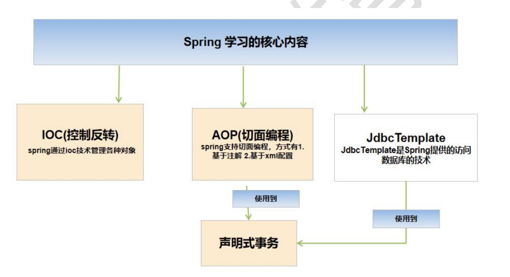
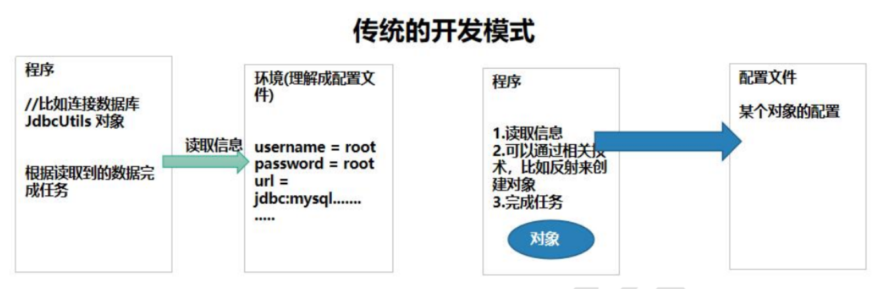
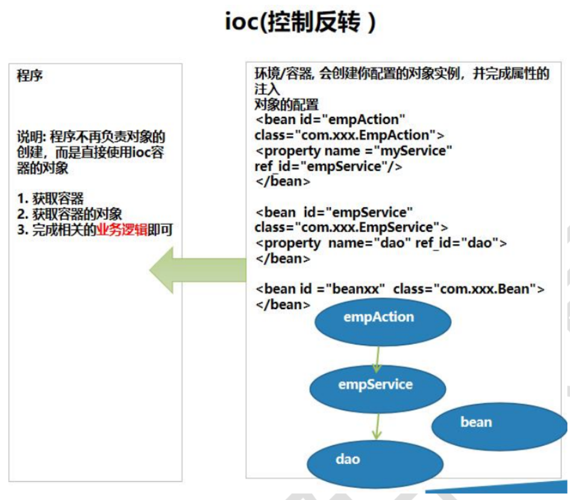
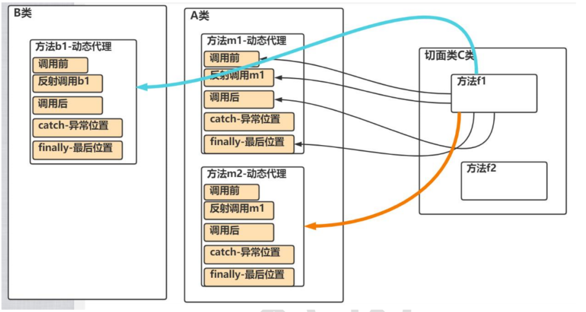
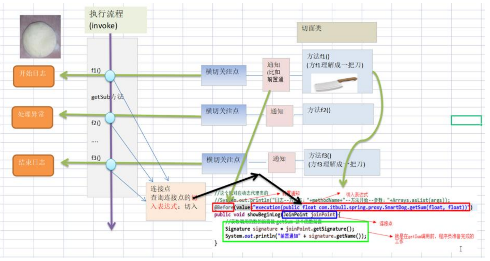
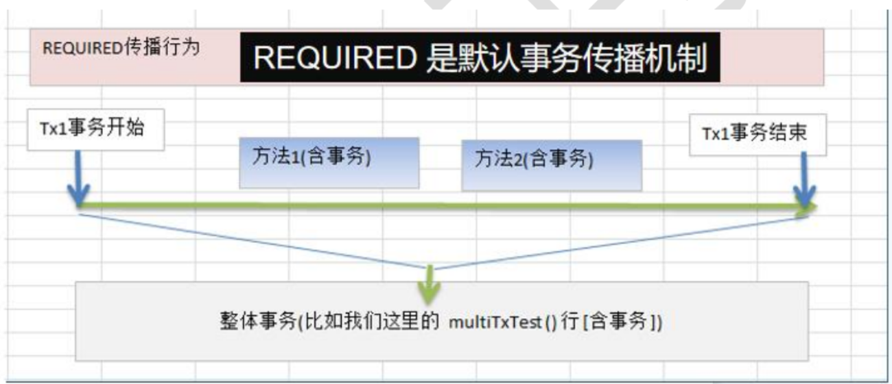
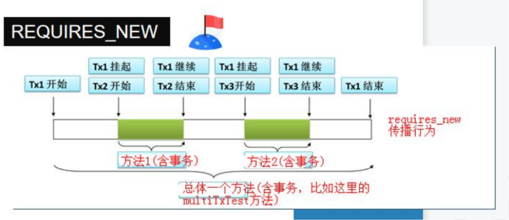

# 【韩顺平主流框架】Spring

## 基本介绍

### 写在前面

1. Spring底层机制
    - 初始化IOC容器
    - 依赖注入
    - BeanPost
    - Processor机制
    - AOP
2. 框架涉及的技术
    - 动态代理
    - 反射
    - 注解
    - IO
    - XML
    - 容器

1. Spring 底层机制概览
    Spring 的本质是一个“大管家”，核心在于**解耦**和**对象管理**。学习底层机制是掌握 Spring 的关键：

    *   **初始化 IOC 容器 (Inversion of Control)**：控制反转。以前我们手动 `new` 对象，现在将对象的创建、存储和管理权限全部交接给 Spring 容器。
    *   **依赖注入 (DI - Dependency Injection)**：容器在运行期间，自动将依赖的对象实例（比如 Service 需要 DAO）注入到对应的类中。
    *   **BeanPostProcessor 机制 (后置处理器)**：Spring 提供的极其重要的扩展点。它允许我们在 Spring 实例化 Bean 的前后，插入自定义的逻辑代码进行加工。
    *   **AOP (Aspect Oriented Programming)**：面向切面编程。在不修改原有业务源代码的前提下，动态地为程序添加统一的附加功能（如日志记录、事务控制、权限校验）。

2. 框架涉及的核心底层技术
    Spring 并不是凭空捏造的新技术，而是对以下 Java 核心底层技术的集大成封装：

    *   **动态代理**：AOP 机制的绝对基石（包含 JDK 原生动态代理和 CGLIB），用于在内存中动态生成目标类的代理对象。
    *   **反射 (Reflection)**：IOC 容器的基石。Spring 通过反射，在运行期动态解析类的信息，并调用构造方法实例化对象。
    *   **注解 (Annotation)**：用于替代繁琐的 XML 配置，实现声明式编程（如 `@Component`, `@Autowired`），极大提高开发效率。
    *   **IO 流**：用于读取系统中的各种外部资源（如读取 `applicationContext.xml` 或 `.properties` 配置文件）。
    *   **XML 解析**：传统 Spring 的核心配置载体，通过解析 XML 文件来读取 Bean 的装配规则。
    *   **容器 (Map 结构)**：Spring IOC 容器的本质，底层是一个高级的、线程安全的 `ConcurrentHashMap`，用于缓存和管理全局的 Bean 单例。

### 资料汇总

1. 官网
    - spring.io
    - Spring是一个家族，当前学习的是官网上列出的`Spring Framwork`。
    - https://spring.io/projects/spring-framework
    - **学习的版本是`Spring Framwork 5.3.8`**

2. 在线文档：https://docs.spring.io/spring-framework/docs/current/reference/html/

3. https://docs.spring.io/spring-framework/docs/current/javadoc-api/

### Spring下载指南：框架依赖管理的演进与现代化构建方案

1. 历史的眼泪：手动导包时代的终结

    在学习 Spring 的底层机制时，了解它依赖管理的历史，能帮我们深刻理解现代构建工具的伟大之处。

    *   **“大压缩包”时代 (Dist.zip)**：
        在早期的 JavaWeb 开发中，引入框架的唯一方式是去官网下载几十兆的 `.zip` 压缩包。解压后，开发者需要手动挑选里面需要的 `.jar` 文件，复制粘贴到项目的 `WEB-INF/lib` 目录下。
    *   **深渊降临：依赖地狱 (Dependency Hell)**：
        手动导包最大的噩梦在于“连带关系”。当你在项目中引入了 `spring-context.jar`，程序运行会立刻报错，因为你不知道它底层还依赖了 `spring-core`；等你补上了 `core`，又会发现缺了 `commons-logging`。开发者经常在一层层排查缺失的包、处理不同包之间的版本冲突中耗费大量精力。
    *   **官方的“大清洗” (2020-2021)**：
        随着 Spring 生态越来越庞大，打包全家桶供人下载变得极其臃肿且难以维护。Spring 官方最终做出了一个重要决定：**停止在官方公开仓库提供稳定版的 `.zip` 压缩包下载**。所有正式发行版的 JAR 包，全面移交至 Maven 中央仓库托管。至此，手动导包的时代在企业级开发中彻底落幕。

1. 现代企业级标准：拥抱自动化构建 (Maven / Gradle)

    为了彻底解决“依赖地狱”和团队协作中“包版本不一致”的问题，现代 Java 项目已经 100% 采用 **Maven** 或 **Gradle** 这样的自动化构建工具。

    **现代构建工具的核心优势：**
    1.  **自动解决传递依赖**：你只需要告诉 Maven “我要用 Spring Context”，它会自动顺藤摸瓜，把你需要的底层核心包、日志包按最兼容的版本一次性全部下载好。
    2.  **统一的规范**：去除了 `WEB-INF/lib` 这种臃肿的本地文件夹。整个项目的依赖信息只通过一个仅几 KB 的 `pom.xml` 文件来描述，极大地提升了团队协作和代码版本控制的效率。

1. 核心实战：使用 Maven 构建 Spring 项目

    在现代开发中，为一个 Web 项目引入 Spring 框架，只需在项目的 `pom.xml` 文件中的 `<dependencies>` 标签内写入核心依赖即可。

    **Spring 核心依赖配置（以 5.3.x 版本为例）：**
    ```xml
    <!-- 引入 Spring 核心上下文依赖 -->
    <!-- 声明此依赖后，Maven 会自动为你下载：spring-core, spring-beans, spring-aop, spring-expression 等所有底层连带包 -->
    <dependency>
        <groupId>org.springframework</groupId>
        <artifactId>spring-context</artifactId>
        <version>5.3.8</version>
    </dependency>
    ```
    *附注：在排查底层源码或依赖树时，可以使用 Maven 的依赖分析命令查看自动下载了哪些连带包：*

    ```shell
    # 查看项目的完整依赖树结构
    mvn dependency:tree
    ```
4. 延伸拓展：深入解析 Spring JAR 包的“标准三大件”

    虽然我们现在不再手动下载 `dist.zip` 压缩包，但如果你去翻看早期的解压目录树，或者现在去探秘 Maven 本地仓库的深处，你会发现每一个 Spring 的核心模块（例如 `spring-context`），都会标配三个极其重要、命名高度相似的 `.jar` 文件。

    在 Java 业界，这被称为开源类库发布的**标准三大件**。了解它们各自的职责，是后续进行底层源码剖析的基本功：

    **1. 核心编译包 (Compiled JAR)**
    *   **命名示例**：`spring-context-5.3.30.jar`
    *   **内容本质**：包含了经过 JDK 编译器编译后的 `.class` 字节码文件，以及必要的 `META-INF` 配置信息。
    *   **核心作用**：**项目真正依赖运行的“干活包”。** 当你的项目最终打包部署到 Tomcat 服务器上时，只有这个包会被打包进去，供 JVM 虚拟机读取并执行。

    **2. 源码包 (Sources JAR)**
    *   **命名示例**：`spring-context-5.3.30-sources.jar`
    *   **内容本质**：原汁原味的 `.java` 源代码文件。
    *   **核心作用**：**专供程序员阅读和断点调试的“透视镜”。** 当你在 IDEA 中按住 `Ctrl` 键点击 Spring 的某个底层类时，如果没有这个包，你看到的将是反编译出来的、没有注释且参数名为 `var1, var2` 的枯燥代码。有了它，IDEA 就能完美展示带有官方详尽注释的优雅源码。这是我们学习 Spring 底层机制的无价之宝。

    **3. API 文档包 (Javadoc JAR)**
    *   **命名示例**：`spring-context-5.3.30-javadoc.jar`
    *   **内容本质**：通过 Javadoc 工具从源码注释中自动提取并生成的离线 HTML 网页。
    *   **核心作用**：**框架使用的“官方新华字典”。** 在没有外网或不想去官网翻阅的情况下，将其解压后打开 `index.html`，你就能像查字典一样，查阅这个模块中每一个接口、类、方法的功能说明与参数定义。

    ---

    **💡 现代自动化构建中的“三大件”是如何流转的？**

    在使用 Maven 构建时，为了节省网络带宽和磁盘空间，Maven 默认**只会下载“核心编译包”**。

    但在现代企业开发中，IDE（如 IntelliJ IDEA）非常智能：
    1. **自动无感下载**：当你在代码中第一次尝试点击进入 Spring 源码内部时，IDEA 会在顶部弹出一个提示，并在后台静默触发下载请求，去 Maven 仓库把对应的 `-sources.jar` 拖回本地并自动关联。
    2. **一键补齐**：你也可以在 IDEA 右侧的 Maven 侧边栏中，点击 `Download Sources and Documentation` 按钮，强制 Maven 把整个项目中所有框架的源码包和文档包一次性全部下载齐全。

### Spring学习的核心内容

1. 图解
    

2. 解读
    - Spring 学习的核心内容为：IOC、AOP、JdbcTemplate。
    - IOC (控制反转)：Spring 通过 IOC 技术来管理各种 Java 对象。
    - AOP (切面编程)：Spring 支持切面编程，主要落地方式有两种：1. 基于注解；2. 基于 XML 配置。
    - JdbcTemplate：Spring 提供的一套用于访问数据库的技术。
    - 声明式事务：底层 **使用到 AOP 与 JdbcTemplate** 来共同实现事务的统一管理。

### 1.3 Spring 几个重要概念

1. 框架定位与核心

    * **框架的框架**：Spring 可以无缝整合其他优秀的开源框架（*Spring 是管理框架的框架*）。
    * **核心双擎**：Spring 体系的基石是两个核心概念 —— **IOC**（控制反转） 和 **AOP**（面向切面编程）。


1. 核心详解：IOC (Inversion Of Control 反转控制)
    

    要理解 IOC，最好的方式是将“传统开发模式”与“IOC 开发模式”进行对比：

    1. 传统的开发模式
        
        在传统模式下，**程序主动去读取环境配置，然后自己负责创建对象。**

        * **流程**：`程序 ------> 环境`
        * **实现步骤**：
        1. 程序员编写程序，在代码内部主动读取数据库等配置信息（如 `username`, `url` 等）。
        2. 程序通过 `new Object()` 或 反射技术 (`Class.forName()`) 主动创建对象实例。
        3. 程序使用该对象完成业务任务。

    2. IOC 的开发模式
        
        在 IOC 模式下，控制权发生了反转：**程序不再自己创建对象，而是由 Spring 容器统一创建好对象后，程序直接“坐享其成”拿来使用。**

        * **流程**：`程序 <------ 容器`
        * **实现步骤**：
        1. **容器接管**：Spring 根据配置文件（XML）或注解，自动创建对象，并将这些对象放入到 Spring 容器（底层通常是 `ConcurrentHashMap`）中，同时自动处理好对象之间的相互依赖关系。
        2. **按需获取**：当程序需要使用某个对象实例（如 `EmpAction`, `EmpService`）时，直接向容器索取即可。
        3. **专注业务**：程序员从繁琐的对象创建工作中解放出来，只需关注如何使用对象完成核心的业务逻辑。

1. 核心引申：DI 与 Spring 的终极价值

    * **DI (Dependency Injection 依赖注入)**
    * **概念转换**：DI 其实就是 IOC 的另一种更加具体的叫法和实现方式。控制反转是思想，依赖注入是具体动作（容器把依赖的对象“注入”到需要它的类中）。
    * **Spring 的核心价值**
    * **一站式对象提供**：Spring 最大的价值在于，通过简单的配置，就能在程序运行时源源不断地提供各层所需的关键对象，包括：
        * Web 层对象（`Servlet` / `Action` / `Controller`）
        * 业务逻辑层对象（`Service`）
        * 数据访问层对象（`Dao`）
        * 实体对象（`JavaBean` / `Entity`）
    * **终极目标：解耦**：这是 IOC 具体体现的核心意义，让各个组件之间不再高度耦合，提升了代码的灵活性和可维护性。

1. 代码直观对比：传统模式 vs Spring DI 模式

    为了更直观地理解 IOC 和 DI 的作用，我们可以通过以下极简代码进行对比：

    **1. 传统开发模式（高耦合）**
    在传统模式下，`EmpService` 强依赖于 `EmpDao` 的具体实现，且必须亲自 `new` 出来：

    ```java
    public class EmpService {
        // 程序员必须主动 new 对象，Service 和 Dao 紧紧绑死在一起
        private EmpDao empDao = new EmpDao();
        
        public void doWork() {
            empDao.save(); // 使用对象完成任务
        }
    }
    ```

    **2. Spring IOC/DI 模式（低耦合）**
    在 Spring 模式下，`EmpService` 不再关心对象是怎么来的，直接声明需要即可，Spring 会自动送货上门：

    ```java
    public class EmpService {
        // 程序不再主动 new 对象，而是贴上注解，由 Spring 容器负责注入 (DI)
        @Autowired
        private EmpDao empDao; 
        
        public void doWork() {
            empDao.save(); // 直接使用，完全不用管 empDao 是何时、如何被实例化的
        }
    }
    ```

### 快速入门

#### 演示

1. 实体类：`com.lcq.spring.entity.Monster`
    **说明：**
    - 该类作为 Spring 容器管理的普通 Bean。
    - 在当前这种 **基于 XML + setter 注入** 的入门写法中，通常需要提供：
        - **无参构造器**：便于 Spring 通过反射先创建对象实例；
        - **setter 方法**：便于 Spring 根据 `<property>` 标签完成属性注入。
    - `getter` 方法不是属性注入本身的必要条件，但在调试、打印、封装规范等场景中通常也会一并提供。
    ```java
    package com.lcq.spring.entity;
    public class Monster {
        private Integer id;
        private String name;
        private String skill;

        public Monster() {
        }
        // ...
    }
    ```

2. 配置文件：`src/main/resources/beans.xml`

    **说明：**
    - `beans.xml` 用于声明并配置 Spring 容器中的 Bean。
    - 每个 `<bean>` 节点通常至少包含两个关键属性：
        - `id`：Bean 在容器中的唯一标识，后续通过该名称获取对象；
        - `class`：Bean 对应类的全限定类名，Spring 通过反射创建对象。
    - `<property>` 标签用于属性注入：
        - `name` 对应的是 **JavaBean 属性名**；
        - 本质上，Spring 会根据该属性名去匹配对应的 `setter` 方法；
        - 例如 `name="skill"`，底层通常对应调用 `setSkill(...)`。

    ```xml
    <?xml version="1.0" encoding="UTF-8"?>
    <beans xmlns="http://www.springframework.org/schema/beans"
        xmlns:xsi="http://www.w3.org/2001/XMLSchema-instance"
        xsi:schemaLocation="http://www.springframework.org/schema/beans http://www.springframework.org/schema/beans/spring-beans.xsd">

        <bean id="monster" class="com.lcq.spring.entity.Monster">
            <property name="name" value="a"/>
            <property name="id" value="1"/>
            <property name="skill" value="football"/>
        </bean>

    </beans>
    ```

3. 测试代码

    **说明：**
    - `ClassPathXmlApplicationContext` 的作用是：
        - 从**类路径（classpath）**中加载指定配置文件；
        - 按 **Spring XML Bean 配置格式** 解析该文件；
        - 创建并初始化 IOC 容器。
    - 这里写：
        ```java
        new ClassPathXmlApplicationContext("beans.xml");
        ```
        表示：
        - 去类路径根目录查找 `beans.xml`；
        - 在 Maven 项目中，通常对应 `src/main/resources/beans.xml`；
        - 运行后，该文件一般位于 `target/classes/beans.xml`。

    - 获取 Bean 的常见方式有两种：
        - 返回 `Object`，再自行强转；
        - 直接按名称 + 类型获取，更安全、更清晰。

    ```java
    @Test
    public void testBean2() {
        ApplicationContext applicationContext =
                new ClassPathXmlApplicationContext("beans.xml");

        // Object monster = applicationContext.getBean("monster");
        Monster monster = applicationContext.getBean("monster", Monster.class);

        System.out.println(monster);
        // 输出：Monster{id=1, name='a', skill='football'}
    }
    ```

#### 类加载路径

1. 示例
    ```java
    @Test
    public void classPath() {
        File file = new File(this.getClass().getResource("/").getPath());
        System.out.println("file:" + file);// file:E:\code\IntelliJ\spring01\target\test-classes
    }
    ```

2. 特点
    - 在同一个应用中，类加载器找到的类对象、类加载器对象是同一个。
    - 在实际生产环境中，可以通过不同对象的类加载器，获取不同路径下的对象


#### 类路径（Classpath）

1. 示例

    ```java
    @Test
    public void classPath() {
        File file = new File(this.getClass().getResource("/").getPath());
        System.out.println("file:" + file);
        // 例如：file:E:\code\IntelliJ\spring01\target\test-classes
    }
    ```

2. 说明

    - `this.getClass().getResource("/")` 表示获取**类路径根目录**。
    - 在测试代码中，这个根目录通常是：

        ```text
        target/test-classes
        ```

    - 在普通主程序运行场景中，类路径根目录通常对应：

        ```text
        target/classes
        ```

    - 因此，Spring 代码中写：

        ```java
        new ClassPathXmlApplicationContext("beans.xml");
        ```

        本质上是让 Spring 去类路径根目录下查找：

        ```text
        beans.xml
        ```

        而不是去源码目录中直接查找：

        ```text
        src/main/resources/beans.xml
        ```


#### 类加载器的理解

1. 当前学习场景下的结论

    在当前这种普通的单模块 Maven / Spring 入门项目中：

    - 大多数自己编写的类，通常由**同一个应用类加载器**加载；
    - 因此，很多情况下通过不同类去调用：

    ```java
    某个类.class.getClassLoader()
    ```

    拿到的 `ClassLoader` 往往是同一个。

    这也是为什么在当前学习阶段，很多类都可以用来读取同一类路径下的资源文件。

2. 需要避免的绝对化表述

    下面这种说法不够严谨：

    - “在同一个应用中，类加载器找到的类对象、类加载器对象是同一个。”

    更严谨的表述应为：

    - **在当前这种普通项目结构下，大多数自定义类通常由同一个应用类加载器加载，因此通过它们获取到的类加载器往往相同。**

3. 生产环境中的补充理解

    在更复杂的生产环境中，例如：

    - 多个 Web 应用同时部署；
    - 插件化系统；
    - 模块隔离系统；

    不同模块、不同应用可能会使用**不同的类加载器**。  
    此时，不同类对应的类加载器，可能看到的是**不同范围的类路径资源**。

    因此，更准确的说法是：

    - **在简单项目中，很多类拿到的是同一个类加载器；**
    - **在复杂项目中，不同类背后的类加载器可能不同，从而读取到不同作用范围内的资源。**

### 源码简单解析

#### 基本内容

1. 基本认识

    1. `ClassPathXmlApplicationContext` 本质上是一个 **IOC 容器实现类**，用于：
        - 从类路径加载 XML 配置文件；
        - 解析 `<bean>` 等配置；
        - 创建并管理 Spring 容器中的 Bean。

    2. `ApplicationContext` 通常可以视为一个 **相对重量级对象**：
        - 创建容器时，会进行配置文件解析、BeanDefinition 注册、单例 Bean 初始化等操作；
        - 在实际项目中，通常不会频繁创建多个容器，而是**一个应用或一个模块维护一个主容器**；
        - 在测试代码中，为了演示某个功能，临时创建多个容器是可以的，但不属于常规使用方式。

    3. 学习源码时要明确区分两个概念：
        - **BeanDefinition**：Bean 的“定义信息”，描述这个 Bean 应该如何创建；
        - **Bean 实例**：真正创建出来并可供程序使用的对象。

2. 调试源码前的建议设置

    为了更直观地观察 Spring 容器内部结构，建议在 IDEA 中做如下设置：

    1. **设置 -> 构建、执行、部署 -> 调试器 -> 数据视图 -> Java**
        - 取消勾选：
            - `在数组和集合中隐藏 null 元素`
            - `启用集合类的替代视图`

        - **目的：**
            - 更真实地观察底层集合结构；
            - 有助于理解容器内部数据是如何存储的。

    2. **设置 -> 构建、执行、部署 -> 调试器 -> 步进**
        - 取消勾选：
            - `不要进入类`

        - **目的：**
            - 便于在调试时真正进入 Spring 源码内部，而不是被 IDE 自动跳过。

#### 通过 Debug 可以重点观察哪些内容

> 以下内容以 Spring 5.x 常见实现为背景进行理解。  
> 需要注意：这些属于 **Spring 内部实现细节**，具体类名、字段名、底层集合实现可能随版本变化，但整体思想是稳定的。

1. BeanDefinition 的注册位置：`beanDefinitionMap`

    1. 在容器刷新过程中，Spring 会先读取 XML 配置文件中的 `<bean>` 节点，并将其解析为 **BeanDefinition**。
    2. 这些 BeanDefinition 通常会被注册到 `BeanFactory` 内部的 `beanDefinitionMap` 中。
    3. `beanDefinitionMap` 的作用可以理解为：

        - **key**：`bean` 的名称（即 `id` 或 `name`）
        - **value**：该 Bean 对应的定义信息（BeanDefinition）

    4. beanDefinitionMap是一个`ConcurrentHashMap`，用于存放`beans.xml`中的`bean`节点配置的`bean`对象的信息。
        其属性`table`是数组，类型为`ConcurrentHashMap$Node`，初始化`512`，自动扩容。可以存放很多`bean`，`key`为`bean-id`，`value`是对应对象的详细信息。

    4. 这些定义信息通常包括：
        - Bean 对应的类名（`beanClass` 或类相关元数据）
        - 是否延迟加载（`lazyInit`）
        - 作用域（`scope`）
        - 属性注入信息（`propertyValues`）
        - 构造器参数信息
        - 初始化、销毁方法等元数据

    5. 因此可以这样理解：

        - `beanDefinitionMap` 中放的**不是 Bean 实例本身**
        - 而是“将来如何创建这个 Bean”的说明书

2. 单例 Bean 的缓存位置：`singletonObjects`

    1. 对于默认作用域的 Bean（即 `scope="singleton"`），Spring 通常会将创建好的单例对象放入单例池中。
    2. 这个单例池在源码中常见为 `singletonObjects`。
    3. 它的作用可以理解为：

        - **key**：Bean 名称
        - **value**：已经创建完成的单例对象

    4. 当调用 `getBean()` 获取单例 Bean 时：

        - 如果该 Bean 已经在单例池中，直接返回；
        - 如果尚未创建，则按规则创建后再放入单例池。

    5. 这里要特别注意：

        - **默认情况下，普通单例 Bean 往往会在容器启动时预先实例化**
        - 但如果配置了延迟加载（如 `lazy-init="true"`），则可能在第一次 `getBean()` 时才创建

    6. 因此，更严谨的表述应为：

        - `singletonObjects` 可以理解为 Spring 管理的 **单例对象缓存池**
        - `getBean()` 获取单例对象时，通常优先从这里取


3. Bean 名称列表：`beanDefinitionNames`

    1. Spring 还会维护一个 Bean 名称列表，常见为 `beanDefinitionNames`。
    2. 这个结构中记录的是当前容器中已经注册过的 Bean 名称。
    3. 它的主要作用是：
        - 方便按顺序遍历所有已注册 Bean；
        - 支持诸如 `getBeanDefinitionNames()` 这样的接口调用；
        - 为某些容器初始化和后续处理提供名称集合。

    4. 可以简单理解为：

        - `beanDefinitionMap` 负责“名称 -> 定义”的映射；
        - `beanDefinitionNames` 负责“所有 Bean 名称的顺序列表”。

#### 对 Spring 容器初始化过程的简化理解

从入门角度，可以把 Spring 容器的工作过程粗略理解为下面几步：

1. **读取配置文件**
   - 例如读取 `beans.xml`

2. **解析配置**
   - 将每个 `<bean>` 节点解析成对应的 BeanDefinition

3. **注册定义信息**
   - 放入 `beanDefinitionMap` 等结构中

4. **创建 Bean 实例**
   - 对符合条件的单例 Bean 进行实例化
   - 完成依赖注入、属性填充、初始化等操作

5. **缓存单例对象**
   - 将创建好的单例 Bean 放入 `singletonObjects`

6. **对外提供获取能力**
   - 程序通过 `getBean()` 从容器中获取对象

#### 示例：获取容器中已注册 Bean 的名称

1. 代码
    ```java
    @Test
    public void beanId() {
        ApplicationContext ioc = new ClassPathXmlApplicationContext("beans.xml");
        String[] beanDefinitionNames = ioc.getBeanDefinitionNames();
        for (String beanDefinitionName : beanDefinitionNames) {
            System.out.println(beanDefinitionName);
        }
    }
    ```

2.  代码说明

    1. 创建 Spring 容器：
        ```java
        ApplicationContext ioc = new ClassPathXmlApplicationContext("beans.xml");
        ```
        表示从类路径中加载 `beans.xml`，并初始化 IOC 容器。

    2. 获取所有 Bean 的定义名称：
        ```java
        String[] beanDefinitionNames = ioc.getBeanDefinitionNames();
        ```
        这里返回的是容器中注册过的 Bean 名称数组。

    3. 遍历输出：
        ```java
        for (String beanDefinitionName : beanDefinitionNames) {
            System.out.println(beanDefinitionName);
        }
        ```
        可以看到当前容器中有哪些 Bean 被 Spring 管理。

### 简单模拟XML读取

1. 简单代码
    ```java
    public class MyApplicationContext {

        private ConcurrentHashMap<String, Object> singletonObjects = new ConcurrentHashMap<>();

        public MyApplicationContext(String configLocation) throws ClassNotFoundException, InstantiationException, IllegalAccessException {


            String path = this.getClass().getResource("/").getPath();
            String configPath = path + configLocation;

            SAXReader saxReader = new SAXReader();
            Document document = null;
            try {
                document = saxReader.read(configPath);
            } catch (DocumentException e) {
                throw new RuntimeException(e);
            }

            Element rootElement = document.getRootElement();
            List<Element> beans = rootElement.elements("bean");

            for (Element bean : beans) {
                String id = bean.attributeValue("id");
                String classFullPath = bean.attributeValue("class");
                List<Element> property = bean.elements("property");
                int propertyId = Integer.parseInt(property.get(1).attributeValue("value"));
                String name = property.get(0).attributeValue("value");
                String skill = property.get(2).attributeValue("value");

                Class<?> aClass = Class.forName(classFullPath);
                Monster monster = (Monster) aClass.newInstance();

                // 模拟反射
                monster.setId(propertyId);
                monster.setName(name);
                monster.setSkill(skill);

                singletonObjects.put(id, monster);
            }
        }

        public Object getBean(String id) {
            return singletonObjects.get(id);
        }
    }
    ```

2. 代码by ChatGPT
    ```java
    package com.lcq.myspring;

    import org.dom4j.Document;
    import org.dom4j.DocumentException;
    import org.dom4j.Element;
    import org.dom4j.io.SAXReader;

    import java.io.InputStream;
    import java.lang.reflect.Method;
    import java.util.List;
    import java.util.concurrent.ConcurrentHashMap;

    public class MyApplicationContext2 {

        /**
        * 简化版单例池：
        * key   -> bean 的 id
        * value -> 创建好的对象实例
        */
        private final ConcurrentHashMap<String, Object> singletonObjects = new ConcurrentHashMap<>();

        public MyApplicationContext2(String configLocation) {
            loadBeans(configLocation);
        }

        /**
        * 根据配置文件加载并创建所有 bean
        */
        private void loadBeans(String configLocation) {
            try (InputStream is = this.getClass().getClassLoader().getResourceAsStream(configLocation)) {

                if (is == null) {
                    throw new RuntimeException("找不到配置文件: " + configLocation);
                }

                SAXReader saxReader = new SAXReader();
                Document document = saxReader.read(is);

                Element rootElement = document.getRootElement();
                List<Element> beans = rootElement.elements("bean");

                for (Element bean : beans) {
                    String id = bean.attributeValue("id");
                    String classFullPath = bean.attributeValue("class");

                    if (id == null || id.trim().isEmpty()) {
                        throw new RuntimeException("bean 的 id 不能为空");
                    }
                    if (classFullPath == null || classFullPath.trim().isEmpty()) {
                        throw new RuntimeException("bean 的 class 不能为空");
                    }

                    // 1. 反射创建对象
                    Class<?> beanClass = Class.forName(classFullPath);
                    Object instance = beanClass.getDeclaredConstructor().newInstance();

                    // 2. 属性注入
                    List<Element> properties = bean.elements("property");
                    for (Element property : properties) {
                        String propertyName = property.attributeValue("name");
                        String propertyValue = property.attributeValue("value");

                        injectProperty(instance, beanClass, propertyName, propertyValue);
                    }

                    // 3. 放入容器
                    singletonObjects.put(id, instance);
                }

            } catch (DocumentException e) {
                throw new RuntimeException("XML 解析失败", e);
            } catch (Exception e) {
                throw new RuntimeException("容器初始化失败", e);
            }
        }

        /**
        * 给对象注入单个属性
        */
        private void injectProperty(Object instance, Class<?> beanClass, String propertyName, String propertyValue) throws Exception {
            if (propertyName == null || propertyName.trim().isEmpty()) {
                throw new RuntimeException("property 的 name 不能为空");
            }

            // 例如 id -> setId
            String setterName = "set" + Character.toUpperCase(propertyName.charAt(0)) + propertyName.substring(1);

            Method targetMethod = null;
            for (Method method : beanClass.getMethods()) {
                if (method.getName().equals(setterName) && method.getParameterCount() == 1) {
                    targetMethod = method;
                    break;
                }
            }

            if (targetMethod == null) {
                throw new RuntimeException(beanClass.getName() + " 中不存在属性 " + propertyName + " 对应的 setter 方法");
            }

            Class<?> parameterType = targetMethod.getParameterTypes()[0];
            Object convertedValue = convertValue(parameterType, propertyValue);

            targetMethod.invoke(instance, convertedValue);
        }

        /**
        * 把字符串 value 转成 setter 需要的参数类型
        */
        private Object convertValue(Class<?> parameterType, String propertyValue) {
            if (parameterType == String.class) {
                return propertyValue;
            }
            if (parameterType == Integer.class || parameterType == int.class) {
                return Integer.parseInt(propertyValue);
            }
            if (parameterType == Long.class || parameterType == long.class) {
                return Long.parseLong(propertyValue);
            }
            if (parameterType == Double.class || parameterType == double.class) {
                return Double.parseDouble(propertyValue);
            }
            if (parameterType == Boolean.class || parameterType == boolean.class) {
                return Boolean.parseBoolean(propertyValue);
            }

            throw new RuntimeException("暂不支持的属性类型: " + parameterType.getName());
        }

        public Object getBean(String id) {
            Object bean = singletonObjects.get(id);
            if (bean == null) {
                throw new RuntimeException("容器中不存在 id 为 " + id + " 的 bean");
            }
            return bean;
        }

        public <T> T getBean(String id, Class<T> requiredType) {
            Object bean = getBean(id);
            return requiredType.cast(bean);
        }
    }
    ```

### Bean没有id的情况

1. 代码
    - 可以看出，没有ID的bean会以`全路径类名+#+编号`存储。
    ```java
    @Test
    public void noId(){
        ApplicationContext applicationContext = new ClassPathXmlApplicationContext("beans.xml");
        String[] beanDefinitionNames = applicationContext.getBeanDefinitionNames();
        // [monster, monster2, com.lcq.spring.entity.Monster#0, 
        // com.lcq.spring.entity.Monster#1, com.lcq.spring.entity.Monster#2]
        System.out.println(Arrays.toString(beanDefinitionNames));
        /*
        Monster{id=1, name='a', skill='football'}
        Monster{id=1, name='a', skill='football2'}
        Monster{id=1, name='a', skill='footballNo1'}
        Monster{id=1, name='a', skill='footballNo2'}
        Monster{id=1, name='a', skill='footballNo3'}
         */
        for (String beanDefinitionName : beanDefinitionNames) {
            System.out.println(applicationContext.getBean(beanDefinitionName, Monster.class));
        }
    }
    ```

2. 一个歪路子
    ```java
    Monster monster = ioc.getBean(Monster.class.getName() + "#" + id, Monster.class);
    ```

3. 取出所有特定类对象`id -> obj`
    - `getBeansOfType()`可以获取某一类的所有bean
    ```java
    @Test
    public void getBeansByType() {
        ApplicationContext ioc = new ClassPathXmlApplicationContext("beans.xml");
        Map<String, Monster> beans = ioc.getBeansOfType(Monster.class);
        for (Map.Entry<String, Monster> entry : beans.entrySet()) {
            System.out.println(entry.getKey() + " -> " + entry.getValue());
        }
    }
    ```

## Spring管理Bean——IOC

### 章节目录

1. Bean管理
    - 创建Bean对象
    - 给Bean注入属性

2. Bean配置
    - 基于`xml`文件配置
    - 基于注解配置

### 基于XML配置Bean

#### 通过类型获取bean

1. 准备

    - `Monster.java`
    - `beans.xml`

2. 代码

    ```java
    @Test
    public void byType(){
        ApplicationContext ioc = new ClassPathXmlApplicationContext("/beans.xml");
        Monster monster = ioc.getBean(Monster.class);// NoUniqueBeanDefinitionException
        System.out.println(monster);
    }
    ```

3. 注意事项
    - 使用方法`getBean(Class<> clazz)`获取配置中的唯一对象。
    - 只有配置中仅存在一个此类配置时，才会生效。否则抛出`NoUniqueBeanDefinitionException`异常。
    - 应用场景：在`XxxAction/Servlet/Controller`中，或`XxxService`，在一个线程中只需要一个对象实例的情况。


#### 通过指定构造器配置Bean

1. 准备
    - 构造器
        ```java
        public Monster(Integer id, String name, String skill) {
            System.out.println("Monster(Integer id, String name, String skill) be called!");
            this.id = id;
            this.name = name;
            this.skill = skill;
        }
        ```

    - xml
        ```xml
        <bean id="monsterByConstructor" class="com.lcq.spring.entity.Monster">
            <!--Integer id, String name, String skill-->
            <constructor-arg value="1000" index="0" />
            <constructor-arg value="A" index="1" />
            <constructor-arg value="a-skill" index="2" />
        </bean>
        ```

2. 测试
    ```java
    @Test
    public void byConstructor() {
        ApplicationContext ioc = new ClassPathXmlApplicationContext("/beans.xml");
        Monster monster = ioc.getBean("monsterByConstructor",Monster.class);
        /*
        Monster(Integer id, String name, String skill) be called!
        Monster{id=1000, name='A', skill='a-skill'}
         */
        System.out.println(monster);
    }
    ```

3. 注意事项
    - `<constructor-arg>`用于告诉Spring：在创建Bean时，不使用无参构造器加`setter`注入，而是**直接调用指定构造器完成对象创建**。
    - 上述配置中使用`index`来指定参数位置：
        - `index="0"`对应构造器第1个参数；
        - `index="1"`对应构造器第2个参数；
        - `index="2"`对应构造器第3个参数。
    - `value`中的值本质上先以字符串形式读取，Spring会根据目标构造器参数类型进行类型转换，例如把`"1000"`转换为`Integer`。
    - 使用构造器注入时，Spring 会在容器初始化阶段根据参数信息匹配合适的构造器；如果匹配成功，就直接调用该构造器创建对象。
    - 构造器注入适合以下场景：
        - 对象创建时必须提供完整参数；
        - 希望对象一创建就处于有效状态；
        - 某些属性不希望先创建后再通过`setter`补充。
    - 当构造器参数较多时，使用`index`可以明确参数顺序，避免因同类型参数较多而产生歧义。
    - 除了`index`方式外，`<constructor-arg>`在实际开发中还可以结合`name`、`type`、`ref`等属性使用，用于：
        - 按参数名匹配；
        - 按参数类型辅助匹配；
        - 注入其他Bean对象而不是简单值。
        - 在构造器重载次数多的类尤为有效。
        - `type`用于告诉Spring该参数希望匹配什么类型。
        - 当构造器存在重载时，`type`可以帮助Spring缩小匹配范围。
        - 但如果多个参数类型完全相同，例如这里有两个`String`，仅靠`type`本身仍然不够精确，实际使用时常与`index`或`name`配合。
        - Spring底层不会因为多个构造器同时匹配而报错，而是会选择一个最适合的。在传入的参数中，由于读取的天然就是字符串，所以对于没有指定类型的参数，优先按照字符串处理。**但在某些版本中，可能会出现不同的结果，这种无法完全应在实际开发中坚决规避。**
        
        ```xml
        <bean id="monsterByTypeAndIndex" class="com.lcq.spring.entity.Monster">
            <constructor-arg index="0" type="java.lang.Integer" value="1003"/>
            <constructor-arg index="1" type="java.lang.String" value="孙悟空"/>
            <constructor-arg index="2" type="java.lang.String" value="金箍棒"/>
        </bean>
        ```
        
    - 如果既没有无参构造器，又没有正确配置`constructor-arg`，Spring 在实例化Bean时就可能失败。
    - 构造器注入与`setter`注入并不是互斥关系，但在同一个Bean中通常应根据设计意图合理选择主方式：  
      前者强调“创建时即完整”，后者强调“先创建再补充属性”。

#### 通过p名称空间配置Bean

1. 准备
    ```xml
    <bean id="monsterByPLabel" class="com.lcq.spring.entity.Monster"
        p:id="1000"
        p:name="name"
        p:skill="aha"/>
    ```

2. 注意事项
    - p名称空间位于bean标签内。
    - 必须在根标签添加属性：`xmlns:p="http://www.springframework.org/schema/p"`才可以如此使用，IDEA可以自动补全（`Alt+Enter`）。

#### 引用/注入内部Bean对象

1. 说明
    - 在Spring中的IOC容器中，可以通过`ref`实现bean的相互引用
    - Spring容器是作为整体执行的，bean对象顺序不影响ref

2. 准备
    - xml
        ```xml
        <bean id="memberDAO" class="com.lcq.spring.dao.MemberDAOImpl"/>
        <bean id="memberService" class="com.lcq.spring.service.MemberServiceImpl">
            <property name="memberDAO" ref="memberDAO"/>
        </bean>
        ```
    - `com.lcq.spring.dao.MemberDAOImpl`
        ```java
        public class MemberDAOImpl {
            public MemberDAOImpl() {
                System.out.println("MemberDAOImpl() be called!");
            }

            public void add(){
                System.out.println("func: MemberDAOImpl.add() be called!");
            }
        }
        ```
    - `com.lcq.spring.service.MemberServiceImpl`
        ```java
        public class MemberServiceImpl {
            MemberDAOImpl memberDAO;

            public MemberServiceImpl() {
            }

            public MemberServiceImpl(MemberDAOImpl memberDAO) {
                this.memberDAO = memberDAO;
            }

            public void add() {
                memberDAO.add();
            }
        // ... 
        }
        ```


3. 测试
    ```java
    @Test
    public void byRef() {
        ApplicationContext ioc = new ClassPathXmlApplicationContext("/beans.xml");
        /*
        MemberDAOImpl() be called!
        func: MemberDAOImpl.add() be called!
         */
        MemberServiceImpl memberService = ioc.getBean("memberService", MemberServiceImpl.class);
        memberService.add();
    }
    ```

#### 引用/注入内部Bean对象

1. 准备
    ```xml
    <bean id="memberService2" class="com.lcq.spring.service.MemberServiceImpl">
        <property name="memberDAO">
            <bean class="com.lcq.spring.dao.MemberDAOImpl"/>
        </property>
    </bean>
    ```

2. 测试

    ```java
    @Test
    public void byRef2() {
        ApplicationContext ioc = new ClassPathXmlApplicationContext("/beans.xml");

        MemberServiceImpl memberService = ioc.getBean("memberService2", MemberServiceImpl.class);
        memberService.add();
    }
    ```

### 引用/注入 集合/数组类型

#### 对list属性进行配置

1. 准备
    - `Master.java`
        ```java
        public class Master {
            private String name;
            private List<Monster> monsterList;

            public void setName(String name) {
                this.name = name;
            }

            public void setMonsterList(List<Monster> monsterList) {
                this.monsterList = monsterList;
            }

            @Override
            public String toString() {
                return "Master{" +
                        "name='" + name + '\'' +
                        ", monsterList=" + monsterList +
                        '}';
            }
        }
        ```
    - xml
        ```xml
        <bean id="monster01" class="com.lcq.spring.entity.Monster">
            <property name="id" value="100"/>
            <property name="name" value="白骨精"/>
            <property name="skill" value="吸人血"/>
        </bean>

        <bean id="monster02" class="com.lcq.spring.entity.Monster">
            <property name="id" value="200"/>
            <property name="name" value="牛魔王"/>
            <property name="skill" value="芭蕉扇"/>
        </bean>

        <bean id="master" class="com.lcq.spring.entity.Master">
            <property name="name" value="太上老君"/>
            <property name="monsterList">
                <list>
                    <ref bean="monster01"/>
                    <ref bean="monster02"/>
                    <bean class="com.lcq.spring.entity.Monster">
                        <property name="id" value="300"/>
                        <property name="name" value="老鼠精"/>
                        <property name="skill" value="偷粮食"/>
                    </bean>
                </list>
            </property>
        </bean>
        ```

2. 测试
    ```java
    @Test
    public void listConfig() {
        ApplicationContext ioc = new ClassPathXmlApplicationContext("beans.xml");
        Master master = ioc.getBean("master", Master.class);
        System.out.println(master);
    }
    ```

3. 注意事项
    - `<list>`用于给`List`类型属性赋值。
    - `list`中的元素既可以是`<value>`简单值，也可以是`<ref>`引用外部Bean，还可以直接配置内部Bean。
    - 如果属性的类型是`List<Monster>`，实际配置中通常应放入Monster对象，而不是普通字符串。
    - Spring 会根据属性对应的`setter`方法，将整个`list`注入到目标对象中。

#### 对Map属性进行配置

1. 准备
    - `Master.java`
        ```java
        public class Master {
            private Map<String, Monster> monsterMap;

            public void setMonsterMap(Map<String, Monster> monsterMap) {
                this.monsterMap = monsterMap;
            }

            @Override
            public String toString() {
                return "Master{" +
                        "monsterMap=" + monsterMap +
                        '}';
            }
        }
        ```
    - xml
        ```xml
        <bean id="monster03" class="com.lcq.spring.entity.Monster">
            <property name="id" value="301"/>
            <property name="name" value="金角大王"/>
            <property name="skill" value="吐水"/>
        </bean>

        <bean id="monster04" class="com.lcq.spring.entity.Monster">
            <property name="id" value="302"/>
            <property name="name" value="银角大王"/>
            <property name="skill" value="喷火"/>
        </bean>

        <bean id="masterMap" class="com.lcq.spring.entity.Master">
            <property name="monsterMap">
                <map>
                    <entry key="monster03" value-ref="monster03"/>
                    <entry key="monster04" value-ref="monster04"/>
                    <property name="monsterMap">
                        <map>
                            <entry>
                                <key>
                                    <value>monster03</value>
                                </key>
                                <ref bean="monster03"/>
                            </entry>
                            <entry>
                                <key>
                                    <value>monster04</value>
                                </key>
                                <ref bean="monster04"/>
                            </entry>
                        </map>
                    </property>
                </map>
            </property>
        </bean>
        ```

2. 测试
    ```java
    @Test
    public void mapConfig() {
        ApplicationContext ioc = new ClassPathXmlApplicationContext("beans.xml");
        Master master = ioc.getBean("masterMap", Master.class);
        System.out.println(master);
    }
    ```

3. 注意事项
    - `<map>`用于给`Map`类型属性赋值。
    - 常见写法是通过`<entry key="..." value-ref="..."/>`配置键值对。
    - `key`通常对应Map中的键；`value-ref`表示值是另一个Bean对象。
    - 如果值是普通字符串，也可以使用`value`而不是`value-ref`。
    - **将key和value分开，可以有助于插入复杂的对象代替字符串。**

#### 对Set属性进行配置

1. 准备
    - `Master.java`
        ```java
        public class Master {
            private Set<Monster> monsterSet;

            public void setMonsterSet(Set<Monster> monsterSet) {
                this.monsterSet = monsterSet;
            }

            @Override
            public String toString() {
                return "Master{" +
                        "monsterSet=" + monsterSet +
                        '}';
            }
        }
        ```
    - xml
        ```xml
        <bean id="monster05" class="com.lcq.spring.entity.Monster">
            <property name="id" value="401"/>
            <property name="name" value="青牛精"/>
            <property name="skill" value="套法宝"/>
        </bean>

        <bean id="monster06" class="com.lcq.spring.entity.Monster">
            <property name="id" value="402"/>
            <property name="name" value="红孩儿"/>
            <property name="skill" value="吐火"/>
        </bean>

        <bean id="masterSet" class="com.lcq.spring.entity.Master">
            <property name="monsterSet">
                <set>
                    <ref bean="monster05"/>
                    <ref bean="monster06"/>
                    <bean class="com.lcq.spring.entity.Monster">
                        <property name="id" value="403"/>
                        <property name="name" value="九头虫"/>
                        <property name="skill" value="变化多端"/>
                    </bean>
                </set>
            </property>
        </bean>
        ```

2. 测试
    ```java
    @Test
    public void setConfig() {
        ApplicationContext ioc = new ClassPathXmlApplicationContext("beans.xml");
        Master master = ioc.getBean("masterSet", Master.class);
        System.out.println(master);
    }
    ```

3. 注意事项
    - `<set>`用于给`Set`类型属性赋值。
    - `set`中元素的配置方式与`list`类似，也可以放`value`、`ref`或内部Bean。
    - `Set`的特点是无序且通常不允许重复元素，因此打印顺序不一定与XML书写顺序完全一致。

#### 对Array属性进行配置

1. 准备
    - `Master.java`
        ```java
        public class Master {
            private String[] monsterName;

            public void setMonsterName(String[] monsterName) {
                this.monsterName = monsterName;
            }

            @Override
            public String toString() {
                return "Master{" +
                        "monsterName=" + Arrays.toString(monsterName) +
                        '}';
            }
        }
        ```
    - xml
        ```xml
        <bean id="masterArray" class="com.lcq.spring.entity.Master">
            <property name="monsterName">
                <array>
                    <value>小妖怪</value>
                    <value>大妖怪</value>
                    <value>老妖怪</value>
                </array>
            </property>
        </bean>
        ```

2. 测试
    ```java
    @Test
    public void arrayConfig() {
        ApplicationContext ioc = new ClassPathXmlApplicationContext("beans.xml");
        Master master = ioc.getBean("masterArray", Master.class);
        System.out.println(master);
    }
    ```

3. 注意事项
    - `<array>`用于给数组类型属性赋值。
    - 数组中的元素既可以是普通值，也可以按业务需要配置为对象引用或内部Bean。
    - 如果属性类型是`String[]`，通常写`<value>`即可。

#### 对Properties属性进行配置

1. 准备
    - `Master.java`
        ```java
        public class Master {
            private Properties pros;

            public void setPros(Properties pros) {
                this.pros = pros;
            }

            @Override
            public String toString() {
                return "Master{" +
                        "pros=" + pros +
                        '}';
            }
        }
        ```
    - xml
        ```xml
        <bean id="masterPros" class="com.lcq.spring.entity.Master">
            <property name="pros">
                <props>
                    <prop key="username">root</prop>
                    <prop key="password">123456</prop>
                    <prop key="ip">127.0.0.1</prop>
                </props>
            </property>
        </bean>
        ```

2. 测试
    ```java
    @Test
    public void propertiesConfig() {
        ApplicationContext ioc = new ClassPathXmlApplicationContext("beans.xml");
        Master master = ioc.getBean("masterPros", Master.class);
        System.out.println(master);
    }
    ```

3. 注意事项
    - `<props>`用于给`Properties`类型属性赋值。
    - `Properties`本质上是一种特殊的键值对结构，常用于配置项场景。
    - `<prop key="...">value</prop>`中，键和值通常都按字符串处理。

#### 使用utillist进行配置

1. 准备
    - `BookStore.java`
        ```java
        public class BookStore {
            private List<String> bookList;

            public void setBookList(List<String> bookList) {
                this.bookList = bookList;
            }

            @Override
            public String toString() {
                return "BookStore{" +
                        "bookList=" + bookList +
                        '}';
            }
        }
        ```
    - xml
        ```xml
        <beans xmlns="http://www.springframework.org/schema/beans"
               xmlns:xsi="http://www.w3.org/2001/XMLSchema-instance"
               xmlns:util="http://www.springframework.org/schema/util"
               xsi:schemaLocation="
                    http://www.springframework.org/schema/beans http://www.springframework.org/schema/beans/spring-beans.xsd
                    http://www.springframework.org/schema/util http://www.springframework.org/schema/util/spring-util.xsd">

            <util:list id="myBookList">
                <value>三国演义</value>
                <value>红楼梦</value>
                <value>西游记</value>
                <value>水浒传</value>
            </util:list>

            <bean id="bookStore" class="com.lcq.spring.entity.BookStore">
                <property name="bookList" ref="myBookList"/>
            </bean>
        </beans>
        ```

2. 测试
    ```java
    @Test
    public void utilListConfig() {
        ApplicationContext ioc = new ClassPathXmlApplicationContext("beans.xml");
        BookStore bookStore = ioc.getBean("bookStore", BookStore.class);
        System.out.println(bookStore);
    }
    ```

3. 注意事项
    - 使用`util:list`前，必须先在根标签中引入`util`名称空间。
    - `util:list`适合把某组公共集合单独定义出来，再通过`ref`进行复用。
    - 这种方式相比直接把`<list>`写进某个Bean内部，更适合“多个Bean共享同一份集合数据”的场景。

#### 属性级联赋值配置

1. 准备
    - `Dept.java`
        ```java
        public class Dept {
            private String name;

            public void setName(String name) {
                this.name = name;
            }

            @Override
            public String toString() {
                return "Dept{" +
                        "name='" + name + '\'' +
                        '}';
            }
        }
        ```
    - `Emp.java`
        ```java
        public class Emp {
            private String name;
            private Dept dept;

            public void setName(String name) {
                this.name = name;
            }

            public void setDept(Dept dept) {
                this.dept = dept;
            }

            @Override
            public String toString() {
                return "Emp{" +
                        "name='" + name + '\'' +
                        ", dept=" + dept +
                        '}';
            }
        }
        ```
    - xml
        ```xml
        <bean id="dept" class="com.lcq.spring.entity.Dept"/>

        <bean id="emp" class="com.lcq.spring.entity.Emp">
            <property name="name" value="jack"/>
            <property name="dept" ref="dept"/>
            <property name="dept.name" value="Java开发部门"/>
        </bean>
        ```

2. 测试
    ```java
    @Test
    public void cascadePropertyConfig() {
        ApplicationContext ioc = new ClassPathXmlApplicationContext("beans.xml");
        Emp emp = ioc.getBean("emp", Emp.class);
        System.out.println(emp);
    }
    ```

3. 注意事项
    - `dept.name`这种写法表示：先找到`emp`对象中的`dept`属性，再继续给其内部的`name`属性赋值。
    - 这属于属性级联赋值，也可以理解为“对象属性中的对象，再继续设置其属性值”。
    - 前提是外层属性`dept`本身已经有对象可用，通常要先通过`ref`注入一个`Dept`对象。
    - 如果外层对象为空，级联赋值就无法成立。

#### Spring XML 集合配置常见类型

1. 对照表

   | XML标签     | Java属性常见声明   | 使用时看到的接口类型   | 常见底层实现理解        | 特点           |
   | --------- | ------------ | ------------ | --------------- | ------------ |
   | `<list>`  | `List`       | `List`       | `ArrayList`     | 有序，可重复       |
   | `<set>`   | `Set`        | `Set`        | `LinkedHashSet` | 去重，通常保留配置顺序  |
   | `<map>`   | `Map`        | `Map`        | `LinkedHashMap` | 键值对，通常保留配置顺序 |
   | `<props>` | `Properties` | `Properties` | `Properties`    | 专门用于字符串键值对   |

2. 说明

   * Spring 在解析 XML 集合标签时，内部会先用自己的受管集合结构保存配置。
   * 但从注入到 Bean 后的使用效果来看，当前学习阶段可以这样理解：

     * `<list>` 对应 `List`，常见可理解为 `ArrayList`
     * `<set>` 对应 `Set`，常见可理解为 `LinkedHashSet`
     * `<map>` 对应 `Map`，常见可理解为 `LinkedHashMap`
     * `<props>` 对应 `Properties`，底层就是 `Properties`
   * 这里的“常见底层实现理解”主要用于帮助理解与记忆，重点仍应放在接口类型和集合语义上。

3. 特点

   * `<list>`

     * 对应 `List`
     * 元素有顺序
     * 可以重复
   * `<set>`

     * 对应 `Set`
     * 元素去重
     * 在 Spring XML 配置场景下，通常可理解为保留配置顺序
   * `<map>`

     * 对应 `Map`
     * 以键值对形式保存数据
     * 通常可理解为保留 XML 中 `entry` 的书写顺序
   * `<props>`

     * 对应 `Properties`
     * 更适合保存一组字符串形式的配置项
     * 常用于用户名、密码、路径等简单键值配置

4. 小结

   * 学习和使用时，应优先记住“XML 标签对应什么 Java 接口类型”。
   * 至于底层常见实现：

     * `list -> ArrayList`
     * `set -> LinkedHashSet`
     * `map -> LinkedHashMap`
     * `props -> Properties`
   * 对当前 Spring XML 配置学习来说，这样理解已经足够。

### 通过工厂获取Bean

#### 通过静态工厂获取Bean

1. 准备
    - 工厂类
        ```java
        package com.lcq.spring.factory;

        import com.lcq.spring.entity.Monster;

        public class MyStaticFactory {

            public static Monster getMonster() {
                Monster monster = new Monster();
                monster.setId(2000);
                monster.setName("静态工厂怪物");
                monster.setSkill("静态工厂技能");
                return monster;
            }
        }
        ```
    - xml
        ```xml
        <bean id="monsterByStaticFactory"
              class="com.lcq.spring.factory.MyStaticFactory"
              factory-method="getMonster"/>
        ```

2. 测试
    ```java
    @Test
    public void byStaticFactory() {
        ApplicationContext ioc = new ClassPathXmlApplicationContext("beans.xml");
        Monster monster = ioc.getBean("monsterByStaticFactory", Monster.class);
        System.out.println(monster);
        // Monster{id=2000, name='静态工厂怪物', skill='静态工厂技能'}
    }
    ```

3. 注意事项
    - 这种方式不是由Spring直接通过目标类的无参构造器创建对象，而是由Spring去调用指定的**静态工厂方法**，再把返回值作为Bean放入容器。
    - `class`属性此时写的不是目标Bean类，而是**静态工厂类**。
    - `factory-method`属性指定要调用的静态方法名。
    - 静态工厂方法通常应为`public static`，并返回目标对象。
    - **如果静态工厂方法有参数，也可以结合`<constructor-arg>`给工厂方法传参**，但入门阶段通常先掌握无参静态工厂写法。
    - 这种写法适合以下场景：
        - 某个对象不希望直接暴露构造器创建；
        - 对象创建逻辑较固定，希望统一封装在工厂类中；
        - 需要兼容某些第三方类库提供的静态创建入口。
    - 本质上，Spring负责的是**调用工厂方法并管理其返回对象**，而不是亲自`new`目标对象。

#### 通过实例工厂获取Bean

1. 准备
    - 工厂类
        ```java
        package com.lcq.spring.factory;

        import com.lcq.spring.entity.Monster;

        public class MyInstanceFactory {

            public Monster buildMonster() {
                Monster monster = new Monster();
                monster.setId(3000);
                monster.setName("实例工厂怪物");
                monster.setSkill("实例工厂技能");
                return monster;
            }
        }
        ```
    - xml
        ```xml
        <bean id="myInstanceFactory" class="com.lcq.spring.factory.MyInstanceFactory"/>

        <bean id="monsterByInstanceFactory"
              factory-bean="myInstanceFactory"
              factory-method="buildMonster"/>
        ```

2. 测试
    ```java
    @Test
    public void byInstanceFactory() {
        ApplicationContext ioc = new ClassPathXmlApplicationContext("beans.xml");
        Monster monster = ioc.getBean("monsterByInstanceFactory", Monster.class);
        System.out.println(monster);
        // Monster{id=3000, name='实例工厂怪物', skill='实例工厂技能'}
    }
    ```

3. 注意事项
    - 这种方式先把**工厂对象本身**交给Spring管理，再由Spring调用该工厂对象的实例方法创建目标Bean。
    - `factory-bean`表示：由哪一个Bean充当工厂对象。
    - `factory-method`表示：调用这个工厂对象的哪个实例方法来创建目标Bean。
    - 与静态工厂方式相比：
        - 静态工厂：不需要先创建工厂对象；
        - 实例工厂：需要先有一个工厂Bean，再调用它的实例方法。
    - 这种写法适合以下场景：
        - 工厂本身也有状态或配置；
        - 创建对象前需要依赖工厂对象中的其他属性；
        - 希望把对象创建逻辑封装在某个受Spring管理的工厂类中。
    - 本质上，Spring在这里做了两步：
        - 先创建并管理工厂Bean；
        - 再通过工厂Bean的方法获取目标对象。
    - 从IOC角度看，无论是静态工厂还是实例工厂，最终放入容器中的，都是工厂方法返回的对象。

#### 静态工厂与实例工厂对比

1. 相同点
    - 都属于“Spring不直接调用目标类构造器，而是通过工厂方法得到对象”的方式。
    - Spring最终管理的都是工厂方法返回的Bean对象。

2. 不同点
    - 静态工厂
        - 使用`class + factory-method`
        - `class`写工厂类
        - 不需要先创建工厂对象
    - 实例工厂
        - 使用`factory-bean + factory-method`
        - 需要先配置工厂Bean
        - 再通过该工厂Bean的实例方法创建目标对象

3. 小结
    - 如果创建逻辑不依赖工厂对象状态，静态工厂更直接。
    - 如果工厂本身需要被管理，或工厂方法依赖工厂对象内部状态，实例工厂更合适。
    - 对当前学习阶段来说，重点是理解：  
      **Spring不仅可以通过构造器创建Bean，也可以通过工厂方法获取Bean。**


#### 通过FactoryBean获取Bean

1. 准备
    - `com.lcq.spring.factory.MyFactoryBean`
        ```java
        package com.lcq.spring.factory;

        import com.lcq.spring.entity.Monster;
        import org.springframework.beans.factory.FactoryBean;

        import java.util.HashMap;
        import java.util.Map;

        public class MyMonsterFactoryBean implements FactoryBean<Monster> {
            private String key;
            private Map<String,Monster> monstersMap;

            {
                monstersMap = new HashMap<String,Monster>();
                monstersMap.put("monster01",new Monster(100, "monster01", "jump"));
                monstersMap.put("monster02",new Monster(200, "monster02", "jump"));
            }

            public MyMonsterFactoryBean() {
            }


            @Override
            public Monster getObject() throws Exception {
                return this.monstersMap.get(key);
            }

            @Override
            public Class<?> getObjectType() {
                return Monster.class;
            }

            @Override
            public boolean isSingleton() {
                return FactoryBean.super.isSingleton();
            }

            public String getKey() {
                return key;
            }

            public void setKey(String key) {
                this.key = key;
            }

            public Map<String, Monster> getMonstersMap() {
                return monstersMap;
            }

            public void setMonstersMap(Map<String, Monster> monstersMap) {
                this.monstersMap = monstersMap;
            }
        }
        ```
    - xml
        ```xml
        <bean id="byFactoryBean" class="com.lcq.spring.factory.MyMonsterFactoryBean">
            <property name="key" value="monster01"/>
        </bean>
        ```

2. 测试
    ```java
    @Test
    public void byFactoryBean() {
        ApplicationContext ioc = new ClassPathXmlApplicationContext("beans.xml");
        Monster monster = ioc.getBean("byFactoryBean", Monster.class);
        System.out.println(monster);
        // Monster{id=4000, name='FactoryBean怪物', skill='FactoryBean技能'}
    }
    ```

3. 注意事项
    - `FactoryBean`是Spring提供的一种特殊工厂机制，用于让某个Bean专门负责“生产另一个Bean”。
    - 当某个类实现了`FactoryBean<T>`接口后，在XML中配置该类对应的`bean`时：
        - 表面上配置的是工厂Bean本身；
        - 但通过`getBean("id")`获取到的，默认是`getObject()`方法返回的对象。
    - 也就是说，上面的配置中：
        - XML里写的是`MyFactoryBean`
        - 但取出来的却是`Monster`
    - `getObject()`：
        - 用来定义真正返回给容器管理的目标对象；
        - Spring获取该Bean时，最终会调用这里返回对象。
    - `getObjectType()`：
        - 返回工厂所生产对象的类型；
        - 有助于Spring进行类型判断。
    - `isSingleton()`：
        - 返回`true`表示工厂生产的对象按单例方式处理；
        - 返回`false`表示每次获取时可创建新对象。
    - `FactoryBean`与“静态工厂”“实例工厂”的区别在于：
        - 静态工厂/实例工厂是XML配置层面指定工厂方法；
        - `FactoryBean`是直接把“工厂逻辑”封装在一个实现了接口的类中。
    - 这种方式适合以下场景：
        - 对象创建逻辑较复杂；
        - 希望把对象创建细节封装在Java代码中；
        - 某些对象本身不适合直接通过普通构造器配置。
    - 如果希望获取工厂Bean本身，而不是它生产出来的对象，可以使用：
        ```java
        Object factoryBean = ioc.getBean("&monsterByFactoryBean");
        ```
      这里的`&`表示获取工厂Bean对象本身。

#### Bean配置信息复用

1. 准备
    - xml
        ```xml
        <bean id="monsterParent"
              class="com.lcq.spring.entity.Monster"
              abstract="true">
            <property name="name" value="公共名字"/>
            <property name="skill" value="公共技能"/>
        </bean>

        <bean id="monsterChild1" parent="monsterParent">
            <property name="id" value="5001"/>
        </bean>

        <bean id="monsterChild2" parent="monsterParent">
            <property name="id" value="5002"/>
            <property name="name" value="子Bean自己的名字"/>
        </bean>
        ```

2. 测试
    ```java
    @Test
    public void beanParent() {
        ApplicationContext ioc = new ClassPathXmlApplicationContext("beans.xml");

        Monster monster1 = ioc.getBean("monsterChild1", Monster.class);
        Monster monster2 = ioc.getBean("monsterChild2", Monster.class);

        System.out.println(monster1);
        // Monster{id=5001, name='公共名字', skill='公共技能'}

        System.out.println(monster2);
        // Monster{id=5002, name='子Bean自己的名字', skill='公共技能'}
    }
    ```

3. 注意事项
    - Bean配置信息复用，本质上是让多个Bean共享一部分相同配置，从而减少重复书写。
    - 这里通过`parent`属性实现复用：
        - `parent="monsterParent"`表示当前Bean继承父Bean的配置。
    - 父Bean中常放置的是公共配置，例如：
        - 相同的`class`
        - 相同的公共属性值
        - 共同的初始化配置等
    - 子Bean会继承父Bean中的配置信息，同时仍可：
        - 补充父Bean中没有配置的属性；
        - 覆盖父Bean中已经配置过的属性。
    - 在上面的例子中：
        - `monsterChild1`继承了`name`和`skill`，并自己补充了`id`
        - `monsterChild2`继承了`skill`，同时覆盖了父Bean中的`name`
    - `abstract="true"`表示该父Bean只是用于提供模板配置，本身不作为实际对象创建。
    - 一般情况下，如果父Bean只是给子Bean提供公共配置，推荐加上`abstract="true"`，这样更符合语义，也避免误把父Bean当成实际对象使用。
    - 如果父Bean没有加`abstract="true"`，并且本身配置完整，则它也可以被当作普通Bean实例化。
    - 这种配置复用方式适合以下场景：
        - 多个Bean属于同一类型；
        - 它们有大量公共属性；
        - 只有少量属性不同。
    - 这种“父子Bean”复用的是**BeanDefinition配置**，不是Java中的继承关系。也就是说：
        - `monsterChild1`和`monsterChild2`并不是`monsterParent`的子对象；
        - 它们只是复用了父Bean中的配置元数据。

### Bean的特性

#### Bean创建顺序

1. 说明
    - Spring容器在启动时，会先整体读取并解析`beans.xml`中的配置信息，再根据配置创建Bean。
    - 对于默认情况下的单例Bean，Spring通常会在容器初始化阶段完成创建，而不是等到第一次`getBean()`时再创建。
    - 如果某个Bean依赖另一个Bean，例如通过`ref`注入，则Spring在创建当前Bean前，会先保证被依赖的Bean已经可用。
    - 因此，从整体效果上看：
        - Bean之间的**引用关系**比XML中的**书写先后顺序**更重要；
        - XML中前后顺序通常不会影响`ref`能否成功注入。
    - 但对于**彼此没有依赖关系**、且都为默认单例的多个Bean，在调试或打印日志时，常常会观察到它们按配置注册顺序依次创建。  
      不过，这种观察结果只适合作为理解容器初始化过程的辅助现象，不应在业务代码中依赖“创建先后顺序”来实现逻辑。

2. 准备
    - `com.lcq.spring.dao.MemberDAOImpl`
        ```java
        public class MemberDAOImpl {
            public MemberDAOImpl() {
                System.out.println("MemberDAOImpl() be called!");
            }
        }
        ```
    - `com.lcq.spring.service.MemberServiceImpl`
        ```java
        public class MemberServiceImpl {
            private MemberDAOImpl memberDAO;

            public MemberServiceImpl() {
                System.out.println("MemberServiceImpl() be called!");
            }

            public void setMemberDAO(MemberDAOImpl memberDAO) {
                this.memberDAO = memberDAO;
            }
        }
        ```
    - xml
        ```xml
        <bean id="memberService" class="com.lcq.spring.service.MemberServiceImpl">
            <property name="memberDAO" ref="memberDAO"/>
        </bean>

        <bean id="memberDAO" class="com.lcq.spring.dao.MemberDAOImpl"/>
        ```

3. 测试
    ```java
    @Test
    public void beanCreateOrder() {
        ApplicationContext ioc = new ClassPathXmlApplicationContext("beans.xml");
    }
    ```

4. 注意事项
    - 即使`memberService`写在`memberDAO`前面，只要`ref="memberDAO"`配置正确，Spring仍能正常完成注入。
    - 这是因为Spring并不是简单按“读到一行就立刻创建当前Bean”的思路工作，而是先解析配置，再根据依赖关系与容器策略创建对象。
    - 对于存在依赖关系的Bean，通常可以理解为：**先保证依赖对象可用，再完成当前对象创建与注入**。
    - 如果只是单纯观察打印顺序，不要把它机械理解为“XML写在前面的Bean就永远先创建”，更应结合依赖关系、作用域、延迟加载等因素一起理解。

    - `depends-on`
        - 可以通过`depends-on`显式指定某个Bean依赖于另外一个Bean先创建。
        - 例如：
            ```xml
            <bean id="memberDAO" class="com.lcq.spring.dao.MemberDAOImpl"/>

            <bean id="memberService"
                  class="com.lcq.spring.service.MemberServiceImpl"
                  depends-on="memberDAO">
                <property name="memberDAO" ref="memberDAO"/>
            </bean>
            ```
        - 这里表示：在创建`memberService`之前，Spring应先完成`memberDAO`的创建。
        - `depends-on`强调的是**容器初始化顺序上的依赖**，不仅仅是属性注入语义。
        - 当某些Bean本身没有直接`ref`关系，但你仍然希望其中一个先初始化时，`depends-on`就很有用。
        - 对于单例Bean，`depends-on`还会影响销毁顺序：通常是**先销毁依赖方，再销毁被依赖方**。

    - `lazy-init`
        - 默认情况下，普通单例Bean通常会在容器初始化阶段提前创建。
        - 如果配置：
            ```xml
            <bean id="monsterLazy"
                  class="com.lcq.spring.entity.Monster"
                  lazy-init="true"/>
            ```
          则该Bean通常不会在容器启动时立即创建，而会等到第一次真正获取它时再创建。
        - 因此，是否设置`lazy-init="true"`，会直接影响你在调试中看到的“创建顺序”。
        - 但要注意：如果一个延迟加载Bean被某个非延迟单例Bean直接依赖，那么为了完成依赖注入，它仍可能被提前创建。

    - 单例与多实例对创建时机的影响
        - `scope="singleton"`：
            - 默认通常在容器初始化时创建；
            - 所以更容易在启动阶段观察到其创建顺序。
        - `scope="prototype"`：
            - 通常不会在容器启动时提前创建；
            - 而是在每次`getBean()`时创建新对象。
        - 因此，多实例Bean的“创建顺序”更多取决于**你调用`getBean()`的先后顺序**，而不是容器启动阶段的顺序。

    - `ref`带来的依赖关系
        - 即使没有显式写`depends-on`，只要某个Bean通过`ref`依赖了另一个Bean，Spring在创建当前Bean时，也必须先让被依赖Bean可用。
        - 例如：
            ```xml
            <bean id="memberService" class="com.lcq.spring.service.MemberServiceImpl">
                <property name="memberDAO" ref="memberDAO"/>
            </bean>

            <bean id="memberDAO" class="com.lcq.spring.dao.MemberDAOImpl"/>
            ```
        - 这里虽然没写`depends-on`，但由于`memberService`注入了`memberDAO`，因此在实际创建过程中，`memberDAO`必须先准备好。
        - 可以理解为：`ref`体现的是**对象依赖关系**，而`depends-on`体现的是**容器初始化顺序要求**。

    - `FactoryBean`或工厂Bean的情况
        - 如果某个Bean不是直接通过构造器创建，而是通过工厂方法或`FactoryBean`获取，那么顺序理解上还要多看一层。
        - 例如对于实例工厂：
            - 先要有工厂Bean；
            - 再通过工厂Bean的方法创建目标Bean。
        - 对于`FactoryBean`：
            - 容器中先有`FactoryBean`本身；
            - 默认通过`getBean("id")`获取到的是它生产出来的对象，而不是工厂对象本身。
        - 因此，这类场景下“哪个先创建”不能只盯着目标Bean，也要看其背后的工厂对象是否已先准备好。

    - BeanDefinition继承不会直接决定创建顺序
        - 例如：
            ```xml
            <bean id="monsterParent"
                  class="com.lcq.spring.entity.Monster"
                  abstract="true">
                <property name="name" value="公共名字"/>
            </bean>

            <bean id="monsterChild" parent="monsterParent">
                <property name="id" value="1"/>
            </bean>
            ```
        - 这里的`parent`表示**配置复用**，不是对象创建时的“父子依赖关系”。
        - 因此，不能把BeanDefinition的继承关系直接理解成创建顺序关系。

    - 小结
        - 判断Bean创建顺序时，不应只看XML书写位置。
        - 更重要的影响因素包括：
            - 是否存在`ref`依赖；
            - 是否配置了`depends-on`；
            - 是否开启`lazy-init`；
            - Bean是单例还是多实例；
            - 是否通过工厂方法或`FactoryBean`创建。
        - 因此，更严谨的理解应当是：  
          **Bean的创建顺序本质上由容器策略、依赖关系和配置特性共同决定，而不是简单由XML上下顺序决定。**

#### Bean的单例和多实例

1. 说明
    - Spring中的Bean默认是**单例**的，即默认`scope="singleton"`。
    - 单例表示：在同一个IOC容器中，该Bean通常只会有一个共享实例。
    - 多实例通常对应`scope="prototype"`，表示每次获取Bean时，Spring都会创建一个新的对象实例。

2. 准备
    - xml
        ```xml
        <bean id="monsterSingleton"
              class="com.lcq.spring.entity.Monster"
              scope="singleton">
            <property name="id" value="100"/>
            <property name="name" value="单例怪物"/>
            <property name="skill" value="single-skill"/>
        </bean>

        <bean id="monsterPrototype"
              class="com.lcq.spring.entity.Monster"
              scope="prototype">
            <property name="id" value="200"/>
            <property name="name" value="多例怪物"/>
            <property name="skill" value="prototype-skill"/>
        </bean>

        <bean id="monsterLazy"
              class="com.lcq.spring.entity.Monster"
              scope="singleton"
              lazy-init="true">
            <property name="id" value="300"/>
            <property name="name" value="延迟加载怪物"/>
            <property name="skill" value="lazy-skill"/>
        </bean>
        ```

3. 测试
    ```java
    @Test
    public void beanScope() {
        ApplicationContext ioc = new ClassPathXmlApplicationContext("beans.xml");

        Monster m1 = ioc.getBean("monsterSingleton", Monster.class);
        Monster m2 = ioc.getBean("monsterSingleton", Monster.class);
        System.out.println(m1 == m2); // true

        Monster m3 = ioc.getBean("monsterPrototype", Monster.class);
        Monster m4 = ioc.getBean("monsterPrototype", Monster.class);
        System.out.println(m3 == m4); // false

        Monster m5 = ioc.getBean("monsterLazy", Monster.class);
        System.out.println(m5);
    }
    ```

4. 注意事项
    - `scope="singleton"`：
        - 表示单例；
        - 在同一个Spring容器中通常只创建一个对象；
        - 多次`getBean()`返回的通常是同一个实例。
    - 默认情况下，普通单例Bean在**启动容器时**通常就会被创建，而不是等到第一次`getBean()`时再创建。
    - `scope="prototype"`：
        - 表示多实例；
        - Spring通常不会在容器启动时提前创建该Bean；
        - 而是在每次调用`getBean()`时创建新对象；
        - 因此多次获取得到的通常不是同一个实例。
    - 如果某个Bean本身是单例，但希望它不是在容器启动时创建，而是在真正调用`getBean()`时再创建，可以指定：
        ```xml
        lazy-init="true"
        ```
    - `lazy-init`默认值通常可以理解为`false`，即默认不延迟加载。
    - 当单例Bean配置了`lazy-init="true"`后，通常会推迟到第一次真正获取该Bean时才创建。
    - 从开发与运行角度看：
        - 默认单例预创建，通常属于“用空间换时间”；
        - 好处是容器启动后，大多数常用Bean已经准备完成，后续获取速度更直接。
    - 一般情况下：
        - 普通单例Bean通常使用默认策略即可；
        - 多实例Bean按需在`getBean()`时创建；
        - 只有在确实希望单例Bean延迟创建时，再额外配置`lazy-init="true"`。
    - 补充理解：
        - `scope`主要决定的是**同一个Bean是共享一个对象，还是每次获取新建对象**；
        - `lazy-init`主要影响的是**单例Bean的创建时机**。
    - 因此，这两个配置解决的是不同问题：
        - `scope="singleton"` / `scope="prototype"`：决定单例还是多例；
        - `lazy-init="true"`：决定单例Bean是否延迟到`getBean()`时才创建。

#### Bean的生命周期

1. 说明
    - Bean生命周期，指的是一个Bean从**创建**到**销毁**所经历的一系列过程。
    - 在Spring中，最基础、最常见的生命周期理解可以先概括为：（创建由JVM完成）
        - 实例化对象（构造器）
        - 设置属性（`setXxx()`）
        - 执行初始化方法（需要配置）
        - Bean可以被正常使用
        - 容器关闭时执行销毁方法（需要配置）

2. 准备
    - `com.lcq.spring.entity.Monster`
        ```java
        public class Monster {
            private Integer id;
            private String name;
            private String skill;

            public Monster() {
                System.out.println("1. Monster() 构造器被调用");
            }

            public void setId(Integer id) {
                System.out.println("2. setId() 被调用");
                this.id = id;
            }

            public void setName(String name) {
                System.out.println("3. setName() 被调用");
                this.name = name;
            }

            public void setSkill(String skill) {
                System.out.println("4. setSkill() 被调用");
                this.skill = skill;
            }

            public void init() {
                System.out.println("5. init() 初始化方法被调用");
            }

            public void destroy() {
                System.out.println("7. destroy() 销毁方法被调用");
            }

            @Override
            public String toString() {
                return "Monster{" +
                        "id=" + id +
                        ", name='" + name + '\'' +
                        ", skill='" + skill + '\'' +
                        '}';
            }
        }
        ```
    - xml
        ```xml
        <bean id="monsterLife"
              class="com.lcq.spring.entity.Monster"
              init-method="init"
              destroy-method="destroy">
            <property name="id" value="999"/>
            <property name="name" value="生命周期怪物"/>
            <property name="skill" value="life-skill"/>
        </bean>
        ```

3. 测试
    ```java
    @Test
    public void beanLifeCycle() {
        ClassPathXmlApplicationContext ioc =
                new ClassPathXmlApplicationContext("beans.xml");

        Monster monster = ioc.getBean("monsterLife", Monster.class);
        System.out.println("6. Bean可以正常使用: " + monster);

        ioc.close();
    }
    ```

4. 注意事项
    - 对于最基础的生命周期理解，可以先记住下面这条主线：
        - 调用构造器创建对象；
        - 进行属性注入；
        - 执行初始化方法；
        - Bean进入可用状态；
        - 容器关闭时执行销毁方法。
    - `init-method`用于指定Bean初始化完成后要执行的方法。
    - `destroy-method`用于指定容器关闭时要执行的方法。
    - 只有在容器真正关闭时，`destroy-method`才会被触发，因此测试时通常要：
        - 使用`ClassPathXmlApplicationContext`接收容器；
        - 显式调用`close()`方法。
    - 如果变量类型只写成`ApplicationContext`，则接口本身没有`close()`方法；此时若想关闭容器，通常需要：
        - 向下转型；
        - 或直接用`ClassPathXmlApplicationContext`接收。
    - 生命周期中的销毁方法通常主要针对**单例Bean**更有意义；对于多实例Bean，Spring通常只负责创建，不会像单例那样统一管理其完整销毁过程。
    - 当前阶段先掌握“构造器 -> 属性注入 -> init-method -> 使用 -> destroy-method”这条主线即可，后续再深入学习更完整的生命周期扩展点。

#### 配置Bean后置处理器

1. 说明
    - `BeanPostProcessor`是Spring提供的一个重要扩展接口。
    - 它允许程序员在Bean初始化前后，对Bean进行加工、修改或增强。
    - 从生命周期角度看，后置处理器通常介入在：
        - 属性注入之后；
        - 初始化方法执行前后。
    - 这也是Spring实现很多扩展能力的重要基础之一。
    - 这个对象的实现类可以对IOC容器中所有对象进行统一处理，如：日志处理、权限校验、安全验证、事务管理等
    - 接口采用责任链的设计模式，可以配置多个后置处理器，依照特定的if进行处理。

2. 准备
    - `com.lcq.spring.processor.MyBeanPostProcessor`
        ```java
        package com.lcq.spring.processor;

        import com.lcq.spring.entity.Monster;
        import org.springframework.beans.BeansException;
        import org.springframework.beans.factory.config.BeanPostProcessor;

        public class MyBeanPostProcessor implements BeanPostProcessor {

            @Override
            public Object postProcessBeforeInitialization(Object bean, String beanName) throws BeansException {
                System.out.println("postProcessBeforeInitialization() bean = " + bean);
                System.out.println("postProcessBeforeInitialization() beanName = " + beanName);

                if ("monsterPostProcessor".equals(beanName) && bean instanceof Monster) {
                    Monster monster = (Monster) bean;
                    monster.setName(monster.getName() + "-before");
                }

                return bean;
            }

            @Override
            public Object postProcessAfterInitialization(Object bean, String beanName) throws BeansException {
                System.out.println("postProcessAfterInitialization() bean = " + bean);
                System.out.println("postProcessAfterInitialization() beanName = " + beanName);

                if ("monsterPostProcessor".equals(beanName) && bean instanceof Monster) {
                    Monster monster = (Monster) bean;
                    monster.setSkill(monster.getSkill() + "-after");
                }

                return bean;
            }
        }
        ```
    - `com.lcq.spring.entity.Monster`
        ```java
        public class Monster {
            private Integer id;
            private String name;
            private String skill;

            public Monster() {
                System.out.println("1. Monster() 构造器被调用");
            }

            public Integer getId() {
                return id;
            }

            public void setId(Integer id) {
                System.out.println("2. setId() 被调用");
                this.id = id;
            }

            public String getName() {
                return name;
            }

            public void setName(String name) {
                System.out.println("3. setName() 被调用");
                this.name = name;
            }

            public String getSkill() {
                return skill;
            }

            public void setSkill(String skill) {
                System.out.println("4. setSkill() 被调用");
                this.skill = skill;
            }

            public void init() {
                System.out.println("5. init() 初始化方法被调用");
            }

            @Override
            public String toString() {
                return "Monster{" +
                        "id=" + id +
                        ", name='" + name + '\'' +
                        ", skill='" + skill + '\'' +
                        '}';
            }
        }
        ```
    - xml
        ```xml
        <bean id="myBeanPostProcessor" class="com.lcq.spring.processor.MyBeanPostProcessor"/>

        <bean id="monsterPostProcessor"
              class="com.lcq.spring.entity.Monster"
              init-method="init">
            <property name="id" value="1"/>
            <property name="name" value="后置处理器怪物"/>
            <property name="skill" value="processor-skill"/>
        </bean>
        ```

3. 测试
    ```java
    @Test
    public void beanPostProcessor() {
        ApplicationContext ioc = new ClassPathXmlApplicationContext("beans.xml");
        Monster monster = ioc.getBean("monsterPostProcessor", Monster.class);
        System.out.println("6. 最终Bean = " + monster);
    }
    ```

4. 注意事项
    - 只要某个类实现了`BeanPostProcessor`接口，并且本身也被Spring容器管理，Spring就会在创建其他Bean时自动调用它。
    - `postProcessBeforeInitialization(Object bean, String beanName)`：
        - 在Bean初始化方法执行前调用；
        - 此时对象通常已经完成实例化和属性注入；
        - 其中：
            - `bean`：当前正在处理的Bean对象本身；
            - `beanName`：当前Bean在容器中的名称，通常对应XML中的`id`，如果没有显式写`id/name`，则可能是Spring自动生成的名称。
    - `postProcessAfterInitialization(Object bean, String beanName)`：
        - 在Bean初始化方法执行后调用；
        - 常用于对Bean做进一步加工，或者返回增强后的对象；
        - 其中：
            - `bean`：初始化后的Bean对象；
            - `beanName`：当前Bean在容器中的名称。
    - 这两个方法的返回值都很重要：
        - 通常直接返回原来的`bean`；
        - 如果返回的是加工后的新对象，则后续容器中使用的就是返回的新对象；
        - 因此，后置处理器不仅能“观察Bean”，还可以“替换Bean”。
    - `bean`参数的类型在方法签名中写成`Object`，是因为：
        - 后置处理器面对的不是某一个固定类；
        - 而是容器中可能创建出来的各种Bean；
        - 因此如果只想处理某一种Bean，通常需要结合：
            - `beanName`
            - `instanceof`
          来做判断。
    - 例如：
        ```java
        if ("monsterPostProcessor".equals(beanName) && bean instanceof Monster) {
            Monster monster = (Monster) bean;
            // 对指定Bean进行处理
        }
        ```
    - 从基础理解上，可以先把Bean创建过程记成：
        - 构造器创建对象；
        - 属性注入；
        - `postProcessBeforeInitialization()`；
        - 初始化方法；
        - `postProcessAfterInitialization()`；
        - Bean进入可用状态。
    - **与后面提及的AOP责任链不同，此处的before和after均为顺序执行。**
    - `BeanPostProcessor`是Spring生命周期扩展点之一，后续学习AOP、代理增强等机制时，会再次遇到相关思想。

#### 通过属性文件配置Bean

1. 说明
    - 除了在XML中直接写死属性值，Spring也支持把属性值写到外部属性文件中，再在XML中读取。
    - 这种方式有助于把“可变配置”与“Bean定义”分离。
    - 常见应用场景包括：
        - 数据库连接信息；
        - 用户名、密码；
        - 路径、端口、开关等配置信息。

2. 准备
    - `src/main/resources/jdbc.properties`
        ```properties
        monster.id=100
        monster.name=属性文件怪物
        monster.skill=properties-skill
        ```
    - xml
        ```xml
        <context:property-placeholder location="classpath:jdbc.properties"/>

        <bean id="monsterByProperties" class="com.lcq.spring.entity.Monster">
            <property name="id" value="${monster.id}"/>
            <property name="name" value="${monster.name}"/>
            <property name="skill" value="${monster.skill}"/>
        </bean>
        ```

3. 测试
    ```java
    @Test
    public void beanByProperties() {
        ApplicationContext ioc = new ClassPathXmlApplicationContext("beans.xml");
        Monster monster = ioc.getBean("monsterByProperties", Monster.class);
        System.out.println(monster);
        // Monster{id=100, name='属性文件怪物', skill='properties-skill'}
    }
    ```

4. 注意事项
    - 使用属性文件前，通常需要在XML中先配置：
        ```xml
        <context:property-placeholder location="classpath:jdbc.properties"/>
        ```
    - 同时要在根标签中引入`context`名称空间，例如：
        ```xml
        xmlns:context="http://www.springframework.org/schema/context"
        ```
      并在`xsi:schemaLocation`中补上对应约束。
    - `${xxx}`表示从属性文件中读取指定key对应的值。
    - `location="classpath:jdbc.properties"`表示从类路径中读取属性文件；在Maven项目中，通常对应`src/main/resources/jdbc.properties`。
    - 属性文件中的值本质上是字符串，Spring会根据目标属性类型自动进行类型转换。
    - 这种方式的核心思想是：  
      **把变化频繁的配置抽离到外部属性文件中，减少XML中硬编码。**
    - 中文编码问题：如果直接向`*.properties`文件中输入中文，可能会出现乱码问题，可以借助外部工具，将字符转换成unicode编码后，直接填入属性文件。
        如：`你好`->`\u4f60\u597d`
        链接：[菜鸟工具](https://www.jyshare.com/front-end/3602/)    

#### 自动装配Bean

1. 说明
    - 自动装配（autowire）表示：Spring在创建Bean时，自动尝试为某些属性找到合适的依赖对象并完成注入。
    - 这属于XML配置中的一种“简化依赖注入”写法。
    - 它并不是不需要规则，而是Spring会根据一定策略自动匹配依赖。

2. 准备
    - `com.lcq.spring.dao.MemberDAOImpl`
        ```java
        public class MemberDAOImpl {
            public void add() {
                System.out.println("MemberDAOImpl.add() be called!");
            }
        }
        ```
    - `com.lcq.spring.service.MemberServiceImpl`
        ```java
        public class MemberServiceImpl {
            private MemberDAOImpl memberDAO;

            public void setMemberDAO(MemberDAOImpl memberDAO) {
                this.memberDAO = memberDAO;
            }

            public void add() {
                memberDAO.add();
            }
        }
        ```
    - xml
        ```xml
        <bean id="memberDAO" class="com.lcq.spring.dao.MemberDAOImpl"/>

        <bean id="memberService"
              class="com.lcq.spring.service.MemberServiceImpl"
              autowire="byName"/>
        ```

3. 测试
    ```java
    @Test
    public void autowireBean() {
        ApplicationContext ioc = new ClassPathXmlApplicationContext("beans.xml");
        MemberServiceImpl memberService = ioc.getBean("memberService", MemberServiceImpl.class);
        memberService.add();
    }
    ```

4. 注意事项
    - 常见自动装配方式包括：
        - `byName`
        - `byType`
    - `autowire="byName"`：
        - 按属性名自动匹配；
        - 例如属性名为`memberDAO`，则Spring会尝试去找`id="memberDAO"`的Bean并注入。
    - `autowire="byType"`：
        - 按属性类型自动匹配；
        - Spring会尝试查找与属性类型匹配的唯一Bean。
    - 如果使用`byType`时，同类型Bean存在多个候选对象，则通常会因为无法唯一确定而报错。
    - 自动装配通常依赖setter方法完成，因此仍需提供对应的`setXxx(...)`方法。
    - 自动装配只是省略了显式写`<property ref="..."/>`，并没有改变依赖注入的本质。
    - 从学习角度看，可以把它理解成：  
      **Spring替你根据一定规则，自动补上原本需要手写的`ref`配置。**

#### Spring EL表达式配置Bean

1. 说明
    - Spring EL（Spring Expression Language，Spring表达式语言）允许在XML配置中通过表达式动态获取值。
    - 它不仅能写普通字面量，还可以：
        - 直接引用其他Bean对象；
        - 读取其他Bean的属性；
        - 调用普通方法并接收返回值；
        - 调用静态方法并接收返回值；
        - 进行简单运算。
    - 在XML中，Spring EL通常使用：
        ```xml
        #{...}
        ```
      这种形式表示。

2. 准备
    - `com.lcq.spring.entity.Monster`
        ```java
        public class Monster {
            private Integer id;
            private String name;
            private String skill;

            public Monster() {
            }

            public Integer getId() {
                return id;
            }

            public void setId(Integer id) {
                this.id = id;
            }

            public String getName() {
                return name;
            }

            public void setName(String name) {
                this.name = name;
            }

            public String getSkill() {
                return skill;
            }

            public void setSkill(String skill) {
                this.skill = skill;
            }

            @Override
            public String toString() {
                return "Monster{" +
                        "id=" + id +
                        ", name='" + name + '\'' +
                        ", skill='" + skill + '\'' +
                        '}';
            }
        }
        ```
    - `com.lcq.spring.bean.SpELBean`
        ```java
        package com.lcq.spring.bean;

        public class SpELBean {

            public String cry(String sound) {
                return "cry: " + sound;
            }

            public static String read(String bookName) {
                return "read: " + bookName;
            }
        }
        ```
    - `com.lcq.spring.bean.SpringBean`
        ```java
        package com.lcq.spring.bean;

        import com.lcq.spring.entity.Monster;

        public class SpringBean {
            private Monster monster;
            private String monsterName;
            private String crySound;
            private String bookName;
            private Double result;

            public void setMonster(Monster monster) {
                this.monster = monster;
            }

            public void setMonsterName(String monsterName) {
                this.monsterName = monsterName;
            }

            public void setCrySound(String crySound) {
                this.crySound = crySound;
            }

            public void setBookName(String bookName) {
                this.bookName = bookName;
            }

            public void setResult(Double result) {
                this.result = result;
            }

            @Override
            public String toString() {
                return "SpringBean{" +
                        "monster=" + monster +
                        ", monsterName='" + monsterName + '\'' +
                        ", crySound='" + crySound + '\'' +
                        ", bookName='" + bookName + '\'' +
                        ", result=" + result +
                        '}';
            }
        }
        ```
    - xml
        ```xml
        <bean id="monster01" class="com.lcq.spring.entity.Monster">
            <property name="id" value="1"/>
            <property name="name" value="牛魔王"/>
            <property name="skill" value="芭蕉扇"/>
        </bean>

        <bean id="spELBean" class="com.lcq.spring.bean.SpELBean"/>

        <bean id="springBean" class="com.lcq.spring.bean.SpringBean">
            <!-- sp el 直接引用其他bean对象 -->
            <property name="monster" value="#{monster01}"/>

            <!-- sp el 引用其他bean的属性值 -->
            <property name="monsterName" value="#{monster01.name}"/>

            <!-- sp el 调用普通方法(返回值)赋值 -->
            <property name="crySound" value="#{spELBean.cry('喵喵的...')}"/>

            <!-- sp el 调用静态方法(返回值)赋值 -->
            <property name="bookName" value="#{T(com.lcq.spring.bean.SpELBean).read('天龙八部')}"/>

            <!-- sp el 通过运算赋值 -->
            <property name="result" value="#{89*1.2}"/>
        </bean>
        ```

3. 测试
    ```java
    @Test
    public void spelBean() {
        ApplicationContext ioc = new ClassPathXmlApplicationContext("beans.xml");
        SpringBean springBean = ioc.getBean("springBean", SpringBean.class);
        System.out.println(springBean);
    }
    ```

4. 注意事项
    - `#{monster01}`
        - 表示直接引用`id="monster01"`这个Bean对象本身。
        - 因此目标属性类型通常应与该Bean类型兼容，例如这里的`monster`属性类型是`Monster`。
    - `#{monster01.name}`
        - 表示读取`monster01`这个Bean的`name`属性值。
        - 这里取出来的是属性值，不是整个Bean对象。
    - `#{spELBean.cry('喵喵的...')}`
        - 表示调用普通Bean对象的方法，并把方法返回值作为当前属性值。
        - 其中：
            - `spELBean`是容器中的Bean名称；
            - `cry(...)`是普通实例方法；
            - `'喵喵的...'`是传入的方法参数。
    - `#{T(com.lcq.spring.bean.SpELBean).read('天龙八部')}`
        - 表示调用静态方法。
        - `T(全限定类名)`表示告诉Spring EL：这里要拿到某个类本身；
        - 然后再调用该类的静态方法。
        - 因此：
            - `T(com.lcq.spring.bean.SpELBean)`表示`SpELBean.class`
            - `.read('天龙八部')`表示调用其静态方法`read(...)`
    - `#{89*1.2}`
        - 表示使用Spring EL进行简单运算；
        - 运算结果会作为属性值注入。
    - Spring EL与`${...}`要注意区分：
        - `${...}`通常用于读取属性文件中的配置值；
        - `#{...}`通常用于Spring表达式解析。
    - `#{...}`中的结果最终仍然要能够匹配目标属性类型；
      如果目标属性不是字符串，Spring会根据结果和目标类型尝试进行转换。
    - 对当前阶段，可以先把Spring EL常见用法记成五类：
        - 引用Bean对象本身；
        - 引用Bean属性值；
        - 调用普通方法；
        - 调用静态方法；
        - 进行表达式运算。

### Spring 注解配置

#### 注解配置Bean基本介绍

1. 说明
    - 在Spring中，除了通过XML中的`<bean>`显式配置对象外，还可以通过**注解**把类交给Spring容器管理。
    - 注解配置Bean的核心思想是：
        - 在类上打标记注解；
        - 告诉Spring要扫描哪些包；
        - Spring在容器启动时自动扫描这些包下的目标类，并把它们注入到IOC容器。
    - 这种方式的优点是：
        - 减少XML中大量重复的`<bean>`配置；
        - 让Bean定义更接近代码本身；
        - 更适合后续分层开发和组件化管理。
    - 基于注解的方式配置Bean，主要是项目开发中的组件，如：Controller、Service、DAO。

2. 常见注解
    - `@Component`
        - 通用组件注解；
        - 只要一个类需要交给Spring管理，但又不特别强调层次角色时，可以使用它。
    - `@Controller`
        - 通常用于表示控制层组件；
        - 在传统Web项目中，常用于Controller / Action / Servlet风格的控制层对象。
    - `@Service`
        - 通常用于表示业务层组件。
    - `@Repository`
        - 通常用于表示持久层 / DAO层组件。
    - 从Spring容器注册Bean的角度看：
        - 这几个注解本质上都可以让类成为容器中的Bean；
        - 它们的主要区别在于**语义更清晰**，便于分层理解和维护。

3. 基本理解
    - XML配置Bean强调“在配置文件里声明对象”；
    - 注解配置Bean强调“在类上声明对象身份，再由容器自动扫描”。
    - 因此，注解配置Bean并不是不要容器，而是：
        - 仍然需要Spring容器；
        - 只是Bean定义的位置，从XML显式声明，转移到了Java类的注解上。

#### 注解配置Bean快速入门

1. 准备
    - `beans05.xml`
        ```xml
        <?xml version="1.0" encoding="UTF-8"?>
        <beans xmlns="http://www.springframework.org/schema/beans"
               xmlns:xsi="http://www.w3.org/2001/XMLSchema-instance"
               xmlns:context="http://www.springframework.org/schema/context"
               xsi:schemaLocation="
                   http://www.springframework.org/schema/beans http://www.springframework.org/schema/beans/spring-beans.xsd
                   http://www.springframework.org/schema/context https://www.springframework.org/schema/context/spring-context.xsd">
        <!--扫描本包下所有带相关注解的类
            @Component
            @Repository
            @Service
            @Controller-->
            <context:component-scan base-package="com.lcq.spring.component"/>
        </beans>
        ```
    - `com.lcq.spring.component.MyComponent`
        ```java
        @Component(value = "lcq1")
        public class MyComponent {
        }
        ```
    - `com.lcq.spring.component.UserAction`
        ```java
        @Controller
        public class UserAction {
        }
        ```
    - `com.lcq.spring.component.UserService`
        ```java
        @Service
        public class UserService {
            public void hi() {
                System.out.println("UserService hi()~");
            }
        }
        ```
    - `com.lcq.spring.component.UserDao`
        ```java
        @Repository
        public class UserDao {
        }
        ```

2. 测试
    ```java
    @Test
    public void annotationBean() {
        ApplicationContext ioc = new ClassPathXmlApplicationContext("beans05.xml");

        UserDAO userDAO = ioc.getBean(UserDAO.class);
        UserService userService = ioc.getBean(UserService.class);
        UserAction userAction = ioc.getBean(UserAction.class);
        MyComponent myComponent = ioc.getBean(MyComponent.class);

        System.out.println(myComponent);
        System.out.println(userAction);
        System.out.println(userService);
        System.out.println(userDAO);
    }
    ```

3. 注意事项
    - 要使用注解扫描，通常要先在XML中引入`context`名称空间：
        ```xml
        xmlns:context="http://www.springframework.org/schema/context"
        ```
    - 并配置：
        ```xml
        <context:component-scan base-package="com.lcq.spring.component"/>
        ```
      表示Spring容器启动时要扫描指定包及其子包。
      - 可以使用通配符，如：`<context:component-scan base-package="com.lcq.spring.component.*"/>`，但这样会漏掉`component`包下的文件。
    - 如果类上使用了`@Component("lcq1")`，则Bean的`id`就是显式指定的`lcq1`。
    - 如果没有显式指定value，例如：
        ```java
        @Service
        public class UserService {
        }
        ```
      则默认通常使用**类名首字母小写**作为Bean名称，例如：
        - `UserService -> userService`
        - `UserDao -> userDao`
        - `UserAction -> userAction`
    - 从入门角度，可以把注解配置Bean记成：
        - 用注解标记类；
        - 用`component-scan`扫描包；
        - 用容器按名称或类型获取对象。

#### 注解配置Bean注意事项和细节

1. 说明
    - 注解配置Bean虽然比纯XML简洁，但并不意味着“不要规则”。
    - 在实际使用中，仍然要重点关注：
        - 扫描范围；
        - 默认命名规则；
        - 过滤规则；
        - 自动装配规则；
        - 多个同类型Bean的歧义问题；
        - 作用域问题。
    - **IOC容器并不能检测一个标注了`@Controller`类是不是一个真正的控制器，注解名称是用于让程序员识别当前标识的是一个什么组件。**
    - [【扩展】彻底弄懂@Controller 、@Service、@Component](https://zhuanlan.zhihu.com/p/454638478)

2. component-scan扫描规则
    - 最基础写法：
        ```xml
        <context:component-scan base-package="com.lcq.spring.component"/>
        ```
      表示扫描指定包及其子包下的目标注解类。
    - 可以通过`resource-pattern`指定扫描文件模式，只扫描满足要求的类。
        ```xml
        <context:component-scan base-package="com.lcq.spring.component" resource-pattern="User*.class"/>
        ```
    - 可以通过`exclude-filter`排除某些注解类型，例如排除`@Service`、`@Repository`：
        ```xml
        <context:component-scan base-package="com.lcq.spring.component">
            <context:exclude-filter type="annotation" expression="org.springframework.stereotype.Service"/>
            <context:exclude-filter type="annotation" expression="org.springframework.stereotype.Repository"/>
        </context:component-scan>
        ```
    - 可以通过`include-filter`只包含某些注解类型：
        - `use-default-filters="false"`表示关闭默认扫描规则，只按自己指定的包含规则处理。

        ```xml
        <context:component-scan base-package="com.lcq.spring.component" use-default-filters="false">
            <context:include-filter type="annotation" expression="org.springframework.stereotype.Service"/>
            <context:include-filter type="annotation" expression="org.springframework.stereotype.Controller"/>
            <context:include-filter type="annotation" expression="org.springframework.stereotype.Repository"/>
        </context:component-scan>
        ```

3. 默认id命名规则
    - 如果注解中没有显式指定value，通常默认使用**类名首字母小写**作为Bean的名称。
    - 例如：
        - `UserDao -> userDao`
        - `UserService -> userService`
    - 如果显式写了value，例如：
        ```java
        @Component("lcq1")
        ```
      则Bean名称按显式指定的值生效。

4. 自动装配：`@Autowired`
    - `@Autowired`通常用于自动装配依赖对象。
    - 资料中的说明可以概括为：
        - 先按类型查找；
        - 如果按类型找到唯一Bean，则直接装配；
        - 如果按类型找到多个候选对象，则再尝试按属性名作为id继续匹配；
        - 如果最终仍无法唯一确定，则抛出异常。
    - 例如：
        ```java
        @Controller
        public class UserAction {
            @Autowired
            private UserService userService;
        }
        ```
    - `@Autowired`常见可放在：
        - 属性上；
        - setter方法上；
        - 构造器上。
    - 当前课程材料中主要演示的是**字段注入**。

5. `@Resource`
    - `@Resource`也是常见的依赖注入注解。
    - 资料中的总结可以记成：
        - 指定`name`时：按名称注入；
        - 指定`type`时：按类型注入；
        - 如果`name`和`type`都不写，则通常先按名称，再按类型。
    - 例如：
        ```java
        @Resource(name = "userService")
        private UserService userService;
        ```
    - 与`@Autowired`相比，`@Resource`更偏JDK / JSR标准注解风格。

6. `@Autowired + @Qualifier`
    - 当同类型Bean有多个时，仅用`@Autowired`容易产生歧义。
    - 可以配合`@Qualifier`按指定名称完成装配：
        ```java
        @Autowired
        @Qualifier("userService200")
        private UserService userService;
        ```
    - 这种写法本质上是：
        - 先开启自动装配；
        - 再明确告诉Spring要装配哪一个Bean。

7. 泛型依赖注入
    - 课程资料中还演示了泛型场景下的自动装配，例如：
        - `BaseService<T>`
        - `BaseDao<T>`
        - `BookService extends BaseService<Book>`
        - `PhoneService extends BaseService<Phone>`
    - 例如：
        ```java
        public class BaseService<T> {
            @Autowired
            private BaseDao<T> baseDao;

            public void save() {
                baseDao.save();
            }
        }
        ```
    - 在这种结构中，Spring会结合实际子类信息去完成匹配。
    - 当前阶段先记住结论即可：  
      **自动装配不仅能处理普通字段，也能在一定程度上处理带有泛型层次关系的依赖匹配。**

8. 作用域：`@Scope`
    - 使用注解方式时，也可以指定Bean作用域：
        ```java
        @Component
        @Scope("prototype")
        public class UserService {
        }
        ```
    - 如果不写`@Scope`，通常默认为单例。
    - 常见值：
        - `singleton`
        - `prototype`

9. 小结
    - 注解配置Bean虽然减少了XML书写，但仍要重点掌握：
        - 包扫描；
        - 默认命名；
        - 自动装配规则；
        - 多个同类型Bean时的处理方式；
        - Bean作用域。
    - 从实战角度看，注解配置Bean的核心并不是“少写XML”，而是：
      **让Bean定义、依赖关系和代码结构更加接近。**

#### 自己实现Spring注解配置Bean机制

1. 说明
    - 课程资料中后半部分没有直接停留在“会用注解配置Bean”，而是进一步自己实现了一个简化版注解IOC容器。
    - 这样做的目的不是完整复刻Spring，而是帮助理解注解配置Bean背后的底层思路。
    - 这个自实现版本的核心思想可以概括为：
        - 定义自己的注解；
        - 提供配置类；
        - 扫描指定包下的类；
        - 找出要交给容器管理的类；
        - 把这些类封装为BeanDefinition；
        - 根据作用域创建对象；
        - 放入单例池；
        - 提供`getBean()`获取对象；
        - 再进一步加入依赖注入、后置处理器、初始化方法等机制。

2. 自定义注解：`ComponentScan`

    1. 代码

        ```java
        package com.lcq.myspring;

        import java.lang.annotation.ElementType;
        import java.lang.annotation.Retention;
        import java.lang.annotation.RetentionPolicy;
        import java.lang.annotation.Target;

        @Target(ElementType.TYPE)
        @Retention(RetentionPolicy.RUNTIME)
        public @interface ComponentScan {
            String value() default "";
        }
        ```

    2. 作用
        - `@ComponentScan` 用于标记在配置类上，告诉容器：
        **你应该去哪个包下扫描类。**

    3. 关键点
        - `@Target(ElementType.TYPE)`
            - 表示这个注解只能放在类、接口、枚举等“类型”上。
        - `@Retention(RetentionPolicy.RUNTIME)`
            - 表示这个注解在运行时仍然存在；
            - 只有这样，容器才能在运行时通过反射把它读取出来。

    4. 注意事项
        - 如果没有 `RetentionPolicy.RUNTIME`，容器在运行时就拿不到这个注解；
        - 那么整个“通过配置类指定扫描包”的机制就跑不起来。

3. 配置类
    - 资料中的配置类类似于原生Spring中的`beans.xml`，例如：
        ```java
        @ComponentScan("com.lcq.spring.component")
        public class MySpringConfig{
        }
        ```
    - 这里的`MySpringConfig`并不直接存放Bean对象，而是起到“告诉容器去哪里扫描”的作用。
    - 因此可以把它理解成：  
      **注解版容器的入口配置类。**

4. 测试入口：`MySpringTest`

    1. 代码

        ```java
        import com.lcq.myspring.MySpringApplicationContext;
        import com.lcq.myspring.MySpringConfig;
        import org.junit.jupiter.api.Test;

        public class MySpringTest {

            @Test
            public void test01() {
                MySpringApplicationContext ioc = new MySpringApplicationContext(MySpringConfig.class);

                Object userDAO = ioc.getBean("userDAO");
                System.out.println("userDAO = " + userDAO);

            }

            @Test
            public void test02() {}

        }
        ```

    2. 说明
        - 这段测试代码体现了整个容器使用方式：
            - 先传入配置类；
            - 创建 IOC 容器对象；
            - 再通过 `getBean("userDAO")` 获取容器中的 Bean。

    3. 这一句尤其关键：

        ```java
        MySpringApplicationContext ioc = new MySpringApplicationContext(MySpringConfig.class);
        ```

        它意味着：
        - 容器启动的入口不是 XML 路径；
        - 而是一个**配置类的 `Class` 对象**。

    4. 结论
        - 你的自实现版本已经从“XML 配置驱动容器”转向了“注解配置类驱动容器”。


4. 容器初始化主线
    - 自实现容器类中，核心入口是：
        ```java
        new MySpringApplicationContext(MySpringConfig.class)        
        ```
    - 容器在构造时主要完成两件事：
        - 先扫描并注册BeanDefinition；
        - 再根据BeanDefinition初始化单例池。
    - 也就是说，自实现容器并不是等到第一次`getBean()`才做所有事情，而是先完成一轮核心初始化。

5. 实现类
    ```java
    package com.lcq.myspring;

    import org.springframework.stereotype.Component;
    import org.springframework.stereotype.Controller;
    import org.springframework.stereotype.Repository;
    import org.springframework.stereotype.Service;
    import org.springframework.util.StringUtils;

    import java.io.File;
    import java.lang.annotation.Annotation;
    import java.net.URL;
    import java.util.concurrent.ConcurrentHashMap;

    public class MySpringApplicationContext {
        private Class configClass;
        private final ConcurrentHashMap<String, Object> singleObjects = new ConcurrentHashMap<>();

        public Object getBean(String beanName) {
            return singleObjects.get(beanName);
        }

        public MySpringApplicationContext(Class configClass) {
            this.configClass = configClass;
            ComponentScan componentScan = (ComponentScan) this.configClass.getDeclaredAnnotation(ComponentScan.class);
            String path = componentScan.value();

            ClassLoader classLoader = this.getClass().getClassLoader();
            URL resource = classLoader.getResource(path.replace(".", "/"));

            File file = new File(resource.getFile());
            if (file.isDirectory()) {
                File[] files = file.listFiles();
                for (File file1 : files) {
                    String absolutePath = file1.getAbsolutePath();
                    System.out.println(absolutePath);

                    // 扩展名判定
                    if (absolutePath.endsWith(".class")) {
                        // 类名获取
                        String className = absolutePath.substring(absolutePath.lastIndexOf("\\") + 1, absolutePath.lastIndexOf(".class"));

                        // 全路径拼接
                        String classFullPath = path.replace("/", ".") + "." + className;

                        try {
                            Class<?> aClass = classLoader.loadClass(classFullPath);
                            if (aClass.isAnnotationPresent(Component.class) || aClass.isAnnotationPresent(Controller.class) ||
                                    aClass.isAnnotationPresent(Service.class) || aClass.isAnnotationPresent(Repository.class)) {
                                Class<?> clazz = Class.forName(classFullPath);
                                Object instance = clazz.newInstance();
                                this.singleObjects.put(StringUtils.uncapitalize(className), instance);
                            }
                        } catch (ClassNotFoundException | InstantiationException | IllegalAccessException e) {
                            throw new RuntimeException(e);
                        }
                    }


                }
            }
        }

        public MySpringApplicationContext() {
        }
    }
    ```    
    1. 容器类当前已经体现出的核心职责：

        - 保存配置类；
        - 保存单例池；
        - 构造时扫描包并创建对象；
        - 通过 `getBean()` 从单例池中按名称取对象。

    3. 这说明当前实现属于：
        - **构造器启动型容器**
        - **单例池容器**
        - **扫描 + 即时创建 + 存储** 的简化版本

### 自动装配注解配置
#### 自动装配注解
1. 基本说明

    1. 基于注解配置 bean，也可实现自动装配，使用的注解是：`@Autowired` 或者 `@Resource`。

    2. **`@Autowired` 的规则说明**
        1) 在 IOC 容器中查找待装配的组件的类型，如果有唯一的 bean 匹配，则使用该 bean 装配。
        2) 如待装配的类型对应的 bean 在 IOC 容器中有多个，则使用待装配的属性的**属性名**作为 id 值再进行查找，找到就装配，找不到就抛异常。

    3. **`@Resource` 的规则说明**
        1) `@Resource` 有两个属性是比较重要的，分别是 `name` 和 `type`，Spring 将 `@Resource` 注解的 `name` 属性解析为 bean 的名字，而 `type` 属性则解析为 bean 的类型。所以如果使用 `name` 属性，则使用 byName 的自动注入策略，而使用 `type` 属性时则使用 byType 自动注入策略。
        2) 如果 `@Resource` 没有指定 `name` 和 `type`，则先使用 byName 注入策略，如果匹配不上，再使用 byType 策略，如果不成功，就会报错。

    4. 不管是 `@Autowired` 还是 `@Resource`，都保证属性名是规范的写法就可以注入。


1. 说明
    - 在注解开发中，自动装配表示：Spring在创建Bean时，自动为当前类中的依赖属性寻找并注入合适的对象。
    - 与XML中的：
        ```xml
        <property name="xxx" ref="yyy"/>
        ```
      相比，注解自动装配把依赖注入的配置从XML转移到了Java代码中。
    - 当前阶段常见的自动装配注解有：
        - `@Autowired`
        - `@Resource`
        - `@Autowired + @Qualifier`
    - 自动装配注解本质上并没有改变IOC，只是让依赖关系的声明方式从XML变成了注解。

2. 准备
    - xml
        ```xml
        <context:component-scan base-package="com.lcq.spring.component"/>
        ```
    - `com.lcq.spring.component.UserService`
        ```java
        @Service
        public class UserService {
            public void hi() {
                System.out.println("UserService hi()~");
            }
        }
        ```
    - `com.lcq.spring.component.UserAction`
        ```java
        @Controller
        public class UserAction {

            @Autowired
            private UserService userService;

            public void execute() {
                userService.hi();
            }
        }
        ```

3. 测试
    ```java
    @Test
    public void autowiredAnnotation() {
        ApplicationContext ioc = new ClassPathXmlApplicationContext("beans06.xml");
        UserAction userAction = ioc.getBean("userAction", UserAction.class);
        userAction.execute();
    }
    ```

4. 注意事项
    - `@Autowired`
        - 是Spring提供的自动装配注解；
        - 常用于字段、setter方法、构造器等位置；
        - 当前主要演示的是**字段注入**。
    - `@Autowired`的匹配规则：
        - 先按类型查找；
        - 如果按类型找到唯一Bean，则直接完成注入；
        - 如果按类型找到多个候选对象，则再尝试按属性名作为Bean的`id`继续匹配；
        - 如果最终仍无法唯一确定，则抛出异常。
    - 例如：
        ```java
        @Autowired
        private UserService userService;
        ```
      这里会先找`UserService`类型的Bean。
    - 如果容器中只有一个`UserService`类型Bean，则直接注入。
    - 如果容器中有多个`UserService`类型Bean，则Spring会进一步看属性名`userService`，尝试寻找`id="userService"`的Bean。
    - 如果最终找不到唯一匹配对象，则自动装配失败。

#### `@Resource`自动装配

1. 说明
    - `@Resource`也是常见的依赖注入注解。
    - 它与`@Autowired`相似，但使用规则和来源略有不同。

2. 准备
    - `com.lcq.spring.component.UserAction`
        ```java
        @Controller
        public class UserAction {

            @Resource
            private UserService userService;

            public void execute() {
                userService.hi();
            }
        }
        ```

3. 注意事项
    - 对当前阶段，可以这样记忆`@Resource`的匹配规则：
        - 如果指定了`name`，则按名称注入；
        - 如果指定了`type`，则按类型注入；
        - 如果`name`和`type`都没有写，则通常先按名称，再按类型。
    - 例如：
        ```java
        @Resource(name = "userService")
        private UserService userService;
        ```
      这里表示直接按`id="userService"`去找Bean。
    - 因此，`@Resource`更强调“名称优先”的使用体验，而`@Autowired`更强调“类型优先”的使用体验。
    - 在实际学习中，可以先把两者区分成：
        - `@Autowired`：偏向按类型
        - `@Resource`：偏向按名称

#### `@Autowired + @Qualifier`

1. 说明
    - 当同一类型的Bean有多个时，仅使用`@Autowired`容易产生歧义。
    - 这时可以配合`@Qualifier`明确指定要注入哪一个Bean。

2. 准备
    - xml
        ```xml
        <context:component-scan base-package="com.lcq.spring.component"/>

        <bean id="userService200" class="com.lcq.spring.component.UserService"/>
        <bean id="userService300" class="com.lcq.spring.component.UserService"/>
        ```
    - `com.lcq.spring.component.UserAction`
        ```java
        @Controller
        public class UserAction {

            @Autowired
            @Qualifier("userService200")
            private UserService userService;

            public void execute() {
                userService.hi();
            }
        }
        ```

3. 注意事项
    - `@Qualifier("userService200")`表示：
        - 在自动装配的基础上；
        - 明确告诉Spring要注入`id="userService200"`这个Bean。
    - 这种方式适合解决“同类型多个Bean”的歧义问题。
    - 可以把它理解成：
        - `@Autowired`负责开启自动装配；
        - `@Qualifier`负责缩小范围、明确目标。

#### 自动装配失败的常见原因

1. 说明
    - 自动装配并不是“随便写就一定成功”，它依赖明确的匹配规则。
    - 当前阶段最常见的失败原因有两类：
        - 名称对不上；
        - 类型不唯一。

2. 常见情况
    - 使用`@Autowired`时：
        - 如果容器中没有对应类型的Bean，则无法注入；
        - 如果容器中有多个同类型Bean，且也不能通过属性名唯一确定，则会报错。
    - 使用`@Resource(name="xxx")`时：
        - 如果指定名称找不到对应Bean，则会失败。
    - 使用`@Autowired + @Qualifier("xxx")`时：
        - 如果指定的Bean名称不存在，也会失败。

3. 小结
    - 自动装配是否成功，关键不在“有没有写注解”，而在于：
        - 容器里是否存在匹配的Bean；
        - 匹配规则是否足够明确。

#### 泛型依赖注入

1. 说明
    - 课程资料中还进一步讲到了：自动装配不仅能处理普通字段，也能处理带有泛型层次关系的依赖注入。
    - 这是理解Spring自动装配能力的一个重要补充。

2. 准备
    - `BaseDao`
        ```java
        public class BaseDao<T> {
            public void save() {
                System.out.println("BaseDao save()~");
            }
        }
        ```
    - `BaseService`
        ```java
        public class BaseService<T> {

            @Autowired
            private BaseDao<T> baseDao;

            public void save() {
                baseDao.save();
            }
        }
        ```
    - `BookDao`
        ```java
        @Repository
        public class BookDao extends BaseDao<Book> {
        }
        ```
    - `PhoneDao`
        ```java
        @Repository
        public class PhoneDao extends BaseDao<Phone> {
        }
        ```
    - `BookService`
        ```java
        @Service
        public class BookService extends BaseService<Book> {
        }
        ```
    - `PhoneService`
        ```java
        @Service
        public class PhoneService extends BaseService<Phone> {
        }
        ```

3. 说明
    - 在这种结构下，Spring会结合泛型层次信息去理解依赖关系。
    - 对当前学习阶段，可以先记结论：
        - `BookService`中的`BaseDao<Book>`会匹配到`BookDao`
        - `PhoneService`中的`BaseDao<Phone>`会匹配到`PhoneDao`
    - 也就是说，自动装配不仅能看普通类型，在一定条件下也能处理带泛型信息的匹配关系。

4. 小结
    - 泛型依赖注入说明：Spring自动装配并不只是“按表面类型做最粗糙的匹配”，而是具备更进一步的依赖解析能力。
    - 当前阶段不必深究底层源码细节，但要记住这一点：  
      **自动装配不仅能处理普通依赖，也能处理一定层次上的泛型依赖。**

#### 自动装配注解（进阶补充：泛型基类中的依赖注入）

1. 说明
    - 在课程资料中，自动装配的一个重要扩展点是：**泛型依赖注入**。
    - 例如：
        - `BaseDao<T>`
        - `BaseService<T>`
        - `BookDao extends BaseDao<Book>`
        - `PhoneDao extends BaseDao<Phone>`
        - `BookService extends BaseService<Book>`
        - `PhoneService extends BaseService<Phone>`
    - 在“每个泛型类型只有一个对应实现”的情况下，Spring 的泛型自动装配非常优雅。
    - 但如果同一个泛型类型下出现多个实现，例如：
        - `phoneDAO1`
        - `phoneDAO2`
      那么自动装配就会面临“该选哪一个”的问题。
    - 这时如果在泛型基类中直接写死：
        ```java
        @Qualifier("phoneDAO1")
        ```
      就会带来架构层面的明显问题。

2. 为什么不能在泛型基类中写死 `@Qualifier`
    - 假设基类写成：
        ```java
        public abstract class BasicService<T> {

            @Autowired
            @Qualifier("phoneDAO1")
            protected BasicDAO<T> dao;
        }
        ```
    - 这种写法表面上能工作，但本质上有严重缺陷：
        - 基类本来应该是通用的；
        - 结果却被具体业务对象 `Phone` 和具体Bean名称 `phoneDAO1` 绑死了；
        - 泛型基类失去了抽象意义。
    - 也就是说：
        - 基类负责“通用能力”；
        - 子类负责“具体业务选择”
      这个边界被破坏了。
    - 因此，这种写法不推荐。

3. 单实例场景：最优雅的写法
    - 如果某个泛型类型在容器中只有一个对应实现，例如：
        - 只有一个 `BookDao`
        - 只有一个 `PhoneDao`
      那么基类直接使用泛型自动装配，往往就是最优雅的方案。
    - 例如：
        ```java
        public abstract class BasicService<T> {

            @Autowired
            protected BasicDAO<T> dao;
        }
        ```
    - 子类：
        ```java
        @Service
        public class PhoneService extends BasicService<Phone> {
        }
        ```
    - 这时Spring会结合子类的泛型信息进行匹配：
        - `PhoneService` 对应 `Phone`
        - `BasicDAO<Phone>` 对应 `PhoneDao`
    - 这种情况下：
        - 基类保持纯粹；
        - 子类也很干净；
        - 不需要额外指定名称。
    - 因此，当同泛型实现唯一时，**基类直接 `@Autowired` 是非常好的方案**。

4. 多实例场景：问题从哪里开始
    - 如果容器中同时存在多个同泛型的实现，例如：
        - `phoneDAO1`
        - `phoneDAO2`
      并且它们都属于 `BasicDAO<Phone>`，那么此时仅靠：
        ```java
        @Autowired
        protected BasicDAO<T> dao;
        ```
      已经不能唯一确定要注入哪一个对象。
    - 此时如果为了“强行解决”问题，在基类上直接写：
        ```java
        @Qualifier("phoneDAO1")
        ```
      就会把基类彻底具体化。
    - 所以，真正的问题不是“能不能注进去”，而是：
      **应该由谁来决定注入哪一个具体DAO。**

5. 不推荐方案：子类用 setter 把父类字段硬塞进去
    - 一种常见但不优雅的做法是：
        - 父类只保留字段；
        - 子类通过 setter 注入，再赋值给父类字段。
    - 例如：
        ```java
        public abstract class BasicService<T> {
            protected BasicDAO<T> dao;
        }

        @Service
        public class PhoneService extends BasicService<Phone> {

            @Autowired
            @Qualifier("phoneDAO1")
            public void setDao(BasicDAO<Phone> dao) {
                this.dao = dao;
            }
        }
        ```
    - 这种写法的问题在于：
        - 语义不够清晰；
        - 容易让人误以为父类本身已经完成了依赖设计；
        - 如果父类在某些时机过早使用 `dao`，还可能引出空值问题。
    - 因此，这种方式不作为推荐方案。

6. 推荐方案：由子类通过构造器决定具体实现
    - 当同泛型实现有多个时，更推荐的做法是：
      **让基类保持纯粹，只定义依赖契约；具体选择权交给子类。**
    - 例如，先定义基类：
        ```java
        public abstract class BasicService<T> {
            protected final BasicDAO<T> dao;

            public BasicService(BasicDAO<T> dao) {
                this.dao = dao;
            }
        }
        ```
    - 子类负责决定具体注入哪一个DAO：
        ```java
        @Service
        public class PhoneService1 extends BasicService<Phone> {

            @Autowired
            public PhoneService1(@Qualifier("phoneDAO1") BasicDAO<Phone> dao) {
                super(dao);
            }
        }
        ```
        ```java
        @Service
        public class PhoneService2 extends BasicService<Phone> {

            @Autowired
            public PhoneService2(@Qualifier("phoneDAO2") BasicDAO<Phone> dao) {
                super(dao);
            }
        }
        ```
    - 这样做的好处是：
        - 基类仍然保持通用；
        - 子类明确负责“选哪个实现”；
        - 依赖在对象创建时就被确定下来；
        - 结构更清晰，也更符合工程实践。

7. 为什么构造器透传是更好的实践
    - 从设计角度看，这种写法有三个明显优点：
        - 职责分离更清楚：  
          基类只负责通用能力，子类负责具体实现选择；
        - 对象状态更稳定：  
          依赖在构造阶段就完成绑定，不容易出现“后补注入”的不确定性；
        - 更利于测试：  
          单元测试时可以直接传入模拟对象，不必强依赖Spring容器。
    - 因此，在“泛型基类 + 多实例冲突”这个问题上，**子类构造器透传**通常是更成熟的写法。

8. 本节结论
    - 如果同一泛型类型在容器中只有一个实现：
        - 基类直接写：
            ```java
            @Autowired
            protected BasicDAO<T> dao;
            ```
          往往就是最优雅的方案。
    - 如果同一泛型类型在容器中有多个实现：
        - 不要在泛型基类中写死 `@Qualifier`
        - 更推荐由子类通过构造器注入来决定具体实现，并透传给父类。
    - 因此，这里的核心思想不是“怎么凑合注进去”，而是：
      **既要完成自动装配，又要保持抽象基类的通用性和架构层次的纯洁性。**


#### 本节总结

1. 自动装配注解的核心作用
    - 让Spring自动为当前Bean寻找并注入依赖对象。

2. 当前阶段重点掌握三种写法
    - `@Autowired`
    - `@Resource`
    - `@Autowired + @Qualifier`

3. 重点规则
    - `@Autowired`：先按类型，再结合名称辅助匹配
    - `@Resource`：指定`name`按名称，指定`type`按类型；都不写时通常先按名称再按类型
    - `@Qualifier`：用于在多个同类型Bean中明确指定要注入哪一个

4. 自动装配失败的常见原因
    - 没有匹配Bean
    - 同类型Bean不唯一
    - 指定名称写错

5. 当前阶段最值得记住的一句话
    - **自动装配注解的本质，就是把原本写在XML中的依赖注入规则，转移到Java类和字段上，让Spring按规则自动完成匹配与注入。**

### XML命名空间与XSD本地映射机制

1. 说明
    - 在 Spring XML 配置中，经常会看到这类写法：
        ```xml
        xmlns:context="http://www.springframework.org/schema/context"
        xmlns:aop="http://www.springframework.org/schema/aop"
        xmlns:tx="http://www.springframework.org/schema/tx"
        ```
      以及：
        ```xml
        <context:component-scan .../>
        <aop:aspectj-autoproxy/>
        <tx:annotation-driven/>
        ```
    - 这里冒号前面的：
        - `context`
        - `aop`
        - `tx`
        - `mvc`
        - `p`
        - `c`
      都叫做 **命名空间前缀（Namespace Prefix）**。
    - 它们不是随便起的，也不是程序员想写什么就写什么，而是必须遵守 XML 命名空间和 XSD 约束规则。
    - 可以把它理解成：
        - `beans`：Spring 最基础的 Bean 配置语言
        - `context`、`aop`、`tx`、`mvc` 等：Spring 在 XML 中扩展出来的“专用功能模块”
    - 因此，这一节的核心就是理解两个问题：
        - 这些带冒号的前缀到底是什么；
        - Spring 是如何识别并校验这些标签的。

2. 基本示例
    ```xml
    <?xml version="1.0" encoding="UTF-8"?>
    <beans xmlns="http://www.springframework.org/schema/beans"
           xmlns:xsi="http://www.w3.org/2001/XMLSchema-instance"
           xmlns:context="http://www.springframework.org/schema/context"
           xmlns:aop="http://www.springframework.org/schema/aop"
           xsi:schemaLocation="
               http://www.springframework.org/schema/beans http://www.springframework.org/schema/beans/spring-beans.xsd
               http://www.springframework.org/schema/context http://www.springframework.org/schema/context/spring-context.xsd
               http://www.springframework.org/schema/aop http://www.springframework.org/schema/aop/spring-aop.xsd">

        <context:component-scan base-package="com.lcq.spring.component"/>
        <aop:aspectj-autoproxy/>
    </beans>
    ```

3. 命名空间前缀的作用
    - 在 XML 世界里，不同框架、不同模块都可能定义同名标签。
    - 为了避免冲突，就需要给标签加上“命名空间前缀”。
    - 例如：
        - `<bean>` 属于 Spring 的基础 Bean 命名空间
        - `<context:component-scan>` 属于 Spring 的 `context` 命名空间
        - `<aop:aspectj-autoproxy>` 属于 Spring 的 `aop` 命名空间
    - 所以，`context:`、`aop:` 这些前缀，本质上是告诉 XML 解析器：
      **这个标签属于哪一套规则。**

4. 为什么命名空间看起来像网址
    - 例如：
        ```xml
        xmlns:context="http://www.springframework.org/schema/context"
        ```
      很多人会误以为 Spring 启动时会去访问这个网址下载约束文件。
    - 实际上，在运行过程中通常**不会真的联网下载**。
    - 这里的网址更准确地说是一个：
      **全局唯一的命名空间标识符（URI）**
    - 它的主要作用不是“给你下载文件”，而是：
        - 保证全局唯一；
        - 区分不同命名空间；
        - 让 XML 解析器知道该按哪套规则理解标签。
    - 可以类比 Java 包名：
        - `com.lcq.xxx`
        - `org.springframework.xxx`
      Java 运行时也不会去访问这些域名，它们只是借用了域名的唯一性来命名。

5. `xsi:schemaLocation` 的作用
    - 在 Spring XML 中，通常还会看到：
        ```xml
        xsi:schemaLocation="
            http://www.springframework.org/schema/context
            http://www.springframework.org/schema/context/spring-context.xsd
        "
        ```
    - 它的作用可以简单理解为：
      **告诉解析器：这个命名空间对应的约束文件是谁。**
    - 其中：
        - 前半段是命名空间 URI
        - 后半段是对应的 XSD 标识
    - XSD（XML Schema Definition）可以理解为：
      **该命名空间下标签语法的“规则说明书”**
    - 它规定了：
        - 允许有哪些标签；
        - 标签里可以写哪些属性；
        - 标签之间的嵌套关系是否合法。
    - 因此，如果标签或属性写错，IDE 通常就会直接飘红。

6. 为什么 Spring 不需要联网下载 XSD
    - Spring 之所以能在没有外网的环境中正常解析 XML，是因为：
      **真正的 XSD 文件通常早就被打包在 Spring 的 jar 包内部了。**
    - 也就是说：
        - XML 顶部看到的网址只是“外部标识”
        - 真正使用的 XSD 文件，大多是本地类路径中的资源文件
    - 因此，Spring 启动时通常不是去网络下载，而是：
        - 先根据 URL 查找本地映射；
        - 再从 jar 包内部读取真实的 XSD 文件。

7. `spring.schemas` 的作用
    - Spring 的相关 jar 包中，通常会有一个很重要的文件：
        ```text
        META-INF/spring.schemas
        ```
    - 它本质上是一个：
      **URL -> 本地 classpath 资源路径** 的映射表。
    - 例如可以理解成：
        ```properties
        http\://www.springframework.org/schema/context/spring-context.xsd=org/springframework/context/config/spring-context.xsd
        ```
    - 意思就是：
        - 当解析器看到 `spring-context.xsd` 这个外部 URL 时；
        - Spring 不去网络下载；
        - 而是直接到 jar 包内部的：
            ```text
            org/springframework/context/config/spring-context.xsd
            ```
          去读取。
    - 因此，`spring.schemas` 的核心作用就是：
      **把 XML 中看起来像网址的 XSD 地址，映射成本地 jar 包里的真实约束文件。**

8. `spring.handlers` 的作用
    - 除了 `spring.schemas`，还有另一个关键文件：
        ```text
        META-INF/spring.handlers
        ```
    - 它的作用是：
      **告诉 Spring：某个命名空间的标签，应该交给哪个 `NamespaceHandler` 去解析。**
    - 例如可理解成：
        ```properties
        http\://www.springframework.org/schema/context=org.springframework.context.config.ContextNamespaceHandler
        ```
    - 也就是说：
        - 当 Spring 看到 `context:` 相关标签；
        - 就会交给对应的 `ContextNamespaceHandler` 去处理。
    - 因此：
        - `spring.schemas` 解决“约束文件在哪”
        - `spring.handlers` 解决“这些标签该怎么解析成 Spring BeanDefinition”

9. Spring 解析带冒号标签的底层流程
    - 从整体上看，可以把 Spring 解析 XML 命名空间的流程理解为：

        ```text
        读取 XML
        -> 识别命名空间前缀，如 context / aop / tx
        -> 根据 spring.schemas 找到本地 XSD
        -> 根据 XSD 校验标签是否合法
        -> 根据 spring.handlers 找到对应 NamespaceHandler
        -> 由 NamespaceHandler 解析标签
        -> 转换成 BeanDefinition
        -> 注册到 IOC 容器
        ```

    - 因此，像：
        ```xml
        <context:component-scan base-package="com.lcq.spring.component"/>
        ```
      这种标签，最终也不是“神奇地生效”，而是经过了解析、转换和注册这几个步骤。

10. 常见命名空间前缀速查

    | 命名空间 | 常见标签 | 作用 |
    |---|---|---|
    | `p:` | `p:id="1"` | 简化 setter 属性注入 |
    | `c:` | `c:id="1"` | 简化构造器参数注入 |
    | `util:` | `<util:list>` | 定义集合、常量等工具型配置 |
    | `context:` | `<context:component-scan>` | 扫描注解组件、读取外部配置等 |
    | `aop:` | `<aop:aspectj-autoproxy>` | 开启 AOP 自动代理、配置切面 |
    | `tx:` | `<tx:annotation-driven>` | 开启事务注解驱动 |
    | `mvc:` | `<mvc:annotation-driven>` | 开启 Spring MVC 注解驱动 |

11. 常见命名空间的理解
    - `p:` 和 `c:`
        - 更偏“语法糖”；
        - 作用是简化 XML 写法。
    - `context:`、`aop:`、`tx:`、`mvc:`
        - 更偏“功能模块开关”；
        - 往往一行配置背后，会触发底层一整套 Bean 或后置处理器的注册。
    - 因此：
        - `p:`、`c:` 是为了少写代码；
        - `context:`、`aop:` 等是为了启用高级功能。

12. 能不能自定义命名空间
    - 可以。
    - Spring 提供了扩展机制，允许开发者自己定义：
        - XSD 规则文件；
        - `NamespaceHandler`；
        - 以及相关解析逻辑。
    - 像一些框架曾经就大量使用这种方式，例如：
        - `<dubbo:service>`
        - `<mybatis:scan>`
    - 这说明：
      **带冒号的标签不一定都是 Spring 原生的，也可以由第三方框架扩展出来。**
    - 不过，自定义命名空间属于进阶内容，当前阶段重点是：
        - 先认识 Spring 原生命名空间；
        - 理解它们是如何被本地 jar 包支持并解析的。

13. 常见误区
    - 误区1：命名空间里的网址是运行时联网下载地址  
      - 不对。它主要是全局唯一标识符。
    - 误区2：XML 标签飘红一定是没网  
      - 不对。更常见的原因是：
        - 对应的 Spring 依赖没引入完整；
        - 本地 jar 里没有相关 `spring.schemas` / `spring.handlers`；
        - 命名空间声明或 `schemaLocation` 写错。
    - 误区3：`context:` 之类只是“写法不同”  
      - 不完全对。很多命名空间标签背后会触发复杂的底层解析和 Bean 注册逻辑。

14. 小结
    - XML 中带冒号的前缀，如 `context:`、`aop:`，本质上是 **命名空间前缀**。
    - 它们不是随便定义的，而是受 XSD 严格约束。
    - XML 中看起来像网址的命名空间和 XSD 地址，主要是为了提供全局唯一标识，并不意味着运行时真的去联网下载。
    - Spring 通过：
        - `META-INF/spring.schemas`
        - `META-INF/spring.handlers`
      实现了从“外部命名空间标识”到“本地 jar 内部规则文件与解析器”的映射。
    - 因此，从本质上说，Spring XML 配置中的这些高级标签，最终仍然会被解析成 IOC 容器中的 BeanDefinition。


## 面向切面编程（AOP,Aspect Oriented Programming）

### 基本介绍

1. 参考资料
    - https://docs.spring.io/spring-framework/reference/core/aop.html

2. 图解1
    

3. 图解2
    


### 手动实现

#### AOP底层思想：先看手写动态代理

1. 说明
    - 在正式学习 Spring AOP 之前，先通过自己写动态代理，帮助理解 AOP 底层思路。
    - 这一步非常重要，因为 Spring AOP 本质上并不是“凭空魔法”，而是建立在：
        - 动态代理；
        - 反射；
        - 方法拦截；
        - 运行时增强
      这些机制之上。
    - 在进入代码前，先理解几个核心概念：
        - **目标对象**：真正执行业务逻辑的对象，例如这里的 `SmartDog`
        - **代理对象**：对外暴露出来、替目标对象执行业务方法并织入公共逻辑的对象
        - **横切关注点**：那些不是业务核心、却会反复出现在很多方法中的公共逻辑，例如日志、权限校验、事务、异常处理等
        - **通知**：切面逻辑在目标方法执行的什么时机发生，例如方法前、方法后、异常时、最终结束时
    - 当前这个例子中，AOP最本质的思想就是：  
      **把“方法前后打印日志、异常处理、最终收尾”这些横切关注点，从业务方法中抽离出来，统一交给代理对象处理。**


2. 准备
    - 接口 `SmartAnimalable`
        ```java
        public interface SmartAnimalable {
            float getSum(float i, float j);
            float getSub(float i, float j);
        }
        ```
    - 目标类 `SmartDog`
        ```java
        public class SmartDog implements SmartAnimalable {
            @Override
            public float getSum(float i, float j) {
                float result = i + j;
                System.out.println("方法内部打印result = " + result);
                return result;
            }

            @Override
            public float getSub(float i, float j) {
                float result = i - j;
                System.out.println("方法内部打印result = " + result);
                return result;
            }
        }
        ```
    - 代理提供者 `MyProxyProvider`
        ```java
        public class MyProxyProvider {

            private SmartAnimalable target_obj;

            public MyProxyProvider(SmartAnimalable target_obj) {
                this.target_obj = target_obj;
            }

            public SmartAnimalable getProxy() {

                ClassLoader classLoader = target_obj.getClass().getClassLoader();
                Class<?>[] interfaces = target_obj.getClass().getInterfaces();

                InvocationHandler invocationHandler = new InvocationHandler() {
                    @Override
                    public Object invoke(Object proxy, Method method, Object[] args) throws Throwable {
                        Object result = null;
                        try {
                            System.out.println("方法执行前-日志-方法名-" + method.getName() + "-参数 "
                                    + Arrays.asList(args));// 横切关注点-前置通知
                            result = method.invoke(target_obj, args);
                            System.out.println("方法执行正常结束-日志-方法名-" + method.getName()
                                    + "-结果result= " + result);// 横切关注点-后置通知
                        } catch (Exception e) {
                            e.printStackTrace();
                            System.out.println("方法执行异常-日志-方法名-" + method.getName()
                                    + "-异常类型=" + e.getClass().getName());// 横切关注点-错误通知
                        } finally {
                            // 横切关注点-结束通知
                            System.out.println("方法最终结束-日志-方法名-" + method.getName());
                        }
                        return result;
                    }
                };

                return (SmartAnimalable) Proxy.newProxyInstance(classLoader, interfaces, invocationHandler);
            }
        }
        ```

3. 测试
    ```java
    @Test
    public void smartDogTestByProxy() {
        SmartAnimalable smartAnimalable = new SmartDog();
        MyProxyProvider myProxyProvider = new MyProxyProvider(smartAnimalable);
        SmartAnimalable proxy = myProxyProvider.getProxy();

        proxy.getSum(10, 2);
        System.out.println("====================");
        proxy.getSub(10, 2);
    }
    ```

4. 注意事项
    - 这里真正执行业务的是 `target_obj`，也就是 `SmartDog`。
    - `SmartDog` 中真正属于“业务核心”的部分是：
        - `getSum()` 负责求和；
        - `getSub()` 负责求差。
    - 而下面这些逻辑：
        - 方法执行前打印参数；
        - 方法执行后打印结果；
        - 方法异常时打印异常信息；
        - 方法最终结束时打印日志；
      都不属于“求和/求差”本身，而是**横切关注点**。
    - 如果不使用AOP，那么这些横切关注点就只能手动写到每一个业务方法中，造成重复。
    - 当前代码的做法是：
        - 业务方法仍然由 `SmartDog` 负责；
        - 横切关注点统一放到代理对象的 `invoke(...)` 中处理。
    - 外部真正调用方法的不是 `SmartDog` 本身，而是代理对象 `proxy`。
    - 当执行：
        ```java
        proxy.getSum(10, 2);
        ```
      时，底层会先进入：
        ```java
        invoke(Object proxy, Method method, Object[] args)
        ```
      然后在这里统一处理各种通知逻辑。
    - 在这个例子里，各种通知可以这样理解：
        - 方法执行前打印日志：前置通知
        - 方法正常返回后打印结果：返回通知
        - 方法发生异常时打印异常信息：异常通知
        - `finally`中打印最终结束日志：最终通知
    - 因此，这段代码最重要的意义不是“会写代理类”，而是帮助理解：  
      **AOP 的本质就是把横切关注点从业务代码中剥离出来，由代理对象统一织入到目标方法执行前后。**
    - 当前例子使用的是 JDK 动态代理，因此目标对象 `SmartDog` 必须实现接口 `SmartAnimalable`。

#### 手写动态代理的进一步抽象

1. 说明
    - 在上一版手写动态代理中，前置日志、返回日志等逻辑还是直接写在 `InvocationHandler` 里。
    - 这一版继续往前走一步：  
      **把所有可以抽离的横切关注点，尽可能提取到独立的 AOP 类中。**
    - 这样做的意义不只是“代码更整洁”，更重要的是：
        - 业务逻辑进一步从代理逻辑中分离出来；
        - 代理类只负责“拦截并分发”；
        - 横切逻辑被集中管理，更接近真正 AOP 的组织方式。
    - 当前这一版可以提取的横切关注点包括：
        - 方法执行前的日志；
        - 方法正常返回后的日志；
        - 方法执行异常时的日志；
        - 方法最终结束时的日志。

2. 准备
    - `MyAOP`
        ```java
        package com.lcq.spring.aop.proxy;

        import java.lang.reflect.Method;
        import java.util.Arrays;

        public class MyAOP {

            // 前置通知：方法执行前
            public static void before(Object proxy, Method method, Object[] args) {
                System.out.println("MyAOP-方法执行前-日志-方法名-" + method.getName()
                        + "-参数 " + Arrays.asList(args));
            }

            // 返回通知：方法正常结束后
            public static void afterReturning(Method method, Object result) {
                System.out.println("MyAOP-方法执行正常结束-日志-方法名-" + method.getName()
                        + "-结果result= " + result);
            }

            // 异常通知：方法抛出异常时
            public static void afterThrowing(Method method, Exception e) {
                System.out.println("MyAOP-方法执行异常-日志-方法名-" + method.getName()
                        + "-异常类型=" + e.getClass().getName());
            }

            // 最终通知：无论是否异常，最终都执行
            public static void afterFinally(Method method) {
                System.out.println("MyAOP-方法最终结束-日志-方法名-" + method.getName());
            }
        }
        ```
    - `MyProxyProvider`
        ```java
        package com.lcq.spring.aop.proxy;

        import java.lang.reflect.InvocationHandler;
        import java.lang.reflect.Method;
        import java.lang.reflect.Proxy;

        public class MyProxyProvider {

            private SmartAnimalable target_obj;

            public MyProxyProvider(SmartAnimalable target_obj) {
                this.target_obj = target_obj;
            }

            public SmartAnimalable getProxy() {
                ClassLoader classLoader = target_obj.getClass().getClassLoader();
                Class<?>[] interfaces = target_obj.getClass().getInterfaces();

                InvocationHandler invocationHandler = new InvocationHandler() {
                    @Override
                    public Object invoke(Object proxy, Method method, Object[] args) throws Throwable {
                        Object result = null;
                        try {
                            // 横切关注点-前置通知
                            MyAOP.before(proxy, method, args);

                            // 执行目标对象的方法
                            result = method.invoke(target_obj, args);

                            // 横切关注点-返回通知
                            MyAOP.afterReturning(method, result);

                        } catch (Exception e) {
                            // 横切关注点-异常通知
                            MyAOP.afterThrowing(method, e);
                            throw e;
                        } finally {
                            // 横切关注点-最终通知
                            MyAOP.afterFinally(method);
                        }
                        return result;
                    }
                };

                return (SmartAnimalable) Proxy.newProxyInstance(classLoader, interfaces, invocationHandler);
            }
        }
        ```
    - `SmartAnimalable`
        ```java
        package com.lcq.spring.aop.proxy;

        public interface SmartAnimalable {
            float getSum(float i, float j);
            float getSub(float i, float j);
        }
        ```
    - `SmartDog`
        ```java
        package com.lcq.spring.aop.proxy;

        public class SmartDog implements SmartAnimalable {
            @Override
            public float getSum(float i, float j) {
                float result = i + j;
                System.out.println("方法内部打印result = " + result);
                return result;
            }

            @Override
            public float getSub(float i, float j) {
                float result = i - j;
                System.out.println("方法内部打印result = " + result);
                return result;
            }
        }
        ```

3. 测试
    ```java
    @Test
    public void smartDogTestByProxy() {
        SmartAnimalable smartAnimalable = new SmartDog();
        MyProxyProvider myProxyProvider = new MyProxyProvider(smartAnimalable);
        SmartAnimalable proxy = myProxyProvider.getProxy();

        proxy.getSum(10, 2);
        System.out.println("====================");
        proxy.getSub(10, 2);
    }
    ```

4. 注意事项
    - 这一版最关键的变化不是“代理功能更多了”，而是“横切逻辑几乎被完整独立出来了”。
    - 原来：
        - 前置日志、返回日志、异常日志、最终日志都混在 `InvocationHandler` 内部。
    - 现在：
        - `InvocationHandler` 只负责控制时机；
        - `MyAOP` 专门负责横切逻辑本身。
    - 也就是说，当前 `invoke(...)` 更像一个“调度中心”：
        - 先调用前置逻辑；
        - 再执行目标方法；
        - 再根据结果决定调用返回逻辑、异常逻辑、最终逻辑。
    - 在这个版本中，已经能比较清楚地看到 AOP 的四类典型通知：
        - `before(...)`：前置通知
        - `afterReturning(...)`：返回通知
        - `afterThrowing(...)`：异常通知
        - `afterFinally(...)`：最终通知
    - 这比上一版更接近 Spring AOP 的真实组织方式，因为：
        - 目标对象负责业务；
        - 代理对象负责织入；
        - 切面类负责存放横切逻辑。
    - 因此，这一节的重点不再只是“知道代理对象能拦截方法”，而是进一步理解：  
      **AOP 的深入实现，本质上就是把所有横切关注点从代理代码中继续抽离，最终形成“目标对象 + 代理调度 + 切面逻辑”三层结构。**

### 快速入门


1. 说明
    - 在 Spring 中，AOP 的注解开发通常需要先准备相关依赖，引入 `spring-aspects`：
        ```xml
        <dependency>
            <groupId>org.springframework</groupId>
            <artifactId>spring-aspects</artifactId>
            <version>5.3.8</version>
        </dependency>
        ```
    - 从使用角度看，Spring AOP 的注解开发主线可以先概括为：
        - 定义目标类；
        - 定义切面类；
        - 在切面类中声明通知方法；
        - 在XML中开启AOP自动代理；
        - 从IOC容器中获取代理对象并调用方法。
    - 常见通知类型包括：
        - 前置通知：`@Before`
        - 返回通知：`@AfterReturning`
        - 异常通知：`@AfterThrowing`
        - 最终通知：`@After`
        - 环绕通知：`@Around`
    - 当前这一节属于注解方式 AOP 的最基础入门，重点先掌握：
        - 切面类怎么写；
        - 前置通知怎么写；
        - 为什么拿到的是代理对象。

2. 准备
    - 接口 `SmartAnimalAble`
        ```java
        public interface SmartAnimalAble {
            float getSum(float i, float j);
            float getSub(float i, float j);
        }
        ```
    - 目标类 `SmartDog`
        ```java
        @Component
        public class SmartDog implements SmartAnimalAble {

            @Override
            public float getSum(float i, float j) {
                float result = i + j;
                System.out.println("方法内部打印result = " + result);
                return result;
            }

            @Override
            public float getSub(float i, float j) {
                float result = i - j;
                System.out.println("方法内部打印result = " + result);
                return result;
            }
        }
        ```
    - 切面类 `SmartAnimalAspect`
        ```java
        @Component      // 注入到容器
        @Aspect         // 表示是一个切面类，是实现切面编程的基石
        public class SmartAnimalAspect {

            @Before("execution(public float com.lcq.spring.aop.aspect1.SmartDog.getSum(float ,float)) || " +
                    "execution(public float com.lcq.spring.aop.aspect1.SmartDog.getSub(float ,float))")
            public void func1(JoinPoint joinPoint) {

                Signature signature = joinPoint.getSignature();

                System.out.println("MyAOP-func1-日志-方法名-" + signature.getName()
                        + "-参数 " + Arrays.asList(joinPoint.getArgs()));
            }
        }
        ```
    - `aopbeans.xml`
        ```xml
        <?xml version="1.0" encoding="UTF-8"?>
        <beans xmlns="http://www.springframework.org/schema/beans"
               xmlns:xsi="http://www.w3.org/2001/XMLSchema-instance"
               xmlns:context="http://www.springframework.org/schema/context"
               xmlns:aop="http://www.springframework.org/schema/aop"
               xsi:schemaLocation="
                   http://www.springframework.org/schema/beans http://www.springframework.org/schema/beans/spring-beans.xsd
                   http://www.springframework.org/schema/context https://www.springframework.org/schema/context/spring-context.xsd
                   http://www.springframework.org/schema/aop https://www.springframework.org/schema/aop/spring-aop.xsd">

            <context:component-scan base-package="com.lcq.spring.aop.aspect1"/>

            <!-- 开启基于注解的AOP自动代理 -->
            <aop:aspectj-autoproxy/>
        </beans>
        ```

3. 测试
    ```java
    @Test
    public void test2aop() {
        ApplicationContext ioc = new ClassPathXmlApplicationContext("aopbeans.xml");

        // NoSuchBeanDefinitionException:
        // No qualifying bean of type 'com.lcq.spring.aop.aspect1.SmartDog' available
        // SmartAnimalAble smartAnimalAble = ioc.getBean(SmartDog.class);

        SmartAnimalAble dogProxy = ioc.getBean("smartDog", SmartAnimalAble.class);

        float sub = dogProxy.getSub(100, 10);
        System.out.println("sub = " + sub);
        System.out.println("dogProxy.class=" + dogProxy.getClass());
    }
    ```

4. 注意事项
    - `@Component`
        - 表示把切面类交给 Spring 容器管理；
        - 如果没有把切面类注入容器，Spring 就无法识别和使用它。
    - `@Aspect`
        - 表示当前类是一个切面类；
        - 它是注解方式 AOP 生效的基础标记。
    - `@Before`
        - 表示前置通知；
        - 即在目标方法真正执行前，先执行该通知方法。
    - `JoinPoint`
        - 表示连接点对象；
        - 由框架在运行时自动传入；
        - 通过它可以拿到当前目标方法的相关信息。
    - `Signature`
        - 可以理解为方法签名信息；
        - 常用于获取目标方法名。
    - 在当前例子中：
        ```java
        signature.getName()
        ```
      用来获取当前被切入的方法名；
        ```java
        joinPoint.getArgs()
        ```
      用来获取目标方法参数。
    - 这说明与手写动态代理不同，Spring AOP 不需要程序员自己在 `InvocationHandler` 中手工拆参数，而是由框架把切入点信息封装好后交给通知方法使用。
    - `execution(...)`
        - 表示切入点表达式；
        - 用来描述“到底切哪个类的哪个方法”。
    - 当前写法中：
        ```java
        execution(public float com.lcq.spring.aop.aspect1.SmartDog.getSum(float ,float))
        ```
      表示切入 `SmartDog` 的 `getSum(float,float)` 方法；
      同理另一段表示切入 `getSub(float,float)` 方法；
      两段之间通过 `||` 表示“或”的关系。
    - `aop:aspectj-autoproxy`
        - 这句配置非常关键；
        - 表示开启 Spring 基于注解的 AOP 自动代理功能；
        - 如果没有这句，即使切面类写了 `@Aspect`，通知也不会真正织入到目标方法中。
    - 测试中不能直接获取类，而是获取接口，因为：**AOP 开启后，容器中实际对外提供的往往已经是代理对象，而不是原始的 `SmartDog` 本体。**
    - 因为当前目标类实现了接口 `SmartAnimalAble`，所以更稳妥的获取方式是：
        - 按接口类型获取；
        - 或按 Bean 名称 + 接口类型获取。
    - 例如：
        ```java
        SmartAnimalAble dogProxy = ioc.getBean("smartDog", SmartAnimalAble.class);
        ```
    - `dogProxy.getClass()` 打印出来的运行类型，通常已经不是普通的 `SmartDog`，而是代理后的对象类型。
    - 这恰好说明：
      **Spring AOP 的核心机制之一，就是容器返回代理对象，由代理对象在目标方法执行前后织入通知逻辑。**


### 切入点表达式

#### 基本内容

1. 作用
    - 通过表达式定位一个或多个具体的连接点

2. 切入点表达式语法格式
    ```java
    execution([权限修饰符][返回值类型][简单类名/全类名][方法名]([参数列表]))
    ```
1. 基本写法
    ```java
    execution(public float com.lcq.spring.aop.aspectj.SmartDog.getSum(float, float))
    ```
    - `execution(...)`：表示执行方法时切入
    - `public`：访问修饰符
    - `float`：返回类型
    - `com.lcq.spring.aop.aspectj.SmartDog`：目标类
    - `getSum`：目标方法
    - `(float, float)`：参数列表

1. 注意事项和细节
    - 切入点表达式可以匹配实例的方法，也可以**匹配接口的方法**。若匹配接口，则会对所有实现了此接口的相关方法生效。
    - 切入点表达式可以用于没实现接口的方法。**此时自动切换CGLIB代理模式**
        [动态代理jdk的Proxy与spring的CGlib](https://www.cnblogs.com/threeAgePie/p/15832586.html)      

#### 通配表达式

1. 通配符说明
    在批量匹配时，通配符是表达式的核心：

    | 通配符 | 说明 | 示例 |
    | :--- | :--- | :--- |
    | `*` | **匹配任意字符** | 匹配任意返回值、任意类名、任意方法名、或任意**一个**参数 |
    | `..` | **匹配多个元素** | 1. 用在包名后：匹配当前包及其所有子包<br>2. 用在参数列表：匹配 0 到多个任意类型的参数 |
    | `+` | **匹配子类/实现类** | 必须跟在类名后。如 `Animal+` 表示匹配 Animal 及其所有子类 |

4. 常见写法示例

    1. 按包/路径匹配 (最常用)
        * **匹配指定包下的所有类**：`execution(* com.lcq.service.*.*(..))`
        * **匹配指定包及其所有子包下的所有类**：`execution(* com.lcq.service..*.*(..))`

    2. 按方法名匹配
        * **匹配所有以 get 开头的方法**：`execution(* *.get*(..))`
        * **匹配所有以 save 或 update 开头的方法**：`execution(* *.*save*(..)) || execution(* *.*update*(..))`

    3. 按参数匹配
        * **无参方法**：`execution(* *.*())`
        * **只有一个参数且类型任意**：`execution(* *.*(*))`
        * **第一个参数必须是 String，后面参数任意**：`execution(* *.*(String, ..))`
        * **任意参数（最通用）**：`execution(* *.*(..))`

    4. 按返回值匹配
        * **只匹配返回类型为 float 的方法**：`execution(float *.*(..))`
        * **匹配任意返回值**：`execution(* *.*(..))`

5. 逻辑运算符
    切入点表达式支持多个条件的组合：
    - `&&`：切入点需同时满足两个表达式
    - `||`：切入点满足其中一个表达式即可
    - `!`：排除满足该表达式的切入点

3. 常用实例
    - 接口中所有公共方法
        ```java
        /*接口IA的全部public方法*/
        execution(public * IA.*())
        ```
    - 接口中所有特定类型方法
        ```java
        execution(MyType *.*())        
        ```
    - 接口中所有指定部分输入类型的方法
        ```java
        execution(MyType *.*(int, ..))        
        ```

#### 切入表达式重用

1. 说明
    - 一次定义，重复使用
    - 统一管理切入点表达式

2. 使用方式

    - 在切面类中定义一个切入点，后续直接引用
        ```java
        @PointCut("execution(public float com.lcq.spring.aop.aspect1.SmartDog.getSum(float ,float))")
        public void myPointCut(){}
        ```
    
    - 后续可以直接引用这个切入点
        ```java
        @Before("myPointCut()")
        public void beginLog (){
            //...
        }
        ```

### JoinPoint

1. 常用方法一览
    - 获取方法签名：
        ```java
        joinPoint.getSignature()
        ```
    - 获取方法名：
        ```java
        joinPoint.getSignature().getName()
        joinPoint.getSignature().getModifier()  // 方法声明权限
        ```
    - 获取简单类名
        ```java
        joinPoint.getSignature().getDeclaringType().getSimpleName();
        joinPoint.getSignature().getDeclaringType();// 全类名
        ```
    - 获取参数：
        ```java
        joinPoint.getArgs()
        ```
    - 获取目标对象（被代理对象）：
        ```java
        joinPoint.getTarget()
        ```
    - 获取代理对象：
        ```java
        joinPoint.getThis()
        ```

### 切面通知
#### 前置、返回、异常、最终通知示例

1. 准备
    - `SmartAnimalAspect`
        ```java
        @Order(value = 2)
        @Aspect
        @Component
        public class SmartAnimalAspect {

            @Pointcut(value = "execution(public float com.lcq.spring.aop.aspectj.SmartDog.getSum(float, float)))")
            public void myPointCut() {
            }

            @Before(value = "myPointCut()")
            public void showBeginLog(JoinPoint joinPoint) {
                Signature signature = joinPoint.getSignature();
                System.out.println("方法执行前-日志-方法名-" + signature.getName()
                        + "-参数 " + Arrays.asList(joinPoint.getArgs()));
            }

            @AfterReturning(value = "myPointCut()", returning = "res")
            public void showSuccessEndLog(JoinPoint joinPoint, Object res) {
                Signature signature = joinPoint.getSignature();
                System.out.println("方法执行正常结束-日志-方法名-" + signature.getName()
                        + " 返回的结果是=" + res);
            }

            @AfterThrowing(value = "myPointCut()", throwing = "throwable")
            public void showExceptionLog(JoinPoint joinPoint, Throwable throwable) {
                Signature signature = joinPoint.getSignature();
                System.out.println("方法执行异常-日志-方法名-" + signature.getName()
                        + " 异常信息=" + throwable);
            }

            @After(value = "myPointCut()")
            public void showFinallyEndLog(JoinPoint joinPoint) {
                Signature signature = joinPoint.getSignature();
                System.out.println("方法最终执行完毕-日志-方法名-" + signature.getName());
            }
        }
        ```

2. 注意事项
    - `@Pointcut`
        - 用于把切入点表达式单独提出来，提高复用性。
    - `returning = "res"`
        - 表示把目标方法的返回值交给切面方法中的 `res` 参数。
    - `throwing = "throwable"`
        - 表示把目标方法抛出的异常交给切面方法中的 `throwable` 参数。
    - **这些参数名必须和通知方法形参名对应一致**。

3. 小结
    - 如果只想观察方法开始前的参数，用 `@Before`
    - 如果只关心方法正常结束结果，用 `@AfterReturning`
    - 如果只关心异常，用 `@AfterThrowing`
    - 如果无论是否异常都要执行，用 `@After`

#### 环绕通知

1. 准备
    - `SmartAnimalAspect2`
        ```java
        @Around(value = "execution(public float com.lcq.spring.aop.aspectj.SmartDog.getSum(float, float))")
        public Object doAround(ProceedingJoinPoint joinPoint) {
            Object result = null;
            String methodName = joinPoint.getSignature().getName();
            try {
                Object[] args = joinPoint.getArgs();
                List<Object> argList = Arrays.asList(args);
                System.out.println("AOP环绕通知[-前置通知]" + methodName + "方法开始了--参数有：" + argList);

                result = joinPoint.proceed();

                System.out.println("AOP环绕通知[-返回通知]" + methodName + "方法结束了--结果是：" + result);
            } catch (Throwable throwable) {
                System.out.println("AOP环绕通知[-异常通知]" + methodName + "方法抛异常了--异常对象：" + throwable);
            } finally {
                System.out.println("AOP环绕通知[-后置通知]" + methodName + "方法最终结束了...");
            }
            return result;
        }
        ```

2. 注意事项
    - `ProceedingJoinPoint` 是环绕通知专用参数。
    - 在环绕通知中，最关键的一句是：
        ```java
        joinPoint.proceed();
        ```
      它表示：真正执行目标方法。
    - 如果不调用 `proceed()`，目标方法本身就不会执行。
    - 因此，环绕通知可以理解为：
      **把目标方法整个“包起来”，并在包裹过程中控制执行前后逻辑。**

3. 小结
    - 环绕通知功能最强，但也最复杂。
    - 当前阶段先把它记成：
      **一个方法里可以同时完成前置、返回、异常、最终通知的能力。**

#### 多切面顺序：`@Order`

1. 准备
    - `SmartAnimalAspect`
        ```java
        @Order(value = 2)
        @Aspect
        @Component
        public class SmartAnimalAspect {
        }
        ```
    - `SmartAnimalAspect3`
        ```java
        @Order(value = 1)
        @Aspect
        @Component
        public class SmartAnimalAspect3 {
        }
        ```

2. 说明
    - 当多个切面都切入同一个目标方法时，Spring 需要决定先执行谁。
    - `@Order`
        - 数值越小，优先级越高；
        - 即 `1` 比 `2` 更先执行。

3. 小结
    - 多切面场景下，顺序并不是随机的；
    - 可以通过 `@Order` 明确指定执行优先级。
    - **只要多个切面的先后顺序对结果有影响，就应当显式指定 `@Order`。**

### XML 配置AOP

1. 准备
    - `beans09.xml`
        ```xml
        <?xml version="1.0" encoding="UTF-8"?>
        <beans xmlns="http://www.springframework.org/schema/beans"
               xmlns:xsi="http://www.w3.org/2001/XMLSchema-instance"
               xmlns:context="http://www.springframework.org/schema/context"
               xmlns:aop="http://www.springframework.org/schema/aop"
               xsi:schemaLocation="
                   http://www.springframework.org/schema/beans http://www.springframework.org/schema/beans/spring-beans.xsd
                   http://www.springframework.org/schema/context https://www.springframework.org/schema/context/spring-context.xsd
                   http://www.springframework.org/schema/aop https://www.springframework.org/schema/aop/spring-aop.xsd">

            <bean class="com.lcq.spring.aop.xml.SmartAnimalAspect" id="smartAnimalAspect"/>
            <bean class="com.lcq.spring.aop.xml.SmartDog" id="smartDog"/>

            <aop:config>
                <aop:pointcut id="myPointCut"
                              expression="execution(public float com.lcq.spring.aop.xml.SmartDog.getSum(float, float)))"/>

                <aop:aspect ref="smartAnimalAspect" order="10">
                    <aop:before method="showBeginLog" pointcut-ref="myPointCut"/>
                    <aop:after-returning method="showSuccessEndLog" pointcut-ref="myPointCut" returning="res"/>
                    <aop:after-throwing method="showExceptionLog" pointcut-ref="myPointCut" throwing="throwable"/>
                    <aop:after method="showFinallyEndLog" pointcut-ref="myPointCut"/>
                </aop:aspect>
            </aop:config>
        </beans>
        ```
    - 切面类
        ```java
        public class SmartAnimalAspect {

            public void showBeginLog(JoinPoint joinPoint) { ... }

            public void showSuccessEndLog(JoinPoint joinPoint, Object res) { ... }

            public void showExceptionLog(JoinPoint joinPoint, Throwable throwable) { ... }

            public void showFinallyEndLog(JoinPoint joinPoint) { ... }
        }
        ```

2. 测试
    ```java
    @Test
    public void testAspectByXML() {
        ApplicationContext ioc = new ClassPathXmlApplicationContext("beans09.xml");
        SmartAnimalable smartAnimalable = ioc.getBean(SmartAnimalable.class);
        smartAnimalable.getSum(10, 2);
    }
    ```

3. 注意事项
    - XML AOP 的核心是：
        - 先把切面类和目标类都作为 Bean 配好；
        - 再通过 `<aop:config>` 统一声明切点和通知。
    - `<aop:pointcut>`
        - 用来声明切入点表达式。
    - `<aop:aspect ref="...">`
        - 表示哪个 Bean 充当切面类。
    - `<aop:before>`
        - 配置前置通知。
    - `<aop:after-returning>`
        - 配置返回通知。
    - `<aop:after-throwing>`
        - 配置异常通知。
    - `<aop:after>`
        - 配置最终通知。

4. 小结
    - 注解方式更贴近代码；
    - XML 方式更集中统一；
    - 二者本质都是把切面逻辑织入目标方法。

## 手动实现Spring底层机制

### 目录

1. Spring XML注入Bean（前面已实现）
2. Spring 注解注入Bean（前面已实现）
3. Spring AOP动态代理实现（前面已实现）

4. 实现依赖注入与singleton、prototype
5. 实现BeanPostProcessor
6. 原生Spring如何实现AOP

7. 任务点
    - 【任务点1】编写Spring容器，实现扫描包，得到Bean的class对象
    - 【任务点2】将Bean封装至BeanDefinition对象，并放入Map
    - 【任务点3】初始化Bean单例池，完成getBean和createBean方法

### 前置知识补充

#### 单例与多例配置

1. xml配置
    - 在`<bean>`标签中加入属性`scope`，`singleton`代表单例，`prototype`代表多例。

2. 注解配置
    - 在对应类上增加注解`@Scope("prototype")`，注意，默认值配置的默认值均为`singleton`。

3. 示例代码
    ```java
    @Component
    @Scope("prototype")
    public class UserService{
        //...
    }
    ```

#### 后置处理器配置与原理

1. 概念
    - 使用注解`@PostConstruct`定义初始化方法，该方法执行位于前置处理器与后置处理器之间。
1. 概念
    - Bean 生命周期核心六步曲：构造器创建对象（分配内存形成半成品）-> 属性注入（Spring将依赖塞入 -> `postProcessBeforeInitialization()`（初始化前置处理） -> 初始化方法 -> `postProcessAfterInitialization()`（初始化后置处理） -> Bean 进入可用状态。
    - 初始化方法的作用：在实例化完成且属性成功注入后执行，用于做业务层面的启动和准备工作（如预热加载数据、建立外部连接、读取配置文件等）。其中使用 `@PostConstruct` 注解定义初始化方法是官方最推荐的做法，该方法的执行严格位于前置处理器与后置处理器之间。
    - BeanPostProcessor (BPP / 后置处理器) 的机制：它是 Spring 遵循开闭原则提供的底层生命周期扩展工具（相当于流水线上的质检插槽）。
        - 前置处理：在业务初始化方法执行前触发，常用于对原对象进行体检或修改微调，并原路返回。
        - 后置处理：这是整个生命周期含金量最高的扩展点，也是 AOP（面向切面编程）的底层基石。底层组件会在此拦截并检查对象是否命中了增强规则，若需要增强，则利用动态代理技术生成一个套着“马甲”的代理对象，将原生对象“掉包”并返回放入单例池中。

2. 准备
    - 配置文件`AppConfig.java`
        ```java
        @Configuration
        @ComponentScan(basePackageClasses = {UserService.class, MyBeanPostProcessor.class})
        public class AppConfig {
        }
        ```
    - 后置处理器`MyBeanPostProcessor.java`（注意添加`@Component`注解以保证被容器扫描注册）
        ```java
        @Component
        public class MyBeanPostProcessor implements BeanPostProcessor {

            @Override
            public Object postProcessBeforeInitialization(Object bean, String beanName) throws BeansException {
                System.out.println("postProcessBeforeInitialization... " + beanName + " " + bean);
                return bean;
            }

            @Override
            public Object postProcessAfterInitialization(Object bean, String beanName) throws BeansException {
                System.out.println("postProcessAfterInitialization... " + beanName + " " + bean);
                return bean;
            }
        }
        ```
    - 数据访问层`UserDAO.java`
        ```java
        @Component
        public class UserDAO {
        }
        ```
    - 服务层`UserService.java`
        ```java
        @Component
        public class UserService {
            @Autowired
            private UserDAO userDAO;

            @PostConstruct
            public void init() {
                System.out.println("userService init...");
            }
        }
        ```
    - 控制层`UserAction.java`
        ```java
        @Component
        public class UserAction {
            @Autowired
            private UserService userService;
        }
        ```

3. 测试
    ```java
    @Test
    public void test() {
        ApplicationContext ioc = new AnnotationConfigApplicationContext(AppConfig.class);

        UserAction userAction = ioc.getBean("userAction", UserAction.class);
        UserService userService = ioc.getBean("userService", UserService.class);
        System.out.println(userAction);
        System.out.println(userService);
        //postProcessBeforeInitialization... appConfig com.lcq.spring.config.AppConfig$$EnhancerBySpringCGLIB$$304bcdc4@344f4dea
        //postProcessAfterInitialization... appConfig com.lcq.spring.config.AppConfig$$EnhancerBySpringCGLIB$$304bcdc4@344f4dea
        //postProcessBeforeInitialization... userDAO com.lcq.spring.component.UserDAO@503ecb24
        //postProcessAfterInitialization... userDAO com.lcq.spring.component.UserDAO@503ecb24
        //postProcessBeforeInitialization... userService com.lcq.spring.component.UserService@71c27ee8
        //userService init...
        //postProcessAfterInitialization... userService com.lcq.spring.component.UserService@71c27ee8
        //postProcessBeforeInitialization... userAction com.lcq.spring.component.UserAction@3e7dd664
        //postProcessAfterInitialization... userAction com.lcq.spring.component.UserAction@3e7dd664
        //com.lcq.spring.component.UserAction@3e7dd664
        //com.lcq.spring.component.UserService@71c27ee8
    }
    ```

4. 补充
    - AOP底层是基于BeanPostProcessor
    - 根据BeanPostProcessor是否需要AOP处理，返回原生对象或代理对象。
    - 返回代理对象，可以根据要代理的类和方法来返回
    - 本质是BeanPostProcessor+动态代理

#### 其他必备知识点

1. 类加载器
    - Bootstrap类加载器：`jre/lib`
    - Ext类加载器：`jre/lib/ext`
    - App类加载器：`classpath`
    - 对应的`classpath`，实质上是`java -classpath`参数，我们自己写的类就在本目录下，一般是`maven/classes/...`

### Spring架构解析

#### 容器创建、初始化流程分析

1. 读取配置文件
    - 通过`new ClassPathXmlApplicationContext("beans.xml")`从xml文件获取配置
    - 通过`new AnnotationConfigApplicationContext("AppConfig.class")`从带有注解`@Configuration`的类中读取配置。

2. 扫描指定包
    - xml配置
        ```xml
        <context:component-scan base-package="..."/>
        ```
    - 注解配置
        ```java
        // 扫描目标类所在包及其子包
        @ComponentScan(basePackageClasses = {UserService.class, MyBeanPostProcessor.class})
        ```

3. 将Bean信息封装至`BeanDefinition`对象，并放入Map中
    - 懒加载
    - type
    - 类名
    - 等等

4. 初始化单例池
    - 若Bean为单例，就实例化并放入单例池

#### 容器 `getBean()`

1. 基本逻辑
    - 若不存在，抛出异常
    - 若为单例，从单例池获取
    - 若不为单例，创建Bean并返回

2. 附加操作
    - 依赖注入
    - 后置处理器机制
    - AOP机制

### 实现

#### 源码

1. 配置类
    ```java
    @ComponentScan("com.lcq.spring.component")
    public class MySpringConfig {
    }
    ```
2. 初始化容器
    ```java
    public MySpringApplicationContext(Class configClass) {
        beanDefinitionScan(configClass);
        initSingletonMap();
    }
    ```
3. 扫描方法
    ```java
    private void beanDefinitionScan(Class configClass) {
        this.configClass = configClass;
        ComponentScan componentScan = (ComponentScan) this.configClass.getDeclaredAnnotation(ComponentScan.class);
        String path = componentScan.value();

        ClassLoader classLoader = this.getClass().getClassLoader();
        URL resource = classLoader.getResource(path.replace(".", "/"));

        File file = new File(resource.getFile());
        if (file.isDirectory()) {
            File[] files = file.listFiles();
            for (File file1 : files) {
                String absolutePath = file1.getAbsolutePath();
                System.out.println(absolutePath);

                // 扩展名判定
                if (absolutePath.endsWith(".class")) {
                    // 类名获取
                    String className = absolutePath.substring(absolutePath.lastIndexOf("\\") + 1, absolutePath.lastIndexOf(".class"));

                    // 全路径拼接
                    String classFullPath = path.replace("/", ".") + "." + className;

                    try {
                        Class<?> aClass = classLoader.loadClass(classFullPath);
                        if (aClass.isAnnotationPresent(Component.class)) {

                            if (BeanPostProcessor.class.isAssignableFrom(aClass)) {
                                beanPostProcessors.add((BeanPostProcessor) aClass.newInstance());
                                continue;
                            }

                            //System.out.println(aClass.getName()+" is a Bean");
                            BeanDefinition beanDefinition = new BeanDefinition();
                            Scope scopeAnnotation = aClass.getDeclaredAnnotation(Scope.class);
                            Component componentAnnotation = aClass.getDeclaredAnnotation(Component.class);

                            String scope = "singleton";
                            String component = StringUtils.uncapitalize(className);

                            if (scopeAnnotation != null) {
                                scope = scopeAnnotation.value();
                            }
                            if (!componentAnnotation.value().equals("")) {
                                component = componentAnnotation.value();
                            }

                            beanDefinition.setClazz(aClass);
                            beanDefinition.setScope(scope);
                            beanDefinitionMap.put(component, beanDefinition);
                        } else {
                            System.out.println(aClass.getName() + " is not a Bean");
                        }
                    } catch (Exception e) {
                        throw new RuntimeException(e);
                    }
                }
            }
        }
    }

    ```
4. 初始化单例池
    ```java
    private void initSingletonMap() {
        for (Map.Entry<String, BeanDefinition> beanDefinitionEntry : beanDefinitionMap.entrySet()) {
            String key = beanDefinitionEntry.getKey();
            BeanDefinition beanDefinition = beanDefinitionEntry.getValue();
            if ("singleton".equalsIgnoreCase(beanDefinition.getScope())) {
                if (!singletonObjects.containsKey(key)) {
                    getBean(key);
                }
            }
        }
    }
    ```
5. `pom.xml`
    ```xml
    <dependencies>
        <!-- Spring 核心依赖 -->
        <dependency>
            <groupId>org.springframework</groupId>
            <artifactId>spring-context</artifactId>
            <version>5.3.8</version>
        </dependency>

        <dependency>
            <groupId>org.springframework</groupId>
            <artifactId>spring-aspects</artifactId>
            <version>5.3.8</version>
        </dependency>

        <dependency>
            <groupId>org.dom4j</groupId>
            <artifactId>dom4j</artifactId>
            <version>2.1.4</version>
        </dependency>

        <!-- JUnit 5，适配 JDK 1.8 -->
        <dependency>
            <groupId>org.junit.jupiter</groupId>
            <artifactId>junit-jupiter</artifactId>
            <version>5.10.2</version>
            <scope>test</scope>
        </dependency>
    </dependencies>
    ```
#### 测试

1. 测试方法
    ```java
    @Test
    public void testMySpring() {
        MySpringApplicationContext ioc = new MySpringApplicationContext(MySpringConfig.class);

        MonsterAction monsterAction = ioc.getBean("monsterAction", MonsterAction.class);
        MonsterAction monsterAction2 = ioc.getBean("monsterAction", MonsterAction.class);
        System.out.println("monsterAction == monsterAction2:" + (monsterAction == monsterAction2));

        MonsterDAO monsterDAO = ioc.getBean("monsterDAO", MonsterDAO.class);
        MonsterDAO monsterDAO2 = ioc.getBean("monsterDAO", MonsterDAO.class);
        System.out.println("monsterDAO == monsterDAO2:" + (monsterDAO == monsterDAO2));

        MonsterService monsterService = ioc.getBean("monsterService", MonsterService.class);
        MonsterService monsterService2 = ioc.getBean("monsterService", MonsterService.class);
        System.out.println("monsterService == monsterService2:" + (monsterService == monsterService2));
        /*
        monsterAction == monsterAction2:true
        monsterDAO == monsterDAO2:true
        monsterService == monsterService2:false
         */
        System.out.println("ok");
    }
    ```

#### 注意事项

1. 通过getBean方法同时实现创建与获取对象。
2. 处理依赖注入时，如果有对象尚未创建，会调用getBean提前创建，后续再次创建时，因单例池中已经存在相关对象，会跳过，不会重复创建。
3. Proxy.newInstance()是JDK生成代理对象的核心方法，通过传入类加载器、**接口**、InvotationHandler匿名内部类，可以完成内部类的创建。
4. 在实际开发中Bean后置处理器中的方法支持返回null，此时不会导致对象丢失。生成代理对象是后置处理的第一个方法。后置处理器与切面编程不同，其方法前置后置均为顺序执行而非嵌套。
5. 可以通过无任何方法的标记接口来标注类的作用，此方法在Spring中与注解可以二选一。典型的标记接口，就是序列化的Serilizible
6. Spring支持使用配置类完全代替xml文件。


## JdbcTemplate

### 基本介绍

1. 如何使用Spring框架做项目？
    - 使用之前学过的`JdbcUtils`
    - 使用Spring提供的`JdbcTemplate`，直接子啊ioc容器中配置一个`JdbcTemplate`对象完成数据库操作。

2. 官方文档
    - https://docs.spring.io/spring-framework/docs/current/javadoc-api/org/springframework/jdbc/core/JdbcTemplate.html

### 环境搭建

1. MAVEN依赖
    ```xml
    <dependencies>

        <dependency>
            <groupId>c3p0</groupId>
            <artifactId>c3p0</artifactId>
            <version>0.9.1.2</version>
        </dependency>

        <dependency>
            <groupId>org.springframework</groupId>
            <artifactId>spring-context</artifactId>
            <version>5.3.8</version>
        </dependency>

        <dependency>
            <groupId>mysql</groupId>
            <artifactId>mysql-connector-java</artifactId>
            <version>5.1.49</version>

        </dependency>

        <dependency>
            <groupId>org.springframework</groupId>
            <artifactId>spring-jdbc</artifactId>
            <version>5.3.8</version>
        </dependency>

        <dependency>
            <groupId>org.springframework</groupId>
            <artifactId>spring-orm</artifactId>
            <version>5.3.8</version>
        </dependency>

        <dependency>
            <groupId>org.springframework</groupId>
            <artifactId>spring-tx</artifactId>
            <version>5.3.8</version>
        </dependency>
        <!-- JUnit 5，适配 JDK 1.8 -->
        <dependency>
            <groupId>org.junit.jupiter</groupId>
            <artifactId>junit-jupiter</artifactId>
            <version>5.10.2</version>
            <scope>test</scope>
        </dependency>
    </dependencies>
    ```

2. 创建表
    ```sql
    create table monster(
        `id` int primary key ,
        `name` varchar(64) not null default '',
        `skill` varchar(64) not null default ''
    )character set utf8;
    ALTER TABLE `monster` MODIFY COLUMN `id` INT AUTO_INCREMENT;

    INSERT INTO `monster` (name, skill)
    VALUES
        ('黄袍怪', '吐烟'),
        ('白骨精', '幻化伪装'),
        ('红孩儿', '三昧真火'),
        ('牛魔王', '法天象地'),
        ('金角大王', '紫金葫芦收人'),
        ('铁扇公主', '芭蕉扇起风'),
        ('蜘蛛精', '吐丝结网');
    ```

3. 属性配置
    ```properties
    jdbc.user=root
    jdbc.pwd=lcq
    jdbc.driver=com.mysql.jdbc.Driver
    jdbc.url=jdbc:mysql://localhost:3306/spring
    ```
4. Spring配置文件
    ```xml
    <?xml version="1.0" encoding="UTF-8"?>
    <beans xmlns="http://www.springframework.org/schema/beans"
        xmlns:xsi="http://www.w3.org/2001/XMLSchema-instance"
        xmlns:context="http://www.springframework.org/schema/context"
        xsi:schemaLocation="http://www.springframework.org/schema/beans http://www.springframework.org/schema/beans/spring-beans.xsd http://www.springframework.org/schema/context https://www.springframework.org/schema/context/spring-context.xsd">

        <context:property-placeholder location="jdbc.properties"/>

        <bean class="com.mchange.v2.c3p0.ComboPooledDataSource" id="dataSource">
            <property name="user" value="${jdbc.user}"/>
            <property name="password" value="${jdbc.pwd}"/>
            <property name="driverClass" value="${jdbc.driver}"/>
            <property name="jdbcUrl" value="${jdbc.url}"/>
        </bean>

        <bean id="jdbcTemplate" class="org.springframework.jdbc.core.JdbcTemplate">
            <property name="dataSource" ref="dataSource"/>
        </bean>
    </beans>
    ```

### 基本操作

1. 链接测试
    ```java
    @Test
    public void testDataSource1() throws SQLException {
        ApplicationContext ioc = new ClassPathXmlApplicationContext("JdbcTemplate_ioc.xml");
        DataSource dataSource = ioc.getBean("dataSource", DataSource.class);
        Connection connection = dataSource.getConnection();
        System.out.println(connection);
        connection.close();
        System.out.println("ok");
    }
    ```
2. 添加数据
    ```java
    @Test
    public void testDataSource2() throws SQLException {
        ApplicationContext ioc = new ClassPathXmlApplicationContext("JdbcTemplate_ioc.xml");
        JdbcTemplate jdbcTemplate = ioc.getBean("jdbcTemplate", JdbcTemplate.class);

        String sql="insert into `monster`(`name`,`skill`) values (?,?)";

        int update = jdbcTemplate.update(sql, "fromTest01", "skillFromTest01");

        System.out.println(update);
    }
    ```
3. 批量处理
    ```java
    @Test
    public void testDataSource3Batch() throws SQLException {
        ApplicationContext ioc = new ClassPathXmlApplicationContext("JdbcTemplate_ioc.xml");
        JdbcTemplate jdbcTemplate = ioc.getBean("jdbcTemplate", JdbcTemplate.class);

        String sql = "insert into `monster` (name, skill) VALUES (?,?)";
        List<Object[]> objects = new ArrayList<>();

        for (int i = 0; i < 10000; i++) {
            objects.add(new Object[]{"fromBatch" + i,
                    "skillFromBatch" + i});
            if(i%1000==0){
                System.out.println(i + "be execute");
            }
        }
        int[] ints = jdbcTemplate.batchUpdate(sql, objects);
        System.out.println(Arrays.toString(ints));
    }

    ```
4. 批量处理2
    ```java
    @Test
    public void testDataSource3Batch() {
        String sql = "insert into `monster` (name, skill) VALUES (?,?)";
        
        // 假设这是我们包含 10 万条数据的集合（这里用 List<Integer> 模拟要插入的 ID）
        List<Integer> largeDataList = new ArrayList<>();
        for (int i = 0; i < 100000; i++) largeDataList.add(i);

        // 使用带有 batchSize 的 batchUpdate 方法
        // 参数含义：SQL语句, 数据集合, 每一批次处理的数量, 参数设置器
        jdbcTemplate.batchUpdate(sql, largeDataList, 1000, 
            new ParameterizedPreparedStatementSetter<Integer>() {
                @Override
                public void setValues(PreparedStatement ps, Integer i) throws SQLException {
                    ps.setString(1, "fromBatch" + i);
                    ps.setString(2, "skillFromBatch" + i);
                }
        });
        System.out.println("分批插入执行完毕！底层会自动每 1000 条发送一次！");
    }
    ```

5. 查询并封装（单条查询）

    ```java
    @Test
    public void testDataSource4QueryEnterprise() {
        ApplicationContext ioc = new ClassPathXmlApplicationContext("JdbcTemplate_ioc.xml");
        JdbcTemplate jdbcTemplate = ioc.getBean("jdbcTemplate", JdbcTemplate.class);

        String sql = "select `id`,`name`,`skill` from monster where `id` = ?";

        // 🌟 见证奇迹的时刻：不需要写 RowMapper 的匿名内部类了！
        // 直接传入 new BeanPropertyRowMapper<>(Monster.class)
        Monster monster = jdbcTemplate.queryForObject(
                sql, 
                new BeanPropertyRowMapper<>(Monster.class), 
                100
        );

        System.out.println("查询成功：" + monster);
    }
    ```
    - Spring有一个优势，哪怕匹配不上，不会报错，只会对匹配得上的参数进行操作。
    - `queryForObject`必须且只能查出一条数据，否则会报错，因此，在生产环境中，一般这样写：
        ```java
        try {
            Monster monster = jdbcTemplate.queryForObject(
                    sql, 
                    new BeanPropertyRowMapper<>(Monster.class), 
                    100
            );
            System.out.println("查询成功：" + monster);
        } catch (EmptyResultDataAccessException e) {
            // 捕获异常，优雅地处理“没查到数据”的情况
            System.out.println("警告：查无此妖！ID=100 的妖怪不存在。");
            // 实际开发中可能会 return null，或者抛出业务自定义异常
        }
        ```

6. 查询并封装（多行）
    ```java
    @Test
    public void testDataSource4QueryMulti() throws SQLException {
        ApplicationContext ioc = new ClassPathXmlApplicationContext("JdbcTemplate_ioc.xml");
        JdbcTemplate jdbcTemplate = ioc.getBean("jdbcTemplate", JdbcTemplate.class);

        String sql = "select `id`,`name`,`skill` from monster where `id`<?";

        List<Monster> monsters = jdbcTemplate.query(sql, new BeanPropertyRowMapper<>(Monster.class), 100);

        System.out.println(monsters);


    }
    ```
7. 查询并封装（单行单列）

    ```java
    @Test
    public void testDataSource4QueryScalar() throws SQLException {
        ApplicationContext ioc = new ClassPathXmlApplicationContext("JdbcTemplate_ioc.xml");
        JdbcTemplate jdbcTemplate = ioc.getBean("jdbcTemplate", JdbcTemplate.class);

        String sql = "select `name` from monster where `id`=?";

        String name = jdbcTemplate.queryForObject(sql, String.class, 100);

        System.out.println(name);
    }
    ```

8. 具名参数
    - 配置xml
        ```xml
        <bean class="org.springframework.jdbc.core.namedparam.NamedParameterJdbcTemplate" id="namedParameterJdbcTemplate">
            <constructor-arg name="dataSource" ref="dataSource"/>
        </bean>
        ```
    ```java
    @Test
    public void testNamedParameter() {
        ApplicationContext ioc = new ClassPathXmlApplicationContext("JdbcTemplate_ioc.xml");
        // 注意这里：从 ioc 容器获取的依然是 DataSource，但我们要 new 一个新的升级版 Template
        NamedParameterJdbcTemplate namedTemplate = ioc.getBean("namedParameterJdbcTemplate", NamedParameterJdbcTemplate.class);

        // ... 下面的演示代码将写在这里 ...
    }
    ```
    - 方式1：Map形式
        ```java
        // 1. SQL 语句：用 :name 和 :skill 代替 ?
        String sql = "INSERT INTO `monster` (`name`, `skill`) VALUES (:monsterName, :monsterSkill)";

        // 2. 准备一个 Map 来装载参数
        Map<String, Object> paramMap = new HashMap<>();
        // Map 的 Key 必须和 SQL 里的冒号后面的名字一模一样！
        paramMap.put("monsterName", "奔波儿灞");
        paramMap.put("monsterSkill", "水底潜伏");

        // 3. 执行 update
        int update = namedTemplate.update(sql, paramMap);
        System.out.println("插入成功，影响行数：" + update);
        ```
    - 方式2：直接传入对象
        ```java
        // 1. SQL 语句：这里的名字必须和 Monster 实体类的属性名保持一致！
        String sql = "INSERT INTO `monster` (`name`, `skill`) VALUES (:name, :skill)";

        // 2. 准备好你的实体类对象
        Monster newMonster = new Monster();
        newMonster.setName("霸波尔奔");
        newMonster.setSkill("岸上放哨");

        // 3. 🌟 见证奇迹：让 Spring 自动去读取 newMonster 的 get 方法，填入 SQL 中
        SqlParameterSource paramSource = new BeanPropertySqlParameterSource(newMonster);

        // 4. 执行更新
        namedTemplate.update(sql, paramSource);
        System.out.println("实体类直接入库成功！");
        ```

## 声明式事务

### 基本介绍

1. 编程式事务
    - 获取连接
    - 取消自动提交
    - 异常回滚

2. 声明式事务

### 实例引入（商品购买）

1. 需求（用户购买商品）
    - 通过商品id获取价格
    - 购买商品（购买并修改用户余额）
    - 修改库存量

2. 准备
    - 商品表、用户表、商品库存表
        ```sql
        -- 1. 创建用户账户表 (user_account) 并插入数据
        CREATE TABLE `user_account`(
                                    user_id INT UNSIGNED PRIMARY KEY AUTO_INCREMENT,
                                    user_name VARCHAR(32) NOT NULL DEFAULT '',
                                    money DOUBLE NOT NULL DEFAULT 0.0
        )CHARSET=utf8;

        INSERT INTO `user_account` VALUES(NULL,'张三', 1000);
        INSERT INTO `user_account` VALUES(NULL,'李四', 2000);

        -- 2. 创建商品表 (goods) 并插入数据
        CREATE TABLE `goods`(
                                goods_id INT UNSIGNED PRIMARY KEY AUTO_INCREMENT,
                                goods_name VARCHAR(32) NOT NULL DEFAULT '',
                                price DOUBLE NOT NULL DEFAULT 0.0
        )CHARSET=utf8 ;

        INSERT INTO `goods` VALUES(NULL,'小风扇', 10.00);
        INSERT INTO `goods` VALUES(NULL,'小台灯', 12.00);
        INSERT INTO `goods` VALUES(NULL,'可口可乐', 3.00);


        -- 3. 创建商品库存表 (goods_amount) 并插入数据
        CREATE TABLE `goods_amount`(
                                    goods_id INT UNSIGNED PRIMARY KEY AUTO_INCREMENT,
                                    goods_num INT UNSIGNED DEFAULT 0
        )CHARSET=utf8 ;

        INSERT INTO `goods_amount` VALUES(1,200);
        INSERT INTO `goods_amount` VALUES(2,20);
        INSERT INTO `goods_amount` VALUES(3,15);
        ```

3. 解决方案
    - 方案1：传统编程式事务
        - 缺点：代码冗余、效率低、不利于扩展。
        - 优点：书写简单。
    - 方案2：声明式事务
        - 将子步骤写成分别写成方法，统一管理。
        - 在后续调用时，不同的方法可以随意组合成不同的事务。

### 注解`@Transactional`

1. 特点
    - 使用注解`@Transactional`可以将方法自动标注为声明式事务。
    - 底层使用AOP机制。分别调用`doBegin()`、`doCommit()`、`doRollback()`
    - 运行前需要注册事务管理器。

2. 准备
    - 配置文件
        ```xml
        <!--配置事务管理器-->
        <bean class="org.springframework.jdbc.datasource.DataSourceTransactionManager" id="dataSourceTransactionManager">
            <property name="dataSource" ref="dataSource"/>
        </bean>
        <tx:annotation-driven transaction-manager="dataSourceTransactionManager"/>
        ```
    - 相关方法
        ```java
        @Transactional
        public void buyGoodsByTx(int userId, int goodsId, int amount) {
            Float price = goodsDAO.queryPriceById(goodsId);
            int updated1 = goodsDAO.updateBalanceById(userId, price * amount);
            int updated2 = goodsDAO.updateAmountById(goodsId, amount);
        }        
        ```

### 事务传播机制

1. 事务传播属性/种类一览
    | 传播属性 | 描述 |
    |----------|------|
    | REQUIRED | 如果有事务在运行，当前的方法就在这个事务内运行，否则，就启动一个新的事务，并在自己的事务内运行 |
    | REQUIRES_NEW | 当前的方法必须启动新事务，并在它自己的事务内运行，如果有事务正在运行，应该将它挂起 |
    | SUPPORTS | 如果有事务在运行，当前的方法就在这个事务内运行，否则它可以不运行在事务中 |
    | NOT_SUPPORT | 当前的方法不应该运行在事务中，如果有运行的事务，将它挂起 |
    | MANDATORY | 当前的方法必须运行在事务内部，如果没有正在运行的事务，就抛出异常 |
    | NEVER | 当前的方法不应该运行在事务中，如果有运行的事务，就抛出异常 |
    | NESTED | 如果有事务在运行，当前的方法就应该在这个事务的嵌套事务内运行，否则，就启动一个新的事务，并在它自己的事务内运行 |

    > 注：常用的是 REQUIRED 和 REQUIRES_NEW 两种，其它的了解即可。

2. 图解
    
    


1. 订单创建流程（REQUIRED 默认场景）

    **场景描述**：创建订单时需要同时处理库存扣减、积分增加、记录操作日志

    ```java
    @Service
    @Transactional(propagation = Propagation.REQUIRED)  // 默认，可省略
    public class OrderService {
        
        @Autowired
        private InventoryService inventoryService;
        
        @Autowired
        private PointService pointService;
        
        @Autowired
        private OrderLogService orderLogService;
        
        public Order createOrder(OrderCreateRequest request) {
            // 1. 创建订单主记录
            Order order = saveOrder(request);
            
            // 2. 扣减库存（同一事务）
            inventoryService.deductInventory(order.getSkuId(), order.getQuantity());
            
            // 3. 增加用户积分（同一事务）
            pointService.addPoints(order.getUserId(), order.getTotalAmount());
            
            // 4. 记录操作日志（同一事务）
            orderLogService.log(order.getId(), "订单创建成功");
            
            return order;
        }
    }
    ```

    **要点**：所有操作在同一事务中，任一失败则全部回滚，保证数据一致性

2. 用户注册流程（REQUIRES_NEW 场景）

    **场景描述**：用户注册时需要记录审计日志，即使注册失败也需要保留注册尝试记录

    ```java
    @Service
    public class UserRegistrationService {
        
        @Autowired
        private AuditLogService auditLogService;
        
        @Autowired
        private UserRepository userRepository;
        
        @Transactional(propagation = Propagation.REQUIRED)
        public User register(UserRegistrationRequest request) {
            // 1. 记录审计日志（独立事务，立即提交）
            auditLogService.logRegistrationAttempt(request.getUsername(), request.getIp());
            
            // 2. 检查用户名是否重复
            if (userRepository.existsByUsername(request.getUsername())) {
                throw new BusinessException("用户名已存在");
            }
            
            // 3. 创建用户
            User user = new User();
            user.setUsername(request.getUsername());
            user.setPassword(encryptPassword(request.getPassword()));
            
            return userRepository.save(user);
        }
    }

    @Service
    public class AuditLogService {
        
        @Transactional(propagation = Propagation.REQUIRES_NEW)
        public void logRegistrationAttempt(String username, String ip) {
            AuditLog log = new AuditLog();
            log.setAction("REGISTER_ATTEMPT");
            log.setUsername(username);
            log.setIp(ip);
            log.setTimestamp(new Date());
            
            auditLogRepository.save(log);
            // 立即提交，即使后续注册失败，审计记录也保留
        }
    }
    ```

    **要点**：审计日志需要独立事务，避免主业务回滚时丢失重要日志

1. 生产环境经验总结

    | 传播行为 | 典型使用场景 | 注意事项 |
    |---------|-------------|---------|
    | **REQUIRED** | 大多数业务方法，确保数据一致性 | 默认选择，注意避免大事务 |
    | **REQUIRES_NEW** | 审计日志、消息发送、异步记录 | 注意事务传播，避免循环调用 |
    | **NESTED** | 可部分回滚的辅助操作 | MySQL不支持，Oracle/PostgreSQL支持 |
    | **SUPPORTS** | 查询方法、缓存操作 | 灵活适应不同调用环境 |
    | **NOT_SUPPORTED** | 长耗时操作、数据统计 | 避免长时间占用连接 |
    | **NEVER** | 定时任务、数据清理 | 明确禁止事务 |
    | **MANDATORY** | 资金操作、敏感操作 | 强制事务保护 |

1. 生产环境注意事项

    1. **事务嵌套深度**：避免多层嵌套，REQUIRES_NEW会创建新连接
    2. **异常处理**：注意检查异常和运行时异常的回滚行为
    3. **连接池配置**：合理配置连接池大小，避免事务等待
    4. **超时设置**：为长事务设置合理超时时间
    5. **监控告警**：监控事务执行时间、回滚率等指标

### 事务隔离级别

1. 详细内容
    [事务隔离等级](./HanSP_notebook.md#事务)

2. 补充
    - 默认的隔离级别，就是MySQL的默认级别，一般为可重复读（READ REPEATABLE）


1. 读未提交 (READ UNCOMMITTED) - 实时监控场景

    **场景描述**：实时监控系统状态，允许读取未提交的临时数据，优先保证实时性

    ```java
    @Service
    public class SystemMonitorService {
        
        @Transactional(isolation = Isolation.READ_UNCOMMITTED)
        public SystemStatus getRealTimeStatus() {
            // 1. 获取系统负载（可能包含未提交的临时数据）
            Double cpuLoad = systemMetricsRepository.getCurrentCpuLoad();
            
            // 2. 获取内存使用率
            Double memoryUsage = systemMetricsRepository.getMemoryUsage();
            
            // 3. 获取活跃连接数
            Integer activeConnections = connectionPoolRepository.getActiveCount();
            
            return new SystemStatus(cpuLoad, memoryUsage, activeConnections);
        }
    }

    // 监控仪表板调用
    @RestController
    public class MonitorDashboardController {
        
        @GetMapping("/api/monitor/real-time")
        public RealTimeMetrics getRealTimeMetrics() {
            // 每秒钟刷新，允许看到未提交的瞬时数据
            SystemStatus status = systemMonitorService.getRealTimeStatus();
            
            // 即使数据可能回滚，监控图表允许短暂的数据抖动
            return convertToMetrics(status);
        }
    }
    ```

    **生产注意事项**：
    - 仅用于只读监控场景
    - 数据可能包含"幽灵值"，不能用于业务决策
    - 配合数据平滑算法使用

2. 读已提交 (READ COMMITTED) - 电商订单系统（Oracle/PostgreSQL默认）

    **场景描述**：用户查看订单详情，需要看到已提交的最终数据

    ```java
    @Service
    public class OrderQueryService {
        
        @Transactional(isolation = Isolation.READ_COMMITTED)
        public OrderDetail getOrderDetail(Long orderId) {
            // 第一次查询：获取订单基本信息
            Order order = orderRepository.findById(orderId);
            
            // 此时另一个事务提交了订单状态更新
            
            // 第二次查询：获取订单商品（可能看到不同的提交数据）
            List<OrderItem> items = orderItemRepository.findByOrderId(orderId);
            
            // 第三次查询：获取物流信息（可能看到新的提交）
            DeliveryInfo delivery = deliveryRepository.findByOrderId(orderId);
            
            return new OrderDetail(order, items, delivery);
        }
    }

    // 并发场景示例
    @Transactional(isolation = Isolation.READ_COMMITTED)
    public void processOrderPayment(Long orderId) {
        // 事务A：支付处理
        Order order = orderRepository.findById(orderId);
        
        if (order.getStatus() == OrderStatus.UNPAID) {
            // 模拟支付处理时间
            Thread.sleep(1000);
            
            order.setStatus(OrderStatus.PAID);
            orderRepository.save(order);
        }
    }

    // 同时，另一个查询事务
    @Transactional(isolation = Isolation.READ_COMMITTED)
    public OrderStatus checkOrderStatus(Long orderId) {
        // 事务B：查询状态
        // 如果事务A未提交，看到的是UNPAID
        // 如果事务A已提交，看到的是PAID
        return orderRepository.findStatusById(orderId);
    }
    ```

    **不可重复读问题示例**：
    ```java
    @Transactional(isolation = Isolation.READ_COMMITTED)
    public void calculateOrderStatistics(Date date) {
        // 第一次统计：未支付订单数
        Long unpaidCount = orderRepository.countByStatusAndDate(OrderStatus.UNPAID, date);
        
        // 在此期间，另一个事务完成了支付并提交
        
        // 第二次统计：可能得到不同的结果
        Long unpaidCount2 = orderRepository.countByStatusAndDate(OrderStatus.UNPAID, date);
        
        // 这里可能出现：unpaidCount != unpaidCount2
        log.info("统计差异：{} -> {}", unpaidCount, unpaidCount2);
    }
    ```

3. 可重复读 (REPEATABLE READ) - 财务对账系统（MySQL默认）

    **场景描述**：财务对账需要保证在事务期间读取的数据一致性

    ```java
    @Service
    public class FinancialReconciliationService {
        
        @Transactional(isolation = Isolation.REPEATABLE_READ)
        public ReconciliationResult reconcile(Date statementDate) {
            // 1. 获取期初余额（快照）
            BigDecimal openingBalance = accountBalanceRepository
                .getBalanceAsOf(statementDate);
            
            // 2. 获取当日交易流水（一致性视图）
            List<Transaction> daysTransactions = transactionRepository
                .findByDate(statementDate);
            
            // 3. 计算理论期末余额
            BigDecimal calculatedBalance = calculateBalance(
                openingBalance, 
                daysTransactions
            );
            
            // 4. 获取实际期末余额（与期初保持一致视图）
            BigDecimal actualBalance = accountBalanceRepository
                .getBalanceAsOf(statementDate);
            
            // 保证 openingBalance 和 actualBalance 来自同一快照
            return new ReconciliationResult(
                openingBalance,
                calculatedBalance,
                actualBalance
            );
        }
    }

    // 幻读问题示例
    @Transactional(isolation = Isolation.REPEATABLE_READ)
    public void batchUpdateUserLevel() {
        // 第一次查询：获取所有普通用户
        List<User> normalUsers = userRepository.findByLevel(UserLevel.NORMAL);
        
        // 在此期间，新用户注册并提交（INSERT操作）
        
        // 第二次查询：仍然只看到之前的用户
        List<User> normalUsers2 = userRepository.findByLevel(UserLevel.NORMAL);
        
        // 执行批量升级
        normalUsers.forEach(user -> {
            user.setLevel(UserLevel.VIP);
            userRepository.save(user);
        });
        
        // 问题：新注册的用户不会被升级（幻读）
    }
    ```

4. 串行化 (SERIALIZABLE) - 库存扣减系统

    **场景描述**：高并发下的库存扣减，需要绝对的数据一致性

    ```java
    @Service
    public class InventoryDeductionService {
        
        @Transactional(isolation = Isolation.SERIALIZABLE)
        public DeductionResult deductInventory(String sku, Integer quantity) {
            // 1. 查询当前库存（加锁）
            Inventory inventory = inventoryRepository
                .findBySkuForUpdate(sku);
            
            // 2. 检查库存是否充足
            if (inventory.getAvailable() < quantity) {
                throw new InsufficientInventoryException("库存不足");
            }
            
            // 3. 扣减库存
            inventory.setAvailable(inventory.getAvailable() - quantity);
            inventory.setLocked(inventory.getLocked() + quantity);
            inventoryRepository.save(inventory);
            
            // 4. 记录库存流水
            inventoryLogRepository.save(new InventoryLog(
                sku, 
                "DEDUCTION", 
                quantity, 
                inventory.getAvailable()
            ));
            
            return new DeductionResult(true, inventory.getAvailable());
        }
    }

    // 死锁风险示例
    @Transactional(isolation = Isolation.SERIALIZABLE)
    public void transferInventory(String fromSku, String toSku, Integer quantity) {
        // 事务A：先锁fromSku，再锁toSku
        Inventory from = inventoryRepository.findBySkuForUpdate(fromSku);
        // 模拟处理时间
        Thread.sleep(100);
        Inventory to = inventoryRepository.findBySkuForUpdate(toSku);
        
        // 事务B：先锁toSku，再锁fromSku（可能死锁）
        // 需要超时机制
    }

    // 超时配置
    @Transactional(
        isolation = Isolation.SERIALIZABLE,
        timeout = 5  // 5秒超时
    )
    public void safeInventoryOperation() {
        // 操作...
    }
    ```

1. 选用
    
    1. **默认选择**：大多数应用使用 READ COMMITTED
    2. **财务系统**：使用 REPEATABLE READ 保证计算一致性
    3. **监控系统**：使用 READ UNCOMMITTED 获取实时性
    4. **库存系统**：使用 SERIALIZABLE 或乐观锁
    5. **读写分离**：写操作用高隔离级别，读操作用低级别
    6. **监控告警**：监控死锁、长事务、连接池使用率

    通过合理选择隔离级别，可以在数据一致性和系统性能之间找到最佳平衡点。


### 事务超时回滚

1. 设定
    通过`@Transactional`中的属性`timeout`设定超时的秒数。这个参数默认为-1，意为采用数据库默认的超时时间。

1. 📊 超时回滚场景概述

    | 场景 | 典型超时时间 | 处理方式 | 回滚策略 |
    |------|-------------|---------|---------|
    | 第三方支付回调 | 3-5秒 | 快速失败，异步重试 | 标记为待处理，异步补偿 |
    | 库存扣减 | 1-2秒 | 乐观锁/悲观锁控制 | 立即回滚，返回库存不足 |
    | 批量数据处理 | 30-60秒 | 分批次处理 | 回滚当前批次，记录断点 |
    | 文件导入 | 60秒 | 流式处理，分批提交 | 回滚已处理数据 |
    | 分布式事务 | 5-10秒 | 两阶段提交/最终一致 | 协调器回滚所有参与者 |

