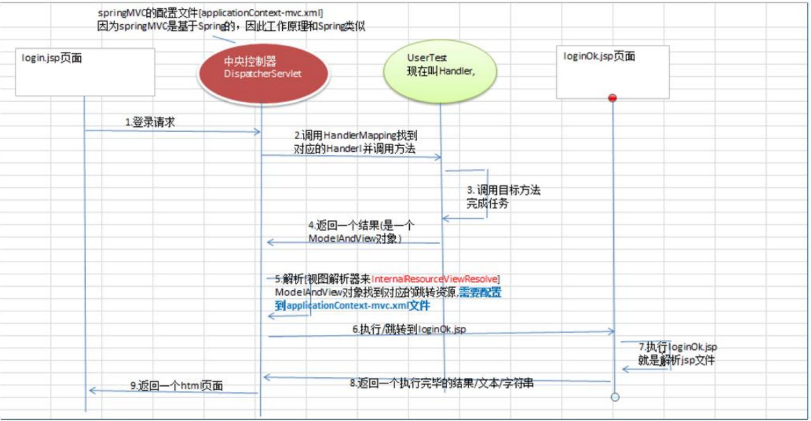
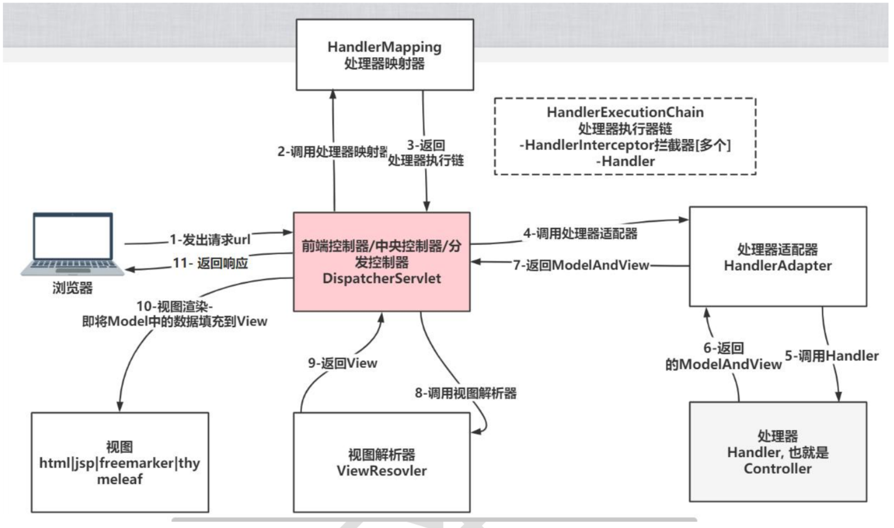
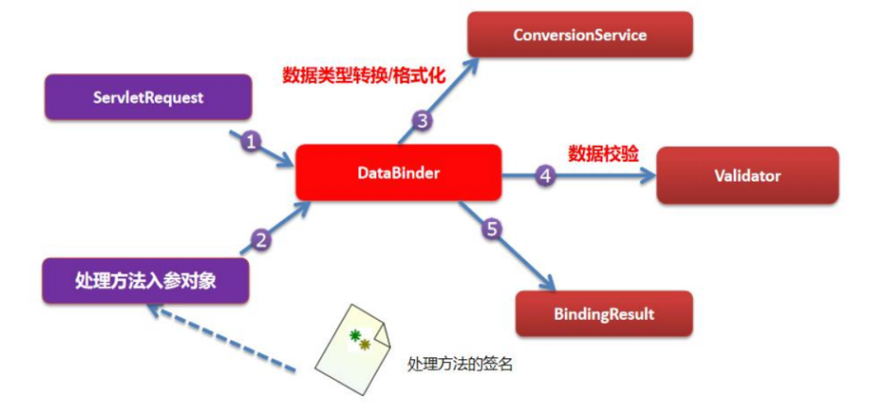

# 【韩顺平主流框架】Spring MVC

## 基本介绍

### 资料汇总

1. https://docs.spring.io/spring-framework/reference/web/webmvc.html#mvc

### 概述

1. SpringMVC是Spring的一部分

2. **SpringMVC特点&概述**

    1. SpringMVC 从易用性，效率上 比曾经流行的Struts2更好
    2. SpringMVC 是WEB层框架。SpringMVC接管了Web层组件，如控制器、视图、视图解析、数据格式。
    3. SpringMVC通过注解，让POJO成为控制器，不需要实现任何接口。
    4. SpringMVC采用低耦合的组件设计方式，具有更的扩展和灵活性。
    5. 支持REST 格式的URL请求。
    6. 讲的SpringMVC是基于Spring5.x的，也就是SpringMVC是在Spring基础上的。SpringMVC的核心包spring-webmvc-5.3.8.jar 和 spring-web-5.3.8.jar。以下是涉及的Maven核心配置：

        ```xml
        <dependency>
            <groupId>org.springframework</groupId>
            <artifactId>spring-webmvc</artifactId>
            <version>5.3.8</version>
        </dependency>

        <dependency>
            <groupId>org.springframework</groupId>
            <artifactId>spring-web</artifactId>
            <version>5.3.8</version>
        </dependency>
        ```

3. Spring、SpringMVC、SpringBoot区别
    - SpringMVC只是Spring处理WEB层请求的一个模块/组件，SpringMVC的基石仍然是Spring
    - SpringBoot是为了简化开发者的使用，推出的框架：约定优于配置，简化配置流程。
    - SpringBoot包含很多组件、框架，Spring是最核心的内容之一，也包含SpringMVC

### 快速入门

#### 任务详情与解析
1. 任务
    - 完成一个基本登录案例
    - 登录页面（账号密码）
    - 登陆成功提示页
    - 后端代码

2. 图解
    

#### 配置

1. `web.xml`
    - 按照下面方法配置的`urlPattern`表示所有用户请求均经过`DispatcherServlet`。
    - 符合rest风格的url请求
    - 通过属性配置，指定操作的Spring配置文件`applicationContext-mvc.xml`
    - 通过设定优先级，在web工程启动时自动装载。
    - 关于SpringMVC的`DispatcherServlet`的配置文件，如果不在web.xml指定`applicationContext-mvc.xml`,默认在`/WEB-INF/springDispatcherServlet-servlet.xml`找这个配置文件（这个名字在servlet配置中指定）
    ```xml
    <servlet>
        <servlet-name>springDispatcherServlet</servlet-name>
        <servlet-class>org.springframework.web.servlet.DispatcherServlet</servlet-class>
        <init-param>
            <param-name>contextConfigLocation</param-name>
            <param-value>classpath:applicationContext-mvc.xml</param-value>
        </init-param>
        <load-on-startup>1</load-on-startup>
    </servlet>
    <servlet-mapping>
        <servlet-name>springDispatcherServlet</servlet-name>
        <url-pattern>/</url-pattern>
    </servlet-mapping>
    ```

3. `Servlet`
    - 在SpringMVC中，通过给类标识`@Controller`注解，称为Handler处理器，表示其为一个控制器，自动注入到容器。
    - 通过注解`@RequestMapping`设定资源访问路径
    - 返回类型为`String`，返回数据到视图解析器（`InternalResourceViewResolver`），视图解析器根据配置决定跳转哪个页面
    ```java
    @Controller
    public class UserServlet {

        @RequestMapping("/login")
        public String login(){
            System.out.println("login:ok!");
            return "login_ok";
        }
    }
    ```
4. xml
    - 通过配置视图控制器`InternalResourceViewResolver`，接收Handler处理器返回的值，并依照此值进行配置与转发。
    - 通过配置参数`prefix`和`suffix`为路径配置前缀与后缀，此处拼接后的实际访问目标为：`/WEB-INF/login_ok.jsp`。
    - 登陆成功页面配置在`WEB-INF`中，不会被直接访问到，只能通过Controller进行访问。
    ```xml
    <?xml version="1.0" encoding="UTF-8"?>
    <beans xmlns="http://www.springframework.org/schema/beans"
        xmlns:xsi="http://www.w3.org/2001/XMLSchema-instance"
        xmlns:context="http://www.springframework.org/schema/context"
        xsi:schemaLocation="http://www.springframework.org/schema/beans http://www.springframework.org/schema/beans/spring-beans.xsd http://www.springframework.org/schema/context https://www.springframework.org/schema/context/spring-context.xsd">

        <context:component-scan base-package="com.lcq.springmvc"/>
        <bean class="org.springframework.web.servlet.view.InternalResourceViewResolver">
            <property name="prefix" value="/WEB-INF/pages/"/>
            <property name="suffix" value=".jsp"/>
        </bean>
    </beans>
    ```

> **💡 避坑指南：为什么 DispatcherServlet 拦截路径是 `/` 而不是 `/*`？**
>
> 在配置前端控制器的路由匹配规则时，这是一个极其容易踩坑的地方：
> * **`/` (默认匹配)**：会拦截发向服务器的绝大多数请求（如 `/login` 及静态资源等），但**绝对不会**拦截对 `.jsp` 和 `.jspx` 的请求。这保证了 Controller 将逻辑视图名交给视图解析器拼接成 JSP 路径后，能顺利交由 Tomcat 内置的 JSP Servlet 进行最终的页面渲染。
> * **`/*` (拦截所有)**：如果错误配置为 `/*`，它会暴力拦截包括 JSP 页面在内的**所有**请求。这会导致视图解析器试图跳转 `login_ok.jsp` 时，请求再次被 `DispatcherServlet` 拦截，系统会去寻找名为 `/WEB-INF/pages/login_ok.jsp` 的 Controller 映射，找不到自然就会直接抛出 404 错误。

#### 配置（注解）

1. `Servlet 初始化配置类 (替代 web.xml)`
    - 在 Servlet 3.0+ 环境下，通过继承 `AbstractAnnotationConfigDispatcherServletInitializer` 来完全替代传统的 `web.xml` 配置文件。
    - 覆写 `getServletMappings()` 方法并返回 `{"/"}`，表示所有用户请求均经过 `DispatcherServlet`，符合 REST 风格的 URL 请求。
    - 覆写 `getServletConfigClasses()` 方法，指定操作的 Spring MVC 配置类 `SpringMvcConfig.class`（替代原有的 `applicationContext-mvc.xml`）。
    - 依赖容器在 Web 工程启动时通过 SPI 机制自动装载并初始化。
    ```java
    import org.springframework.web.servlet.support.AbstractAnnotationConfigDispatcherServletInitializer;

    public class WebAppInitializer extends AbstractAnnotationConfigDispatcherServletInitializer {
        
        // 配置 Spring 根应用上下文（此处暂无，返回 null）
        @Override
        protected Class<?>[] getRootConfigClasses() {
            return null;
        }

        // 指定 SpringMVC 配置类
        @Override
        protected Class<?>[] getServletConfigClasses() {
            return new Class[]{SpringMvcConfig.class}; 
        }

        // 设定 DispatcherServlet 的拦截路径
        @Override
        protected String[] getServletMappings() {
            return new String[]{"/"}; 
        }
    }
    ```

2. `Servlet (Controller 处理器)`
    - 在纯注解模式下，Controller 层的业务代码与 XML 配置模式下**完全保持一致**，无需改动。
    - 通过给类标识 `@Controller` 注解，表示其为一个控制器，自动注入到容器。
    - 通过注解 `@RequestMapping` 设定资源访问路径。
    - 返回类型为 `String`，向视图解析器传递逻辑视图名 `"login_ok"`。
    ```java
    import org.springframework.stereotype.Controller;
    import org.springframework.web.bind.annotation.RequestMapping;

    @Controller
    public class UserServlet {

        @RequestMapping("/login")
        public String login(){
            System.out.println("login:ok!");
            return "login_ok";
        }
    }
    ```

3. `SpringMVC 配置类 (替代 applicationContext-mvc.xml)`
    - 通过给类标识 `@Configuration` 注解，声明这是一个配置类。
    - 通过 `@ComponentScan` 注解替代 `<context:component-scan>`，扫描 Controller 所在的包路径。
    - 添加 `@EnableWebMvc` 注解，开启 Spring MVC 的高级特性与注解驱动。
    - 通过 `@Bean` 注解实例化并配置视图解析器 `InternalResourceViewResolver`。
    - 通过 `setPrefix` 和 `setSuffix` 方法配置路径前缀与后缀，此处拼接后的实际访问目标仍为：`/WEB-INF/pages/login_ok.jsp`。
    ```java
    import org.springframework.context.annotation.Bean;
    import org.springframework.context.annotation.ComponentScan;
    import org.springframework.context.annotation.Configuration;
    import org.springframework.web.servlet.config.annotation.EnableWebMvc;
    import org.springframework.web.servlet.view.InternalResourceViewResolver;

    @Configuration
    @ComponentScan("com.lcq.springmvc")
    @EnableWebMvc
    public class SpringMvcConfig {

        @Bean
        public InternalResourceViewResolver viewResolver() {
            InternalResourceViewResolver resolver = new InternalResourceViewResolver();
            resolver.setPrefix("/WEB-INF/pages/");
            resolver.setSuffix(".jsp");
            return resolver;
        }
    }
    ```

#### 配置（SpringBoot）

1. `Maven 依赖管理 (Starter 机制)`
    - Spring Boot 引入了 “Starter” 概念，将相关的依赖打包。
    - 只需引入 `spring-boot-starter-web`，它会自动包含 Spring MVC、Tomcat 嵌入式容器、Jackson（JSON处理）等所有必需组件。
    - 开发者不再需要手动寻找版本匹配的 `spring-webmvc` 或 `servlet-api`。
    ```xml
    <dependency>
        <groupId>org.springframework.boot</groupId>
        <artifactId>spring-boot-starter-web</artifactId>
    </dependency>
    ```

2. `全局配置文件 (替代所有 XML 和配置类 Bean)`
    - 路径：`src/main/resources/application.yml` (或 .properties)。
    - **魔法所在**：不再需要写 Java 代码去 `@Bean` 实例化 `InternalResourceViewResolver`。
    - 只需两行配置，Spring Boot 就会自动识别并创建一个视图解析器。
    ```yaml
    spring:
      mvc:
        view:
          prefix: /WEB-INF/pages/
          suffix: .jsp
    ```

3. `主程序入口 (替代 web.xml 和所有初始化类)`
    - 整个工程**不再需要** `web.xml` 或 `WebAppInitializer`。
    - 通过一个带有 `@SpringBootApplication` 注解的类启动。
    - **内嵌 Tomcat**：直接运行 `main` 方法即可启动 Web 服务器，无需手动安装和配置外部 Tomcat。
    ```java
    import org.springframework.boot.SpringApplication;
    import org.springframework.boot.autoconfigure.SpringBootApplication;

    @SpringBootApplication // 核心：开启自动配置、组件扫描
    public class MyLoginApplication {
        public static void main(String[] args) {
            SpringApplication.run(MyLoginApplication.class, args);
        }
    }
    ```

4. `Servlet (Controller 处理器 - 零改动)`
    - **极致的兼容性**：你会发现，从传统的 SSM 到最新的 Spring Boot，业务代码（Controller）几乎不需要任何改动。
    - Spring Boot 会自动扫描主程序所在包及其子包下的所有 `@Controller`。
    ```java
    @Controller
    public class UserServlet {

        @RequestMapping("/login")
        public String login(){
            System.out.println("SpringBoot Login: ok!");
            return "login_ok"; 
            // 自动拼接为：/WEB-INF/pages/login_ok.jsp
        }
    }
    ```

#### 📌 架构延伸与演进说明
本案例完整演示了经典的 Spring MVC 视图渲染底层流程（即 `Controller` -> `ViewResolver` -> `JSP` 渲染）。但在当下的企业级敏捷开发与实战架构中，技术栈已发生如下演进：

1. **前后端彻底分离**：
   现代 Web 工程绝大多数已抛弃 `InternalResourceViewResolver` 和 JSP 技术。前端由 Vue/React 独立开发、打包和部署。后端的 Controller 统一使用 `@RestController`（等同于 `@Controller` + `@ResponseBody`），只负责接收请求并返回纯净的 JSON 数据。
2. **Spring Boot 极简时代**：
   在 Spring Boot 框架中，上述所有的 `WebAppInitializer`（初始化类）和 `SpringMvcConfig`（配置类）的样板代码，均被强大的**自动装配（AutoConfiguration）**机制完全接管并隐藏。开发者做到真正的“开箱即用”，只需专注编写核心业务逻辑。

### Spring MVC 核心执行流程（全要素解析）

0. 图解
    

1. `核心组件概览 (Core Components)`
    - **DispatcherServlet (前端控制器)**：整个流程的中央调度枢纽，负责接收请求、分发请求并返回响应。
    - **HandlerMapping (处理器映射器)**：负责根据请求的 URL 找到对应的 `Handler` (Controller) 和 `Interceptor` (拦截器)。
    - **HandlerAdapter (处理器适配器)**：负责调用具体的 `Handler` 方法。由于 Controller 的实现方式多样（注解、接口等），适配器起到了统一调用的作用。
    - **Handler/Controller (处理器)**：开发者编写业务逻辑的地方。
    - **ViewResolver (视图解析器)**：负责将逻辑视图名（如 `"login_ok"`）转换成物理视图路径（如 `/WEB-INF/pages/login_ok.jsp`）。
    - **View (视图)**：具体的渲染载体，如 JSP、Thymeleaf 或 HTML。

2. `全流程 11 步详解 (The 11-Step Workflow)`
    - **① 发出请求**：浏览器发起 HTTP 请求，由 `DispatcherServlet` 统一接收。
    - **② & ③ 路由查找**：`DispatcherServlet` 调用 `HandlerMapping`。映射器返回一个 **处理器执行链 (HandlerExecutionChain)**，内含目标 `Handler` 及与之配套的多个 `Interceptor` (拦截器)。
    - **④ 适配请求**：`DispatcherServlet` 获取 `HandlerAdapter`，准备执行 `Handler`。
    - **⑤ 执行业务**：`HandlerAdapter` 正式调用 `Handler` (Controller) 中的业务方法。
    - **⑥ & ⑦ 返回模型视图**：`Handler` 执行完毕，返回结果给适配器，适配器将其封装为 **ModelAndView** 对象并返回给 `DispatcherServlet`。
        - *Model*：包含业务数据。
        - *View*：包含逻辑视图名。
    - **⑧ & ⑨ 视图解析**：`DispatcherServlet` 调用 `ViewResolver`。解析器根据配置的前后缀，将逻辑视图名转换为真实的 **View** 实例（物理路径）。
    - **⑩ 视图渲染**：`DispatcherServlet` 调用 `View.render()` 方法，将 `Model` 中的数据填充到视图模板中。
    - **⑪ 返回响应**：将渲染后的 HTML 文本流通过 HTTP 响应返回给浏览器。


3. `工程实战：拦截器链 (Interceptor Chain)`
    - 请求在到达 `Handler` 之前，必须按顺序穿过所有配置的 `preHandle` 方法。
    - `Handler` 执行完后，会逆序执行 `postHandle` 方法。
    - 视图渲染完成后，最后执行 `afterCompletion`。
    - **应用场景**：用户登录校验、接口权限控制、操作日志记录。

4. `架构演进：从 JSP 渲染到 RESTful 接口`
    - **传统模式 (JSP/Thymeleaf)**：走完完整的 11 步，重点在服务器端的视图渲染。
    - **现代模式 (前后端分离)**：
        - 当 Controller 标记为 `@RestController` 或方法标记为 `@ResponseBody` 时，流程在第 7 步发生“短路”。
        - **HandlerAdapter** 不再返回 `ModelAndView`，而是调用 **HttpMessageConverter** (如 Jackson) 直接将 Java 对象序列化为 JSON 字符串，并直接写入响应体。
        - **结果**：跳过 `ViewResolver` 和 `View` 渲染阶段，极大地提升了系统的解耦度。


> **📌 技术总结**
> 理解这 11 步全流程是 Java 后端开发的“基本功”。在实际工程中，大部分底层组件（Mapping, Adapter, Resolver）已由框架实现，开发者的核心任务是编写第 5 步的 `Handler` 逻辑，以及根据业务需求在第 3 步插入自定义的 `Interceptor`。

## RequestMapping

### 修饰方法和类

1. `@RequestMapping` 可以修饰方法和类，同时修饰时，实际访问路径为：`类请求值/方法请求值`（相当于给控制器模块加了一层命名空间，方便分类管理）。

2. 应用实例
    - `method = RequestMethod.POST` 表示该方法只接受 POST 请求。
    - 常见的四个 RESTful 请求方式：`GET`（查询）、`POST`（新增）、`PUT`（修改）、`DELETE`（删除）。
    - **【核心注意】**：若不指定 `method` 属性，SpringMVC 默认支持**所有的 HTTP 请求方式**（而不只是 GET 和 POST），只要路径匹配均会放行。
    ```java
    @Controller
    @RequestMapping("/user")
    public class UserHandler {

        // 完整逻辑映射路径：/user/buy
        // (若部署时配置了项目上下文如 /springmvc，则实际访问 URL 为 /springmvc/user/buy)
        @RequestMapping(value = "/buy", method = RequestMethod.POST)
        public String buy(){
            System.out.println("UserHandler:buy()");
            return "success";
        }
    }
    ```
    > **💡 现代演进（读薄）**：在现代开发中，带 `method` 属性的臃肿写法已基本被衍生注解取代。建议直接使用 `@GetMapping("/buy")` 或 `@PostMapping("/buy")`，代码更直观。

### 支持简单表达式（params 和 headers）

1. `@RequestMapping` 除了通过路径匹配，还可以通过 `params`（请求参数）和 `headers`（请求头）属性，对请求进行更加苛刻的精准拦截。

2. 表达式规则拆解：
    - `"param1"`：请求中**必须包含**名为 `param1` 的参数（值为空也可以）。
    - `"!param1"`：请求中**绝对不能包含**名为 `param1` 的参数（注意：不是 `!=param1`，标准语法只有叹号）。
    - `"param1!=value1"`：请求中包含名为 `param1` 的参数，但其值绝对**不能为** `value1`。
    - `{"param1=value1", "param2"}`：数组组合写法。请求必须同时满足：包含 `param1` 且值等于 `value1`，**并且**包含 `param2`。

3. 应用实例
    - 如下配置表示：必须是 GET 请求、路径必须是 `/find`、且 URL 中**必须携带 `bookId` 参数**，三把锁同时满足才能进入方法。
    ```java
    @RequestMapping(value = "/find", params = "bookId", method = RequestMethod.GET)
    public String search(String bookId) {
        System.out.println("查询书籍 bookId= " + bookId);
        return "success";
    }
    ```
    > **💡 现代演进（读薄）**：实战中，为了让路由职责保持纯粹，通常不再使用 `params` 来拦截路由。参数的非空校验会下放到方法参数列表中，使用 `@RequestParam(value = "bookId", required = true)` 来实现。这样分工更加明确：**路由只管找路径，参数注解只管拿数据**。这种写法也更有利于前后端对接和生成 API 接口文档。
    > 
    > **现代写法的实战代码：**
    > ```java
    > import org.springframework.web.bind.annotation.GetMapping;
    > import org.springframework.web.bind.annotation.RequestParam;
    > 
    > // 现代写法：路由非常干净，只限定路径和 GET 请求
    > @GetMapping("/find") 
    > public String search(
    >         // 参数的强制要求交给专门的注解，required = true（默认就是 true）表示没带这个参数就不准进方法
    >         @RequestParam(value = "bookId", required = true) String bookId) {
    >         
    >     System.out.println("查询书籍 bookId= " + bookId);
    >     return "success";
    > }
    > ```
    > **执行效果对比**：
    > * 如果前端老老实实访问 `/find?bookId=100`，正常进入方法。
    > * 如果前端少传了参数，直接访问 `/find`，Spring 会在进入方法前自动把它拦下，并直接给前端返回一个标准的 **400 Bad Request（客户端请求参数错误）**，你完全不需要在业务代码里写任何 `if (bookId == null)` 的判断逻辑。

### Ant 风格资源地址 (路径模糊匹配)

1. Spring MVC 支持 Ant 风格的路径匹配规则，允许在 `@RequestMapping` 的 `value` 属性中使用通配符来定义模糊的资源地址。

2. **核心通配符规则：**
    - **`?`**：匹配文件名中的一个字符。必须存在该位字符且仅限一个。
    - **`*`**：匹配文件名中的任意字符。**注意：** 它不能跨越目录层级（即不能匹配斜杠 `/`）。
    - **`**`**：匹配多层路径。可以匹配零个或多个目录及其下的文件。

3. **实战 URL 地址举例：**
    - **`?` (精确占位符)**：`/report/20??`
        - **匹配**：`/report/2025`、`/report/2026`（非常适合用于严格限制年份、版本号等定长参数）。
        - **拦截**：`/report/202`（少一位）、`/report/20261`（多一位）。
    - **`*` (单层万金油)**：`/admin/*/settings`
        - **匹配**：`/admin/alibaba/settings`、`/admin/tencent/settings`（常用于多租户架构，一套接口接住不同公司的请求）。
        - **拦截**：`/admin/settings`（中间缺了一层目录）、`/admin/alibaba/cloud/settings`（多了一层，跨越了斜杠）。
    - **`**` (无视层级的黑洞)**：`/api/**`
        - **匹配**：`/api/user/login`、`/api/order/detail/list` 等以 `/api/` 开头的所有深度的路径。
        - **场景**：常用于配置全局拦截器（把所有 API 接口拦下来做 Token 鉴权），或者配置静态资源的全局放行。

4. **应用实例：**
    - 如下配置表示该方法可以接收 `/user/message/` 后接任意深度、任意层级的请求路径。
    ```java
    @RequestMapping(value = "/user/message/**")
    public String handleMessage() {
        System.out.println("成功匹配多层路径消息接口");
        return "success";
    }
    ```

### 路由匹配优先级与冲突解决

1. **最精确匹配原则 (Most Specific Match Wins)**：
    - 如果一个请求同时满足多个通配符规则，Spring MVC 会选择限制最具体、通配符最少的那个方法执行。
    - 示例：请求 `/user/message/aa` 同时满足 `/user/message/*` 和 `/user/message/**`，则优先进入路径更短、更精确的 `*` 对应的方法。

2. **模棱两可的映射 (Ambiguous Mapping)**：
    - **启动期冲突**：如果在同一个 Controller 或容器中定义了两个限制条件完全一样的路由，项目在启动扫描映射表时会直接抛出 `IllegalStateException` 异常并停止启动。
    - **运行期冲突**：如果定义的路由长得不同，但某个请求碰巧同时同等程度地满足了两个接口（如 `params="a"` 和 `params="b"` 的接口，请求同时带了 a 和 b），Spring 会抛出 `AmbiguousHandlerResolutionException` 异常并返回 500 错误。

3. **兜底匹配 (Fallback Mapping)**：
    - 建议通过不带任何附加条件（如 `params` 或 `headers`）的基础路径映射作为“默认方案”，当所有精确匹配失效时，请求会自动掉进这个兜底方法中。

> **💡 现代演进（读薄）**：
> 在目前主流的 Restful API 设计中，路径通常被设计得非常清晰（如 `/users/{id}`），通配符更多用于**拦截器 (Interceptor)** 的配置、**静态资源放行**或**全局权限控制**。
> 例如在配置类中：`registry.addInterceptor(new MyInterceptor()).addPathPatterns("/api/**")`，利用 `**` 实现对整个 API 模块及其子模块的全局无死角监控。

### 配合`@PathVariable`映射URL绑定的占位符

1. 核心作用与 RESTful 风格
    - 在传统的 Web 开发中，通常使用查询参数传值（例如：`/reg?username=lcq&userId=9527`）。
    - 利用 `@PathVariable`，可以将动态的参数值直接作为 URL 路径的一部分（例如：`/reg/lcq/9527`）。这种写法是构建现代 **RESTful API** 的核心，使得 URL 更加简洁、安全，且对搜索引擎（SEO）更友好。

2. 标准代码模板
    实现该功能需要两步：在 `@RequestMapping` 中使用 `{}` 挖坑（定义占位符），在方法参数中使用 `@PathVariable` 填坑（提取数值）。

    ```java
    @Controller
    public class UserHandler {

        // 1. 在路径规则中定义占位符 {username} 和 {userId}
        @RequestMapping(value = "/reg/{username}/{userId}")
        public String register(
                // 2. 将 URL 中对应占位符的值，精准提取并赋给 Java 变量
                @PathVariable("username") String username,
                @PathVariable("userId") String userId) {
                
            System.out.println("UserHandler:register():username:" + username + ",userId:" + userId);
            return "success";
        }
    }
    ```
    **请求示例**：当浏览器发起 `GET http://localhost:8080/reg/admin/1001` 时，控制台将打印 `username:admin,userId:1001`。

3. 实战进阶与底层机制

    * **自动类型转换 (Auto Type Conversion)**
        虽然从 URL 截取下来的本质是字符串，但 Spring 底层会自动进行数据绑定与转换。
        在实际工程中，可以直接将参数声明为目标类型（如 `Integer` 或 `Long`）。若前端传入非数字（如 `/reg/admin/abc`），Spring 会在进入方法前直接拦截并抛出 `400 Bad Request` 异常。
        ```java
        // 进阶写法：直接接收为 Integer
        public String register(@PathVariable("username") String username,
                            @PathVariable("userId") Integer userId) { ... }
        ```

    * **严格的路径结构 (404 避坑指南)**
        与 `@RequestParam`（少传参数时接收到 `null`）不同，`@PathVariable` 对 URL 结构要求**绝对严格**。
        如果前端漏传了一个参数（例如发起请求 `/reg/admin/`），因为无法匹配 `/reg/{username}/{userId}` 的三段式结构，Spring 不会赋空值，而是直接报错 **`404 Not Found`**。

    * **支持正则表达式校验 (Regex Matching)**
        可以在占位符中直接编写正则表达式，在路由层面就将非法请求拦截在外，减少业务逻辑中的 `if-else` 校验。
        ```java
        // 强制要求 userId 必须是由 1 个或多个数字组成
        @RequestMapping(value = "/reg/{username}/{userId:\\d+}")
        ```

### RequestMapping 注意事项与使用细节

1. 路由唯一性约束（URL 映射绝不能重复）
    - **规则**：在同一个 Spring 容器中，相同路径且限制条件完全一致的 URL 映射是不被允许的。
    - **底层表现**：如果在同一个 Controller（或不同 Controller 但未加类级别前缀）里写了两个相同的 `@RequestMapping(value = "/hi")`。
    - **排错指南**：这是极其严重的配置错误，项目在**启动期**就会直接报错宕机（胎死腹中），控制台会抛出异常：
    `IllegalStateException: Ambiguous mapping... There is already 'userHandler' bean method...`

2. RESTful 现代简写注解（极力推荐）
    - **规则**：为了代码的简洁性和语义化，Spring 提供了针对不同 HTTP 请求方式的派生注解。
    - **等价替换**：
        - `@GetMapping` == `@RequestMapping(method = RequestMethod.GET)`
        - `@PostMapping` == `@RequestMapping(method = RequestMethod.POST)`
        - `@PutMapping`  == `@RequestMapping(method = RequestMethod.PUT)`
        - `@DeleteMapping` == `@RequestMapping(method = RequestMethod.DELETE)`
    - **代码对比**：
        ```java
        // 传统老旧写法
        // @RequestMapping(value = "/buy", method = RequestMethod.POST)
        
        // 现代优雅写法（一目了然这是一个处理 POST 提交的接口）
        @PostMapping(value = "/buy")
        public String buy() {
            System.out.println("执行 POST 购买逻辑");
            return "success";
        }
        ```

3. 参数自动绑定（同名匹配原则）
    - **规则**：当我们在 Controller 方法中直接声明普通变量（如 `String email`）来接收前端数据时，**前端提交的参数名（name 属性或 URL 后的参数名）必须与后端方法的形参名完全一致**。
    - **运行机制**：
        - 当前端访问：`localhost:9998/user/hello3?email=tom@sohu.com`
        - 后端方法：`public String hello3(String email) { ... }`
        - 只要名字匹配（都是 `email`），Spring 的底层的 `DataBinder` 就会自动把 `tom@sohu.com` 塞进这个变量里。
    - **⚠️ 避坑警告**：如果名字不同（比如前端传了 `mail=tom...`，而后端形参是 `email`），Spring 不会报错，但你的变量接收到的永远是 **`null`**。这也是很多新手在前后端联调时，由于单词拼写错误导致“参数死活传不过去”的最常见原因。

    > **💡 工程延展（如何打破同名限制？）**
    > 在实际协作中，有时前端非要传 `user_email`，但后端按照 Java 驼峰命名规范必须写成 `userEmail`。此时只需要加上我们之前讲过的 `@RequestParam` 即可强行绑定：
    > `public String hello3(@RequestParam("user_email") String userEmail)`

## Postman

### 下载与安装

1. 建议使用GitHub
    - [Postman汉化项目](https://github.com/hlmd/Postman-cn)


### 基本使用

1. GET 请求在参数栏中输入参数

2. POST请求在Body中输入参数


## Rest

### REST 基本概念与优势

1. **什么是 REST？**
   - 全称：Representational State Transfer（表现层状态转化）。
   - 本质：将万物视为**资源**。不再通过 URL 动词（如 `addBook`, `deleteBook`）来区分操作，而是通过 **HTTP 协议自带的请求动词**来区分。

2. **核心对应关系（CRUD）**
   - **GET**：获取资源（查询）
   - **POST**：新建资源（添加）
   - **PUT**：更新资源（修改）
   - **DELETE**：删除资源（删除）

3. **风格对比**
   | 操作行为 | 传统 URL 风格 (动作+参数) | RESTful 风格 (资源+动词) |
   | :--- | :--- | :--- |
   | **查询** | `GET /getBook?id=1` | `GET /book/1` |
   | **添加** | `POST /addBook` | `POST /book` |
   | **修改** | `POST /updateBook` | `PUT /book/1` |
   | **删除** | `GET /deleteBook?id=1` | `DELETE /book/1` |
   
   *优势*：结构极其清晰，URL 更加简洁，天然防重放，并且是目前大厂开放 API 的绝对主流标准。

### 核心痛点与破解：`HiddenHttpMethodFilter`

1. **历史痛点**
   - 传统的浏览器 `<form>` 表单，原生的 `method` 属性**只支持 GET 和 POST**。如果直接写 `<form method="put">`，浏览器是不认的。
   
2. **Spring 的破解方案：伪装与拦截**
   - Spring 提供了一个专门的过滤器 `HiddenHttpMethodFilter`。
   - **前端做法**：所有的表单依然使用 `POST` 提交，但在表单内部藏一个名为 **`_method`** 的隐藏域，其值为真实的意图（如 `PUT` 或 `DELETE`）。
   - **后端机制**：请求到达 Controller 之前，`HiddenHttpMethodFilter` 会先拦截它，一旦发现有 `_method` 这个隐藏域，就会在内部把这个普通的 POST 请求**偷梁换柱**，转换成标准的 PUT/DELETE 请求，然后再放行给 Controller。

3. **配置方式 (web.xml)**
   ```xml
   <filter>
       <filter-name>hiddenHttpMethodFilter</filter-name>
       <filter-class>org.springframework.web.filter.HiddenHttpMethodFilter</filter-class>
   </filter>
   <filter-mapping>
       <filter-name>hiddenHttpMethodFilter</filter-name>
       <url-pattern>/*</url-pattern>
   </filter-mapping>
   ```

4. SpringMVC配置
    ```xml
    <!-- 支持mvc高级功能（JSR303校验、映射动态请求等） -->
    <mvc:annotation-driven/>

    <!-- 将mvc无法处理的请求交给tomcat，如js、css等 -->
    <mvc:default-servlet-handler/>
    ```


### Rest 风格全套实战拆解

1. 前端 JSP 发起请求的核心姿势

    * **GET (查询)**：直接使用超链接。
        `<a href="user/book/100">查询书籍</a>`
    * **POST (添加)**：原生表单提交。
        `<form action="user/book" method="post">`
    * **PUT (修改) - 伪装法**：
        ```html
        <form action="user/book/100" method="post">
            <input type="hidden" name="_method" value="PUT">
            <input type="submit" value="修改书籍">
        </form>
        ```
    * **DELETE (删除) - 借助 jQuery**：
        由于超链接默认是 GET，没法带隐藏域。通常用 jQuery 拦截点击事件，动态把请求绑定到一个隐藏的 POST 表单上，并设置 `_method` 为 DELETE 后提交。

2. 后端 Controller 接收请求

    ```java
    @RequestMapping(value = "/user/book")
    @Controller
    public class BookHandler {

        // 1. 查询 [GET]
        @GetMapping("/{id}")
        public String getBook(@PathVariable("id") String id) {
            System.out.println("查询书籍 id=" + id );
            return "success";
        }

        // 2. 添加 [POST]
        @PostMapping
        public String addBook(String bookName) {
            System.out.println("添加书籍 bookName=" + bookName);
            return "success";
        }

        // 3. 修改 [PUT]
        @PutMapping("/{id}")
        public String updateBook(@PathVariable("id") String id) {
            System.out.println("修改书籍 id=" + id);
            // ⚠️ 避坑：必须使用重定向，见下方详解
            return "redirect:/user/success"; 
        }

        // 4. 删除 [DELETE]
        @DeleteMapping("/{id}")
        public String delBook(@PathVariable("id") String id) {
            System.out.println("删除书籍 id=" + id);
            // ⚠️ 避坑：必须使用重定向
            return "redirect:/user/success"; 
        }
    }
    ```

### 注意事项与 405 避坑指南

1. **隐藏域名称**：前端隐藏域的 `name` 属性**必须严格等于** `_method`，否则 Spring 过滤器无法识别。
2. **⚠️ Tomcat 8+ 致命报错 (HTTP 405)**：
   - **现象**：当拦截器成功将 POST 转为 DELETE 或 PUT 后，Controller 逻辑正常执行完毕。但在返回 `return "success"` (即请求转发 forward 到 success.jsp) 时，页面直接报错 `HTTP 405: JSPs only permit GET POST or HEAD`。
   - **原因**：Tomcat 8 遵循了更严格的规范，认为 JSP 页面作为一个视图，不允许接收 PUT 或 DELETE 类型的请求转发。
   - **终极解决方案**：在执行完 PUT/DELETE 的 Controller 方法中，不要直接转发，而是**重定向（redirect）**到一个普通的 GET 方法，由那个 GET 方法去负责转发到 JSP 页面。

> **💡 现代演进（读薄）**：
> 这一节课花了极大篇幅解决的表单无法发送 PUT/DELETE、借助 jQuery 偷梁换柱、以及 Tomcat 405 JSP 报错问题，**在现代的前后端分离开发中已经不复存在了。**
> 
> 现在的前端（如 Vue.js 中的 Axios 请求库，或 Postman 测试工具）**原生就支持**发送纯正的 PUT 和 DELETE 请求。后端完全抛弃了 JSP 视图，直接返回 JSON 数据（`@RestController`）。所以，在真实的现代大厂项目中，你既不需要配 `HiddenHttpMethodFilter`，也不需要写 `_method` 隐藏域，更不会遇到 JSP 405 报错。后端的代码会如同上面第二步的 Java 代码一样，纯粹、干净且优雅。

## 获取Http请求头

### 应用实例

1. 目标
    - 获取`Accept-Encoding`和`Host`字段

2. 测试
    ```java
    @PostMapping("/header01")
    public String header01(@RequestHeader("Accept-Encoding") String encoding,
                           @RequestHeader("Host") String host){
        System.out.println("host:"+host);
        System.out.println("Accept-Encoding:"+encoding);
        return "success";
    }
    ```


## 获取javabean对象

### 基本介绍

1. 可以自动封装对象

### 应用实例
1. entity
    ```java
    public class Master {
        private Integer id;
        private String name;
        private Pet pet;
    }


    public class Pet {
        private Integer id;
        private String name;
    }
    ```
3. 代码
    ```java
    @RequestMapping("/bean")
    public String bean(Master  master){
        //post:
        // id:100
        //name:name1
        //pet.id:6666
        //pet.name:aha
        //bean():master:Master{id=100, name='name1', pet=Pet{id=null, name='aha'}}
        System.out.println("bean():master:"+master);
        return "success";
    }
    ```

## 使用原生Servlet API

### 基本介绍

1. 使用原生API，需先引入相应的库
    ```xml
    <dependency>
        <groupId>javax.servlet</groupId>
        <artifactId>javax.servlet-api</artifactId>
        <version>4.0.1</version>
    </dependency>

    <dependency>
        <groupId>javax.servlet.jsp</groupId>
        <artifactId>javax.servlet.jsp-api</artifactId>
        <version>2.3.3</version>
    ```

2. 代码
    ````java
    @RequestMapping("/servlet")
    public String servlet(HttpServletRequest request, HttpServletResponse response){
        String contextPath = request.getContextPath();
        System.out.println("contextPath:"+contextPath);

        String parameter = request.getParameter("a");
        System.out.println("parameter.a:"+parameter);
        return  "success";
    }
    ````

3. **使用注意事项**

    1. 除了 `HttpServletRequest`, `HttpServletResponse`还可以其它对象也可以这样的形式获取
    2. `HttpSession`、`java.security.Principal`, `InputStream`, `OutputStream`, `Reader`, `Writer`
    3. 其中一些对象也可以通过 `HttpServletRequest` / `HttpServletResponse`对象获取，比如 `Session`对象，既可以通过`参数传入`，也可以通过 `request.getSession()` 获取，效果一样，推荐使用参数形式传入，更加简单明了
    4. 举例说明

        ```java
        @RequestMapping(value = "/vote04")
        public String test04(HttpServletRequest request,
                            HttpServletResponse response, HttpSession hs) {

            System.out.println("name= " + request.getParameter("username"));
            System.out.println("pwd= " + request.getParameter("pwd"));

            //可以看到 hs 和 request.getSession() 是同一个对象
            System.out.println("httpSession=" + httpSession);
            System.out.println("httpSession2=" + request.getSession());
        ```

## 模型数据

### 基本介绍

1. 问题
    - 开发中，控制器/处理器获取的数据如何放入Request域中，然后在前端页面取出显示？

2. 说明【默认方法】
    - SpringMVC会自动将获取的model对象放入Request域中，供后续转发页面使用。如前面传入的Master对象，就可以直接通过`${master.pet.name}`等方式取出数据。
    - 对于request域，其**默认**存放对象的形式为`{"className":objName}`，其中`className`为首字母小写的类名，
       
        ```java
        // Master master01

        // {"master": master01}
        ```
3. 三种模型数据处理方法
    - 通过`HttpServletRequest`放入request域
    - 通过请求方法参数`Map<String, Object>`放入request域
    - 通过返回ModelAndView对象实现request域数据

### 通过请求方法参数`Map<String, Object>`放入request域

1. 说明
    - 如果以此法将默认存入的key修改，默认存入的数据会被覆盖

2. 测试
    ```java
    @RequestMapping("/bean2")
    public String bean2(Master master, HttpServletRequest request) {
        master.setId(666);
        return "model01ok";
    }

    @RequestMapping("/bean3")
    public String bean3(Master master, Map<String, Object> map) {
        map.put("id", 666);// ${requestScope.id}
        return "model01ok";
    }
    ```


### 通过返回 ModelAndView 对象实现 request 域数据

1. 代码
    ```java
    @RequestMapping("/bean4")
    public ModelAndView bean4(Master master) {

        ModelAndView modelAndView = new ModelAndView();

        modelAndView.addObject("id", 666);
        modelAndView.setViewName("model01ok");
        return modelAndView;
    }
    ```
2. 使用注意事项及深度解析

    **1) 从本质看，请求响应的方法 `return "xx"`，是返回了一个字符串，其实本质是返回了一个 `ModelAndView` 对象，只是默认被封装起来的。**
    > **💡 解析：**
    > 在 SpringMVC 的底层核心 `DispatcherServlet` 中，无论你的 Controller 方法返回的是 `String`（视图名）、`View` 对象，还是 `Map`/`Model`（纯数据），SpringMVC 最终都会在内部把它们统一包装成一个 `ModelAndView` 对象来进行后续的视图渲染。
    > 返回 `String` 只是一种“语法糖”，让我们的代码写起来更简洁。

    **2) `ModelAndView` 即可以包含 `model` 数据，也可以包含视图信息。**
    > **💡 解析：**
    > 顾名思义，`Model` 代表数据模型（要存放到 request 域里的数据），`View` 代表视图（你要跳转的 JSP 或 Thymeleaf 页面）。这个对象把**“要去哪”**和**“带什么数据去”**这两件事合二为一了，非常符合高内聚的编程思想。

    **3) `ModelAndView` 对象的 `addObject` 方法可以添加 key-val 数据，默认在 request 域中。**
    > **💡 解析：**
    > 这个方法的作用完全等价于原生 Servlet 中的 `request.setAttribute("key", value)`，也等价于上一节笔记中通过 `Map<String, Object>` 的 `put("key", value)`。
    > **常用写法：** `modelAndView.addObject("username", "Jack");`

    **4) `ModelAndView` 对象 `setView` 方法可以指定视图名称。**
    > **💡 解析：**
    > ⚠️ **补充避坑：** 严格来说，如果传入的是字符串（视图名），常用的方法叫 `setViewName("页面名称")`；如果传入的是一个真正的视图解析对象，才使用 `setView(View view)` 方法。
    > **常用写法：** `modelAndView.setViewName("model01ok");` （结合视图解析器的前后缀，最终跳转到对应的页面）。

**👨‍💻 总结建议：**
虽然 `ModelAndView` 极其正规且老牌，但在现代的 SpringMVC 开发中（尤其是前后端分离项目），直接返回这个对象的场景变少了。现在大家更倾向于返回 `String` 配合参数中的 `Model`，或者直接使用 `@RestController` 返回 JSON 数据。不过，理解 `ModelAndView` 依然是掌握 SpringMVC 底层运转流程的必经之路！</String,>

### 将数据放入SESSION域

1. 代码
    ```java
    @RequestMapping("/bean5")
    public String bean5(Master master, HttpSession  session) {
        session.setAttribute("master", master);
        return "model01ok";
    }
    ```

### `@ModelAttribute` 注解：前置模型准备方法

1. 基本说明
    在实际开发中，有时我们需要使用某个**前置方法**（例如 `prepareXxx()`，方法名可由程序员自定义），在目标处理方法（Handler Method）执行之前，提前为其准备好一个模型对象（Model Object）。

    1. **核心作用：** `@ModelAttribute` 注解专门用于实现这种“前置准备”的需求。
    2. **触发时机：** 当在一个普通方法上添加了 `@ModelAttribute` 注解后。
    3. **执行规则：** 那么在调用当前 Handler（即当前的 Controller 类）中的**任何一个**映射方法（被 `@RequestMapping` 修饰的方法）时，**都会优先且提前调用这个被 `@ModelAttribute` 修饰的方法**。

2. 应用实例
    修改 `VoteHandler.java`，增加前置方法并进行测试：

    ```java
    /**
     * 老韩解读
     * 1. 当在某个方法上，增加了 @ModelAttribute 注解
     * 2. 那么在调用该 Handler 的任何一个方法时，都会先调用这个方法
     */
    @ModelAttribute
    public void prepareModel() {
        System.out.println("prepareModel()-----完成准备工作-----");
    }
    ```
    *(测试结果：当你在浏览器访问该 Controller 下的任何 URL 时，控制台都会先打印出这句“完成准备工作”，然后才执行具体的业务方法。)*

    

3. 💡 深度解析与避坑指南 (扩展补充)

    单纯看上面的例子，你可能会觉得这不就是一个拦截器（Interceptor）或者 AOP 里的前置通知（Before Advice）吗？为什么还要专门弄个 `@ModelAttribute`？

    其实，`@ModelAttribute` 修饰的方法，最核心的实战价值在于**“表单的部分更新（防止数据丢失）”**。

    **典型实战场景：修改用户信息**
    假设数据库里有一个 User，包含 `id`, `username`, `password`, `email`。
    现在前端页面只有一个“修改邮箱”的表单，只提交了 `id` 和 `email`。

    * **如果不使用 `@ModelAttribute`前置方法：**
    SpringMVC 会根据表单提交的 `id` 和 `email` 自动 new 一个 User 对象。这时候你会发现，这个新对象的 `username` 和 `password` 都是 `null`！如果直接拿着这个对象去执行数据库的 `update` 操作，用户的用户名和密码就被清空了。

    * **如果使用了 `@ModelAttribute`前置方法：**
    你可以写一个加了 `@ModelAttribute` 的方法，在里面先**根据传过来的 `id` 从数据库中查出那个完整的 User 对象**，并把它放进模型里。
    接下来，SpringMVC 发现模型里已经有一个 User 对象了，它就不会再去 new 新的，而是**直接把表单传过来的 `email` 值覆盖到这个刚从数据库查出来的旧对象上**。
    这样一来，旧对象的 `username` 和 `password` 原封不动地保留了，只有 `email` 被更新了。拿着这个对象去 update 数据库，就完美实现了“部分字段更新”。

## 视图和视图解析器

### 基本介绍

1. 在 springMVC 中的目标方法最终返回都是一个视图(有各种视图).
2. 返回的视图都会由一个视图解析器来处理 (视图解析器有很多种)
### 自定义视图
1. 为什么需要自定义视图 
    1. 在默认情况下，我们都是返回默认的视图, 然后这个返回的视图交由 SpringMVC 的    `InternalResourceViewResolver` 视图处理器来处理的
    2. 在实际开发中，我们有时需要自定义视图,这样可以满足更多更复杂的需求.

2. 说明
    - **默认机制**：默认返回的视图交由 `InternalResourceViewResolver` 处理。
    - **自定义需求**：实际开发中，当默认的前后缀拼接无法满足复杂渲染需求时，需要自定义视图。
    - **解析器选择**：使用 `BeanNameViewResolver` 来解析自定义视图。它的机制是去 IOC 容器中寻找与返回字符串同名的 Bean。
    - **优先级设置**：流程是先匹配自定义解析器，匹配不上再用兜底的默认解析器。因此，必须给 `BeanNameViewResolver` 设置 `order` 属性（Order 值越小，优先级越高），确保其比默认优先级（`Integer.MAX_VALUE`）小。

    > **💡 现代演进（读薄）：前后端分离时代的视图流转**
    > 在现代主流的前后端分离架构（Spring Boot + Vue/React）中，**“视图解析器”的存在感已经极度弱化**。
    > 我们极少再去服务端拼装 JSP 或 HTML 页面，而是直接使用 `@RestController`，让底层的数据转换器（`HttpMessageConverter`）直接将对象序列化为 JSON 字符串返回给前端。
    > **那么现在还需要学自定义视图吗？** 需要！它的主要发光点退守到了**文档/文件导出**场景。比如你需要给前端导出一份复杂的 Excel 财务报表，单独写一个继承 `AbstractView` 的 `ExcelView` 类，能让你的 Controller 极其干净，完美实现业务逻辑与文件流构建代码的解耦。

3. 配置自己的视图解析器
    要实现自定义视图，必须**编写视图**和**配置解析器**双管齐下。

    - 编写自定义视图类 (View)
        创建一个类，继承 `AbstractView`，并将其交给 Spring 容器管理（通常加上 `@Component` 注解并指定唯一 ID）。

        ```java
        import org.springframework.stereotype.Component;
        import org.springframework.web.servlet.view.AbstractView;
        import javax.servlet.http.HttpServletRequest;
        import javax.servlet.http.HttpServletResponse;
        import java.util.Map;

        // 1. 交给 IOC 容器管理，组件 ID 为 "myView"
        @Component("myView") 
        public class MyView extends AbstractView {
            
            /**
             * 2. 重写渲染方法，这里是你自由发挥写复杂逻辑的主场
            * @param model Controller 传过来的数据模型
            */
            @Override
            protected void renderMergedOutputModel(Map<String, Object> model, 
                                                HttpServletRequest request, 
                                                HttpServletResponse response) throws Exception {
                // 这里可以写复杂的逻辑，比如生成 Excel 写入 response 流
                // 本例仅作演示：手动将请求转发到一个 JSP 页面
                System.out.println("成功进入自定义视图的渲染逻辑！");
                request.getRequestDispatcher("/WEB-INF/jsp/myView.jsp").forward(request, response);
            }
        }
        ```
    - 配置能够识别它的视图解析器 (ViewResolver)
        在 SpringMVC 的 XML 配置文件中，注入 `BeanNameViewResolver`。它的作用是：把 Controller 返回的字符串，当做 Bean 的 ID 去 IOC 容器里找对应的自定义视图。

        ```xml
        <!-- 配置基于 Bean 名字的视图解析器 -->
        <bean class="org.springframework.web.servlet.view.BeanNameViewResolver">
            <!-- ⚠️ 关键配置：设置最高优先级！值越小优先级越高。必须比默认解析器靠前 -->
            <property name="order" value="10" /> 
        </bean>

        <!-- 默认的兜底视图解析器 (通常配置在同一个文件里) -->
        <bean class="org.springframework.web.servlet.view.InternalResourceViewResolver">
            <property name="prefix" value="/WEB-INF/jsp/"/>
            <property name="suffix" value=".jsp"/>
            <!-- 默认 order 是 Integer.MAX_VALUE (最低优先级) -->
        </bean>
        ```
        > **💡 现代演进（读薄）：告别繁琐的 XML 配置**
        > 传统的 SpringMVC 需要在 XML 中手动注册 `<bean>` 并精打细算地配置 `order`。而在现代的 **Spring Boot** 中，配置已经被极度简化。你通常只需要在视图类上打个 `@Component("myView")`，甚至不需要显式配置 `BeanNameViewResolver`，Spring Boot 的自动装配机制（AutoConfiguration）会在后台默默帮你把这一切按照合理的优先级组装好。
4. 在 Controller 中使用
    直接返回你在第一步中定义的 `@Component` 的 ID 即可。

    ```java
    @RequestMapping("/bean6")
    public String bean6(Master master, HttpSession session) {
        session.setAttribute("master", master);
        // 返回的 "myView" 会被 BeanNameViewResolver 拦截，去容器找 id="myView" 的组件
        return "myView"; 
    }
    ```

5. 自定义视图流程

    1. SpringMVC 调用目标方法，返回自定义 View 在 IOC 容器中的 id。
    2. SpringMVC 优先调用 `BeanNameViewResolver` 解析视图：拿着返回的 id 值，去 IOC 容器中寻找对应的 bean（即自定义的 View 对象）。
    3. 匹配成功：SpringMVC 调用自定义视图的 `renderMergedOutputModel` 方法执行最终的渲染。
    4. **兜底机制**：如果在 SpringMVC 调用目标方法时，返回的 id 在 IOC 容器中不存在（匹配失败），则 `BeanNameViewResolver` 不做处理，仍然按照默认的视图处理器（`InternalResourceViewResolver`）机制进行常规的前后缀拼接处理。


### 目标方法直接指定转发或重定向

1. 基本介绍与核心语法

    在 SpringMVC 中，如果 Controller 目标方法返回一个普通的字符串（如 `return "success";`），默认情况下，大管家 `DispatcherServlet` 会将其交给配置好的视图解析器（如 `InternalResourceViewResolver`）去进行前后缀拼接，并执行**请求转发**。

    但有时，我们不希望它去拼接默认的前后缀，而是想要**精准指控**跳转的具体路径，甚至要求执行**重定向**。这时就可以使用特殊的**前缀语法**：

    1. **显式请求转发 (`forward:`)**
    - **语法**：`return "forward:/绝对路径";`
    - **机制**：当返回值以 `forward:` 开头时，SpringMVC 会立刻剥离视图解析器。它将不再拼接任何前缀和后缀，而是直接拿着后面的路径，在服务器内部进行一次原生的 `request.getRequestDispatcher().forward()`。

    2. **显式重定向 (`redirect:`)**
    - **语法**：`return "redirect:/绝对路径";`
    - **机制**：当返回值以 `redirect:` 开头时，SpringMVC 同样剥离视图解析器，并在底层调用 `response.sendRedirect()`，命令浏览器重新发起一次全新的 HTTP 请求。


2. ⚠️ 核心避坑指南 (面试常考)

    **【铁律】：如果指定为“重定向”，绝对不能定向到 `/WEB-INF` 目录中！**

    *   **原因剖析**：`/WEB-INF` 目录是 Java Web 规范中的**受保护目录（安全隔离区）**。
        *   **转发能进**：因为转发是服务器内部行为，等于保安亲自带你进去，所以畅通无阻（可以写 `return "forward:/WEB-INF/xxx.jsp";`）。
        *   **重定向进不去**：重定向是让浏览器重新发起一次外部请求。外部人员直接访问受保护区，必定会被 Tomcat 拦截，直接报 `404 Not Found`（所以写 `return "redirect:/WEB-INF/xxx.jsp";` 必死无疑）。

3.  代码实战配置

    1. 修改 Controller (GoodsHandler.java)
        ```java
        @Controller
        @RequestMapping("/goods")
        public class GoodsHandler {

            /**
             * 测试：在目标方法直接指定重定向或请求转发
            */
            @RequestMapping(value = "/order")
            public String order() {
                System.out.println("======= 执行 order() 业务逻辑 =====");
                
                // 场景 A：直接指定转发到某个受保护的页面 (跳过默认前后缀拼接)
                // return "forward:/WEB-INF/pages/my_view.jsp";
                
                // 场景 B：重定向到项目根目录下的 login.jsp (注意：千万不能写 /WEB-INF/...)
                return "redirect:/login.jsp"; 
            }
        }
        ```

    2. 前端测试页面 (view.jsp)
        ```html
        <h2>页面跳转测试</h2>
        <!-- 传统模式：交由视图解析器 -->
        <a href="goods/buy">测试普通视图返回</a><br/>

        <!-- 精准控制模式：测试 forward: 和 redirect: 前缀 -->
        <a href="goods/order">测试目标方法直接指定 重定向&请求转发</a><br/>
        ```
    > 💡 **现代演进（读薄）：前后端分离时代的重定向怎么写？**
    > 
    > 在现代纯后端开发（`@RestController`）中，我们的 Controller 方法通常被注解标记为只返回 JSON 纯数据。
    > 如果你在一个加了 `@RestController` 的类里写 `return "redirect:/login";`，**它不会跳转**，浏览器只会收到一段明文内容叫 `"redirect:/login"` 的 JSON 字符串！
    > 
    > **现代实战中，如果我们写纯 API 接口，通常会在什么场景用到重定向？又该怎么写？**
    > 
    > *   **实战场景**：微信扫码登录后的回调跳转、支付宝支付成功后跳回商户首页。
    > *   **现代写法**：既然不能返回字符串，那我们就直接返回 HTTP 响应实体（`ResponseEntity`），利用 HTTP 状态码 302 来实现完美重定向：
    > 
    > ```java
    > import org.springframework.http.HttpStatus;
    > import org.springframework.http.ResponseEntity;
    > import org.springframework.web.bind.annotation.GetMapping;
    > import org.springframework.web.bind.annotation.RestController;
    > import java.net.URI;
    > 
    > @RestController
    > public class ModernRedirectController {
    > 
    >     // 现代架构下，纯数据接口的重定向标准写法
    >     @GetMapping("/payment/callback")
    >     public ResponseEntity<Void> paymentCallback() {
    >         System.out.println("支付回调成功，准备重定向回商户前端...");
    >         
    >         // 构造一个 302 Found 响应，并在 Header 的 Location 中塞入目标地址
    >         return ResponseEntity.status(HttpStatus.FOUND)
    >                              .location(URI.create("http://前端项目的真实地址.com/home"))
    >                              .build();
    >     }
    > }
    > ```
    > 这种写法优雅、符合 RESTful 规范，且完美脱离了传统的 JSP 路由体系。


## 笔记：SpringMVC 纯注解配置 (彻底告别 XML)

### 核心思想
在 Servlet 3.0 规范之后，Web 容器允许开发者通过实现 `ServletContainerInitializer` 接口来动态注册 Servlet 和 Filter，这就为 Spring 抛弃 `web.xml` 提供了底层支持。
纯注解配置的核心就是用 **Java 配置类** 来一比一替换原来的 XML 标签。

---

1. 替代 `applicationContext-mvc.xml` (WebMvc 配置类)

    我们需要创建一个带有 `@Configuration` 注解的类，并通过实现 `WebMvcConfigurer` 接口来开启 MVC 定制。

    ```java
    import org.springframework.context.annotation.Bean;
    import org.springframework.context.annotation.ComponentScan;
    import org.springframework.context.annotation.Configuration;
    import org.springframework.web.servlet.config.annotation.DefaultServletHandlerConfigurer;
    import org.springframework.web.servlet.config.annotation.EnableWebMvc;
    import org.springframework.web.servlet.config.annotation.ViewResolverRegistry;
    import org.springframework.web.servlet.config.annotation.WebMvcConfigurer;
    import org.springframework.web.servlet.view.BeanNameViewResolver;

    /**
     * 对应原来的 applicationContext-mvc.xml[cite: 1]
     */
    @Configuration
    // 1. 等价于 <context:component-scan base-package="com.lcq.springmvc"/>[cite: 1]
    @ComponentScan("com.lcq.springmvc") 
    // 2. 等价于 <mvc:annotation-driven/>，开启 SpringMVC 高级支持[cite: 1]
    @EnableWebMvc 
    public class WebConfig implements WebMvcConfigurer {

        /**
         * 3. 等价于 <mvc:default-servlet-handler/>[cite: 1]
         * 将 SpringMVC 处理不了的静态资源交回给 Tomcat 的默认 Servlet 处理
         */
        @Override
        public void configureDefaultServletHandling(DefaultServletHandlerConfigurer configurer) {
            configurer.enable();
        }

        /**
         * 4. 等价于 InternalResourceViewResolver 默认视图解析器的配置[cite: 1]
         */
        @Override
        public void configureViewResolvers(ViewResolverRegistry registry) {
            registry.jsp("/WEB-INF/pages/", ".jsp");
        }

        /**
         * 5. 等价于 BeanNameViewResolver 自定义视图解析器的配置[cite: 1]
         */
        @Bean
        public BeanNameViewResolver beanNameViewResolver() {
            BeanNameViewResolver resolver = new BeanNameViewResolver();
            // 设置优先级，确保在默认的 jsp 解析器之前执行[cite: 1]
            resolver.setOrder(99); 
            return resolver;
        }
    }
    ```

2. 替代 `web.xml` (Web 容器初始化类)

    Spring 提供了一个极其方便的抽象类 `AbstractAnnotationConfigDispatcherServletInitializer`，只要你的类继承了它，Tomcat 启动时就会自动去加载这段代码，并以此代替 `web.xml`。

    ```java
    import org.springframework.web.filter.CharacterEncodingFilter;
    import org.springframework.web.filter.HiddenHttpMethodFilter;
    import org.springframework.web.servlet.support.AbstractAnnotationConfigDispatcherServletInitializer;
    import javax.servlet.Filter;

    /**
     * 对应原来的 web.xml 初始化配置[cite: 2]
     */
    public class WebInit extends AbstractAnnotationConfigDispatcherServletInitializer {

        /**
         * 指定 Spring 根容器的配置类 (此案例中未使用到父子容器，可返回 null)
         */
        @Override
        protected Class<?>[] getRootConfigClasses() {
            return null;
        }

        /**
         * 指定 SpringMVC 容器的配置类 (也就是我们上面写的那个类)
         * 等价于 <param-name>contextConfigLocation</param-name>[cite: 2]
         */
        @Override
        protected Class<?>[] getServletConfigClasses() {
            return new Class<?>[]{WebConfig.class};
        }

        /**
         * 配置 DispatcherServlet 的 URL 映射规则
         * 等价于 <servlet-mapping> 中的 <url-pattern>/</url-pattern>[cite: 2]
         */
        @Override
        protected String[] getServletMappings() {
            return new String[]{"/"};
        }

        /**
         * 注册全局过滤器 Filter
         * 等价于 web.xml 中 CharacterEncodingFilter 和 HiddenHttpMethodFilter 的配置[cite: 2]
         */
        @Override
        protected Filter[] getServletFilters() {
            // 1. 字符编码过滤器，强制设置 UTF-8[cite: 2]
            CharacterEncodingFilter encodingFilter = new CharacterEncodingFilter();
            encodingFilter.setEncoding("UTF-8");
            encodingFilter.setForceEncoding(true);

            // 2. 隐藏 HTTP 请求方式过滤器，支持 RESTful 风格的 PUT/DELETE 请求[cite: 2]
            HiddenHttpMethodFilter hiddenHttpMethodFilter = new HiddenHttpMethodFilter();

            return new Filter[]{encodingFilter, hiddenHttpMethodFilter};
        }
    }
    ```

> **💡 现代演进（读薄）：Spring Boot 的前世今生**
> 
> 写完这两个类，你可能有一个强烈的感受：“虽然没有 XML 了，但写这两个 Java 类依然很繁琐，套路非常固定。”
> 
> 你是对的！这就是 **Spring Boot** 诞生的终极原因。
> Spring Boot 的底层本质，就是帮你把上面这两个类（`WebConfig` 和 `WebInit`）给 **自动写好了**。当你引入 `spring-boot-starter-web` 时，它不仅内置了 Tomcat 替代了 `web.xml`，还利用 `@AutoConfiguration` 自动启用了 `@EnableWebMvc` 并配置了字符过滤器等所有常规组件。
> 
> 学习这段“纯注解配置”，是你从传统 SpringMVC 跨越到 Spring Boot 底层源码的最强桥梁！

## 手动实现底层机制

1. `MyWebApplicationContext`

    ```java
    package com.lcq.myspringmvc.context;

    import com.lcq.myspringmvc.annotation.Autowire;
    import com.lcq.myspringmvc.annotation.Controller;
    import com.lcq.myspringmvc.annotation.Service;
    import com.lcq.myspringmvc.xml.XMLParser;

    import java.io.File;
    import java.lang.reflect.Field;
    import java.net.URL;
    import java.util.ArrayList;
    import java.util.HashMap;
    import java.util.List;
    import java.util.Map;
    import java.util.concurrent.ConcurrentHashMap;
    import java.util.concurrent.ConcurrentMap;

    public class MyWebApplicationContext {
        private List<String> classFullPath = new ArrayList<String>();
        private Map<String, Object> singleton = new ConcurrentHashMap<>();

        String contextConfigLocation;

        public MyWebApplicationContext(String contextConfigLocation) {
            this.contextConfigLocation = contextConfigLocation;
        }

        public MyWebApplicationContext() {
        }

        public void scanPackage(String packageName) {
            URL resource = MyWebApplicationContext.class.getClassLoader().getResource(packageName.replaceAll("\\.", "/"));

            String path = resource.getFile();
            File file = new File(path);
            if (file.isDirectory()) {
                for (File listFile : file.listFiles()) {
                    if (listFile.isDirectory()) {
                        scanPackage(packageName + "." + listFile.getName());
                    } else {
                        // 这里不管筛选，只管扫描
                        System.out.println("scan file path:" + listFile.getAbsolutePath());
                        classFullPath.add(packageName + "." + listFile.getName().replace(".class", ""));
                    }
                }
            }

        }

        public void executeInstance() {
            if (classFullPath.isEmpty()) {
                return;
            }
            for (String path : classFullPath) {
                try {
                    Class<?> aClass = Class.forName(path);

                    if (aClass.isAnnotationPresent(Controller.class)) {
                        String simpleName = aClass.getSimpleName();
                        String key = simpleName.substring(0, 1).toLowerCase() + simpleName.substring(1);
                        singleton.put(key, aClass.newInstance());
                    } else if (aClass.isAnnotationPresent(Service.class)) {
                        String value = aClass.getAnnotation(Service.class).value();
                        if ("".equals(value)) {
                            Class<?>[] interfaces = aClass.getInterfaces();
                            Object instance = aClass.newInstance();
                            for (Class<?> anInterface : interfaces) {
                                String s = anInterface.getSimpleName().substring(0, 1).toLowerCase() + anInterface.getSimpleName().substring(1);
                                singleton.put(s, instance);
                            }
                        } else {//如果有指定名称,就使用该名称注入即可
                            singleton.put(value, aClass.newInstance());
                        }
                    }

                } catch (ClassNotFoundException e) {
                    e.printStackTrace();
                } catch (InstantiationException e) {
                    e.printStackTrace();
                } catch (IllegalAccessException e) {
                    e.printStackTrace();
                }
            }
            System.out.println(singleton.toString());
        }

        public void executeAutowire() {
            if (singleton.isEmpty()) {
                return;
            }
            for (Map.Entry<String, Object> entry : singleton.entrySet()) {
                String key = entry.getKey();
                Object bean = entry.getValue();

                Field[] declaredFields = bean.getClass().getDeclaredFields();
                for (Field declaredField : declaredFields) {
                    if (declaredField.isAnnotationPresent(Autowire.class)) {
                        String value = declaredField.getAnnotation(Autowire.class).value();
                        if ("".equals(value)) {
                            value = declaredField.getType().getSimpleName().substring(0, 1).toLowerCase() + declaredField.getType().getSimpleName().substring(1);
                        }
                        if (null == singleton.get(value)) {
                            throw new RuntimeException("not found bean \" " + value + " \"");
                        }
                        declaredField.setAccessible(true);
                        try {
                            declaredField.set(bean, singleton.get(value));
                        } catch (IllegalAccessException e) {
                            throw new RuntimeException(e);

                        }
                    }
                }
            }
        }


        public void init() {
            String basePackage = XMLParser.getBasePackage(contextConfigLocation.split(":")[1]);
            scanPackage(basePackage);
            System.out.println("scan classFullPath:" + classFullPath.toString());
            executeInstance();
            System.out.println("scan classFullPath[After]:" + singleton.toString());
            executeAutowire();
        }

        public List<String> getClassFullPath() {
            return classFullPath;
        }

        public void setClassFullPath(List<String> classFullPath) {
            this.classFullPath = classFullPath;
        }

        public Map<String, Object> getSingleton() {
            return singleton;
        }

        public void setSingleton(Map<String, Object> singleton) {
            this.singleton = singleton;
        }


    }

    ```
2. `MyDispatcherServlet`
    ```java
    package com.lcq.myspringmvc.servlet;

    import com.lcq.myspringmvc.annotation.Controller;
    import com.lcq.myspringmvc.annotation.RequestMapping;
    import com.lcq.myspringmvc.annotation.RequestParam;
    import com.lcq.myspringmvc.context.MyWebApplicationContext;
    import com.lcq.myspringmvc.handler.MyHandler;
    import jdk.nashorn.internal.ir.RuntimeNode;

    import javax.servlet.ServletConfig;
    import javax.servlet.ServletException;
    import javax.servlet.annotation.WebInitParam;
    import javax.servlet.annotation.WebServlet;
    import javax.servlet.http.HttpServlet;
    import javax.servlet.http.HttpServletRequest;
    import javax.servlet.http.HttpServletResponse;
    import java.io.IOException;
    import java.lang.reflect.InvocationTargetException;
    import java.lang.reflect.Method;
    import java.lang.reflect.Parameter;
    import java.util.ArrayList;
    import java.util.List;
    import java.util.Map;

    @WebServlet(urlPatterns = {"/"}, loadOnStartup = 1, initParams = {@WebInitParam(name = "contextConfigLocation", value = "classpath:mySpringmvc.xml")})
    public class MyDispatcherServlet extends HttpServlet {
        MyWebApplicationContext myWebApplicationContext;
        List<MyHandler> myHandlers = new ArrayList<MyHandler>();

        @Override
        public void init(ServletConfig config) throws ServletException {
            super.init(config);
            String contextConfigLocation = config.getInitParameter("contextConfigLocation");
            myWebApplicationContext = new MyWebApplicationContext(contextConfigLocation);
            myWebApplicationContext.init();
            initHandlerMapping();
            System.out.println(myHandlers.toString());
        }


        @Override
        protected void doGet(HttpServletRequest req, HttpServletResponse resp) throws ServletException, IOException {
            doPost(req, resp);
        }

        @Override
        protected void doPost(HttpServletRequest req, HttpServletResponse resp) throws ServletException, IOException {
            executeDispatch(req, resp);
        }

        private MyHandler getHandler(HttpServletRequest req) {
            String requestURI = req.getRequestURI();
            for (MyHandler myHandler : myHandlers) {
                String url = getServletContext().getContextPath() + myHandler.getUrl();
                //System.out.println("uri:" + requestURI + ";url:" + url);
                if (requestURI.equals(url)) {
                    return myHandler;
                }
            }
            return null;
        }

        private void executeDispatch(HttpServletRequest req, HttpServletResponse resp) throws ServletException, IOException {
            MyHandler handler = getHandler(req);
            if (handler == null) {
                resp.sendError(HttpServletResponse.SC_NOT_FOUND);
            } else {
                Class<?>[] parameterTypes = handler.getMethod().getParameterTypes();
                Object[] objects = new Object[parameterTypes.length];
                for (int i = 0; i < parameterTypes.length; i++) {
                    Class<?> parameterType = parameterTypes[i];

                    if (parameterType == HttpServletRequest.class) {
                        objects[i] = req;
                    } else if (parameterType == HttpServletResponse.class) {
                        objects[i] = resp;
                    }
                    Map<String, String[]> parameterMap = req.getParameterMap();
                    for (Map.Entry<String, String[]> entry : parameterMap.entrySet()) {
                        String key = entry.getKey();
                        String val = entry.getValue()[0];
                        int indexRequestParamIndex = getIndexRequestParamIndex(handler.getMethod(), key);
                        if (indexRequestParamIndex != -1) {
                            objects[indexRequestParamIndex] = val;
                        }
                    }
                }
                try {
                    Object invoke = handler.getMethod().invoke(handler.getController(), objects);
                    if (invoke instanceof String) {

                            String s = (String) invoke;
                            System.out.println("invoke:" + s);
                            req.getRequestDispatcher("/" + s + ".jsp").forward(req, resp);

                    }
                } catch (IllegalAccessException e) {
                    e.printStackTrace();
                } catch (InvocationTargetException e) {
                    e.printStackTrace();
                }
            }
        }

        public int getIndexRequestParamIndex(Method method, String name) {

            Parameter[] parameters = method.getParameters();
            for (int i = 0; i < parameters.length; i++) {
                Parameter parameter = parameters[i];
                if (parameter.isAnnotationPresent(RequestParam.class)) {
                    RequestParam annotation = parameter.getAnnotation(RequestParam.class);
                    String value = annotation.value();
                    if (value.equals(name)) {
                        return i;
                    }
                } else {
                    if (parameter.getName().equals(name)) {
                        return i;
                    }
                }


            }


            return -1;
        }


        private void initHandlerMapping() {
            Map<String, Object> ioc = myWebApplicationContext.getSingleton();
            if (ioc.isEmpty()) {
                return;
            }
            for (Map.Entry<String, Object> entry : ioc.entrySet()) {
                Class<?> aClass = entry.getValue().getClass();

                if (aClass.isAnnotationPresent(Controller.class)) {
                    Method[] declaredMethods = aClass.getDeclaredMethods();
                    for (Method declaredMethod : declaredMethods) {
                        if (declaredMethod.isAnnotationPresent(RequestMapping.class)) {
                            RequestMapping annotation = declaredMethod.getAnnotation(RequestMapping.class);
                            String url = annotation.value();
                            MyHandler myHandler = new MyHandler();
                            myHandler.setUrl(url);
                            myHandler.setMethod(declaredMethod);
                            myHandler.setController(entry.getValue());
                            myHandlers.add(myHandler);
                        }

                    }
                }
            }
        }

    }

    ```

## 数据格式化

### 基本介绍

1. 本章要解决的问题

    在 Web 开发中，浏览器提交的数据本质上大多是字符串，例如：

    ```text
    name=牛魔王&age=28&birthday=1999-11-11&salary=123,890.12
    ```

    但是后端 JavaBean 中的属性类型可能是：

    ```java
    private String name;
    private Integer age;
    private Date birthday;
    private float salary;
    ```

    因此，SpringMVC 需要完成一件事：

    ```text
    请求参数字符串  →  Java 对象属性类型
    ```

    这就是“数据格式化 / 类型转换”要解决的核心问题。


2. SpringMVC 内置类型转换机制

    SpringMVC 内部提供了 `ConversionService`，其中内置了很多常见类型转换器。对于大多数基本类型和常见 Java 类型，SpringMVC 可以自动完成转换。

    常见转换关系包括：

    | 请求中的字符串 | 后端目标类型 | 是否自动支持 | 示例 |
    |---|---|---|---|
    | `"28"` | `Integer` / `int` | 支持 | `age=28` |
    | `"true"` | `Boolean` / `boolean` | 支持 | `flag=true` |
    | `"A"` | `Character` / `char` | 支持 | `level=A` |
    | 枚举名字符串 | `Enum` | 支持 | `gender=MALE` |
    | UUID 字符串 | `UUID` | 支持 | `id=550e8400...` |
    | 数字类型之间 | `Number` 子类 | 支持 | `Integer` → `Long` |

    一句话理解：

    ```text
    普通字符串 → 基本类型 / 包装类 / 枚举 / UUID 等，SpringMVC 通常可以自动转。
    ```

### 基本数据类型和字符串的自动转换

1. JavaBean 示例：Monster

    前端提交的数据最终绑定到 `Monster` 对象中。

    ```java
    public class Monster {
        private Integer id;
        private String email;
        private Integer age;
        private String name;
    }
    ```

    这里最需要关注的是：

    ```java
    private Integer age;
    ```

    前端提交时，`age` 原本是字符串：

    ```text
    age=28
    ```

    SpringMVC 会自动将字符串 `"28"` 转成 `Integer` 类型。


2. 显示添加页面的 Controller 方法

    ```java
    @Controller
    @Scope(value = "prototype")
    public class MonsterHandler {

        @RequestMapping(value = "/addMonsterUI")
        public String addMonsterUI(Map<String, Object> map) {
            map.put("monster", new Monster());
            return "datavalid/monster_addUI";
        }
    }
    ```


    使用 SpringMVC 表单标签时，页面显示之前必须在 request 域中准备一个对象。

    ```java
    map.put("monster", new Monster());
    ```

    它要和 JSP 中的 `modelAttribute` 对应：

    ```jsp
    <form:form action="save" method="POST" modelAttribute="monster">
    ```

    否则 JSP 页面中的 SpringMVC 表单标签找不到绑定对象，会报错。

3. 添加页面：monster_addUI.jsp

    ```js
    <%@ taglib prefix="form" uri="http://www.springframework.org/tags/form" %>
    <%@ page contentType="text/html;charset=UTF-8" language="java" %>
    <html>
    <head>
        <title>添加妖怪</title>
    </head>
    <body>
    <h3>添加妖怪~~</h3>
    <%--@elvariable id="monster" type="com.lcq.datavalid.entity.Monster"--%>
    <form:form action="save" method="POST" modelAttribute="monster">
        妖怪名字: <form:input path="name"/> <br><br>
        妖怪年龄: <form:input path="age"/> <br><br>
        电子邮件: <form:input path="email"/> <br><br>
        <input type="submit" value="添加妖怪"/>
    </form:form>

    </body>
    </html>
    ```

    >表单标签中的 `path` 含义
    >使用`<form:>`标签，必须先引入相应的域：
    >```jsp
    ><%@ taglib prefix="form" uri="http://www.springframework.org/tags/form" %>
    >```
    >```jsp
    ><form:input path="age"/>
    >```
    >等价于告诉 SpringMVC：
    >```text
    >这个输入框绑定 Monster 对象的 age 属性。
    >```
    >所以表单提交后，请求参数名会和 JavaBean 属性名对应起来。
4. 处理添加请求

    ```java
    @RequestMapping(value = "/save", method = RequestMethod.POST)
    public String save(Monster monster) {
        System.out.println("monster= " + monster);
        return "datavalid/success";
    }
    ```

    这里没有手动写：

    ```java
    request.getParameter("age")
    ```

    也没有手动写类型转换：

    ```java
    Integer.parseInt(age)
    ```

    因为 SpringMVC 会自动完成参数绑定和类型转换。


4. 基本类型转换的执行逻辑

    可以把 SpringMVC 的绑定过程理解成下面这条链：

    ```text
    浏览器提交表单
            ↓
    请求参数都是字符串
            ↓
    SpringMVC 根据参数名匹配 JavaBean 属性名
            ↓
    调用内置类型转换器
            ↓
    调用 JavaBean 的 setter 方法赋值
            ↓
    Controller 方法拿到封装好的对象
    ```

    例如：

    ```text
    前端提交：age=28
            ↓
    找到 Monster.age
            ↓
    目标类型是 Integer
            ↓
    调用 String → Integer 转换器
            ↓
    monster.setAge(28)
    ```

5. 基本类型转换的测试结果

    -  输入正确

        表单输入：

        ```text
        name=牛魔王
        age=28
        email=niu@sohu.com
        ```

        后端可以正常接收：

        ```text
        Monster{name='牛魔王', age=28, email='niu@sohu.com'}
        ```

        说明 SpringMVC 已经把字符串 `"28"` 转成了 `Integer`。

        

    - 5.2 输入错误

        如果 `age` 输入：

        ```text
        abc
        ```

        而后端属性是：

        ```java
        private Integer age;
        ```

        SpringMVC 无法把 `"abc"` 转成 `Integer`，就会出现 400 错误。

        注意：

        ```text
        400 错误不是业务逻辑错误，而是请求参数无法完成类型转换。
        ```

        后续可以通过“数据校验”和错误信息回显，给用户更友好的提示。


### 特殊数据类型和字符串之间的转换

1. 说明

    基本类型可以自动转换，但日期、货币格式、小数格式等特殊格式，通常需要额外指定格式。

    SpringMVC 提供两个常用注解：

    | 注解 | 作用 | 常见使用场景 |
    |---|---|---|
    | `@DateTimeFormat` | 指定日期格式 | `Date`、日期字符串转换 |
    | `@NumberFormat` | 指定数字格式 | 金额、带逗号数字、小数格式 |

2. 日期格式化：`@DateTimeFormat`

    ```java
    @DateTimeFormat(pattern = "yyyy-MM-dd")
    private Date birthday;
    ```

    表示前端提交的生日必须符合：

    ```text
    yyyy-MM-dd
    ```

    例如：

    ```text
    1999-11-11
    ```


3. 数字格式化：`@NumberFormat`

    ```java
    @NumberFormat(pattern = "###,###.##")
    private float salary;
    ```

    表示前端提交的工资可以是类似下面的格式：

    ```text
    123,890.12
    ```

    SpringMVC 会根据 `@NumberFormat` 指定的格式，把字符串转换成 `float`。

4. JSP 页面增加日期和工资输入框

    ```js
    <form:form action="save" method="POST" modelAttribute="monster">
        妖怪名字: <form:input path="name"/> <br><br>
        妖怪年龄: <form:input path="age"/> <br><br>
        电子邮件: <form:input path="email"/> <br><br>

        妖怪生日: <form:input path="birthday"/> 要求以 "9999-11-11" 的形式 <br><br>
        妖怪工资: <form:input path="salary"/> 要求以 "123,890.12" 的形式 <br><br>

        <input type="submit" value="添加妖怪"/>
    </form:form>
    ```

1. 特殊类型转换的测试结果

    - 输入格式正确

        ```text
        birthday=1999-11-11
        salary=123,890.12
        ```

        SpringMVC 可以按照注解指定的格式完成转换。

        转换后的结果大致是：

        ```text
        birthday=Thu Nov 11 00:00:00 CST 1999
        salary=123890.12
        ```


    - 输入格式错误

        如果日期输入：

        ```text
        1999/11/11
        ```

        但是后端要求：

        ```java
        @DateTimeFormat(pattern = "yyyy-MM-dd")
        ```

        则格式不匹配，SpringMVC 无法完成转换，可能出现 400 错误。

        如果工资输入：

        ```text
        abc
        ```

        而后端要求数字格式：

        ```java
        @NumberFormat(pattern = "###,###.##")
        ```

        也会因为格式不匹配导致转换失败。


### 常见错误总结

| 错误现象 | 可能原因 | 解决思路 |
|---|---|---|
| 页面打开时报错 | 使用 `form:form` 前，没有在 request 域放入对应对象 | 在 Controller 中 `map.put("monster", new Monster())` |
| `age` 输入字母后报 400 | `String` 无法转成 `Integer` | 输入数字，或后续配合数据校验提示错误信息 |
| 日期提交后报 400 | 日期格式和 `@DateTimeFormat` 不一致 | 按 `yyyy-MM-dd` 格式输入 |
| 工资提交后报 400 | 数字格式和 `@NumberFormat` 不一致 | 按 `123,890.12` 这类格式输入 |
| 后端对象属性为 `null` | 表单字段名和 JavaBean 属性名不一致 | 检查 `path`、参数名、属性名是否一致 |


## 验证以及国际化

### 基本介绍

1. 本章要解决的问题

    上一章的数据格式化解决的是：

    ```text
    请求参数字符串  →  JavaBean 属性类型
    ```

    但是，数据能转换成功，不代表数据一定合法。

    例如：

    ```text
    name=
    age=900
    birthday=1999-11-11
    salary=123,890.12
    ```

    这里的 `birthday`、`salary` 可能能正常转换，但是：

    ```text
    name 为空
    age 超出范围
    ```

    这些就属于“业务上不合法”的数据。

    因此，本章要解决的问题是：

    ```text
    前端提交数据
            ↓
    SpringMVC 完成类型转换
            ↓
    再检查数据是否符合要求
            ↓
    如果不符合，把错误信息显示到页面
    ```

2. JSR 验证框架

    SpringMVC 中常用的表单校验注解，主要来自 JSR 303 验证框架。

    JSR 303 的使用方式很简单：

    ```text
    在 JavaBean 属性上添加校验注解
            ↓
    SpringMVC 接收对象时触发校验
            ↓
    校验失败的信息保存到 Errors / BindingResult 中
    ```

    常见校验注解可以简单分成两类：

    | 类型 | 常见注解 | 作用 |
    |---|---|---|
    | JSR 303 标准注解 | `@NotNull`、`@Min`、`@Max`、`@Size`、`@Pattern`、`@Past`、`@Future` | 基本校验规则 |
    | Hibernate Validator 扩展注解 | `@Email`、`@Length`、`@NotEmpty`、`@Range` | 更常用、更方便的扩展校验 |

    这里要注意：
    Hibernate Validator 和 Hibernate ORM 没有直接关系，
    它只是 JSR 303 的一个实现和扩展。
    


2. JSR 303 常用基本注解

    | 注解 | 功能说明 | 简单例子 |
    |---|---|---|
    | `@Null` | 被注解的元素必须为 `null` | 新增用户时，`id` 必须为空 |
    | `@NotNull` | 被注解的元素不能为 `null` | `age` 必须填写 |
    | `@AssertTrue` | 被注解的元素必须为 `true` | 是否同意协议必须为 true |
    | `@AssertFalse` | 被注解的元素必须为 `false` | 某个状态必须为 false |
    | `@Min(value)` | 数字必须大于等于指定最小值 | `@Min(1)` 表示最小为 1 |
    | `@Max(value)` | 数字必须小于等于指定最大值 | `@Max(100)` 表示最大为 100 |
    | `@DecimalMin(value)` | 小数必须大于等于指定最小值 | 金额不能低于 `0.01` |
    | `@DecimalMax(value)` | 小数必须小于等于指定最大值 | 折扣不能超过 `1.0` |
    | `@Size(min, max)` | 字符串、集合等大小必须在指定范围内 | 用户名长度 2 到 10 |
    | `@Digits(integer, fraction)` | 数字的整数位和小数位数量要符合要求 | 金额最多 6 位整数、2 位小数 |
    | `@Past` | 日期必须是过去的日期 | 生日必须是过去时间 |
    | `@Future` | 日期必须是未来的日期 | 预约时间必须是未来时间 |
    | `@Pattern(value)` | 必须符合指定正则表达式 | 手机号、邮箱、编号格式校验 |


### 表单校验的基本使用

1. 引入校验相关 Maven 依赖

    如果工程使用 Maven，不需要手动导入 jar 包，只需要在 `pom.xml` 中加入校验相关依赖即可。

    ```xml
    <!-- JSR303 校验规范 -->
    <dependency>
        <groupId>javax.validation</groupId>
        <artifactId>validation-api</artifactId>
        <version>1.1.0.Final</version>
    </dependency>

    <!-- Hibernate Validator：JSR303 的常用实现，并提供一些扩展注解 -->
    <dependency>
        <groupId>org.hibernate</groupId>
        <artifactId>hibernate-validator</artifactId>
        <version>5.0.0.Final</version>
    </dependency>

    <!-- Hibernate Validator 运行时依赖 -->
    <dependency>
        <groupId>org.jboss.logging</groupId>
        <artifactId>jboss-logging</artifactId>
        <version>3.1.1.GA</version>
    </dependency>

    <!-- Hibernate Validator 运行时依赖 -->
    <dependency>
        <groupId>com.fasterxml</groupId>
        <artifactId>classmate</artifactId>
        <version>0.8.0</version>
    </dependency>
    ```

    这里最需要关注的是：

    ```text
    validation-api      提供 JSR303 校验规范
    hibernate-validator 提供 JSR303 的具体实现，并额外提供扩展注解
    ```

2. 在 JavaBean 属性上添加校验注解

    以 `Monster` 为例，假设我们希望：

    ```text
    name 不能为空
    age 必须在 1 到 100 之间
    ```

    可以这样写：

    ```java
    public class Monster {

        private Integer id;

        @NotEmpty
        private String name;

        @Range(min = 1, max = 100)
        private Integer age;

        @DateTimeFormat(pattern = "yyyy-MM-dd")
        private Date birthday;

        @NumberFormat(pattern = "###,###.##")
        private Float salary;

        private String email;
    }
    ```

    这里要把几个注解分清楚：

    | 注解 | 解决的问题 |
    |---|---|
    | `@NotEmpty` | 字符串不能为空 |
    | `@Range(min = 1, max = 100)` | 数字必须在指定范围内 |
    | `@DateTimeFormat` | 日期字符串如何转成 `Date` |
    | `@NumberFormat` | 数字字符串如何转成数字类型 |


3. 在 Controller 方法中触发校验

    只在 JavaBean 上写注解还不够，还要在 Controller 接收对象时加 `@Valid`。

    ```java
    @RequestMapping(value = "/save", method = RequestMethod.POST)
    public String save(@Valid Monster monster,
                       Errors errors,
                       Map<String, Object> map) {

        System.out.println("monster= " + monster);

        if (errors.hasErrors()) {
            System.out.println("验证出错!");

            for (ObjectError error : errors.getAllErrors()) {
                System.out.println(error);
            }

            return "/datavalid/monster_addUI";
        }

        return "datavalid/success";
    }
    ```

    - `@Valid`

        ```java
        @Valid Monster monster
        ```

        表示告诉 SpringMVC：

        ```text
        这个 Monster 对象需要根据属性上的注解进行校验。
        ```

    - `Errors`

        ```java
        Errors errors
        ```
        **在 `@Valid`注解后添加一个`Errors`或`BindingResult`类型的注解（两者是继承关系），可以获取验证的错误信息。**
        表示接收校验过程中产生的错误信息。
        如果这里不接收，错误会直接打到控制台上。


        如果有错误：

        ```java
        errors.hasErrors()
        ```

        就返回添加页面，让用户重新填写。

    - `map`
        此外，map中同样有错误信息。

4. 校验执行流程

    可以把这个过程理解成下面这条链：

    ```text
    浏览器提交表单
            ↓
    SpringMVC 创建 Monster 对象
            ↓
    根据请求参数给 Monster 属性赋值
            ↓
    遇到 @Valid，开始执行校验
            ↓
    校验 JavaBean 属性上的注解
            ↓
    错误信息保存到 Errors / BindingResult
            ↓
    Controller 判断是否有错误
            ↓
    有错误：返回表单页面
    没错误：进入成功页面
    ```

### 页面显示错误信息

1. 使用 `form:errors` 回显错误

    后端拿到错误还不够，页面上还要把错误显示出来。

    在 JSP 中可以使用 SpringMVC 表单标签：

    ```js
    <form:form action="save" method="POST" modelAttribute="monster">

        妖怪名字:
        <form:input path="name"/>
        <form:errors path="name"/>
        <br><br>

        妖怪年龄:
        <form:input path="age"/>
        <form:errors path="age"/>
        <br><br>

        妖怪生日:
        <form:input path="birthday"/>
        <form:errors path="birthday"/>
        要求以 "9999-11-11" 的形式
        <br><br>

        妖怪工资:
        <form:input path="salary"/>
        <form:errors path="salary"/>
        要求以 "123,890.12" 的形式
        <br><br>

        电子邮件:
        <form:input path="email"/>
        <form:errors path="email"/>
        <br><br>

        <input type="submit" value="添加妖怪"/>
    </form:form>
    ```

    这里最需要关注的是：

    ```js
    <form:errors path="age"/>
    ```

    它的意思是：

    ```text
    如果 age 属性校验失败，就在这里显示 age 对应的错误信息。
    ```

2. `form:errors` 的位置要求

    `form:errors` 要写在 `form:form` 标签内部。

    原因是：

    ```text
    form:form 负责绑定 modelAttribute 对象，
    form:errors 要根据这个绑定对象找到对应属性的错误信息。
    ```

    例如：

    ```js
    <form:form modelAttribute="monster">
        <form:input path="name"/>
        <form:errors path="name"/>
    </form:form>
    ```

    这里的 `monster`、`name` 要能对应上：

    ```text
    modelAttribute="monster"
            ↓
    Monster 对象
            ↓
    path="name"
            ↓
    Monster.name 属性
    ```

### 错误消息的国际化配置

1. 为什么要配置国际化文件

    如果不配置错误消息，页面上可能显示默认英文提示，或者提示内容不够友好。

    因此可以把错误消息写到 `i18n.properties` 中，让 SpringMVC 根据错误类型和字段名找到对应提示。

2. 配置 `messageSource`

    在 `springDispatcherServlet-servlet.xml` 中配置：

    ```xml
    <bean id="messageSource"
          class="org.springframework.context.support.ResourceBundleMessageSource">
        <property name="basename" value="i18n"/>
    </bean>
    ```

    这表示 SpringMVC 会到类路径下寻找：

    ```text
    i18n.properties
    ```

    然后从这个文件中读取错误提示信息。

3. 编写 `i18n.properties`

    错误消息的 key 通常按下面这个格式写：

    ```text
    校验规则.modelAttribute值.属性名=提示信息
    ```

    例如：（**务必使用Unicode字符**）

    ```properties
    NotEmpty.monster.name=\u7528\u6237\u540d\u4e0d\u80fd\u4e3a\u7a7a
    typeMismatch.monster.age=\u5e74\u9f84\u8981\u6c42\u57281-150\u4e4b\u95f4
    typeMismatch.monster.birthday=\u751f\u65e5\u683c\u5f0f\u4e0d\u6b63\u786e
    typeMismatch.monster.salary=\u85aa\u6c34\u683c\u5f0f\u4e0d\u6b63\u786e
    ```

    这里的 `monster` 来自 JSP 页面：

    ```js
    <form:form modelAttribute="monster">
    ```

    这里的 `name`、`age`、`birthday`、`salary` 来自 JavaBean 属性名。

    需要注意的是：

    ```text
    NotEmpty.monster.name
    ```

    对应的是校验失败，例如 `name` 为空。

    ```text
    typeMismatch.monster.age
    ```

    对应的是类型转换失败，例如 `age` 输入了 abc，无法转成 Integer。

4. 中文编码问题

    课程中强调：

    ```text
    i18n.properties 中的中文需要转成 Unicode 编码。
    ```

    例如：

    ```properties
    NotEmpty.monster.name=\u7528\u6237\u540d\u4e0d\u80fd\u4e3a\u7a7a
    ```

### 注解的结合使用

1. 先看一个容易忽略的问题

    如果 `age` 只写了：

    ```java
    @Range(min = 1, max = 100)
    private Integer age;
    ```

    那么当前端不填写 `age` 时，提交可能仍然成功。

    原因可以这样理解：

    ```text
    @Range 主要检查“有值时是否在范围内”，
    但 age 不填时，后端接收到的是 null。
    ```

    所以，`@Range` 不能代替“必填校验”。

2. 使用 `@NotNull + @Range`

    如果希望 `age` 必填，并且必须在 1 到 100 之间，可以组合使用：

    ```java
    @NotNull(message = "年龄必须填写 1-100")
    @Range(min = 1, max = 100)
    private Integer age;
    ```

    这两个注解的分工是：

    ```text
    @NotNull   负责判断有没有填写
    @Range     负责判断填写后是否在范围内
    ```

3. 日期和工资也可以组合校验

    日期和工资本身涉及格式转换，如果还要求必须填写，也要加 `@NotNull`。

    ```java
    @NotNull(message = "生日不能为空")
    @DateTimeFormat(pattern = "yyyy-MM-dd")
    private Date birthday;

    @NotNull(message = "薪水不能为空")
    @NumberFormat(pattern = "###,###.##")
    private Float salary;
    ```

    这里要分清楚：

    ```text
    @NotNull           负责不能为空
    @DateTimeFormat    负责日期格式转换
    @NumberFormat      负责数字格式转换
    ```

    如果输入：

    ```text
    age=
    ```

    会触发 `@NotNull`。

    如果输入：

    ```text
    age=900
    ```

    会触发 `@Range`。

    如果输入：

    ```text
    age=abc
    ```

    则先出现类型转换问题，属于 `typeMismatch`。


### DataBinder 工作机制

1. 图解
    

1. DataBinder 的作用

    SpringMVC 处理请求参数时，并不是直接把字符串塞进 JavaBean，而是通过 `DataBinder` 完成数据绑定。

    可以把 `DataBinder` 理解成一个中间协调者：

    ```text
    请求参数
            ↓
    DataBinder
            ↓
    JavaBean 属性赋值
    ```

    在这个过程中，它会配合几个组件：

    | 组件 | 作用 |
    |---|---|
    | `ConversionService` | 完成类型转换和格式化 |
    | `Validator` | 执行数据校验 |
    | `BindingResult` | 保存绑定和校验产生的错误信息 |

2. 结合前面章节理解

    这一章和上一章的关系可以这样串起来：

    ```text
    ServletRequest
            ↓
    DataBinder 接收请求参数
            ↓
    ConversionService 完成类型转换 / 格式化
            ↓
    Validator 根据注解进行校验
            ↓
    BindingResult 保存错误信息
            ↓
    Controller 中的 Errors / BindingResult 获取错误
    ```

    这里最需要关注的是：

    ```text
    类型转换失败和校验失败，最后都会进入 BindingResult。
    ```

    所以页面上既可以显示：

    ```text
    name 不能为空
    ```

    也可以显示：

    ```text
    age 类型不匹配
    birthday 格式不正确
    ```


### 取消某个属性的绑定

1. 本节要解决的问题

    默认情况下，表单提交的字段会自动绑定到 JavaBean 对应属性上。

    例如表单提交：

    ```text
    name=牛魔王
    age=80
    ```

    SpringMVC 会尝试绑定到：

    ```java
    monster.setName("牛魔王");
    monster.setAge(80);
    ```

    但是如果开发中不希望接收某个字段，可以使用 `@InitBinder` 取消绑定。

2. 使用 `@InitBinder`（**一般写在对应的Handler方法中**）

    例如，不希望接收表单提交的 `name`：

    ```java
    @InitBinder
    public void initBinder(WebDataBinder dataBinder) {
        dataBinder.setDisallowedFields("name");
    }
    ```

    这段代码的含义是：

    ```text
    即使前端提交了 name，
    SpringMVC 也不会把它绑定到 monster.name 属性上。
    ```

3. 需要注意的问题

    `setDisallowedFields()` 可以指定多个字段：

    ```java
    dataBinder.setDisallowedFields("name", "email");
    ```

    如果某个字段已经不接收表单提交值，那么这个字段的校验通常也就没有意义了。

    例如：

    ```java
    // @NotEmpty
    private String name;
    ```

    原因是：

    ```text
    既然 name 不参与绑定，
    那么用户输入的 name 不会进入 monster.name，
    再对 monster.name 做非空校验就容易造成混乱。
    ```


### 常见错误总结

| 错误现象 | 可能原因 | 解决思路 |
|---|---|---|
| JavaBean 上写了校验注解，但没有生效 | Controller 参数前没有加 `@Valid` | 在需要校验的对象前加 `@Valid` |
| 后端能发现错误，但页面不显示 | JSP 中没有写 `form:errors` | 在对应输入框旁边添加 `<form:errors path="属性名"/>` |
| `form:errors` 不生效 | 没有写在 `form:form` 标签内部，或 `modelAttribute` 不对应 | 检查 `form:form modelAttribute` 和 `path` 是否对应 JavaBean |
| `age` 不填写却能提交成功 | 只写了 `@Range`，没有写 `@NotNull` | 使用 `@NotNull + @Range` 组合校验 |
| `age=abc` 报类型不匹配 | 字符串无法转换成 `Integer` | 在 `i18n.properties` 中配置 `typeMismatch.monster.age` |
| 日期格式错误 | 输入格式和 `@DateTimeFormat` 不一致 | 按 `yyyy-MM-dd` 格式输入，并配置 `typeMismatch.monster.birthday` |
| 中文错误提示乱码 | `i18n.properties` 中文编码问题 | 按课程要求将中文转成 Unicode 编码 |
| 使用 `@InitBinder` 后字段一直为空 | 该字段被 `setDisallowedFields()` 取消绑定 | 检查是否确实需要取消该属性绑定 |

## 中文乱码处理

> 本笔记整理自 SpringMVC 课程中“11 中文乱码处理”章节，重点理解：表单提交中文数据时，为什么会乱码，以及如何通过过滤器统一设置请求编码。

---

### 基本问题

1. 本章要解决的问题

    前面章节中，页面会提交 `name`、`email`、`age` 等表单数据。
    如果表单里输入中文，例如：

    ```text
    name=小米
    ```

    但是后端接收到的数据可能变成乱码。

    这个问题本质上是：

    ```text
    浏览器提交中文数据
            ↓
    Tomcat / Servlet 读取请求参数
            ↓
    读取时使用的编码不正确
            ↓
    Controller 中拿到乱码
    ```

    所以本章的核心处理思路是：

    ```text
    在请求到达 Controller 之前，先统一设置 request 编码为 UTF-8。
    ```

2. 过滤器为什么适合处理乱码

    如果每个 Controller 方法里都写：

    ```java
    request.setCharacterEncoding("utf-8");
    ```

    代码会非常重复，而且容易漏写。

    更合适的方式是使用过滤器：

    ```text
    请求进入 Web 项目
            ↓
    先经过 Filter
            ↓
    Filter 设置请求编码
            ↓
    再交给 DispatcherServlet / Controller 处理
    ```

### 自定义中文乱码过滤器

1. 创建自定义过滤器

    课程中先演示了自己写一个过滤器：

    ```java
    package com.hspedu.web.filter;

    import javax.servlet.*;
    import java.io.IOException;

    public class MyCharacterFilter implements Filter {

        @Override
        public void init(FilterConfig filterConfig) throws ServletException {
        }

        @Override
        public void doFilter(ServletRequest servletRequest,
                             ServletResponse servletResponse,
                             FilterChain filterChain)
                throws IOException, ServletException {

            servletRequest.setCharacterEncoding("utf-8");

            filterChain.doFilter(servletRequest, servletResponse);
        }

        @Override
        public void destroy() {
        }
    }
    ```

    这里最需要关注的是两行代码：

    ```java
    servletRequest.setCharacterEncoding("utf-8");
    filterChain.doFilter(servletRequest, servletResponse);
    ```

    它们的含义分别是：

    ```text
    setCharacterEncoding("utf-8")    设置请求编码
    doFilter(...)                    放行请求，让请求继续往后走
    ```

    如果忘了写 `filterChain.doFilter(...)`，请求就不会继续进入后面的 Servlet / Controller。

2. 在 `web.xml` 中配置过滤器

    ```xml
    <!-- 配置中文乱码处理过滤器，建议放在前面 -->
    <filter>
        <filter-name>myCharacterFilter</filter-name>
        <filter-class>com.hspedu.web.filter.MyCharacterFilter</filter-class>
    </filter>

    <filter-mapping>
        <filter-name>myCharacterFilter</filter-name>
        <url-pattern>/*</url-pattern>
    </filter-mapping>
    ```

    这里的配置可以这样理解：

    ```text
    <filter>          声明过滤器是谁
    <filter-mapping>  声明哪些请求要经过这个过滤器
    /*                表示当前 Web 项目下的所有请求
    ```

3. 自定义过滤器的执行流程

    ```text
    浏览器提交中文表单
            ↓
    MyCharacterFilter
            ↓
    request.setCharacterEncoding("utf-8")
            ↓
    filterChain.doFilter(...)
            ↓
    DispatcherServlet
            ↓
    Controller 接收参数
    ```

    这一节重点不是过滤器本身写得多复杂，而是理解：

    ```text
    编码设置必须发生在 request.getParameter(...) 之前。
    ```

### 使用 Spring 提供的中文编码过滤器

1. 为什么更推荐使用 Spring 的过滤器

    自定义过滤器可以解决问题，但实际开发中更常用 Spring 已经提供好的：

    ```text
    CharacterEncodingFilter
    ```

    它的作用和自定义过滤器类似，都是在请求进入 Controller 前设置编码。

2. 在 `web.xml` 中配置 `CharacterEncodingFilter`

    ```xml
    <!-- 使用 Spring 提供的过滤器处理中文，放在其它 Servlet 前 -->
    <filter>
        <filter-name>CharacterEncodingFilter</filter-name>
        <filter-class>org.springframework.web.filter.CharacterEncodingFilter</filter-class>
        <init-param>
            <param-name>encoding</param-name>
            <param-value>UTF-8</param-value>
        </init-param>
    </filter>

    <filter-mapping>
        <filter-name>CharacterEncodingFilter</filter-name>
        <url-pattern>/*</url-pattern>
    </filter-mapping>
    ```

    这里最需要关注的是：

    ```xml
    <param-name>encoding</param-name>
    <param-value>UTF-8</param-value>
    ```

    它告诉 Spring：

    ```text
    所有经过该过滤器的请求，都按 UTF-8 编码处理。
    ```

### 常见错误总结

| 错误现象 | 可能原因 | 解决思路 |
|---|---|---|
| 中文提交后仍然乱码 | 没有配置编码过滤器 | 在 `web.xml` 中配置 `CharacterEncodingFilter` |
| 配置了过滤器仍然乱码 | 过滤器配置顺序太靠后 | 编码过滤器要尽量放在前面 |
| Controller 中接收参数前就乱码了 | 编码设置发生得太晚 | 必须在读取请求参数之前设置编码 |
| 自定义过滤器后页面没反应 | 忘了写 `filterChain.doFilter(...)` | 设置编码后要继续放行请求 |
| 只处理了某个路径 | `url-pattern` 范围太小 | 一般写成 `/*`，让所有请求都经过过滤器 |


## 处理 JSON 和 HttpMessageConverter

### 处理 JSON 要解决的问题

1. 传统页面返回和 JSON 返回的区别

    前面很多 Controller 方法返回的是视图名：

    ```java
    return "success";
    ```

    这种返回值会交给视图解析器，最后跳转到 JSP 页面。

    但是在实际项目中，很多请求并不是要跳转页面，而是要返回数据，例如：

    ```json
    {"name":"大黄狗","address":"北京八达岭~"}
    ```

    这一章要解决的问题就是：

    ```text
    Controller 返回 Java 对象
            ↓
    SpringMVC 把 Java 对象转换成 JSON 字符串
            ↓
    浏览器 / Ajax / Postman 接收 JSON 数据
    ```

2. 本章涉及的几个核心注解和类

    | 名称 | 作用 | 简单理解 |
    |---|---|---|
    | `@ResponseBody` | 把方法返回值写入响应体 | Java 对象 → JSON |
    | `@RequestBody` | 从请求体中读取数据并封装对象 | JSON → Java 对象 |
    | `@RestController` | `@Controller + @ResponseBody` | 当前 Controller 默认返回数据 |
    | `ResponseEntity<T>` | 自定义响应内容、状态码、响应头 | 常用于文件下载 |
    | `HttpMessageConverter<T>` | 底层消息转换器 | 负责请求体 / 响应体转换 |

    一句话理解：

    ```text
    @ResponseBody 管“返回 JSON”，@RequestBody 管“接收 JSON”。
    ```

---

### 引入 JSON 处理依赖

课程中使用的是 Jackson 相关 jar 包。换成 Maven 工程时，可以在 `pom.xml` 中引入：

```xml
<!-- SpringMVC 处理 JSON：Java 对象和 JSON 字符串之间的转换 -->
<dependency>
    <groupId>com.fasterxml.jackson.core</groupId>
    <artifactId>jackson-databind</artifactId>
    <version>2.9.10</version>
</dependency>
```

这里最需要关注的是：

```text
jackson-databind 负责 Java 对象和 JSON 之间的转换。
```

一般情况下，引入 `jackson-databind` 后，Maven 会自动带上它依赖的 `jackson-core` 和 `jackson-annotations`。

>**注意：如果不引入包，前端会返回`406 Not Acceptable`错误，因为Spring会自动扫包，以找到Jackson**

### 使用 `@ResponseBody` 返回 JSON

1. 页面发出 Ajax 请求

    `json.jsp` 中通过 jQuery 发出请求：

    ```js
    <script type="text/javascript" src="script/jquery-3.6.0.min.js"></script>

    <script type="text/javascript">
        $(function () {
            $("#getJson").click(function () {
                var href = this.href;
                var args = {"time": new Date()};

                $.post(href, args, function (data) {
                    alert("name= " + data.name + " address= " + data.address);
                    alert("返回数据json=" + JSON.stringify(data));
                }, "json");

                return false;
            });
        });
    </script>

    <h1>请求一个json数据</h1>
    <a href="getJson" id="getJson">点击获取json数据</a>
    ```

    这里最需要关注的是：

    ```js
    $.post(href, args, function (data) { ... }, "json");
    ```

    它表示：

    ```text
    发送一个 POST 请求，并希望服务器返回 JSON 数据。
    ```

    页面效果图中，浏览器点击“获取 json 数据”后，开发者工具里可以看到响应内容类似：

    ```json
    {"name":"大黄狗","address":"北京八达岭~"}
    ```

2. 准备返回用的 JavaBean

    ```java
    public class Dog {
        private String name;
        private String address;
    }
    ```

    `Dog` 是普通 JavaBean。SpringMVC 返回 JSON 时，会读取它的属性值，然后转换成 JSON。

3. Controller 返回对象

    ```java
    @Controller
    public class JsonHandler {

        @RequestMapping(value = "/getJson")
        @ResponseBody
        public Dog getJson() {
            Dog dog = new Dog();
            dog.setName("大黄狗");
            dog.setAddress("北京八达岭~");
            return dog;
        }
    }
    ```

    这里最需要关注的是：

    ```java
    @ResponseBody
    public Dog getJson() { ... }
    ```

    如果没有 `@ResponseBody`，SpringMVC 会把返回值当成视图来处理。

    加上 `@ResponseBody` 后，含义变成：

    ```text
    不走视图解析器，直接把 Dog 对象转换成 JSON 写回浏览器。
    ```

4. `@ResponseBody` 的执行流程

    ```text
    浏览器点击“获取 json 数据”
            ↓
    Ajax 请求 /getJson
            ↓
    Controller 返回 Dog 对象
            ↓
    @ResponseBody 生效
            ↓
    HttpMessageConverter 调用 Jackson
            ↓
    Dog 对象转换成 JSON
            ↓
    响应给浏览器
    ```

### 使用 `@RequestBody` 接收 JSON

1. 本节要解决的问题

    前面讲的是服务器返回 JSON。
    这一节反过来：浏览器发送 JSON 给服务器。

    要实现的是：

    ```text
    浏览器提交 JSON 字符串
            ↓
    SpringMVC 读取请求体
            ↓
    @RequestBody 把 JSON 转成 User 对象
            ↓
    Controller 再把 User 对象返回给浏览器
    ```

2. 页面发送 JSON 数据

    ```js
    <script type="text/javascript">
        $(function () {
            $("button[name='butt1']").click(function () {
                var userName = $("#userName").val();
                var age = $("#age").val();

                $.ajax({
                    url: "/springmvc/save2",
                    data: JSON.stringify({"userName": userName, "age": age}),
                    type: "POST",
                    success: function (data) {
                        alert("返回的信息=" + JSON.stringify(data));
                    },
                    contentType: "application/json;charset=utf-8"
                });
            });
        });
    </script>

    <h1>发出一个json数据</h1>
    u:<input id="userName" type="text"><br/>
    a:<input id="age" type="text"><br/>
    <button name="butt1">添加用户</button>
    ```

    这里最需要关注的是两处：

    ```js
    data: JSON.stringify({"userName": userName, "age": age})
    contentType: "application/json;charset=utf-8"
    ```

    第一行表示把 JS 对象转成 JSON 字符串。

    第二行表示告诉服务器：

    ```text
    这次请求体里的数据是 JSON，不是普通表单参数。
    ```

3. Controller 接收 JSON

    ```java
    @PostMapping("/save2")
    @ResponseBody
    public User save2(@RequestBody User user) {
        System.out.println("user~= " + user);
        return user;
    }
    ```

    这里的关键是：

    ```java
    @RequestBody User user
    ```

    它表示：

    ```text
    从请求体中读取 JSON 数据，并转换成 User 对象。
    ```

    返回值前面又有 `@ResponseBody`，所以方法最后会把 `User` 对象再转回 JSON 返回给浏览器。

4. `User` 对象

    ```java
    public class User {
        private String userName;
        private Integer age;

        public User() {
        }

        public User(String userName, Integer age) {
            this.userName = userName;
            this.age = age;
        }

        public String getUserName() {
            return userName;
        }

        public void setUserName(String userName) {
            this.userName = userName;
        }

        public Integer getAge() {
            return age;
        }

        public void setAge(Integer age) {
            this.age = age;
        }
    }
    ```

    页面效果图中输入：

    ```text
    userName=韩顺平
    age=123456
    ```

    返回信息类似：

    ```json
    {"userName":"韩顺平","age":123456}
    ```

5. `@RequestBody` 和普通参数接收的区别

    | 接收方式 | 前端数据形式 | 后端写法 |
    |---|---|---|
    | 普通表单参数 | `userName=tom&age=20` | `User user` 或 `String userName` |
    | JSON 请求体 | `{"userName":"tom","age":20}` | `@RequestBody User user` |

    一句话理解：

    ```text
    JSON 数据在请求体里，不能简单当成普通表单参数接收，所以需要 @RequestBody。
    ```

### `@ResponseBody` 写在类上

1. 作用说明

    如果一个 Controller 中很多方法都要返回 JSON，那么每个方法都写 `@ResponseBody` 比较重复。

    可以把 `@ResponseBody` 写在类上：

    ```java
    @Controller
    @ResponseBody
    public class JsonHandler {

        @RequestMapping(value = "/getJson")
        public Dog getJson() {
            Dog dog = new Dog();
            dog.setName("大黄狗~~!");
            dog.setAddress("北京八达岭~!");
            return dog;
        }

        @PostMapping("/save2")
        public User save2(@RequestBody User user) {
            System.out.println("user~= " + user);
            return user;
        }
    }
    ```

    这样当前类中的所有方法，默认都会把返回值写入响应体。

2. `@RestController`

    `@RestController` 的源码关系：

    ```java
    @Controller
    @ResponseBody
    public @interface RestController {
    }
    ```

    所以：

    ```text
    @RestController = @Controller + @ResponseBody
    ```

    一句话理解：

    ```text
    如果 Controller 主要用于返回 JSON 数据，通常可以直接写 @RestController。
    ```

### HttpMessageConverter 的作用

1. 图解
    

2. 它解决什么问题

    `@RequestBody` 和 `@ResponseBody` 看起来只是两个注解，但真正完成转换的是：

    ```java
    HttpMessageConverter<T>
    ```

    它负责在“HTTP 报文”和“Java 对象”之间转换。

2. 请求方向：JSON 转 Java 对象

    ```text
    请求报文中的 JSON
            ↓
    HttpInputMessage
            ↓
    HttpMessageConverter
            ↓
    Java 对象
            ↓
    Controller 方法参数
    ```

    对应代码是：

    ```java
    public User save2(@RequestBody User user)
    ```

3. 响应方向：Java 对象转 JSON

    ```text
    Controller 返回 Java 对象
            ↓
    HttpMessageConverter
            ↓
    HttpOutputMessage
            ↓
    响应报文中的 JSON
            ↓
    浏览器 / Postman
    ```

    对应代码是：

    ```java
    @ResponseBody
    public Dog getJson()
    ```

4. 底层选择转换器的大致依据

    课程中提到，Spring 会根据请求头或响应头中的 `Accept` 等信息，以及方法参数类型、返回值类型，选择合适的 `HttpMessageConverter`。

    可以简单理解成：

    ```text
    你告诉 SpringMVC：我要接收 / 返回 JSON
            ↓
    SpringMVC 找到能处理 JSON 的转换器
            ↓
    Jackson 负责具体转换
    ```

    **如果找不到合适的转换器，就可能出现转换失败。比如`Content-Type`参数被修改，就会导致后端无法正确解析JSON数据到`@RequestBody`标记的参数，从而触发415 (Unsupported Media Type)错误。**
### HttpMessageConverter<T> 的底层作用

1. 本节要解决的问题

    前面使用 JSON 时，表面上看到的是：

    ```java
    @RequestBody
    @ResponseBody
    ```

    但底层真正负责转换工作的组件是：

    ```java
    HttpMessageConverter<T>
    ```

    它主要解决两类问题：

    ```text
    请求体中的 JSON 字符串
            ↓
    转成 Controller 方法中的 Java 对象
    ```

    以及：

    ```text
    Controller 方法返回的 Java 对象
            ↓
    转成响应体中的 JSON 字符串
    ```

    所以，`HttpMessageConverter<T>` 可以理解成 SpringMVC 中负责“请求体 / 响应体数据转换”的组件。

2. SpringMVC 提供的两种使用方式

    课程中提到，SpringMVC 使用 `HttpMessageConverter<T>` 主要有两种途径。

    第一种是使用注解：

    ```java
    @RequestBody
    @ResponseBody
    ```

    第二种是使用封装对象：

    ```java
    HttpEntity<T>
    ResponseEntity<T>
    ```

    它们的作用可以这样理解：

    | 使用方式 | 主要作用 |
    |---|---|
    | `@RequestBody` | 把请求体中的 JSON 数据转换成方法参数 |
    | `@ResponseBody` | 把方法返回值转换成响应体数据 |
    | `HttpEntity<T>` | 在方法参数中同时获取请求头和请求体 |
    | `ResponseEntity<T>` | 在返回值中同时设置响应体、响应头和状态码 |

3. `@RequestBody` 和 `@ResponseBody`

    `@RequestBody` 主要用于读取请求体。

    例如前端提交 JSON：

    ```json
    {
      "id": 100,
      "name": "牛魔王"
    }
    ```

    后端可以这样接收：

    ```java
    @PostMapping("/save")
    public String save(@RequestBody Monster monster) {
        System.out.println(monster);
        return "success";
    }
    ```

    这里的执行过程是：

    ```text
    前端发送 JSON 请求体
            ↓
    SpringMVC 发现参数前有 @RequestBody
            ↓
    调用合适的 HttpMessageConverter
            ↓
    将 JSON 字符串转换成 Monster 对象
            ↓
    传入 Controller 方法
    ```

    `@ResponseBody` 主要用于写出响应体。

    ```java
    @GetMapping("/monster")
    @ResponseBody
    public Monster getMonster() {
        Monster monster = new Monster();
        monster.setId(100);
        monster.setName("牛魔王");
        return monster;
    }
    ```

    这里不是跳转页面，而是把返回对象写入响应体：

    ```text
    Controller 返回 Monster 对象
            ↓
    SpringMVC 发现方法上有 @ResponseBody
            ↓
    调用合适的 HttpMessageConverter
            ↓
    将 Monster 对象转换成 JSON 字符串
            ↓
    返回给浏览器 / Ajax 请求
    ```

4. `HttpEntity<T>` 和 `ResponseEntity<T>`

    `HttpEntity<T>` 可以作为方法入参，用来接收请求体和请求头。

    ```java
    @PostMapping("/entity")
    public String entity(HttpEntity<String> httpEntity) {
        String body = httpEntity.getBody();
        HttpHeaders headers = httpEntity.getHeaders();

        System.out.println("请求体：" + body);
        System.out.println("请求头：" + headers);

        return "success";
    }
    ```

    它适合在需要同时查看请求头和请求体时使用。

    `ResponseEntity<T>` 通常作为方法返回值，可以同时控制：

    ```text
    响应体
    响应头
    HTTP 状态码
    ```

    例如：

    ```java
    @GetMapping("/responseEntity")
    public ResponseEntity<String> responseEntity() {
        HttpHeaders headers = new HttpHeaders();
        headers.add("hello", "springmvc");

        return new ResponseEntity<>("success", headers, HttpStatus.OK);
    }
    ```

    普通的 `@ResponseBody` 更像是只返回响应体，而 `ResponseEntity<T>` 可以把响应信息控制得更完整。

5. HttpMessageConverter 的匹配过程

    当 Controller 方法中使用了下面这些形式：

    ```java
    @RequestBody
    @ResponseBody
    HttpEntity<T>
    ResponseEntity<T>
    ```

    SpringMVC 就会尝试寻找合适的 `HttpMessageConverter`。

    读取请求体时，大致过程是：

    ```text
    请求进入 DispatcherServlet
            ↓
    发现方法参数需要读取请求体
            ↓
    根据请求头 Content-Type 判断请求体格式
            ↓
    再根据方法参数类型筛选 Converter
            ↓
    找到合适的 HttpMessageConverter
            ↓
    调用 read() 方法，把请求体转换成 Java 对象
    ```

    写出响应体时，大致过程是：

    ```text
    Controller 方法返回对象
            ↓
    SpringMVC 发现需要写入响应体
            ↓
    根据请求头 Accept 判断客户端希望接收的数据格式
            ↓
    再根据返回值类型筛选 Converter
            ↓
    找到合适的 HttpMessageConverter
            ↓
    调用 write() 方法，把 Java 对象写成响应数据
    ```

    这里要注意一个细节：

    ```text
    读取请求体时，重点看 Content-Type。
    写出响应体时，重点看 Accept。
    ```

    如果找不到合适的 `HttpMessageConverter`，SpringMVC 就无法完成请求体或响应体转换，可能会出现 400、406、415 等相关错误。
---

### 使用 `ResponseEntity<byte[]>` 下载文件

1. 本节要解决的问题

    JSON 返回的是文本数据，而文件下载返回的是二进制数据。

    SpringMVC 可以通过：

    ```java
    ResponseEntity<byte[]>
    ```

    来控制返回的文件内容、响应头和状态码。

2. 页面增加下载链接

    ```jsp
    <h1>下载文件的测试</h1>
    <a href="downFile">点击下载文件</a>
    ```

3. Controller 实现文件下载

    ```java
    @RequestMapping(value = "/downFile")
    public ResponseEntity<byte[]> downFile(HttpSession session) throws Exception {
        InputStream is = session.getServletContext()
                .getResourceAsStream("/img/shunping.jpg");

        byte[] bytes = new byte[is.available()];
        is.read(bytes);

        HttpStatus status = HttpStatus.OK;
        HttpHeaders headers = new HttpHeaders();
        headers.add("Content-Disposition", "attachment;filename=shunping.jpg");

        ResponseEntity<byte[]> responseEntity =
                new ResponseEntity<byte[]>(bytes, headers, status);

        return responseEntity;
    }
    ```

    这里最需要关注的是：

    ```java
    headers.add("Content-Disposition", "attachment;filename=shunping.jpg");
    ```

    它告诉浏览器：

    ```text
    这个响应内容不是普通页面，而是作为附件下载。
    ```

4. 两个常见响应头

    | 响应头 | 作用 |
    |---|---|
    | `Content-Type` | 告诉浏览器响应内容是什么格式 |
    | `Content-Disposition` | 告诉浏览器如何处理响应内容 |

    `Content-Disposition` 常见有两种写法：

    ```text
    inline      直接在页面中显示
    attachment 作为附件下载
    ```

---

### 常见错误总结

| 错误现象 | 可能原因 | 解决思路 |
|---|---|---|
| 返回对象后跳转页面，而不是返回 JSON | 方法上没写 `@ResponseBody` | 在方法或类上添加 `@ResponseBody` |
| `@RequestBody` 接收不到数据 | 前端没有发送 JSON 请求体 | 使用 `JSON.stringify(...)` 发送 JSON 字符串 |
| 后端无法识别 JSON（415错误） | 请求头没有声明 JSON 格式 | 设置 `contentType: "application/json;charset=utf-8"` |
| 返回 JSON 时报转换错误 | 没有引入 Jackson 依赖 | 在 Maven 中加入 `jackson-databind` |
| JSON 字段没有绑定到对象属性 | JSON key 和 JavaBean 属性名不一致 | 检查 `userName`、`age` 是否和属性名对应 |
| 文件下载变成页面显示 | `Content-Disposition` 设置不对 | 下载时使用 `attachment;filename=...` |


## SpringMVC 文件上传

> 本笔记整理自 SpringMVC 课程中“13 SpringMVC 文件上传”章节，重点理解：SpringMVC 如何接收浏览器上传的文件，并把文件保存到服务器目录。

---

### 基本介绍

1. 本章要解决的问题

    文件上传和普通表单提交不一样。

    普通表单提交的是：

    ```text
    name=tom&age=20
    ```

    文件上传提交的是：

    ```text
    普通字段 + 文件二进制内容
    ```

    所以 SpringMVC 不能只按普通请求参数处理，还需要专门的文件上传解析器。

2. `MultipartResolver`

    SpringMVC 对文件上传的支持，是通过：

    ```text
    MultipartResolver
    ```

    实现的。

    课程中使用的是：

    ```text
    CommonsMultipartResolver
    ```

    它底层使用的是 `Commons FileUpload` 相关技术。

    一句话理解：

    ```text
    MultipartResolver 负责把上传请求解析成 MultipartFile，Controller 才能接收文件。
    ```

3. 为什么需要自己配置

    SpringMVC 默认不会自动装配 `MultipartResolver`。

    如果不配置，Controller 中即使写了：

    ```java
    MultipartFile file
    ```

    SpringMVC 也无法正确解析上传文件。

---

### 引入文件上传 Maven 依赖

课程中使用的是 jar 包：

```text
commons-fileupload-1.3.1.jar
commons-io-2.2.jar
```

如果工程使用 Maven，可以在 `pom.xml` 中写成：

```xml
<!-- SpringMVC 文件上传：解析 multipart/form-data 请求 -->
<dependency>
    <groupId>commons-fileupload</groupId>
    <artifactId>commons-fileupload</artifactId>
    <version>1.3.1</version>
</dependency>

<!-- 文件上传相关 IO 工具依赖 -->
<dependency>
    <groupId>commons-io</groupId>
    <artifactId>commons-io</artifactId>
    <version>2.2</version>
</dependency>
```

这里最需要关注的是：

```text
commons-fileupload 负责解析文件上传请求
commons-io         提供文件读写相关工具支持
```

---

### 文件上传页面

1. 页面效果

    PDF 的效果图中，页面包含三部分：

    ```text
    文件介绍：普通文本输入框
    选择文件：文件选择框
    上传文件：提交按钮
    ```

2. `fileUpload.jsp`

    ```js
    <%@ page contentType="text/html;charset=UTF-8" language="java" %>
    <html>
    <head>
        <title>文件上传</title>
    </head>
    <body>
    <h1>文件上传的演示</h1>

    <form action="fileUpload" method="post" enctype="multipart/form-data">
        文件介绍:<input type="text" name="introduce"><br>
        选择文件:<input type="file" name="file"><br>
        <input type="submit" value="上传文件">
    </form>

    </body>
    </html>
    ```

3. 这里最容易忽略的是 `enctype`

    ```jsp
    enctype="multipart/form-data"
    ```

    它表示：

    ```text
    当前表单要提交文件内容，不是普通表单。
    ```

    如果没有它，后端通常无法按文件上传方式接收数据。

4. 表单字段名要和后端对应

    页面中：

    ```jsp
    <input type="file" name="file">
    ```

    后端中：

    ```java
    @RequestParam(value = "file") MultipartFile file
    ```

    二者要对应。

    可以这样理解：

    ```text
    name="file"
            ↓
    @RequestParam("file")
            ↓
    MultipartFile file
    ```

---

### 配置文件上传解析器

在 `springDispatcherServlet-servlet.xml` 中配置：

```xml
<!-- 配置 SpringMVC 的文件上传解析器 -->
<bean id="multipartResolver"
      class="org.springframework.web.multipart.commons.CommonsMultipartResolver">
</bean>

<!-- 能支持 SpringMVC 高级功能，比如 JSR303 校验，映射动态请求 -->
<mvc:annotation-driven></mvc:annotation-driven>

<!-- 将 SpringMVC 不能处理的请求交给 Tomcat，比如 css、js 等静态资源 -->
<mvc:default-servlet-handler/>
```

这里最需要关注的是：

```xml
<bean id="multipartResolver"
      class="org.springframework.web.multipart.commons.CommonsMultipartResolver">
</bean>
```

`id` 一般要写成：

```text
multipartResolver
```

因为 SpringMVC 会按这个名字查找文件上传解析器。

---

### Controller 接收并保存文件

1. Controller 示例

    ```java
    package com.hspedu.web.fileupload;

    import org.springframework.stereotype.Controller;
    import org.springframework.web.bind.annotation.RequestMapping;
    import org.springframework.web.bind.annotation.RequestParam;
    import org.springframework.web.multipart.MultipartFile;

    import javax.servlet.http.HttpServletRequest;
    import java.io.File;

    @Controller
    public class FileUploadHandler {

        @RequestMapping(value = "/fileUpload")
        public String fileUpload(@RequestParam(value = "file") MultipartFile file,
                                 HttpServletRequest request) throws Exception {

            String originalFilename = file.getOriginalFilename();
            System.out.println("上传文件名= " + originalFilename);

            String filepath = request.getServletContext()
                    .getRealPath("/img/" + originalFilename);

            File saveToFile = new File(filepath);
            file.transferTo(saveToFile);

            return "success";
        }
    }
    ```

2. 关键代码解释

    - 获取原始文件名

        ```java
        String originalFilename = file.getOriginalFilename();
        ```

        表示拿到用户上传文件的原始名称。

    - 获取服务器保存路径

        ```java
        String filepath = request.getServletContext()
                .getRealPath("/img/" + originalFilename);
        ```

        表示把项目中的 `/img/文件名` 转成服务器上的真实磁盘路径。

    - 保存文件

        ```java
        file.transferTo(saveToFile);
        ```

        这是本节最核心的代码。

        它表示：

        ```text
        把浏览器上传的文件内容，真正保存到服务器指定位置。
        ```

3. 文件上传执行流程

    ```text
    浏览器选择文件并提交表单
            ↓
    表单使用 multipart/form-data
            ↓
    DispatcherServlet 接收请求
            ↓
    multipartResolver 解析上传请求
            ↓
    文件数据封装成 MultipartFile
            ↓
    Controller 接收 MultipartFile
            ↓
    transferTo() 保存文件
            ↓
    返回 success 页面
    ```

### 常见错误总结

| 错误现象 | 可能原因 | 解决思路 |
|---|---|---|
| 后端接收不到文件 | 表单没有写 `enctype="multipart/form-data"` | 在 `<form>` 中补上 `enctype` |
| `MultipartFile` 为空 | 文件输入框 `name` 和 `@RequestParam` 不一致 | 检查 `name="file"` 和 `@RequestParam("file")` |
| 上传请求无法解析 | 没有配置 `multipartResolver` | 在 SpringMVC 配置文件中配置 `CommonsMultipartResolver` |
| 配置了解析器仍不生效 | `multipartResolver` 的 bean id 写错 | 一般写成 `id="multipartResolver"` |
| 中文文件介绍乱码 | 没有配置中文编码过滤器 | 使用 `CharacterEncodingFilter` 设置 UTF-8 |
| 文件没有保存到预期位置 | `getRealPath()` 对应的是服务器真实部署路径 | 打印 `filepath` 检查真实保存位置 |
| Postman 测试失败 | Body 类型没有选 `form-data` 或字段类型不是 File | 使用 `form-data`，并把文件字段设置为 File |


## 自定义拦截器

### 基本介绍

1. 本章要解决的问题

    前面学习的 Controller 方法，主要关注的是：

    ```text
    请求进入 Controller
            ↓
    执行业务方法
            ↓
    返回视图或响应数据
    ```

    但是在实际开发中，有些逻辑并不适合写进每个 Controller 方法里。

    例如：

    ```text
    登录检查
    权限判断
    敏感词拦截
    统一日志记录
    请求耗时统计
    ```

    如果每个方法里都写一遍，代码会非常重复。SpringMVC 提供了拦截器，让这些公共逻辑可以在目标方法执行前后统一处理。

2. 什么是拦截器

    SpringMVC 拦截器本质上是对请求处理流程的一次增强。它可以在请求到达目标 Controller 方法之前、方法执行之后、页面渲染之后分别插入自己的代码。

    自定义拦截器需要实现：

    ```java
    HandlerInterceptor
    ```

    它里面常用的三个方法是：

    | 方法 | 执行位置 | 常见用途 |
    |---|---|---|
    | `preHandle()` | Controller 方法执行之前 | 登录检查、权限判断、敏感词过滤 |
    | `postHandle()` | Controller 方法执行之后，视图渲染之前 | 修改 `ModelAndView`、记录业务执行结果 |
    | `afterCompletion()` | 视图渲染完成之后 | 资源清理、异常记录、统计请求耗时 |

### `HandlerInterceptor` 三个方法

1. `preHandle()`

    `preHandle()` 在目标方法执行之前调用。

    ```java
    @Override
    public boolean preHandle(HttpServletRequest request,
                             HttpServletResponse response,
                             Object handler) throws Exception {
        System.out.println("=== MyInterceptor01 preHandle() ===");
        return true;
    }
    ```

    返回值非常关键：

    ```text
    return true   ：继续执行后面的流程
    return false  ：中断请求，不再执行目标方法
    ```

    所以，登录校验、权限判断、敏感词拦截这类“通过才放行”的逻辑，通常写在 `preHandle()` 中。

2. `postHandle()`

    `postHandle()` 在目标方法执行之后调用。

    ```java
    @Override
    public void postHandle(HttpServletRequest request,
                           HttpServletResponse response,
                           Object handler,
                           ModelAndView modelAndView) throws Exception {
        System.out.println("=== MyInterceptor01 postHandle() ===");
    }
    ```

    这个方法可以拿到目标方法返回的 `ModelAndView`，因此可以在视图渲染之前，对模型数据或视图信息做一些补充处理。

    不过在前后端分离项目中，很多接口直接返回 JSON，不一定会走传统 JSP 视图渲染，所以 `postHandle()` 的使用频率会比 `preHandle()` 低一些。

3. `afterCompletion()`

    `afterCompletion()` 在整个请求完成之后调用。

    ```java
    @Override
    public void afterCompletion(HttpServletRequest request,
                                HttpServletResponse response,
                                Object handler,
                                Exception ex) throws Exception {
        System.out.println("=== MyInterceptor01 afterCompletion() ===");
    }
    ```

    这里的 `Exception ex` 可以拿到请求过程中出现的异常，因此它常用于统一记录日志、释放资源等收尾操作。

    需要注意：

    ```text
    当前拦截器的 preHandle() 返回 true，才会执行当前拦截器的 afterCompletion()。
    当前拦截器的 preHandle() 返回 false，当前拦截器自己的 afterCompletion() 不会执行。
    ```

### 单个拦截器的执行流程

1. `preHandle()` 返回 `true`

    如果拦截器放行，请求会继续进入目标方法。

    ```text
    浏览器发出请求
            ↓
    DispatcherServlet 接收请求
            ↓
    执行拦截器 preHandle()
            ↓ return true
    执行目标 Controller 方法
            ↓
    执行拦截器 postHandle()
            ↓
    渲染视图
            ↓
    执行拦截器 afterCompletion()
            ↓
    响应浏览器
    ```

2. `preHandle()` 返回 `false`

    如果拦截器不放行，目标方法不会执行。

    ```text
    浏览器发出请求
            ↓
    DispatcherServlet 接收请求
            ↓
    执行拦截器 preHandle()
            ↓ return false
    请求被拦截
            ↓
    目标 Controller 方法不执行
    postHandle() 不执行
    当前拦截器 afterCompletion() 不执行
    ```

    此时程序员一般会在 `preHandle()` 中指定跳转页面或直接写出响应。

### 快速入门案例

1. 创建拦截器

    课程中创建了 `MyInterceptor01`，用于观察拦截器的执行流程。

    ```java
    @Component
    public class MyInterceptor01 implements HandlerInterceptor {

        @Override
        public boolean preHandle(HttpServletRequest request,
                                 HttpServletResponse response,
                                 Object handler) throws Exception {
            System.out.println("=== MyInterceptor01 preHandle() ===");
            return true;
        }

        @Override
        public void postHandle(HttpServletRequest request,
                               HttpServletResponse response,
                               Object handler,
                               ModelAndView modelAndView) throws Exception {
            System.out.println("=== MyInterceptor01 postHandle() ===");
        }

        @Override
        public void afterCompletion(HttpServletRequest request,
                                    HttpServletResponse response,
                                    Object handler,
                                    Exception ex) throws Exception {
            System.out.println("=== MyInterceptor01 afterCompletion() ===");
        }
    }
    ```

    这里最需要关注的是：

    ```java
    return true;
    ```

    它表示当前拦截器放行，请求可以继续进入 Controller。

2. 创建目标 Controller

    课程中创建了 `FurnHandler`，提供两个目标方法用于测试。

    ```java
    @Controller
    public class FurnHandler {

        @RequestMapping("/hi")
        public String hi() {
            System.out.println("FurnHandler hi()");
            return "success";
        }

        @RequestMapping("/hello")
        public String hello() {
            System.out.println("FurnHandler hello()");
            return "success";
        }
    }
    ```

3. 在 XML 中配置拦截器

    拦截器类上加了 `@Component`，只是把它交给 SpringMVC 容器管理；真正要让它拦截请求，还必须在 XML 中配置。

    ```xml
    <mvc:interceptors>
        <mvc:interceptor>
            <mvc:mapping path="/hi"/>
            <ref bean="myInterceptor01"/>
        </mvc:interceptor>
    </mvc:interceptors>
    ```

    类配置
    ```java
    @Configuration
    // @EnableWebMvc // 如果是纯 Spring MVC 项目需要加上这个开启 MVC 驱动；如果是 Spring Boot 项目则不需要加
    public class WebConfig implements WebMvcConfigurer {

        // 1. 注入你已经加上 @Component 的拦截器实例
        @Autowired
        private MyInterceptor01 myInterceptor01;

        @Override
        public void addInterceptors(InterceptorRegistry registry) {
            
            // ==========================================
            // 场景一：只拦截特定路径 (等同于你的第一段 XML)
            // ==========================================
            registry.addInterceptor(myInterceptor01)
                    .addPathPatterns("/hi"); // 对应 <mvc:mapping path="/hi"/>


            // ==========================================
            // 场景二：拦截所有请求 (等同于你只写 <ref bean="..."/>)
            // ==========================================
            /*
            registry.addInterceptor(myInterceptor01)
                    .addPathPatterns("/**"); // "/**" 是 Ant 风格路径，表示匹配所有层的任意路径
            */
            
            
            // ==========================================
            // 💡 实战加餐：拦截所有，但排除特定路径 (XML 里用 <mvc:exclude-mapping/>)
            // 这是真实项目中最常用的写法，比如拦截所有请求做登录校验，但放行登录接口和静态资源
            // ==========================================
            /*
            registry.addInterceptor(myInterceptor01)
                    .addPathPatterns("/**")             // 拦截所有
                    .excludePathPatterns("/login")      // 排除登录接口
                    .excludePathPatterns("/css/**", "/js/**", "/img/**"); // 排除静态资源
            */
        }
    }
    ```

    这段配置表示：

    ```text
    只拦截 /hi 请求，不拦截 /hello 请求。
    ```

    如果只写下面这种方式：

    ```xml
    <ref bean="myInterceptor01"/>
    ```

    则表示对所有请求都进行拦截。

4. 测试页面

    ```jsp
    <h1>测试自定义拦截器</h1>
    <a href="hi">测试自定义拦截器</a><br><br>
    <a href="hello">登录</a>
    ```

    页面中访问 `/hi` 会触发拦截器；访问 `/hello` 不会触发拦截器。

5. 测试结果

    访问 `/hi` 时，控制台输出顺序大致是：

    ```text
    === MyInterceptor01 preHandle() ===
    FurnHandler hi()
    === MyInterceptor01 postHandle() ===
    === MyInterceptor01 afterCompletion() ===
    ```

    访问 `/hello` 时，因为没有被当前配置拦截，所以只会执行目标方法：

    ```text
    FurnHandler hello()
    ```

### 拦截路径配置

1. 拦截指定路径

    ```xml
    <mvc:interceptor>
        <mvc:mapping path="/hi"/>
        <ref bean="myInterceptor01"/>
    </mvc:interceptor>
    ```

    表示只拦截：

    ```text
    /hi
    ```

2. 使用通配符拦截

    ```xml
    <mvc:interceptor>
        <mvc:mapping path="/h*"/>
        <mvc:exclude-mapping path="/hello"/>
        <ref bean="myInterceptor01"/>
    </mvc:interceptor>
    ```

    这里的含义是：

    ```text
    拦截 /h 开头的请求
            ↓
    但是排除 /hello
    ```

    因此，类似 `/hi` 会被拦截，而 `/hello` 不会被拦截。

3. 配置才会生效

    拦截器不是写了类就自动工作。完整条件是：

    ```text
    实现 HandlerInterceptor
            ↓
    交给 SpringMVC 容器管理
            ↓
    在 <mvc:interceptors> 中配置
            ↓
    请求路径匹配成功
            ↓
    拦截器生效
    ```

### 多个拦截器

1. 配置多个拦截器

    课程中又创建了 `MyInterceptor02`，然后在 XML 中配置两个拦截器。

    ```xml
    <mvc:interceptors>
        <mvc:interceptor>
            <mvc:mapping path="/hi"/>
            <ref bean="myInterceptor01"/>
        </mvc:interceptor>

        <mvc:interceptor>
            <mvc:mapping path="/hi"/>
            <ref bean="myInterceptor02"/>
        </mvc:interceptor>
    </mvc:interceptors>
    ```

    两个拦截器都拦截 `/hi`，所以访问 `/hi` 时，它们都会参与请求处理。

2. 两个拦截器都放行

    如果两个拦截器的 `preHandle()` 都返回 `true`，执行顺序是：

    ```text
    MyInterceptor01 preHandle()
            ↓
    MyInterceptor02 preHandle()
            ↓
    FurnHandler hi()
            ↓
    MyInterceptor02 postHandle()
            ↓
    MyInterceptor01 postHandle()
            ↓
    渲染视图
            ↓
    MyInterceptor02 afterCompletion()
            ↓
    MyInterceptor01 afterCompletion()
    ```

    这里可以看出：

    ```text
    preHandle() 按配置顺序执行
    postHandle() 按配置的反方向执行
    afterCompletion() 按配置的反方向执行
    ```

3. 第一个拦截器不放行

    如果第一个拦截器的 `preHandle()` 返回 `false`：

    ```text
    MyInterceptor01 preHandle()
            ↓ return false
    请求中断
    ```

    后面的结果是：

    ```text
    MyInterceptor02 不执行
    目标方法不执行
    postHandle() 不执行
    afterCompletion() 不执行
    ```

4. 第二个拦截器不放行

    如果第一个拦截器放行，第二个拦截器返回 `false`：

    ```text
    MyInterceptor01 preHandle()
            ↓ return true
    MyInterceptor02 preHandle()
            ↓ return false
    MyInterceptor01 afterCompletion()
    ```

    也就是说，当前失败的拦截器自己的 `afterCompletion()` 不执行，但是已经成功放行过的前置拦截器，会执行 `afterCompletion()` 做收尾。

### 敏感词拦截案例

1. 本节要解决的问题

    课程中用“病毒”作为禁用词，模拟一个简单的内容拦截需求。

    需求可以理解为：

    ```text
    请求参数中包含禁用词
            ↓
    第一个拦截器直接拦截
            ↓
    不再执行目标方法
            ↓
    转发到警告页面
    ```

2. 警告页面

    ```jsp
    <h1>不要乱讲话~</h1>
    ```

3. 修改 `preHandle()`

    ```java
    @Override
    public boolean preHandle(HttpServletRequest request,
                             HttpServletResponse response,
                             Object handler) throws Exception {

        if ("病毒".equals(request.getParameter("topic"))) {
            request.getRequestDispatcher("/WEB-INF/pages/warning.jsp")
                   .forward(request, response);
            return false;
        }

        System.out.println("=== MyInterceptor01 preHandle() ===");
        return true;
    }
    ```

    这里最需要关注的是：

    ```java
    request.getParameter("topic")
    ```

    它用于获取请求参数中的 `topic`。

    如果参数值是：

    ```text
    病毒
    ```

    就转发到警告页面，并返回 `false`，后面的 Controller 方法不会执行。

### 常见错误总结

| 错误现象 | 可能原因 | 解决思路 |
|---|---|---|
| 拦截器类写了，但是没有效果 | 只写了 `@Component`，没有在 XML 中配置 | 在 `<mvc:interceptors>` 中配置拦截器 |
| `/hello` 没有被拦截 | XML 中只配置了 `<mvc:mapping path="/hi"/>` | 检查拦截路径是否匹配 |
| 所有请求都被拦截 | 使用了全局 `<ref bean="myInterceptor01"/>` | 改成 `<mvc:interceptor>` 并配置具体路径 |
| 目标方法没有执行 | `preHandle()` 返回了 `false` | 检查拦截条件是否误判 |
| `postHandle()` 没有执行 | 请求在 `preHandle()` 阶段被拦截 | 确认 `preHandle()` 是否返回 `true` |
| 多个拦截器执行顺序混乱 | 没有区分正序和逆序 | `preHandle()` 正序，`postHandle()` 和 `afterCompletion()` 逆序 |

## 异常处理

### 基本介绍

1. 本章要解决的问题

    如果 Controller 方法执行过程中出现异常，而项目没有做任何处理，用户看到的往往是 Tomcat 默认错误页面。这种页面对开发者有用，但对普通用户很不友好。

    SpringMVC 的异常处理机制要解决的问题是：

    ```text
    Controller 执行时发生异常
            ↓
    SpringMVC 捕获异常
            ↓
    按照配置寻找合适的异常处理方式
            ↓
    跳转到友好的错误页面
    ```

2. SpringMVC 异常处理组件

    SpringMVC 通过 `HandlerExceptionResolver` 处理异常。

    它可以处理的异常大致包括：

    ```text
    Handler 映射过程中的异常
    数据绑定过程中的异常
    Controller 目标方法执行时的异常
    ```

    本章主要学习四种处理方式：

    | 方式 | 作用范围 | 主要特点 |
    |---|---|---|
    | `@ExceptionHandler` 写在当前 Controller 中 | 局部异常 | 只处理当前 Handler 中的异常 |
    | `@ControllerAdvice + @ExceptionHandler` | 全局异常 | 可以处理多个 Controller 抛出的异常 |
    | `@ResponseStatus` | 自定义异常状态 | 给异常指定 HTTP 状态码和原因 |
    | `SimpleMappingExceptionResolver` | XML 统一配置 | 将异常类型映射到指定错误页面 |

### 局部异常处理

1. 本节要解决的问题

    局部异常处理指的是：异常处理方法写在当前 Controller 类中，只负责当前 Controller 里的异常。

    比如下面这个请求：

    ```text
    /testException01?num=0
    ```

    后端执行：

    ```java
    int i = 9 / num;
    ```

    当 `num=0` 时，会出现：

    ```java
    ArithmeticException
    ```

2. 编写局部异常处理方法

    ```java
    @Controller
    public class MyExceptionHandler {

        @ExceptionHandler({ArithmeticException.class, NullPointerException.class})
        public String localException(Exception ex, HttpServletRequest request) {
            System.out.println("异常信息是~" + ex.getMessage());
            request.setAttribute("reason", ex.getMessage());
            return "exception_mes";
        }

        @RequestMapping("/testException01")
        public String test01(Integer num) {
            int i = 9 / num;
            return "success";
        }
    }
    ```

    `@ExceptionHandler` 的作用是声明当前方法可以处理哪些异常：

    ```java
    @ExceptionHandler({ArithmeticException.class, NullPointerException.class})
    ```

    当当前 Controller 中的方法抛出 `ArithmeticException` 或 `NullPointerException` 时，就会进入 `localException()`。

3. 错误信息页面

    ```jsp
    <h1>朋友，发生异常，信息如下:</h1>
    ${reason}
    ```

    这里的 `reason` 来自后端：

    ```java
    request.setAttribute("reason", ex.getMessage());
    ```

4. 局部异常处理流程

    ```text
    访问 /testException01?num=0
            ↓
    执行 test01()
            ↓
    发生 ArithmeticException
            ↓
    在当前 Controller 中查找 @ExceptionHandler
            ↓
    找到 localException()
            ↓
    保存异常信息到 request 域
            ↓
    跳转到 exception_mes.jsp
    ```

### 全局异常处理

1. 本节要解决的问题

    如果每个 Controller 都写一套异常处理方法，会造成重复。全局异常处理可以把公共异常处理逻辑集中到一个类中。

    SpringMVC 使用：

    ```java
    @ControllerAdvice
    ```

    标识一个全局异常处理类。

2. 编写全局异常处理类

    ```java
    @ControllerAdvice
    public class MyGlobalException {

        @ExceptionHandler({ClassCastException.class, NumberFormatException.class})
        public String globalException(Exception ex, HttpServletRequest request) {
            System.out.println("全局异常信息是= " + ex.getMessage());
            request.setAttribute("reason", ex.getMessage());
            return "exception_mes";
        }
    }
    ```

    这里表示：

    ```text
    不管哪个 Controller 抛出 ClassCastException 或 NumberFormatException，
    都可以交给这个全局异常处理方法处理。
    ```

3. 测试全局异常

    ```java
    @RequestMapping("/testGlobalException")
    public String global() {
        int num = Integer.parseInt("hello");
        return "success";
    }
    ```

    这里会抛出：

    ```java
    NumberFormatException
    ```

    如果当前 Controller 中没有对应的局部异常处理方法，SpringMVC 会继续寻找全局异常处理类。

4. 全局异常处理流程

    ```text
    Controller 方法抛出异常
            ↓
    先查找当前 Controller 中的 @ExceptionHandler
            ↓
    如果找不到
            ↓
    再查找 @ControllerAdvice 中的 @ExceptionHandler
            ↓
    找到后执行全局异常处理方法
            ↓
    返回错误提示页面
    ```

### 局部异常和全局异常的优先级

1. 需要注意的问题

    如果一个异常既能被局部异常处理方法处理，也能被全局异常处理方法处理，SpringMVC 会优先使用局部异常处理。

    可以理解为：

    ```text
    当前 Controller 自己能处理
            ↓
    就先让当前 Controller 处理
            ↓
    当前 Controller 处理不了
            ↓
    再交给全局异常处理器
    ```

    因此优先级是：

    ```text
    局部异常处理 > 全局异常处理
    ```

### 自定义异常

1. 本节要解决的问题

    有些异常不是 Java 自带异常，而是业务中人为定义的异常。

    例如：

    ```text
    年龄必须在 1-120 之间
    ```

    这种错误可以定义成自己的异常类型，并通过 `@ResponseStatus` 指定响应状态码和错误原因。

2. 创建自定义异常

    - 这里可以通过重写无参构造器和带有String参数的构造器来扩展功能。
    - `reason`只能在TomCat错误页面看到。

    ```java
    @ResponseStatus(reason = "年龄需要在1-120之间", value = HttpStatus.BAD_REQUEST)
    public class AgeException extends RuntimeException {
    }
    ```

    这里的含义是：

    | 属性 | 含义 |
    |---|---|
    | `reason` | 错误原因说明 |
    | `value` | HTTP 状态码 |
    | `HttpStatus.BAD_REQUEST` | 400，请求参数不符合要求 |

3. 抛出自定义异常

    ```java
    @RequestMapping("/testException02")
    public String test02() {
        throw new AgeException();
    }
    ```

    访问这个方法时，会直接抛出 `AgeException`。

    由于该异常类上写了 `@ResponseStatus`，SpringMVC 会根据注解指定的状态码和原因返回错误响应。

### `SimpleMappingExceptionResolver`

1. 本节要解决的问题

    `@ExceptionHandler` 更偏向于用代码处理异常，而 `SimpleMappingExceptionResolver` 是通过 XML 做统一异常映射。

    它的作用是：

    ```text
    某个异常类型
            ↓
    映射到某个视图名
            ↓
    跳转到对应错误页面
    ```

2. 配置数组越界异常

    例如，课程中对数组越界异常进行统一处理。

    Controller 中模拟异常：

    ```java
    @RequestMapping("/testException03")
    public String test03() {
        int[] arr = new int[]{3, 9, 10, 190};
        System.out.println(arr[90]);
        return "success";
    }
    ```

    XML 中配置异常映射：

    ```xml
    <bean class="org.springframework.web.servlet.handler.SimpleMappingExceptionResolver">
        <property name="exceptionMappings">
            <props>
                <prop key="java.lang.ArrayIndexOutOfBoundsException">arrEx</prop>
            </props>
        </property>
    </bean>
    ```

    这里的含义是：

    ```text
    如果发生 ArrayIndexOutOfBoundsException
            ↓
    返回逻辑视图名 arrEx
            ↓
    经过视图解析器
            ↓
    跳转到 /WEB-INF/pages/arrEx.jsp
    ```

3. 数组越界页面

    ```jsp
    <h1>数组越界了~</h1>
    ```

4. 对未知异常进行统一处理

    如果希望没有单独归类的异常也能有统一提示页面，可以继续配置：

    ```xml
    <bean class="org.springframework.web.servlet.handler.SimpleMappingExceptionResolver">
        <property name="exceptionMappings">
            <props>
                <prop key="java.lang.ArrayIndexOutOfBoundsException">arrEx</prop>
                <prop key="java.lang.Exception">otherEx</prop>
            </props>
        </property>
    </bean>
    ```

    `java.lang.Exception` 相当于一个兜底配置。

    如果发生的异常没有被更具体的规则处理，就会进入：

    ```text
    otherEx.jsp
    ```

5. 未知异常页面

    ```jsp
    <h1>朋友，系统发生了未知异常~</h1>
    ```

### 异常处理优先级

1. SpringMVC 中几种异常处理方式的优先级可以整理成：

    ```text
    局部异常处理
            ↓
    全局异常处理
            ↓
    SimpleMappingExceptionResolver
            ↓
    Tomcat 默认错误机制
    ```

    也就是说，越靠上越优先。

    例如：

    ```text
    当前 Controller 中有 @ExceptionHandler
            ↓
    优先执行当前 Controller 的异常处理方法
    ```

    如果当前 Controller 处理不了：

    ```text
    再找 @ControllerAdvice
    ```

    如果全局异常也处理不了：

    ```text
    再看 SimpleMappingExceptionResolver 的 XML 映射
    ```

    最后都没有匹配，才会进入 Tomcat 默认错误页面。

### 常见错误总结

| 错误现象 | 可能原因 | 解决思路 |
|---|---|---|
| 页面直接显示 Tomcat 默认错误页 | 没有配置任何异常处理方式 | 添加局部异常、全局异常或统一异常映射 |
| 写了 `@ExceptionHandler` 但没有进入 | 异常类型不匹配，或异常不是当前 Controller 抛出的 | 检查注解中的异常类型和作用范围 |
| 全局异常没有生效 | 没有给类加 `@ControllerAdvice`，或没有被扫描到 | 检查包扫描路径和注解 |
| 局部异常和全局异常都能处理时，走了局部 | SpringMVC 默认局部优先 | 这是正常现象 |
| `SimpleMappingExceptionResolver` 不生效 | XML 中异常类名写错，或视图名没有对应页面 | 检查异常全类名和 JSP 文件 |
| 自定义异常返回 400 | `@ResponseStatus` 指定了 `HttpStatus.BAD_REQUEST` | 检查状态码是否符合业务需求 |

## SpringMVC 执行流程-源码剖析

### 基本介绍

1. 本章要解决的问题

    这一章不是重新讲一个新的功能，而是回到 SpringMVC 的底层执行流程，通过 Debug 观察一次请求从进入 `DispatcherServlet` 到返回视图的过程。

    课程中准备的目标 Handler 是：

    ```java
    @Controller
    public class HelloHandler {

        @RequestMapping("/debug/springmvc")
        public ModelAndView hello(HttpServletRequest request,
                                  HttpServletResponse response) {

            ModelAndView modelAndView = new ModelAndView();
            modelAndView.setViewName("ok");
            modelAndView.addObject("name", "LCQ");
            return modelAndView;
        }
    }
    ```

    这个方法返回的是 `ModelAndView`，因此很适合用来观察：

    ```text
    Handler 如何被找到
    Handler 方法如何被调用
    ModelAndView 如何返回
    视图解析器如何解析视图
    最终页面如何渲染
    ```

2. 为什么用 `ModelAndView` 做 Debug

    如果 Controller 方法只返回字符串：

    ```java
    return "ok";
    ```

    SpringMVC 底层最后也会把它封装成 `ModelAndView`。

    课程中直接返回 `ModelAndView`，可以更清楚地看到：

    ```text
    Model：要带到页面的数据
    View：要跳转的逻辑视图名
    ```

    例如：

    ```java
    modelAndView.setViewName("ok");
    modelAndView.addObject("name", "老韩");
    ```

    可以理解为：

    ```text
    视图名：ok
    页面数据：name = 老韩
    ```

### Debug 时重点看什么

1. 请求进入 `DispatcherServlet`

    SpringMVC 的核心入口是 `DispatcherServlet`。

    一次请求大致会先进入：

    ```text
    DispatcherServlet
            ↓
    doDispatch()
    ```

    `doDispatch()` 可以看作 SpringMVC 请求分发的主流程方法。

2. 查找 Handler

    SpringMVC 会根据请求路径寻找对应的 Controller 方法。

    对于本章案例：

    ```text
    /debug/springmvc
    ```

    会匹配到：

    ```java
    @RequestMapping("/debug/springmvc")
    ```

    这一阶段主要对应：

    ```text
    HandlerMapping 根据 URL 查找 Handler
    ```

3. 找到 HandlerAdapter

    找到目标 Handler 之后，SpringMVC 还需要找到能调用它的适配器。

    可以这样理解：

    ```text
    HandlerMapping 负责找到谁来处理
    HandlerAdapter 负责真正调用这个处理方法
    ```

    因为 Controller 的写法有很多种，SpringMVC 需要通过适配器统一调用。

4. 执行目标方法

    对本章案例来说，真正执行的是：

    ```java
    public ModelAndView hello(HttpServletRequest request,
                              HttpServletResponse response)
    ```

    执行后返回：

    ```java
    ModelAndView
    ```

    里面包含：

    ```text
    viewName = ok
    model    = {name=老韩}
    ```

5. 处理返回结果

    Controller 返回 `ModelAndView` 之后，SpringMVC 会继续处理视图。

    如果视图解析器配置为：

    ```xml
    <bean class="org.springframework.web.servlet.view.InternalResourceViewResolver">
        <property name="prefix" value="/WEB-INF/pages/"/>
        <property name="suffix" value=".jsp"/>
    </bean>
    ```

    那么逻辑视图名：

    ```text
    ok
    ```

    会被拼接成：

    ```text
    /WEB-INF/pages/ok.jsp
    ```

6. 渲染视图并返回响应

    最后，SpringMVC 将 `Model` 中的数据带到 JSP 页面，并返回给浏览器。

    这一步可以理解为：

    ```text
    ViewResolver 解析视图
            ↓
    View 渲染页面
            ↓
    request 域中带着 model 数据
            ↓
    JSP 使用 ${name} 取出数据
            ↓
    浏览器看到最终页面
    ```

### 执行流程串联

结合前面章节，Debug 时可以按下面这条线看：

```text
浏览器发起请求 /debug/springmvc
        ↓
DispatcherServlet 接收请求
        ↓
HandlerMapping 根据 URL 查找 Handler
        ↓
如果配置了拦截器，先执行 preHandle()
        ↓
HandlerAdapter 调用目标 Controller 方法
        ↓
Controller 返回 ModelAndView
        ↓
如果配置了拦截器，执行 postHandle()
        ↓
ViewResolver 解析逻辑视图名 ok
        ↓
得到真实页面 /WEB-INF/pages/ok.jsp
        ↓
渲染 JSP 页面
        ↓
如果配置了拦截器，执行 afterCompletion()
        ↓
响应浏览器
```

这里最需要关注的是：

```text
SpringMVC 的核心不是直接调用 Controller，
而是 DispatcherServlet 统一调度 HandlerMapping、HandlerAdapter、ViewResolver 等组件完成请求处理。
```

### 和前面章节的关系

1. 和 `@RequestMapping` 的关系

    `@RequestMapping` 负责建立请求路径和目标方法之间的映射。

    ```text
    /debug/springmvc
            ↓
    HelloHandler.hello()
    ```

    Debug 时看到 HandlerMapping 查找 Handler，本质上就是在使用前面建立好的映射关系。

2. 和拦截器的关系

    如果当前请求匹配了拦截器路径，那么目标方法前后会多出拦截器流程：

    ```text
    preHandle()
            ↓
    Controller 方法
            ↓
    postHandle()
            ↓
    视图渲染
            ↓
    afterCompletion()
    ```

3. 和异常处理的关系

    如果 Controller 执行时抛出异常，流程不会简单地直接结束，而是会进入异常处理机制。

    ```text
    Controller 抛出异常
            ↓
    HandlerExceptionResolver 尝试处理异常
            ↓
    找局部异常 / 全局异常 / 统一异常映射
            ↓
    返回错误页面或默认错误响应
    ```

### Debug 建议

1. 断点不要打得太散

    课程中强调主要是梳理流程，不需要每一条语句都 Debug。

    建议先抓住这些关键点：

    ```text
    请求是否进入 DispatcherServlet
    是否找到目标 Handler
    是否找到 HandlerAdapter
    是否执行目标方法
    是否返回 ModelAndView
    是否进入视图解析和渲染
    ```

2. 先看主线，再看细节

    SpringMVC 源码很长，如果一开始就跟每个细节，很容易迷路。

    更适合初学阶段的看法是：

    ```text
    第一遍：只看主流程
    第二遍：重点看 HandlerMapping
    第三遍：重点看 HandlerAdapter
    第四遍：再看拦截器和异常处理插入的位置
    ```

### 常见错误总结

| 错误现象 | 可能原因 | 解决思路 |
|---|---|---|
| 访问 `/debug/springmvc` 报 404 | `@RequestMapping` 路径不匹配，或 Controller 没有被扫描 | 检查包扫描和请求路径 |
| Controller 方法没进断点 | 请求没有匹配到 Handler，或被拦截器提前拦截 | 检查 HandlerMapping 和拦截器 `preHandle()` |
| 返回 `ok` 后页面找不到 | 视图解析器前后缀配置不对，或 JSP 文件不存在 | 检查 `/WEB-INF/pages/ok.jsp` 是否存在 |
| 页面拿不到 `${name}` | 没有把数据放进 `ModelAndView`，或页面取值名写错 | 检查 `addObject("name", "老韩")` 和 JSP 表达式 |
| Debug 源码看不懂 | 一开始跟得太细 | 先按 `DispatcherServlet -> HandlerMapping -> HandlerAdapter -> ViewResolver` 看主线 |


# Loading...