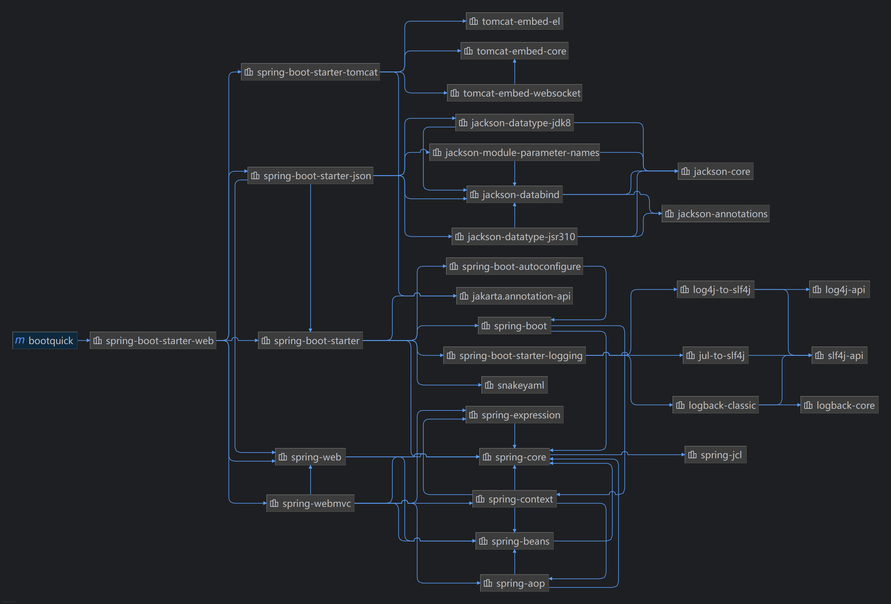
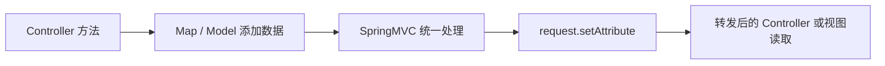
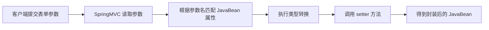
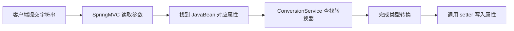
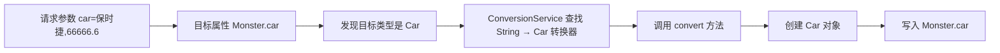

# 【韩顺平分布式微服务】Spring Boot

## Spring Boot 基本介绍

### 官方资料

- Spring Boot 官网：https://spring.io/projects/spring-boot
- Spring Boot 参考文档：https://docs.spring.io/spring-boot/docs/current/reference/html/
- Spring Boot API：https://docs.spring.io/spring-boot/api/java/index.html

### Spring Boot 是什么

- Spring Boot 可以轻松创建独立的、生产级的、基于 Spring 的应用程序。
- Spring Boot 可以直接嵌入 Tomcat、Jetty 或 Undertow，因此可以直接运行 Spring Boot 应用。
- Spring Boot 不是替代 Spring，而是在 Spring 基础上进一步封装和简化。
- Spring Boot 的核心价值是：
    - 简化 Maven 依赖管理。
    - 简化 Spring、SpringMVC、Tomcat 等框架整合。
    - 通过自动配置减少 XML 和重复 Java Config。
    - 通过约定优于配置降低项目搭建成本。
    - 让开发者更快进入业务开发。

### Spring、SpringMVC、Spring Boot 的关系

- Spring 是整个生态的核心，主要能力是 IOC 和 AOP。
- SpringMVC 是 Spring 生态中负责 Web 请求处理的模块。
- SpringMVC 的底层基石仍然是 Servlet。
- Spring Boot 是为了简化 Spring 项目开发而推出的封神框架（约定优于配置）。
- Spring Boot 内部包含 Spring，也包含 SpringMVC。
- 可以这样理解：
    - Spring：核心容器，负责 IOC、DI、AOP、事务等基础能力。
    - SpringMVC：Web 层框架，负责接收请求、参数绑定、调用 Controller、响应数据或视图。
    - Spring Boot：帮助快速创建 Spring 应用，自动整合 Spring、SpringMVC、Tomcat、Jackson、数据源等常用组件。

### 和传统 SSM 的对比

传统 SSM 项目需要手动配置：

- `web.xml`
- `applicationContext.xml`
- `dispatcher-servlet.xml`
- `mybatis-config.xml`
- Tomcat
- DispatcherServlet
- 字符编码过滤器
- 静态资源处理
- 视图解析器
- 文件上传
- 数据源
- SqlSessionFactory
- Mapper 扫描
- 事务管理器

Spring Boot 项目通常只需要：

- 引入合适的 starter。
- 编写启动类。
- 编写 Controller / Service / Mapper。
- 在 `application.yml` 中修改必要配置。
- 直接运行 `main` 方法。

一句话总结：

- SSM 阶段重点是理解框架如何整合。
- Spring Boot 阶段重点是理解框架如何自动整合。
- Spring Boot 不是让底层消失，而是把大量固定套路自动化了。


### 约定优于配置
1. 约定优于配置(Convention over Configuration/COC)，又称按约定编程，是一种软件设计规范, 本质上是对系、类库或框架中一些东西假定一个大众化合理的默认值(缺省值)
1. 例如在模型中存在一个名为 User 的类，那么对应到数据库会存在一个名为 user 的表，只有在偏离这个约定时才需要做相关的配置 (例如你想将表名命名为 t_user 等非 user 时才需要写关于这个名字的配置)
1. 简单来说就是假如你所期待的配置与约定的配置一致，那么就可以不做任何配置，约定不符合期待时, 才需要对约定进行替换配置
1. 约定优于配置理念：约定其实就是一种规范，遵循了规范，那么就存在通用性，存在通用性，那么事情就会变得相对简单，程序员之间的沟通成本会降低，工作效率会提升，合作也会变得更加简单

---

## 快速入门：Hello Spring Boot

### 需求

- 创建一个 Spring Boot Web 项目。
- 浏览器访问：

```bash
http://localhost:8080/hello
```

- 页面响应：

```bash
hello, spring boot
```

### 环境要求

- JDK 8 或以上。
- Maven 3.5 或以上。
- IDEA 配置好 Maven。

### Maven 依赖

课程使用 Spring Boot 2.5.3。

```xml
<parent>
    <groupId>org.springframework.boot</groupId>
    <artifactId>spring-boot-starter-parent</artifactId>
    <version>2.5.3</version>
</parent>

<dependencies>
    <!-- Web 场景启动器：自动引入 SpringMVC、内嵌 Tomcat、Jackson 等依赖 -->
    <dependency>
        <groupId>org.springframework.boot</groupId>
        <artifactId>spring-boot-starter-web</artifactId>
    </dependency>
</dependencies>
```

### 启动类

```java
package com.lcq.springboot;

import org.springframework.boot.SpringApplication;
import org.springframework.boot.autoconfigure.SpringBootApplication;

@SpringBootApplication
public class MainApp {

    public static void main(String[] args) {
        SpringApplication.run(MainApp.class, args);
    }
}
```

### Controller

```java
package com.lcq.springboot.controller;

import org.springframework.web.bind.annotation.RequestMapping;
import org.springframework.web.bind.annotation.RestController;

@RestController
public class HelloController {

    @RequestMapping("/hello")
    public String hello() {
        return "hello, spring boot";
    }
}
```

### `@RestController` 的理解

`@RestController` 等价于：

```java
@Controller
@ResponseBody
```

也就是说：

- 返回值不会被当作视图名。
- 返回值会直接写入 HTTP 响应体。
- 如果返回对象，会通过消息转换器转成 JSON。
- 如果返回字符串，就直接返回字符串内容。

### 快速入门小结

- 一个 `spring-boot-starter-web` 就引入了 Web 开发常用依赖。
- Spring Boot 内嵌 Tomcat，不需要手动部署到外部 Tomcat。
- `main` 方法启动后，Tomcat、Spring 容器、SpringMVC 都会启动。
- 相比传统 SSM，Spring Boot 把大量配置隐藏在自动配置中。

---

## 依赖管理

### `spring-boot-starter-parent`

1. `spring-boot-starter-parent` 的作用：

    - 统一管理常用依赖版本。
    - 提供 Maven 插件默认配置。
    - 提供 Java 编译版本、编码等默认配置。
    - 让子项目可以不写大量依赖版本号。

2. 示例：

    ```xml
    <parent>
        <groupId>org.springframework.boot</groupId>
        <artifactId>spring-boot-starter-parent</artifactId>
        <version>2.5.3</version>
    </parent>
    ```


### 自动版本仲裁

1. Spring Boot 父工程中已经声明了很多常用依赖版本。

    例如：

    - Spring Framework 版本。
    - Jackson 版本。
    - Tomcat 版本。
    - MySQL 驱动版本。
    - Lombok 版本。

    因此子项目写依赖时，很多时候不用写 `<version>`。

2. 示例：

    ```xml
    <dependency>
        <groupId>mysql</groupId>
        <artifactId>mysql-connector-java</artifactId>
    </dependency>
    ```

    这里没有写版本号，版本由 Spring Boot 父工程统一管理。

3. 注意事项
    我们的项目的父项目一般为`spring-boot-starter-parent`，其还有一个父项目为`spring-boot-dependencies`，这个项目中存有版本仲裁的版本号

### 修改默认版本

如果需要覆盖 Spring Boot 默认版本，可以在 `properties` 中重写版本属性。

示例：把 MySQL 驱动版本改成 `5.1.49`。通过修改默认的属性值完成。

```xml
<properties>
    <mysql.version>5.1.49</mysql.version>
</properties>
```

注意：

- 不建议随意修改默认版本。
- 修改版本前要确认依赖兼容性。
- 企业项目中更推荐统一由父工程或 BOM 管理版本。

---

## starter 场景启动器

### starter 是什么

starter 是 Spring Boot 提供的一组场景化依赖集合。

例如：

```xml
<dependency>
    <groupId>org.springframework.boot</groupId>
    <artifactId>spring-boot-starter-web</artifactId>
</dependency>
```

它会自动引入：

- Spring MVC。
- Spring Web。
- 内嵌 Tomcat。
- Jackson JSON。
- Logging 相关依赖。
- Spring Boot 自动配置依赖。

### starter 的意义

- 程序员不再需要手动判断 Web 项目到底要引入哪些 jar。
- 避免版本冲突。
- 降低项目搭建成本。
- 让项目依赖结构更清晰。
- 依赖树
    

### 常见官方 starter

1. 文档
    - https://docs.spring.io/spring-boot/reference/using/build-systems.html#using.build-systems.starters

2. 举例
    - `spring-boot-starter`
        - Spring Boot 最基础 starter。
    - `spring-boot-starter-web`
        - Web 开发。
    - `spring-boot-starter-test`
        - 测试。
    - `spring-boot-starter-jdbc`
        - JDBC。
    - `spring-boot-starter-data-jpa`
        - JPA。
    - `spring-boot-starter-thymeleaf`
        - Thymeleaf 模板。
    - `spring-boot-starter-validation`
        - 参数校验。
    - `spring-boot-starter-aop`
        - AOP。
    - `spring-boot-starter-data-redis`
        - Redis。
    - `spring-boot-starter-security`
        - Spring Security。

### 第三方 starter

第三方 starter 通常不以 `spring-boot` 开头。

命名习惯通常是：

```bash
xxx-spring-boot-starter
```

例如：

```bash
mybatis-spring-boot-starter
druid-spring-boot-starter
```

注意：

- `spring-boot-starter-xxx` 通常是官方 starter。
- `xxx-spring-boot-starter` 通常是第三方 starter。

---

## 自动配置

### 自动配置解决了什么

传统 SSM 中需要配置：

- Tomcat。
- DispatcherServlet。
- SpringMVC。
- 字符编码过滤器。
- 静态资源处理。
- JSON 转换器。
- 文件上传。
- 数据源。
- 事务管理器。
- MyBatis 相关对象。

Spring Boot 会根据当前项目引入的 starter 和 classpath 中存在的类，自动创建对应组件。

### 自动配置的基本思想

- 你引入了 Web starter。
- Spring Boot 发现 classpath 中有 SpringMVC、Tomcat、Jackson。
- Spring Boot 判断这是一个 Servlet Web 应用。
- Spring Boot 自动创建 Web 服务器、DispatcherServlet、消息转换器等组件。
- 如果你没有自定义配置，就使用默认配置。
- 如果你写了自定义配置，就以你的配置为准。

### 自动配置遵守按需加载原则

- 引入了哪个 starter，才会加载对应场景依赖。引入了哪个场景starter就会加载该场景关联的jar包，没有引入的starter则不会加载其关联jar
- classpath 中存在某些类时，对应自动配置才可能生效。
- 容器中已经有用户自定义 Bean 时，很多默认 Bean 会自动让位。
- Spring Boot 自动配置不是全部无脑加载，而是大量使用条件注解控制。

1. SpringBoot所有的自动配置功能都在spring-boot-autoconfigure包里面
3. 在SpringBoot的自动配置包,一般是XxxAutoConfiguration.java,对应XxxxProperties.java

常见条件注解：

- `@ConditionalOnClass`
- `@ConditionalOnMissingBean`
- `@ConditionalOnBean`
- `@ConditionalOnProperty`
- `@ConditionalOnWebApplication`

### 自动配置的位置

Spring Boot 自动配置主要位于：

```bash
spring-boot-autoconfigure
```

其中常见结构是：

- `XxxAutoConfiguration`
    - 自动配置类。
- `XxxProperties`
    - 对应配置属性类。

例如：

- `MultipartAutoConfiguration`
- `MultipartProperties`

### 如何查看自动配置了哪些 Bean

```java
package com.lcq.springboot;

import org.springframework.boot.SpringApplication;
import org.springframework.boot.autoconfigure.SpringBootApplication;
import org.springframework.context.ConfigurableApplicationContext;

@SpringBootApplication
public class MainApp {

    public static void main(String[] args) {
        ConfigurableApplicationContext ioc =
                SpringApplication.run(MainApp.class, args);

        String[] beanDefinitionNames = ioc.getBeanDefinitionNames();
        for (String beanDefinitionName : beanDefinitionNames) {
            System.out.println(beanDefinitionName);
        }
    }
}
```

通过这种方式可以看到容器里被创建了哪些组件。

---

## 默认扫描包结构

### 默认扫描规则

Spring Boot 默认扫描启动类所在包及其子包。
文档：https://docs.spring.io/spring-boot/reference/using/structuring-your-code.html#using.structuring-your-code.using-the-default-package

例如启动类位置：

```bash
com.lcq.springboot.MainApp
```

默认会扫描：

- `com.lcq.springboot`
- `com.lcq.springboot.controller`
- `com.lcq.springboot.service`
- `com.lcq.springboot.mapper`
- `com.lcq.springboot.config`

不会默认扫描：

- `com.lcq.other`
- `com.lcq.web`

### 推荐目录结构

```bash
src/main/java
└── com
    └── lcq
        └── springboot
            ├── MainApp.java
            ├── controller
            ├── service
            ├── mapper
            ├── entity
            ├── dto
            ├── vo
            ├── config
            └── common
```

### 修改扫描包

如果需要扫描更大的范围，可以写：

```java
@SpringBootApplication(scanBasePackages = "com.lcq")
public class MainApp {

    public static void main(String[] args) {
        SpringApplication.run(MainApp.class, args);
    }
}
```

真实项目中更推荐：

- 把启动类放在项目根包下。
- 不随意扩大扫描范围。
- 避免扫描到不该注册的类。

---

## 配置文件

### `application.properties`

参考文档：https://blog.csdn.net/pbrlovejava/article/details/82659702

Spring Boot 默认会读取：

```bash
src/main/resources/application.properties
```

示例：

```properties
server.port=10000
server.servlet.context-path=/api

spring.servlet.multipart.max-file-size=10MB
spring.servlet.multipart.max-request-size=100MB
```

### `application.yml`

现代项目更常用 `application.yml`。

```yaml
server:
  port: 10000
  servlet:
    context-path: /api

spring:
  servlet:
    multipart:
      max-file-size: 10MB
      max-request-size: 100MB
```

### properties 和 yml 的选择

- `properties` 简单直接，适合少量配置。
- `yml` 层级清晰，适合复杂配置。
- 不建议同一个项目中同时大量使用 `properties` 和 `yml`。
- 如果两者配置相同属性，容易产生覆盖问题。

### 常用配置

```yaml
server:
  port: 10000
  servlet:
    context-path: /api

spring:
  application:
    name: lcq-springboot
  datasource:
    driver-class-name: com.mysql.cj.jdbc.Driver
    url: jdbc:mysql://localhost:3306/furn_ssm?useSSL=false&serverTimezone=Asia/Shanghai&characterEncoding=utf8
    username: root
    password: lcq
  jackson:
    date-format: yyyy-MM-dd HH:mm:ss
    time-zone: GMT+8
  servlet:
    multipart:
      max-file-size: 10MB
      max-request-size: 100MB

logging:
  level:
    root: info
    com.lcq: debug
```

### 自定义配置

```yaml
lcq:
  website: https://example.com
  author: lcq
```

读取方式：

```java
@Value("${lcq.website}")
private String website;
```

更推荐使用 `@ConfigurationProperties` 做配置绑定。


### 配置文件的存放位置

1. 默认的路径
    - 通过查看源码`ConfigFileApplicationListener.java`

        ```java
        private static final String DEFAULT_SEARCH_LOCATIONS = "classpath:/,classpath:/config/,file:./,file:./config/*/,file:./ config/";
        ```
    - 即在这些目录存放配置文件均会生效：
        - `Resource/`
        - `Resource/config/`
        - `./`：项目运行的根目录。也就是和你的 pom.xml 或 jar 包平级的目录。
        - `./config`：项目运行的根目录下的`config`目录
        - `./config/任意直接子包`


1. 默认的存放路径
    - 通过查看源码 `ConfigFileApplicationListener.java`：

        ```java
        private static final String DEFAULT_SEARCH_LOCATIONS = "classpath:/,classpath:/config/,file:./,file:./config/,file:./config/*/";

        ```

    - 即在以下这些目录存放配置文件均会生效，**且加载优先级从高到低如下**（高优先级会覆盖低优先级的同名配置）：

        * **`file:` 系列（文件系统，指向项目运行的当前工作目录）：**
            1. `file:./config/*/`：项目运行根目录下的 `config` 目录里的**任意直接子文件夹**（如 `config/redis/`）。
            2. `file:./config/`：项目运行根目录下的 `config` 文件夹。
            3. `file:./`：项目运行的根目录（即和 `pom.xml` 或打出的 `jar` 包平级的目录）。


        * **`classpath:` 系列（类路径，通常对应开发时的 resources 目录）：**
            1. `classpath:/config/`：对应 `src/main/resources/config/`。
            5. `classpath:/`：对应 `src/main/resources/`（最常用的默认位置）。     

2. 📊 完整的优先级顺序（由高到低）
    Spring Boot 会按以下顺序从上到下加载配置，上方的高优先级会覆盖下方的低优先级：

    - 命令行参数（最高优先级，如 java -jar app.jar --server.port=9999）
    - JAR 包外部的 `config/*/` 子文件夹（Spring Boot 2.4+）
    - JAR 包外部的 `config/` 文件夹
    - JAR 包外部的当前工作目录（与 JAR 包平级）
    - JAR 包内部的 `classpath:/config/` 目录
    - JAR 包内部的 `classpath:/` 根目录（最基础的默认配置）

---

## 容器功能

### Spring 传统注解仍然有效

在 Spring Boot 中，Spring 原有注解仍然可以使用：

- `@Component`
- `@Controller`
- `@RestController`
- `@Service`
- `@Repository`
- `@Autowired`
- `@Resource`
- `@Configuration`
- `@Bean`

Spring Boot 不是废弃 Spring，而是加强和简化 Spring。

---

## `@Configuration` 与 `@Bean`

### 作用

`@Configuration` 表示当前类是配置类，作用类似传统 Spring 的 XML 配置文件。

原xml配置仍然可以在SpringBoot项目中生效

`@Bean` 用于把方法返回值注册到 Spring 容器。

### 实体类

```java
package com.lcq.springboot.bean;

public class Monster {

    private Integer id;
    private String name;
    private Integer age;
    private String skill;

    public Monster() {
    }

    public Monster(Integer id, String name, Integer age, String skill) {
        this.id = id;
        this.name = name;
        this.age = age;
        this.skill = skill;
    }

    // getter / setter / toString
}
```

### 配置类

```java
package com.lcq.springboot.config;

import com.lcq.springboot.bean.Monster;
import org.springframework.context.annotation.Bean;
import org.springframework.context.annotation.Configuration;

@Configuration
public class BeanConfig {

    @Bean
    public Monster monster01() {
        return new Monster(100, "牛魔王", 500, "芭蕉扇");
    }
}
```

### 获取 Bean

```java
ConfigurableApplicationContext ioc =
        SpringApplication.run(MainApp.class, args);

Monster monster01 = ioc.getBean("monster01", Monster.class);
Monster monster02 = ioc.getBean("monster01", Monster.class);

System.out.println(monster01);
System.out.println(monster01 == monster02);
```

默认情况下，Spring 容器中的 Bean 是单例的。

### `@Bean` 的默认名称

```java
@Bean
public Monster monster01() {
    return new Monster();
}
```

默认 Bean 名称是方法名：

```bash
monster01
```

也可以手动指定：

```java
@Bean("monster_nmw")
@Scope("prototype")
public Monster monster01() {
    return new Monster();
}
```

此时 Bean 名称是：

```bash
monster_nmw
```


增加`@Scope`注解可以修改Bean的类型，比如修改为非单例对象。

### 注意事项

1. 配置类本身也是组件， 因此也可以获取
    ```java
    ioc.getBean(BeanConfig.class);
    ```

## `proxyBeanMethods`

`proxyBeanMethods` 用于控制 Spring 是否为配置类创建代理对象。

它主要影响一种情况：

> 在一个 `@Bean` 方法中，直接调用另一个 `@Bean` 方法时，Spring 是否需要拦截该调用，并优先返回容器中已有的 Bean。

---

### Full 模式

默认情况下，`@Configuration` 使用 Full 模式：

```java
@Configuration(proxyBeanMethods = true)
public class AppConfig {
}
```

也可以简写为：

```java
@Configuration
public class AppConfig {
}
```

#### 特点

* Spring 会为配置类创建代理对象。
* 当配置类中的一个 `@Bean` 方法直接调用另一个 `@Bean` 方法时，调用会被代理对象拦截。
* Spring 会优先从 IoC 容器中获取已经创建的 Bean，而不是每次都重新执行方法。
* 可以保证配置类内部直接调用 `@Bean` 方法时，获取的仍然是容器中的单例对象。
* 由于需要创建代理对象并拦截方法调用，会产生少量额外开销。

#### 示例

```java
@Configuration
public class AppConfig {

    @Bean
    public A a() {
        System.out.println("创建 A");
        return new A();
    }

    @Bean
    public B b() {
        return new B(a());
    }
}
```

虽然 `b()` 方法中直接调用了：

```java
a()
```

但是由于配置类使用 Full 模式，这次调用会被 Spring 代理对象拦截。

Spring 会优先从 IoC 容器中获取已经存在的 `A` 对象。

最终效果近似于：

```java
A a = applicationContext.getBean(A.class);
return new B(a);
```

因此：

```java
A a = applicationContext.getBean(A.class);
B b = applicationContext.getBean(B.class);

System.out.println(a == b.getA());
```

输出结果为：

```text
true
```

容器中的 `A` 与 `B` 内部持有的 `A` 是同一个对象。

---

### Lite 模式

Lite 模式需要显式设置：

```java
@Configuration(proxyBeanMethods = false)
public class AppConfig {
}
```

#### 特点

* Spring 不会为配置类创建用于拦截 `@Bean` 方法调用的代理对象。
* 配置类中的 `@Bean` 方法更接近普通 Java 方法。
* 如果在一个 `@Bean` 方法中直接调用另一个 `@Bean` 方法，被调用的方法会重新执行。
* 直接调用可能创建一个不受 Spring 容器管理的新对象。
* 由于不需要创建代理对象，启动过程更加轻量。
* 现代 Spring Boot 自动配置类通常会优先使用 Lite 模式。

> **Spring 官方的“带头冲锋”**
如果你翻看 Spring Boot 2.2 以后的源码，你会发现里面成百上千个官方的自动配置类（比如 `DataSourceAutoConfiguration`、`RedisAutoConfiguration` 等），它们头上的注解几乎全部改成了：`@Configuration(proxyBeanMethods = false)`
官方之所以这么干，就是为了追求极致的启动速度和极低的内存占用。因为框架底层的 Bean 非常多，省去 CGLIB 代理类的生成，能让 Spring Boot 的启动时间肉眼可见地缩短。

>说白了，就是以参数自动装配严格替代方法调用。而被留下的`proxyBeanMethods`默认为True，只是Spring为了兼容旧版本，和一种防SB机制。

---

### Lite 模式下的错误示例

```java
@Configuration(proxyBeanMethods = false)
public class AppConfig {

    @Bean
    public A a() {
        System.out.println("创建 A");
        return new A();
    }

    @Bean
    public B b() {
        return new B(a());
    }
}
```

此时，`b()` 方法中的：

```java
a()
```

只是一次普通 Java 方法调用。

它会再次执行：

```java
return new A();
```

因此，程序中可能出现两个不同的 `A` 对象：

```text
容器中的 A：对象 A1

B 内部持有的 A：对象 A2
```

其中，`A2` 是直接调用方法产生的普通对象，并不是容器中的单例 Bean。

验证：

```java
A a = applicationContext.getBean(A.class);
B b = applicationContext.getBean(B.class);

System.out.println(a == b.getA());
```

输出结果为：

```text
false
```

---

### Lite 模式下的推荐写法

Lite 模式并不是不能处理 Bean 之间的依赖关系。

正确做法是：**通过方法参数声明依赖，由 Spring 从 IoC 容器中自动注入对象。**

```java
@Configuration(proxyBeanMethods = false)
public class AppConfig {

    @Bean
    public A a() {
        System.out.println("创建 A");
        return new A();
    }

    @Bean
    public B b(A a) {
        return new B(a);
    }
}
```

这里不需要手动传入参数。

当 Spring 创建 `B` 时，会自动完成以下操作：

```text
Spring 准备创建 B
        ↓
发现 b(A a) 方法需要一个 A 类型的参数
        ↓
从 IoC 容器中查找 A 类型的 Bean
        ↓
找到由 a() 方法创建的单例对象
        ↓
将该对象注入 b(A a)
        ↓
创建 B
```

可以近似理解为：

```java
A a = applicationContext.getBean(A.class);
B b = new B(a);
```

验证：

```java
A a = applicationContext.getBean(A.class);
B b = applicationContext.getBean(B.class);

System.out.println(a == b.getA());
```

输出结果为：

```text
true
```

---


### 两种写法对比

#### 不推荐：配置类内部直接调用方法

```java
@Bean
public B b() {
    return new B(a());
}
```

在 Full 模式下可以正常复用单例对象，但是依赖关系不够直观。

在 Lite 模式下会重新执行 `a()` 方法，可能创建容器之外的新对象。

#### 推荐：通过方法参数注入依赖

```java
@Bean
public B b(A a) {
    return new B(a);
}
```

参数 `a` 由 Spring 从 IoC 容器中自动注入。

这种写法：

* 可以明确表达 Bean 之间的依赖关系。
* 不需要手动传递参数。
* 不依赖配置类代理机制。
* 在 Full 模式和 Lite 模式下都能正确工作。
* 更符合依赖注入思想。

---

### 如果容器中存在多个同类型 Bean

假设容器中注册了两个 `A`：

```java
@Configuration(proxyBeanMethods = false)
public class AppConfig {

    @Bean
    public A firstA() {
        return new A();
    }

    @Bean
    public A secondA() {
        return new A();
    }

    @Bean
    public B b(A a) {
        return new B(a);
    }
}
```

此时，Spring 无法判断应该向 `b(A a)` 中注入哪一个 `A`，项目启动时会报错。

可以使用 `@Qualifier` 指定 Bean 名称：

```java
@Bean
public B b(@Qualifier("firstA") A a) {
    return new B(a);
}
```

也可以使用 `@Primary` 指定默认 Bean：

```java
@Bean
@Primary
public A firstA() {
    return new A();
}
```

---

### 选择建议

* 如果配置类中的 `@Bean` 方法需要直接调用其他 `@Bean` 方法，可以保留默认的 Full 模式。

```java
@Configuration
public class AppConfig {

    @Bean
    public A a() {
        return new A();
    }

    @Bean
    public B b() {
        return new B(a());
    }
}
```

* 如果通过方法参数注入 Bean 依赖，可以安全地使用 Lite 模式。

```java
@Configuration(proxyBeanMethods = false)
public class AppConfig {

    @Bean
    public A a() {
        return new A();
    }

    @Bean
    public B b(A a) {
        return new B(a);
    }
}
```

* 在现代 Spring Boot 项目中，推荐优先使用方法参数注入表达依赖关系。
* 当配置类不需要内部直接调用其他 `@Bean` 方法时，可以使用 Lite 模式减少不必要的代理开销。

## `@Import`

### 作用

`@Import` 可以快速向容器中导入组件。

```java
package com.lcq.springboot.config;

import com.lcq.springboot.bean.Cat;
import com.lcq.springboot.bean.Dog;
import org.springframework.context.annotation.Configuration;
import org.springframework.context.annotation.Import;

@Import({Dog.class, Cat.class})
@Configuration(proxyBeanMethods = false)
public class BeanConfig {
}
```

### 实际场景：按需启用支付模块

假设项目中单独封装了支付宝支付配置：

```java
package com.lcq.payment.config;

@Configuration(proxyBeanMethods = false)
public class AlipayConfig {

    @Bean
    public AlipayClient alipayClient() {
        return new AlipayClient();
    }
}
```

订单服务需要使用支付功能，但默认扫描范围不包含 `com.lcq.payment`，可以精确导入该配置类：

```java
@Configuration(proxyBeanMethods = false)
@Import(AlipayConfig.class)
public class OrderConfig {
}
```

这样，无需扩大包扫描范围，也可以将支付模块中的组件注册到容器中。

### 注意

* `@Import` 导入普通组件时，默认名称是全类名。
* 适合精准导入第三方配置类或其他模块中的配置类。
* 常用于底层框架和自动配置中。


## `@Conditional`

### 作用

`@Conditional` 表示条件装配。

只有满足指定条件时，才会向 IoC 容器中注入组件。

Spring Boot 在 `@Conditional` 的基础上扩展了大量常用条件注解，主要位于：

```java
org.springframework.boot.autoconfigure.condition
```

### 常用条件注解

| 条件注解                              | 满足条件的情况                         |
| --------------------------------- | ------------------------------- |
| `@ConditionalOnJava`              | 当前 Java 版本符合指定要求                |
| `@ConditionalOnBean`              | 容器中存在指定 Bean                    |
| `@ConditionalOnMissingBean`       | 容器中不存在指定 Bean                   |
| `@ConditionalOnExpression`        | 指定的 SpEL 表达式成立                  |
| `@ConditionalOnClass`             | 类路径中存在指定类                       |
| `@ConditionalOnMissingClass`      | 类路径中不存在指定类                      |
| `@ConditionalOnSingleCandidate`   | 容器中只有一个指定类型的 Bean，或者存在一个首选 Bean |
| `@ConditionalOnProperty`          | 配置文件中指定属性满足要求                   |
| `@ConditionalOnResource`          | 类路径中存在指定资源文件                    |
| `@ConditionalOnWebApplication`    | 当前应用属于 Web 应用                   |
| `@ConditionalOnNotWebApplication` | 当前应用不属于 Web 应用                  |
| `@ConditionalOnJndi`              | JNDI 中存在指定内容                    |

其中，开发中最常见的是：

* `@ConditionalOnBean`
* `@ConditionalOnMissingBean`
* `@ConditionalOnClass`
* `@ConditionalOnMissingClass`
* `@ConditionalOnProperty`
* `@ConditionalOnWebApplication`

---

### 示例：存在指定 Bean 时才创建组件

```java
package com.lcq.springboot.config;

import com.lcq.springboot.bean.Dog;
import com.lcq.springboot.bean.Monster;
import org.springframework.boot.autoconfigure.condition.ConditionalOnBean;
import org.springframework.context.annotation.Bean;
import org.springframework.context.annotation.Configuration;

@Configuration(proxyBeanMethods = false)
public class BeanConfig {

    @Bean("monster_nmw")
    public Monster monster01() {
        return new Monster(100, "牛魔王", 500, "芭蕉扇");
    }

    @ConditionalOnBean(name = "monster_nmw")
    @Bean
    public Dog dog01() {
        return new Dog();
    }
}
```

含义：

* Spring 创建 `dog01` 之前，会先检查容器中是否存在名为 `monster_nmw` 的 Bean。
* 如果存在，则创建 `dog01`。
* 如果不存在，则不创建 `dog01`。

---

### 示例：用户未自定义组件时才提供默认组件

`@ConditionalOnMissingBean` 在自动配置中非常常见。

```java
@Configuration(proxyBeanMethods = false)
public class MessageConfig {

    @ConditionalOnMissingBean
    @Bean
    public MessageService messageService() {
        return new DefaultMessageService();
    }
}
```

含义：

* 如果容器中不存在 `MessageService`，则创建默认实现。
* 如果用户已经自行注册了 `MessageService`，则不再创建默认对象。

这种设计允许框架提供默认配置，同时保留用户覆盖默认配置的能力。

---

### 工程意义

Spring Boot 的自动配置大量依赖条件装配。

例如：

* 只有引入了 Jackson，才配置 JSON 转换器。
* 只有当前是 Web 应用，才配置 Web 相关组件。
* 只有配置文件中开启了某项功能，才加载对应模块。
* 只有容器中没有用户自定义组件，才创建默认组件。

可以将条件装配理解为：

```text
先检查当前项目环境
        ↓
判断是否满足指定条件
        ↓
满足条件：注册 Bean
不满足条件：跳过 Bean
```

条件装配是 Spring Boot 自动配置能够做到“按需加载”的重要基础。


## `@ImportResource`

### 作用

`@ImportResource` 用于导入传统 Spring XML 配置文件。

它是 Spring Boot 对传统 Spring 配置方式的兼容。

### 示例

```java
package com.lcq.springboot.config;

import org.springframework.context.annotation.Configuration;
import org.springframework.context.annotation.ImportResource;

@Configuration
@ImportResource("classpath:beans.xml")
public class BeanConfig {
}
```

### 使用场景

- 老项目迁移到 Spring Boot。
- 暂时不想重写 XML 配置。
- 某些第三方旧配置仍然是 XML 形式。

### 现代建议

- 新项目尽量使用 Java Config、注解和 `application.yml`。
- 老项目迁移时可以使用 `@ImportResource` 过渡。
- 不建议长期在新项目中大量混用 XML 和 Java Config。

---

## 配置绑定

### 基本介绍

配置绑定就是：

* 从 `application.properties`、`application.yml`、环境变量等外部配置源中读取参数。
* 将同一模块的一组配置项自动绑定到 Java 对象。
* 在业务代码中以类型安全的方式使用配置。
* 避免在多个类中反复使用 `@Value` 读取零散配置。

---

### 使用 `@ConfigurationProperties`

假设项目需要配置 JWT 的密钥、有效期和签发者。

`application.yml`：

```yaml
app:
  jwt:
    secret: ${JWT_SECRET:dev-secret-key}
    expiration: 7200
    issuer: lcq-furn
```

配置类：

```java
package com.lcq.springboot.config.properties;

import lombok.Data;
import org.springframework.boot.context.properties.ConfigurationProperties;
import org.springframework.stereotype.Component;

@Data
@Component
@ConfigurationProperties(prefix = "app.jwt")
public class JwtProperties {

    private String secret;

    private Long expiration;

    private String issuer;
}
```

绑定关系：

```text
app.jwt.secret      → secret
app.jwt.expiration  → expiration
app.jwt.issuer      → issuer
```

其中：

```java
@ConfigurationProperties(prefix = "app.jwt")
```

表示读取 `app.jwt` 前缀下的配置，并绑定到当前对象的同名属性中。

---

### 在业务类中使用配置

```java
package com.lcq.springboot.service;

import com.lcq.springboot.config.properties.JwtProperties;
import org.springframework.stereotype.Service;

@Service
public class JwtService {

    private final JwtProperties jwtProperties;

    public JwtService(JwtProperties jwtProperties) {
        this.jwtProperties = jwtProperties;
    }

    public void printConfig() {
        System.out.println(jwtProperties.getIssuer());
        System.out.println(jwtProperties.getExpiration());
    }
}
```

`JwtProperties` 已经被注册到 IoC 容器中，因此可以像普通 Bean 一样通过构造器注入。

不需要手动创建对象：

```java
new JwtProperties();
```

也不需要手动调用 Setter。

---

### `@Component` 与 `@ConfigurationProperties` 的分工

```java
@Component
@ConfigurationProperties(prefix = "app.jwt")
public class JwtProperties {
}
```

两者作用不同：

```text
@Component
负责将 JwtProperties 注册到 IoC 容器。

@ConfigurationProperties
负责将配置文件中的属性绑定到 JwtProperties 对象。
```

---

### 使用 `@EnableConfigurationProperties`

如果不想在配置类上添加 `@Component`，可以使用 `@EnableConfigurationProperties` 注册配置类。

`JwtProperties`：

```java
package com.lcq.springboot.config.properties;

import lombok.Data;
import org.springframework.boot.context.properties.ConfigurationProperties;

@Data
@ConfigurationProperties(prefix = "app.jwt")
public class JwtProperties {

    private String secret;

    private Long expiration;

    private String issuer;
}
```

注册配置类：

```java
package com.lcq.springboot.config;

import com.lcq.springboot.config.properties.JwtProperties;
import org.springframework.boot.context.properties.EnableConfigurationProperties;
import org.springframework.context.annotation.Configuration;

@Configuration(proxyBeanMethods = false)
@EnableConfigurationProperties(JwtProperties.class)
public class JwtConfig {
}
```

含义：

* `JwtProperties` 不再使用 `@Component`。
* `@EnableConfigurationProperties(JwtProperties.class)` 负责将它注册到容器。
* `@ConfigurationProperties(prefix = "app.jwt")` 仍然负责绑定配置。

---

### 使用 `@ConfigurationPropertiesScan`

当项目中存在多个配置类时，可以统一扫描。

启动类：

```java
package com.lcq.springboot;

import org.springframework.boot.SpringApplication;
import org.springframework.boot.autoconfigure.SpringBootApplication;
import org.springframework.boot.context.properties.ConfigurationPropertiesScan;

@SpringBootApplication
@ConfigurationPropertiesScan
public class SpringBootMainApplication {

    public static void main(String[] args) {
        SpringApplication.run(SpringBootMainApplication.class, args);
    }
}
```

配置类只需要保留：

```java
@Data
@ConfigurationProperties(prefix = "app.jwt")
public class JwtProperties {

    private String secret;

    private Long expiration;

    private String issuer;
}
```

常见选择：

* 配置类较少：使用 `@Component`，简单直接。
* 需要显式注册某个配置类：使用 `@EnableConfigurationProperties`。
* 配置类较多：使用 `@ConfigurationPropertiesScan` 统一扫描。

---

### 和 `@Value` 的区别

使用 `@Value`：

```java
@Value("${app.jwt.secret}")
private String secret;

@Value("${app.jwt.expiration}")
private Long expiration;

@Value("${app.jwt.issuer}")
private String issuer;
```

使用 `@ConfigurationProperties`：

```java
@ConfigurationProperties(prefix = "app.jwt")
public class JwtProperties {

    private String secret;

    private Long expiration;

    private String issuer;
}
```

选择建议：

* 只有一两个零散配置项时，可以使用 `@Value`。
* 同一模块存在多个相关配置项时，优先使用 `@ConfigurationProperties`。

---

### 配置提示依赖

如果 IDEA 中没有自定义配置项提示，可以加入配置元数据处理器：

```xml
<dependency>
    <groupId>org.springframework.boot</groupId>
    <artifactId>spring-boot-configuration-processor</artifactId>
    <optional>true</optional>
</dependency>
```

添加后重新编译项目，IDEA 可以识别自定义配置项并提供提示。

---

### 注意

* 配置类用于承载应用参数，不建议直接使用 `Furn`、`User` 等业务实体类绑定配置。
* 生产环境中的密钥、密码等敏感信息不应直接写死在配置文件中。
* 可以通过环境变量提供生产环境密钥：

```yaml
app:
  jwt:
    secret: ${JWT_SECRET}
```

* 本地开发时可以设置默认值：

```yaml
app:
  jwt:
    secret: ${JWT_SECRET:dev-secret-key}
```


---

## Spring Boot 底层启动机制

### 问题

执行下面代码后：

```java
SpringApplication.run(MainApp.class, args);
```

为什么：

- Spring 容器启动了？
- Tomcat 启动了？
- Controller 可以被访问？
- DispatcherServlet 可以分发请求？

### 核心流程

- `SpringApplication.run()` 创建并运行 SpringApplication。
- Spring Boot 判断当前应用类型，Web 项目通常是 `SERVLET` 类型。
- 创建 `AnnotationConfigServletWebServerApplicationContext`。
- 准备 Environment、加载配置文件。
- 执行容器刷新 `refresh()`。
- 在 `onRefresh()` 中创建 WebServer。
- 通过 `TomcatServletWebServerFactory` 创建 Tomcat。
- 创建并注册 DispatcherServlet。
- 调用 `tomcat.start()` 启动内嵌 Tomcat。

### 关键链路

```bash
SpringApplication.run()
→ createApplicationContext()
→ AnnotationConfigServletWebServerApplicationContext
→ refresh()
→ ServletWebServerApplicationContext.onRefresh()
→ createWebServer()
→ TomcatServletWebServerFactory.getWebServer()
→ new Tomcat()
→ new TomcatWebServer()
→ tomcat.start()
```
---

## Lombok

### Lombok 作用

Lombok 是一个用于简化 Java 样板代码的工具。

它在编译阶段根据注解自动生成常见代码，例如：

* getter
* setter
* `toString()`
* `equals()`
* `hashCode()`
* 构造器
* Builder 构建器
* 日志对象

例如，一个普通 JavaBean 通常需要手动编写大量 Getter 和 Setter：

```java
public class UserDTO {

    private Long id;

    private String username;

    public Long getId() {
        return id;
    }

    public void setId(Long id) {
        this.id = id;
    }

    public String getUsername() {
        return username;
    }

    public void setUsername(String username) {
        this.username = username;
    }
}
```

使用 Lombok 后，可以简化为：

```java
@Data
public class UserDTO {

    private Long id;

    private String username;
}
```

---

### Maven 依赖

```xml
<dependency>
    <groupId>org.projectlombok</groupId>
    <artifactId>lombok</artifactId>
    <scope>provided</scope>
</dependency>
```

Lombok 主要在编译阶段生效，应用运行时通常不需要依赖 Lombok。

---

### 常用注解

| 注解                         | 作用                                   |
| -------------------------- | ------------------------------------ |
| `@Getter`                  | 生成 Getter 方法                         |
| `@Setter`                  | 生成 Setter 方法                         |
| `@ToString`                | 生成 `toString()` 方法                   |
| `@EqualsAndHashCode`       | 生成 `equals()` 和 `hashCode()` 方法      |
| `@NoArgsConstructor`       | 生成无参构造器                              |
| `@RequiredArgsConstructor` | 为 `final` 字段和标注了 `@NonNull` 的字段生成构造器 |
| `@AllArgsConstructor`      | 生成包含全部字段的构造器                         |
| `@Data`                    | 组合生成常见 JavaBean 方法                   |
| `@Value`                   | 创建不可变对象                              |
| `@Builder`                 | 生成 Builder 构建器                       |
| `@Slf4j`                   | 生成 SLF4J 日志对象                        |
| `@NonNull`                 | 对参数或字段进行非空检查                         |
| `@Cleanup`                 | 自动关闭资源                               |
| `@Synchronized`            | 生成同步锁逻辑                              |
| `@SneakyThrows`            | 简化受检异常声明                             |

---

### `@Data`

`@Data` 是最常用的 Lombok 注解之一。

```java
@Data
public class UserDTO {

    private Long id;

    private String username;
}
```

它相当于组合使用：

```java
@Getter
@Setter
@ToString
@EqualsAndHashCode
@RequiredArgsConstructor
```

需要注意：

* `@Data` 不会生成无参构造器。
* `@Data` 不会生成全参构造器。
* 如果需要无参或全参构造器，仍然需要单独添加注解。

```java
@Data
@NoArgsConstructor
@AllArgsConstructor
public class UserDTO {

    private Long id;

    private String username;
}
```

---

### `@Getter` 与 `@Setter`

可以标注在类上：

```java
@Getter
@Setter
public class UserDTO {

    private Long id;

    private String username;
}
```

也可以只标注某个字段：

```java
public class UserDTO {

    @Getter
    @Setter
    private String username;

    private String password;
}
```

此时只会为 `username` 生成 Getter 和 Setter。

---

### 构造器注解

#### 无参构造器

```java
@NoArgsConstructor
public class UserDTO {

    private Long id;

    private String username;
}
```

近似于：

```java
public UserDTO() {
}
```

#### 全参构造器

```java
@AllArgsConstructor
public class UserDTO {

    private Long id;

    private String username;
}
```

近似于：

```java
public UserDTO(Long id, String username) {
    this.id = id;
    this.username = username;
}
```

#### 必要参数构造器

```java
@RequiredArgsConstructor
public class UserService {

    private final UserRepository userRepository;
}
```

近似于：

```java
public UserService(UserRepository userRepository) {
    this.userRepository = userRepository;
}
```

在 Spring 项目中，`@RequiredArgsConstructor` 经常用于简化构造器注入。

```java
@Service
@RequiredArgsConstructor
public class UserService {

    private final UserRepository userRepository;

    private final PasswordEncoder passwordEncoder;
}
```

Spring 会自动通过生成的构造器注入依赖。

---

### `@Builder`

`@Builder` 可以生成链式构建对象的代码。

```java
@Data
@Builder
public class UserDTO {

    private Long id;

    private String username;

    private String email;
}
```

创建对象：

```java
UserDTO user = UserDTO.builder()
        .id(100L)
        .username("lcq")
        .email("lcq@example.com")
        .build();
```

相比直接调用多参数构造器，Builder 写法更加直观。

---

### `@Value`

Lombok 的 `@Value` 用于创建不可变对象。

```java
import lombok.Value;

@Value
public class UserInfo {

    Long id;

    String username;
}
```

它会默认：

* 将类设置为不可变类型。
* 将字段设置为 `private final`。
* 生成 Getter。
* 生成构造器。
* 生成 `toString()`、`equals()` 和 `hashCode()`。
* 不生成 Setter。

需要注意：Lombok 的 `@Value` 与 Spring 的 `@Value` 不是同一个注解。

```java
// Lombok：创建不可变对象
import lombok.Value;

// Spring：读取配置项
import org.springframework.beans.factory.annotation.Value;
```

---

### `@Slf4j`

Simple Logging Facade for Java

输出日志前，需确保IDEA安装了相应的插件`LomBok`

`@Slf4j` 可以自动生成日志对象。

```java
package com.lcq.springboot.controller;

import lombok.extern.slf4j.Slf4j;
import org.springframework.web.bind.annotation.GetMapping;
import org.springframework.web.bind.annotation.RestController;

@Slf4j
@RestController
public class UserController {

    @GetMapping("/users")
    public String list() {
        log.info("查询用户列表");
        return "success";
    }
}
```

`@Slf4j` 近似于**自动生成**：

```java
private static final Logger log =
        LoggerFactory.getLogger(UserController.class);
```

日志输出时，建议使用占位符：

```java
log.info("查询用户信息，userId = {}", userId);
```

不建议直接拼接字符串：

```java
log.info("查询用户信息，userId = " + userId);
```

---

### `@NonNull`

`@NonNull` 可以生成非空检查。

```java
@RequiredArgsConstructor
public class UserService {

    @NonNull
    private final UserRepository userRepository;
}
```

Lombok 会在构造器中自动生成空值判断。

如果传入 `null`，会抛出 `NullPointerException`。

---

### `@Cleanup`

`@Cleanup` 可以在代码执行结束后自动关闭资源。

```java
@Cleanup
InputStream inputStream = new FileInputStream("data.txt");
```

但是在现代 Java 中，更推荐使用 `try-with-resources`：

```java
try (InputStream inputStream =
             new FileInputStream("data.txt")) {

    // 读取文件
}
```

`try-with-resources` 属于 Java 原生语法，可读性更好，也更通用。

---

### `@SneakyThrows`

`@SneakyThrows` 可以省略部分受检异常的显式声明。

```java
@SneakyThrows
public void readFile() {
    Files.readString(Path.of("data.txt"));
}
```

它并不会真正处理异常，只是减少 `throws` 或 `try-catch` 代码。

在业务代码中应谨慎使用，因为它可能隐藏异常传播路径。

更推荐明确处理异常：

```java
public void readFile() {
    try {
        Files.readString(Path.of("data.txt"));
    } catch (IOException exception) {
        throw new RuntimeException("读取文件失败", exception);
    }
}
```

---

### `@Synchronized`

`@Synchronized` 用于生成同步锁逻辑。

```java
@Synchronized
public void increase() {
    count++;
}
```

它与 Java 原生 `synchronized` 类似，但会使用 Lombok 生成的私有锁对象。

普通业务开发中，优先掌握 Java 原生同步机制和 `java.util.concurrent` 工具类即可。

---

### 日常开发中优先掌握的注解

学习阶段优先掌握：

* `@Data`
* `@Getter`
* `@Setter`
* `@NoArgsConstructor`
* `@AllArgsConstructor`
* `@RequiredArgsConstructor`
* `@Builder`
* `@Slf4j`

了解即可：

* `@Value`
* `@NonNull`
* `@Cleanup`
* `@Synchronized`
* `@SneakyThrows`

---

### 实际使用建议

* DTO、VO 和简单配置类可以使用 `@Data`。
* Spring Service 和 Controller 中推荐使用 `@RequiredArgsConstructor` 简化构造器注入。
* 创建参数较多的 DTO 或请求对象时，可以使用 `@Builder`。
* 日志建议使用 `@Slf4j`，不要使用 `System.out.println()`。
* `@Data` 已经包含 `@ToString`，不需要重复添加。
* Entity 是否使用 `@Data` 需要根据团队规范决定。
* 核心领域对象不建议依赖过多自动生成的方法。
* `@SneakyThrows`、`@Cleanup` 和 `@Synchronized` 不宜为了减少代码而滥用。

---

### 综合示例

```java
package com.lcq.springboot.dto;

import lombok.AllArgsConstructor;
import lombok.Builder;
import lombok.Data;
import lombok.NoArgsConstructor;

@Data
@Builder
@NoArgsConstructor
@AllArgsConstructor
public class UserDTO {

    private Long id;

    private String username;

    private String email;
}
```

Service：

```java
package com.lcq.springboot.service;

import com.lcq.springboot.repository.UserRepository;
import lombok.RequiredArgsConstructor;
import lombok.extern.slf4j.Slf4j;
import org.springframework.stereotype.Service;

@Slf4j
@Service
@RequiredArgsConstructor
public class UserService {

    private final UserRepository userRepository;

    public void queryUser(Long userId) {
        log.info("查询用户信息，userId = {}", userId);

        userRepository.findById(userId);
    }
}
```
## Spring Initializr

### 基本介绍

Spring Initializr 是用于快速生成 Spring Boot 项目骨架的工具。

IDEA 中可以在新建项目界面选择：

```text
Spring Boot
```

IDEA 会连接 Initializr 服务器，读取当前可选的：

* Spring Boot 版本
* Java 版本
* 构建工具
* 打包方式
* starter 依赖

Spring Initializr 是 Spring 官方提供的 Spring Boot 项目初始化工具。

它可以根据开发需求生成一个基础项目骨架，使开发者不必手动创建目录、启动类和基础依赖。

> 正确拼写是 `Initializr`，不是 `Initializer` 或 `Initailizr`。

---

### 官方服务器

IDEA 默认使用：

```text
https://start.spring.io
```

当前官方服务器主要面向现代 Spring Boot 项目。新建项目时通常需要使用 Java 17 或以上版本。

如果本地只安装了 JDK 8，需要先安装并选择 JDK 17 或以上版本，否则无法直接创建现代 Spring Boot 项目。

### 国内服务器

国内网络环境下，可以将服务器 URL 修改为：

```text
https://start.aliyun.com
```

操作方式：

```text
新建项目
→ Spring Boot
→ 点击“服务器 URL”右侧齿轮图标
→ 修改服务器地址
```

注意：

* `start.spring.io` 是 Spring 官方服务。
* `start.aliyun.com` 是阿里云提供的国内初始化服务。
* 阿里云服务不是简单的官方镜像，可选依赖和生成内容可能存在差异。
* Initializr 服务器负责生成项目骨架，不负责 Maven 依赖下载。

### 课程版本与现代版本

课程使用：

```text
Spring Boot 2.5.3
JDK 8
```

当前新项目通常使用：

```text
Spring Boot 3.x 或 4.x
JDK 17+
```

如果需要复现课程代码，推荐手动创建 Maven 项目，并在 `pom.xml` 中指定课程使用的 Spring Boot 版本。

如果要开发新项目，推荐使用 JDK 17 或 JDK 21，并通过 Spring Initializr 创建现代 Spring Boot 项目。


### Spring Initializr 解决了什么问题

前面快速入门时，我们手动创建了 Maven 项目，并在 `pom.xml` 中加入：

```xml
<parent>
    <groupId>org.springframework.boot</groupId>
    <artifactId>spring-boot-starter-parent</artifactId>
    <version>2.5.3</version>
</parent>

<dependencies>
    <dependency>
        <groupId>org.springframework.boot</groupId>
        <artifactId>spring-boot-starter-web</artifactId>
    </dependency>
</dependencies>
```

还需要手动创建：

* Maven 目录结构。
* `pom.xml`。
* Spring Boot 启动类。
* 配置文件。
* 测试类。
* 所需 starter 依赖。

Spring Initializr 可以自动完成这些初始化工作。

---

### 和 Maven Archetype 的区别

| 对比项  | Maven Archetype    | Spring Initializr    |
| ---- | ------------------ | -------------------- |
| 定位   | 通用 Maven 项目模板      | Spring Boot 项目初始化工具  |
| 初始结构 | 相对基础，需要继续手动配置      | 已生成 Spring Boot 基础结构 |
| 依赖选择 | 通常需要手动修改 `pom.xml` | 可以勾选需要的开发场景          |
| 启动类  | 通常需要手动创建           | 自动生成                 |
| 测试类  | 通常需要手动创建           | 自动生成                 |
| 灵活性  | 更高，适合理解底层结构        | 更高效，适合实际项目开发         |

学习阶段可以手动创建 Maven 项目，理解 Spring Boot 项目由哪些部分构成。

真实开发中，通常使用 Spring Initializr 快速生成基础工程。

---

### 创建方式

常用方式有两种：

* 在 IDEA 中使用内置的 Spring Initializr。
* 在 Spring 官方网站 `start.spring.io` 中生成项目，下载压缩包后导入 IDEA。

两种方式的本质相同：

```text
填写项目信息
        ↓
选择 Spring Boot 版本
        ↓
选择需要的 starter
        ↓
生成基础项目
        ↓
导入 IDEA
        ↓
补充业务代码和配置
```

---

### 创建项目时的常见参数

| 参数           | 说明             | 常见选择                     |
| ------------ | -------------- | ------------------------ |
| Project      | 构建工具           | Maven                    |
| Language     | 开发语言           | Java                     |
| Spring Boot  | Spring Boot 版本 | 根据项目要求选择                 |
| Group        | 组织或公司标识        | `com.lcq`                |
| Artifact     | 项目名称           | `springboot-demo`        |
| Name         | 项目显示名称         | `springboot-demo`        |
| Package name | 根包名            | `com.lcq.springbootdemo` |
| Packaging    | 打包方式           | Jar                      |
| Java         | JDK 版本         | 与 Spring Boot 版本兼容的 JDK  |

其中：

```text
Group + Artifact
```

通常会影响 Maven 项目的坐标。

例如：

```xml
<groupId>com.lcq</groupId>
<artifactId>springboot-demo</artifactId>
```

---

### 依赖选择

创建一个常见的 Web 项目时，可以选择：

* Spring Web
* Lombok
* Validation
* MySQL Driver
* MyBatis Framework
* Spring Boot DevTools

不同项目按需添加依赖，不需要一次性勾选所有选项。

例如，一个普通 REST 接口项目的基础依赖可以包括：

```text
Spring Web
Lombok
Validation
```

需要访问 MySQL 数据库时，再加入：

```text
MySQL Driver
MyBatis Framework
```

---

### 生成后的项目结构

Spring Initializr 通常会生成类似结构：

```text
springboot-demo
├── src
│   ├── main
│   │   ├── java
│   │   │   └── com
│   │   │       └── lcq
│   │   │           └── springbootdemo
│   │   │               └── SpringbootDemoApplication.java
│   │   └── resources
│   │       ├── static
│   │       ├── templates
│   │       └── application.properties
│   └── test
│       └── java
│           └── com
│               └── lcq
│                   └── springbootdemo
│                       └── SpringbootDemoApplicationTests.java
├── pom.xml
└── mvnw
```

主要文件作用：

* `SpringbootDemoApplication.java`

  * Spring Boot 启动类。
* `application.properties`

  * 默认配置文件。
* `pom.xml`

  * Maven 依赖配置文件。
* `SpringbootDemoApplicationTests.java`

  * 基础测试类。
* `mvnw`

  * Maven Wrapper，可以使用项目指定的 Maven 环境执行命令。

---

### 自动生成的启动类

```java
package com.lcq.springbootdemo;

import org.springframework.boot.SpringApplication;
import org.springframework.boot.autoconfigure.SpringBootApplication;

@SpringBootApplication
public class SpringbootDemoApplication {

    public static void main(String[] args) {
        SpringApplication.run(SpringbootDemoApplication.class, args);
    }
}
```

建议将启动类放在项目根包下。

例如：

```text
com.lcq.springbootdemo
```

业务代码放在它的子包中：

```text
com.lcq.springbootdemo.controller
com.lcq.springbootdemo.service
com.lcq.springbootdemo.mapper
com.lcq.springbootdemo.config
```

这样 Spring Boot 可以默认扫描到这些组件。

---

### 自动生成的测试类

```java
package com.lcq.springbootdemo;

import org.junit.jupiter.api.Test;
import org.springframework.boot.test.context.SpringBootTest;

@SpringBootTest
class SpringbootDemoApplicationTests {

    @Test
    void contextLoads() {
    }
}
```

作用：

* 测试 Spring 容器是否能够正常启动。
* 检查基础依赖和配置是否存在明显问题。

---

### 配置文件选择

Spring Initializr 默认可能生成：

```text
application.properties
```

也可以手动改为：

```text
application.yml
```

例如：

```yaml
server:
  port: 8080

spring:
  application:
    name: springboot-demo
```

现代项目中，复杂配置通常更适合使用 YAML。

注意：

* `application.properties` 与 `application.yml` 都可以使用。
* 同一个项目中尽量统一使用一种格式。
* 如果两个文件中存在同名配置项，需要注意配置覆盖关系。

---

### 创建 MyBatis 项目时的启动问题

如果创建项目时选择了：

```text
MyBatis Framework
MySQL Driver
```

但是没有配置数据库连接信息，项目启动时可能报错。

原因是：

```text
项目已经引入数据库相关 starter
        ↓
Spring Boot 尝试自动配置 DataSource
        ↓
没有找到数据库连接地址、用户名或密码
        ↓
DataSource 创建失败
        ↓
项目启动报错
```

需要在配置文件中补充数据库信息：

```yaml
spring:
  datasource:
    driver-class-name: com.mysql.cj.jdbc.Driver
    url: jdbc:mysql://localhost:3306/lcq_demo?useSSL=false&serverTimezone=Asia/Shanghai&characterEncoding=utf8
    username: root
    password: 123456
```

如果暂时不需要数据库，也可以先不选择数据库相关依赖。

---

### 典型创建流程

以一个使用 MyBatis 的 Web 项目为例：

```text
1. 打开 IDEA
        ↓
2. 新建项目
        ↓
3. 选择 Spring Initializr
        ↓
4. 设置 Group、Artifact、JDK 和 Spring Boot 版本
        ↓
5. 选择 Spring Web、MyBatis Framework、MySQL Driver
        ↓
6. 创建项目
        ↓
7. 等待 Maven 下载依赖
        ↓
8. 配置数据库连接信息
        ↓
9. 编写 Controller、Service、Mapper
        ↓
10. 运行启动类
```

---

### `pom.xml` 爆红的常见原因

通过 Spring Initializr 创建项目后，如果 `pom.xml` 出现错误，优先检查：

* 网络是否正常。
* Maven 是否配置正确。
* Maven 仓库是否可以访问。
* JDK 版本是否与 Spring Boot 版本兼容。
* Spring Boot 版本是否有效。
* IDEA 是否已经刷新 Maven 项目。
* 本地 Maven 缓存中是否存在下载失败的依赖。

常用处理方式：

```text
重新加载 Maven 项目
        ↓
检查 Maven 仓库配置
        ↓
确认 JDK 与 Spring Boot 版本
        ↓
删除下载失败的依赖缓存
        ↓
重新下载依赖
```

不要一看到 `pom.xml` 爆红，就盲目修改依赖版本。

---

### 现代开发建议

* 学习 Spring Boot 基础原理时，至少手动创建一次 Maven 项目。
* 真实项目开发时，优先使用 Spring Initializr。
* 不要一次性引入大量暂时用不到的 starter。
* 选择 Spring Boot 版本时，要同时检查 JDK 兼容性。
* 新项目通常使用 Jar 打包方式。
* 创建完成后，应检查启动类位置是否位于根包下。
* 数据库相关 starter 会触发数据源自动配置，暂时不用数据库时不要提前引入。
* 项目结构生成完成后，仍需根据实际需求补充 `controller`、`service`、`mapper`、`dto`、`vo`、`config` 等目录。

---

### 一句话记忆

```text
Spring Initializr：
根据项目类型和所需 starter，
快速生成 Spring Boot 基础工程骨架。
```


---
## YAML

### YAML 基本介绍

- YAML 是一种以数据为中心的配置语言。
- `YAML` 最初可以理解为 `Yet Another Markup Language`，后来改为递归缩写：`YAML Ain't a Markup Language`。
- 这个命名强调：YAML 的重点不是标签本身，而是数据结构。
- 相比 XML，YAML 更简洁；相比 `properties`，YAML 更适合表达有层级关系的数据。
- Spring Boot 中常用 YAML 文件作为核心配置文件：

```bash
application.yml
```

### 资料汇总

- YAML 官方文档：https://yaml.org/
- 课程补充资料：https://www.cnblogs.com/strongmore/p/14219180.html

### YAML 和 properties 的关系

- `application.properties` 和 `application.yml` 都可以作为 Spring Boot 配置文件。
- `properties` 更适合少量、扁平的键值配置。
- YAML 更适合表达对象、集合、嵌套结构等层级关系。
- 同一个项目中，建议选一种主要配置格式，不要把同一个配置项同时写在两个文件中。
- 如果 `application.properties` 和 `application.yml` 中配置了相同属性，`application.properties` 的优先级更高。

示例：

```properties
server.port=8080
monster.id=100
monster.name=牛魔王
```

对应 YAML 写法：

```yaml
server:
  port: 8080

monster:
  id: 100
  name: 牛魔王
```

### 基本语法

- 基本形式为 `key: value`。
- 冒号 `:` 后面必须有空格。
- YAML 区分大小写。
- YAML 使用缩进表示层级关系。
- 缩进不允许使用 `Tab`，推荐统一使用空格。
- 缩进使用几个空格并不重要，但同一层级必须左对齐。
- 字符串通常不需要加引号。
- 注释使用 `#`。

正确写法：

```yaml
server:
  port: 8080
```

错误写法：

```yaml
server:
port:8080
```

错误原因：

- `port` 没有缩进，不能表示它属于 `server`。
- 冒号后没有空格。

### 数据类型

YAML 中常见的数据类型可以分为三类：

- 字面量：单个、不可再分的值。
- 对象：一组键值对。
- 数组：一组按顺序排列的值。

---

### 字面量

字面量就是单个值，例如：

- 字符串。
- 数字。
- 布尔值。
- 日期。
- `null`。

示例：

```yaml
name: lcq
age: 18
price: 99.9
isMarried: false
birth: 2000/10/10
address: null
```

### 字符串和引号

- 普通字符串一般不需要加引号。
- 使用单引号或双引号通常也可以。
- 双引号中的转义字符会被解析。
- 单引号中的特殊字符通常会按字面内容保留。

示例：

```yaml
name1: 牛魔王
name2: "牛魔王"
name3: '牛魔王'
message1: "hello\nworld"
message2: 'hello\nworld'
```

补充理解：

- `message1` 中的 `\n` 会被解析为换行。
- `message2` 中的 `\n` 通常会被保留为普通字符。

---

### 对象

对象可以理解为键值对集合，例如 Java 中的对象、`Map` 等。

行内写法：

```yaml
monster: {id: 100, name: 牛魔王}
```

换行写法：

```yaml
monster:
  id: 100
  name: 牛魔王
```

更推荐换行写法，因为层级更清楚，也更方便维护。

---

### 数组

数组可以表示 Java 中的数组、`List`、`Set` 等集合。

行内写法：

```yaml
hobby: [篮球, 乒乓球, 足球]
```

换行写法：

```yaml
hobby:
  - 篮球
  - 乒乓球
  - 足球
```

说明：

- `-` 表示一个数组元素。
- 数组元素也可以是对象。

对象数组示例：

```yaml
cars:
  - name: 宝马
    price: 200000
  - name: 奥迪
    price: 88888.3
```

---

### YAML 配置绑定案例

#### 案例目标

通过 `application.yml` 配置复杂数据，并使用 `@ConfigurationProperties` 自动绑定到 JavaBean。

案例覆盖：

- 普通字面量。
- 自定义对象。
- 数组。
- `List`。
- `Set`。
- `Map`。
- `Map<String, List<Car>>` 这种嵌套集合。

#### Maven 依赖

课程案例使用 Lombok 简化 JavaBean：

```xml
<dependency>
    <groupId>org.projectlombok</groupId>
    <artifactId>lombok</artifactId>
</dependency>
```

为了让 IDEA 在编写 YAML 时提示自定义配置字段，建议增加：

```xml
<dependency>
    <groupId>org.springframework.boot</groupId>
    <artifactId>spring-boot-configuration-processor</artifactId>
    <optional>true</optional>
</dependency>
```

#### 创建 `Car.java`

```java
package com.lcq.springboot.bean;

import lombok.Data;
import lombok.ToString;

@Data
@ToString
public class Car {

    private String name;
    private Double price;
}
```

#### 创建 `Monster.java`

```java
package com.lcq.springboot.bean;

import lombok.Data;
import lombok.ToString;
import org.springframework.boot.context.properties.ConfigurationProperties;
import org.springframework.stereotype.Component;

import java.util.Date;
import java.util.List;
import java.util.Map;
import java.util.Set;

@Data
@ToString
@Component
@ConfigurationProperties(prefix = "monster")
public class Monster {

    private Integer id;
    private String name;
    private Integer age;
    private Boolean isMarried;
    private Date birth;
    private Car car;
    private String[] skill;
    private List<String> hobby;
    private Map<String, Object> wife;
    private Set<Double> salaries;
    private Map<String, List<Car>> cars;
}
```

#### `@ConfigurationProperties` 作用

```java
@ConfigurationProperties(prefix = "monster")
```

作用：

- 表示读取配置文件中以 `monster` 开头的配置。
- 将配置项自动绑定到当前 JavaBean 的属性。
- 支持对象、数组、集合、Map 等复杂结构。
- 适合批量读取同一前缀下的多个配置。

和 `@Value` 对比：

- `@Value` 更适合读取一个或少量简单配置。
- `@ConfigurationProperties` 更适合读取一组结构化配置。

#### 创建 `application.yml`

```yaml
monster:
  id: 100
  name: 牛魔王
  age: 500
  isMarried: true
  birth: 2000/10/10
  car:
    name: 宝马
    price: 999999.9
  skill:
    - 芭蕉扇
    - 牛魔拳
  hobby: [喝酒, 吃肉]
  wife: {key01: 玉面狐狸, key02: 铁扇公主}
  salaries:
    - 100.1
    - 200.2
  cars:
    grade01:
      - name: 保时捷
        price: 999999
      - name: 法拉利
        price: 888888.88
    grade02:
      - name: 宝马
        price: 200000
      - name: 奥迪
        price: 88888.3
```

#### 配置和 JavaBean 的对应关系

| YAML 配置 | Java 属性类型 | 说明 |
|---|---|---|
| `monster.id` | `Integer` | 普通数字 |
| `monster.name` | `String` | 普通字符串 |
| `monster.isMarried` | `Boolean` | 布尔值 |
| `monster.birth` | `Date` | 日期 |
| `monster.car` | `Car` | 自定义对象 |
| `monster.skill` | `String[]` | 数组 |
| `monster.hobby` | `List<String>` | List 集合 |
| `monster.wife` | `Map<String, Object>` | Map 集合 |
| `monster.salaries` | `Set<Double>` | Set 集合 |
| `monster.cars` | `Map<String, List<Car>>` | 嵌套对象集合 |

#### 创建 Controller 测试配置绑定

```java
package com.lcq.springboot.controller;

import com.lcq.springboot.bean.Monster;
import org.springframework.web.bind.annotation.GetMapping;
import org.springframework.web.bind.annotation.RestController;

@RestController
public class HiController {

    private final Monster monster;

    public HiController(Monster monster) {
        this.monster = monster;
    }

    @GetMapping("/monster")
    public Monster monster() {
        return monster;
    }
}
```

启动项目后访问：

```bash
http://localhost:8080/monster
```

浏览器会得到根据 YAML 配置绑定生成的 JSON 数据。

---

### YAML 使用细节

#### `application.properties` 和 `application.yml` 不要重复配置

- 如果两个文件中存在相同配置，可能发生覆盖。
- 课程中指出：相同属性同时存在时，`application.properties` 优先级更高。
- 实际开发中，应避免在两个文件中重复配置同一个属性。
- 建议一个项目确定一种主要配置格式。

#### YAML 字段提示

在编写自定义配置时，IDEA 可能无法自动提示 `monster` 下有哪些字段。

解决方法：

- 在 `pom.xml` 中加入 `spring-boot-configuration-processor`。
- 重新加载 Maven 依赖。
- 重新编译项目。
- 输入配置前缀，例如 `monster`，查看是否出现字段提示。
- 如果仍然没有提示，可以检查 IDEA 是否安装 YAML 插件。

依赖：

```xml
<dependency>
    <groupId>org.springframework.boot</groupId>
    <artifactId>spring-boot-configuration-processor</artifactId>
    <optional>true</optional>
</dependency>
```

#### 配置绑定失败时的排查顺序

- 检查 `application.yml` 是否位于 `src/main/resources`。
- 检查冒号后是否有空格。
- 检查缩进是否正确。
- 检查是否混用了 `Tab` 和空格。
- 检查 `@ConfigurationProperties(prefix = "monster")` 的前缀是否和 YAML 一致。
- 检查 JavaBean 属性名和 YAML 配置项是否对应。
- 检查 JavaBean 是否已经注册到 Spring 容器。
- 检查 `Monster` 是否位于启动类所在包或其子包下。
- 检查 Maven 是否已经重新加载。
- 检查项目是否已经重新编译。

#### `@Component` 和 `@EnableConfigurationProperties`

上面的案例使用：

```java
@Component
@ConfigurationProperties(prefix = "monster")
public class Monster {
}
```

也可以不写 `@Component`，改用配置类显式启用：

```java
package com.lcq.springboot.config;

import com.lcq.springboot.bean.Monster;
import org.springframework.boot.context.properties.EnableConfigurationProperties;
import org.springframework.context.annotation.Configuration;

@Configuration
@EnableConfigurationProperties(Monster.class)
public class BeanConfig {
}
```

两种方式都可以完成配置绑定。

#### 现代项目建议

- 配置文件中优先使用小写和短横线风格，例如 `max-file-size`。
- 自定义配置建议集中放在独立前缀下，例如 `lcq.upload`、`lcq.security`。
- 批量配置优先使用 `@ConfigurationProperties`。
- 少量独立配置可以使用 `@Value`。
- 密码、Token、密钥等敏感信息不要直接提交到 Git 仓库。
- 生产环境可以通过环境变量、启动参数或配置中心覆盖本地 YAML。

示例：

```yaml
lcq:
  upload:
    path: D:/upload
    max-size: 10MB
  security:
    token-expire-minutes: 120
```

对应配置类：

```java
package com.lcq.springboot.config;

import lombok.Data;
import org.springframework.boot.context.properties.ConfigurationProperties;
import org.springframework.stereotype.Component;

@Data
@Component
@ConfigurationProperties(prefix = "lcq.upload")
public class UploadProperties {

    private String path;
    private String maxSize;
}
```

---

## Web 开发：静态资源访问

### 默认静态资源路径

Spring Boot 默认支持以下静态资源目录：（可以在`org.springframework.boot.autoconfigure.web.WebProperties.java`中查看）

```bash
classpath:/META-INF/resources/
classpath:/resources/
classpath:/static/
classpath:/public/
```

常见静态资源：

- JS
- CSS
- 图片
- 字体文件
- HTML 静态页面

### 默认访问方式

如果文件放在：

```bash
src/main/resources/static/1.jpg
```

默认访问：

```bash
http://localhost:8080/1.jpg
```

### 静态资源访问原理

- SpringMVC 默认映射路径是 `/**`。
- 请求先进 Controller。
- Controller 不能处理时，交给静态资源处理器。
- 静态资源处理器仍然找不到，则返回 404。

### 修改静态资源访问前缀

在`WebMvcProperties.java`中可以查看

```yaml
spring:
  mvc:
    static-path-pattern: /res/**
```

此时访问：

```bash
http://localhost:8080/res/1.jpg
```

### 修改静态资源目录

```yaml
spring:
  web:
    resources:
      static-locations:
        - classpath:/lcqimg/
        - classpath:/public/
        - classpath:/static/
```

注意：

- 一旦自定义 `static-locations`，默认路径可能被覆盖。
- 如果还想保留默认路径，需要手动写回去。
- 静态资源路径是 classpath 下路径，不是 URL 路径。

---

## REST 风格请求

### REST 基本思想

REST 风格使用 HTTP 请求方式表示对资源的操作。

以 `/monster` 为例：

| 请求方式 | 含义 |
|---|---|
| `GET /monster` | 查询资源 |
| `POST /monster` | 新增资源 |
| `PUT /monster` | 修改资源 |
| `DELETE /monster` | 删除资源 |

### Controller 示例

```java
package com.lcq.web.controller;

import org.springframework.web.bind.annotation.*;

@RestController
@RequestMapping("/monster")
public class MonsterController {

    @GetMapping
    public String getMonster() {
        return "GET-查询妖怪";
    }

    @PostMapping
    public String saveMonster() {
        return "POST-添加妖怪";
    }

    @PutMapping
    public String updateMonster() {
        return "PUT-修改妖怪";
    }

    @DeleteMapping
    public String deleteMonster() {
        return "DELETE-删除妖怪";
    }
}
```

### `@RestController` 为什么不走视图解析器

因为 `@RestController` 包含 `@ResponseBody`。

因此：

```java
return "GET-查询妖怪";
```

表示直接返回字符串，而不是转发到名为 `GET-查询妖怪` 的页面。

如果使用：

```java
@Controller
```

并且方法没有 `@ResponseBody`，返回字符串才会被当作视图名处理。

### HiddenHttpMethodFilter

HTML 表单只天然支持 GET 和 POST。

如果要通过表单模拟 PUT、DELETE，需要开启：

```yaml
spring:
  mvc:
    hiddenmethod:
      filter:
        enabled: true
```

表单写法：

```html
<form action="/monster" method="post">
    <input type="hidden" name="_method" value="delete">
    <input type="submit" value="删除">
</form>
```

现代前后端分离项目中，Vue / Axios / Postman 可以直接发送 PUT、DELETE，一般不需要这个表单模拟机制。

---

## 接收参数相关注解

### 常用注解

- `@PathVariable`
    - 接收路径变量。
- `@RequestHeader`
    - 接收请求头。
- `@RequestParam`
    - 接收请求参数。
- `@CookieValue`
    - 接收 Cookie。
- `@RequestBody`
    - 接收请求体。
- `@RequestAttribute`
    - 接收 request 域属性。
- `@SessionAttribute`
    - 接收 Session 域属性。
- `@ModelAttribute`
    - 接收并绑定模型属性。
- `@MatrixVariable`
    - 接收矩阵变量，实际项目中较少使用。

### `@PathVariable`

可以通过分别获取（仅获取值）和Map（获取KV）两种方式获得路径参数

```java
@GetMapping("/monster/{id}/{name}")
public String pathVariable(
        @PathVariable("id") Integer id,
        @PathVariable("name") String name,
        @PathVariable Map<String, String> map
) {
    System.out.println("id = " + id);
    System.out.println("name = " + name);
    System.out.println(map);
    return "success";
}
```

访问：

```bash
http://localhost:8080/monster/100/king
```

### `@RequestHeader`

```java
@GetMapping("/requestHeader")
public String requestHeader(
        @RequestHeader("Host") String host,
        @RequestHeader Map<String, String> headers
) {
    System.out.println(host);
    System.out.println(headers);
    return "success";
}
```

### `@RequestParam`

```java
@GetMapping("/hi")
public String hi(
        @RequestParam("name") String name,
        @RequestParam("fruit") List<String> fruit,
        @RequestParam Map<String, String> params
) {
    System.out.println(name);
    System.out.println(fruit);
    System.out.println(params);
    return "success";
}
```

访问：

```bash
http://localhost:8080/hi?name=lcq&fruit=apple&fruit=pear
```

### `@CookieValue`

```java
@GetMapping("/cookie")
public String cookie(
        @CookieValue(value = "username", required = false) String username
) {
    System.out.println(username);
    return "success";
}
```

### `@RequestBody`

```java
@PostMapping("/save")
public String save(@RequestBody String content) {
    System.out.println(content);
    return "success";
}
```

如果前端发送 JSON，更常见写法是：

```java
@PostMapping("/monster")
public String saveMonster(@RequestBody Monster monster) {
    System.out.println(monster);
    return "success";
}
```

### `@RequestAttribute`

```java
@GetMapping("/login")
public String login(HttpServletRequest request) {
    request.setAttribute("user", "lcq");
    return "forward:/ok";
}

@ResponseBody
@GetMapping("/ok")
public String ok(@RequestAttribute(value = "user", required = false) String user) {
    System.out.println(user);
    return "success";
}
```

---

## 复杂参数与自动封装

### 基本介绍

Spring Boot 底层仍然使用 SpringMVC 处理 Web 请求。

除了使用 `@RequestParam`、`@PathVariable`、`@RequestBody` 等注解接收简单参数，Controller 方法还可以直接声明一些复杂参数，由 SpringMVC 自动注入或自动封装。

常见复杂参数包括：

- `Map`
- `Model`
- `ModelMap`
- `HttpServletRequest`
- `HttpServletResponse`
- `HttpSession`
- `Errors`
- `BindingResult`
- `RedirectAttributes`
- `SessionStatus`
- `UriComponentsBuilder`
- `ServletUriComponentsBuilder`

本节重点介绍：

- `Map` 和 `Model` 如何向 request 域中保存数据。
- `HttpServletResponse` 如何向客户端写入响应信息。
- SpringMVC 如何把表单参数自动封装为 JavaBean。
- SpringMVC 如何完成类型转换。
- SpringMVC 如何完成嵌套对象的级联封装。
- 传统表单提交与现代前后端分离 JSON 请求的区别。

---

### `Map` 和 `Model`

#### 基本作用

在 Controller 方法中，可以直接声明 `Map<String, Object>` 或 `Model` 参数。

SpringMVC 会自动传入对应对象。

向 `Map` 或 `Model` 中保存的数据，最终都会被放入当前请求的 request 域中。

底层效果可以粗略理解为：

```java
request.setAttribute("属性名", 属性值);
```

#### 示例：保存数据并转发

```java
package com.lcq.web.controller;

import org.springframework.stereotype.Controller;
import org.springframework.ui.Model;
import org.springframework.web.bind.annotation.GetMapping;
import org.springframework.web.bind.annotation.ResponseBody;

import javax.servlet.http.Cookie;
import javax.servlet.http.HttpServletRequest;
import javax.servlet.http.HttpServletResponse;
import java.util.Map;

@Controller
public class RequestController {

    @GetMapping("/register")
    public String register(
            Map<String, Object> map,
            Model model,
            HttpServletResponse response
    ) {
        map.put("user", "lcq");
        map.put("job", "Java 工程师");

        model.addAttribute("salary", 999999.9);

        Cookie cookie = new Cookie("pwd", "666666");
        response.addCookie(cookie);

        return "forward:/registerOk";
    }

    @ResponseBody
    @GetMapping("/registerOk")
    public String registerOk(HttpServletRequest request) {
        System.out.println("request 域中的 user = "
                + request.getAttribute("user"));

        System.out.println("request 域中的 job = "
                + request.getAttribute("job"));

        System.out.println("request 域中的 salary = "
                + request.getAttribute("salary"));

        return "success";
    }
}
```

访问：

```bash
http://localhost:8080/register
```

控制台输出：

```bash
request 域中的 user = lcq
request 域中的 job = Java 工程师
request 域中的 salary = 999999.9
```

#### 原理说明

下面两种写法效果类似：

```java
map.put("user", "lcq");
```

```java
model.addAttribute("user", "lcq");
```

最终都可以在 request 域中取出：

```java
request.getAttribute("user");
```

可以粗略理解为：



---

### `Map`、`Model` 和 `ModelMap` 的关系

三者都可以向模型中保存数据。

#### `Map`

```java
@GetMapping("/demo")
public String demo(Map<String, Object> map) {
    map.put("name", "lcq");
    return "success";
}
```

#### `Model`

```java
@GetMapping("/demo")
public String demo(Model model) {
    model.addAttribute("name", "lcq");
    return "success";
}
```

#### `ModelMap`

```java
@GetMapping("/demo")
public String demo(ModelMap modelMap) {
    modelMap.addAttribute("name", "lcq");
    return "success";
}
```

#### 对比

| 类型 | 常用方法 | 特点 |
|---|---|---|
| `Map<String, Object>` | `put()` | Java 基础类型，使用简单 |
| `Model` | `addAttribute()` | SpringMVC 常用接口，可读性较好 |
| `ModelMap` | `addAttribute()`、`put()` | 同时具有 Model 和 Map 风格 |

实际开发中：

- 服务端渲染项目中，`Model` 使用较多。
- 前后端分离项目中，Controller 通常直接返回 JSON，因此较少使用 `Model`。
- 不要为了保存数据而同时使用多个对象，通常选择一种即可。

例如，下面写法只是为了演示功能，真实项目中没有必要同时使用 `Map` 和 `Model`：

```java
public String register(
        Map<String, Object> map,
        Model model
)
```

真实项目中一般写成：

```java
public String register(Model model)
```

---

### `HttpServletResponse`

#### 基本作用

`HttpServletResponse` 表示服务器向客户端发送的 HTTP 响应。

常见用途：

- 设置响应状态码。
- 设置响应头。
- 写入 Cookie。
- 向响应体写入内容。
- 设置字符编码。
- 设置文件下载响应。

#### 示例：添加 Cookie

```java
@GetMapping("/addCookie")
@ResponseBody
public String addCookie(HttpServletResponse response) {
    Cookie cookie = new Cookie("username", "lcq");

    cookie.setMaxAge(60 * 60);
    cookie.setPath("/");

    response.addCookie(cookie);

    return "Cookie 添加成功";
}
```

说明：

- `setMaxAge(60 * 60)` 表示 Cookie 有效期为 1 小时。
- `setPath("/")` 表示当前应用下的所有路径都可以携带该 Cookie。
- 浏览器收到响应后，会保存 Cookie。
- 后续满足条件的请求会自动携带 Cookie。

#### 示例：设置响应头

```java
@GetMapping("/responseHeader")
@ResponseBody
public String responseHeader(HttpServletResponse response) {
    response.setHeader("X-LCQ-Token", "abc123");
    return "success";
}
```

### 自定义对象参数自动封装

#### 基本介绍

SpringMVC 支持把客户端提交的请求参数自动封装成 JavaBean。

例如，表单提交：

```bash
id=100
name=牛魔王
age=120
isMarried=true
birth=2000/11/11
```

Controller 可以直接声明：

```java
public String saveMonster(Monster monster)
```

SpringMVC 会自动创建 `Monster` 对象，并按照属性名调用 setter 方法完成赋值。

可以粗略理解为：



---

### 表单提交示例

创建：

```bash
src/main/resources/public/save.html
```

内容：

```html
<!DOCTYPE html>
<html lang="zh-CN">
<head>
    <meta charset="UTF-8">
    <title>添加妖怪</title>
</head>
<body>

<h1>添加妖怪和坐骑</h1>

<form action="/saveMonster" method="post">
    编号：
    <input name="id" value="100">
    <br/>

    姓名：
    <input name="name" value="牛魔王">
    <br/>

    年龄：
    <input name="age" value="120">
    <br/>

    婚否：
    <input name="isMarried" value="true">
    <br/>

    生日：
    <input name="birth" value="2000/11/11">
    <br/>

    坐骑名称：
    <input name="car.name" value="法拉利">
    <br/>

    坐骑价格：
    <input name="car.price" value="99999.9">
    <br/>

    <input type="submit" value="保存">
</form>

</body>
</html>
```

访问：

```bash
http://localhost:8080/save.html
```

---

### 实体类

#### `Monster.java`

```java
package com.lcq.web.bean;

import lombok.Data;
import lombok.ToString;

import java.util.Date;

@Data
@ToString
public class Monster {

    private Integer id;
    private String name;
    private Integer age;
    private Boolean isMarried;
    private Date birth;
    private Car car;
}
```

#### `Car.java`

```java
package com.lcq.web.bean;

import lombok.Data;
import lombok.ToString;

@Data
@ToString
public class Car {

    private String name;
    private Double price;
}
```

---

### Controller

```java
package com.lcq.web.controller;

import com.lcq.web.bean.Monster;
import org.springframework.web.bind.annotation.PostMapping;
import org.springframework.web.bind.annotation.RestController;

@RestController
public class ParameterController {

    @PostMapping("/saveMonster")
    public String saveMonster(Monster monster) {
        System.out.println("monster = " + monster);
        return "success";
    }
}
```

提交表单后，控制台输出类似：

```bash
monster = Monster(
    id=100,
    name=牛魔王,
    age=120,
    isMarried=true,
    birth=Sat Nov 11 00:00:00 CST 2000,
    car=Car(name=法拉利, price=99999.9)
)
```

---

### 自动封装完成了什么

SpringMVC 自动完成了三件事。

#### 参数绑定

表单参数：

```bash
name=牛魔王
```

绑定到：

```java
private String name;
```

#### 类型转换

表单提交的参数本质上通常都是字符串。

SpringMVC 会自动转换为目标属性类型。

例如：

| 表单字符串 | Java 属性类型 | 转换结果 |
|---|---|---|
| `"100"` | `Integer` | `100` |
| `"120"` | `Integer` | `120` |
| `"true"` | `Boolean` | `true` |
| `"99999.9"` | `Double` | `99999.9` |
| `"2000/11/11"` | `Date` | 日期对象 |

#### 级联封装

表单参数：

```html
<input name="car.name" value="法拉利">
<input name="car.price" value="99999.9">
```

可以自动绑定到：

```java
private Car car;
```

中的：

```java
private String name;
private Double price;
```

参数名称中的点号 `.` 表示属性层级。

可以粗略理解为：

```bash
car.name
```

对应：

```java
monster.getCar().setName("法拉利");
```

而：

```bash
car.price
```

对应：

```java
monster.getCar().setPrice(99999.9);
```

---

### 自动封装的基本条件

为了让 SpringMVC 顺利完成自动封装，JavaBean 通常需要满足以下条件：

- 提供无参构造器。
- 提供 getter 和 setter。
- 请求参数名和 JavaBean 属性名保持一致。
- 嵌套对象也要提供无参构造器。
- 请求参数格式能够转换为目标属性类型。
- 日期等特殊类型格式要符合默认规则，或者额外配置转换器。

使用 Lombok 时：

```java
@Data
```

会自动生成 getter 和 setter。

如果类中没有显式声明其他构造器，Java 会默认提供无参构造器。

如果已经写了全参构造器，建议额外补充：

```java
@NoArgsConstructor
```

---

### 参数名必须匹配 JavaBean 属性名

表单参数：

```html
<input name="name" value="牛魔王">
```

JavaBean：

```java
private String name;
```

可以正常绑定。

如果表单写成：

```html
<input name="monsterName" value="牛魔王">
```

而 JavaBean 仍然是：

```java
private String name;
```

则无法自动绑定。

解决方式：

- 修改前端字段名。
- 修改 JavaBean 属性名。
- 使用 DTO 做字段适配。
- 手动读取参数并转换。

---

### 绑定失败时会发生什么

例如表单提交：

```html
<input name="age" value="abc">
```

JavaBean 属性：

```java
private Integer age;
```

SpringMVC 无法把：

```bash
abc
```

转换成：

```java
Integer
```

此时通常会发生参数绑定错误。

可以使用 `BindingResult` 接收绑定结果：

```java
@PostMapping("/saveMonster")
public String saveMonster(
        Monster monster,
        BindingResult bindingResult
) {
    if (bindingResult.hasErrors()) {
        bindingResult.getAllErrors()
                .forEach(System.out::println);

        return "参数绑定失败";
    }

    System.out.println("monster = " + monster);
    return "success";
}
```

注意：

- `BindingResult` 必须紧跟在需要校验或绑定的对象后面。
- 如果位置不正确，可能无法接收到对应错误。

正确：

```java
public String saveMonster(
        Monster monster,
        BindingResult bindingResult
)
```

不推荐：

```java
public String saveMonster(
        Monster monster,
        String name,
        BindingResult bindingResult
)
```

---

### 表单参数绑定和 `@RequestBody` 的区别

这里非常容易混淆。

#### 传统表单提交

HTML 表单：

```html
<form action="/saveMonster" method="post">
```

默认提交类型通常是：

```bash
application/x-www-form-urlencoded
```

请求体类似：

```bash
id=100&name=牛魔王&age=120
```

Controller 不需要使用 `@RequestBody`：

```java
@PostMapping("/saveMonster")
public String saveMonster(Monster monster) {
    return "success";
}
```

#### 前后端分离 JSON 请求

Vue、Axios、Postman 通常提交 JSON：

```json
{
  "id": 100,
  "name": "牛魔王",
  "age": 120,
  "isMarried": true,
  "car": {
    "name": "法拉利",
    "price": 99999.9
  }
}
```

请求头：

```bash
Content-Type: application/json
```

Controller 需要使用：

```java
@PostMapping("/monster")
public String saveMonster(@RequestBody Monster monster) {
    System.out.println(monster);
    return "success";
}
```

#### 对比

| 对比项 | 传统表单参数 | JSON 请求体 |
|---|---|---|
| 常见 Content-Type | `application/x-www-form-urlencoded` | `application/json` |
| Controller 是否需要 `@RequestBody` | 通常不需要 | 需要 |
| 嵌套对象表达方式 | `car.name`、`car.price` | JSON 对象 |
| 常见场景 | 服务端页面、传统表单 | Vue、React、Axios、前后端分离 |

---

### `@RequestBody` 不是“获取任意请求参数”

`@RequestBody` 的作用是读取 HTTP 请求体，并交给消息转换器处理。

例如：

```java
@PostMapping("/monster")
public String saveMonster(@RequestBody Monster monster) {
    return "success";
}
```

适合接收：

```json
{
  "name": "牛魔王",
  "age": 120
}
```

如果只是接收普通 URL 查询参数：

```bash
http://localhost:8080/monster?id=100
```

应该使用：

```java
@GetMapping("/monster")
public String monster(@RequestParam Integer id) {
    return "success";
}
```

或者直接写：

```java
@GetMapping("/monster")
public String monster(Integer id) {
    return "success";
}
```

---

### 课程写法和现代工程写法

#### 课程写法

课程为了突出自动封装机制，直接使用实体类接收请求：

```java
@PostMapping("/saveMonster")
public String saveMonster(Monster monster) {
    return "success";
}
```

这种写法适合：

- 学习参数绑定。
- 理解级联封装。
- 快速验证功能。
- 小型示例项目。

#### 现代前后端分离写法

真实项目中，更推荐使用 DTO 接收请求。

```java
package com.lcq.web.dto;

import lombok.Data;

import java.util.Date;

@Data
public class MonsterSaveDTO {

    private String name;
    private Integer age;
    private Boolean isMarried;
    private Date birth;
    private CarDTO car;
}
```

```java
package com.lcq.web.dto;

import lombok.Data;

@Data
public class CarDTO {

    private String name;
    private Double price;
}
```

Controller：

```java
@PostMapping("/monster")
public Result<Void> saveMonster(
        @RequestBody MonsterSaveDTO dto
) {
    monsterService.save(dto);
    return Result.success(null);
}
```

这样做的好处：

- 请求对象和数据库实体解耦。
- 防止前端提交不应该修改的字段。
- 便于做参数校验。
- 便于接口版本升级。
- 更符合前后端分离项目结构。

---

### 和配置绑定的区别

自动封装和 `@ConfigurationProperties` 都有“把数据绑定到 JavaBean”的效果，但来源不同。

#### 请求参数自动封装

数据来源：

```bash
HTTP 请求
```

例如：

```html
<input name="name" value="牛魔王">
```

绑定到：

```java
Monster monster
```

#### 配置属性绑定

数据来源：

```bash
application.yml
```

例如：

```yaml
monster:
  name: 牛魔王
```

绑定到：

```java
@ConfigurationProperties(prefix = "monster")
public class MonsterProperties {
}
```

#### 对比

| 对比项 | 请求参数自动封装 | 配置属性绑定 |
|---|---|---|
| 数据来源 | 浏览器、前端、Postman | `application.yml` |
| 典型注解 | 可不写注解或使用 `@RequestBody` | `@ConfigurationProperties` |
| 使用位置 | Controller 方法参数 | 配置属性类 |
| 生命周期 | 每次请求重新创建或绑定 | 应用启动时加载 |
| 常见用途 | 接收业务请求 | 读取系统配置 |

---

### 常见错误

#### 请求参数名不一致

错误表单：

```html
<input name="carName" value="法拉利">
```

JavaBean：

```java
private Car car;
```

无法自动完成：

```java
car.name
```

级联绑定。

正确写法：

```html
<input name="car.name" value="法拉利">
```

---

#### JSON 请求忘记写 `@RequestBody`

前端提交：

```json
{
  "name": "牛魔王"
}
```

错误 Controller：

```java
@PostMapping("/monster")
public String saveMonster(Monster monster) {
    return "success";
}
```

推荐写法：

```java
@PostMapping("/monster")
public String saveMonster(@RequestBody Monster monster) {
    return "success";
}
```

---

#### 表单提交错误使用 `@RequestBody`

传统表单：

```html
<form action="/saveMonster" method="post">
```

不建议直接写：

```java
public String saveMonster(@RequestBody Monster monster)
```

因为传统表单默认不是 JSON。

推荐：

```java
public String saveMonster(Monster monster)
```

---

#### 嵌套对象缺少 setter

JavaBean：

```java
public class Monster {

    private Car car;
}
```

如果没有：

```java
public void setCar(Car car)
```

可能导致级联绑定失败。

使用 Lombok：

```java
@Data
```

可以自动生成 getter 和 setter。

---

#### 日期格式无法识别

如果前端提交：

```bash
birth=2026-05-01
```

而后端无法正确解析，可以使用：

```java
@DateTimeFormat(pattern = "yyyy-MM-dd")
private Date birth;
```

示例：

```java
package com.lcq.web.bean;

import lombok.Data;
import org.springframework.format.annotation.DateTimeFormat;

import java.util.Date;

@Data
public class Monster {

    private Integer id;

    private String name;

    @DateTimeFormat(pattern = "yyyy-MM-dd")
    private Date birth;
}
```

表单：

```html
<input name="birth" value="2026-05-01">
```

---

### 本节总结

- SpringMVC 支持在 Controller 方法中直接注入 `Map`、`Model`、`HttpServletResponse` 等复杂参数。
- `Map`、`Model` 和 `ModelMap` 中的数据最终会放入 request 域。
- 转发使用同一个 request，因此 request 域数据可以继续读取。
- 重定向会产生新的请求，因此 request 域数据默认不会保留。
- SpringMVC 可以把普通表单参数自动封装为 JavaBean。
- 参数名称必须和 JavaBean 属性名对应。
- SpringMVC 可以自动完成字符串到数字、布尔值、日期等类型的转换。
- 使用 `car.name`、`car.price` 可以完成嵌套对象的级联封装。
- 传统表单提交 JavaBean 时，通常不需要 `@RequestBody`。
- 前后端分离项目通过 JSON 提交对象时，通常需要 `@RequestBody`。
- 请求对象自动封装和 `@ConfigurationProperties` 配置绑定不是同一个概念。
- 课程项目可以直接使用实体类接收参数。
- 真实前后端分离项目更推荐使用 DTO 接收请求。

## 自定义转换器

### 为什么需要自定义转换器

Spring Boot 内置了很多转换器，例如：

- String 转 Integer。
- String 转 Double。
- String 转 Boolean。
- String 转 Date。

但有些自定义格式，框架无法自动识别。

例如前端传：

```bash
car=保时捷,66666.6
```

后端希望封装成：

```java
Car{name='保时捷', price=66666.6}
```

此时需要自定义转换器。

### 配置转换器

```java
package com.lcq.web.config;

import com.lcq.web.bean.Car;
import org.springframework.context.annotation.Bean;
import org.springframework.context.annotation.Configuration;
import org.springframework.core.convert.converter.Converter;
import org.springframework.format.FormatterRegistry;
import org.springframework.util.ObjectUtils;
import org.springframework.web.servlet.config.annotation.WebMvcConfigurer;

@Configuration(proxyBeanMethods = false)
public class WebConfig {

    @Bean
    public WebMvcConfigurer webMvcConfigurer() {
        return new WebMvcConfigurer() {
            @Override
            public void addFormatters(FormatterRegistry registry) {
                registry.addConverter(new Converter<String, Car>() {
                    @Override
                    public Car convert(String source) {
                        if (!ObjectUtils.isEmpty(source)) {
                            String[] split = source.split(",");
                            Car car = new Car();
                            car.setName(split[0]);
                            car.setPrice(Double.parseDouble(split[1]));
                            return car;
                        }
                        return null;
                    }
                });
            }
        };
    }
}
```

### 现代建议

- 简单类型转换可以使用自定义 Converter。
- 复杂请求更推荐前端直接提交标准 JSON。
- 前后端分离项目中，应尽量避免用特殊字符串格式承载复杂对象。
- 更推荐：

```json
{
  "car": {
    "name": "保时捷",
    "price": 66666.6
  }
}
```

---
## 自定义转换器

### 基本介绍

客户端提交的数据在进入 Controller 时，通常都是字符串。

例如，浏览器提交：

```bash
age=120
price=66666.6
isMarried=true
```

而 JavaBean 中对应属性可能是：

```java
private Integer age;
private Double price;
private Boolean isMarried;
```

SpringMVC 在自动封装 JavaBean 时，会先根据属性名称找到目标字段，再调用内置转换器完成类型转换。

可以粗略理解为：



SpringMVC 已经内置了大量常见类型转换器，例如：

* `String → Integer`
* `String → Long`
* `String → Double`
* `String → Boolean`
* `String → Date`
* `String → Enum`
* 字符串和常见集合类型之间的转换

但框架无法提前知道项目中的自定义格式应该如何解析。

如果客户端提交的是：

```bash
car=保时捷,66666.6
```

而后端希望得到：

```java
Car{name='保时捷', price=66666.6}
```

SpringMVC 无法自动判断：

* 逗号前面的内容是不是汽车名称。
* 逗号后面的内容是不是价格。
* 应该如何创建 `Car` 对象。
* 字符串格式不正确时应该如何处理。

因此需要自定义转换器。

---

### 自定义转换器解决什么问题

自定义转换器用于告诉 SpringMVC：

* 源数据是什么类型。
* 目标数据是什么类型。
* 两种类型之间应该如何转换。

例如：

```java
Converter<String, Car>
```

表示：

* 源类型：`String`
* 目标类型：`Car`
* 转换规则：程序员自己编写

自定义转换器适合处理：

* 特殊字符串转自定义 JavaBean。
* 字符串代码转枚举对象。
* 字符串转坐标对象。
* 字符串转金额对象。
* 字符串转自定义日期时间对象。
* 字符串转业务值对象。

例如：

```bash
point=120.12,30.28
```

可以转换成：

```java
Point{longitude=120.12, latitude=30.28}
```

又例如：

```bash
status=1
```

可以转换成：

```java
OrderStatus.PAID
```

---

### 课程案例：整体提交 `Car`

#### 修改前：使用级联封装

在上一节中，坐骑信息分别提交：

```html
坐骑名称：
<input name="car.name" value="法拉利">
<br/>

坐骑价格：
<input name="car.price" value="99999.9">
<br/>
```

SpringMVC 根据属性层级自动完成级联封装：

```bash
car.name
    ↓
monster.car.name

car.price
    ↓
monster.car.price
```

这种写法不需要自定义转换器。

#### 修改后：使用一个字符串整体提交

课程中将坐骑信息改为：

```html
坐骑：
<input name="car" value="保时捷,66666.6">
```

此时请求参数类似：

```bash
car=保时捷,66666.6
```

但是 `Monster` 中的属性类型是：

```java
private Car car;
```

SpringMVC 面临的问题是：

```bash
String
    ↓
Car
```

框架不知道如何完成转换，因此需要注册：

```java
Converter<String, Car>
```

---

### 完整表单示例

创建：

```bash
src/main/resources/public/save.html
```

内容：

```html
<!DOCTYPE html>
<html lang="zh-CN">
<head>
    <meta charset="UTF-8">
    <title>添加妖怪</title>
</head>
<body>

<h1>添加妖怪和坐骑</h1>

<form action="/saveMonster" method="post">
    编号：
    <input name="id" value="100">
    <br/>

    姓名：
    <input name="name" value="牛魔王">
    <br/>

    年龄：
    <input name="age" value="120">
    <br/>

    婚否：
    <input name="isMarried" value="true">
    <br/>

    生日：
    <input name="birth" value="2000/11/11">
    <br/>

    坐骑：
    <input name="car" value="保时捷,66666.6">
    <br/>

    <input type="submit" value="保存">
</form>

</body>
</html>
```

访问：

```bash
http://localhost:8080/save.html
```

---

### 实体类

#### `Car.java`

```java
package com.lcq.web.bean;

import lombok.Data;
import lombok.ToString;

@Data
@ToString
public class Car {

    private String name;
    private Double price;
}
```

#### `Monster.java`

```java
package com.lcq.web.bean;

import lombok.Data;
import lombok.ToString;

import java.util.Date;

@Data
@ToString
public class Monster {

    private Integer id;
    private String name;
    private Integer age;
    private Boolean isMarried;
    private Date birth;
    private Car car;
}
```

---

### Controller

```java
package com.lcq.web.controller;

import com.lcq.web.bean.Monster;
import org.springframework.web.bind.annotation.PostMapping;
import org.springframework.web.bind.annotation.RestController;

@RestController
public class ParameterController {

    @PostMapping("/saveMonster")
    public String saveMonster(Monster monster) {
        System.out.println("monster = " + monster);
        return "success";
    }
}
```

注意：

* 当前是普通 HTML 表单提交。
* 表单默认使用 `application/x-www-form-urlencoded`。
* Controller 参数不需要添加 `@RequestBody`。
* SpringMVC 会自动把请求参数封装到 `Monster` 对象中。

---

### 课程写法：注册匿名转换器

创建：

```bash
src/main/java/com/lcq/web/config/WebConfig.java
```

代码：

```java
package com.lcq.web.config;

import com.lcq.web.bean.Car;
import org.springframework.context.annotation.Bean;
import org.springframework.context.annotation.Configuration;
import org.springframework.core.convert.converter.Converter;
import org.springframework.format.FormatterRegistry;
import org.springframework.util.ObjectUtils;
import org.springframework.web.servlet.config.annotation.WebMvcConfigurer;

@Configuration(proxyBeanMethods = false)
public class WebConfig {

    @Bean
    public WebMvcConfigurer webMvcConfigurer() {
        return new WebMvcConfigurer() {
            @Override
            public void addFormatters(FormatterRegistry registry) {
                registry.addConverter(new Converter<String, Car>() {
                    @Override
                    public Car convert(String source) {
                        if (!ObjectUtils.isEmpty(source)) {
                            String[] split = source.split(",");

                            Car car = new Car();
                            car.setName(split[0]);
                            car.setPrice(Double.parseDouble(split[1]));

                            return car;
                        }

                        return null;
                    }
                });
            }
        };
    }
}
```

---

### 代码逐项解释

#### `@Configuration`

```java
@Configuration(proxyBeanMethods = false)
```

表示当前类是 Spring 配置类。

其中：

```java
proxyBeanMethods = false
```

表示使用 Lite 模式。

当前配置中不需要通过配置类方法反复获取同一个 Bean，也不存在复杂的 Bean 方法依赖，因此可以使用 Lite 模式，减少代理开销。

#### `WebMvcConfigurer`

```java
WebMvcConfigurer
```

是 SpringMVC 提供的配置扩展接口。

它允许程序员在保留 Spring Boot 默认配置的基础上，增加自己的 WebMVC 配置。

常见扩展内容包括：

* 自定义转换器。
* 拦截器。
* 跨域配置。
* 静态资源映射。
* 参数解析器。
* 消息转换器。
* 视图控制器。

#### `addFormatters`

```java
public void addFormatters(FormatterRegistry registry)
```

用于向 SpringMVC 注册：

* Converter
* Formatter
* Printer
* Parser

当前注册的是：

```java
Converter<String, Car>
```

#### `Converter<S, T>`

```java
Converter<String, Car>
```

泛型参数含义：

* `S`：Source，源类型。
* `T`：Target，目标类型。

因此：

```java
Converter<String, Car>
```

表示把字符串转换成 `Car` 对象。

#### `convert`

```java
public Car convert(String source)
```

参数：

```java
source
```

就是浏览器提交的字符串：

```bash
保时捷,66666.6
```

转换过程：

```java
String[] split = source.split(",");
```

结果：

```bash
split[0] = 保时捷
split[1] = 66666.6
```

然后创建对象：

```java
Car car = new Car();
car.setName(split[0]);
car.setPrice(Double.parseDouble(split[1]));
```

最终返回：

```java
Car{name='保时捷', price=66666.6}
```

---

### 自动转换流程

表单提交：

```bash
car=保时捷,66666.6
```

目标对象：

```java
Monster monster
```

目标字段：

```java
private Car car;
```

SpringMVC 自动执行：



最终效果可以粗略理解为：

```java
Car car = converter.convert("保时捷,66666.6");
monster.setCar(car);
```

---

### 完成测试

浏览器访问：

```bash
http://localhost:8080/save.html
```

点击提交。

控制台输出类似：

```bash
monster = Monster(
    id=100,
    name=牛魔王,
    age=120,
    isMarried=true,
    birth=Sat Nov 11 00:00:00 CST 2000,
    car=Car(name=保时捷, price=66666.6)
)
```

这说明：

* `String → Integer` 使用了内置转换器。
* `String → Boolean` 使用了内置转换器。
* `String → Date` 使用了内置转换器。
* `String → Car` 使用了自定义转换器。
* SpringMVC 最终完成了 `Monster` 对象的自动封装。

---

### 更稳健的转换器写法

课程代码用于演示核心原理，能够正常运行。

但它有几个潜在问题：

* 没有判断逗号是否存在。
* 没有判断分割后是否正好有两个值。
* 没有处理字段前后的空格。
* 没有判断名称是否为空。
* 没有判断价格是否为空。
* 没有处理价格格式错误。
* 如果输入格式不正确，可能抛出数组越界异常或数字转换异常。

更稳健的写法如下：

```java
package com.lcq.web.converter;

import com.lcq.web.bean.Car;
import org.springframework.core.convert.converter.Converter;
import org.springframework.stereotype.Component;
import org.springframework.util.StringUtils;

@Component
public class StringToCarConverter implements Converter<String, Car> {

    @Override
    public Car convert(String source) {
        if (!StringUtils.hasText(source)) {
            return null;
        }

        String[] parts = source.split(",", -1);

        if (parts.length != 2) {
            throw new IllegalArgumentException(
                    "坐骑格式错误，正确格式为：名称,价格"
            );
        }

        String name = parts[0].trim();
        String priceText = parts[1].trim();

        if (!StringUtils.hasText(name)) {
            throw new IllegalArgumentException("坐骑名称不能为空");
        }

        if (!StringUtils.hasText(priceText)) {
            throw new IllegalArgumentException("坐骑价格不能为空");
        }

        double price;

        try {
            price = Double.parseDouble(priceText);
        } catch (NumberFormatException e) {
            throw new IllegalArgumentException("坐骑价格必须是合法数字");
        }

        if (price < 0) {
            throw new IllegalArgumentException("坐骑价格不能小于 0");
        }

        Car car = new Car();
        car.setName(name);
        car.setPrice(price);

        return car;
    }
}
```

---

### 更清晰的注册方式

课程代码使用匿名内部类注册转换器，适合展示整体结构。

但在真实项目中，更推荐：

* 把转换逻辑单独放到 `converter` 包中。
* 配置类只负责注册。
* 转换器只负责转换。
* 每个类职责更加清楚。
* 转换器更容易测试和复用。

#### 转换器

```java
package com.lcq.web.converter;

import com.lcq.web.bean.Car;
import org.springframework.core.convert.converter.Converter;
import org.springframework.stereotype.Component;
import org.springframework.util.StringUtils;

@Component
public class StringToCarConverter implements Converter<String, Car> {

    @Override
    public Car convert(String source) {
        if (!StringUtils.hasText(source)) {
            return null;
        }

        String[] parts = source.split(",", -1);

        if (parts.length != 2) {
            throw new IllegalArgumentException(
                    "坐骑格式错误，正确格式为：名称,价格"
            );
        }

        String name = parts[0].trim();
        String priceText = parts[1].trim();

        if (!StringUtils.hasText(name)) {
            throw new IllegalArgumentException("坐骑名称不能为空");
        }

        if (!StringUtils.hasText(priceText)) {
            throw new IllegalArgumentException("坐骑价格不能为空");
        }

        double price;

        try {
            price = Double.parseDouble(priceText);
        } catch (NumberFormatException e) {
            throw new IllegalArgumentException("坐骑价格必须是合法数字");
        }

        Car car = new Car();
        car.setName(name);
        car.setPrice(price);

        return car;
    }
}
```

#### 配置类

```java
package com.lcq.web.config;

import com.lcq.web.converter.StringToCarConverter;
import org.springframework.context.annotation.Configuration;
import org.springframework.format.FormatterRegistry;
import org.springframework.web.servlet.config.annotation.WebMvcConfigurer;

@Configuration
public class WebConfig implements WebMvcConfigurer {

    private final StringToCarConverter stringToCarConverter;

    public WebConfig(StringToCarConverter stringToCarConverter) {
        this.stringToCarConverter = stringToCarConverter;
    }

    @Override
    public void addFormatters(FormatterRegistry registry) {
        registry.addConverter(stringToCarConverter);
    }
}
```

这种写法比匿名内部类更适合真实项目。

---

### 转换失败时如何获取错误

如果转换器抛出异常，SpringMVC 会认为参数绑定失败。

例如用户提交：

```bash
car=保时捷,abc
```

由于：

```bash
abc
```

无法转换成数字，自定义转换器会抛出异常。

Controller 可以使用 `BindingResult` 获取绑定错误：

```java
package com.lcq.web.controller;

import com.lcq.web.bean.Monster;
import org.springframework.validation.BindingResult;
import org.springframework.web.bind.annotation.PostMapping;
import org.springframework.web.bind.annotation.RestController;

@RestController
public class ParameterController {

    @PostMapping("/saveMonster")
    public String saveMonster(
            Monster monster,
            BindingResult bindingResult
    ) {
        if (bindingResult.hasErrors()) {
            bindingResult.getAllErrors()
                    .forEach(System.out::println);

            return "参数绑定失败";
        }

        System.out.println("monster = " + monster);
        return "success";
    }
}
```

注意：

* `BindingResult` 必须紧跟在对应绑定对象之后。
* 如果没有声明 `BindingResult`，绑定错误通常会继续向外抛出。
* 前后端分离项目中，通常由全局异常处理器统一返回 JSON 错误信息。

---

### `Converter` 和 `Formatter` 的区别

`Converter` 和 `Formatter` 都可以参与类型转换，但侧重点不同。

#### `Converter`

```java
Converter<S, T>
```

适合：

* 明确的类型到类型转换。
* 不依赖地区和语言环境。
* 字符串转自定义对象。
* 自定义值对象之间转换。

例如：

```java
Converter<String, Car>
```

#### `Formatter`

```java
Formatter<T>
```

适合：

* 文本格式化。
* 日期、金额等与展示格式有关的数据。
* 需要考虑 `Locale` 的场景。
* 同时需要字符串解析和字符串输出的场景。

例如：

```java
Formatter<LocalDate>
```

#### 对比

| 对比项        | `Converter`       | `Formatter`    |
| ---------- | ----------------- | -------------- |
| 核心作用       | 类型转换              | 文本解析与格式化       |
| 泛型形式       | `Converter<S, T>` | `Formatter<T>` |
| 是否强调字符串    | 不一定               | 是              |
| 是否适合考虑地区格式 | 一般                | 更适合            |
| 当前课程案例     | 推荐使用              | 没有必要           |

---

### 和 JSON 请求的区别

自定义 `Converter<String, Car>` 主要服务于：

* URL 查询参数。
* 路径参数。
* 普通 HTML 表单。
* `application/x-www-form-urlencoded` 请求。
* SpringMVC 模型绑定。

例如：

```bash
car=保时捷,66666.6
```

但是在前后端分离项目中，Vue、Axios、React 通常会直接提交 JSON：

```json
{
  "name": "牛魔王",
  "age": 120,
  "car": {
    "name": "保时捷",
    "price": 66666.6
  }
}
```

Controller：

```java
@PostMapping("/monster")
public String saveMonster(@RequestBody Monster monster) {
    System.out.println(monster);
    return "success";
}
```

此时主要由 Jackson 把 JSON 转成 JavaBean。

一般不需要使用：

```java
Converter<String, Car>
```

注意：

* SpringMVC 的 `Converter` 主要处理请求参数绑定。
* `@RequestBody` JSON 主要由 Jackson 反序列化。
* 两者都能把外部数据变成 Java 对象，但底层处理链路不同。
* 不要把 MVC Converter 当成 JSON 反序列化器。

---

### 和级联封装的选择

#### 可以控制前端表单时

优先使用级联封装：

```html
<input name="car.name" value="保时捷">
<input name="car.price" value="66666.6">
```

优点：

* 字段含义清楚。
* 不需要自己规定特殊格式。
* 不需要手动拆分字符串。
* 出错时更容易定位具体字段。

#### 无法修改外部数据格式时

可以使用自定义转换器：

```html
<input name="car" value="保时捷,66666.6">
```

适合：

* 第三方接口格式已经固定。
* 历史系统已经使用特殊格式。
* 查询参数需要压缩表达。
* URL 中需要表示自定义值对象。
* 业务确实存在标准化字符串格式。

---

### 金额字段的注意事项

课程中为了演示方便，使用：

```java
private Double price;
```

真实项目中，如果 `price` 表示金额，更推荐：

```java
private BigDecimal price;
```

转换代码：

```java
BigDecimal price;

try {
    price = new BigDecimal(priceText);
} catch (NumberFormatException e) {
    throw new IllegalArgumentException("坐骑价格必须是合法数字");
}
```

原因：

* `Double` 存在浮点精度问题。
* 金额计算通常要求精确。
* `BigDecimal` 更适合价格、金额、余额等字段。

---

### 自定义转换器不要承担复杂业务

转换器应该保持简单、稳定、无副作用。

适合放入转换器：

* 字符串拆分。
* 基础格式校验。
* 类型转换。
* 创建简单值对象。

不适合放入转换器：

* 查询数据库。
* 发送网络请求。
* 调用远程服务。
* 修改数据库。
* 执行复杂业务判断。
* 记录复杂业务日志。

错误示例：

```java
@Override
public Car convert(String source) {
    Car car = carService.findByName(source);
    return car;
}
```

问题：

* 参数绑定过程依赖数据库。
* 请求处理链路变得隐蔽。
* 转换器难以测试。
* 数据库异常会变成参数绑定异常。
* 性能和排错都更复杂。

更合理的做法：

* Converter 只负责把外部格式转成简单对象。
* Service 再负责业务校验和数据库操作。

---

### 常见错误

#### 没有注册转换器

现象：

```bash
Failed to convert property value of type 'java.lang.String'
to required type 'com.lcq.web.bean.Car'
```

原因：

* SpringMVC 没有找到 `String → Car` 转换器。

解决：

* 检查 `WebConfig` 是否被扫描。
* 检查是否调用：

```java
registry.addConverter(...)
```

---

#### 字符串格式不正确

提交：

```bash
car=保时捷
```

课程代码：

```java
String[] split = source.split(",");
car.setPrice(Double.parseDouble(split[1]));
```

可能出现：

```bash
ArrayIndexOutOfBoundsException
```

解决：

* 判断数组长度。
* 给出明确错误信息。

---

#### 价格不是数字

提交：

```bash
car=保时捷,abc
```

可能出现：

```bash
NumberFormatException
```

解决：

* 使用 `try-catch`。
* 转换失败时抛出明确异常。

---

#### 配置类不在扫描路径下

启动类：

```java
package com.lcq.web;
```

配置类：

```java
package com.other.config;
```

如果配置类不在默认扫描范围内，转换器不会生效。

解决：

* 把配置类放到启动类所在包或子包下。
* 或者显式配置扫描路径。

推荐目录：

```bash
com.lcq.web
├── WebApplication.java
├── bean
├── controller
├── converter
└── config
```

---

#### JSON 请求误以为会走 MVC Converter

前端提交：

```json
{
  "car": "保时捷,66666.6"
}
```

Controller：

```java
public String save(@RequestBody Monster monster)
```

此时不一定会使用 MVC 中注册的：

```java
Converter<String, Car>
```

因为 JSON 请求主要由 Jackson 处理。

如果必须支持这种 JSON 格式，应该考虑：

* 调整前端 JSON 结构。
* 使用标准嵌套对象。
* 或者编写 Jackson 自定义反序列化器。

更推荐调整为：

```json
{
  "car": {
    "name": "保时捷",
    "price": 66666.6
  }
}
```

---

### 现代项目建议

* 课程案例重点是理解 SpringMVC 类型转换机制。
* 普通表单字段可以使用内置转换器。
* 特殊字符串格式可以使用自定义 `Converter`。
* 自定义转换器适合处理简单、确定、无副作用的转换规则。
* 可以控制前端格式时，优先提交结构化数据。
* 普通 HTML 表单优先使用 `car.name`、`car.price` 完成级联封装。
* 前后端分离项目优先提交标准 JSON 对象。
* 不要为了少写几个字段，把复杂对象压缩成难以维护的特殊字符串。
* 自定义转换器逻辑复杂时，应拆成独立类，不要全部写在匿名内部类中。
* 金额字段优先使用 `BigDecimal`，不要使用 `Double`。
* 数据库查询和业务逻辑应该放在 Service，不要放在 Converter。

---

### 本节总结

* SpringMVC 内置了大量常见类型转换器。
* 框架无法自动理解项目自定义字符串格式。
* `Converter<S, T>` 用于定义源类型到目标类型的转换规则。
* 课程案例通过 `Converter<String, Car>` 把 `保时捷,66666.6` 转换成 `Car` 对象。
* `WebMvcConfigurer#addFormatters()` 可以向 SpringMVC 注册转换器。
* `FormatterRegistry#addConverter()` 用于加入自定义 Converter。
* 普通表单提交会经过 SpringMVC 参数绑定和类型转换。
* `@RequestBody` JSON 请求主要由 Jackson 反序列化，不应和 MVC Converter 混淆。
* 可以控制前端格式时，优先使用级联表单字段或标准 JSON。
* 自定义 Converter 应保持简单，不应该承担复杂业务逻辑。

## 处理 JSON

### Spring Boot 为什么能返回 JSON

引入 `spring-boot-starter-web` 后，会自动引入 Jackson。

当 Controller 返回对象，并且有 `@ResponseBody` 或 `@RestController` 时，SpringMVC 会通过消息转换器把对象转成 JSON。

### 示例

```java
package com.lcq.web.controller;

import com.lcq.web.bean.Car;
import com.lcq.web.bean.Monster;
import org.springframework.web.bind.annotation.GetMapping;
import org.springframework.web.bind.annotation.RestController;

import java.util.Date;

@RestController
public class ResponseController {

    @GetMapping("/get/monster")
    public Monster getMonster() {
        Monster monster = new Monster();

        Car car = new Car();
        car.setName("奔驰");
        car.setPrice(1000000.1);

        monster.setId(100);
        monster.setName("奔波霸");
        monster.setAge(500);
        monster.setBirth(new Date());
        monster.setIsMarried(false);
        monster.setCar(car);

        return monster;
    }
}
```

返回 JSON 示例：

```json
{
  "id": 100,
  "name": "奔波霸",
  "age": 500,
  "birth": "2026-05-27T12:00:00.000+00:00",
  "isMarried": false,
  "car": {
    "name": "奔驰",
    "price": 1000000.1
  }
}
```

### 日期格式配置

```yaml
spring:
  jackson:
    date-format: yyyy-MM-dd HH:mm:ss
    time-zone: GMT+8
```

### 现代工程建议

前后端分离项目中，不建议直接返回 Entity。

推荐返回：

```java
Result<MonsterVO>
```

而不是：

```java
Monster
```

---

## 内容协商

### 基本介绍

内容协商指根据客户端的接收能力，返回不同格式的数据。

例如请求头：

```bash
Accept: application/json
```

返回 JSON。

请求头：

```bash
Accept: application/xml
```

返回 XML。

### 支持 XML

加入依赖：

```xml
<dependency>
    <groupId>com.fasterxml.jackson.dataformat</groupId>
    <artifactId>jackson-dataformat-xml</artifactId>
</dependency>
```

然后同一个 Controller 返回对象时，可以根据 Accept 返回 JSON 或 XML。

### 基于参数的内容协商

浏览器不方便手动改 Accept 请求头，可以开启基于参数的内容协商。

```yaml
spring:
  mvc:
    contentnegotiation:
      favor-parameter: true
```

访问：

```bash
http://localhost:8080/get/monster?format=json
http://localhost:8080/get/monster?format=xml
```

### 现代建议

- 普通前后端分离项目通常统一返回 JSON。
- 内容协商更常见于开放 API、多格式接口或兼容历史系统。
- 不要为了炫技在普通业务系统中同时返回多种格式，接口维护成本会变高。

### 题外话

1. 在浏览器默认的页面导航请求中，XML 的权重确实高于 JSON。

    以主流的 Chrome 浏览器为例，它默认发送的 `Accept` 头是这样的：

    ```http
    text/html,application/xhtml+xml,application/xml;q=0.9,image/avif,image/webp,image/apng,*/*;q=0.8,application/signed-exchange;v=b3;q=0.7
    ```


2. 为什么浏览器要这么“偏心”？（历史原因）

    你可能会觉得奇怪，现在明明是 JSON 的天下，谁还在用 XML 传数据？为什么浏览器这么固执？

    这其实是一段 Web 发展史的烙印：

    * **浏览器的初心是文档渲染：** 浏览器生来就是为了看网页的。HTML 是基于 XML 思想发展来的（尤其是后来的 XHTML 规范）。在 21 世纪初（Web 2.0 早期），业界普遍认为 XML 才是互联网数据交换和文档表达的绝对未来（Semantic Web 语义网时代）。
    * **JSON 是后来者：** JSON 是伴随着 AJAX 技术后来才崛起的。它是一个纯粹的数据交换格式，**不具备直接渲染成网页文档的语义**。
    * **向下兼容：** 浏览器一旦定下了这个默认请求头，为了保证全球几十亿个老旧网站不出 bug，就永远不能轻易修改了。这就导致这个带有“时代局限性”的请求头一直沿用到了今天。

3. 这个设定引发的经典“血案”（Spring Boot 踩坑）

    如果你在使用 Spring Boot 开发后端，且你的项目中同时引入了 Jackson（处理 JSON）和 Jackson-XML（处理 XML）的依赖。

    当你写了这样一个接口：

    ```java
    @GetMapping("/user")
    public User getUser() {
        return new User("张三", 18);
    }

    ```

    * **场景 A（前端用 Axios/Fetch 请求）：** 得到的是 **JSON**。因为现代 AJAX 框架会在底层主动帮你把请求头设置为 `Accept: application/json`。
    * **场景 B（你在浏览器地址栏直接回车测试）：** 你会震惊地发现，浏览器上显示的居然是 **XML** 格式的数据！

    **背后的原因正是 `q` 权重：**
    当你在浏览器地址栏回车时，Spring MVC 的“内容协商（Content Negotiation）”机制收到了上面的那串默认 `Accept` 头。
    Spring 一看：浏览器想要 `application/xml`（权重 0.9），也想要 `*/*`（包含 JSON，权重 0.8）。
    Spring 是一个非常听话的框架，既然你 XML 权重高，而我正好也有转 XML 的能力，那我就给你返回 XML！

## Thymeleaf


### 基本介绍

1. 文档：https://www.thymeleaf.org/doc/tutorials/3.0/usingthymeleaf.html

2. Thymeleaf 是一个 Java 服务端模板引擎。

    它和 Velocity、FreeMarker 类似，可以用于替代 JSP，作为 SpringMVC 应用中的 View 层技术。

3. Thymeleaf 支持：

    - HTML
    - XML
    - JavaScript
    - CSS
    - 文本模板

3. 在 Spring Boot Web 项目中，最常见的用途是：

    - 服务端生成 HTML 页面。
    - 把 Controller 提供的数据填充到 HTML 中。
    - 实现登录页、列表页、详情页、后台管理页等传统 Web 页面。
    - 复用公共页面片段。
    - 根据条件动态显示内容。

4. Thymeleaf 的特点：

    - 可以直接在 HTML 标签中编写模板语法。
    - 模板文件本身仍然是 HTML，静态打开时也可以查看基本页面结构。
    - Spring Boot 提供 starter，整合简单。
    - 语法和 JSTL、EL 表达式有一定相似性，Java Web 开发者容易上手。
    - 适合单体应用、小型后台、传统管理系统和服务端渲染项目。

5. Thymeleaf 不是前后端分离。

    原因：

    - 页面由服务端渲染。
    - 数据在服务端填充到 HTML。
    - 浏览器拿到的是已经渲染好的页面。

    前后端分离项目通常是：

    - 后端只返回 JSON。
    - 前端 Vue / React 独立渲染页面。
    - 前端独立打包部署。

### Maven 依赖

```xml
<dependency>
    <groupId>org.springframework.boot</groupId>
    <artifactId>spring-boot-starter-thymeleaf</artifactId>
</dependency>
```

### 模板目录

Thymeleaf 页面默认放在：

```bash
src/main/resources/templates
```

静态资源仍然放在：

```bash
src/main/resources/static
src/main/resources/public
```

### 常用表达式

| 表达式 | 作用 |
|---|---|
| `${...}` | 获取变量 |
| `*{...}` | 选择变量表达式 |
| `#{...}` | 国际化消息 |
| `@{...}` | 生成链接 |
| `~{...}` | 引入片段 |

### 常用 th 属性

| 属性 | 作用 |
|---|---|
| `th:text` | 设置文本 |
| `th:utext` | 设置非转义文本 |
| `th:value` | 设置 value |
| `th:src` | 设置图片路径 |
| `th:href` | 设置链接 |
| `th:each` | 循环遍历 |
| `th:if` | 条件判断 |
| `th:switch` / `th:case` | 分支判断 |
| `th:insert` / `th:replace` | 引入片段 |
| `th:fragment` | 定义片段 |
| `th:object` | 声明对象 |

### 页面声明命名空间

```html
<html lang="en" xmlns:th="http://www.thymeleaf.org">
```

### 循环示例

```html
<tr th:each="user : ${users}">
    <td th:text="${user.id}"></td>
    <td th:text="${user.name}"></td>
    <td th:text="${user.email}"></td>
</tr>
```

### 条件判断

```html
<p th:if="${user.age >= 18}">成年人</p>
<p th:unless="${user.age >= 18}">未成年人</p>
```

### 登录案例核心逻辑

Controller：

```java
package com.lcq.usersys.controller;

import com.lcq.usersys.bean.Admin;
import org.springframework.stereotype.Controller;
import org.springframework.ui.Model;
import org.springframework.util.StringUtils;
import org.springframework.web.bind.annotation.GetMapping;
import org.springframework.web.bind.annotation.PostMapping;

import javax.servlet.http.HttpSession;

@Controller
public class AdminController {

    @GetMapping(value = {"/", "/login"})
    public String loginPage() {
        return "login";
    }

    @PostMapping("/login")
    public String login(Admin admin, HttpSession session, Model model) {
        if (StringUtils.hasLength(admin.getName())
                && "666666".equals(admin.getPassword())) {
            session.setAttribute("loginAdmin", admin);
            return "redirect:/manage.html";
        }

        model.addAttribute("msg", "账号或密码错误");
        return "login";
    }

    @GetMapping("/manage.html")
    public String managePage(HttpSession session) {
        Object loginAdmin = session.getAttribute("loginAdmin");
        if (loginAdmin == null) {
            return "redirect:/login";
        }
        return "manage";
    }
}
```

### 登录后重定向的原因

登录成功后使用：

```java
return "redirect:/manage.html";
```

原因：

- 防止刷新页面导致表单重复提交。
- 登录请求是 POST。
- 成功后跳转到 GET 页面更合理。

---

## 拦截器

### 拦截器作用

拦截器用于拦截 Controller 请求，常见用途：

- 登录校验。
- 权限校验。
- 操作日志。
- 请求耗时统计。
- 公共参数处理。

### 拦截器和过滤器的区别

| 对比项 | Filter | Interceptor |
|---|---|---|
| 规范来源 | Servlet 规范 | SpringMVC |
| 作用范围 | 几乎所有请求 | 主要拦截 Controller 请求 |
| 执行位置 | 进入 DispatcherServlet 前 | HandlerMapping 找到 Handler 后 |
| 是否能访问 SpringMVC 上下文 | 不直接依赖 | 可以 |
| 常用场景 | 编码、跨域、低层过滤 | 登录、权限、业务拦截 |

### 自定义拦截器

```java
package com.lcq.usersys.interceptor;

import org.springframework.web.servlet.HandlerInterceptor;

import javax.servlet.http.HttpServletRequest;
import javax.servlet.http.HttpServletResponse;

public class LoginInterceptor implements HandlerInterceptor {

    @Override
    public boolean preHandle(
            HttpServletRequest request,
            HttpServletResponse response,
            Object handler
    ) throws Exception {
        Object loginAdmin = request.getSession().getAttribute("loginAdmin");

        if (loginAdmin == null) {
            response.sendRedirect("/login");
            return false;
        }

        return true;
    }
}
```

### 注册拦截器

```java
package com.lcq.usersys.config;

import com.lcq.usersys.interceptor.LoginInterceptor;
import org.springframework.context.annotation.Configuration;
import org.springframework.web.servlet.config.annotation.InterceptorRegistry;
import org.springframework.web.servlet.config.annotation.WebMvcConfigurer;

@Configuration
public class WebConfig implements WebMvcConfigurer {

    @Override
    public void addInterceptors(InterceptorRegistry registry) {
        registry.addInterceptor(new LoginInterceptor())
                .addPathPatterns("/**")
                .excludePathPatterns(
                        "/",
                        "/login",
                        "/css/**",
                        "/js/**",
                        "/images/**"
                );
    }
}
```

### 拦截器执行顺序

单个拦截器：

- `preHandle`
    - Controller 执行前。
    - 返回 `true` 才会继续执行。
- `postHandle`
    - Controller 执行后，视图渲染前。
- `afterCompletion`
    - 视图渲染后，整个请求完成后。

多个拦截器：

- `preHandle` 正序执行。
- `postHandle` 逆序执行。
- `afterCompletion` 逆序执行。

---

## 文件上传

### 基本配置

```yaml
spring:
  servlet:
    multipart:
      max-file-size: 10MB
      max-request-size: 100MB
```

### 表单要求

```html
<form action="/upload" method="post" enctype="multipart/form-data">
    用户名：<input type="text" name="name"><br/>
    头像：<input type="file" name="headerImg"><br/>
    生活照：<input type="file" name="photos" multiple><br/>
    <input type="submit" value="提交">
</form>
```

重点：

- 必须使用 `method="post"`。
- 必须使用 `enctype="multipart/form-data"`。
- 文件参数使用 `MultipartFile` 接收。

### Controller

```java
package com.lcq.web.controller;

import org.springframework.web.bind.annotation.PostMapping;
import org.springframework.web.bind.annotation.RestController;
import org.springframework.web.multipart.MultipartFile;

import java.io.File;
import java.util.UUID;

@RestController
public class UploadController {

    @PostMapping("/upload")
    public String upload(
            String name,
            MultipartFile headerImg,
            MultipartFile[] photos
    ) throws Exception {
        String uploadDir = "D:/upload/";

        if (headerImg != null && !headerImg.isEmpty()) {
            saveFile(uploadDir, headerImg);
        }

        if (photos != null) {
            for (MultipartFile photo : photos) {
                if (!photo.isEmpty()) {
                    saveFile(uploadDir, photo);
                }
            }
        }

        return "上传成功";
    }

    private void saveFile(String uploadDir, MultipartFile file) throws Exception {
        File dir = new File(uploadDir);
        if (!dir.exists()) {
            dir.mkdirs();
        }

        String originalFilename = file.getOriginalFilename();
        String filename = UUID.randomUUID() + "_" + originalFilename;

        file.transferTo(new File(dir, filename));
    }
}
```

### 真实项目建议

- 文件名不要直接使用用户上传原文件名，避免覆盖和安全问题。
- 应限制文件类型和大小。
- 图片上传后最好做扩展名、MIME 类型、内容检查。
- 文件路径不要硬编码。
- 生产环境常用对象存储，如 OSS、S3、MinIO。
- 数据库中通常只保存文件访问地址，不保存真实文件内容。

---

## 异常处理
### 介绍
1. 默认情况下，Spring Boot 提供/error 处理所有错误的映射
2. 对于机器客户端，它将生成 JSON 响应，其中包含错误，HTTP 状态和异常消息的详细信息。对于浏览器客户端，响应一个"whitelabel"错误视图，以 HTML 格式呈现相同的数据
3. SpringBoot底层默认由`DefaultErrorViewResolver`处理错误。
### 拦截器 VS 过滤器
1. 使用范围不同

    - 过滤器 实现的是 javax.servlet.Filter 接口，而这个接口是在 Servlet 规范中定义的，也就是说过滤器 Filter 的使用要依赖于 Tomcat 等容器，Filter 只能在 web 程序中使用
    - 拦截器(Interceptor) 它是一个 Spring 组件，并由 Spring 容器管理，并不依赖 Tomcat 等容器，是可以单独使用的。不仅能应用在 web 程序中，也可以用于 Application 等程序中
2. 过滤器 和 拦截器的触发时机也不同

    - 过滤器 Filter 是在请求进入容器后, 但在进入 servlet 之前进行预处理, 请求结束是在servlet 处理完以后
    - 拦截器 Interceptor 是在请求进入 servlet 后, 在进入 Controller 之前进行预处理的,Controller 中渲染了对应的视图之后请求结束

3. 说明: 过滤器不会处理请求转发, 拦截器会处理请求转发

### 默认错误页

Spring Boot 默认会处理错误请求。

如果请求不存在：

- 返回 404。
- 如果是浏览器，可能返回默认错误页面。
- 如果是接口请求，可能返回 JSON 错误信息。

### 自定义错误页面

文档：https://docs.spring.io/spring-boot/reference/web/servlet.html#web.servlet.spring-mvc.error-handling

放置目录（模板）：

```bash
src/main/resources/templates/error
```

或（静态目录）：

```bash
src/main/resources/public/error
```

常见文件：

```bash
404.html
500.html
4xx.html
5xx.html
```

优先级通常是：

- 精确状态码页面优先。
- 例如 `404.html` 优先于 `4xx.html`。

### 全局异常处理

前后端分离项目更推荐使用：

```java
@RestControllerAdvice
```

示例：

```java
package com.lcq.web.common;

import org.springframework.web.bind.annotation.ExceptionHandler;
import org.springframework.web.bind.annotation.RestControllerAdvice;

@RestControllerAdvice
public class GlobalExceptionHandler {

    @ExceptionHandler(RuntimeException.class)
    public Result<Void> handleRuntimeException(RuntimeException e) {
        return Result.fail(e.getMessage());
    }

    @ExceptionHandler(Exception.class)
    public Result<Void> handleException(Exception e) {
        return Result.fail("服务器内部错误");
    }
}
```

统一响应类：

```java
package com.lcq.web.common;

import lombok.Data;

@Data
public class Result<T> {

    private Integer code;
    private String message;
    private T data;

    public static <T> Result<T> success(T data) {
        Result<T> result = new Result<>();
        result.setCode(200);
        result.setMessage("success");
        result.setData(data);
        return result;
    }

    public static <T> Result<T> fail(String message) {
        Result<T> result = new Result<>();
        result.setCode(400);
        result.setMessage(message);
        return result;
    }
}
```

### 自定义异常

1. 如果 Spring Boot 提供的异常不能满足开发需求，程序员也可以自定义异常. 
2. @ResponseStatus+自定义异常
3. 底层是 ResponseStatusExceptionResolver ，底层调用 response.sendError(statusCode,
resolvedReason)；
4. 当抛出自定义异常后，仍然会根据状态码，去匹配使用 xxx.html 显示

```java
package com.lcq.web.exception;

@ResponseStatus(value = HttpStatus.FORBIDDEN)
public class AccessException extends RuntimeException {

    public AccessException(String message) {
        super(message);
    }
}
```

使用：

```java
@GetMapping("/admin")
public String admin() {
    throw new AccessException("无权访问该资源");
}
```

处理：

```java
@ExceptionHandler(AccessException.class)
public Result<Void> handleAccessException(AccessException e) {
    return Result.fail(e.getMessage());
}
```

### 页面项目和接口项目的区别

服务端页面项目：

- 可以返回错误页面。
- 例如 `404.html`、`500.html`。

前后端分离项目：

- 应返回统一 JSON。
- 由前端决定如何展示错误。

---


## 注入 Servlet、Filter、Listener

### 基本介绍
1. 考虑到实际开发业务非常复杂和兼容，Spring-Boot 支持将 Servlet、Filter、Listener 注入Spring 容器, 成为 Spring bean
2. 也就是说明 Spring-Boot 开放了和原生 WEB 组件(Servlet、Filter、Listener)的兼容
3. 文档：https://docs.spring.io/spring-boot/how-to/webserver.html#howto.webserver.add-servlet-filter-listener.spring-bean

### 使用注解方式


启动类增加扫描：

```java
@ServletComponentScan(basePackages = "com.lcq.usersys")
@SpringBootApplication
public class Application {

    public static void main(String[] args) {
        SpringApplication.run(Application.class, args);
    }
}
```

Servlet：

```java
package com.lcq.usersys.servlet;

import javax.servlet.ServletException;
import javax.servlet.annotation.WebServlet;
import javax.servlet.http.*;
import java.io.IOException;

@WebServlet(urlPatterns = {"/servlet01", "/servlet02"})
public class LcqServlet extends HttpServlet {

    @Override
    protected void doGet(
            HttpServletRequest req,
            HttpServletResponse resp
    ) throws ServletException, IOException {
        resp.getWriter().write("hello, servlet");
    }
}
```

Filter：

```java
package com.lcq.usersys.servlet;

import lombok.extern.slf4j.Slf4j;

import javax.servlet.*;
import javax.servlet.annotation.WebFilter;
import java.io.IOException;

@Slf4j
@WebFilter(urlPatterns = {"/css/*", "/images/*"})
public class LcqFilter implements Filter {

    @Override
    public void init(FilterConfig filterConfig) throws ServletException {
        log.info("LcqFilter init");
    }

    @Override
    public void doFilter(
            ServletRequest request,
            ServletResponse response,
            FilterChain chain
    ) throws IOException, ServletException {
        log.info("LcqFilter doFilter");
        chain.doFilter(request, response);
    }

    @Override
    public void destroy() {
        log.info("LcqFilter destroy");
    }
}
```

Listener：

```java
package com.lcq.usersys.servlet;

import lombok.extern.slf4j.Slf4j;

import javax.servlet.ServletContextEvent;
import javax.servlet.ServletContextListener;
import javax.servlet.annotation.WebListener;

@Slf4j
@WebListener
public class LcqListener implements ServletContextListener {

    @Override
    public void contextInitialized(ServletContextEvent sce) {
        log.info("ServletContext 初始化");
    }

    @Override
    public void contextDestroyed(ServletContextEvent sce) {
        log.info("ServletContext 销毁");
    }
}
```

### 使用 RegistrationBean

```java
package com.lcq.usersys.config;

import com.lcq.usersys.servlet.LcqFilter;
import com.lcq.usersys.servlet.LcqListener;
import com.lcq.usersys.servlet.LcqServlet;
import org.springframework.boot.web.servlet.FilterRegistrationBean;
import org.springframework.boot.web.servlet.ServletListenerRegistrationBean;
import org.springframework.boot.web.servlet.ServletRegistrationBean;
import org.springframework.context.annotation.Bean;
import org.springframework.context.annotation.Configuration;

@Configuration
public class RegisterConfig {

    @Bean
    public ServletRegistrationBean<LcqServlet> servletRegistrationBean() {
        return new ServletRegistrationBean<>(new LcqServlet(), "/servlet01", "/servlet02");
    }

    @Bean
    public FilterRegistrationBean<LcqFilter> filterRegistrationBean() {
        FilterRegistrationBean<LcqFilter> bean = new FilterRegistrationBean<>(new LcqFilter());
        bean.addUrlPatterns("/css/*", "/images/*");
        return bean;
    }

    @Bean
    public ServletListenerRegistrationBean<LcqListener> listenerRegistrationBean() {
        return new ServletListenerRegistrationBean<>(new LcqListener());
    }
}
```

### 注意

- 原生 Servlet 不会被 Spring Boot 拦截器拦截，因为它不走 DispatcherServlet。
- Filter 配置的路径如果命中 SpringMVC 请求，仍可能经过 Spring Boot 拦截器规则。
- Servlet 匹配全部通常是 `/*`，SpringMVC 拦截全部通常是 `/**`。
- 新项目中一般很少直接写原生 Servlet，更多使用 Controller。
- 对于开发的原生Servlet，需要使用`@ServletComponentScan`指定要扫描的Servlet
---

## 内嵌 WebServer

### 基本介绍
1. SpringBoot 支持的 webServer: Tomcat, Jetty, or Undertow
2. SpringBoot 应用启动是 Web 应用时。web 场景包-导入 tomcat
3. 支持对 Tomcat(也可以是 Jetty 、Undertow)的配置和切换

### 内嵌 Tomcat 配置


查看`ServerProperties`类查看详细配置
```yaml
server:
  port: 8080
  servlet:
    context-path: /api
  tomcat:
    uri-encoding: UTF-8
    max-connections: 8192
    threads:
      max: 200
      min-spare: 10
```

### 通过 Java 类配置 Tomcat

```java
package com.lcq.web.config;

import org.springframework.boot.web.embedded.tomcat.TomcatServletWebServerFactory;
import org.springframework.boot.web.server.WebServerFactoryCustomizer;
import org.springframework.stereotype.Component;

@Component
public class TomcatConfig implements WebServerFactoryCustomizer<TomcatServletWebServerFactory> {

    @Override
    public void customize(TomcatServletWebServerFactory factory) {
        factory.setPort(8081);
        factory.setContextPath("/api");
    }
}
```

### 切换 Undertow

排除 Tomcat：

```xml
<dependency>
    <groupId>org.springframework.boot</groupId>
    <artifactId>spring-boot-starter-web</artifactId>
    <exclusions>
        <exclusion>
            <groupId>org.springframework.boot</groupId>
            <artifactId>spring-boot-starter-tomcat</artifactId>
        </exclusion>
    </exclusions>
</dependency>
```

引入 Undertow：

```xml
<dependency>
    <groupId>org.springframework.boot</groupId>
    <artifactId>spring-boot-starter-undertow</artifactId>
</dependency>
```

### 理解

Spring Boot 默认使用 Tomcat，但不是只能用 Tomcat。

可以切换为：

- Tomcat
- Jetty
- Undertow

大部分普通项目使用默认 Tomcat 即可。

---

## 数据库整合：JDBC 与 HikariDataSource

### 默认数据源

Spring Boot 默认常用 HikariCP 作为连接池。

HikariCP 特点：

- 性能好。
- 配置简单。
- Spring Boot 默认支持好。

### Maven 依赖

```xml
<dependency>
    <groupId>org.springframework.boot</groupId>
    <artifactId>spring-boot-starter-jdbc</artifactId>
</dependency>

<dependency>
    <groupId>mysql</groupId>
    <artifactId>mysql-connector-java</artifactId>
</dependency>
```

### 配置数据源

```yaml
spring:
  datasource:
    driver-class-name: com.mysql.cj.jdbc.Driver
    url: jdbc:mysql://localhost:3306/furn_ssm?serverTimezone=Asia/Shanghai&useSSL=false&characterEncoding=utf8
    username: root
    password: lcq
```

### 使用 JdbcTemplate

```java
package com.lcq.web.controller;

import org.springframework.jdbc.core.JdbcTemplate;
import org.springframework.web.bind.annotation.GetMapping;
import org.springframework.web.bind.annotation.RestController;

import java.util.List;
import java.util.Map;

@RestController
public class JdbcController {

    private final JdbcTemplate jdbcTemplate;

    public JdbcController(JdbcTemplate jdbcTemplate) {
        this.jdbcTemplate = jdbcTemplate;
    }

    @GetMapping("/query")
    public List<Map<String, Object>> query() {
        return jdbcTemplate.queryForList("select * from furn");
    }
}
```

### JdbcTemplate 的定位

- JdbcTemplate 是 Spring 对 JDBC 的封装。
- 它比原生 JDBC 简洁。
- 但复杂 SQL 和对象映射仍然不如 MyBatis 方便。
- 当前 Java 后端主流业务项目更常用 MyBatis 或 MyBatis-Plus。

---

## 整合 Druid

### Druid 基本介绍

Druid 是阿里开源的数据源连接池，常用于 Java Web 项目。

文档：https://github.com/alibaba/druid

特点：

- 支持连接池。
- 支持 SQL 监控。
- 支持 Web 监控。
- 支持 SQL 防火墙。
- 支持慢 SQL 统计。

### 手动方式引入 Druid

```xml
<dependency>
    <groupId>com.alibaba</groupId>
    <artifactId>druid</artifactId>
    <version>1.2.8</version>
</dependency>
```

配置 DataSource：

```java
package com.lcq.web.config;

import com.alibaba.druid.pool.DruidDataSource;
import org.springframework.context.annotation.Bean;
import org.springframework.context.annotation.Configuration;

import javax.sql.DataSource;

@Configuration
public class DruidConfig {

    @ConfigurationProperties("spring.datasource")
    @Bean
    public DataSource dataSource() throws SQLException {
    DruidDataSource druidDataSource = new DruidDataSource();
    // "spring.datasource" 会将 druid 数据源的配置绑定到 application.yml, 就不需要setXxx
    // druidDataSource.setUrl();
    // druidDataSource.setUsername();
    // druidDataSource.setPassword();
    return druidDataSource;
}
}
```

### Druid Starter 方式

更推荐使用 starter：

```xml
<dependency>
    <groupId>com.alibaba</groupId>
    <artifactId>druid-spring-boot-starter</artifactId>
    <version>1.2.8</version>
</dependency>
```

配置：

```yaml
spring:
  datasource:
    type: com.alibaba.druid.pool.DruidDataSource
    driver-class-name: com.mysql.cj.jdbc.Driver
    url: jdbc:mysql://localhost:3306/furn_ssm?serverTimezone=Asia/Shanghai&useSSL=false&characterEncoding=utf8
    username: root
    password: lcq
    druid:
      initial-size: 5
      min-idle: 5
      max-active: 20
      max-wait: 60000
      stat-view-servlet:
        enabled: true
        url-pattern: /druid/*
        login-username: admin
        login-password: 123456
      web-stat-filter:
        enabled: true
        url-pattern: /*
        exclusions: "*.js,*.gif,*.jpg,*.png,*.css,*.ico,/druid/*"
      filter:
        stat:
          enabled: true
          slow-sql-millis: 1000
          log-slow-sql: true
        wall:
          enabled: true
```

### 访问监控页

https://github.com/alibaba/druid/wiki/%E9%85%8D%E7%BD%AE_StatViewServlet%E9%85%8D%E7%BD%AE

```bash
http://localhost:8080/druid
```

### SQL 监控

SQL 监控需要配置 Druid 的监控页面，并开启 `stat` 监控功能。

**配置监控页面**

在 `DruidDataSourceConfig.java` 中增加：

```java
package com.lcq.usersys.config;

import com.alibaba.druid.pool.DruidDataSource;
import com.alibaba.druid.support.http.StatViewServlet;
import org.springframework.boot.context.properties.ConfigurationProperties;
import org.springframework.boot.web.servlet.ServletRegistrationBean;
import org.springframework.context.annotation.Bean;
import org.springframework.context.annotation.Configuration;

import javax.sql.DataSource;
import java.sql.SQLException;

@Configuration
public class DruidDataSourceConfig {

    @ConfigurationProperties("spring.datasource")
    @Bean
    public DataSource dataSource() throws SQLException {
        DruidDataSource druidDataSource = new DruidDataSource();

        // 加入 SQL 监控功能
        druidDataSource.setFilters("stat");

        return druidDataSource;
    }

    /**
     * 配置 Druid 的监控页功能
     */
    @Bean
    public ServletRegistrationBean<StatViewServlet> statViewServlet() {
        StatViewServlet statViewServlet = new StatViewServlet();

        ServletRegistrationBean<StatViewServlet> registrationBean =
                new ServletRegistrationBean<>(statViewServlet, "/druid/*");

        // 配置登录监控页面的用户名和密码
        registrationBean.addInitParameter("loginUsername", "lcq");
        registrationBean.addInitParameter("loginPassword", "666666");

        return registrationBean;
    }
}
```

其中：

```java
druidDataSource.setFilters("stat");
```

表示开启 SQL 监控。

监控页面访问地址：

```bash
http://localhost:10000/druid/index.html
```

**模拟数据库查询**

创建：

```bash
com/lcq/usersys/controller/DruidSqlController.java
```

```java
package com.lcq.usersys.controller;

import com.lcq.usersys.bean.Furn;
import org.springframework.beans.factory.annotation.Autowired;
import org.springframework.jdbc.core.BeanPropertyRowMapper;
import org.springframework.jdbc.core.JdbcTemplate;
import org.springframework.stereotype.Controller;
import org.springframework.web.bind.annotation.GetMapping;
import org.springframework.web.bind.annotation.ResponseBody;

import java.util.List;

@Controller
public class DruidSqlController {

    @Autowired
    private JdbcTemplate jdbcTemplate;

    @ResponseBody
    @GetMapping("/sql")
    public List<Furn> crudDB() {
        BeanPropertyRowMapper<Furn> rowMapper =
                new BeanPropertyRowMapper<>(Furn.class);

        List<Furn> furns =
                jdbcTemplate.query("select * from furn", rowMapper);

        for (Furn furn : furns) {
            System.out.println(furn);
        }

        return furns;
    }
}
```

访问：

```bash
http://localhost:10000/sql
```

执行查询后，可以在 SQL 监控页面查看记录：

```bash
http://localhost:10000/druid/sql.html
```

---

### Web 关联监控

Web 关联监控用于采集 Web 请求和 JDBC 之间的关联监控数据。

在 `DruidDataSourceConfig.java` 中增加：

```java
package com.lcq.usersys.config;

import com.alibaba.druid.support.http.WebStatFilter;
import org.springframework.boot.web.servlet.FilterRegistrationBean;
import org.springframework.context.annotation.Bean;

import java.util.Arrays;

@Bean
public FilterRegistrationBean<WebStatFilter> webStatFilter() {
    WebStatFilter webStatFilter = new WebStatFilter();

    FilterRegistrationBean<WebStatFilter> filterRegistrationBean =
            new FilterRegistrationBean<>(webStatFilter);

    // 默认监控所有 URL 请求
    filterRegistrationBean.setUrlPatterns(
            Arrays.asList("/*")
    );

    // 排除静态资源和 Druid 监控页面
    filterRegistrationBean.addInitParameter(
            "exclusions",
            "*.js,*.gif,*.jpg,*.png,*.css,*.ico,/druid/*"
    );

    return filterRegistrationBean;
}
```

配置完成后，可以在 Druid 监控页面查看：

* Web 应用监控。
* URI 监控。

为了测试方便，需要在拦截器配置中放行：

```bash
/sql
```

---

### SQL 防火墙

https://github.com/alibaba/druid/wiki/%E9%85%8D%E7%BD%AE-wallfilter

SQL 防火墙需要在原有 `stat` 监控功能的基础上增加：

```bash
wall
```

修改 `DruidDataSourceConfig.java`：

```java
@ConfigurationProperties("spring.datasource")
@Bean
public DataSource dataSource() throws SQLException {
    DruidDataSource druidDataSource = new DruidDataSource();

    // 加入 SQL 监控和 SQL 防火墙
    druidDataSource.setFilters("stat,wall");

    return druidDataSource;
}
```

其中：

```java
druidDataSource.setFilters("stat,wall");
```

表示同时开启：

* `stat`

  * SQL 监控。
* `wall`

  * SQL 防火墙。

重启项目并多次访问：

```bash
http://localhost:10000/sql
```

然后可以在 Druid 监控页面查看 SQL 防火墙监控信息。

---

### Session 监控

Druid 监控页面还可以查看 Session 监控信息。

测试步骤：

* 重启项目。
* 先登录用户管理系统。
* 访问 Druid 监控页面。
* 输入监控页面用户名和密码。
* 点击 Session 监控。
* 查看 Session 相关信息。

监控页面地址：

```bash
http://localhost:10000/druid/index.html
```

注意：

* 必须先登录用户管理系统。
* 登录后才能看到对应的 Session 监控信息。

---

### 使用 Druid Spring Boot Starter 配置监控

前面的方式是：

* 手动引入 Druid 依赖。
* 编写 `DruidDataSourceConfig.java`。
* 手动配置监控功能。

也可以通过 Druid Spring Boot Starter 更加方便地集成 Druid 和监控功能。

在 `application.yml` 中增加：

```yaml
spring:
  servlet:
    multipart:
      max-file-size: 5MB
      max-request-size: 50MB

  datasource:
    url: jdbc:mysql://localhost:3306/spring_boot?useUnicode=true&characterEncoding=utf-8&useSSL=true
    username: root
    password: hsp
    driver-class-name: com.mysql.jdbc.Driver

    druid:
      # filters: stat,wall,slf4j

      # 监控页配置
      stat-view-servlet:
        enabled: true
        login-username: lcq
        login-password: 888888
        resetEnable: false

      # Web 监控
      web-stat-filter:
        enabled: true
        urlPattern: /*
        exclusions: '*.js,*.gif,*.jpg,*.png,*.css,*.ico,/druid/*'

      filter:
        # SQL 监控
        stat:
          slow-sql-millis: 1000
          logSlowSql: true
          enabled: true

        # SQL 防火墙
        wall:
          enabled: true
          config:
            drop-table-allow: false
```

配置对应关系：

| 配置项                 | 作用               |
| ------------------- | ---------------- |
| `stat-view-servlet` | 配置 Druid 监控页面    |
| `login-username`    | 配置监控页面登录用户名      |
| `login-password`    | 配置监控页面登录密码       |
| `resetEnable`       | 是否允许重置监控数据       |
| `web-stat-filter`   | 开启 Web 关联监控      |
| `urlPattern`        | 配置监控的请求路径        |
| `exclusions`        | 排除静态资源和 Druid 页面 |
| `filter.stat`       | 开启 SQL 监控        |
| `slow-sql-millis`   | 设置慢 SQL 时间       |
| `logSlowSql`        | 是否记录慢 SQL        |
| `filter.wall`       | 开启 SQL 防火墙       |
| `drop-table-allow`  | 是否允许执行删除表操作      |

---

### 本节总结

* `StatViewServlet` 用于配置 Druid 监控页面。
* `druidDataSource.setFilters("stat")` 用于开启 SQL 监控。
* `WebStatFilter` 用于采集 Web 请求和 JDBC 之间的关联数据。
* `druidDataSource.setFilters("stat,wall")` 用于同时开启 SQL 监控和 SQL 防火墙。
* 登录用户管理系统后，可以在 Druid 监控页面查看 Session 监控信息。
* 使用 Druid Spring Boot Starter 时，可以直接在 `application.yml` 中配置监控功能。


### 使用建议

- 普通项目使用 HikariCP 已经足够。
- 如果需要 SQL 监控和 Druid 控制台，可以使用 Druid。
- 生产环境中 Druid 监控页必须加账号密码，并做好访问限制。
- 不要把监控页暴露到公网。

---

## Spring Boot 整合 MyBatis

### Maven 依赖

```xml
<dependency>
    <groupId>org.mybatis.spring.boot</groupId>
    <artifactId>mybatis-spring-boot-starter</artifactId>
    <version>2.2.2</version>
</dependency>

<dependency>
    <groupId>mysql</groupId>
    <artifactId>mysql-connector-java</artifactId>
</dependency>
```

### 配置

```yaml
spring:
  datasource:
    driver-class-name: com.mysql.cj.jdbc.Driver
    url: jdbc:mysql://localhost:3306/furn_ssm?serverTimezone=Asia/Shanghai&useSSL=false&characterEncoding=utf8
    username: root
    password: lcq

mybatis:
  mapper-locations: classpath:mapper/*.xml
  type-aliases-package: com.lcq.furn.entity
  configuration:
    map-underscore-to-camel-case: true
```

### 启动类 Mapper 扫描

```java
package com.lcq.furn;

import org.mybatis.spring.annotation.MapperScan;
import org.springframework.boot.SpringApplication;
import org.springframework.boot.autoconfigure.SpringBootApplication;

@MapperScan("com.lcq.furn.mapper")
@SpringBootApplication
public class FurnApplication {

    public static void main(String[] args) {
        SpringApplication.run(FurnApplication.class, args);
    }
}
```

### Mapper 接口

```java
package com.lcq.furn.mapper;

import com.lcq.furn.entity.Furn;

import java.util.List;

@Mapper
public interface FurnMapper {

    List<Furn> selectAll();

    Furn selectById(Integer id);

    int insert(Furn furn);

    int update(Furn furn);

    int deleteById(Integer id);
}
```

### Mapper XML

```xml
<?xml version="1.0" encoding="UTF-8" ?>
<!DOCTYPE mapper
        PUBLIC "-//mybatis.org//DTD Mapper 3.0//EN"
        "https://mybatis.org/dtd/mybatis-3-mapper.dtd">

<mapper namespace="com.lcq.furn.mapper.FurnMapper">

    <select id="selectAll" resultType="com.lcq.furn.entity.Furn">
        select id, name, maker, price, sales, stock, img_path
        from furn
    </select>

    <select id="selectById" parameterType="int" resultType="com.lcq.furn.entity.Furn">
        select id, name, maker, price, sales, stock, img_path
        from furn
        where id = #{id}
    </select>

    <insert id="insert" parameterType="com.lcq.furn.entity.Furn">
        insert into furn(name, maker, price, sales, stock, img_path)
        values(#{name}, #{maker}, #{price}, #{sales}, #{stock}, #{imgPath})
    </insert>

    <update id="update" parameterType="com.lcq.furn.entity.Furn">
        update furn
        set name = #{name},
            maker = #{maker},
            price = #{price},
            sales = #{sales},
            stock = #{stock},
            img_path = #{imgPath}
        where id = #{id}
    </update>

    <delete id="deleteById" parameterType="int">
        delete from furn where id = #{id}
    </delete>

</mapper>
```

### Service

```java
package com.lcq.furn.service;

import com.lcq.furn.entity.Furn;

import java.util.List;

public interface FurnService {

    List<Furn> list();

    Furn getById(Integer id);

    void save(Furn furn);

    void update(Furn furn);

    void deleteById(Integer id);
}
```

```java
package com.lcq.furn.service.impl;

import com.lcq.furn.entity.Furn;
import com.lcq.furn.mapper.FurnMapper;
import com.lcq.furn.service.FurnService;
import org.springframework.stereotype.Service;
import org.springframework.transaction.annotation.Transactional;

import java.util.List;

@Service
public class FurnServiceImpl implements FurnService {

    private final FurnMapper furnMapper;

    public FurnServiceImpl(FurnMapper furnMapper) {
        this.furnMapper = furnMapper;
    }

    @Override
    public List<Furn> list() {
        return furnMapper.selectAll();
    }

    @Override
    public Furn getById(Integer id) {
        return furnMapper.selectById(id);
    }

    @Override
    @Transactional
    public void save(Furn furn) {
        furnMapper.insert(furn);
    }

    @Override
    @Transactional
    public void update(Furn furn) {
        furnMapper.update(furn);
    }

    @Override
    @Transactional
    public void deleteById(Integer id) {
        furnMapper.deleteById(id);
    }
}
```

### Controller

```java
package com.lcq.furn.controller;

import com.lcq.furn.common.Result;
import com.lcq.furn.entity.Furn;
import com.lcq.furn.service.FurnService;
import org.springframework.web.bind.annotation.*;

import java.util.List;

@RestController
@RequestMapping("/furn")
public class FurnController {

    private final FurnService furnService;

    public FurnController(FurnService furnService) {
        this.furnService = furnService;
    }

    @GetMapping
    public Result<List<Furn>> list() {
        return Result.success(furnService.list());
    }

    @GetMapping("/{id}")
    public Result<Furn> getById(@PathVariable Integer id) {
        return Result.success(furnService.getById(id));
    }

    @PostMapping
    public Result<Void> save(@RequestBody Furn furn) {
        furnService.save(furn);
        return Result.success(null);
    }

    @PutMapping
    public Result<Void> update(@RequestBody Furn furn) {
        furnService.update(furn);
        return Result.success(null);
    }

    @DeleteMapping("/{id}")
    public Result<Void> deleteById(@PathVariable Integer id) {
        furnService.deleteById(id);
        return Result.success(null);
    }
}
```

---

## Spring Boot 整合 MyBatis-Plus

### MyBatis-Plus 定位

https://baomidou.com


MyBatis-Plus 是 MyBatis 的增强工具，不是替代 MyBatis 基础知识。

它主要解决：

- 简化单表 CRUD。
- 简化分页。
- 简化条件构造。
- 提供通用 Mapper。
- 提供通用 Service。

但复杂 SQL、联表查询、性能调优仍然离不开 MyBatis 和 SQL 基础。

### Maven 依赖

课程中使用过 MyBatis-Plus 3.4.3，现代项目可以根据 Spring Boot 版本选择兼容版本。

```xml
<dependency>
    <groupId>com.baomidou</groupId>
    <artifactId>mybatis-plus-boot-starter</artifactId>
    <version>3.4.3</version>
</dependency>
```

### 实体类

- `@TableName`在表名与类名不一致时必须添加

```java
package com.lcq.furn.entity;

import com.baomidou.mybatisplus.annotation.IdType;
import com.baomidou.mybatisplus.annotation.TableId;
import com.baomidou.mybatisplus.annotation.TableName;
import lombok.Data;

import java.math.BigDecimal;

@Data
@TableName("furn")
public class Furn {

    @TableId(value = "id", type = IdType.AUTO)
    private Integer id;

    private String name;

    private String maker;

    private BigDecimal price;

    private Integer sales;

    private Integer stock;

    private String imgPath;
}
```

### Mapper

- `BaseMapper<>`提供了一些默认方法
- `@Mapper`和`@MapperScan`二选一，后者用于扫描目标包所有接口。

```java
package com.lcq.furn.mapper;

import com.baomidou.mybatisplus.core.mapper.BaseMapper;
import com.lcq.furn.entity.Furn;

public interface FurnMapper extends BaseMapper<Furn> {
}
```

### Service

```java
package com.lcq.furn.service;

import com.baomidou.mybatisplus.extension.service.IService;
import com.lcq.furn.entity.Furn;

public interface FurnService extends IService<Furn> {
}
```

```java
package com.lcq.furn.service.impl;

import com.baomidou.mybatisplus.extension.service.impl.ServiceImpl;
import com.lcq.furn.entity.Furn;
import com.lcq.furn.mapper.FurnMapper;
import com.lcq.furn.service.FurnService;
import org.springframework.stereotype.Service;

@Service
public class FurnServiceImpl extends ServiceImpl<FurnMapper, Furn> implements FurnService {
}
```

### Controller

```java
package com.lcq.furn.controller;

import com.baomidou.mybatisplus.core.conditions.query.LambdaQueryWrapper;
import com.baomidou.mybatisplus.extension.plugins.pagination.Page;
import com.lcq.furn.common.Result;
import com.lcq.furn.entity.Furn;
import com.lcq.furn.service.FurnService;
import org.springframework.util.StringUtils;
import org.springframework.web.bind.annotation.*;

@RestController
@RequestMapping("/furn")
public class FurnController {

    private final FurnService furnService;

    public FurnController(FurnService furnService) {
        this.furnService = furnService;
    }

    @GetMapping("/page")
    public Result<Page<Furn>> page(
            @RequestParam(defaultValue = "1") Integer pageNum,
            @RequestParam(defaultValue = "5") Integer pageSize,
            @RequestParam(required = false) String search
    ) {
        Page<Furn> page = new Page<>(pageNum, pageSize);

        LambdaQueryWrapper<Furn> wrapper = new LambdaQueryWrapper<>();
        wrapper.like(StringUtils.hasLength(search), Furn::getName, search);

        return Result.success(furnService.page(page, wrapper));
    }

    @PostMapping
    public Result<Void> save(@RequestBody Furn furn) {
        furnService.save(furn);
        return Result.success(null);
    }

    @PutMapping
    public Result<Void> update(@RequestBody Furn furn) {
        furnService.updateById(furn);
        return Result.success(null);
    }

    @DeleteMapping("/{id}")
    public Result<Void> delete(@PathVariable Integer id) {
        furnService.removeById(id);
        return Result.success(null);
    }
}
```

### MyBatisX快速插件

- https://github.com/baomidou/MybatisX

### 分页插件

```java
package com.lcq.furn.config;

import com.baomidou.mybatisplus.annotation.DbType;
import com.baomidou.mybatisplus.extension.plugins.MybatisPlusInterceptor;
import com.baomidou.mybatisplus.extension.plugins.inner.PaginationInnerInterceptor;
import org.springframework.context.annotation.Bean;
import org.springframework.context.annotation.Configuration;

@Configuration
public class MyBatisPlusConfig {

    @Bean
    public MybatisPlusInterceptor mybatisPlusInterceptor() {
        MybatisPlusInterceptor interceptor = new MybatisPlusInterceptor();
        interceptor.addInnerInterceptor(new PaginationInnerInterceptor(DbType.MYSQL));
        return interceptor;
    }
}
```
#### 分页插件

当数据库中的数据较多时，不适合一次性查询全部记录。

项目中使用 MyBatis-Plus 分页插件完成分页查询。

后台分页功能的实现步骤：

* 创建 MyBatis-Plus 分页插件配置类。
* 修改 `FurnController`，增加分页查询接口。
* 在 `application.yml` 中配置 MyBatis-Plus 日志输出。
* 使用 Postman 或浏览器测试分页查询。
* 观察控制台输出的 SQL。

创建配置类：

```bash
com/lcq/furn/config/MyBatisPlusConfig.java
```

```java
package com.lcq.furn.config;

import com.baomidou.mybatisplus.annotation.DbType;
import com.baomidou.mybatisplus.extension.plugins.MybatisPlusInterceptor;
import com.baomidou.mybatisplus.extension.plugins.inner.PaginationInnerInterceptor;
import org.springframework.context.annotation.Bean;
import org.springframework.context.annotation.Configuration;

/**
 * MyBatis-Plus 分页插件配置类
 */
@Configuration
public class MyBatisPlusConfig {

    /**
     * 配置分页插件
     */
    @Bean
    public MybatisPlusInterceptor mybatisPlusInterceptor() {
        MybatisPlusInterceptor interceptor =
                new MybatisPlusInterceptor();

        /*
         * DbType.MYSQL：
         * 根据实际使用的数据库类型进行设置。
         */
        interceptor.addInnerInterceptor(
                new PaginationInnerInterceptor(
                        DbType.MYSQL
                )
        );

        return interceptor;
    }
}
```

代码说明：

* `@Configuration`

  * 表示当前类是配置类。
* `@Bean`

  * 将返回的对象加入 Spring 容器。
* `MybatisPlusInterceptor`

  * MyBatis-Plus 拦截器。
* `PaginationInnerInterceptor`

  * MyBatis-Plus 分页插件。
* `DbType.MYSQL`

  * 表示当前项目使用 MySQL 数据库。
  * 应根据实际数据库类型进行设置。

#### 增加分页查询接口

在 `FurnController.java` 中增加分页查询方法：

```java
/**
 * 分页查询
 *
 * @param pageNum  默认显示第 1 页
 * @param pageSize 默认每页显示 5 条记录
 */
@ResponseBody
@RequestMapping("/furnsByPage")
public Result<?> listFurnsByPage(
        @RequestParam(defaultValue = "1")
        Integer pageNum,

        @RequestParam(defaultValue = "5")
        Integer pageSize
) {
    Page<Furn> furnPage =
            furnService.page(
                    new Page<>(
                            pageNum,
                            pageSize
                    )
            );

    return Result.success(furnPage);
}
```

参数说明：

| 参数                   | 作用                      |
| -------------------- | ----------------------- |
| `pageNum`            | 当前查询的页码                 |
| `pageSize`           | 每页显示的记录数                |
| `defaultValue = "1"` | 没有传入页码时，默认查询第 1 页       |
| `defaultValue = "5"` | 没有传入每页记录数时，默认每页查询 5 条记录 |

核心代码：

```java
new Page<>(
        pageNum,
        pageSize
)
```

作用：

* 创建分页对象。
* 指定当前页码。
* 指定每页显示数量。

调用：

```java
furnService.page(
        new Page<>(
                pageNum,
                pageSize
        )
);
```

后，MyBatis-Plus 会执行分页查询，并将分页结果封装到：

```java
Page<Furn>
```

对象中。

#### 配置 MyBatis-Plus SQL 日志

为了方便观察 MyBatis-Plus 实际执行的 SQL，在：

```bash
src/main/resources/application.yml
```

中增加：

```yaml
mybatis-plus:
  configuration:
    log-impl: org.apache.ibatis.logging.stdout.StdOutImpl
```

作用：

* 在控制台输出 SQL。
* 查看 SQL 参数。
* 观察分页插件生成的分页 SQL。
* 辅助判断分页查询是否正常执行。

#### 测试分页查询

启动项目后，可以使用 Postman 测试。

请求地址：

```bash
http://localhost:10000/furnsByPage
```

由于接口设置了默认参数，因此不传参数时相当于：

```bash
http://localhost:10000/furnsByPage?pageNum=1&pageSize=5
```

也可以修改参数：

```bash
http://localhost:10000/furnsByPage?pageNum=2&pageSize=3
```

参数含义：

* `pageNum=2`

  * 查询第 2 页。
* `pageSize=3`

  * 每页显示 3 条记录。

#### 分页查询执行的 SQL

访问分页接口后，控制台会输出类似 SQL：

```sql
SELECT COUNT(*) FROM furn;
```

以及：

```sql
SELECT id, name, maker, price, sales, stock
FROM furn
LIMIT ?;
```

第一条 SQL：

```sql
SELECT COUNT(*) FROM furn;
```

作用：

* 查询符合条件的记录总数。
* 用于计算总页数。

第二条 SQL：

```sql
SELECT id, name, maker, price, sales, stock
FROM furn
LIMIT ?;
```

作用：

* 查询当前页需要展示的数据。
* 只返回当前页对应的记录。

#### `Page<Furn>` 返回内容

分页结果封装在：

```java
Page<Furn>
```

对象中。

其中包含：

* 当前页数据。
* 总记录数。
* 当前页码。
* 每页记录数。
* 总页数。

分页接口返回：

```java
return Result.success(furnPage);
```

客户端收到的是包含分页信息的 JSON 数据。

#### 本节总结

* MyBatis-Plus 使用分页插件完成分页查询。
* `MybatisPlusInterceptor` 是 MyBatis-Plus 拦截器。
* `PaginationInnerInterceptor` 是分页插件。
* `DbType.MYSQL` 表示项目使用 MySQL 数据库。
* `Page<Furn>` 用于封装分页查询结果。
* `pageNum` 表示当前页码。
* `pageSize` 表示每页显示数量。
* `furnService.page()` 用于执行分页查询。
* 配置 `StdOutImpl` 后，可以在控制台查看 MyBatis-Plus 执行的 SQL。
* 分页查询会先统计记录总数，再查询当前页数据。

### 学习建议

- 先学原生 MyBatis，理解 Mapper、XML、SQL 映射。
- 再学 MyBatis-Plus，提升 CRUD 开发效率。
- 不要一开始就只会 MyBatis-Plus，否则遇到复杂 SQL 会很被动。
- MyBatis-Plus 适合单表和标准 CRUD，复杂查询仍建议写 XML。
- **可以使用代码生成器由表结构生成代码配置**

## 项目章节补充知识点

### 统一返回结果 `Result<T>`

在前后端分离项目中，后端需要向前端返回 JSON 数据。

为了统一接口返回格式，项目创建：

```bash
com/lcq/furn/util/Result.java
```

代码如下：

```java
package com.lcq.furn.util;

/**
 * 用于返回 JSON 格式的数据。
 */
public class Result<T> {

    private String code;
    private String msg;
    private T data;

    public Result() {
    }

    public Result(T data) {
        this.data = data;
    }

    public static Result success() {
        Result result = new Result<>();

        result.setCode("200");
        result.setMsg("success");

        return result;
    }

    public static <T> Result<T> success(T data) {
        Result<T> result = new Result<>(data);

        result.setCode("200");
        result.setMsg("success");

        return result;
    }

    public static Result error(
            String code,
            String msg
    ) {
        Result result = new Result();

        result.setCode(code);
        result.setMsg(msg);

        return result;
    }

    public static <T> Result<T> error(
            String code,
            String msg,
            T data
    ) {
        Result<T> result = new Result<>(data);

        result.setCode(code);
        result.setMsg(msg);

        return result;
    }

    public String getCode() {
        return code;
    }

    public void setCode(String code) {
        this.code = code;
    }

    public String getMsg() {
        return msg;
    }

    public void setMsg(String msg) {
        this.msg = msg;
    }

    public T getData() {
        return data;
    }

    public void setData(T data) {
        this.data = data;
    }
}
```

其中：

* `code`

  * 表示返回状态码。
* `msg`

  * 表示提示信息。
* `data`

  * 表示返回的数据。
* `<T>`

  * 表示泛型，可以保存不同类型的数据。

返回成功结果：

```java
return Result.success();
```

返回带数据的成功结果：

```java
return Result.success(data);
```

返回失败结果：

```java
return Result.error(
        "400",
        "校验失败"
);
```

返回带详细数据的失败结果：

```java
return Result.error(
        "400",
        "校验失败",
        map
);
```

返回 JSON 的基本形式：

```json
{
  "code": "200",
  "msg": "success",
  "data": {}
}
```

---

### 项目中的 MyBatis-Plus 三层结构

项目使用 MyBatis-Plus 完成 Mapper、Service 和 Controller 的基础 CRUD。

这一部分属于前文 MyBatis-Plus 基础知识在项目中的应用。

**Mapper**

```java
package com.lcq.furn.mapper;

import com.baomidou.mybatisplus.core.mapper.BaseMapper;
import com.lcq.furn.bean.Furn;

public interface FurnMapper
        extends BaseMapper<Furn> {
}
```

**Service**

```java
package com.lcq.furn.service;

import com.baomidou.mybatisplus.extension.service.IService;
import com.lcq.furn.bean.Furn;

public interface FurnService
        extends IService<Furn> {
}
```

**ServiceImpl**

```java
package com.lcq.furn.service.impl;

import com.baomidou.mybatisplus.extension.service.impl.ServiceImpl;
import com.lcq.furn.bean.Furn;
import com.lcq.furn.mapper.FurnMapper;
import com.lcq.furn.service.FurnService;
import org.springframework.stereotype.Service;

@Service
public class FurnServiceImpl
        extends ServiceImpl<FurnMapper, Furn>
        implements FurnService {
}
```

项目中可以直接使用 MyBatis-Plus 提供的方法：

```java
furnService.save(furn);
```

```java
furnService.list();
```

```java
furnService.updateById(furn);
```

```java
furnService.removeById(id);
```

---
### 配置 MyBatis-Plus SQL 日志

为了观察分页插件执行的 SQL，在：

```bash
src/main/resources/application.yml
```

中增加：

```yaml
mybatis-plus:
  configuration:
    log-impl: org.apache.ibatis.logging.stdout.StdOutImpl
```

作用：

* 在控制台输出 SQL。
* 查看 SQL 参数。
* 观察分页插件生成的 SQL。
* 辅助测试分页查询。

测试接口：

```bash
http://localhost:10000/furnsByPage
```

不传参数时，相当于：

```bash
http://localhost:10000/furnsByPage?pageNum=1&pageSize=5
```

分页查询会执行类似 SQL：

```sql
SELECT COUNT(*) FROM furn;
```

以及：

```sql
SELECT id, name, maker, price, sales, stock
FROM furn
LIMIT ?;
```

其中：

* `COUNT(*)`

  * 用于查询符合条件的记录总数。
* `LIMIT`

  * 用于查询当前页的数据。

---

### 条件分页查询

普通分页会列出全部数据。

如果需要根据关键字检索，可以在分页查询的基础上增加条件。

需求：

* 如果 `search` 为空，列出全部数据。
* 如果 `search` 有内容，对名称进行模糊查询。
* 查询结果仍然分页显示。

在 `FurnController.java` 中增加：

```java
/**
 * 带条件的分页查询。
 *
 * @param pageNum  默认显示第 1 页
 * @param pageSize 默认每页显示 5 条记录
 * @param search   查询条件，如果为空字符串，则列出全部数据
 */
@ResponseBody
@RequestMapping("/furnsBySearchPage")
public Result<?> listFurnsByConditionPage(
        @RequestParam(defaultValue = "1")
        Integer pageNum,

        @RequestParam(defaultValue = "5")
        Integer pageSize,

        @RequestParam(defaultValue = "")
        String search
) {
    QueryWrapper<Furn> queryWrapper =
            Wrappers.query();

    if (StringUtils.hasText(search)) {
        queryWrapper.like(
                "name",
                search
        );
    }

    Page<Furn> page =
            furnService.page(
                    new Page<>(
                            pageNum,
                            pageSize
                    ),
                    queryWrapper
            );

    return Result.success(page);
}
```

---

#### `QueryWrapper`

创建条件构造器：

```java
QueryWrapper<Furn> queryWrapper =
        Wrappers.query();
```

其中：

* `QueryWrapper<Furn>`

  * 表示用于封装 `Furn` 查询条件的对象。
* `Wrappers.query()`

  * 用于创建 `QueryWrapper`。

判断查询内容是否为空：

```java
if (StringUtils.hasText(search)) {
    queryWrapper.like(
            "name",
            search
    );
}
```

其中：

* `StringUtils.hasText(search)`

  * 判断字符串是否有内容。
* `like("name", search)`

  * 对 `name` 字段进行模糊查询。

可以理解为 SQL：

```sql
WHERE name LIKE '%查询内容%'
```

普通分页：

```java
furnService.page(
        new Page<>(
                pageNum,
                pageSize
        )
);
```

条件分页：

```java
furnService.page(
        new Page<>(
                pageNum,
                pageSize
        ),
        queryWrapper
);
```

区别：

* 普通分页只传入分页对象。
* 条件分页还需要传入条件构造器。

---

#### `LambdaQueryWrapper`

项目中还使用了 `LambdaQueryWrapper` 完成条件查询。

在 `FurnController.java` 中增加：

```java
@GetMapping("/furnsBySearchPage2")
public Result<?> listFurnsByConditionPage2(
        @RequestParam(defaultValue = "1")
        Integer pageNum,

        @RequestParam(defaultValue = "5")
        Integer pageSize,

        @RequestParam(defaultValue = "")
        String search
) {
    LambdaQueryWrapper<Furn> queryWrapper =
            Wrappers.lambdaQuery();

    if (StringUtils.hasText(search)) {
        queryWrapper.like(
                Furn::getName,
                search
        );
    }

    Page<Furn> page =
            furnService.page(
                    new Page<>(
                            pageNum,
                            pageSize
                    ),
                    queryWrapper
            );

    return Result.success(page);
}
```

创建 `LambdaQueryWrapper`：

```java
LambdaQueryWrapper<Furn> queryWrapper =
        Wrappers.lambdaQuery();
```

普通 `QueryWrapper` 写法：

```java
queryWrapper.like(
        "name",
        search
);
```

`LambdaQueryWrapper` 写法：

```java
queryWrapper.like(
        Furn::getName,
        search
);
```

对比：

| 对比项    | `QueryWrapper`         | `LambdaQueryWrapper`          |
| ------ | ---------------------- | ----------------------------- |
| 创建方式   | `Wrappers.query()`     | `Wrappers.lambdaQuery()`      |
| 字段表示方式 | `"name"`               | `Furn::getName`               |
| 条件写法   | `like("name", search)` | `like(Furn::getName, search)` |

---

#### Lambda 方法引用

```java
Furn::getName
```

属于 Lambda 方法引用。

形式为：

```text
类名::实例方法
```

其中：

```text
Furn
    ↓
类名

getName
    ↓
实例方法
```

`Furn::getName` 表示通过 Lambda 表达式引用：

```java
getName()
```

方法。

MyBatis-Plus 会根据：

```java
Furn::getName
```

找到对应的属性。

可以把：

```java
queryWrapper.like(
        Furn::getName,
        search
);
```

展开为：

```java
SFunction<Furn, Object> sf =
        Furn::getName;

queryWrapper.like(
        sf,
        search
);
```

---

#### `SFunction<T, R>`

`SFunction<T, R>` 是一个函数式接口。

源码结构：

```java
@FunctionalInterface
public interface SFunction<T, R>
        extends Function<T, R>,
        Serializable {
}
```

它继承：

```java
Function<T, R>
```

以及：

```java
Serializable
```

`Function<T, R>` 中包含抽象方法：

```java
@FunctionalInterface
public interface Function<T, R> {

    R apply(T t);
}
```

其中：

```java
R apply(T t);
```

表示：

```text
根据 T 类型的参数
    ↓
获取 R 类型的结果
```

例如：

```java
SFunction<Furn, Object> sf =
        Furn::getName;
```

可以理解为：

```text
T = Furn

R = Object
```

因此：

```java
R apply(T t);
```

相当于：

```java
Object apply(Furn furn);
```

传入：

```java
Furn::getName
```

后，相当于实现了：

```java
apply(...)
```

方法。

调用时最终会执行：

```java
furn.getName();
```

---

#### 函数式接口

函数式接口具有以下特点：

* 有且只有一个抽象方法。
* 可以包含多个默认实现方法。
* 可以使用 `@FunctionalInterface` 标注。

示例：

```java
@FunctionalInterface
interface LcqFunction<T, R> {

    R apply(T t);

    default void hi() {
        System.out.println("hi");
    }
}
```

模拟方法引用：

```java
package com.lcq.furn.lambda;

public class Test {

    public static void main(String[] args) {
        LcqFunction<Desk, String> function =
                Desk::getName;

        function.hi();

        String value =
                function.apply(
                        new Desk()
                );

        System.out.println(
                "value = " + value
        );
    }
}

@FunctionalInterface
interface LcqFunction<T, R> {

    R apply(T t);

    default void hi() {
        System.out.println("hi");
    }
}

class Desk {

    private String name = "desk";

    public String getName() {
        return name;
    }
}
```

其中：

```java
LcqFunction<Desk, String> function =
        Desk::getName;
```

表示：

```text
T = Desk

R = String
```

接口中的：

```java
R apply(T t);
```

相当于：

```java
String apply(Desk desk);
```

调用：

```java
function.apply(
        new Desk()
);
```

最终会执行：

```java
new Desk().getName();
```

输出：

```text
desk
```

---

### 后端参数校验

只进行前端校验是不够的。

客户端可以绕过前端页面，直接使用 Postman 发送请求。

因此：

* 后端也需要校验请求数据。
* 校验失败时，不应把错误数据写入数据库。
* 后端需要返回字段级错误信息。

项目使用 JSR303 数据校验，并引入 Hibernate Validator。

在 `pom.xml` 中增加：

```xml
<!-- JSR303 数据校验支持 -->
<dependency>
    <groupId>org.hibernate</groupId>
    <artifactId>hibernate-validator</artifactId>
    <version>6.1.0.Final</version>
</dependency>
```

---

### 实体类增加校验规则

修改 `Furn.java`：

```java
package com.lcq.furn.bean;

import lombok.Data;
import org.hibernate.validator.constraints.Range;

import javax.validation.constraints.NotEmpty;
import javax.validation.constraints.NotNull;
import java.math.BigDecimal;

@Data
public class Furn {

    private Integer id;

    @NotEmpty(message = "请输入家居名")
    private String name;

    @NotEmpty(message = "请输入厂家名")
    private String maker;

    @NotNull(message = "请输入数字")
    @Range(min = 0,message = "价格不能小于 0")
    private BigDecimal price;

    @NotNull(message = "请输入数字")
    @Range(min = 0,message = "销量不能小于 0")
    private Integer sales;

    @NotNull(message = "请输入数字")
    @Range(min = 0,message = "库存不能小于 0")
    private Integer stock;
}
```

校验注解说明：

| 注解          | 作用           |
| ----------- | ------------ |
| `@NotEmpty` | 属性不能为空       |
| `@NotNull`  | 属性不能为 `null` |
| `@Range`    | 限制数值范围       |

---

### Controller 获取校验结果

修改 `FurnController.java` 中的 `save()` 方法：

```java
/**
 * 添加数据时，进行后端校验。
 *
 * @param furn   请求数据
 * @param errors 校验错误信息
 */
@PostMapping("/save")
public Result<?> save(
        @Validated
        @RequestBody
        Furn furn,
        Errors errors
) {
    Map<String, Object> map =
            new HashMap<>();

    List<FieldError> fieldErrors =
            errors.getFieldErrors();

    for (FieldError fieldError
            : fieldErrors) {
        map.put(
                fieldError.getField(),
                fieldError.getDefaultMessage()
        );
    }

    if (map.isEmpty()) {
        furnService.save(furn);

        return Result.success();
    }

    return Result.error(
            "400",
            "校验失败",
            map
    );
}
```

其中：

* `@Validated`

  * 开启参数校验。
* `@RequestBody`

  * 接收 JSON 请求体。
* `Errors`

  * 保存校验结果。
* `errors.getFieldErrors()`

  * 获取字段错误列表。
* `fieldError.getField()`

  * 获取字段名称。
* `fieldError.getDefaultMessage()`

  * 获取字段对应的错误提示。

校验通过：

```java
if (map.isEmpty()) {
    furnService.save(furn);

    return Result.success();
}
```

校验失败：

```java
return Result.error(
        "400",
        "校验失败",
        map
);
```

返回 JSON：

```json
{
  "code": "400",
  "msg": "校验失败",
  "data": {
    "name": "请输入家居名",
    "price": "价格不能小于 0",
    "stock": "请输入数字"
  }
}
```

完成后，可以使用 Postman 测试。

---

## Spring Boot 工程化补充

### 推荐项目结构

```bash
furn-boot
├── pom.xml
└── src
    ├── main
    │   ├── java
    │   │   └── com
    │   │       └── lcq
    │   │           └── furn
    │   │               ├── FurnApplication.java
    │   │               ├── common
    │   │               │   ├── Result.java
    │   │               │   └── GlobalExceptionHandler.java
    │   │               ├── config
    │   │               ├── controller
    │   │               ├── service
    │   │               │   └── impl
    │   │               ├── mapper
    │   │               ├── entity
    │   │               ├── dto
    │   │               ├── vo
    │   │               └── converter
    │   └── resources
    │       ├── application.yml
    │       └── mapper
    │           └── FurnMapper.xml
    └── test
        └── java
```

### Entity、DTO、VO、Result 的关系

- `Entity`
    - 对应数据库表。
    - 例如 `Furn`。
- `DTO`
    - 接收前端请求。
    - 例如 `FurnSaveDTO`、`FurnUpdateDTO`、`FurnQueryDTO`。
- `VO`
    - 返回前端展示。
    - 例如 `FurnVO`。
- `Result<T>`
    - 统一包装响应结果。
    - 例如 `Result<Page<FurnVO>>`。

### 为什么不直接返回 Entity

直接返回 Entity 的问题：

- 数据库字段会暴露给前端。
- 数据库结构变化容易影响接口。
- 敏感字段可能被误返回。
- 前端展示字段不一定等于数据库字段。
- 接口层和持久层耦合过高。

### 推荐接口返回结构

```json
{
  "code": 200,
  "message": "success",
  "data": {}
}
```

---

## 从 SSM 到 Spring Boot 的迁移理解

### 传统 SSM

- `web.xml` 负责注册前端控制器、监听器、过滤器。
- `dispatcher-servlet.xml` 负责 SpringMVC 配置。
- `applicationContext.xml` 负责 Service、Mapper、数据源、事务等配置。
- 外部 Tomcat 负责启动 Web 项目。
- MyBatis 需要显式配置 SqlSessionFactory、Mapper 扫描、Mapper XML 路径。

### Spring Boot

- 启动类负责启动整个项目。
- starter 负责导入场景依赖。
- 自动配置负责创建大量默认组件。
- `application.yml` 负责覆盖默认配置。
- 内嵌 Tomcat 让项目可以直接运行。

### 对应关系

| SSM 配置 | Spring Boot 对应 |
|---|---|
| `web.xml` | 启动类 + 自动配置 |
| 外部 Tomcat | 内嵌 Tomcat |
| `dispatcher-servlet.xml` | SpringMVC 自动配置 |
| `applicationContext.xml` | 自动扫描 + Java Config |
| `jdbc.properties` | `application.yml` |
| 手动配置 DataSource | `spring.datasource` |
| 手动配置 SqlSessionFactory | MyBatis starter |
| 手动配置 MapperScannerConfigurer | `@MapperScan` |
| XML 事务配置 | `@Transactional` |
| Jackson 手动依赖 | web starter 自动引入 |

---

## 常见错误总结

| 错误现象 | 可能原因 | 解决思路 |
|---|---|---|
| 访问 Controller 404 | Controller 不在启动类扫描包下 | 调整包结构或设置 `scanBasePackages` |
| 返回字符串没有跳页面 | 使用了 `@RestController` | 改成 `@Controller` 或明确使用视图解析器 |
| JSON 返回失败 | 缺少 Jackson 或对象无法序列化 | 检查 web starter、getter、循环引用 |
| 配置绑定失败 | yml 缩进错误或 prefix 不一致 | 检查缩进、字段名、配置类是否注册 |
| 静态资源访问不到 | 资源目录错误或 static-path-pattern 改了 | 检查资源位置和访问前缀 |
| 文件上传失败 | 表单未设置 `multipart/form-data` | 修改表单 enctype |
| Mapper 找不到 | 没有 `@MapperScan` 或 XML 路径错误 | 检查包扫描和 `mapper-locations` |
| 数据库连接失败 | URL、驱动、账号密码错误 | 检查 `spring.datasource` |
| Druid 监控打不开 | stat-view-servlet 未启用 | 检查 Druid 配置 |
| MyBatis-Plus 分页无效 | 没有配置分页插件 | 注册 `MybatisPlusInterceptor` |

---

## 本章学习路线建议

- 第一阶段：会创建 Spring Boot Web 项目。
- 第二阶段：理解 starter 和自动配置。
- 第三阶段：掌握 `application.yml` 和配置绑定。
- 第四阶段：掌握 Controller 参数接收和 JSON 返回。
- 第五阶段：掌握 Thymeleaf、拦截器、文件上传、异常处理。
- 第六阶段：理解内嵌 Tomcat 和 `SpringApplication.run()` 启动机制。
- 第七阶段：整合 JDBC、Druid、MyBatis。
- 第八阶段：学习 MyBatis-Plus，提高 CRUD 开发效率。
- 第九阶段：补 DTO、VO、统一响应、全局异常、参数校验等工程化内容。
- 第十阶段：和 Vue 前端打通，形成真正的前后端分离项目。

---

## 本章小结

- Spring Boot 的核心不是“新语法”，而是自动配置和约定优于配置。
- starter 负责解决依赖导入问题。
- 自动配置负责解决大量重复配置问题。
- 内嵌 Tomcat 让 Spring Boot 应用可以直接运行。
- `@SpringBootApplication` 背后包含组件扫描、自动配置和配置类能力。
- `application.yml` 是现代 Spring Boot 项目的核心配置入口。
- `@ConfigurationProperties` 比 `@Value` 更适合批量配置绑定。
- `@RestController` 是前后端分离接口开发的核心注解。
- Thymeleaf 是服务端渲染，不是前后端分离。
- 拦截器适合登录校验和权限控制。
- 全局异常处理是现代接口项目必须具备的能力。
- 整合 MyBatis 时，要理解 Spring Boot 只是简化配置，不改变 MyBatis 的底层思想。
- MyBatis-Plus 是效率工具，不是 SQL 基础的替代品。
- 真正的现代 Spring Boot 项目，应逐渐形成 `Controller / Service / Mapper / Entity / DTO / VO / Result / ExceptionHandler` 的工程结构。
