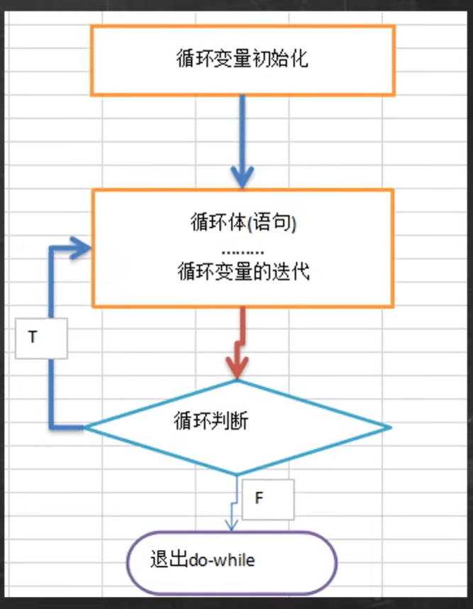

# 韩顺平 JAVA 学习笔记

写在前面：
本笔记为应某项目需求，短期速成java时进行的记录，因本人有一定编程基础，故跳过了一些基础的知识点，望读者海涵。

## PRE
### 课程目录
1. Java基础
    - 建立编程思想
    - 提升编程能力
    - 分析需求，代码实现能力
2. Java高级
3. JavaWeb
4. 主流框架和项目管理
5. 分布式、微服务、并行架构
6. DevOps（开发运维一体化）、自动化部分管理项目、解决CI/CD
7. 大数据技术
8. 项目
9. 大厂高频面试题
10. 底层源码/内核研究
11. 编程基础扩展

### 就业方向
1. JavaEE软件工程师
    - 电商、团购、众筹、SNS（社交网络）、教育、金融、搜索
2. 大数据软件工程师（Java基础，JavaSE）
    - 大数据应用工程师
    - 大数据算法工程师
    - 大数据分析和挖掘
3. Android软件工程师

### 开发场景
1. SSM
    - Spring（轻量级容器框架）
    - SpringMVC（分层的Web开发框架）
    - MyBatis（持久化框架）
2. Android核心代码
3. 大数据-Hadoop

### 应用领域
1. 企业级应用
    - 复杂的大企业的软件系统
    - 各种类型的网站
    - 金融、电信、交通、电子商务等领域应用

2. Android平台应用
    安卓应用程序使用Java编写

3. 移动领域应用
    消费和嵌入式领域，在各种小型设备上的应用：
    - 机顶盒
    - 车载大屏影音娱乐设备
    - 汽车通信设备
    - 扫码的POS机

## 概述

### 章节目录
1. Java历史
2. Java特点
3. Java运行机制及运行过程
4. Java开发环境搭建
5. Dos基本指令

### 第一个程序
1. 什么是程序？
    程序是有序指令的集合
2. 程序如何输出“1+1”？    
    ```java
    public class Test{
        public static void main(String[] args){
                int res = 1+1;
                System.out.println("1+1=" + res);
        }
    }
    ```
3. 如何执行程序？
    打开cmd，在当前目录下执行以下指令：
    ```bash
    javac Test.java
    java Test
    ```
### Java历史

[点击此处](https://www.oracle.com/java/technologies/java-se-support-roadmap.html)查看Java历史版本详情。
课程内容主要围绕Java 8和Java 11，因为这两个版本是长期支持（LTS）的版本。具体内容如下图（图片获取时间：2025-4-10）：


### Java特点

1. Java技术体系平台
    

2. 特点
    - Java语言是面向对象（oop）的。
    - Java语言是健壮的。Java的强类型机制、异常处理、垃圾的自动收集是Java程序健壮性的重要保证。
    - Java语言是跨平台性的。（一个编译好的`*.class`文件可以在多个不同系统下运行）
    - Java语言是**解释性**的。（不能直接由机器执行，而是经由解释器执行）

### 常见Java开发工具
1. editplus 、 notepad++
2. Sublime Text
    - 下载：[https://www.sublimetext.com/3](https://www.sublimetext.com/3)
    - 中文设置：https://www.bilibili.com/video/BV1HKHzeZEZA
        - 按组合键`Ctrl+Shift+P`，输入：`install`，选择`install package control`，等待弹窗。
        - 按组合键`Ctrl+Shift+P`，输入：`install`，等待弹窗。
        - 输入`Chinese`，然后确定，等待安装完成。
3. Eclipse
4. IntelliJ IDEA

### Java运行机制及运行过程
1. JAVA程序如何运行？
    - Java的`*.class`文件是运行在Java虚拟机（JVM,Java Virtual Machine）中的
    - JVM包含在jdk中。

2. Java代码从书写到运行的过程
    - 编译：使用`javac`命令将源代码编译成字节码文件（`.class`）
    - 运行：使用`java`命令运行字节码文件（`.class`）

3. 什么是jdk、jre？
    - jdk：Java Development Kit，Java开发工具包，包含jre和Java开发工具（java命令，javac命令，javadoc命令，javap命令等）。
    - jre：Java Runtime Environment，Java运行环境，包含JVM和Java核心类库。
    - 安装了jdk就不需要jre，如果需要运行一个开发好的Java程序，只需要安装jre即可。
    - 即：jdk用于开发程序（也可运行），jre只用于运行程序。


### 开发环境搭建
1. 【待完善】下载安装jdk
    此处未完成，仅列大纲，供后续更新参考。
    - 下载不同版本的JDK：
        - 官方：[下载链接](https://www.oracle.com/java/technologies/downloads/)
        - 百度网盘：[下载链接](https://pan.baidu.com/s/1nCIs0X072X0jma9H-0R0KQ?pwd=p2wd)
    - 在不同系统、权限下安装jdk
    - 对于windows，32位系统下载x86版本，64位系统下载x64版本。
2. **下面以安装路径为`D:\programs\jdk`为例。**
3. 配置环境变量（Windows系统）
    - `此电脑-属性-高级系统设置-环境变量`
    - 添加变量`JAVA_HOME`，内容为`D:\programs\jdk`，即jdk安装目录。
    - 编辑`path`环境变量，增加`%JAVA_HOME%\bin`
    - 打开命令行，输入`java`或`javac`，若没提示`找不到变量`，则配置成功。

### 学习方法
如何快速学习？如何寻找学习动力？

1. 为什么学习？（需求）
    - 工作需要
    - 跳槽、对方要求
    - 兴趣、技术控

2. 能否使用传统/现有技术解决？（解决需求）
    - 能解决，但是不完美
    - 解决不了

3. 引出我们学习的新技术和知识点
    明确要学的知识点。

4. 先学习新技术或知识点的基本原理和基本语法。（不要考虑细节）

5. 快速入门案例（基本程序，如CRUD）
    有了“增删改查”的基本能力，就可以上手了。

6. 开始研究技术的注意事项、使用细节、使用规范、如何规范。
    优化是永无止境的，细节要最后扣。


### 快速入门：Hello World!

1. 课程中提到的所有程序，都将遵循以下步骤：
    - 提出需求
    - 列出开发步骤
    - 阐明原理
    - 讲明细节


1. 需求
    - 写一个`Hello.java`程序，输出`Hello,World!`
2. 代码
    ```java
    // Java 快速入门，演示Java的开发步骤

    //对代码的相关说明
    //1. public class Hello 表示："Hello"是一个public(公有)类。
    //2. public static void main(String[] args)表示程序主方法，是程序的入口。
    //3. Java程序需要分号";"表示语句结束。
    public class Hello{

        // 编写主方法

        public static void main(String[] args){
            System.out.println("Hello,World!");
        }
    }
    ```
2. 命令行
    ```bash
    javac Hello.java
    java Hello
    ```
3. 错误解析
    - 如果使用的是之前提到的Sublime Text，可能无法编译（如下），这可能是因为控制台中文编码与文本编辑器的编码不一致导致的。
        ```bash
        hello.java:1: 错误: 编码GBK的不可映射字符
        // Java 蹇?熷叆闂紝婕旂ずJava鐨勫紑鍙戞楠?
        ```
        解决方法：
        用管理员身份打开命令行，右键顶端进入属性，确认编码格式（上述错误信息中显示为GBK）。
        然后将文本编辑器保存的编码设置为与命令行编码一致。

        解决方法2：强制指定编码格式。
        ```bash
        javac -encoding utf-8 Hello.java
        ```

    - 文件名不一致
        ```bash
        E:\code\HSPJava>javac -encoding UTF-8 hello.java
        hello.java:7: 错误: 类Hello是公共的, 应在名为 Hello.java 的文件中声明
        public class Hello{
            ^
        1 个错误
        ```
        这是因为Java严格区分文件名、类名的大小写，如果文件名与类名不一致，编译器会报错。
        这里类名为`Hello`，但文件名为`hello.java`，所以编译器报错。

    - 错误的运行方式
        ```bash
        E:\code\HSPJava>java Hello.class
        错误: 找不到或无法加载主类 Hello.class
        ```
        这里运行时，不需要带`.class`后缀，直接`java Hello`即可。
        ```bash
        E:\code\HSPJava>java Hello
        Hello,World!
        ```

4. 其他注意事项
    - Java源文件以`.java`为扩展名，源文件的基本组成部分是类`class`。
    - Java程序的执行入口是main()方法，有固定的书写格式，不得更改。
        ```java
        public static void main(String[] args){...}
        ```
    - 一个源文件中只能有一个public类，且类名必须与源文件名一致。但其他类名不限。
        ```java
        public class Hello{...}

        class Dog{...}

        class Cat{...}
        ```
        此时编译，会生成三个文件，`Hello.class`，`Dog.class`，`Cat.class`。
        即：编译后，每一个类对应一个`.class`文件
    - 如果源文件包含一个`public`类，则源文件名必须与此类相同。
    - 可以将main方法卸载非public类中，然后指定运行非public类，这样入口方法就是非public类的main方法。这样的类不可以跨包访问。


### 转义字符
1. Java常用转义字符
    - `\t`：制表位
    - `\n`：换行符
    - `\\`：`\`符号
    - `\"`：`"`符号
    - `\'`：`'`符号
    - `\r`：回车不换行

2. 演示代码
    ```java
    public class ChangeChar{

        public static void main(String[] args){
            //制表符
            System.out.println("北京\t天津\t上海");
            //换行转义符
            System.out.println("jack\nsmith\nmary");
            //斜杠转义符
            System.out.println("E:\\code\\HSPJava");
            //引号转义符
            System.out.println("\"早上好\"");
            System.out.println("\'早上好\'");
            // '\r'
            System.out.println("早上好中午好\r晚上好");
        }
    }
    ```
3. 练习代码
    ```java
    public class ChangeCharExer01{

        public static void main(String[] args){
            System.out.println("书名\t价格\t作者\t销量");
            System.out.println("三国\t罗贯中\t120\t1000");
        }
    }
    ```
    ```bash
    E:\code\HSPJava>java ChangeCharExer01
    书名    价格    作者    销量
    三国    罗贯中  120     1000
    ```

### 注释
1. 特点
    - 注释是注解说明解释程序的文字。**注释是程序的重要组成部分。**
    - 注释部分不会被JVM解释执行
2. 对比
    - 坏的代码
        ```java
        int a = 10;
        int b = 20;
        int c = a + b;
        System.out.println(c);
        ```
    - 好的代码
        ```java
        // 下面的代码是一个简单的加法程序

        // 定义变量
        int a = 10;
        int b = 20;

        // 计算
        int c = a + b;

        // 输出结果
        System.out.println(c);
        ```
3. 分类
    - 单行注释
    - 多行注释
    - 文档注释

4. 单行注释
    使用`//`作为一行开头的注释。
5. 多行注释
    ```java
    /*  早上好
        中午好
        晚上好 */
    ```
    注意：多行注释不能嵌套。下列方式是不被允许的。
    ```java
    /*  早上好
    /*  中午好 */
        晚上好 */
    ```
6. 文档注释
    - 注释内容可以被JDK提供的javadoc解析，生成以网页文件形式体现的该程序的说明文档。
    - 文档注释以`/**`为程序开头，以`*/`为程序结尾。其中每行以`*`开头。
    ```java
    /**
     * @author: lcq
     * @version: 1.0
    */
    ```
    - 使用如下命令生成文档注释：
        ```bash
        javadoc -d <dir> -xx -yy <java file>
        ```
        - `-d`：指定输出目录
        - `xx`和`yy`：表示需要生成的javadoc标签。
    
    - 【长期补充】可用的javadoc标签：
        - `@author`：作者
        - `@version`：版本
        - `@param`：参数
        - `@return`：返回值
        - `@throws`：异常
        - `@see`：相关类
### Java代码规范
1. 类、方法的注释，要以Javadoc的方式写。
2. 非Javadoc的注释（单行/多行注释），往往是给代码维护者看的，着重告诉读者为什么这么写，如何修改，注意什么问题。
3. 运算符和`=`通常习惯在两边空一格。`c = a + b;`
4. 源文件使用UTF-8编码。
5. 行宽度不要超过80个字符。
6. 对于大括号，分为行尾风格和次行风格两种。推荐行尾风格。

### 【了解】Dos
运行中使用cmd打开的界面就是Dos系统（Disk Operating System，磁盘操作系统）

#### 常用指令


1. **`dir`**  
   **列出目录内容**，支持多种参数筛选和格式化输出  
   ```bash
   dir E:\            # 列出E盘根目录所有文件和文件夹
   dir *.txt /s /p   # 递归查找所有.txt文件并分页显示
   dir /ah           # 显示当前目录下的隐藏文件
   ```  
   **参数说明**：  
   • `/s`：递归显示子目录内容  
   • `/p`：分页显示（按任意键继续）  
   • `/w`：紧凑模式（每行显示5项）  
   • `/a`：显示包括隐藏文件的所有文件（如`/ah`仅显示隐藏文件）  
   **特性**：支持通配符（如`dir *.exe`）和路径重定向（如`dir > filelist.txt`）

2. **`cd`**  
   **切换工作目录**，支持跨驱动器操作  
   ```bash
   cd D:\Project     # 进入D盘Project目录
   cd ..             # 返回上级目录
   cd /d E:\Backup   # 切换到E盘Backup目录（跨驱动器必须加/d）
   ```  
   **特殊用法**：  
   • `cd \`：返回当前驱动器的根目录  
   • `cd ..\..`：向上返回两级目录  
   • `cd`（不带参数）：显示当前完整路径  

3. **`tree`**  
   **显示目录树结构**，支持文件列表导出  
   ```bash
   tree D:\          # 显示D盘目录树结构
   tree /F > tree.txt # 将目录及文件结构导出为文本文件
   tree /A           # 使用ASCII字符替代扩展字符（兼容性更好）
   ```  
   **参数说明**：  
   • `/F`：显示每个目录中的文件名  
   • `/A`：简化图形符号（适合纯文本环境）  
   **注意**：路径中若含空格需用引号包裹（如`tree "C:\Program Files"`）

4. **`cls`**  
   **清空屏幕内容**，仅保留命令行提示符  
   ```bash
   cls  # 执行后屏幕内容完全清除，不影响系统状态
   ```  
   **适用场景**：  
   • 连续操作后需整理界面  
   • 执行敏感操作前隐藏历史命令（但可通过↑键回溯）

5. **`exit`**  
   **退出命令行窗口或批处理脚本**  
   ```bash
   exit        # 关闭当前CMD窗口
   exit /b     # 退出批处理脚本但不关闭窗口
   ```  
   **扩展用途**：  
   • 在脚本中配合错误码（如`exit 1`表示异常终止）  
   • 终止远程桌面会话（需结合其他命令）

可通过 `命令 /?`（如 `dir /?`）查看详细参数说明，或在CMD中输入 `help` 获取完整命令列表。

6. `md`（Make Directory）  
    **创建新目录**，相当于Linux的`mkdir`  
    ```bash
    md project       # 在当前目录创建project文件夹
    md D:\backup\2025  # 在D盘backup目录下创建2025子目录
    ```  
    

7. `rd`（Remove Directory）  
    **删除空目录**，相当于Linux的`rmdir`  
    ```bash
    rd temp          # 删除当前目录下的空temp文件夹
    rd /s /q D:\old  # 强制删除D盘old目录及其所有子文件（/s递归删除，/q静默模式）
    ```  
    **注意**：普通rd只能删除空目录，非空目录需配合/s参数

8. `del`（Delete）  
    **删除文件**，相当于Linux的`rm`  
    ```bash
    del test.txt     # 删除当前目录下的test.txt
    del *.tmp /s /q  # 递归删除所有子目录中的.tmp文件（/s包含子目录，/q不提示确认）
    ```  
    **特性**：  
    ◦ 支持通配符（如`del *.bak`）  
    ◦ /F参数强制删除只读文件  
    ◦ 无法直接删除目录（需配合rd）

9. `copy`  
    **文件复制**，相当于Linux的`cp`  
    ```bash
    copy a.txt b.txt        # 复制a.txt为b.txt
    copy *.log D:\logs      # 复制所有.log文件到D盘logs目录
    copy 1.txt+2.txt sum.txt # 合并1.txt和2.txt为sum.txt
    ```  
    **高级用法**：  
    ◦ 支持文件合并（`copy file1+file2 merged`）  
    ◦ /Y参数自动覆盖目标文件

10. `echo`  
    **显示信息或创建文件**  
    ```bash
    echo Hello World        # 输出"Hello World"
    echo. > newfile.txt     # 创建空文件（.代表空内容）
    echo %PATH%            # 显示环境变量PATH的值
    ```  
    **注意**：`echo off`常用于批处理脚本开头隐藏命令回显

11. `type`  
    **显示文本文件内容**，相当于Linux的`cat`  
    ```bash
    type config.ini        # 显示当前目录config.ini内容
    type D:\readme.txt | more  # 分页显示长文本（配合more命令）
    ```  
    **限制**：  
    ◦ 不支持通配符（如`type *.txt`无效）  
    ◦ 非文本文件（如.exe）会显示乱码

12. `move`  
    **移动文件/重命名**，相当于Linux的`mv`  
    ```bash
    move report.doc D:\docs       # 移动文件到指定目录
    move oldname.txt newname.txt  # 重命名文件
    move /Y *.jpg \photos        # 移动所有.jpg到photos目录（/Y覆盖不提示）
    ```  
    **特性**：  
    ◦ 可同时完成移动和重命名操作  
    ◦ 支持通配符批量操作

### 章节作业
1. 编写Hello,world程序
2. 将个人基本信息（姓名、性别、籍贯、住址）打印到控制台，每条信息占一行
3. JDK、JVM、JRE的关系
4. 环境变量path的配置机器作用
5. Java的编写步骤
6. Java编写的7个规范
7. 初学者学Java的易犯错误

## 变量
### 章节目录
1. 变量介绍
2. `+`符号的使用
3. 数据类型
4. 编码
5. 数据类型转换

### 变量介绍
1. 变量是程序的基本组成单位。
2. 变量有三要素：**类型、名称、值**
    ```java
    class Test{
        public static void main(String[] args){
            int a = 1 ;             // 变量a的类型是int，名称是a，值是1
            int b = 3 ;             // 变量b的类型是int，名称是b，值是3
            b = 80;                 // 变量b的值被修改为80

            System.out.println(a);  // 输出变量a的值
            System.out.println(b);  // 输出变量b的值
        }
    }
    ```

3. 变量的使用步骤
    - 声明变量：`int a`
    - 赋值：`a = 10`
    - 使用

4. 变量使用注意事项
    - 变量表示内存中的一个存储区域，不同的变量，类型不同，占用的空间也不同。
        比如：int占4个字节，double占8个字节。（后面会详细讲）
    - 变量需要有名称和类型。
    - 变量使用前必须先声明，后使用。
    - 变量的值可以在**同类型下**变换。
    - 变量在同一个作用域中不能重名。
    - 变量 = 类型 + 变量名 + 值。

### `+`符号的使用
1. 实例1
    ```java 
    System.out.println(100 + 98);// 198
    System.out.println("100" + 98);// 10098
    System.out.println(100 + 3 + "hello");// 103hello
    System.out.println("hello" + 100 + 3);// hello1003
    ```
    - 运算顺序从左至右。
    - 当左右两边均为数值时，做加法运算。
    - 当左右两边有一边为字符串时，做拼接运算。

### 数据类型
1. 每一种数据都定义了明确的数据类型，在内存中分配了不同大小的内存空间（字节）。
    
    - 图中内容务必记住。
    - Java数据类型分为两大类：基本数据类型和引用类型
    - 基本数据类型有8种：`byte`、`short`、`int`、`long`、`float`、`double`、`char`、`boolean`。
    - 引用数据类型有3种：类`class`、接口`interface`、数组`[]`。
    - **字符串不是基本数据类型。**

#### 整数类型
1. 整形的类型
    |类型|占用存储空间|范围|
    |:---:|:---:|:---:|
    |`byte`|1字节|-128~127|
    |`short`|2字节|-32768~32767<br>$-2^{15} \sim 2^{15}-1$|
    |`int`|4字节|-2147483648~2147483647<br>$-2^{31} \sim 2^{31}-1$|
    |`long`|8字节|-9223372036854775808~9223372036854775807<br>$-2^{63} \sim 2^{63}-1$|

2. 特性
    - Java各整数类型有固定的范围和字段长度，不受具体OS（操作系统）的影响，以保证Java程序的可移植性。
    - Java的整形**常量**默认为`int`型，声明`long`型需要在常量后加上`L`或`l`。
        ```java
        int i = 100;    // 默认int类型
        long l = 100L;  // long类型
        ```
    - Java程序中变量常声明为`int`型，只有不足以表示大数时，才使用`long`型。
    - `bit`是计算机中最小的存储单位，1byte = 8bit。

#### 浮点类型
1. 分类
    |类型|占用存储空间|范围|
    |:---:|:---:|:---:|
    |`float`|4字节|$-3.403\times10^{38} \sim 3.403\times10^{38}$|
    |`double`|8字节|$-1.798\times10^{308} \sim 1.798\times10^{308}$|

2. 特性
    - 浮点数在机器中存放的形式：符号位 + 指数位 + 尾数位。
    - 尾数部分可能丢失，造成精度损失。所以小数都是近似值。
    - Java中的浮点型常量默认为`double`类型，声明`float`型常量，须在常量末尾加上`f`或`F`。
        ```java
        float f = 1.0f;
        double d = 1.0;
        ```
    - 去
        ```java
        double num1 = 2.123456789123 // 2.123456789123
        double num2 = 2.123456789123f // 2.1234567
        ```

3. 浮点数的两种表示形式
    - 十进制：`5.12`、`512.0f`、`.512`（可以把小数点前的`0`取消）
    - 科学计数法：`5.12E2`（$5.12 \times 10^2$）、 `512E-2`（$512 \times 10^{-2}$）

4. 一个陷阱
    ```java
    double num1 = 2.7;
    double num2 = 8.1 / 3; // 2.6666666666666667

    // 通过Java API判断两者是否相等
    System.out.println(Math.abs(num1 - num2));
    ```
    - 计算小数时，可以先将小数乘以10，运算完成后再除以10。
    - 浮点数之间不能进行相等判断，而是改为将两者作差，看两者误差是否位于一定精度内。
        判断的误差按照实际需求即可。
    - 在线API网站：Matools.com

4. 【题外话】为什么0.1+0.2不等于0.3？
    首先，要解决一个问题：**什么是浮点数？**
    前面已经讲过，一个浮点数由三部分组成。其中的尾数位，`float`类型有23位，`double`类型有52位。
    $$
    2^{-23} = 1.1920929 \times 10^{-7} \\
    2^{-52} = 2.2204460492503131 \times 10^{-16}
    $$
    这就是为什么单精度提供约7位精度，双精度提供约16位精度。

    这里给出单精度的计算，双精度同理。（不一定正确，仅在此处进行一下记录）
    $$
    {(0.1)}_{10} = (0.00011001100110011001101)_2 \\
    {(0.2)}_{10} = (0.00110011001100110011010)_2 \\
    {(0.1 + 0.2)}_{10} = (0.01001100110011001100110)_2 = 0.3000000715… \\
    $$

#### 字符类型
1. 基本介绍
    - 字符类型可以表示单个字符。
    - 多个字符用字符串`String`
    - 字符型变量可以存放：中英文字符、转义字符、数字。
        ```java
        char ch = 'a';
        char ch1 = '中';
        char ch2 = '\\';
        char ch3 = 97;

        System.out.println(ch);     //a
        System.out.println(ch1);    //中
        System.out.println(ch2);    //'\'
        System.out.println(ch3);    //a     数字会由编码转换
        ```

2. 注意事项
    - 字符常量用单引号括起来。
    - 字符常量可以是转义字符。
    - 字符常来那个的本质是一个整数，输出的是Unicode码对应的字符。
    - `char`类型可以进行运算，因为其本质上是一个整数。

#### 布尔类型
1. 基本介绍
    - `boolean`类型只有两种值：`True`和`False`。
    - `boolean`类型占1字节。
    - `boolean`类型适用于逻辑运算，一般用于程序流程控制。
        `if`、`while`、`do-while`、`for`等。
    - **Java不能用0或非0表示布尔值。**

### 基本数据类型转换

#### 自动类型转换

1. 基本介绍
    Java程序在进行赋值或运算时，精度小的类型会自动转换为精度大的类型。
    - 数据类型按精度大小排序：（从左至右自动转换）
        - `char`、`int`、`long`、`float`、`double`
        - `byte`、`short`、`int`、`long`、`float`、`double`
2. 特性
    - 有多种类型数据混合运算时，系统首先将所有数据转换成容量最大的那种数据类型。
    - 将精度大的数据赋值给精度小的类型时，会出现精度损失，会报错。反之则自动转换类型。
    - （`byte`，`short`）和`char`之间不能进行自动类型转换。
        但他们之间可以进行运算，运算时先将类型全部转换为`int`。
    - `boolean`类型不参与类型转换。

#### 强制类型转换

1. 基本介绍
    强制类型转换可以将精度大的数据类型转换成精度小的数据类型，**但这个过程可能造成精度损失**。
    - 用强制转换符`()`进行强制转换。
2. 举例
    ```java
    int i = (int)1.9;
    System.out.println(i); // 1
    
    int n = (byte)2000;
    System.out.println(n); // -48
    ```
    为什么会发生这种情况？
    $$
    (2000)_{10}=(11111010000)_2 \\
    (11011111)_{补码} = (10110000)_{原码} = (-48)_{10}
    $$
3. 使用技巧
    - 强制转换符号只对最近的操作数生效，可以通过增加小括号提升优先级。
        ```java
        int n1 = (int)10*3.5+6*1.5;     //仅对10生效，编译时会报错。
        int n2 = (int)(10*3.5+6*1.5);   //对后面整个括号的运算结果生效。
        ```
    - **`char`类型可以保存`int`类型常量，但不能保存`int`变量，需要强制转换。**
        ```java
        char c1 = 100;
        int n1 = 100;

        char c2 = n1;       //报错，两端类型不匹配，不能进行赋值操作。
        char c3 = (char)n1; //正常编译，两端类型经过强制转换后相同。
        ```
#### 基本数据类型与字符串转换。
1. 将基本数据类型转换成字符串。
    采用原有数据加一个空字符串的方法
    ```java
    int n1 = 100;
    float f1 = 1.1F;
    double d1 = 4.5;
    boolean b1 = true;
    
    // 字符串在+号任意一边，运算结果为字符串。
    String s1 = n1 + "";
    String s2 = f1 + "";
    String s3 = d1 + "";
    String s4 = b1 + "";
    System.out.println(s1 + " " + s2 + " " + s3 + " " + s4)
    ```

2. 将字符串转换为基本数据类型。
    通过基本类型的包装类调用`parseXX`方法。
    ```java
    String s5 = "123";
    
    int num1 = Integer.parseInt(s5);            //123
    double num2 = Double.parseDouble(s5);       //123.0
    float num3 = Float.parseFloat(s5);          //123.0
    long num4 = Long.parseLong(s5);             //123
    byte num5 = Byte.parseByte(s5);             //123
    boolean b = Boolean.parseBoolean("true");   //true
    short num6 = Short.parseShort(s5);          //123
    ```

3. 取字符串中的单个字符
    ```java
    String s5 = "123"
    System.out.println(s5.charAt(0));           //1
    ```

4. 注意事项
    - 在将`String`类型转换成基本数据类型时，要确保`String`类型能够转成有效的数据。
        比如`"hello"`无论如何都不可能转换成一个整数。
    - 如果格式不正确，就会抛出异常，**抛出异常，程序就会终止**。

## 运算符
### 章节目录
1. 运算符介绍
2. 算术运算符
3. 关系运算符（比较运算符）
4. 逻辑运算符
4. 位运算符
5. 赋值运算符
6. 三元运算符
7. 运算符优先级

### 算术运算符
1. 介绍
    - 对数值类型的变量进行运算。
    - 
2. 常用的算术运算符
    

#### 易错点
1. `%`
    在Java中，`%`运算遵循以下公式：
    `a % b = a - (a / b) * b`
    ```java 
    System.out.println(10 % 3);     // 1
    System.out.println(-10 % 3);    // -1
    System.out.println(10 % -3);    // 1
    System.out.println(-10 % -3);   // -1
    ```
    从上面的输出结果可以看出，取模运算的符号仅与右侧操作数正负有关。

2. 面试题1
    下列两段代码的输出结果。
    ```java
    int i = 1;
    i = i++;
    System.out.println(i);  // 1
    ```
    ```java
    int i = 1;
    i = ++i;
    System.out.println(i);  // 2
    ```
    造成这个现象的原因，可以这样理解：
    在对变量进行赋值时，执行了两个步骤：
    - 将变量值赋给一个临时变量`temp = i`
    - 将`temp`的值赋给变量`i`
    在第一段代码中，`i++`先将`i`的值赋给`temp`，然后再将`temp`的值赋给`i`，所以`i`的值还是`1`。
    在第二段代码中，`++i`先将`i`的值加1，然后再将`i`的值赋给`temp`，所以`i`的值是`2`。

3. 华氏度计算

### 关系运算符
1. 常用的关系运算符
    

### 逻辑运算符
1. 常用的逻辑运算符
    
2. 说明
    分为两组：
    - 短路与`&&`、短路或`||`、取反`!`
    - 与`&`、或`|`、异或`^`。
3. 逻辑与和短路与的区别
    - 短路运算：当左边为`false`时，右边不再运算。
    - 逻辑运算：当左边为`false`时，右边继续运算。
    ```java
    int a = 10;
    int b = 20;
    if (a < 0 && b++ > 0) {
        System.out.println("aha");
    }
    System.out.println(b);// 20
    if (a < 0 & b++ > 0) {
        System.out.println("aha2");
    }
    System.out.println(b);// 21
    ```
    - 短路或运算：当左边为`true`时，右边不再运算。
    - **在开发中，为提升效率，一般使用短路运算。**

### 赋值运算符
1. 简介
    - 基本赋值运算符：`=`

    - 复合赋值运算符：`+=`,`-=`,`*=`,`/=`,`%=`

2. 特点
    - 赋值运算符的运算顺序为从右向左。
    - 赋值运算符左边只能是变量，右边可以是变量、常量、表达式。
    - **复合运算符进行计算时会自带强制类型转换。**

### 三元运算符
1. 介绍
    - `条件表达式？表达式1:表达式2`
    - 如果条件表达式为`true`，则返回表达式1，`false`则返回表达式2。
2. 使用细节
    - 表达式1和表达式2要为可以赋值给接收变量的类型（或可以自动转换/进行强制类型转换）。
    - 三元运算符可以转为`if-else`语句。

### 运算符优先级
1. 运算符优先级排序（从上至下优先级逐渐降低）
    
    - 只有单目运算符和赋值运算符从右向左运算
    - 括号优先级最高，赋值运算优先级最低。
    - 可以这样记：（不推荐硬记，用多了就会了）
        括号>单目运算符>算术运算符>位移运算符>比较运算符>逻辑运算符>三元运算符>赋值运算符

### 进制
1. 介绍
    - 二进制（Binary）：以`0B`或`0b`开头表示。用01表示。
    - 十进制（Decimal）
    - 八进制（Octal）：以`0`开头表示。用0-7表示。
    - 十六进制（Hexadecimal）：以`0X`或`0x`开头表示。用0-9、A-F表示。
2. 代码
    ```java
    //n1 二进制
    int n1 = 0b1010;
    //n2 10 进制
    int n2 = 1010;
    //n3 8 进制
    第 81页
    韩顺平循序渐进学 Java 零基础
    int n3 = 01010;
    //n4 16 进制
    int n4 = 0X10101;
    System.out.println("n1=" + n1); //输出结果：n1=10
    System.out.println("n2=" + n2); //输出结果：n2=1010
    System.out.println("n3=" + n3); //输出结果：n3=520
    System.out.println("n4=" + n4); //输出结果：n4=65793
    System.out.println(0x23A);      //输出结果：570
    ```
3. 进制转换（分四组）
    - 第一组：二/八/十六进制转十进制
    - 第二组：十进制转二/八/十六进制
    - 第三组：二进制转八/十六进制
    - 第四组：八/十六进制转二进制
### 位运算
1. 符号
    - `~`：按位取反
    - `&`：按位与
    - `|`：按位或
    - `^`：按位异或
    - `>>`：算术右移
    - `<<`：算术左移
    - `>>>`：逻辑右移
2. 特性
    - **所有的运算都是对补码进行运算。**
    - 算术右移`>>`：低位溢出，符号位不变，用符号位补高位。
    - 算术左移`<<`：符号位不变，低位补0。
    - 逻辑右移`>>>`：又称无符号右移，低位溢出，高位补0。
    - **没有`<<<`符号。**

3. 简单计算与推导
    - `2&3`
        $$
        \begin{aligned}
        (2)_{10} &= (\texttt{00000000}\ \texttt{00000000}\ \texttt{00000000}\ \texttt{00000010})_{\text{原码}} \\
        &= (\texttt{00000000}\ \texttt{00000000}\ \texttt{00000000}\ \texttt{00000010})_{\text{补码}} \\
        (3)_{10} &= (\texttt{00000000}\ \texttt{00000000}\ \texttt{00000000}\ \texttt{00000011})_{\text{原码}} \\
        &= (\texttt{00000000}\ \texttt{00000000}\ \texttt{00000000}\ \texttt{00000011})_{\text{补码}} \\
        (2)_{10} \mathbin{\&} (3)_{10} &= (\texttt{00000000}\; \texttt{00000000}\; \texttt{00000000}\; \texttt{00000010}) \\ &\mathbin{\&} (\texttt{00000000}\; \texttt{00000000}\; \texttt{00000000}\; \texttt{00000011}) \\
        &= (\texttt{00000000}\ \texttt{00000000}\ \texttt{00000000}\ \texttt{00000010}) = (2)_{10}
        \end{aligned}
        $$
2. 一段代码（位运算）
    ```java
    System.out.println(2&3); // 输出 2
    System.out.println(~-2); // 输出 1
    System.out.println(~2);  // 输出 -3
    System.out.println(2|3); // 输出 3
    System.out.println(2^3); // 输出 1
    ```
2. 一段代码（移位运算）
    ```java
    int a=1>>2; // 1 向右位移 2 位
    int b=-1>>2;//算术右移
    int c=1<<2;//算术左移
    int d=-1<<2;//
    int e=3>>>2;//无符号右移
    //a,b,c,d,e 结果是多少
    System.out.println("a="+a);
    System.out.println("b="+b);
    System.out.println("c="+c);
    System.out.println("d="+d);
    System.out.println("e="+e);
    ```
    - 对于左移和右移，实际上就是乘2和除2，除2为右移，乘2为左移。
6. 【待补充】本部分仍有完善空间，由于时间紧迫，暂时不做展开
    - 【循环】多次左右移的数字对比
    - 【补码】负数的移位运算
    - 逻辑右移的结果。
### 附加内容
#### 标识符的规则与规范
1. 概念
    - Java对各种变量、方法、类等命名时使用的字符序列称为标识符。
2. 规则（必须遵守）
    - 由26个英文字母的大小写、10个阿拉伯数字、下划线`_`、美元符号`$`组成。
    - 数字不可以作为标识符的开头。
    - 不可以使用**关键字**和**保留字**。
    - **Java严格区分标识符大小写，但对长度无限制。**
    - 标识符不得包含空格。

3. 规范（不强制推荐采取的命名方式）
    - 包名：多个单词组成时，所有字母小写。如：`com.han.sp`
    - 类名、接口名：多个单词组成时，每个单词首字母大写，其余小写。如：`HanSP`（大驼峰法）
    - 变量名、方法名：多个单词组成时，第一个单词首字母小写，其余大写。如：`hanSP`（小驼峰法）
    - 常量名：多个单词组成时，每个单词所有字母大写，其余小写。如：`HAN_SP`（全大写）

4. 关键字和保留字
    - 关键字：被Java语言赋予特殊含义，用作专门用途的字符串。
        
    - 保留字：现有Java版本尚未使用，但以后版本可能会作为关键字使用的字符串。
        `byValue`、`cast`、`future`、`generic`、`inner`、`operator`、`outer`、`rest`、`var`、`goto`、`const`等。

#### 键盘输入语句
1. 介绍
    - Java中，如果要接收用户输入的数据，就可以使用键盘输入语句。
    - 需要一个扫描器对象`Scanner`。
2. 使用步骤
    - 导入该类所在包`java.util.*`。
    - 创建一个`Scanner`对象。
3. 代码实例`Input.java`
    ```java
    import java.util.*;	//导入java.util下的Scanner类

    public class Input{

        public static void main(String[] args) {
                
            // 创建 Scanner 对象
            Scanner scanner = new Scanner(System.in);

            // 接收用户输入
            System.out.println("输入内容（姓名）：");
            String name = scanner.next();

            System.out.println("输入内容（年龄）：");
            int age = scanner.nextInt();

            System.out.println("输入内容（薪水）：");
            Double salary = scanner.nextDouble();

            System.out.println("基本信息如下");
            System.out.println("姓名\t年龄\t薪水");
            System.out.println(name + "\t" + age + "\t" + salary + "\t" );
            }	
    }
    /************************
    输入内容（姓名）：
    li
    输入内容（年龄）：
    24
    输入内容（薪水）：
    223333
    基本信息如下
    姓名    年龄    薪水
    li      24      223333.0
    ************************/
    ```

#### 【待补充】原码、反码、补码
我会，等我学完回来补
1. **Java没有无符号数**

## 程序控制结构
### 章节目录
1. 顺序控制
2. 分支控制（`if-else`、`switch`）
3. 循环控制（`for`、`while`、`do-while`）
4. `break`
5. `continue`
6. `return`

### 顺序控制
1. 介绍
    - 程序从上到下逐行执行，中间没有任何跳转和判断。
    - **顺序控制是程序默认的控制方式。**
    - Java定义变量时采用前向引用的方式，即先声明后调用。
### 分支控制
#### 单分支（`if`）
1. 基本语法
    ```java
    if(条件表达式){
        执行代码块;
    }
    ```
    - 当条件表达式为`true`时，执行代码块。
    - 当条件表达式为`false`时，不执行代码块。
    - 如果执行代码只有一行，可以不加大括号。（不推荐）
2. 流程图
    
#### 双分支
1. 基本语法
    ```java
    if(条件表达式){
        执行代码块1;
    }
    else{
        执行代码块2;
    }
    ```
2. 流程图
    
#### 多分支
1. 基本语法
    ```java
    if(条件表达式1){
        执行代码块1;
    } 
    else if(条件表达式2){
        执行代码块2;
    }
    ...
    else {
        执行代码块n;
    }
    ```
2. 流程图
    

#### 嵌套分支
1. 基本语法
    ```java
    if(条件表达式1){
        if(){
            //if-else
        }else{
            //if-else
        }
    }
    ```
    - **为保证程序可读性，建议嵌套不要超过三层。**

#### `switch`分支结构
1. 基本语法
    ```java
    switch(表达式){
        case 常量值1:
            执行代码块1;break;
        case 常量值2:
            执行代码块2;break;
        ...
        case 常量值n:
            执行代码块n;break;
        default:
            执行代码块n+1;
            break;
    }
    ```
2. 流程图
    
4. 注意事项
    - 标的是的数据类型应与`case`后的常亮数据类型一致（或可以转换成对应的类型）。否则会报错。
    - `switch`的表达式的返回值必须是以下类型中的一种：
        `byte`、`short`、`int`、`char`、`num`、`String`
    - **`case`子句中的值只能是常量，不能是变量。**
    - `default`子句是可选的。
    - `switch`结构具有穿透的特点，会从符合条件的`case`处执行到最后，而`break`用于跳出代码块。

### 循环控制

#### for循环

1. 基本语法
    ```java
    for(循环变量初始化;循环条件;循环变量迭代){
        循环操作;
    }
    ```
2. 流程图：
    

3. 注意事项
    - 循环条件返回一个布尔值表达式。
    - 初始化和变量迭代可以写在别的地方，**但分号不能省略**。
    - 初始化变量可以有多条语句，用逗号隔开，**要求类型相同**。

#### while循环
1. 基本语法
    ```java
    while(条件表达式){
        循环体语句;
        变量迭代;
    }
    ```
2. 流程图
    

#### do-while循环
1. 基本语法
    ```java
    do{
        循环体语句;
        变量迭代;
    }while(条件表达式);
    ```
2. 流程图
    
 
#### 多重循环
1. 介绍
    - 将一个循环嵌套在另一个循环中，称为多重循环。
    - 建议一般使用2层循环，3层循环以上不建议使用。

### 其他控制语句
#### `break`
1. 流程图
    
2. 使用细节
    - `break`语句可以通过标签指明终止哪一层的语句块。
        ```java
        lable1:
        for(int i=0;i<10;i++){
            lable2:
            for(int j=0;j<10;j++){
                label3:
                for(int k=0;k<10;k++){
                    if(k==5){
                        break lable2;
                    }
                }
            }
        }
        ```
        建议在实际开发中尽量不使用标签，这会降低代码的可读性。

#### `continue`
1. 流程图
    

#### `return`
1. 介绍
    - 当`return`被用于一个方法时，其将结束当前方法并返回值。
    - 如果`return`被应用于主方法，将直接退出程序。

## 数组、排序、查找
### 章节目录
1. 数组
2. 排序
3. 查找
4. 多维数组

### 数组
1. 引例
    给n个母鸡称重
    ```java
    public class Array01{
        public static void main (String[] args){
            double[] hens = {1,2,3,4,56,73,5,23};       //定义一个double类型的数组
            double totalWeight = 0;                     //定义累加器
            //遍历数组
            for (int i = 0; i < hens.length; i++){                             // 通过数组的length方法获得数组长度
                System.out.println("第"+(i+1)+"个母鸡的重量为"+hens[i]+"kg");   // 可以通过下标访问数组中的元素
                totalWeight += hens[i];
            }
            System.out.println("平均值：" + (totalWeight/hens.length));
            System.out.println("总重：" + (totalWeight));
            
        }
    }
    ```
2. 数组的动态初始化
    - 用法1
        - 数组定义
            ```java
            int[] array01 = {}      // 第1种：将中括号写在数据类型后
            int array02[] = {}      // 第2种：将中括号写在数组名后
            int array03[] = new int[5]  // 定义一个长度为5的数组，存放5个int类型数据，初始值为0
            ```
            通用的定义格式：`数据类型 数组名[] = new 数据类型[大小]`
        - 数组的引用（使用）
            `array01[i]`：访问数组`array01`中的第`i+1`个数。
    -  用法2
        - 数组声明
            `数据类型 数组名[];`
            `数据类型[] 数组名;`
        - 创建数组
            `数组名 = new 数据类型[大小]`
        ```java
        int[] arrayint01;
        arrayint01 = new int[5];
        ```

3. 数组的静态初始化
    如果知道数组的大小，则可以使用静态初始化。
    -  语法
        `数据类型 数组名[] = {值1, 值2, 值3, ...};`

4. 注意事项
    - 数组是多个**相同类型**数据的组合。
    - 数组中的元素可以是任何数据类型，包括基本类型和引用类型，但不能混用
    - 数组创建后，如果没有赋值，则有默认值
        - `int`：`0`
        - `short`：`0`
        - `byte`：`0`
        - `long`：`0L`
        - `float`：`0.0f`
        - `double`：`0.0`
        - `char`：`\u0000`
        - `boolean`：`false`
        - `String`：`null`
    - 数组下标必须在指定范围使用。
    - **数组属于引用类型，数组型数据是对象`object`。**

5. 数组添加/扩容
    ```java
    int[] arr = {1, 2, 3};
    int[] arrNew = new int[arr.length + 1];
    for (int i = 0; i < arr.length; i++) {
        arrNew[i] = arr[i];
    }
    arrNew[arrNew.length - 1] = 4;
    arr = arrNew;
    ```

### 排序（基本，冒泡排序）
详细排序算法待高级篇讲解。
1. 介绍
    - 排序是将多个数据，依指定顺序进行排序的过程。
2. 分类
    - 内部排序
        指将需要处理的所有数据**加载到内部存储器中**，然后进行排序。
        包括：交换式排序、选择式排序、插入式排序。
    - 外部排序
        数据量过大，无法全部加载到内存中，需要**借助外部存储**进行排序。
        包括：合并排序、直接合并排序。
3. 冒泡排序
    - 通过对待排序序列从后向前依次比较相邻元素的值，若发生逆序，则交换。
    - 像水底的气泡向上冒。
    - 冒泡排序的每一轮排序一定能将剩余元素中的最大元素移到序列的末尾。
    
    ```java
    public class BubbleSort{
        public static void main (String[] args){

            int[] arr1 = {100,34,36,424,456,33,18};

            System.out.println("====初始数组====");
            for (int k = 0; k < arr1.length; k++){
                System.out.print(arr1[k] + "\t");
            }
            System.out.println("");

            for (int i = arr1.length - 1; i > 0; i--){
                int temp = 0;
                for (int j = 1; j < i + 1; j++){
                    if (arr1[j-1] > arr1[j]){           // 更改这里的">"为"<"，实现降序排序
                        temp = arr1[j-1];
                        arr1[j-1] = arr1[j];
                        arr1[j] = temp;
                        temp = 0;
                    }
                }
                System.out.println("====第"+(arr1.length - i)+"轮排序====");
                for (int k = 0; k < arr1.length; k++){
                    System.out.print(arr1[k] + "\t");
                }
                System.out.println("");
                }
        }
    }
    ```
### 查找
详细内容在数据结构与算法，这里只做简要说明。
1. 介绍
    - 常用的查找有两种：顺序查找和二分查找。
2. 顺序查找

### 二维数组
1. 定义
    ```java
    int[][] arr = new int[3][4];
    int arr2[][] = { {1,2,3,4},
                     {5,6,7,8},
                     {9,10,11,12} };
    ```
2. 动态初始化
    - `类型[][] 数组名 = new 类型[大小][大小]`
        ```java
        // 方法1
        int[][] arr = new int[3][4];
        
        // 方法2（分开）
        int[][] arr2;
        arr2 = new int[3][4];
        ```
    - 方法3：一种特殊的动态初始化
        每行的元素数量可以不一样（列数不确定）
        
        ```java
        int[][] arr = { {1}, 
                        {2, 2}, 
                        {3, 3, 3} };

        int[][] arr2 = new int[3][];// 不确定的位置不填值
        for (int i = 0; i < arr2.length; i++){
            arr2[i] = new int[i + 1];// 分配内存
            for (int j = 0; j < arr2[i].length; j++){
                arr2[i][j] = i + 1;     // 赋值
            }
        }
        ```
2. 静态初始化
    ```java
    int[][] arr = { {1, 2, 3},
                    {4, 5, 6}, 
                    {7, 8, 9}};

    int[][] arr2 = { {1}, 
                    {2, 2}, 
                    {3, 3, 3} };

    //一个错误的例子：
    int[][] arr2 = { 1,             // 哪怕只有一个数字，数组也需要括起来 
                    {2, 2}, 
                    {3, 3, 3} };    
    ```
3. 内存布局
    

### 附加内容
#### 【自编，待完善】关于new
在之前的例子中，我们发现，定义一个数组时，可以在声明的同时new，也可以先声明在之后的代码中new，这有什么区别呢？
看一下下面几个例子。
1. 数组初始化（一行完成）
    ```java
    int[] arr1 = new int[5];          // 动态初始化，元素默认值为0
    int[] arr2 = new int[]{1, 2, 3}; // 显式静态初始化
    int[] arr3 = {1, 2, 3};          // 隐式静态初始化（编译器自动补全为 new int[]）

    // 下面是两种错误的初始化
    // 对于显示静态初始化，[] 必须有且不能有值。
    // int[] arr4 = new int[5]{1, 2, 3, 4, 5}; 
    // int[] arr5 = new int{1, 2, 3, 4, 5};
    ```
2. 数组初始化（分开完成）
    ```java
    int[] arr;
    if (condition) {
        arr = new int[10]; // 根据条件动态分配大小
    } else {
        arr = new int[5];
    }
    ```
new起到的是一个分配空间的作用，声明仅是定义的过程，此时赋值会抛出**空指针异常**。

#### 赋值机制
1. 图解
    
2. 解释
    - 对于一个变量，初始化后存储在栈中。
    - 对于一个数组，初始化后地址存储在栈中，数组内容存储在堆中。
        因此，将数组`arr1`整体直接赋值给`arr2`，相当于将数组`arr1`的地址赋值给`arr2`，两个数组的地址相同，对`arr1[i]`进行修改，`arr2[i]`也会同步修改。
3. 数组拷贝
    显然，数组之间直接进行赋值是行不通的，因此我们需要另辟蹊径。
    ```java
    int[] arr1 = {1, 2, 3, 4, 5};
    int[] arr2 = new int[arr1.length];
    for (int i = 0; i < arr1.length; i++) {
        arr2[i] = arr1[i];
    }
    ```

## 面向对象编程基础
### 章节目录
1. 类和对象
2. 成员方法
3. 成员方法传参机制
4. overload
5. 可变参数
6. 作用域
7. 构造器
8. this

### 类和对象
1. 引例
    张老太养了两只猫猫:一只名字叫小白,今年 3 岁,白色。还有一只叫小花,今年 100 岁,花色。请编写一个程序，当用户输入小猫的名字时，就显示该猫的名字，年龄，颜色。如果用户输入的小猫名错误，则显示 张老太没有这只猫猫。
    用之前学过的知识，或许我们可以使用单独定义变量或数组解决，但这不利于变量的管理，现在引出类和对象的概念。
    - 一个对象由属性和行为构成，而类是一种数据类型，用于定义对象实例。
        举个例子，猫类`Cat`是一种自定义的数据类型，而具体的一只猫是一个对象。
    - 三种叫法
        - 创建一个对象
        - 实例化一个对象
        - 把类实例化

    一个面向对象编程（oop, Oobject-oriented programming）实例
    ```java
    public class Object01 {
        Cat cat1 = new Cat();
        cat1.name = "小白";
        cat1.age = 3;
        cat1.color = "白色";

        Cat cat2 = new Cat();
        cat2.name = "小花";
        cat2.age = 100;
        cat2.color = "花色";
    }
    class Cat {
        String name;    // 名字
        int age;        // 年龄
        String color;   // 颜色
    }
    ```
2. 类与对象的区别
    - 类是抽象的、概念的，代表**一类事物**，如：猫类、狗类、人类。即：类是数据类型。
    - 对象是具体的、实体的，代表**某一具体事物**，如：一只猫、一只狗、一个人类。即：对象是实例。
    - 类是对象的模板，对象是类的一个个体，对应一个实例。
3. 对象的内存分布
    
    - 基本数据类型存于堆，其他数据存于方法区。
4. 属性/成员变量
    - 成员变量=属性=字段
    - 属性是类的一个组成部分，一般是基本数据类型，也可以是引用类型（对象、数组）。
    - 属性的定义语法和变量相同
        `访问修饰符 属性类型 属性名;`
        访问修饰符：控制属性的访问范围。有`public`、`protected`、默认、`private`四种。
    - 属性的定义类型可以是任意类型（基本数据类型和引用类型）。
    - 属性如果不赋值，默认值与变量相同。

5. 创建对象
    ```java
    // 先声明再创建
    Cat cat1;
    cat1 = new Cat();

    // 直接创建
    Cat cat2 = new Cat();
    ```
6. 访问属性
    ```java
    cat1.name
    cat1.age
    cat1.color
    ```
7. 一个例子
    看一个练习题，并分析画出内存布局图，进行分析
    ```java
    Person person1 = new Person();
    person1.name = "小明";
    person1.age = 18;
    Person person2 = person1;
    System.out.println(person2.name);
    ```
    
8. 类和对象的内存分配机制
    - 栈：一般存放基本数据类型（局部变量）。
    - 堆：存放对象（自建类、数组等）。
    - 方法区：常量池（常量，如字符串）；类加载信息。
9. Java创建对象的流程简述
    - 加载类信息（属性和方法），仅在首次创建时加载。
    - 在堆中分配空间进行默认初始化。
    - 把地址赋值给变量。（`new`）
    - 进行指定初始化（`cat.age = 3;`）

### 成员方法
1. 基本介绍
    - 成员方法也称方法。
2. 快速入门
    创建一个名为`Method01.java`的类，并添加如下方法：
    - 添加 `speak` 成员方法,输出 `"我是一个好人"` 
    - 添加 `cal01` 成员方法,可以计算从 `1+..+1000` 的结果
    - 添加 `cal02` 成员方法,该方法可以接收一个数 `n`，计算 `1+..+n` 的结果
    - 添加 `getSum` 成员方法,可以计算两个数的和
    ```java
    public class Method01 {
        public static void main(String[] args) {
            Person person = new Person();
            person.speak();
            System.out.println(person.cal01());
            System.out.println(person.cal02(100));
            System.out.println(person.getSum(10, 20));
        }
    }
    class Person {
        String name;
        int age;

        public void speak() {
            System.out.println("我是一个好人");
        }
        
        public int cal01() {
            int sum = 0;
            for (int i = 1; i <= 1000; i++) {
                sum += i;
            }
            return sum;
        }

        public int cal02(int n) {
            int sum = 0;
            for (int i = 1; i <= n; i++) {
                sum += i;
            }
            return sum;
        }

        public int getSum(int a, int b) {
            return a + b;
        }
    }
    ```
3. 剖析方法
    `public void speak()`
    - `public`：访问修饰符，控制方法的访问范围。这里`public`表示公开。
    - `void`：返回值类型，`void`表示该方法没有返回值。
    - `speak`：方法名，自定义。
    - `()`：形参列表，方法可以接收参数，也可以不接收参数。
4. 图解
    

5. 成员方法定义语法
    ```java
    访问修饰符 返回值类型 方法名(参数（形参）列表) {
        语句;
        return 返回值;
    }
    ```
    - 访问修饰符：如果不写默认访问，[有四种: public, protected, 默认, private]。
    - 返回数据类型
        1) 一个方法最多有一个返回值 [思考，如何返回多个结果 返回数组 ]
        2) 返回类型可以为任意类型，包含基本类型或引用类型(数组，对象)
        3) 如果方法要求有返回数据类型，则方法体中最后的执行语句必须为 return 值; 而且要求返回值类型必须和 return 的
        值类型一致或兼容
        4) 如果方法是 void，则方法体中可以没有 return 语句，或者 只写 return（用于终止方法） ;
    - 方法名
        遵循驼峰命名法，最好见名知义，表达出该功能的意思即可, 比如 得到两个数的和 getSum, 开发中按照规范
    - 形参列表
        - 调用带参数的方法时，应对应参数列表传入相同类型或兼容类型的参数。如形参为`double`可传入`double`、`int`等
        - 方法定义时的参数称为形式参数，方法调用时传入的参数为实际参数，两者需要一一对应。

6. 方法调用
    - 同一个类中调用方法，直接调用即可。如：A类中有方法f1和f2。
        ```java
        class A{
            public void f1(){
                f2();       // 无需A.f2()
            }
            public void f2(){
                return;     // 空的return语句
            }
        }
        ```
    - 跨类调用需要通过对象名调用。
        ```java
        class B{
            public void f1(){
                A a = new A();      // 先实例化对象
                a.f1();             // 通过对象调用
            }
        }
        ```
    - 跨类方法调用与访问修饰符相关。

### 成员方法的传参机制
1. 基本数据类型的传参机制
    - 基本数据类型的值存储于栈中，传递的是值，其内容不受方法影响。
    ```java
    public class MethodParameter01 {
    //编写一个 main 方法
        public static void main(String[] args) {
            int a = 10;
            int b = 20;
            //创建 AA 对象 名字 obj
            AA obj = new AA();
            obj.swap(a, b); //调用 swap
            System.out.println("main 方法 a=" + a + " b=" + b);//a=10 b=20
        }
    }

    class AA {
        public void swap(int a,int b){
            System.out.println("\na 和 b 交换前的值\na=" + a + "\tb=" + b);//a=10 b=20
            //完成了 a 和 b 的交换
            int tmp = a;
            a = b;
            b = tmp;
            System.out.println("\na 和 b 交换后的值\na=" + a + "\tb=" + b);//a=20 b=10
        }
    }
    ```
    
2. 引用数据类型的传参机制
    - 引用类型的地址存于栈，具体值存于堆（数组）或方法区（自建类）
    - 当将引用类型传入方法中时，传递的是地址，而不是值，对相应对象的操作会影响原来的对象。
    ```java
    public class MethodParameter02 {
    //编写一个 main 方法
        public static void main(String[] args) {
            //测试
            B b = new B();
            // int[] arr = {1, 2, 3};
            // b.test100(arr);//调用方法
            // System.out.println(" main 的 arr 数组 ");
            // //遍历数组
            // for(int i = 0; i < arr.length; i++) {
            // System.out.print(arr[i] + "\t");
            // }
            // System.out.println();
            //测试
            Person p = new Person();
            p.name = "jack";
            p.age = 10;
            b.test200(p);
            //测试题, 如果 test200 执行的是 p = null ,下面的结果是 10
            //测试题, 如果 test200 执行的是 p = new Person();..., 下面输出的是 10
            System.out.println("main 的 p.age=" + p.age);//10000
        }
    }

    class Person {
        String name;
        int age;
    }
    class B {
        public void test200(Person p) {
            //p.age = 10000; //修改对象属性
            //思考
            p = new Person();
            p.name = "tom";
            p.age = 99;
            //思考
            //p = null;
        }
        //B 类中编写一个方法 test100，
        //可以接收一个数组，在方法中修改该数组，看看原来的数组是否变化
        public void test100(int[] arr) {
            arr[0] = 200;//修改元素
            //遍历数组
            System.out.println(" test100 的 arr 数组 ");
            for(int i = 0; i < arr.length; i++) {
            System.out.print(arr[i] + "\t");
            }
            System.out.println();
        }
    }
    ```
3. 扩展
    在上面的代码中，提到了两种特殊情况：
    - 当方法内部将传入的引用对象赋值为null时，传入参数会发生什么？
        答：什么都不会发生，仅会改变传入的地址值，对原地址指向的内容不会产生任何影响。
        
    - 当方法内部将传入的引用对象new为另一个对象时，传入参数会发生什么？
        答：什么都不会发生，仅会将新申请的空间赋值给方法内的变量，对传入的引用对象本身不会产生任何影响。
        

4. 对象克隆
    ```java
    class Person {
        String name;
        int age;
    }
    class MyTools {
        public Person copyPerson(Person p) {
            //创建一个新的对象
            Person p2 = new Person();
            p2.name = p.name; //把原来对象的名字赋给 p2.name
            p2.age = p.age; //把原来对象的年龄赋给 p2.age
            return p2;
        }
    }
    ```
### 方法递归调用
1. 引例
    ```java
    public class Test {
        public static void main(String[] args) {
            T t = new T();
            t.test(4);
        }
    }
    class T {
        public void test(int n) {
            if (n > 2) {
                test(n - 1);
            }
            System.out.println("n=" + n);
        }
    }
    ```
    
2. 递归的规则
    - 执行一个方法时，就创建一个新的受保护的独立空间（栈空间）。
    - 方法的局部变量是独立的，不会相互影响。
    - 如果方法中使用的是引用类型变量，就会共享该引用类型。
    - **递归必须向推出递归的条件逼近，否则会无限递归。**
    - 一个方法执行完毕时，或遇到return，就会返回，遵循**谁调用就将结果返回给谁**的规则，同时当方法执行完毕或返回时，该方法执行完毕。

#### 实例
1. 斐波那契数列
    ```java
    /*
    请使用递归的方式求出斐波那契数 1,1,2,3,5,8,13...给你一个整数 n，求出它的值是多
    思路分析
    1. 当 n = 1 斐波那契数 是 1
    2. 当 n = 2 斐波那契数 是 1
    3. 当 n >= 3 斐波那契数 是前两个数的和
    4. 这里就是一个递归的思路
    */
    int fibonacci(int n){
		if (n>=1){
			if (n == 1 || n == 2){
				return 1;
			}else{
				return fibonacci(n-1) + fibonacci(n-2);
			}
		}else{
			System.out.print("错误");
			return -1;
		}
	}
    ```
2. 猴子吃桃
    ```java
    /*
    猴子吃桃子问题：有一堆桃子，猴子第一天吃了其中的一半，并再多吃了一个！
    以后每天猴子都吃其中的一半，然后再多吃一个。当到第 10 天时，
    想再吃时（即还没吃），发现只有 1 个桃子了。问题：最初共多少个桃子？
    思路分析 逆推
    1. day = 10 时 有 1 个桃子
    2. day = 9 时 有 (day10 + 1) * 2 = 4
    3. day = 8 时 有 (day9 + 1) * 2 = 10
    4. 规律就是 前一天的桃子 = (后一天的桃子 + 1) *2//就是我们的能力
    5. 递归
    */
    public int peach(int day) {
        if(day == 10) {//第 10 天，只有 1 个桃
            return 1;
        } else if ( day >= 1 && day <=9 ) {
            return (peach(day + 1) + 1) * 2;//规则，自己要想
        } else {
            System.out.println("day 在 1-10");
            return -1;
        }
    }
    ```
3. 迷宫问题
   
4. 汉诺塔

5. 八皇后

### 方法重载（overload）
1. 基本介绍
    - **java中允许同一个类中有多个同名方法存在，但要求形参列表不一致。（顺序、类型不同）**
    - 利于接口编程。
### 可变参数
1. 基本介绍
    java允许将同一个类中的多个同名同功能但参数个数不同的方法，封装成一个方法。可以通过可变参数实现。
2. 基本语法
    ```java
    访问修饰符 返回值类型 方法名(参数类型... 变量名) {}
    ```
3. 一个例子
    ```java
    class Method01{
        public int sum(int n1, int n2){
            return n1 + n2;
        }
        public int sum(int n1, int n2, int n3){
            return n1 + n2 + n3;
        }
        //...
    }
    class VarParam {
        // 可变参数的传入个数可以是0个至多个
        public int sum(int... n) {
            int sum = 0;
            for (int i = 0; i < n.length; i++) {
                sum += n[i];
            }
            return sum;
        }
    }
    ```
4. 可变参数细节
    - 可变参数的实参可以为0个或任意多个。
    - 可变参数的实参可以是一个数组。
        **如果传入的是数组，则等价于将数组中的所有元素依次传入方法。**
    - 可变参数的本质就是数组。
    - 可变参数可以和普通类型参数放在一个形参列表中，但可变参数必须放在最后。
    - 一个形参列表中只能出现一个可变参数。

### 作用域
1. 基本介绍
    - 在java编程中，主要的变量就是属性（成员变量）和局部变量。
    - 局部变量一般指定义在成员方法中的变量。
    - 作用域分类
        - 全局变量，即属性，作用域为整个类。
        - 局部变量，即除属性外的其他变量，作用域为定义它的代码块。
    - 全局变量有默认值，可以不赋值直接使用；局部变量没有默认值，必须赋值后使用。
2. 使用细节
    - 属性和局部变量可以重名，访问时遵循就近原则。
    - 在同一个作用域中，两个局部变量不能重名。
    -   属性生命周期较长，随对象创建和销毁；
        局部变量生命周期较短，随代码块创建和销毁。
    - 作用域范围不同
        - 全局变量（属性）可以被本类或其他类使用。
        - 局部变量只能在本类中对应方法中使用。
    - 修饰符不同
        全局变量（属性）可以加修饰符。
        局部变量不可以加修饰符。

### 构造器
1. 基本介绍
    当创建一个对象时，如果需要在new的同时定义其中属性的值，就需要使用构造器。
    构造方法又叫构造器（constructor），是类的一种特殊方法，用于完成对新对象的初始化。
2. 基本语法
    ```java
    [修饰符] 方法名(形参列表){
        方法体;
    }
    ```
    - 构造器的修饰符没有要求。
    - 构造器没有返回值。**（也不能写`void`）**
    - **`方法名`和类名必须相同。**
    - `参数列表`和成员方法规则相同。
    - 构造器的调用由系统完成（new时完成）。 
3. 快速入门
    ```java
    public class Constructor {
        public static void main(String[] args) {
            Person p = new Person(18,"jason");
            System.out.println(p.age);
            System.out.println(p.name);
        }
    }
    
    class Person {
        int age;
        String name;

        public Person(int pAge, String pName) {
            age = pAge;
            name = pName;
        }
    }
4. 细节
    - 一个类可以定义多个构造器（构造器重载）
        ```java
        class Person {
            int age;
            String name;
            public Person(int pAge, String pName) {
                age = pAge;
                name = pName;
            }
            public Person(String pName) {
                name = pName;
                age = 0;
            }
        }
    - **构造器名和类型须相同。**
    - 构造器没有返回值。
    - 构造器是完成对象初始化，不是创建对象。
    - 创建对象时，系统自动调用该类的构造方法。
    - 如果没有定义构造器，系统会自动生成一个默认的构造器。
        这是一个默认无参构造器，可以用`javap`指令反编译查看。
        ```java
        //Dog类的默认构造器举例
        public class Dog {
            public Dog() {}    
        }
        ```
    - **一但定义了自己的构造器，默认构造器就会被覆盖，除非重新显式定义无参构造器。**
5. 【面试题】对象创建流程分析
    ```java
    class Person {
        int age = 90;
        String name;
        Person(String pName, int pAge) {
            name = pName;
            age = pAge;
        }
    }

    Person p = new Person("jason", 18);
    ```
    - 在方法区中加载类信息。
    - 在堆中分配内存空间
    - 完成对象初始化
        - 默认初始化：`age = 0;name = null;`
        - 显式初始化：`age = 90;name = null;`
        - 构造器初始化：`name = "jason";age = 18;`
    - 将对象在堆中的地址返回给p。
    [【p332】断点调试展现类创建过程](https://www.bilibili.com/video/BV1fh411y7R8/?p=333)

### this
1. 引例
    - 在之前的构造器学习中，我们创建过这样的构造器。
        ```java
        public Person(int pAge, String pName){
            age = pAge;
            name = pName;
        }
        ```
    - 显然`pAge`和`pName`并没有什么意义，所以我们想出了一种办法。
        ```java
        public Person(int age, String name){
            this.age = age;
            this.name = name;
        }
        ```

    - 简单地说，哪个对象调用，`this`就代表哪个对象。
2. 图解
    
3. 使用细节
    - `this`关键字可以用来访问本类的属性、方法、构造器。
    - `this`用于区分当前类的属性和局部变量。
    - 访问成员方法的语法：`this.方法名(参数列表);`
    - **访问构造器语法：`this(参数列表);` 注意只能在构造器中使用(即只能在构造器中访问另外一个构造器, 而且必须放在第一条语句)**
    - this 不能在类定义的外部使用，只能在类定义的方法中使用。
### 附加内容
#### 代码健壮性
1. 引例
    一个返回double数组最大值的方法：
    ```java
    public class Homework01{
        public static void main(String[] args) {
            A01 a01 = new A01();
            double[] arr;
            int length = 20;
            arr = new double[length];
            for (int i = 0; i < length; i++){
                arr[i] = Math.random() * 100;
                System.out.println("arr[" + i + "] = " + arr[i]);
            }
            double max = a01.max(arr);
            if (max == null){
                System.out.println("输入错误");
            }
            else
                System.out.println("max:" + a01.max(arr));
        }
    }

    class A01{
        public Double max(double[] arr){
            if(arr != null && arr.length > 0){
                double res = arr[0];
                for (int i = 1; i < arr.length; i++){
                    res = arr[i] > res ? arr[i] : res;
                }
                return res;
            }
            else
                return null;
        }
    }
    ```
2. 健壮性体现
    - 当传入参数为`{}`或`null`时，方法返回`null`。
    - 采用`double`的包装类`Double`，避免返回`null`产生错误。
    - 在执行代码中加入对`null`的判断，避免空指针异常。

#### 匿名对象
1. 例子
    ```java
    new Test().f1();
    ```
2. 特点
    - 匿名对象，由于没有赋值给任意对象，所以使用一次就销毁

## 面向对象编程中级

### IDE
1. IntelliJ IDEA
    - 业界公认最好的IDE
    - 除java外，还支持HTML、CSS、PHP、MySQL、Python等。
    - [下载链接](https://www.jetbrains.com/idea/download/)
    - [【黑马IDEA快速入门，最精简的IDEA使用教程，从下载IDEA到模块使用】 ](https://www.bilibili.com/video/BV1he4y1s7Yb/?p=3&share_source=copy_web&vd_source=d2703b4814ac43d97585ae499ae4f355)
2. Eclipse
    - 完全免费、开源的IDE

#### 创建一个项目
1. `文件-新建-项目`
2. 基本配置
    - 选择项目类型为`Java`。
    - 选择要使用的JDK。
    - 选择项目位置。
    
3. 创建一个类
    - 在左侧文件列表的`src`文件夹上`右键-新建-java类`。
        
4. 运行代码
    点击代码区的绿色三角或在代码上`右键-运行`可以运行当前代码。
    运行结果在下方终端查看。
    

#### IDEA设置
1. 设置文件列表大小
    - `文件-设置-外观-无障碍功能-使用自定义字体`
        修改字体大小。
        
2. 设置代码区代码大小
    - `文件-设置-编辑器-字体-字体大小`
        
3. 字体加粗/倾斜
    - `文件-设置-编辑器-配色方案-常规-文本-默认文本`
        选择加粗或斜体。
        
4. 更改背景
    - `文件-设置-编辑器-配色方案`
        更改配色
        
5. 更改文件默认编码
    - `文件-设置-编辑器-文件编码`
        更改编码
        
6. 嵌入提示
    - `文件-设置-编辑器-嵌入提示`
        关闭对应选项
        
        
         
#### IDEA快捷键
可以通过`设置-按键映射`对快捷键进行查看和更改。
1. 删除当前行
    - 软件默认为`Ctrl+Y`。
    - 可以更改为`Ctrl+D`。
2. 复制当前行
    - 建议配置：`Ctrl+Alt+向下箭头`
3. 补全代码
    - `Alt+/`
4. 添加和取消注释
    - `Ctrl+/`
5. 导入当前行所需的类
    - 用于补全忘记写的import语句。
    - 在`设置-编辑器-常规-自动补全`中进行配置。
        
    - 在需要配置导入的行按`Alt+Enter`
6. 快速格式化代码
    - `Ctrl+Alt+L`
7. 快速运行
    - `Shift+F10`
    - 也可以配置为`Alt+R`。（在按键映射中搜索`run`进行配置）
8. 生成构造器等
    - `右键-生成-构造器`
    - `Alt+Insert`
    
9. 查看类的继承关系
    - `Ctrl+H`
10. 定位方法
    - 将光标放在想要查找的方法上，然后`Ctrl+B`
11. 自动分配变量名
    - 在一行代码后加`.var`然后回车。
        ```java
        new MyTools.var     // 回车

        MyTools myTools = new MyTools();    // 生成结果
        MyTools myTools1 = new MyTools();    // 生成结果
        MyTools myTools2 = new MyTools();    // 生成结果
        // ...
        ```

#### 模板/自定义模板
1. 简介
    - 输入`main`然后tab，会出现一大长串。这就是内置的模板。
        ```java
        main // tab
        
        // 生成的内容
        public static void main(String[] args) {

        }
        ```
    - `设置-编辑器-实时模板`可以查看。
    - 展开java选项可以查看java的模板，点击旁边的+号可以添加自定义的模板（须写明模板的生效范围）。
        
        

#### 待整理的其他IDEA技巧
1. 点击IDE左侧的`structure`可以查看光标处类的详细信息。
2. 查看jdk源码
    - `文件-项目结构-SDK-源文件路径`
        添加`$JDK_PATH$`下的`src.zip`和`javafx-src.zip`。
    - 通过`Ctrl+B`或`右键-goto-声明或用例(Declaration or Usages)`查看源码。
3. IDEA中为程序传入实参
    在右上角图示位置选择编辑配置：
    
    修改程序实参选项，参数间用空格隔开。
    
4. 为每个程序开头添加作者版本信息
    `设置-编辑器-文件和代码模板-includes-FileHeader`中修改，这些内容会自动输入到每个代码文件开头。
    

### 包
1. 基本介绍：包的三大作用
    - 区分相同名字的类。
    - 当类很多时，可以很好的管理类。
    - 控制访问范围
2. 基本语法
    ```java
    package com.lcq;
    ```
    - `package`：打包关键字。
    - `com.lcq`：包名。
3. 包的本质
    - 实际上就是创建不同的文件夹来保存类文件。
    
4. 快速入门
    - `右键-新建-软件包`创建一个名为`com.xiaoming`的包。
    - 文件结构
        - `./src/com/xiaoming/Dog.java`
        - `./src/com/xiaoqiang/Dog.java`
    - 此时new一个Dog，IDEA会让你选择你想要使用的是哪个Dog。
    - 当同时引用了不同包的Dog类时，可以将路径写全来避免冲突。
        ```java
        import com.xiaoming.Dog;

        public class Test {
            public static void main(String[] args) {
                com.xiaoqiang.Dog dog1 = new com.xiaoqiang.Dog();   // 小强的Dog
                Dog dog2 = new Dog();                               // 小明的Dog
            }
        }
        ```
5. 包的命名规则与规范
    - 包的命名规则：只能包含数组、字母、下划线、小圆点，不能用数字开头，不能是关键字或保留字。
    - 命名规范：一般是小写字母加小圆点。
        例：
        ```java
        // com.公司名.项目名.业务模块名
        com.lcq.oa.model        // lcq公司，OA项目，模型开发
        com.lcq.oa.controller   // lcq公司，OA项目，控制器开发

        com.sina.crm.user       // 新浪公司，CRM项目，用户模块
        com.sina.crm.order      // 新浪公司，CRM项目，订单模块
        com.sina.crm.util       // 新浪公司，CRM项目，工具类
        ```
6. 常用包
    - `java.lang.*`：基本包，默认引入，不需要再引入。
    - `java.util.*`：工具包，系统提供的工具包，工具类。
    - `java.net.*` ：网络包，网络开发。
    - `java.awt.*` ：java界面开发，GUI。

#### 使用细节
1. 导入包
    两种导入方式：
    ```java
    import java.util.*;         // 导入java.util包下的所有类
    import java.util.Scanner;   // 导入java.util包下的Scanner类
    ```
    建议使用什么包，就导入什么包，不要全导入。
2. 使用系统默认类完成数组排序
    ```java
    import java.util.Arrays;
    //...
    int[] arr = {1, 2, 3, 4, 5};
    Arrays.sort(arr);
    for (int i = 0; i < arr.length; i++) {
        System.out.println(arr[i]);
    }
    ```
3. 注意事项和细节
    - `package`用于声明当前类所在的包，需要放在类的最上面，一个类中最多只能有一句`package ...`
    - `import`用于导入java包，需要放在`package`声明的下面，类定义前面，没有数量和顺序要求。


### 访问修饰符
1. 基本介绍
    java提供四种访问控制修饰符号，用于控制方法和属性（成员变量）的访问权限（范围）。
    - 公开级别：用 `public` 修饰,对外公开
    - 受保护级别：用 `protected` 修饰,对子类和同一个包中的类公开
    - 默认级别：没有修饰符号,向同一个包的类公开. 
    - 私有级别：用 `private` 修饰,只有类本身可以访问,不对外公开.
    **务必记住！！！**
    

2. 注意事项
    - 修饰符可以用来修饰类中的属性、成员方法、类本身。
    - 只有默认和`public`可以修饰类本身，其他修饰符不能修饰类。
    - 子类访问问题学了继承后讲解。
    - 成员方法的访问规则与属性完全一样
    自己添加：
    - 哪怕写在同一个文件中的两个类，也不能互相调用对方的私有权限方法。

### 封装
1. 介绍
    封装（encapsulation）就是把抽象出的数据[属性]和对数据的操作[方法]封装在一起，数据被保护在内部，程序的其他部分只有通过被授权的操作[方法]，才能对数据进行操作。
2. 好处
    - 隐藏实现细节。（调用者不关心）
    - 可以对数据进行验证，保证安全合理。
3. 封装实现的步骤
    - 对属性进行私有化。（不能直接修改属性）
    - 提供一个公共的`set`方法，用于对属性判断与赋值。
        ```java
        public void setXxx(类型 参数名){
            // 数据验证的业务逻辑
            this.xxx = 参数名;
        }
        ```
    - 提供一个公共的`get`方法，用于获取属性值。
        ```java
        public 返回值类型 getXxx(){
            // 权限判断
            return this.xxx;
        }
        ```
4. 快速入门
    实例：设计一个小程序，不能随意查看人的年龄、工资等隐私，对年龄、name进行合理的验证.
    - name为2~6个字符。
    - 年龄为1~120。
    ```java
    public class Person {
        private double salary;
        private int age;
        private String job;
        public String name;

        public void setAge(int age) {
            if (age >= 1 && age <= 120) {
                this.age = age;
            }
            else {
                System.out.println("年龄不合法，默认修改年龄为18");
                this.age = 18;
            }
        }      
    }
    ```
    - `Alt+Insert`选择`getter和setter`可以快捷生成`get`和`set`方法。
5. 将构造器与`setXxx`方法结合
    ```java
    public class Person {
        // ...

        public Person(String name, int age, double salary) {
            setName(name);
            setAge(age);
            setSalary(salary);
        }
    }
    ```

### 继承
1. 介绍
    - 继承可以解决类代码复用性差的问题。
    - 当多个类存在相同的属性（变量）和方法时，可以从这些类中抽象出父类，在父类中定义这些相同的属性和方法。
    - 所有子类无需重新定义这些属性和方法，只需通过`extends`声明继承父类即可。

2. 基本语法
    ```java
    class 子类 extends 父类{
        // ...
    }
    ```
    - 子类自动拥有父类定义的属性和方法。
    - 父类又叫超类/基类。
    - 子类又叫派生类。

3. 快速入门
    - `Student.java`
        ```java
        public class Student {
            public String name;
            public int age;
            private double score;

            public double getScore() {
                return score;
            }

            public void setScore(double score) {
                this.score = score;
            }

            public void showInfo(){
                System.out.println("name:"+name);
                System.out.println("age:"+age);
                System.out.println("score:"+score);
            }
        }
        ```
    - `Pupil.java`
        ```java
        public class Graduate extends Student {
            public void testing(){
                System.out.println("小学生考试中...");
            }
        }
        ```
    - `Graduate.java`
        ```java
        public class Graduate extends Student {
            public void testing(){
                System.out.println("大学生考试中...");
            }
        }
        ```

4. 细节
    - 子类继承了所有的属性和方法，但是私有属性和方法不能在子类中直接访问，要通过公共方法访问。（如：`setXxx()`、`getXxx()`）
        **对于跨包继承，属性需要用`protect`或`public`才能直接访问，`private`和默认无法直接访问。**
    - **子类必须调用父类的构造器，完成父类的初始化。**
        这里隐藏了一个`super()`方法，后面会讲。
        ```java
        public 子类 (){
            super(); // 编译器强制添加
            // ...
        }
        ```
    - 创建子类对象时，不管使用哪个子类构造器，默认情况下总会调用父类的无参构造器。
    - 如果父类没有提供无参构造器，则必须在子类的构造器中使用`super`指定使用父类的哪个构造器完成对父类的初始化工作，否则编译不通过。
    - 如果希望指定去调用父类的某个构造器，则显式的调用一下 : `super(参数列表)`
    - **`super` 在使用时，必须放在构造器第一行（`super` 只能在构造器中使用）**
    - `super()` 和 `this()` 都只能放在构造器第一行，因此这两个方法不能共存在一个构造器
    - java 所有类都是 Object 类的子类, Object 是所有类的基类. 
    - 父类构造器的调用不限于直接父类！将一直往上追溯直到 Object 类(顶级父类)
    - 子类最多只能继承一个父类(指直接继承)，即 java 中是单继承机制。思考：如何让 A 类继承 B 类和 C 类？ 【A 继承 B， B 继承 C】
    - 不能滥用继承，子类和父类之间必须满足 is-a 的逻辑关系

#### 继承的本质分析
当创建子类对象时，内存中发生的变化。
1. 图解
    
2. 返回信息的规则
    - 首先看子类是否有该属性
    - 如果子类有这个属性，并且可以访问，则返回信息
    - 如果子类没有这个属性，就看父类有没有这个属性(如果父类有该属性，并且可以访问，就返回信息..)
    - 如果父类没有就按照(3)的规则，继续找上级父类，直到 Object...

### super
1. 基本介绍
    - super代表父类的引用，用于访问父类的属性、方法、构造器。
2. 基本语法
    - 访问父类的属性，但不能访问父类的private属性。
    - 访问父类的方法，但不能访问父类的private方法。
    - 访问父类的构造器：`super(参数列表)`。只能出现一句且只能放在第一句。

3. 细节
    - 调用父类构造器的好处：分工明确，父类属性由父类初始化，子类属性由子类初始化。
    - 当子类中有何父类的成员（属性和方法）重名时，为了访问父类的成员，必须通过super，没有重名，可以直接访问。`super.func()`
    - super的访问不限于直接父类，如果爷爷类和本类中有同名的成员，也可以使用super去访问爷爷类的成员；如果多个基类都拥有同名成员，采用就近原则。
    - **子类必须调用父类的构造器，完成父类的初始化，若构造器中未显式调用`this`或`super`，则默认调用父类的无参构造器。**

4. super和this
    

### 方法重写/覆盖（overwrite）
1. 基本介绍
    方法覆盖（重写）就是子类有一个方法，和父类的某个方法名称、返回类型、参数一致，就称此方法覆盖了父类的方法。
    **方法重写严格受父类同名方法约束。**
2. 细节
    - 子类的方法的参数、方法名称要和父类的参数、方法名称完全一致。
    - **子类方法的返回类型和父类方法一致，或是父类返回类型的子类。**
        ```java
        // String是Object的子类，构成重写。
        class A{  
            public Object getInfo(){
                return null;
              }
        }
        class B extends A{  
            public String getInfo(){  
                return null;
            }
        }
        ```
        反过来会直接报错（不准篡位）。
    - 子类方法不能缩小父类方法的访问权限。
        public > protected > default > private
        ```java
        class A{  
            public String getInfo(){  
                return null;
            }    
        }
        class B extends A{  
            public String getInfo(){      // 这里只能是public，不能缩小。 
                return null;
            }
        }
        ```
3. 重载与重写的区别
    

### 多态（polymorphic）
1. 引例
    现在编写`Food`类和三个子类：`Bone`、`Fish`、`Rice`。包含名称属性。
    编写`Animal`类和三个子类：`Cat`、`Dog`、`Chicken`。包含名称属性。
    编写`Master`类和`feed`方法给动物吃东西。

    - 上述代码如果用传统方式解决，需要为每一个动物编写一个feed方法。
        这种方式代码复用性不高，且不利于代码维护。
    - 由此引出多态。

2. 基本介绍
    方法或对象具有多种形态，是面向对象的第三大特征，多态是建立在封装和继承基础上的。
    - 方法重载体现多态。
        ```java
        // sum方法构成多态
        class A {
            public int sum(int a, int b){
                return a + b;
            }
            public int sum(int a, int b, int c){
                return a + b + c;
            }
        }
        ```
    - 方法重写体现多态。
        ```java
        class A {
            public void show(){
                System.out.println("A");
            }
        }
        class B extends A {
            // 两种show方法体现多态
            public void show(){
                System.out.println("B");
            }
        }
        ```

3. 快速入门
    ```java
    public class Animal {...}
    public class Dog extends Animal {...}
    public class Cat extends Animal {...}
    public class Food {...}
    public class Bone extends Food {...}
    public class Fish extends Food {...}
    public class Master {
        public void feed(Animal a, Food f) {
            System.out.println("主人喂食" + a.getName() + "吃" + f.getName());
        }
    }
    ```
    - 【自编】这里有一个问题，没有避免猫吃骨头的问题，这个问题可以使用**泛型**解决，会在第15章讲。

#### 对象的多态
1. 重要的几句话
    - 一个对象的编译类型和运行类型可以不一致。
    - 编译类型在定义对象时就确定了，不能改变。
    - 运行类型可以变化。
    - 编译类型看定义时`=`左边的类型，运行类型看`=`右边的类型。
        ```java
        // class Dog extends Animal{}
        
        Animal a = new Dog();   // 父类的引用可以指向子类的对象（狗是动物，动物不是狗）
                                // 编译类型是Animal，运行类型是Dog
                                // 运行类型的改变也是多态
        ```

2. 重要实例
    ```java
    // 编译类型是Animal，运行类型是Dog
    Animal animal = new Dog();
    // 此时运行类型为Dog，故执行Dog.cry()
    animal.cry();
    // 编译类型是Animal，运行类型是Cat
    animal = new Cat();
    // 此时运行类型为Cat，故执行Cat.cry()
    animal.cry();
    ```

#### 多态的细节
1. 多态的前提是：两个对象/类存在继承关系。
2. 多态的向上转型。
    - 父类引用指向子类对象。
    - 语法
        ```java
        父类类型 引用名 = new 子类类型();
        ```
    - 特点：编译类型看左边，运行类型看右边。
        - 可以调用父类中的所有成员（须遵守访问权限）
        - **不能调用子类中的特有成员。**
        - 最终运行效果看子类的具体实现。
3. 多态的向下转型。
    - 语法
        ```java
        子类类型 引用名 = (子类类型) 父类引用名;
        ```
    - 只能强转父类的引用，不能强转父类的对象。
    - 要求父类引用必须指向**当前目标类型**子类对象。
    - 可以调用子类类型中的所有成员。

4. 注意事项
    - 属性没有重写的说法，属性的值看编译类型。
        ```java
        class Base {
            int num = 10;
        }
        class Sub extends Base {
            int num = 20;
        }
        // ...
        Base base = new Sub();
        System.out.println(base.num);   // 10
        ```
        在这个例子中，尽管运行类型是 Sub，编译类型是 Base，属性的初始化跟随编译类型。
        回顾一下创建类的过程，可以发现，加载类信息在new之前。
        >Java创建对象的流程简述
        >1. 加载类信息（属性和方法），仅在首次创建时加载。
        >2. 在堆中分配空间进行默认初始化。
        >3. 把地址赋值给变量。（`new`）
        >4. 进行指定初始化（`cat.age = 3;`）

#### `instanceof`
1. `instanceof`
    - 用于判断对象**运行类型**是否为某类型或其子类。
    - `实例 instanceof 类型`
2. 例子
    ```java
    public class Animal{}
    public class Cat extends Animal{}
    public class Dog extends Animal{}
    public class Food{}
    public class Bone extends Food{}
    // ...
    System.out.println(cat instanceof Animal);  // true
    System.out.println(cat instanceof Cat);     // true
    System.out.println(cat instanceof Dog);     // 不在同一继承树，直接报错

    // 只能验证直系血亲，旁系会报错。
    String str = new String()
    System.out.println(str instanceof Animal);  // 报错
    ```

#### 动态绑定机制（dynamic binding）
1. 引例
    ```java
    package com.hspedu.poly_.dynamic_;
    public class DynamicBinding {
        public static void main(String[] args) {
            //a 的编译类型 A, 运行类型 B
            A a = new B();//向上转型
            System.out.println(a.sum());//?40 -> 30
            System.out.println(a.sum1());//?30-> 20
        }
    }
    class A {//父类
        public int i = 10;
        //动态绑定机制:
        public int sum() {//父类 sum()
            return getI() + 10;//20 + 10
        }
        public int sum1() {//父类 sum1()
            return i + 10;//10 + 10
        }
        public int getI() {//父类 getI
            return i;
        }
    }
    class B extends A {//子类
        public int i = 20;
        // public int sum() {
        // return i + 20;
        // }
        public int getI() {//子类 getI()
            return i;
        }
        // public int sum1() {
        //  return i + 10;
        // }
    }
    ```
    - 当不注释时，输出`40\n30`
        调用B类方法。
    - 当注释B类`sum`和`sum1`时，输出`30\n20`
        `sum()`调用A类方法和B类`getI()`方法，`getI()`就近调用B类的`i=20`。
        `sum1()`就近调用A类的`i=10`。
    - 注释掉B类所有方法，输出`20\n20`。
2. 简介
    - 当调用对象方法的时候，该方法回合对象的内存地址/运行类型绑定。
    - 当调用对象属性时，没有动态绑定机制，哪里声明。哪里使用。

#### 多态数组
1. 简介
    - 数组的定义为父类类型，里面的元素是子类类型。
2. 示例
    ```java
    public class Person{
        private String name;
        private int age;
        // consructor, getter and setter ...
        public String say(){
            return "name = " + getName() + ", age = " + getAge() + " ";
        }
    }

    public class Student extends Person{
        private int score;
        // consructor, getter and setter ...
        public String say(){
            return super.say() + "score = " + getScore() + " ";
        }
        public void study(){
            System.out.println("studying...");
        }
    }
    public class Teacher extends Person{
        private int salary;
        // consructor, getter and setter ...
        public String say(){
            return super.say() + "salary = " + getSalary() + " ";
        }
        public void teach(){
            System.out.println("teaching...");
        }
    }
    // main
    public class Main{
        public static void main(String[] args){
            Person p[] = new Person[5];
            p[0] = new Person("Tom", 20);
            p[1] = new Teacher("Mike", 30, 5000);
            p[2] = new Teacher("Jerry", 25, 4000);
            p[3] = new Student("Tony", 20, 3.8);
            p[4] = new Student("Jim", 22, 3.9);

            for(int i = 0; i < p.length; i++){
                System.out.println(p[i].say());     // 多态可以让不同子类调用其重写的方法。
                if(p[i] instanceof Student){       
                    // instanceof 判断对象运行类型是否为某类型或其子类。
                    ((Student)p[i]).study();
                }
                else if(p[i] instanceof Teacher){
                    ((Teacher)p[i]).teach();
                }
                else if (p[i] instanceof Person){
                    //...
                }
                else{
                    System.out.println("unknown class");
                }
            }
        }
    }
    ```

#### 多态参数
1. 简介
    - 多态参数，即形参为父类类型，实参为子类类型。
2. 实例

### Object类详解
1. Object类
    - `java.lang.Object`
    - 类`Object`时类层次结构的根类，每个类都使用`Object`作为超类，所有对象（包括数组）都实现这个类的方法。
2. 常用方法
    - `clone()`
    - `equals()`
    - `finalize()`
    - `getClass()`
    - `hashCode()`
    - `toString()`

#### `equals()`
1. 【面试题】`==`和`equals()`区别
    - `==`是一个比较运算符
        - `==`既可以判断基本类型，也可以判断引用类型。
        - `==`如果判断基本类型，判断的是值是否相等。
        - `==`如果判断引用类型，判断的是引用地址是否相等。
    - `equals()`是Object类中的一个方法
        - `equals()`只能判断引用类型。

2. `java.lang.String`中`equanls()`方法的源码
    ```java
    public boolean equals(Object anObject) {
        if (this == anObject) {                         //判断对象是否是同一个对象
            return true;
        }
        if (anObject instanceof String) {               //判断对象是否是String类型
            String aString = (String)anObject;          // 向下转型
            if (coder() == aString.coder()) {
                return isLatin1() ? StringLatin1.equals(value, aString.value)
                                  : StringUTF16.equals(value, aString.value);
            }
        }
        return false;                                   // 不是同一类型
    }
    ```
3. `Objects.equals()` 方法：
    ```java 
    public boolean equals(Object anObject){
        return this == anObject;
    }
    ```
    jdk其他的类均重写了此方法，自定义类中，若不重写此方法，则默认与`==`效果相同。

#### `hashCode()` 
1. 介绍
    - `hashCode()` 方法，用于获取对象的哈希码，哈希码是一个整数值，用于表示对象的唯一性。
    - 支持此方法时为了提高哈希表（如`java.util.Hashtable`）的性能。

2. 六个小结（待后面课程详细讲解）
    - 提高具有哈希结构的容器的效率。（`HashSet`、`HashMap`、`Hashtable`等）
    - 两个引用，如果指向的是同一个对象，则哈希值肯定是一样的。
    - 两个引用，如果指向的是不同对象，则哈希值是不同的。
    - 哈希值主要根据地址号生成的（一般是将该对象的内部地址转换成一个整数来实现的，但是对于Java编程语言不需要这种实现技巧），不能完全将哈希值等价于地址。
    - 在集合这个知识点中，`hashCode()`方法可能会重写。

#### `toString()`
1. 介绍
    - 默认返回`全类名+@+十六进制哈希值`
        全类名：包名+类名
        ```java
        public String toString(){
            return getClass().getName() + "@" + Integer.toHexString(hashCode());
        }
        ```
    - `Alt+Insert`可以快速重写`toString()`方法。一般是输出对象属性。
    - 当直接输出对象时，默认会调用`toString()`方法。

#### `finalize()`
1. 介绍
    - 当垃圾回收器确定不存在对该对象的更多引用时，由对象的垃圾回收器调用此方法。子类可以重写该方法，做一些释放资源的操作。（释放资源：数据库链接、文件流等）
    - 什么时候被回收：当某个对象没有任何引用时，则jvm就认为这个对象是一个垃圾对象，就会使用垃圾回收机制来销毁该对象，在销毁该对象前，会先调用`finalize()`方法。
    - 垃圾回收机制的调用，是由系统来决定，也可以通过`System.gc()`方法主动触发垃圾回收机制。

### 断点调试
1. 场景
    开发过程中，需要查找错误，可以使用断点调试，一步一步看源码执行的过程。
    **注意**：断点调试过程中，是运行状态，是以对象的运行类型来执行的。
2. 介绍
    - 断点调试是指在程序的某一行设置一个断点，调试时，程序运行到这一行就会停住，然后可以一步一步往下调试，调试过程中可以看各个变量的值，出错的话，调试到出错的代码行即显示错误并停下，进行分析从而找到bug。
    - 断点调试是程序员必须掌握的技能。
    - 断点调试也能帮助我们查看Java底层源代码的执行过程，提高程序员Java水平。
3. 断点调试快捷键
    - `F7`：跳入，跳入方法内。
    - `F8`：跳过，逐行执行代码。
    - `Shift+F8`：跳出，跳出方法。
    - `F9`：resume，运行到下一个断点处。
    
4. 使用断点调试工具追踪jdk源码
    - 方法
        - 执行跳入时，改用`Alt+Shift+F7`强制跳入。
        - 在`设置-构建、执行、部署-调试器-步进`选项下取消勾选`java.*`和`javax.*`。
             
5. 技巧
    - 可以动态下断点：在debug过程中，在后续代码临时增加断点。
    - 在分支/循环结构中设置断点，可以按`F9`跳到下一个断点查看并分析业务逻辑。


## 【项目】微信零钱通
### 项目开发流程说明
1. 项目需求
    使用Java开发零钱通项目，可以完成收益入账、消费、查看明细、退出系统等功能。
2. 项目界面

3. 项目代码实现
    - 编写文件 `SmallChangeSys.java` 完成基本功能（过程编程）
    - 将过程编程的版本改成OOP版本，体会OOP编程带来的好处。
4. 代码实现改进
    - 用户退出时，给出提示`你确定要退出吗？y/n`。
    - 在收益入账和消费时，判断金额是否合理。
    - 将面向过程代码修改成面向对象方法，编写`SmallChangeSysOOP.java`类并使用`SmallChangeSysApp.java`完成测试。

### 开始项目开发
1. 原则：化繁为简，先死后活。
    - 先完成显示菜单，并可以选择
    - 完成零钱通明细. 
    - 完成收益入账
    - 消费
    - 退出

### 过程编程
#### 基本业务逻辑
1. 写出基本框架
    ```java
    package com.lcq.smallchange;

    import java.util.Scanner;

    public class SmallChangeSys {
        public static void main(String[] args) {
            
            boolean loop = true;                        // 程序持续运行的标记
            Scanner scanner = new Scanner(System.in);   // 创建Scanner对象获取输入
            String key = "";                            // 用于记录输入选项
            
            // 用do-while循环完成菜单的业务逻辑
            do{
                // 基本的显式菜单和选项功能
                System.out.println("\n============零钱通菜单============");
                System.out.println("\t\t\t1 零钱通明细");
                System.out.println("\t\t\t2 收益入账");
                System.out.println("\t\t\t3 消费");
                System.out.println("\t\t\t4 退出");

                System.out.print("请选择(1~4)：");
                key = scanner.next();


                switch (key) {      // 业务逻辑暂时以占位符呈现
                    case "1":
                        System.out.println("\t\t\t1 零钱通明细");
                        break;
                    case "2":
                        System.out.println("\t\t\t2 收益入账");
                        break;
                    case "3":
                        System.out.println("\t\t\t3 消费");
                        break;
                    case "4":
                        System.out.println("\t\t\t4 退出");
                        loop = false;
                        break;
                    default:
                        System.out.println("输入有误，请重新输入！");
                }
            }while(loop);
        }
    }
    ```
2. 完成零钱通明细
    - 三种方案
        - 保存到数组（但动态数组扩展比较麻烦）
        - 保存为对象。
        - 用字符串拼接（最简单，本例使用的方法）
    ```java
    // 创建用于拼接的字符串
    String details = "============零钱通明细============";
    //...case
    case "1": // 输出拼接的字符串
        System.out.println(details);break;
    ```
3. 完成收益入账
    - 完成收益入账简单的字符串拼接
    - 未完成对输入金额校验的业务逻辑
    ```java
    import java.text.SimpleDateFormat;
    import java.util.Date;

    //...main
        double money = 0;           // 用于记录变化的金额
        double balance = 0;         // 用于记录余额
        Date date = null;           // 创建日期对象
        // 设置日期格式
        SimpleDateFormat sdf = new SimpleDateFormat("yyyy-MM-dd HH:mm:ss");

        //...case
        case "2": 
            System.out.print("收益入账金额：");
            money = scanner.nextDouble();
            // check...
            balance += money;
            // details...
            date = new Date();
            System.out.println(sdf.format(date));
            details += "\n收益入账\t+" + money + "\t" + sdf.format(date) + "\t" + balance;
            break;
    ```

4. 完成消费
    ```java
    String note = "";       // 用于记录消费原因

    //...case
    case "3":
        System.out.print("消费金额：");
        money = scanner.nextDouble();
        System.out.print("消费说明：");
        note = scanner.next();

        //check...
        balance -= money;

        date = new Date();
        System.out.println(sdf.format(date));

        details += "\n" + note + "\t-" + money + "\t" + sdf.format(date) + "\t" + balance;
        break;
    ```

5. 完成退出
    ```java
    case "4":
        System.out.println("============零钱通退出============");
        loop = false;
        break;
    ```

#### 业务逻辑改进
1. 退出
    用户退出时，给出提示`你确定要退出吗？y/n`。
    ```java
    case "4":
        //用户输入4退出时，给出提示"你确定要退出吗? y/n"，必须输入正确的y/n ，
        // 否则循环输入指令，直到输入y 或者 n
        // 老韩思路分析
        // (1) 定义一个变量 choice, 接收用户的输入
        // (2) 使用 while + break, 来处理接收到的输入时 y 或者 n
        // (3) 退出while后，再判断choice是y还是n ,就可以决定是否退出
        // (4) 建议一段代码，完成一个小功能，尽量不要混在一起
        String choice = "";
        while (true) { //要求用户必须输入y/n ,否则就一直循环
            System.out.println("你确定要退出吗? y/n");
            choice = scanner.next();
            if ("y".equals(choice) || "n".equals(choice)) {
                break;
            }
            //第二个方案
    //        if("y".equals(choice)) {
    //            loop = false;
    //            break;
    //        } else if ("n".equals(choice)) {
    //            break;
    //        }
        }

        //当用户退出while ,进行判断
        if (choice.equals("y")) {
            loop = false;
        }
        break;
    ```
    【编程思想】在这段代码中，有两种解决方案：
    - 将所有的逻辑全写在一个if逻辑里面。
    - 将判断输入是否合法和输入值的代码分开。
    
    这里建议采用后者，原因如下：
    - 现在有的选，是因为只有两个选项，代码修改起来比较灵活，当遇到大项目时，混起来的业务逻辑不便于修改。
    - 将每个小功能分开，可以方便阅读和修改，也便于增删功能。
2. 零钱通金额校验
    找出不正确的金额条件，然后给出提示，直接break。
    ```java
    case "2":
        System.out.print("收益入账金额:");
        money = scanner.nextDouble();
        //money 的值范围应该校验 -》 一会在完善
        //老师思路, 编程思想
        //找出不正确的金额条件，然后给出提示, 就直接break
        if(money <= 0) {
            System.out.println("收益入账金额 需要 大于 0");
            break;
        }
        //找出正确金额的条件
        balance += money;
        //拼接收益入账信息到 details
        date = new Date(); //获取当前日期
        details += "\n收益入账\t+" + money + "\t" + sdf.format(date) + "\t" + balance;
        break;
    case "3":
        System.out.print("消费金额:");
        money = scanner.nextDouble();
        //money 的值范围应该校验 -》 一会在完善
        //找出金额不正确的情况
        //过关斩将 校验方式.
        if(money <= 0 || money > balance) {
            System.out.println("你的消费金额 应该在 0-" + balance);
            break;
        }
        System.out.print("消费说明:");
        note = scanner.next();
        balance -= money;
        //拼接消费信息到 details
        date = new Date(); //获取当前日期
        details += "\n" + note + "\t-" + money + "\t" + sdf.format(date) + "\t" + balance;
        break;
    ```
    【编程思想】过关斩将:
    找出不正确的条件退出程序，而不是写出正确的条件，原因如下：
    - 这里可以灵活选择，是因为终止条件少。
    - 如果要写出正确的条件，就会进入无休止的嵌套，判断满足所有条件才可以启动程序。且由于判断正确后，需要将整个业务逻辑塞进正确分支的代码块，再写else或其他逻辑，不利于阅读。
    - 判断错误条件，可以在业务逻辑开始时就将错误条件写在一起，便于修改和阅读。

#### 本阶段完整代码
1. `SmallChangeSys.java`
    ```java
    package com.lcq.smallchange;

    import java.text.SimpleDateFormat;
    import java.util.Date;
    import java.util.Scanner;

    public class SmallChangeSys {
        public static void main(String[] args) {
            boolean loop = true;
            Scanner scanner = new Scanner(System.in);
            String key = "";

            String details = "============零钱通明细============";

            double money = 0;
            double balance = 0;
            Date date = null;
            SimpleDateFormat sdf = new SimpleDateFormat("yyyy-MM-dd HH:mm:ss");

            String note = "";


            do{
                System.out.println("\n============零钱通菜单============");
                System.out.println("\t\t\t1 零钱通明细");
                System.out.println("\t\t\t2 收益入账");
                System.out.println("\t\t\t3 消费");
                System.out.println("\t\t\t4 退出");

                System.out.print("请选择(1~4)：");
                key = scanner.next();

                switch (key) {
                    case "1":
                        System.out.println(details);break;
                    case "2":
                        System.out.print("收益入账金额：");
                        money = scanner.nextDouble();
                        // check...
                        if (money < 0) {
                            System.out.println("金额不合法");
                            break;
                        }
                        balance += money;
                        // details...
                        date = new Date();
                        System.out.println(sdf.format(date));
                        details += "\n收益入账\t+" + money + "\t" + sdf.format(date) + "\t" + balance;
                        break;
                    case "3":
                        System.out.print("消费金额：");
                        money = scanner.nextDouble();
                        System.out.print("消费说明：");
                        note = scanner.next();

                        //check...
                        if (money < 0 || money > balance) {
                            System.out.println("金额不合法");
                            break;
                        }
                        balance -= money;

                        date = new Date();
                        System.out.println(sdf.format(date));

                        details += "\n" + note + "\t-" + money + "\t" + sdf.format(date) + "\t" + balance;
                        break;
                    case "4":
                        String choice = "";
                        while (true) {
                            System.out.println("确定要退出吗？(y/n)：");
                            choice = scanner.next();
                            if (choice.equals("y") || choice.equals("n")) {
                                break;
                            }
                        }

                        if (choice.equals("y")) {
                            System.out.println("============零钱通退出============");
                            loop = false;
                        }
                        break;
                    default:
                        System.out.println("输入有误，请重新输入！");
                }
            }while(loop);
        }
    }
    ```

### 面向对象编程

1. 修改
    - 将所有和`switch-case`相关的break改成return。
    - 将每个功能分开写。
2. 优点
    方便维护
3. 程序入口：`SmallChangeSysApp.java`
    ```java
    package com.lcq.smallchange.oop;

    public class SmallChangeSysApp {
        public static void main(String[] args) {
            SmallChangeSysOOP smallChangeSysOOP = new SmallChangeSysOOP();
            smallChangeSysOOP.mainMenu();
        }
    }
    ```
4. 功能实现：`SmallChangeSysOOP.java`
    ```java
    package com.lcq.smallchange.oop;

    import java.text.SimpleDateFormat;
    import java.util.Date;
    import java.util.Scanner;

    public class SmallChangeSysOOP {
        boolean loop = true;
        Scanner scanner = new Scanner(System.in);
        String key = "";

        String details = "============零钱通明细============";

        double money = 0;
        double balance = 0;
        Date date = null;
        SimpleDateFormat sdf = new SimpleDateFormat("yyyy-MM-dd HH:mm:ss");

        String note = "";

        public void mainMenu(){
            do{
                System.out.println("\n============零钱通菜单OOP============");
                System.out.println("\t\t\t1 零钱通明细");
                System.out.println("\t\t\t2 收益入账");
                System.out.println("\t\t\t3 消费");
                System.out.println("\t\t\t4 退出");

                System.out.print("请选择(1~4)：");
                key = scanner.next();

                switch (key) {
                    case "1":
                        this.detail();
                        break;
                    case "2":
                        this.income();
                        break;
                    case "3":
                        this.pay();
                        break;
                    case "4":
                        this.exit();
                        break;
                    default:
                        System.out.println("输入有误，请重新输入！");
                }

            }while(loop);
        }
        public void detail(){
            System.out.println(details);
            return;
        }
        public void income(){
            System.out.print("收益入账金额：");
            money = scanner.nextDouble();
            // check...
            if (money < 0) {
                System.out.println("金额不合法");
                return;
            }
            balance += money;
            // details...
            date = new Date();
            System.out.println(sdf.format(date));
            details += "\n收益入账\t+" + money + "\t" + sdf.format(date) + "\t" + balance;
        }
        public void pay(){
            System.out.print("消费金额：");
            money = scanner.nextDouble();
            System.out.print("消费说明：");
            note = scanner.next();

            //check...
            if (money < 0 || money > balance) {
                System.out.println("金额不合法");
                return;
            }
            balance -= money;

            date = new Date();
            System.out.println(sdf.format(date));

            details += "\n" + note + "\t-" + money + "\t" + sdf.format(date) + "\t" + balance;
        }
        public void exit(){
            String choice = "";
            while (true) {
                System.out.println("确定要退出吗？(y/n)：");
                choice = scanner.next();
                if (choice.equals("y") || choice.equals("n")) {
                    break;
                }
            }

            if (choice.equals("y")) {
                System.out.println("============零钱通退出============");
                loop = false;
            }
        }
    }

    ```

## 【项目】房屋出租系统
### 项目需求说明
1. 基本需求
    实现基于文本界面的《房屋出租软件》，实现对房屋信息的修改和删除（由于没有学习数据库，这里用数组实现），并能够打印房屋明细表。
2. 项目图片预览
    - 项目界面-主菜单
        
    - 项目界面-新增房源
        
    - 项目界面-查找房源
        
    - 项目界面-删除房源
        
    - 项目界面-修改房源
        
    - 项目界面-房屋列表
        
    - 项目界面-退出系统
        

### 项目设计

1. 程序框架图（分层模式）
    还有Model2、MVC等设计模式，会在后面接触。
    
2. 解析
    - 分三个层：界面层、业务层、数据层（又称模型model层、domain层）

### 开始项目开发
1. 创建项目结构
    这个项目虽然简单，但仍需遵守标准化的流程将代码分类存放，因为在后面的更大型项目中，可能还会采用分层结构设计，这时每个包下就会有更复杂的代码。
    - `com.lcq.houserentsys.view`：用于存放界面层代码。
    - `com.lcq.houserentsys.service`：用于存放业务层代码。
    - `com.lcq.houserentsys.domain`：用于存放数据层代码。
    - `com.lcq.houserentsys.utils`：用于存放工具类代码。
    - `HouseRentApp.java`：程序主入口

2. 完成数据层编写
    - 编写`House.java`用于存放房屋信息。
3. 完成功能-主菜单显示
    - 在`HouseView.java`中编写`mainMenu()`方法用于显示主菜单。
    - 在`HouseRentApp.java`中调用`HouseView.mainMenu()`方法用于启动程序。
3. 完成功能-房屋列表显示
    - 在`HouseService.java`中编写`list()`方法返回房屋信息。
    - 在`HouseService.java`中添加数组`House[]`。
    - 在`HouseView.java`中编写`listHouses()`方法用于显示列表界面和调用业务层。
    - 调用方法前，记得进行类初始化，否则无法调用非静态方法。
4. 完成功能-添加房源
    - 在`HouseService.java`中编写`add()`方法添加房屋信息。
    - 在`HouseView.java`中编写`addHouse()`方法用于显示添加房源界面、数据输入和传入业务层。返回boolean用于判断信息是否成功添加。
    - 在`HouseService.java`中添加变量：
        - `idCounter = 1`：用于生成唯一ID。
        - `houseNum`：用于记录房源信息数量，判断数组空间是否足够。
5. 完成功能-删除房屋信息
    - 在`HouseService.java`中编写`del()`方法删除房屋信息。
    - 在`HouseView.java`中编写`delHouse()`方法用于显示删除房源界面、数据输入和传入业务层。返回boolean用于判断信息是否成功删除。

### 项目源码
1. `House.java`
    ```java
    package com.lcq.houserentsys.domain;

    /**
     * House对象表示一个房屋信息
     */
    public class House {
        private int houseId;
        private String houseHost;
        private String phone;
        private String address;
        private int rent;
        private String state;

        public House(int houseId, String houseHost, String phone, String address, int rent, String state) {
            this.houseId = houseId;
            this.houseHost = houseHost;
            this.phone = phone;
            this.address = address;
            this.rent = rent;
            this.state = state;
        }

        public int getHouseId() {
            return houseId;
        }

        public void setHouseId(int houseId) {
            this.houseId = houseId;
        }

        public String getHouseHost() {
            return houseHost;
        }

        public void setHouseHost(String houseHost) {
            this.houseHost = houseHost;
        }

        public String getPhone() {
            return phone;
        }

        public void setPhone(String phone) {
            this.phone = phone;
        }

        public String getAddress() {
            return address;
        }

        public void setAddress(String address) {
            this.address = address;
        }

        public int getRent() {
            return rent;
        }

        public void setRent(int rent) {
            this.rent = rent;
        }

        public String getState() {
            return state;
        }

        public void setState(String state) {
            this.state = state;
        }

        @Override
        public String toString() {
            return houseId +
                    "\t" +houseHost +
                    "\t" +phone +
                    "\t" +address +
                    "\t" +rent +
                    "\t" +state;
        }
    }

    ```
2. `HouseView.java`
    ```java
    package com.lcq.houserentsys.view;

    import com.lcq.houserentsys.domain.House;
    import com.lcq.houserentsys.service.HouseService;
    import com.lcq.houserentsys.utils.Utility;

    /**
     * 1. 显示界面
     * 2. 接收用户输入
     * 3. 调用HouseService完成对房屋信息的各种操作
     */
    public class HouseView {

        private boolean loop = true;
        private char key = ' ';
        private HouseService houseService = new HouseService(10);

        public void mainMenu(){
            do {
                System.out.println("\n\n===========房屋出租系统===========");
                System.out.println("\t\t\t1 新 增 房 源");
                System.out.println("\t\t\t2 查 找 房 屋");
                System.out.println("\t\t\t3 删 除 房 屋");
                System.out.println("\t\t\t4 修 改 房 屋 信 息");
                System.out.println("\t\t\t5 房 屋 列 表");
                System.out.println("\t\t\t6 退       出");
                System.out.print("请输入选项（1~6）：");
                key = Utility.readChar();
                switch (key){
                    case '1':
                        addHouse();
                        break;
                    case '2':
                        findHouse();
                        break;
                    case '3':
                        delHouse();
                        break;
                    case '4':
                        update();
                        break;
                    case '5':
                        listHouses();
                        break;
                    case '6':
                        exit();
                        break;
                }
            }while(loop);
        }

        public void listHouses(){
            System.out.println("===========房屋信息列表===========");

            House[] houses = houseService.list();
            System.out.println("编号\t房主\t\t电话\t\t地址\t\t月租金\t状态");
            for(int i = 0; i<houses.length; i++){
                if (houses[i] != null)
                    System.out.println(houses[i]);
            }
            System.out.println("===========房屋信息完毕===========");
        }

        public void addHouse(){
            System.out.println("===========添加房屋信息===========");
            System.out.print("姓名：");
            String name = Utility.readString(8);
            System.out.print("电话：");
            String phone = Utility.readString(12);
            System.out.print("地址：");
            String address = Utility.readString(16);
            System.out.print("月租：");
            int rent = Utility.readInt();
            System.out.print("状态：");
            String state = Utility.readString(8);
            // ID 是系统自动分配，用户不能输入。
            House house = new House(0, name, phone, address, rent, state);
            //...传进业务层
            if(houseService.add(house)){
                System.out.println("添加房屋成功");
            }else {
                System.out.println("添加房屋失败");
            }
            System.out.println("==========房屋信息添加完成=========");
        }

        public void delHouse(){
            System.out.println("===========删除房屋信息===========");
            System.out.print("输入想删除的房源ID（-1退出）：");
            int delid = Utility.readInt();
            if (delid == -1){
                System.out.println("放弃了删除房屋信息");
                return;
            }

            char choice = Utility.readConfirmSelection();

            if (choice == 'Y') {
                if (houseService.del(delid)) {
                    System.out.println("删除成功");
                }else{
                    System.out.println("删除失败");
                }
            }else if (choice == 'N'){
                System.out.println("放弃了删除房屋信息");
            }
        }

        public void findHouse(){
            System.out.println("===========查找房屋信息===========");
            System.out.print("输入要查找的房源ID（输入-1退出）：");
            int id = Utility.readInt();
            if (id == -1){
                return;
            }
            House house = houseService.findById(id);
            if (house != null) {
                System.out.println(house);
            }else{
                System.out.println("未查找到ID为 "+ id +" 的房源");
            }
        }

        public void update(){
            System.out.println("===========修改房屋信息===========");

            System.out.println("输入要修改的房源ID（输入-1退出）：");
            int id = Utility.readInt();
            if (id == -1){
                return;
            }
            House house = houseService.findById(id);
            if (house == null) {
                System.out.println("ID不存在！");
                return;
            }

            System.out.print("房主（"+house.getHouseHost()+"）：");
            String houseHost = Utility.readString(8,"");
            if (!("".equals(houseHost))){
                house.setHouseHost(houseHost);
            }

            System.out.print("电话（"+house.getPhone()+"）：");
            String phone = Utility.readString(12,"");
            if (!("".equals(phone))){
                house.setPhone(phone);
            }

            System.out.print("地址（"+house.getAddress()+"）：");
            String address = Utility.readString(16,"");
            if (!("".equals(address))){
                house.setAddress(address);
            }

            System.out.print("月租（"+house.getRent()+"）：");
            int rent = Utility.readInt(-1);
            if (rent != -1){
                house.setRent(rent);
            }

            System.out.print("状态（"+house.getState()+"）：");
            String state = Utility.readString(8,"");
            if (!("".equals(state))){
                house.setState(state);
            }
        }

        public void exit(){
            char choice = Utility.readConfirmSelection();
            if (choice == 'Y') {
                loop = false;
            }
        }
    }
    ```
3. `HouseService.java`
    ```java
    package com.lcq.houserentsys.service;

    import com.lcq.houserentsys.domain.House;

    public class HouseService {

        private House[] houses;
        private int houseNum;       // 记录房屋信息数量
        private int idCounter = 1;

        public HouseService(int size) {
            houses = new House[size];
            //配合测试的初始化House对象
            houses[0] = new House(idCounter, "jason", "123321", "海淀区", 2000, "已出租");
            houseNum++;

        }
        public House[] list() {
            return houses;
        }
        public boolean add(House newhouse) {
            // 判断能否继续添加（暂不考虑数组扩容）
            if (houseNum == houses.length) {
                System.out.println("数组已满，不可继续添加");
                return false;
            }

            // 存放信息
            houses[houseNum++] = newhouse;

            // 设置房屋ID
            newhouse.setHouseId(++idCounter);

            return true;
        }

        public boolean del(int delId){
            int index = -1;
            for (int i = 0; i < houseNum; i++) {
                if (houses[i].getHouseId() == delId) {
                    index = i;
                    break;
                }
            }
            if (index == -1) {
                return false;
            }

            for (int i = index; i < houseNum - 1; i++) {
                houses[i] = houses[i + 1];
            }
            houses[--houseNum] = null;

            return true;
        }

        public House findById(int id) {
            for (int i = 0; i < houseNum; i++) {
                if (houses[i].getHouseId() == id) {
                    return houses[i];
                }
            }
            return null;
        }
    }

    ```
4. `HouseRentSysApp.java`
    ```java
    package com.lcq.houserentsys;

    import com.lcq.houserentsys.view.HouseView;

    public class HouseRentApp {
        public static void main(String[] args) {
            // 创建HouseView对象并显示主菜单
            new HouseView().mainMenu();
        }
    }

    ```

5. `Utility.java`
    ```java
    package com.lcq.houserentsys.utils;


    /**
        工具类的作用:
        处理各种情况的用户输入，并且能够按照程序员的需求，得到用户的控制台输入。
    */

    import java.util.*;
    /**

        
    */
    public class Utility {
        //静态属性。。。
        private static Scanner scanner = new Scanner(System.in);

        
        /**
         * 功能：读取键盘输入的一个菜单选项，值：1——5的范围
         * @return 1——5
         */
        public static char readMenuSelection() {
            char c;
            for (; ; ) {
                String str = readKeyBoard(1, false);//包含一个字符的字符串
                c = str.charAt(0);//将字符串转换成字符char类型
                if (c != '1' && c != '2' && 
                    c != '3' && c != '4' && c != '5') {
                    System.out.print("选择错误，请重新输入：");
                } else break;
            }
            return c;
        }

        /**
         * 功能：读取键盘输入的一个字符
         * @return 一个字符
         */
        public static char readChar() {
            String str = readKeyBoard(1, false);//就是一个字符
            return str.charAt(0);
        }
        /**
         * 功能：读取键盘输入的一个字符，如果直接按回车，则返回指定的默认值；否则返回输入的那个字符
         * @param defaultValue 指定的默认值
         * @return 默认值或输入的字符
         */
        
        public static char readChar(char defaultValue) {
            String str = readKeyBoard(1, true);//要么是空字符串，要么是一个字符
            return (str.length() == 0) ? defaultValue : str.charAt(0);
        }
        
        /**
         * 功能：读取键盘输入的整型，长度小于2位
         * @return 整数
         */
        public static int readInt() {
            int n;
            for (; ; ) {
                String str = readKeyBoard(10, false);//一个整数，长度<=10位
                try {
                    n = Integer.parseInt(str);//将字符串转换成整数
                    break;
                } catch (NumberFormatException e) {
                    System.out.print("数字输入错误，请重新输入：");
                }
            }
            return n;
        }
        /**
         * 功能：读取键盘输入的 整数或默认值，如果直接回车，则返回默认值，否则返回输入的整数
         * @param defaultValue 指定的默认值
         * @return 整数或默认值
         */
        public static int readInt(int defaultValue) {
            int n;
            for (; ; ) {
                String str = readKeyBoard(10, true);
                if (str.equals("")) {
                    return defaultValue;
                }
                
                //异常处理...
                try {
                    n = Integer.parseInt(str);
                    break;
                } catch (NumberFormatException e) {
                    System.out.print("数字输入错误，请重新输入：");
                }
            }
            return n;
        }

        /**
         * 功能：读取键盘输入的指定长度的字符串
         * @param limit 限制的长度
         * @return 指定长度的字符串
         */

        public static String readString(int limit) {
            return readKeyBoard(limit, false);
        }

        /**
         * 功能：读取键盘输入的指定长度的字符串或默认值，如果直接回车，返回默认值，否则返回字符串
         * @param limit 限制的长度
         * @param defaultValue 指定的默认值
         * @return 指定长度的字符串
         */
        
        public static String readString(int limit, String defaultValue) {
            String str = readKeyBoard(limit, true);
            return str.equals("")? defaultValue : str;
        }


        /**
         * 功能：读取键盘输入的确认选项，Y或N
         * 将小的功能，封装到一个方法中.
         * @return Y或N
         */
        public static char readConfirmSelection() {
            System.out.println("请输入你的选择(Y/N): 请小心选择");
            char c;
            for (; ; ) {//无限循环
                //在这里，将接受到字符，转成了大写字母
                //y => Y n=>N
                String str = readKeyBoard(1, false).toUpperCase();
                c = str.charAt(0);
                if (c == 'Y' || c == 'N') {
                    break;
                } else {
                    System.out.print("选择错误，请重新输入：");
                }
            }
            return c;
        }

        /**
         * 功能： 读取一个字符串
         * @param limit 读取的长度
         * @param blankReturn 如果为true ,表示 可以读空字符串。 
         * 					  如果为false表示 不能读空字符串。
         * 			
         *	如果输入为空，或者输入大于limit的长度，就会提示重新输入。
        * @return
        */
        private static String readKeyBoard(int limit, boolean blankReturn) {
            
            //定义了字符串
            String line = "";

            //scanner.hasNextLine() 判断有没有下一行
            while (scanner.hasNextLine()) {
                line = scanner.nextLine();//读取这一行
            
                //如果line.length=0, 即用户没有输入任何内容，直接回车
                if (line.length() == 0) {
                    if (blankReturn) return line;//如果blankReturn=true,可以返回空串
                    else continue; //如果blankReturn=false,不接受空串，必须输入内容
                }

                //如果用户输入的内容大于了 limit，就提示重写输入  
                //如果用户如的内容 >0 <= limit ,我就接受
                if (line.length() < 1 || line.length() > limit) {
                    System.out.print("输入长度（不能大于" + limit + "）错误，请重新输入：");
                    continue;
                }
                break;
            }

            return line;
        }
    }

    ```

## 面向对象编程高级
### 章节目录
1. 类变量和类方法
2. 理解main方法、语法static
3. 代码块
4. 单例设计模式
5. final 关键字
6. 抽象类
7. 接口
8. 内部类

### 类变量和类方法（static）
#### 类变量
1. 引例
    有一群小孩，现在要统计做游戏的小孩人数，给出解决的方案。
    - 传统方案：定义一个int变量count，记录游戏的人数，每次调用方法时，将变量加1，并返回结果。
    - 类变量：定义类变量，令所有Child对象共用一个计数器。
2. 类变量（静态变量）简介
    在类内作如下定义：
    ```java
    public static int count = 0;
    ```
    此时对Child.count的操作会反映到所有Child对象上。

3. 类变量的内存布局
    - 图解
        
    - JDK7及以前，静态变量存储在方法区，JDK8及以后，静态变量存储在堆中。
    - 静态变量的存放涉及反射、class原型对象等知识，后面会讲。
    - 类变量所有该类对象是共享的。
    - 静态变量在类加载时就确定了，无论静态变量如何存储，都不会改变其使用细节。
    - 参考文章
        - [【CSDN】Java static变量保存在哪？](https://blog.csdn.net/x_iya/article/details/81260154/)
        - [【知乎】java中的静态变量和Class对象究竟存放在哪个区域？](https://www.zhihu.com/question/59174759/answer/163207831)
4. 定义访问
    - 定义语法
        ```java
        访问修饰符 static 数据类型 变量名; // 推荐
        static 访问修饰符 数据类型 变量名;
        ```
    - 访问类变量
        ```java
        类名.类变量名;      //类变量随类的加载创建，即使没有创建实例也可以访问
        对象名.类变量名;
        ```
5. 类变量注意事项和细节讨论
    - 什么时候需要用类变量？
        当我们需要让某个类的所有对象都共享一个变量时，就可以考虑使用类变量（静态变量）。
        例：定义学生类，统计所有学生共交多少钱。
    - 类变量与实例变量（普通属性）的区别
        类变量是该类所有对象共享的，而实例变量是每个对象独享的。
    - 加上`static`称为类变量（静态变量），否则称为实例变量（普通变量、非静态变量）。
    - 推荐使用`类名.变量名`的形式访问类变量。访问类变量须满足访问修饰符的访问权限和范围。
    - 实例变量不能通过`类名.变量名`的形式访问。
    - 类变量在类加载时就完成了初始化，也就是说，即使没有创建对象，只要类加载了，就可以使用类变量。
    - 类变量的生命周期是随类的加载开始，随着类的消亡而销毁。

#### 类方法
1. 介绍
    - 类方法也称静态方法
2. 类方法的定义
    ```java
    访问修饰符 static 返回值类型 方法名(参数列表){};    // 推荐
    static 访问修饰符 返回值类型 方法名(参数列表){};
    ```
2. 类方法的调用
    调用前提是满足访问修饰符的访问权限和范围。
    ```java
    类名.类方法名(参数列表);
    对象名.类方法名(参数列表);
    ```
4. 类方法经典使用场景
    - 当方法中不涉及到任何和对象相关的成员，则可以将方法设计成静态方法，提高开发效率。
        如：工具类中的方法`java.util.*`、`Math`类、`Arrays`类、`Collections`集合类等。
    - 开发自己的工具类时，可以将方法做成静态的。
5. 类方法注意事项
    - 类方法和普通方法都是随着类的加载而加载，将结构信息存储在方法区中。
        - **类方法中无`this.*`参数。**
        - 普通方法中隐含this参数。
    - 类方法可以通过类名调用，也可以通过对象名调用。
    - **普通方法和对象有关，需要通过对象名调用，比如`对象名.方法名(参数)`，不能通过类名调用。**
    - 类方法中不允许使用和对象有关的关键字，如`this`、`super`。普通成员方法可以。
    - **类方法（静态方法）中只能访问静态变量或静态方法。**
    - 普通成员方法既可以访问普通变量（方法），也可以访问静态变量（方法）。

### 理解main方法语法
1. 深入理解main方法
    - main方法的形式：
        ```java
        public static void main (String[] args){}
        ```
    - main方法由java虚拟机调用。
    - java虚拟机需要调用类的main方法，所以该方法的访问权限必须是`public`。
    - java虚拟机在执行`main()`方法时不必创建对象，所以该方法必须是`static`。
    - 该方法接收`String`类型的数组参数，该数组中保存执行java命令时传递给所有运行的类的参数。
    - `java 执行的程序 参数1 参数2 ...`
2. 特别提示
    - 在`main()`方法中，我们可以直接调用main方法所在类的静态方法和静态属性。
    - 但是，不能直接访问该类的非静态成员，必须创建该类的一个实例对象后，才能通过这个对象去访问类中的非静态成员。

### 代码块
1. 介绍
    代码块又称为初始化块，属于类中的成员（是类的一部分），类似于方法，将逻辑语句封装在方法体内，用`{}`包围起来。
    但和方法不同，没有方法名、没有返回、没有参数、只有方法体，而且不能通过对象或类显示调用，而是加载类时，或创建对象时隐式调用。
2. 基本语法
    ```java
    [修饰符] {
        逻辑语句;
    };
    ```
    - 修饰符可选，要写也只能写`static`。
    - 代码块分为两类，用`static`修饰的代码块称为静态代码块，其他代码块称为普通代码块。
    - 逻辑语句可以为任何逻辑语句（输入、输出、方法调用、循环、判断等）
    - 最后的`;`可写可省略。
3. 使用场景
    - 代码块相当于另一种形式的构造器（对构造器的补充机制），可以做初始化的操作。
    - 场景：如果多个构造器中有重复的雨具，可以抽取到初始化块中，提高代码的重用性。
    - **代码块的调用先于构造器的调用。**
#### 代码块注意事项
1. `static`代码块也叫静态代码块。作用就是对类进行初始化，而且它随着类的加载而执行，且只执行一次。**（类加载只需一次。）**
    如果是普通代码块，每创建一个对象就会执行一次。
2. 类什么时候加载？
    - 创建对象实例时。
    - 创建子类对象实例时，父类也会被加载。父类加载先于子类。
    - 直接使用类的静态成员时（静态属性、静态方法）。
3. 普通代码块，在创建对象实例时，会被隐式调用，被创建一次，就会调用一次。
    如果只是使用类的静态成员时，普通代码块并不会执行。
4. 【重点】创建一个对象时，在一个类调用的顺序是？
    1. 调用静态代码块和静态属性初始化。
        注意：静态代码块和静态属性初始化调用的优先级相同，如果有多个静态代码块和多个静态变量初始化，按其定义顺序调用。
    2. 调用普通代码块和普通属性初始化。
        注意：普通代码块和普通属性初始化调用的优先级相同，如果有多个普通代码块和多个普通变量初始化，按其定义顺序调用。
    3. 最后调用构造器
    4. **小结：由于静态属性调用优于普通属性，故静态属性/方法只能调用静态属性/方法，不能调用普通属性/方法。而普通属性/方法可以调用加载完成的所有属性/方法。**
    5. 实际的执行顺序按照属性/方法的出现顺序执行。
        先来看一段代码：
        ```java
        class A{
            int static a = getAValue();
            static{
                System.out.println("静态代码块");
            }
            public int static getAValue(){
                System.out.println("getAValue");
                return 1;
            }
        }
        ```
        当首次加载A类时，上面的代码输出结果为：
        ```bash
        getAValue
        静态代码块
        ```
        原因：`getAValue()`方法先于静态代码块出现
5. 构造器的最前面，隐含了`super()`和调用普通代码块。
    ```java
    class A{
        public A(){
            // super();
            // 调用普通代码块...
            // 构造器体...
        }
    }
    ```
    另外，静态相关代码块、属性初始化，在类加载时就执行完毕，这部分先于构造器调用。
6. 【面试题】创建一个子类时（继承关系），它们的静态代码块、静态属性初始化、普通代码块、普通属性初始化、构造方法的调用顺序如下：
    1. 父类的静态代码块和静态属性（优先级一样，按定义顺序执行）。
    2. 子类的静态代码块和静态属性（优先级一样，按定义顺序执行）。
    3. **父类的普通代码块和普通属性初始化（优先级一样，按定义顺序执行）。**
    4. 父类的构造方法
    5. 子类的普通代码块和普通属性初始化（优先级一样，按定义顺序执行）。
    6. 子类的构造方法
    7. 用一个简单的代码说明一下。
        ```java
        class A extends B{
            // 调用构造器前，从父类到子类进行加载，此时完成静态方法加载。
            public A(){
                super();                // 调用构造器时，首先调用父类构造方法，依次为：父类普通代码块/普通属性初始化、父类构造器。
                调用普通代码块...        // 调用完父类构造器后，调用子类普通代码块
                构造器体...             // 最后调用子类构造方法
            }
        }
        ```
7. 静态代码块只能直接调用静态成员，普通代码块可以调用任意成员。

### 单例设计模式
1. 什么是设计模式？
    - 静态方法和属性的经典使用模式。
    - 设计模式是在大量的实践中总结和理论化之后优选的代码结构、编程风格以及解决问题的思考方式。好比下棋的棋谱。
2. 什么是单例模式？
    - 所谓的单例设计模式，就是采取一定方法保证在整个软件系统中，对某个类只能存在一个对象实例，并且给类只提供一个取得其对象实例的方法。
        在整个程序的生命周期只创建一个实例。单例，单个实例。
    - 单例模式有两种方式：饿汉式和懒汉式。
3. 饿汉式和懒汉式
    - 二者最主要的区别在于创建对象的时机不同：饿汉式在类加载的时候就创建对象，懒汉式在使用的时候才创建对象。
    - 饿汉式不存在线程安全问题，懒汉式存在线程安全问题。（待学习线程后完善）
    - 饿汉式存在浪费资源的可能。因为如果程序员一个对象实例都没有使用，那么饿汉式创建的对象就浪费了。懒汉式不存在这个问题。
    - 在JavaSE标准类中，`java.lang.Runtime`就是经典的单例模式。
`
#### 单例模式饿汉式
1. 解释
    饿汉式，饿汉很着急，还没有调用，先把对象创建出来。（随类加载创建对象）
2. 饿汉式实现
    - 构造器私有化（防止直接new）
    - 类的内部创建对象（饿汉式）
    - 向外暴露一个静态的公共方法（用于返回唯一的对象）
    - 代码实现
        ```java
        class GirlFriend{   // 一个人只能有一个女朋友
            private String name;
            // 类内部创建对象，这个对象是静态的。
            private static GilrFriend girlFriend = new GirlFriend("小红");
            private GirlFriend(){// 构造器私有化
                this.name = name;
            }
            // 向外暴露一个静态的公共方法
            public static GirlFriend getInstance(){
                return girlFriend;
            }
        }
        ```
3. 饿汉式缺点
    - 仅调用类的静态属性/方法时，对象也会随类加载创建，尽管程序中不需要这个使用这个对象。这样会浪费内存。
    - 采用单例设计模式的对象，通常是重量级对象，这对内存的消耗是较大的。

#### 单例模式懒汉式
1. 解释
    懒汉式，懒汉很懒，只有调用了，才会创建对象。
2. 懒汉式实现
    - 构造器私有化
    - 定义一个static静态属性对象（不进行初始化）
    - 提供一个public static方法，返回这个静态属性对象。
    ```java
    class Cat{  // 我只养一只猫
        private String name;
        private static Cat cat;     // 定义一个static静态属性对象（不进行初始化）
        private Cat(String name){
            this.name = name;
        }
        public static Cat getInstance(){
            if(cat == null){
                cat = new Cat("小猫");
            }
            return cat;
        }
    }
    ```

### final关键字
1. 介绍
    - final 最后的，最终的
    - final可以修饰类、属性、方法、局部变量。
    
    在某些情况下，程序员拥有如下需求会用final修饰。
    - 当不希望类被继承时。
    - 当不希望父类的某个方法被子类覆盖、重写时。
    - 当不希望类的某个属性的值被修改时。（比如税率`TAX_RATE`）
    - 当不希望某个局部变量被修改时。
####  注意事项和细节
1. final修饰的属性又叫常亮，命名一般采用全大写加下划线：`XX_XX_XX`。
2. final修饰的属性在定义时，必须赋初值，并且以后不能再修改，赋值可在如下位置之一：
    - 定义时：`public final double TAX_RATE = 0.05;`
    - 在构造器中。（须提前定义）
    - 在代码块中。（须提前定义）
3. 如果final修饰的属性是静态的，则初始化的位置只能是：
    - 静态代码块中。（须提前定义）
    - 定义时。
    - （不能在构造器中赋值，因为类加载时无法同步赋值）
4. final类不能继承，但可以实例化对象。
5. 如果类不是final类，但含有final方法，则该方法不能重写，但类可以继承。
6. 一般来说，如果一个类已经是final类了，就没有必要将其方法修饰为final。
7. final不能修饰构造方法。
8. final和static往往搭配使用，效率更高，**不会导致类加载**，底层编译器做了优化处理。（如调用静态final变量，不会执行静态代码块）
9. 包装类（`Interger`、`Double`、`Float`、`Boolean`）、`String`都是final类。

### 抽象类
1. 引例
    ```java
    public class Animal {
        private String name;
        private int age;
        public Animal(String name, int age){
            this.name = name;
            this.age = age;
        }
        public void eat(){
            System.out.println("这是一个动物，但暂时不知道吃什么");
        }
    }
    ```
    - 上面的例子中，父类有一个不确定的方法`eat()`，需要子类重写来确定。
    - 抽象类：当父类某些方法需要声明，但是又不确定如何实现时，可以将其声明为抽象方法，这个类就是抽象类。
2. 快速入门
    - 父类方法具有不确定性，考虑将方法设计为抽象(abstract)方法。
    - 所谓抽象方法就是没有实现的方法，所谓没有实现指的是没有方法体
    - 当一个类存在抽象方法时，需要将该类声明为抽象类。
    - 一般来说，抽象类会被继承，由其子类实现抽象方法。
    ```java
    public abstract class Animal {
        //...
        public abstract void eat(); //抽象方法，没有花括号。
    }
    ```
3. 抽象类介绍
    - 用abstract关键字修饰的类就是抽象类。
        ```java
        访问修饰符 abstract class 类名{}
        ```
    - 用abstract关键字修饰的方法就是抽象方法。
        ```java
        访问修饰符 abstract 返回值类型 方法名(参数列表);    // 没有方法体（花括号）
        ```
    - 抽象类的价值更多作用是在于设计，是设计者设计好后，让子类继承并实现。
    - **抽象类是面试题重点，在框架和设计模式使用较多。**

4. 注意事项
    - 抽象类不能实例化对象。
    - 抽象类不一定要包含抽象方法。
    - 一旦包含抽象方法，那么类必须声明为抽象类。
    - abstract只能修饰类和方法，不能修饰属性和其他。
    - 抽象类可以有任意成员（抽象类本质还是类，可以拥有非抽象方法、构造器、静态属性等）
    - 抽象方法不能有主体，即不能实现。
    - 如果一个类继承了抽象类，则它必须实现抽象类中的所有抽象方法，除非它自己也声明为抽象类。
    - **抽象方法不能用private、final、static修饰。他们和重写相违背。**

#### 抽象类的最佳实践——模板设计模式
1. 需求
    - 有多个类，完成不同的任务`job`。
    - 要求能够统计得到各自完成任务的时间。
    ```java
    abstract public class Template {
        public abstract void job() {}       // 子类只重写job()方法
        public void countTime() {
            long start = System.currentTimeMillis();
            job();      // 动态绑定机制
            long end = System.currentTimeMillis();
            System.out.println("耗时：" + (end - start));
        }
    }
    ```
2. 中心思想：提高代码复用性

### 接口
1. 基本介绍
    接口就是给出一些没有实现的方法，封装到一起，到某个类要使用的时候，再根据具体情况把这些方法写出来。
2. 语法
    ```java
    public interface 接口名 {       // 接口名首字母大写
        // 属性
        // 方法
    }

    class 类名 implements 接口名 {
        // 自己属性
        // 自己方法
        // 必须实现的接口的抽象方法
    }
    ```
3. 特性
    - 在JDK7前，接口里的所有方法都没有方法体。  
    - JDK8之后的就扣类可以有静态方法、默认方法，也就是说就口中可以有方法的具体实现。
        - **默认方法须默认修饰符修饰。**
        - **静态方法须static修饰符修饰。**

4. 细节
    - 接口不能被实例化。
    - 接口中的所有方法都是public方法，接口中的抽象方法可以不用abstract修饰。
    - **一个普通类实现接口，就必须将该接口的所有方法都实现。**（可使用Alt+Enter快捷键）
    - 抽象类实现接口时，可以不实现接口的抽象方法。
    - 一个类可以同时实现多个接口。
        ```java
        class A implements IB,IC{}
        ```
    - 接口中的属性只能是final的，而且是`public static final`修饰。
    - 接口中属性的访问形式：`接口名.属性名`。
    - 接口不能继承其它的类，但能继承多个别的接口。
        ```java
        interface IA extends IB,IC{}
        ```
    - 接口的修饰符只能是`public`和`default`。
5. 实现接口与继承的区别
    - 实现机制是Java对单继承机制的一种补充。
        一个类只有一个爹，父类有的技能可以遗传给子类，其他实现要通过接口学习。
    - 接口和继承解决的问题不同
        - 继承的价值在于：解决代码的复用性和可维护性。
        - 接口的价值在于：设计，设计好各种规范（方法），让其他类去实现这些方法，即更加的灵活。
    - 接口比继承更加灵活
        - 接口比继承更灵活，继承是满足is-a的关系，而接口是满足like-a的关系。
    - 接口在一定程度上实现了代码的解耦。（接口规范性+动态绑定）

#### 快速入门案例
1. `Camara.java`
    ```java
    package com.lcq.interface_;

    public class Camara implements UsbInterface {
        public void start() {
            System.out.println("Camara start");
        }
        public void stop() {
            System.out.println("Camara stop");
        }
    }
    ```
2. `Computer.java`
    ```java
    package com.lcq.interface_;

    public class Computer {
        public void work(UsbInterface usbInterface){
            usbInterface.start();
            usbInterface.stop();
        }
    }
    ```
3. `Phone.java`
    ```java
    package com.lcq.interface_;

    public class Phone implements UsbInterface {
        public void start() {
            System.out.println("Phone start");
        }

        @Override
        public void stop() {
            System.out.println("Phone stop");
        }
    }
    ```
4. `UsbInterface.java`
    ```java
    package com.lcq.interface_;

    public interface UsbInterface {
        public void start();
        public void stop();
    }
    ```
5. `InterfaceTest01.java`
    ```java
    package com.lcq.interface_;

    public class InterfaceTest01 {
        public static void main(String[] args) {
            Computer computer = new Computer();
            Camara camara = new Camara();
            Phone phone = new Phone();
            computer.work(camara);
            computer.work(phone);
        }
    }
    ```
#### 接口的多态特性
1. 多态参数
    - 在上面的`UsbInterface`中，既可以接收`Camara`，也可以接收`Phone`，体现了接口的多态。**（接口引用可以指向实现了接口的类的对象）**
    - 接口也适用于向上转型，可以实现类似于继承的功能
        ```java
        main{
            IA a = new A();
            a = new B();
        }
        class A implements IA{...}
        class B implements IA{...}
        ```
2. 多态数组实例
    ```java
    package com.hspedu.interface_;

    public class InterfacePolyArr {
        public static void main(String[] args) {

            //多态数组 -> 接口类型数组
            Usb[] usbs = new Usb[2];
            usbs[0] = new Phone_();
            usbs[1] = new Camera_();
            /*
            给Usb数组中，存放 Phone  和  相机对象，Phone类还有一个特有的方法call（），
            请遍历Usb数组，如果是Phone对象，除了调用Usb 接口定义的方法外，
            还需要调用Phone 特有方法 call
            */
            for(int i = 0; i < usbs.length; i++) {
                usbs[i].work();//动态绑定..
                //和前面一样，我们仍然需要进行类型的向下转型
                if(usbs[i] instanceof Phone_) {//判断他的运行类型是 Phone_
                    ((Phone_) usbs[i]).call();
                }
            }

        }
    }

    interface Usb{
        void work();
    }
    class Phone_ implements Usb {
        public void call() {
            System.out.println("手机可以打电话...");
        }

        @Override
        public void work() {
            System.out.println("手机工作中...");
        }
    }
    class Camera_ implements Usb {

        @Override
        public void work() {
            System.out.println("相机工作中...");
        }
    }
    ```
3. 接口的多态传递
    ```java
    main{
        IB ib = new A();
        IA ia = new A();    // 接口多态传递
    }
    interface IA{}
    interface IB extends IA{}   // 接口继承
    class A implements IB{}
    ```

### 内部类
1. 介绍
    - 一个类的内部又完整的嵌套了另一个类结构。被嵌套的类称为内部类（inner class），嵌套其他类的类称为外部类（outer class）。是类的第五大成员（**属性、构造器、代码块、方法、内部类**）。
    - 内部类的最大特点，是可以直接访问私有属性，并且可以体现类与类之间的包含关系。
2. 基本语法
    ```java
    class OuterClass{           // 外部类
        class InnerClass{...}   // 内部类
    }
    class Other{}               // 外部其他类
    ```
3. 内部类分类
    定义在外部类局部位置上（如方法内）
    - 局部内部类（有类名）
    - 匿名内部类（没有类名，重点！！）
    
    定义在外部类的成员位置上
    - 成员内部类（无static修饰）
    - 静态内部类（有static修饰）

#### 局部内部类
1. 注意事项
    局部内部类定义在外部类的局部位置，比如方法中，并且有类名。
    本质是一个地位与局部变量相当的类。
    - 可以直接访问外部类的所有成员，包括私有成员。
    - 不能添加访问修饰符，因为他的地位就是一个局部变量。局部变量不能使用修饰符，但可以使用final修饰。
    - 作用域：仅仅在定义它的方法或者代码块中。
    - **局部内部类访问外部类成员：直接访问。**
    - **外部类访问局部内部类成员：创建对象再访问（前提是在作用域中）**
    - 外部其他类不能访问局部内部类。
    - 如果外部类和局部内部类成员重名时，默认遵循就近原则，如果想访问外部类的成员，则可使用`外部类名.this.成员`访问。
        `Outer.this`的本质就是一个外部类对象。
#### 匿名内部类（最重要）
1. 介绍
    - 匿名内部类(anonymous inner class)的性质：
        - 匿名内部类本质是一个类，是一个内部类。
        - 这个类没有名字。
        - 匿名内部类同时是一个对象。
    - 匿名内部类是定义在外部类的局部位置，比如方法中，并且没有类名。
2. 基本语法
    ```java
    new 类或接口(参数列表){
        类体
    }
    ```
3. 基于接口的匿名内部类
    先看一段代码
    ```java
    public class AnonymousInnerClass01 {
        public static void main(String[] args) {
            MyInterface myInterface = new Tiger();
            myInterface.cry();
        }            
    }
    interface MyInterface{
        void cry();
    }
    class Outer01{
        private int num = 10;
        public void method(){
            // 要求：在本方法中调用MyInterface接口并创建对象
        }
    }
    ```
    - 传统方案：定义一个类实现接口
        ```java
        public class AnonymousInnerClass01 {
            public static void main(String[] args) {
                MyInterface myInterface = new Outer01();
                myInterface.method();
            }            
        }
        interface MyInterface{
            void cry();
        }
        class Tiger implements MyInterface{         // 定义一个Tiger类实现MyInterface接口
            @Override
            void cry() {
                System.out.println("老虎叫");
            }
        };
        class Outer01{
            private int num = 10;
            public void method(){
                MyInterface tiger = new Tiger();          // new一个Tiger，然后调用cry
                tiger.cry();
            }
        }
        ```      
    - 比较要命的是，老虎类我就是一时兴起只用一次，以后再也不用了，此时匿名内部类就可以登场了，起到一个阅后即焚的作用。
        ```java 
        public class AnonymousInnerClass02 {
            public static void main(String[] args) {
                MyInterface myInterface = new Outer01();
                myInterface.method();                
            }            
        }
        interface MyInterface{
            void cry();
        }
        class Outer01 {
            private int num = 10;
            public void method(){
                // 定义一个匿名内部类并实例化
                MyInterface tiger = new MyInterface(){
                    @Override
                    public void cry() {
                        System.out.println("老虎叫");
                    }
                };
                tiger.cry();
            }
        }

        /*
        底层实现：
        class Outer01$1 implements MyInterface{ 
            @Override
            public void cry() {
                System.out.println("老虎叫");
            }
        }

        如果还有别的匿名内部类，则命名顺延：Outer01$2...
        */
        ```
        - `Outer01$1`就是底层匿名内部类的实际名称，是由系统在编译过程中自动分配的。带美元符号的就是内部类。
        - 匿名内部类实例化一次就不能再使用了。
4. 基于类的匿名内部类
    ```java
    class Father{
        public Father(String name){}
        public void method01(){}
    class Outer02{
        private int num = 1;
        public void method(){
            Father father = new Father("name"){};   // 后面带了大括号，这是个匿名内部类，名为Outer02$1
            System.out.println(father.getClass());
        }
    }
    }

    /*
    底层实现
    class Outer02$1 extends Father{}
    */
    ```
    这有什么意义？多人协作时，别人写的类不一定完美契合你的需求，需要修改。
5. 基于抽象类的匿名内部类
    由于类中部分方法是抽象的，匿名内部类必须实现抽象方法才能调用。
    特别的，基于抽象类的匿名内部类不实现抽象方法会报错。

6. 匿名内部类的注意事项
    - 匿名内部类的语法比较特别，因为匿名内部类既是一个类的定义，其本身也是一个对象，因此从语法上看，其既有定义类的特征，也有创建对象的特征。
    - 调用匿名内部类的两种方法
        - 第一种
            ```java
            new A (){
                @Override
                public void show(){
                    System.out.println("匿名内部类");
                }
            }.show();
            ```
            **由于动态绑定机制的存在，这样做是有意义的，这可以改变所调用方法内部的逻辑。比如A类中有一个方法`method01`调用了这里的`show`方法，我们以匿名内部类调用的方法时`method01`，此时其会优先调用匿名内部类中的`show`方法，而不会调用A类中的`show`方法。**
        - 第2种
            ```java
            A a = new A(){
                @Override
                public void show(){
                    System.out.println("匿名内部类");
                }
            }
            a.show();
            ```
            
    - 可以直接访问外部类的所有成员（包括私有的）
    - 匿名内部类不能添加访问修饰符，因为它是一个局部变量。
    - 作用域：仅仅在定义它的方法或代码块中。
    - 外部其他类不能访问匿名内部类（因为其本质就是一个局部变量）。
    - 外部类成员和匿名内部类成员重名时，按就近原则优先访问匿名内部类成员，此时访问外部类成员需要`外部类名.this.成员名`。

7. 匿名内部类的最佳实践
    - 将匿名内部类当做实参直接传递
        ```java
        public class InnerClassExercise01 {
            public static void main(String[] args) {
                f1(new IA(){
                    public void show() {
                        System.out.println("hello world");
                    }
                })
            }
            public static void f1(IA ia) {
                ia.show();
            }
        }
        interface IA {
            void show();
        }
        ```
    - 一个例子
        ```java
        package com.lcq.innerclass;

        public class InnerClassExercise02 {
            public static void main(String[] args) {
                CellPhone.alarmclock(new Bell() {
                    @Override
                    public void ring() {
                        System.out.println("懒猪起床了");
                    }
                });
                CellPhone.alarmclock(new Bell() {
                    @Override
                    public void ring() {
                        System.out.println("小伙伴上课了");
                    }
                });
            }
        }

        interface Bell{
            public void ring();
        }

        class CellPhone{
            public static void alarmclock(Bell bell){
                bell.ring();
                System.out.println(bell.getClass());
            }
        }
        ```
#### 成员内部类
1. 介绍
    - 成员内部类是定义在外部类的成员位置的类，且没有static修饰。
    - 成员内部类可以直接访问外部类的所有成员，包括私有成员。
    - 成员内部类可以添加任意访问修饰符，因为它的地位等同于成员。
    - 作用域：和外部类其他成员一样，为整个外部类类体。（先实例化再调用）
    - 成员内部类可以直接访问外部类成员。
    - 外部类访问内部类需要先创建对象再访问。
    - 外部其他类访问内部类
        ```java
        // 现有外部类Outer和内部类Inner
        // 其他外部类访问成员内部类方法如下：

        // 方法1：实例化外部类，然后定义内部类。
        Outer outer = new Outer();              
        Outer.Inner inner = outer.new Inner();  

        // 方法2：在外部类中定义一个返回内部类的方法 Inner getInnerInstance(){return new Inner();}
        Outer.Inner inner = outer.getInnerInstance();

        // 方法3：调用一个外部类匿名对象
        Outer.Inner inner = new Outer().new Inner();        
        ```
    - 外部类和成员内部类成员，内部类访问遵循就近原则，如果想访问外部类成员，需要`外部类名.this.成员名`。
#### 静态内部类
1. 介绍
    - 定义在外部类的成员位置，并且有static修饰。
    - 静态内部类可以直接访问外部类的所有静态成员，包括私有的，但不能直接访问非静态成员。
    - 作用域：同其他成员，为整个整体。
    - 静态内部类可以直接访问外部类的**所有静态成员**。
    - 外部类访问静态内部类需要先创建对象再访问。
    - 外部其他类访问静态内部类：
        ```java
        // 现有外部类Outer和内部类Inner
        // 其他外部类访问静态内部类方法如下：
        
        // 方法1：实例化外部类，然后访问内部类
        Outer.Inner inner = new Outer.Inner();  // 静态内部类可以直接通过类名访问（前提是满足访问权限）
        inner.method();

        // 方法2：在外部类中定义一个返回静态内部类对象的方法 static Inner getInnerInstance(){return new Inner();}
        Outer.Inner inner = Outer.getInnerInstance();

        // 方法2+：可以定义非静态方法，先实例化外部类，再调用外部类方法，获取静态内部类对象
        // Inner getInnerInstance(){return new Inner();}
        Outer outer = new Outer();
        Outer.Inner inner = outer.getInnerInstance();
        ```
    - 外部类和静态内部类成员重名时，静态内部类访问采取就近原则，访问外部类成员需要`外部类名.成员名`。

## 枚举与注解
### 枚举类
1. 引例
    设计一个季节类，包含名字和描述两个属性。
    ```java
    class Season{
        private String name;
        private String desc;
    }
    ```
    这样设计有一个问题，那就是季节是有数的，但这样一个类显然可以随意实例化，由此引出枚举。
    而且季节名是固定不可修改的，所以：
    - 季节的值是有限的几个值。
    - 季节的值是只读的，不需要修改。
2. 介绍 
    - 枚举（enum, enumeration）
    - 枚举是一组常量的集合。
    - 枚举是一种特殊的类，只包含一组有限的特定对象。
3. 实现方式
    - 自定义枚举
        - 构造器私有化
        - 去掉`setXXX()`方法，防止属性被修改。
        - 在类内部直接创建固定的对象。
        - 对外暴露对象（暴露public static final）
        ```java
        class Season{
            
            public final static Season SPRING = new Season("春天", "温暖");
            public final static Season SUMMER = new Season("夏天", "炎热");
            public final static Season AUTUMN = new Season("秋天", "凉爽");
            public final static Season WINTER = new Season("冬天", "寒冷");

            private Season (String name, String desc){
                this.name = name;
                this.desc = desc;
            }
            // 仅保留get方法。。。
        }
        ```
    - 使用enum关键字实现枚举
        - 使用enum替代class
        - 写作`常量名(属性),常量名(属性),...,常量名(属性);`
            逗号分隔，分号结尾。
        - 枚举的常量要写在枚举类开头。
        ```java
        enum Season2{
            SPRING("春天", "温暖"),
            SUMMER("夏天", "炎热"),
            AUTUMN("秋天", "凉爽"),
            WINTER("冬天", "寒冷");
            private String name;
            private String desc;
            private Season2 (String name, String desc){
                this.name = name;
                this.desc = desc;
            }
            public String getName(){
                return name;
            }
            public String getDesc(){
                return desc;
            }
        }
        ```

4. 自定义枚举小结
    - 不需要提供set方法，因为枚举对象通常为只读。
    - 对枚举对象/属性使用final+static共同修饰，实现底层优化。
    - 枚举对象名通常使用全部大写（常量的命名规范）
    - 枚举对象根据需要，也可以有多个属性。

5. enum注意事项
    - 使用enum关键字开发一个枚举类时，默认会继承Enum类。（通过javap反编译可以看见）
    - 需要明确调用的构造器，如果调用无参构造器，则可以不写括号和实参。
    - 有多个枚举对象时，使用逗号间隔，最后一个以分号结尾。
    - 枚举对象必须放在枚举类行首。

6. 关于Enum
    ```java
    public abstract class Enum<E extends Enum<E>> implements Comparable<E>, Serializable {}
    ```
    - `toString()`方法：默认返回枚举对象的名字，子类可以重写这个方法。
        ```java
        public String toString() { return name(); }
        ```
    - `name()`：返回当前对象（常量名），不能重写。
        ```java
        public final String name() { return name; }
        ```
    - `ordinal()`：返回当前对象在枚举类中的索引，从0开始。
    - `values()`：static，返回枚举类中的所有对象。
    - `valueOf()`：static，将字符串转换成枚举对象（必须是已有常量名！）
    - `compareTo()`：比较两个枚举对象的位置号，返回两个对象在枚举类中的索引差值。（`self.ordinal() - other.ordinal()`） 
        ```java
        <Enum1>.compareTo(<Enum2>)
        return <Enum1>.ordinal() - <Enum2>.ordinal()
        ```

7. enum实现接口
    - 使用enum关键字后，就不能继承类了，只能实现接口。（因为enum关键字隐式继承Enum类，Java不支持多继承）
    - 枚举类可以实现接口。

### 注解（Annotation）
1. 注解的理解
    - 注解也被称为元数据，用于修饰解释 包、类、方法、属性、构造器、局部变量等数据信息。
    - 和注释一样，注解不影响程序逻辑，但注解可以被编译与运行，相当于嵌入在代码中的补充信息。
    - 在JavaSE中，注解的使用目的比较简单，例如标记过时的功能、忽略警告等。
    - 在JavaEE中，注解的作用比较强大，例如：配置应用程序的任何切面、代替JavaEE旧版中所遗留的繁冗代码和XML配置等。

2. 基本的Annotation
    使用Annotation时，要在前面增加`@`符号，并把该Annotation当做一个修饰符使用。用于修饰它支持的程序元素。
    - `@Override`：限定某个方法，是重写父类方法，该注解只能用于方法。
    - `@Deprecated`：用于表示某个程序元素（类、方法等）已过时。
    - `@SuppressWarnings`：抑制编译器警告。

3. `@Override`使用说明
    - `@Override`表示指定重写父类的方法（从编译层面验证），如果父类没有此方法，直接报错。
    - 如果不写`@Override`，但父类仍有相同方法，则构成重写。
    - `@Override`只能修饰方法。（由源码中的`@Target(ElementType.METHOD)`限定，这里的`@Target`是修饰注解的注解，称为元注解）
4. `@Deprecated`使用说明
    - 用于表示某个程序元素（类、方法等）已经过时，不建议使用。
    - 可以修饰方法、类、字段、包、参数等。
    - 源码
        ```java
        @Documented
        @Retention(RetentionPolicy.RUNTIME)
        // 从左至右：构造器、属性、局部变量、方法、包、参数、类型
        @Target(value={CONSTRUCTOR, FIELD, LOCAL_VARIABLE, METHOD, PACKAGE, PARAMETER, TYPE})
        public @interface Deprecated {
        }
        ```
    - `@Deprecated`的作用可以做到新旧版本的兼容和过渡。
5. `@SuppressWarnings`使用说明
    - 语法
        ```java
        @SuppressWarnings({"unchecked","deprecation"})
        public void test(){...}
        ```
    - 将注解放在不同位置，可以控制抑制警告的生效范围（比如方法、类）
    - 源码
        ```java
        //从左至右：类型、属性、方法、参数、构造器、局部变量，且需传入字符串数组
        @Target({TYPE, FIELD, METHOD, PARAMETER, CONSTRUCTOR, LOCAL_VARIABLE})
        @Retention(RetentionPolicy.SOURCE)
        public @interface SuppressWarnings {
            /**
            * The set of warnings that are to be suppressed by the compiler in the
            * annotated element.  Duplicate names are permitted.  The second and
            * successive occurrences of a name are ignored.  The presence of
            * unrecognized warning names is <i>not</i> an error: Compilers must
            * ignore any warning names they do not recognize.  They are, however,
            * free to emit a warning if an annotation contains an unrecognized
            * warning name.
            *
            * <p> The string {@code "unchecked"} is used to suppress
            * unchecked warnings. Compiler vendors should document the
            * additional warning names they support in conjunction with this
            * annotation type. They are encouraged to cooperate to ensure
            * that the same names work across multiple compilers.
            * @return the set of warnings to be suppressed
            */
            String[] value();
        }
        ```
    - 可以指定的警告类型有
        -  all，抑制所有警告
        -  boxing，抑制与封装/拆装作业相关的警告
        -  cast，抑制与强制转型作业相关的警告
        -  dep-ann，抑制与淘汰注释相关的警告
        -  deprecation，抑制与淘汰的相关警告
        -  fallthrough，抑制与 switch 陈述式中遗漏 break 相关的警告
        -  finally，抑制与未传回 finally 区块相关的警告
        -  hiding，抑制与隐藏变数的区域变数相关的警告
        -  incomplete-switch，抑制与 switch 陈述式(enum case)中遗漏项目相关的警告
        -  javadoc，抑制与 javadoc 相关的警告
        -  nls，抑制与非 nls 字串文字相关的警告
        -  null，抑制与空值分析相关的警告
        -  rawtypes，抑制与使用 raw 类型相关的警告
        -  resource，抑制与使用 Closeable 类型的资源相关的警告
        -  restriction，抑制与使用不建议或禁止参照相关的警告
        -  serial，抑制与可序列化的类别遗漏 serialVersionUID 栏位相关的警告
        -  static-access，抑制与静态存取不正确相关的警告
        -  static-method，抑制与可能宣告为 static 的方法相关的警告
        -  super，抑制与置换方法相关但不含 super 呼叫的警告
        -  synthetic-access，抑制与内部类别的存取未最佳化相关的警告
        -  sync-override，抑制因为置换同步方法而遗漏同步化的警告
        -  unchecked，抑制与未检查的作业相关的警告
        -  unqualified-field-access，抑制与栏位存取不合格相关的警告
        -  unused，抑制与未用的程式码及停用的程式码相关的警告

6. 关于注解的补充说明
    - 当查看注解的源码时，会看到如下内容：
        ```java
        @Target(ElementType.METHOD)
        @Retention(RetentionPolicy.SOURCE)
        public @interface Override {
        }
        ```
        这并不代表注解是一个接口，`@interface`仅代表其是一个注解类。
        这时jdk5.0后添加的。

7. 【了解】元注解
    元注解就是修饰注解的注解。
    - `@Target`：用于描述注解的使用范围（即：被描述的注解可以用在什么地方）。
    - `@Retention`：用于描述注解的作用范围（即：被描述的注解在什么范围内有效）。
        - 只能用于修饰一个Annotation的定义，用于指定该Annotation被保留的时间长短。其包含一个RentationPolicy类型的变量，使用`@Retention`时必须为该value成员指定值
            - `RentationPolicy.SOURCE`：编译器使用后，直接丢弃这种策略的注释。
            - `RentationPolicy.CLASS`：编译器将注解记录在class文件中，但JVM将会忽略。
            - `RentationPolicy.RUNTIME`：编译器将注解记录在class文件中，JVM将会保留。
        - 图解
            
    - `@Documented`：用于描述注解是否被包含在JavaDoc中。
    - `@Inherited`：用于描述注解是否被继承。


    
### 附加内容
#### 增强for循环
1. 语法
    ```java
    for(<数据类型> <变量名> : <数组名>){
        <语句>
    }
    ```
    - 这里的数组是一个可迭代对象。
    - 在循环中，`<变量名>`会自动赋值为数组中的每一个元素。
    - 在IDEA中，输入iter可以快速生成增强for结构。

