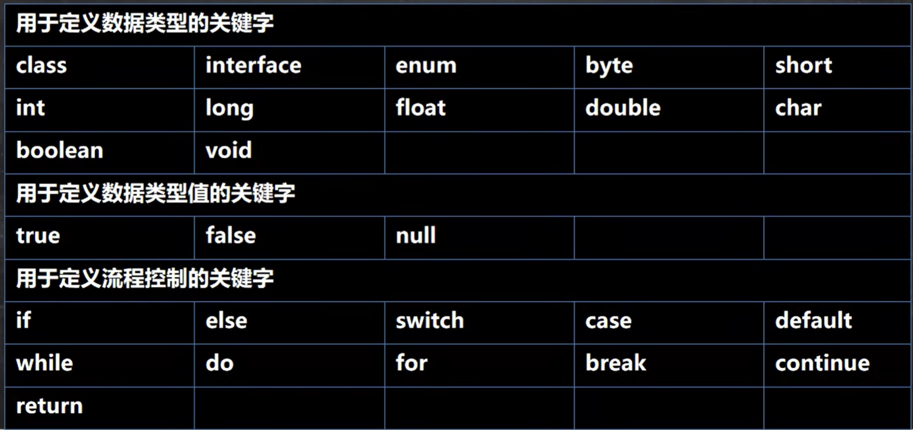
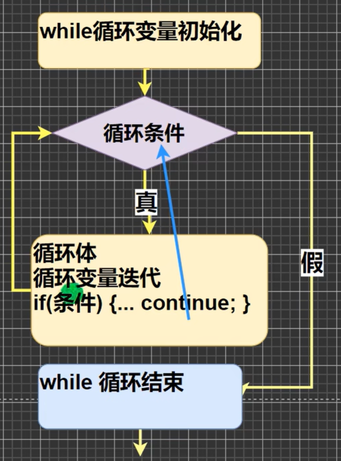

# 韩顺平 JAVA 学习笔记

## PRE
### 课程目录
1. Java基础
    - 建立编程思想
    - 提升编程能力
    - 分析需求，代码实现能力
2. Java高级
3. JavaWeb
4. 主流框架和项目管理
5. 分布式、微服务、并行架构
6. DevOps（开发运维一体化）、自动化部分管理项目、解决CI/CD
7. 大数据技术
8. 项目
9. 大厂高频面试题
10. 底层源码/内核研究
11. 编程基础扩展

### 就业方向
1. JavaEE软件工程师
    - 电商、团购、众筹、SNS（社交网络）、教育、金融、搜索
2. 大数据软件工程师（Java基础，JavaSE）
    - 大数据应用工程师
    - 大数据算法工程师
    - 大数据分析和挖掘
3. Android软件工程师

### 开发场景
1. SSM
    - Spring（轻量级容器框架）
    - SpringMVC（分层的Web开发框架）
    - MyBatis（持久化框架）
2. Android核心代码
3. 大数据-Hadoop

### 应用领域
1. 企业级应用
    - 复杂的大企业的软件系统
    - 各种类型的网站
    - 金融、电信、交通、电子商务等领域应用

2. Android平台应用
    安卓应用程序使用Java编写

3. 移动领域应用
    消费和嵌入式领域，在各种小型设备上的应用：
    - 机顶盒
    - 车载大屏影音娱乐设备
    - 汽车通信设备
    - 扫码的POS机

## 概述

### 章节目录
1. Java历史
2. Java特点
3. Java运行机制及运行过程
4. Java开发环境搭建
5. Dos基本指令

### 第一个程序
1. 什么是程序？
    程序是有序指令的集合
2. 程序如何输出“1+1”？    
    ```java
    public class Test{
        public static void main(String[] args){
                int res = 1+1;
                System.out.println("1+1=" + res);
        }
    }
    ```
3. 如何执行程序？
    打开cmd，在当前目录下执行以下指令：
    ```bash
    javac Test.java
    java Test
    ```
### Java历史

[点击此处](https://www.oracle.com/java/technologies/java-se-support-roadmap.html)查看Java历史版本详情。
课程内容主要围绕Java 8和Java 11，因为这两个版本是长期支持（LTS）的版本。具体内容如下图（图片获取时间：2025-4-10）：


### Java特点

1. Java技术体系平台
    

2. 特点
    - Java语言是面向对象（oop）的。
    - Java语言是健壮的。Java的强类型机制、异常处理、垃圾的自动收集是Java程序健壮性的重要保证。
    - Java语言是跨平台性的。（一个编译好的`*.class`文件可以在多个不同系统下运行）
    - Java语言是**解释性**的。（不能直接由机器执行，而是经由解释器执行）

### 常见Java开发工具
1. editplus 、 notepad++
2. Sublime Text
    - 下载：[https://www.sublimetext.com/3](https://www.sublimetext.com/3)
    - 中文设置：https://www.bilibili.com/video/BV1HKHzeZEZA
        - 按组合键`Ctrl+Shift+P`，输入：`install`，选择`install package control`，等待弹窗。
        - 按组合键`Ctrl+Shift+P`，输入：`install`，等待弹窗。
        - 输入`Chinese`，然后确定，等待安装完成。
3. Eclipse
4. IntelliJ IDEA

### Java运行机制及运行过程
1. JAVA程序如何运行？
    - Java的`*.class`文件是运行在Java虚拟机（JVM,Java Virtual Machine）中的
    - JVM包含在jdk中。

2. Java代码从书写到运行的过程
    - 编译：使用`javac`命令将源代码编译成字节码文件（`.class`）
    - 运行：使用`java`命令运行字节码文件（`.class`）

3. 什么是jdk、jre？
    - jdk：Java Development Kit，Java开发工具包，包含jre和Java开发工具（java命令，javac命令，javadoc命令，javap命令等）。
    - jre：Java Runtime Environment，Java运行环境，包含JVM和Java核心类库。
    - 安装了jdk就不需要jre，如果需要运行一个开发好的Java程序，只需要安装jre即可。
    - 即：jdk用于开发程序（也可运行），jre只用于运行程序。


### 开发环境搭建
1. 【待完善】下载安装jdk
    此处未完成，仅列大纲，供后续更新参考。
    - 下载不同版本的JDK：
        - 官方：[下载链接](https://www.oracle.com/java/technologies/downloads/)
        - 百度网盘：[下载链接](https://pan.baidu.com/s/1nCIs0X072X0jma9H-0R0KQ?pwd=p2wd)
    - 在不同系统、权限下安装jdk
    - 对于windows，32位系统下载x86版本，64位系统下载x64版本。
2. **下面以安装路径为`D:\programs\jdk`为例。**
3. 配置环境变量（Windows系统）
    - `此电脑-属性-高级系统设置-环境变量`
    - 添加变量`JAVA_HOME`，内容为`D:\programs\jdk`，即jdk安装目录。
    - 编辑`path`环境变量，增加`%JAVA_HOME%\bin`
    - 打开命令行，输入`java`或`javac`，若没提示`找不到变量`，则配置成功。

### 学习方法
如何快速学习？如何寻找学习动力？

1. 为什么学习？（需求）
    - 工作需要
    - 跳槽、对方要求
    - 兴趣、技术控

2. 能否使用传统/现有技术解决？（解决需求）
    - 能解决，但是不完美
    - 解决不了

3. 引出我们学习的新技术和知识点
    明确要学的知识点。

4. 先学习新技术或知识点的基本原理和基本语法。（不要考虑细节）

5. 快速入门案例（基本程序，如CRUD）
    有了“增删改查”的基本能力，就可以上手了。

6. 开始研究技术的注意事项、使用细节、使用规范、如何规范。
    优化是永无止境的，细节要最后扣。


### 快速入门：Hello World!

1. 课程中提到的所有程序，都将遵循以下步骤：
    - 提出需求
    - 列出开发步骤
    - 阐明原理
    - 讲明细节


1. 需求
    - 写一个`Hello.java`程序，输出`Hello,World!`
2. 代码
    ```java
    // Java 快速入门，演示Java的开发步骤

    //对代码的相关说明
    //1. public class Hello 表示："Hello"是一个public(公有)类。
    //2. public static void main(String[] args)表示程序主方法，是程序的入口。
    //3. Java程序需要分号";"表示语句结束。
    public class Hello{

        // 编写主方法

        public static void main(String[] args){
            System.out.println("Hello,World!");
        }
    }
    ```
2. 命令行
    ```bash
    javac Hello.java
    java Hello
    ```
3. 错误解析
    - 如果使用的是之前提到的Sublime Text，可能无法编译（如下），这可能是因为控制台中文编码与文本编辑器的编码不一致导致的。
        ```bash
        hello.java:1: 错误: 编码GBK的不可映射字符
        // Java 蹇?熷叆闂紝婕旂ずJava鐨勫紑鍙戞楠?
        ```
        解决方法：
        用管理员身份打开命令行，右键顶端进入属性，确认编码格式（上述错误信息中显示为GBK）。
        然后将文本编辑器保存的编码设置为与命令行编码一致。

        解决方法2：强制指定编码格式。
        ```bash
        javac -encoding utf-8 Hello.java
        ```

    - 文件名不一致
        ```bash
        E:\code\HSPJava>javac -encoding UTF-8 hello.java
        hello.java:7: 错误: 类Hello是公共的, 应在名为 Hello.java 的文件中声明
        public class Hello{
            ^
        1 个错误
        ```
        这是因为Java严格区分文件名、类名的大小写，如果文件名与类名不一致，编译器会报错。
        这里类名为`Hello`，但文件名为`hello.java`，所以编译器报错。

    - 错误的运行方式
        ```bash
        E:\code\HSPJava>java Hello.class
        错误: 找不到或无法加载主类 Hello.class
        ```
        这里运行时，不需要带`.class`后缀，直接`java Hello`即可。
        ```bash
        E:\code\HSPJava>java Hello
        Hello,World!
        ```

4. 其他注意事项
    - Java源文件以`.java`为扩展名，源文件的基本组成部分是类`class`。
    - Java程序的执行入口是main()方法，有固定的书写格式，不得更改。
        ```java
        public static void main(String[] args){...}
        ```
    - 一个源文件中只能有一个public类，且类名必须与源文件名一致。但其他类名不限。
        ```java
        public class Hello{...}

        class Dog{...}

        class Cat{...}
        ```
        此时编译，会生成三个文件，`Hello.class`，`Dog.class`，`Cat.class`。
        即：编译后，每一个类对应一个`.class`文件
    - 如果源文件包含一个`public`类，则源文件名必须与此类相同。
    - 可以将main方法卸载非public类中，然后指定运行非public类，这样入口方法就是非public类的main方法。这样的类不可以跨包访问。


### 转义字符
1. Java常用转义字符
    - `\t`：制表位
    - `\n`：换行符
    - `\\`：`\`符号
    - `\"`：`"`符号
    - `\'`：`'`符号
    - `\r`：回车不换行

2. 演示代码
    ```java
    public class ChangeChar{

        public static void main(String[] args){
            //制表符
            System.out.println("北京\t天津\t上海");
            //换行转义符
            System.out.println("jack\nsmith\nmary");
            //斜杠转义符
            System.out.println("E:\\code\\HSPJava");
            //引号转义符
            System.out.println("\"早上好\"");
            System.out.println("\'早上好\'");
            // '\r'
            System.out.println("早上好中午好\r晚上好");
        }
    }
    ```
3. 练习代码
    ```java
    public class ChangeCharExer01{

        public static void main(String[] args){
            System.out.println("书名\t价格\t作者\t销量");
            System.out.println("三国\t罗贯中\t120\t1000");
        }
    }
    ```
    ```bash
    E:\code\HSPJava>java ChangeCharExer01
    书名    价格    作者    销量
    三国    罗贯中  120     1000
    ```

### 注释
1. 特点
    - 注释是注解说明解释程序的文字。**注释是程序的重要组成部分。**
    - 注释部分不会被JVM解释执行
2. 对比
    - 坏的代码
        ```java
        int a = 10;
        int b = 20;
        int c = a + b;
        System.out.println(c);
        ```
    - 好的代码
        ```java
        // 下面的代码是一个简单的加法程序

        // 定义变量
        int a = 10;
        int b = 20;

        // 计算
        int c = a + b;

        // 输出结果
        System.out.println(c);
        ```
3. 分类
    - 单行注释
    - 多行注释
    - 文档注释

4. 单行注释
    使用`//`作为一行开头的注释。
5. 多行注释
    ```java
    /*  早上好
        中午好
        晚上好 */
    ```
    注意：多行注释不能嵌套。下列方式是不被允许的。
    ```java
    /*  早上好
    /*  中午好 */
        晚上好 */
    ```
6. 文档注释
    - 注释内容可以被JDK提供的javadoc解析，生成以网页文件形式体现的该程序的说明文档。
    - 文档注释以`/**`为程序开头，以`*/`为程序结尾。其中每行以`*`开头。
    ```java
    /**
     * @author: lcq
     * @version: 1.0
    */
    ```
    - 使用如下命令生成文档注释：
        ```bash
        javadoc -d <dir> -xx -yy <java file>
        ```
        - `-d`：指定输出目录
        - `xx`和`yy`：表示需要生成的javadoc标签。
    
    - 【长期补充】可用的javadoc标签：
        - `@author`：作者
        - `@version`：版本
        - `@param`：参数
        - `@return`：返回值
        - `@throws`：异常
        - `@see`：相关类
### Java代码规范
1. 类、方法的注释，要以Javadoc的方式写。
2. 非Javadoc的注释（单行/多行注释），往往是给代码维护者看的，着重告诉读者为什么这么写，如何修改，注意什么问题。
3. 运算符和`=`通常习惯在两边空一格。`c = a + b;`
4. 源文件使用UTF-8编码。
5. 行宽度不要超过80个字符。
6. 对于大括号，分为行尾风格和次行风格两种。推荐行尾风格。

### 【了解】Dos
运行中使用cmd打开的界面就是Dos系统（Disk Operating System，磁盘操作系统）

#### 常用指令


1. **`dir`**  
   **列出目录内容**，支持多种参数筛选和格式化输出  
   ```bash
   dir E:\            # 列出E盘根目录所有文件和文件夹
   dir *.txt /s /p   # 递归查找所有.txt文件并分页显示
   dir /ah           # 显示当前目录下的隐藏文件
   ```  
   **参数说明**：  
   • `/s`：递归显示子目录内容  
   • `/p`：分页显示（按任意键继续）  
   • `/w`：紧凑模式（每行显示5项）  
   • `/a`：显示包括隐藏文件的所有文件（如`/ah`仅显示隐藏文件）  
   **特性**：支持通配符（如`dir *.exe`）和路径重定向（如`dir > filelist.txt`）

2. **`cd`**  
   **切换工作目录**，支持跨驱动器操作  
   ```bash
   cd D:\Project     # 进入D盘Project目录
   cd ..             # 返回上级目录
   cd /d E:\Backup   # 切换到E盘Backup目录（跨驱动器必须加/d）
   ```  
   **特殊用法**：  
   • `cd \`：返回当前驱动器的根目录  
   • `cd ..\..`：向上返回两级目录  
   • `cd`（不带参数）：显示当前完整路径  

3. **`tree`**  
   **显示目录树结构**，支持文件列表导出  
   ```bash
   tree D:\          # 显示D盘目录树结构
   tree /F > tree.txt # 将目录及文件结构导出为文本文件
   tree /A           # 使用ASCII字符替代扩展字符（兼容性更好）
   ```  
   **参数说明**：  
   • `/F`：显示每个目录中的文件名  
   • `/A`：简化图形符号（适合纯文本环境）  
   **注意**：路径中若含空格需用引号包裹（如`tree "C:\Program Files"`）

4. **`cls`**  
   **清空屏幕内容**，仅保留命令行提示符  
   ```bash
   cls  # 执行后屏幕内容完全清除，不影响系统状态
   ```  
   **适用场景**：  
   • 连续操作后需整理界面  
   • 执行敏感操作前隐藏历史命令（但可通过↑键回溯）

5. **`exit`**  
   **退出命令行窗口或批处理脚本**  
   ```bash
   exit        # 关闭当前CMD窗口
   exit /b     # 退出批处理脚本但不关闭窗口
   ```  
   **扩展用途**：  
   • 在脚本中配合错误码（如`exit 1`表示异常终止）  
   • 终止远程桌面会话（需结合其他命令）

可通过 `命令 /?`（如 `dir /?`）查看详细参数说明，或在CMD中输入 `help` 获取完整命令列表。

6. `md`（Make Directory）  
    **创建新目录**，相当于Linux的`mkdir`  
    ```bash
    md project       # 在当前目录创建project文件夹
    md D:\backup\2025  # 在D盘backup目录下创建2025子目录
    ```  
    

7. `rd`（Remove Directory）  
    **删除空目录**，相当于Linux的`rmdir`  
    ```bash
    rd temp          # 删除当前目录下的空temp文件夹
    rd /s /q D:\old  # 强制删除D盘old目录及其所有子文件（/s递归删除，/q静默模式）
    ```  
    **注意**：普通rd只能删除空目录，非空目录需配合/s参数

8. `del`（Delete）  
    **删除文件**，相当于Linux的`rm`  
    ```bash
    del test.txt     # 删除当前目录下的test.txt
    del *.tmp /s /q  # 递归删除所有子目录中的.tmp文件（/s包含子目录，/q不提示确认）
    ```  
    **特性**：  
    ◦ 支持通配符（如`del *.bak`）  
    ◦ /F参数强制删除只读文件  
    ◦ 无法直接删除目录（需配合rd）

9. `copy`  
    **文件复制**，相当于Linux的`cp`  
    ```bash
    copy a.txt b.txt        # 复制a.txt为b.txt
    copy *.log D:\logs      # 复制所有.log文件到D盘logs目录
    copy 1.txt+2.txt sum.txt # 合并1.txt和2.txt为sum.txt
    ```  
    **高级用法**：  
    ◦ 支持文件合并（`copy file1+file2 merged`）  
    ◦ /Y参数自动覆盖目标文件

10. `echo`  
    **显示信息或创建文件**  
    ```bash
    echo Hello World        # 输出"Hello World"
    echo. > newfile.txt     # 创建空文件（.代表空内容）
    echo %PATH%            # 显示环境变量PATH的值
    ```  
    **注意**：`echo off`常用于批处理脚本开头隐藏命令回显

11. `type`  
    **显示文本文件内容**，相当于Linux的`cat`  
    ```bash
    type config.ini        # 显示当前目录config.ini内容
    type D:\readme.txt | more  # 分页显示长文本（配合more命令）
    ```  
    **限制**：  
    ◦ 不支持通配符（如`type *.txt`无效）  
    ◦ 非文本文件（如.exe）会显示乱码

12. `move`  
    **移动文件/重命名**，相当于Linux的`mv`  
    ```bash
    move report.doc D:\docs       # 移动文件到指定目录
    move oldname.txt newname.txt  # 重命名文件
    move /Y *.jpg \photos        # 移动所有.jpg到photos目录（/Y覆盖不提示）
    ```  
    **特性**：  
    ◦ 可同时完成移动和重命名操作  
    ◦ 支持通配符批量操作

### 章节作业
1. 编写Hello,world程序
2. 将个人基本信息（姓名、性别、籍贯、住址）打印到控制台，每条信息占一行
3. JDK、JVM、JRE的关系
4. 环境变量path的配置机器作用
5. Java的编写步骤
6. Java编写的7个规范
7. 初学者学Java的易犯错误

## 变量
### 章节目录
1. 变量介绍
2. `+`符号的使用
3. 数据类型
4. 编码
5. 数据类型转换

### 变量介绍
1. 变量是程序的基本组成单位。
2. 变量有三要素：**类型、名称、值**
    ```java
    class Test{
        public static void main(String[] args){
            int a = 1 ;             // 变量a的类型是int，名称是a，值是1
            int b = 3 ;             // 变量b的类型是int，名称是b，值是3
            b = 80;                 // 变量b的值被修改为80

            System.out.println(a);  // 输出变量a的值
            System.out.println(b);  // 输出变量b的值
        }
    }
    ```

3. 变量的使用步骤
    - 声明变量：`int a`
    - 赋值：`a = 10`
    - 使用

4. 变量使用注意事项
    - 变量表示内存中的一个存储区域，不同的变量，类型不同，占用的空间也不同。
        比如：int占4个字节，double占8个字节。（后面会详细讲）
    - 变量需要有名称和类型。
    - 变量使用前必须先声明，后使用。
    - 变量的值可以在**同类型下**变换。
    - 变量在同一个作用域中不能重名。
    - 变量 = 类型 + 变量名 + 值。

### `+`符号的使用
1. 实例1
    ```java 
    System.out.println(100 + 98);// 198
    System.out.println("100" + 98);// 10098
    System.out.println(100 + 3 + "hello");// 103hello
    System.out.println("hello" + 100 + 3);// hello1003
    ```
    - 运算顺序从左至右。
    - 当左右两边均为数值时，做加法运算。
    - 当左右两边有一边为字符串时，做拼接运算。

### 数据类型
1. 每一种数据都定义了明确的数据类型，在内存中分配了不同大小的内存空间（字节）。
    
    - 图中内容务必记住。
    - Java数据类型分为两大类：基本数据类型和引用类型
    - 基本数据类型有8种：`byte`、`short`、`int`、`long`、`float`、`double`、`char`、`boolean`。
    - 引用数据类型有3种：类`class`、接口`interface`、数组`[]`。
    - **字符串不是基本数据类型。**

#### 整数类型
1. 整形的类型
    |类型|占用存储空间|范围|
    |:---:|:---:|:---:|
    |`byte`|1字节|-128~127|
    |`short`|2字节|-32768~32767<br>$-2^{15} \sim 2^{15}-1$|
    |`int`|4字节|-2147483648~2147483647<br>$-2^{31} \sim 2^{31}-1$|
    |`long`|8字节|-9223372036854775808~9223372036854775807<br>$-2^{63} \sim 2^{63}-1$|

2. 特性
    - Java各整数类型有固定的范围和字段长度，不受具体OS（操作系统）的影响，以保证Java程序的可移植性。
    - Java的整形**常量**默认为`int`型，声明`long`型需要在常量后加上`L`或`l`。
        ```java
        int i = 100;    // 默认int类型
        long l = 100L;  // long类型
        ```
    - Java程序中变量常声明为`int`型，只有不足以表示大数时，才使用`long`型。
    - `bit`是计算机中最小的存储单位，1byte = 8bit。

#### 浮点类型
1. 分类
    |类型|占用存储空间|范围|
    |:---:|:---:|:---:|
    |`float`|4字节|$-3.403\times10^{38} \sim 3.403\times10^{38}$|
    |`double`|8字节|$-1.798\times10^{308} \sim 1.798\times10^{308}$|

2. 特性
    - 浮点数在机器中存放的形式：符号位 + 指数位 + 尾数位。
    - 尾数部分可能丢失，造成精度损失。所以小数都是近似值。
    - Java中的浮点型常量默认为`double`类型，声明`float`型常量，须在常量末尾加上`f`或`F`。
        ```java
        float f = 1.0f;
        double d = 1.0;
        ```
    - 去
        ```java
        double num1 = 2.123456789123 // 2.123456789123
        double num2 = 2.123456789123f // 2.1234567
        ```

3. 浮点数的两种表示形式
    - 十进制：`5.12`、`512.0f`、`.512`（可以把小数点前的`0`取消）
    - 科学计数法：`5.12E2`（$5.12 \times 10^2$）、 `512E-2`（$512 \times 10^{-2}$）

4. 一个陷阱
    ```java
    double num1 = 2.7;
    double num2 = 8.1 / 3; // 2.6666666666666667

    // 通过Java API判断两者是否相等
    System.out.println(Math.abs(num1 - num2));
    ```
    - 计算小数时，可以先将小数乘以10，运算完成后再除以10。
    - 浮点数之间不能进行相等判断，而是改为将两者作差，看两者误差是否位于一定精度内。
        判断的误差按照实际需求即可。
    - 在线API网站：Matools.com

4. 【题外话】为什么0.1+0.2不等于0.3？
    首先，要解决一个问题：**什么是浮点数？**
    前面已经讲过，一个浮点数由三部分组成。其中的尾数位，`float`类型有23位，`double`类型有52位。
    $$
    2^{-23} = 1.1920929 \times 10^{-7} \\
    2^{-52} = 2.2204460492503131 \times 10^{-16}
    $$
    这就是为什么单精度提供约7位精度，双精度提供约16位精度。

    这里给出单精度的计算，双精度同理。（不一定正确，仅在此处进行一下记录）
    $$
    {(0.1)}_{10} = (0.00011001100110011001101)_2 \\
    {(0.2)}_{10} = (0.00110011001100110011010)_2 \\
    {(0.1 + 0.2)}_{10} = (0.01001100110011001100110)_2 = 0.3000000715… \\
    $$

#### 字符类型
1. 基本介绍
    - 字符类型可以表示单个字符。
    - 多个字符用字符串`String`
    - 字符型变量可以存放：中英文字符、转义字符、数字。
        ```java
        char ch = 'a';
        char ch1 = '中';
        char ch2 = '\\';
        char ch3 = 97;

        System.out.println(ch);     //a
        System.out.println(ch1);    //中
        System.out.println(ch2);    //'\'
        System.out.println(ch3);    //a     数字会由编码转换
        ```

2. 注意事项
    - 字符常量用单引号括起来。
    - 字符常量可以是转义字符。
    - 字符常来那个的本质是一个整数，输出的是Unicode码对应的字符。
    - `char`类型可以进行运算，因为其本质上是一个整数。

#### 布尔类型
1. 基本介绍
    - `boolean`类型只有两种值：`True`和`False`。
    - `boolean`类型占1字节。
    - `boolean`类型适用于逻辑运算，一般用于程序流程控制。
        `if`、`while`、`do-while`、`for`等。
    - **Java不能用0或非0表示布尔值。**

### 基本数据类型转换

#### 自动类型转换

1. 基本介绍
    Java程序在进行赋值或运算时，精度小的类型会自动转换为精度大的类型。
    - 数据类型按精度大小排序：（从左至右自动转换）
        - `char`、`int`、`long`、`float`、`double`
        - `byte`、`short`、`int`、`long`、`float`、`double`
2. 特性
    - 有多种类型数据混合运算时，系统首先将所有数据转换成容量最大的那种数据类型。
    - 将精度大的数据赋值给精度小的类型时，会出现精度损失，会报错。反之则自动转换类型。
    - （`byte`，`short`）和`char`之间不能进行自动类型转换。
        但他们之间可以进行运算，运算时先将类型全部转换为`int`。
    - `boolean`类型不参与类型转换。

#### 强制类型转换

1. 基本介绍
    强制类型转换可以将精度大的数据类型转换成精度小的数据类型，**但这个过程可能造成精度损失**。
    - 用强制转换符`()`进行强制转换。
2. 举例
    ```java
    int i = (int)1.9;
    System.out.println(i); // 1
    
    int n = (byte)2000;
    System.out.println(n); // -48
    ```
    为什么会发生这种情况？
    $$
    (2000)_{10}=(11111010000)_2 \\
    (11011111)_{补码} = (10110000)_{原码} = (-48)_{10}
    $$
3. 使用技巧
    - 强制转换符号只对最近的操作数生效，可以通过增加小括号提升优先级。
        ```java
        int n1 = (int)10*3.5+6*1.5;     //仅对10生效，编译时会报错。
        int n2 = (int)(10*3.5+6*1.5);   //对后面整个括号的运算结果生效。
        ```
    - **`char`类型可以保存`int`类型常量，但不能保存`int`变量，需要强制转换。**
        ```java
        char c1 = 100;
        int n1 = 100;

        char c2 = n1;       //报错，两端类型不匹配，不能进行赋值操作。
        char c3 = (char)n1; //正常编译，两端类型经过强制转换后相同。
        ```
#### 基本数据类型与字符串转换。
1. 将基本数据类型转换成字符串。
    采用原有数据加一个空字符串的方法
    ```java
    int n1 = 100;
    float f1 = 1.1F;
    double d1 = 4.5;
    boolean b1 = true;
    
    // 字符串在+号任意一边，运算结果为字符串。
    String s1 = n1 + "";
    String s2 = f1 + "";
    String s3 = d1 + "";
    String s4 = b1 + "";
    System.out.println(s1 + " " + s2 + " " + s3 + " " + s4)
    ```

2. 将字符串转换为基本数据类型。
    通过基本类型的包装类调用`parseXX`方法。
    ```java
    String s5 = "123";
    
    int num1 = Integer.parseInt(s5);            //123
    double num2 = Double.parseDouble(s5);       //123.0
    float num3 = Float.parseFloat(s5);          //123.0
    long num4 = Long.parseLong(s5);             //123
    byte num5 = Byte.parseByte(s5);             //123
    boolean b = Boolean.parseBoolean("true");   //true
    short num6 = Short.parseShort(s5);          //123
    ```

3. 取字符串中的单个字符
    ```java
    String s5 = "123"
    System.out.println(s5.charAt(0));           //1
    ```

4. 注意事项
    - 在将`String`类型转换成基本数据类型时，要确保`String`类型能够转成有效的数据。
        比如`"hello"`无论如何都不可能转换成一个整数。
    - 如果格式不正确，就会抛出异常，**抛出异常，程序就会终止**。

## 运算符
### 章节目录
1. 运算符介绍
2. 算术运算符
3. 关系运算符（比较运算符）
4. 逻辑运算符
4. 位运算符
5. 赋值运算符
6. 三元运算符
7. 运算符优先级

### 算术运算符
1. 介绍
    - 对数值类型的变量进行运算。
    - 
2. 常用的算术运算符
    

#### 易错点
1. `%`
    在Java中，`%`运算遵循以下公式：
    `a % b = a - (a / b) * b`
    ```java 
    System.out.println(10 % 3);     // 1
    System.out.println(-10 % 3);    // -1
    System.out.println(10 % -3);    // 1
    System.out.println(-10 % -3);   // -1
    ```
    从上面的输出结果可以看出，取模运算的符号仅与右侧操作数正负有关。

2. 面试题1
    下列两段代码的输出结果。
    ```java
    int i = 1;
    i = i++;
    System.out.println(i);  // 1
    ```
    ```java
    int i = 1;
    i = ++i;
    System.out.println(i);  // 2
    ```
    造成这个现象的原因，可以这样理解：
    在对变量进行赋值时，执行了两个步骤：
    - 将变量值赋给一个临时变量`temp = i`
    - 将`temp`的值赋给变量`i`
    在第一段代码中，`i++`先将`i`的值赋给`temp`，然后再将`temp`的值赋给`i`，所以`i`的值还是`1`。
    在第二段代码中，`++i`先将`i`的值加1，然后再将`i`的值赋给`temp`，所以`i`的值是`2`。

3. 华氏度计算

### 关系运算符
1. 常用的关系运算符
    

### 逻辑运算符
1. 常用的逻辑运算符
    
2. 说明
    分为两组：
    - 短路与`&&`、短路或`||`、取反`!`
    - 与`&`、或`|`、异或`^`。
3. 逻辑与和短路与的区别
    - 短路运算：当左边为`false`时，右边不再运算。
    - 逻辑运算：当左边为`false`时，右边继续运算。
    ```java
    int a = 10;
    int b = 20;
    if (a < 0 && b++ > 0) {
        System.out.println("aha");
    }
    System.out.println(b);// 20
    if (a < 0 & b++ > 0) {
        System.out.println("aha2");
    }
    System.out.println(b);// 21
    ```
    - 短路或运算：当左边为`true`时，右边不再运算。
    - **在开发中，为提升效率，一般使用短路运算。**

### 赋值运算符
1. 简介
    - 基本赋值运算符：`=`

    - 复合赋值运算符：`+=`,`-=`,`*=`,`/=`,`%=`

2. 特点
    - 赋值运算符的运算顺序为从右向左。
    - 赋值运算符左边只能是变量，右边可以是变量、常量、表达式。
    - **复合运算符进行计算时会自带强制类型转换。**

### 三元运算符
1. 介绍
    - `条件表达式？表达式1:表达式2`
    - 如果条件表达式为`true`，则返回表达式1，`false`则返回表达式2。
2. 使用细节
    - 表达式1和表达式2要为可以赋值给接收变量的类型（或可以自动转换/进行强制类型转换）。
    - 三元运算符可以转为`if-else`语句。

### 运算符优先级
1. 运算符优先级排序（从上至下优先级逐渐降低）
    
    - 只有单目运算符和赋值运算符从右向左运算
    - 括号优先级最高，赋值运算优先级最低。
    - 可以这样记：（不推荐硬记，用多了就会了）
        括号>单目运算符>算术运算符>位移运算符>比较运算符>逻辑运算符>三元运算符>赋值运算符

### 进制
1. 介绍
    - 二进制（Binary）：以`0B`或`0b`开头表示。用01表示。
    - 十进制（Decimal）
    - 八进制（Octal）：以`0`开头表示。用0-7表示。
    - 十六进制（Hexadecimal）：以`0X`或`0x`开头表示。用0-9、A-F表示。
2. 代码
    ```java
    //n1 二进制
    int n1 = 0b1010;
    //n2 10 进制
    int n2 = 1010;
    //n3 8 进制
    第 81页
    韩顺平循序渐进学 Java 零基础
    int n3 = 01010;
    //n4 16 进制
    int n4 = 0X10101;
    System.out.println("n1=" + n1); //输出结果：n1=10
    System.out.println("n2=" + n2); //输出结果：n2=1010
    System.out.println("n3=" + n3); //输出结果：n3=520
    System.out.println("n4=" + n4); //输出结果：n4=65793
    System.out.println(0x23A);      //输出结果：570
    ```
3. 进制转换（分四组）
    - 第一组：二/八/十六进制转十进制
    - 第二组：十进制转二/八/十六进制
    - 第三组：二进制转八/十六进制
    - 第四组：八/十六进制转二进制
### 位运算
1. 符号
    - `~`：按位取反
    - `&`：按位与
    - `|`：按位或
    - `^`：按位异或
    - `>>`：算术右移
    - `<<`：算术左移
    - `>>>`：逻辑右移
2. 特性
    - **所有的运算都是对补码进行运算。**
    - 算术右移`>>`：低位溢出，符号位不变，用符号位补高位。
    - 算术左移`<<`：符号位不变，低位补0。
    - 逻辑右移`>>>`：又称无符号右移，低位溢出，高位补0。
    - **没有`<<<`符号。**

3. 简单计算与推导
    - `2&3`
        $$
        \begin{aligned}
        (2)_{10} &= (\texttt{00000000}\ \texttt{00000000}\ \texttt{00000000}\ \texttt{00000010})_{\text{原码}} \\
        &= (\texttt{00000000}\ \texttt{00000000}\ \texttt{00000000}\ \texttt{00000010})_{\text{补码}} \\
        (3)_{10} &= (\texttt{00000000}\ \texttt{00000000}\ \texttt{00000000}\ \texttt{00000011})_{\text{原码}} \\
        &= (\texttt{00000000}\ \texttt{00000000}\ \texttt{00000000}\ \texttt{00000011})_{\text{补码}} \\
        (2)_{10} \mathbin{\&} (3)_{10} &= (\texttt{00000000}\; \texttt{00000000}\; \texttt{00000000}\; \texttt{00000010}) \mathbin{\&} (\texttt{00000000}\; \texttt{00000000}\; \texttt{00000000}\; \texttt{00000011}) \\
        &= (\texttt{00000000}\ \texttt{00000000}\ \texttt{00000000}\ \texttt{00000010}) = (2)_{10}
        \end{aligned}
        $$
2. 一段代码（位运算）
    ```java
    System.out.println(2&3); // 输出 2
    System.out.println(~-2); // 输出 1
    System.out.println(~2);  // 输出 -3
    System.out.println(2|3); // 输出 3
    System.out.println(2^3); // 输出 1
    ```
2. 一段代码（移位运算）
    ```java
    int a=1>>2; // 1 向右位移 2 位
    int b=-1>>2;//算术右移
    int c=1<<2;//算术左移
    int d=-1<<2;//
    int e=3>>>2;//无符号右移
    //a,b,c,d,e 结果是多少
    System.out.println("a="+a);
    System.out.println("b="+b);
    System.out.println("c="+c);
    System.out.println("d="+d);
    System.out.println("e="+e);
    ```
    - 对于左移和右移，实际上就是乘2和除2，除2为右移，乘2为左移。
6. 【待补充】本部分仍有完善空间，由于时间紧迫，暂时不做展开
    - 【循环】多次左右移的数字对比
    - 【补码】负数的移位运算
    - 逻辑右移的结果。
### 附加内容
#### 标识符的规则与规范
1. 概念
    - Java对各种变量、方法、类等命名时使用的字符序列称为标识符。
2. 规则（必须遵守）
    - 由26个英文字母的大小写、10个阿拉伯数字、下划线`_`、美元符号`$`组成。
    - 数字不可以作为标识符的开头。
    - 不可以使用**关键字**和**保留字**。
    - **Java严格区分标识符大小写，但对长度无限制。**
    - 标识符不得包含空格。

3. 规范（不强制推荐采取的命名方式）
    - 包名：多个单词组成时，所有字母小写。如：`com.han.sp`
    - 类名、接口名：多个单词组成时，每个单词首字母大写，其余小写。如：`HanSP`（大驼峰法）
    - 变量名、方法名：多个单词组成时，第一个单词首字母小写，其余大写。如：`hanSP`（小驼峰法）
    - 常量名：多个单词组成时，每个单词所有字母大写，其余小写。如：`HAN_SP`（全大写）

4. 关键字和保留字
    - 关键字：被Java语言赋予特殊含义，用作专门用途的字符串。
        
    - 保留字：现有Java版本尚未使用，但以后版本可能会作为关键字使用的字符串。
        `byValue`、`cast`、`future`、`generic`、`inner`、`operator`、`outer`、`rest`、`var`、`goto`、`const`等。

#### 键盘输入语句
1. 介绍
    - Java中，如果要接收用户输入的数据，就可以使用键盘输入语句。
    - 需要一个扫描器对象`Scanner`。
2. 使用步骤
    - 导入该类所在包`java.util.*`。
    - 创建一个`Scanner`对象。
3. 代码实例`Input.java`
    ```java
    import java.util.*;	//导入java.util下的Scanner类

    public class Input{

        public static void main(String[] args) {
                
            // 创建 Scanner 对象
            Scanner scanner = new Scanner(System.in);

            // 接收用户输入
            System.out.println("输入内容（姓名）：");
            String name = scanner.next();

            System.out.println("输入内容（年龄）：");
            int age = scanner.nextInt();

            System.out.println("输入内容（薪水）：");
            Double salary = scanner.nextDouble();

            System.out.println("基本信息如下");
            System.out.println("姓名\t年龄\t薪水");
            System.out.println(name + "\t" + age + "\t" + salary + "\t" );
            }	
    }
    /************************
    输入内容（姓名）：
    li
    输入内容（年龄）：
    24
    输入内容（薪水）：
    223333
    基本信息如下
    姓名    年龄    薪水
    li      24      223333.0
    ************************/
    ```

#### 【待补充】原码、反码、补码
我会，等我学完回来补
1. **Java没有无符号数**

## 程序控制结构
### 章节目录
1. 顺序控制
2. 分支控制（`if-else`、`switch`）
3. 循环控制（`for`、`while`、`do-while`）
4. `break`
5. `continue`
6. `return`

### 顺序控制
1. 介绍
    - 程序从上到下逐行执行，中间没有任何跳转和判断。
    - **顺序控制是程序默认的控制方式。**
    - Java定义变量时采用前向引用的方式，即先声明后调用。
### 分支控制
#### 单分支（`if`）
1. 基本语法
    ```java
    if(条件表达式){
        执行代码块;
    }
    ```
    - 当条件表达式为`true`时，执行代码块。
    - 当条件表达式为`false`时，不执行代码块。
    - 如果执行代码只有一行，可以不加大括号。（不推荐）
2. 流程图
    
#### 双分支
1. 基本语法
    ```java
    if(条件表达式){
        执行代码块1;
    }
    else{
        执行代码块2;
    }
    ```
2. 流程图
    
#### 多分支
1. 基本语法
    ```java
    if(条件表达式1){
        执行代码块1;
    } 
    else if(条件表达式2){
        执行代码块2;
    }
    ...
    else {
        执行代码块n;
    }
    ```
2. 流程图
    

#### 嵌套分支
1. 基本语法
    ```java
    if(条件表达式1){
        if(){
            //if-else
        }else{
            //if-else
        }
    }
    ```
    - **为保证程序可读性，建议嵌套不要超过三层。**

#### `switch`分支结构
1. 基本语法
    ```java
    switch(表达式){
        case 常量值1:
            执行代码块1;break;
        case 常量值2:
            执行代码块2;break;
        ...
        case 常量值n:
            执行代码块n;break;
        default:
            执行代码块n+1;
            break;
    }
    ```
2. 流程图
    
4. 注意事项
    - 标的是的数据类型应与`case`后的常亮数据类型一致（或可以转换成对应的类型）。否则会报错。
    - `switch`的表达式的返回值必须是以下类型中的一种：
        `byte`、`short`、`int`、`char`、`num`、`String`
    - **`case`子句中的值只能是常量，不能是变量。**
    - `default`子句是可选的。
    - `switch`结构具有穿透的特点，会从符合条件的`case`处执行到最后，而`break`用于跳出代码块。

### 循环控制

#### for循环

1. 基本语法
    ```java
    for(循环变量初始化;循环条件;循环变量迭代){
        循环操作;
    }
    ```
2. 流程图：
    

3. 注意事项
    - 循环条件返回一个布尔值表达式。
    - 初始化和变量迭代可以写在别的地方，**但分号不能省略**。
    - 初始化变量可以有多条语句，用逗号隔开，**要求类型相同**。

#### while循环
1. 基本语法
    ```java
    while(条件表达式){
        循环体语句;
        变量迭代;
    }
    ```
2. 流程图
    

#### do-while循环
1. 基本语法
    ```java
    do{
        循环体语句;
        变量迭代;
    }while(条件表达式);
    ```
2. 流程图
    
 
#### 多重循环
1. 介绍
    - 将一个循环嵌套在另一个循环中，称为多重循环。
    - 建议一般使用2层循环，3层循环以上不建议使用。

### 其他控制语句
#### `break`
1. 流程图
    
2. 使用细节
    - `break`语句可以通过标签指明终止哪一层的语句块。
        ```java
        lable1:
        for(int i=0;i<10;i++){
            lable2:
            for(int j=0;j<10;j++){
                label3:
                for(int k=0;k<10;k++){
                    if(k==5){
                        break lable2;
                    }
                }
            }
        }
        ```
        建议在实际开发中尽量不使用标签，这会降低代码的可读性。

#### `continue`
1. 流程图
    
 