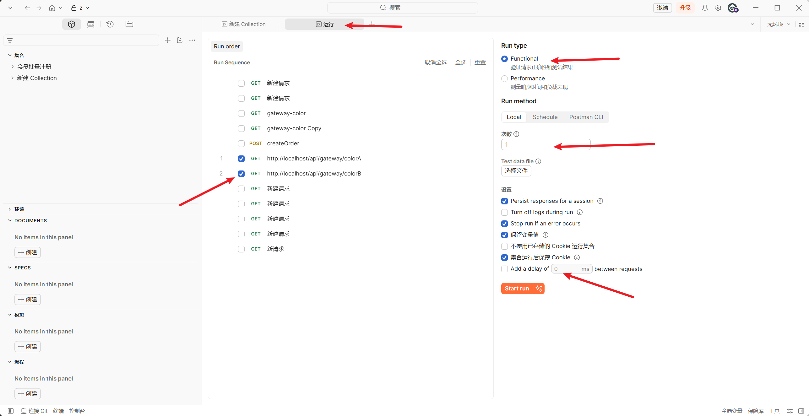
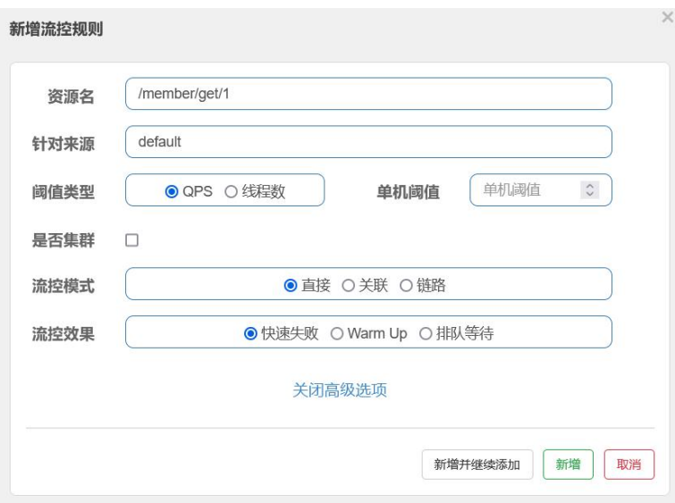
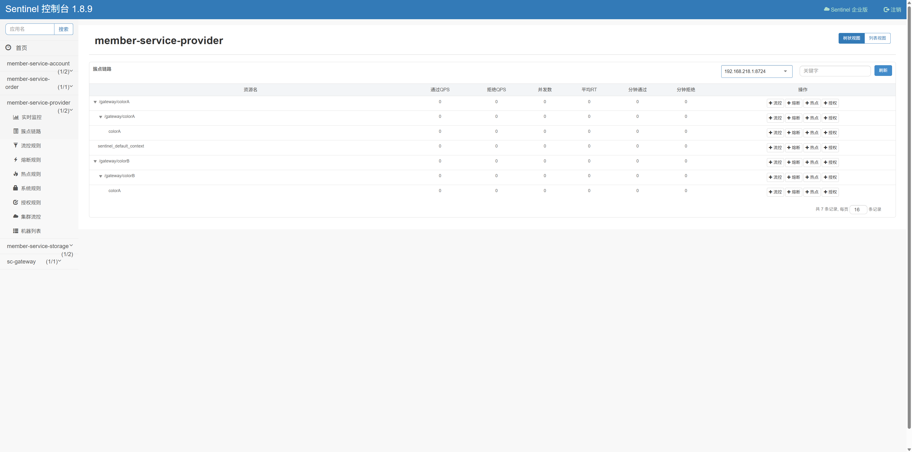
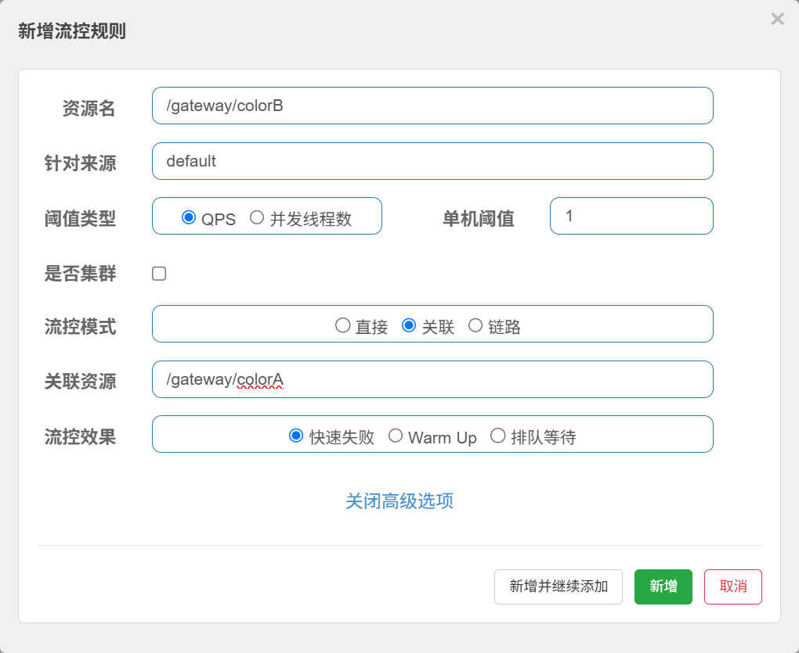
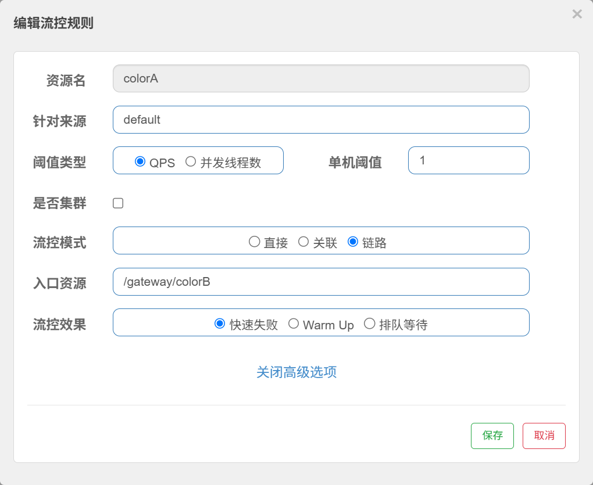
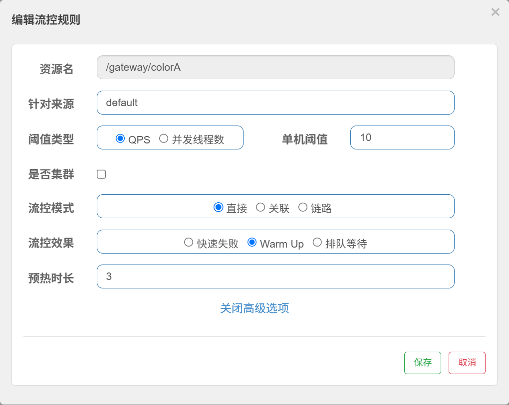
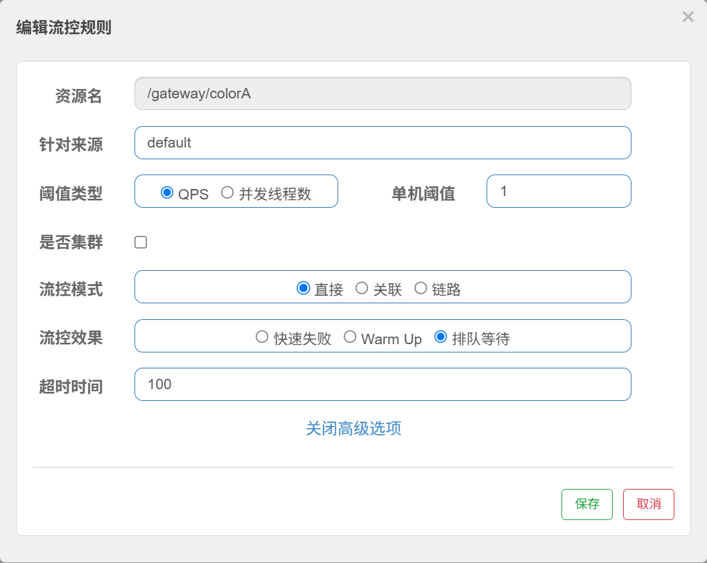
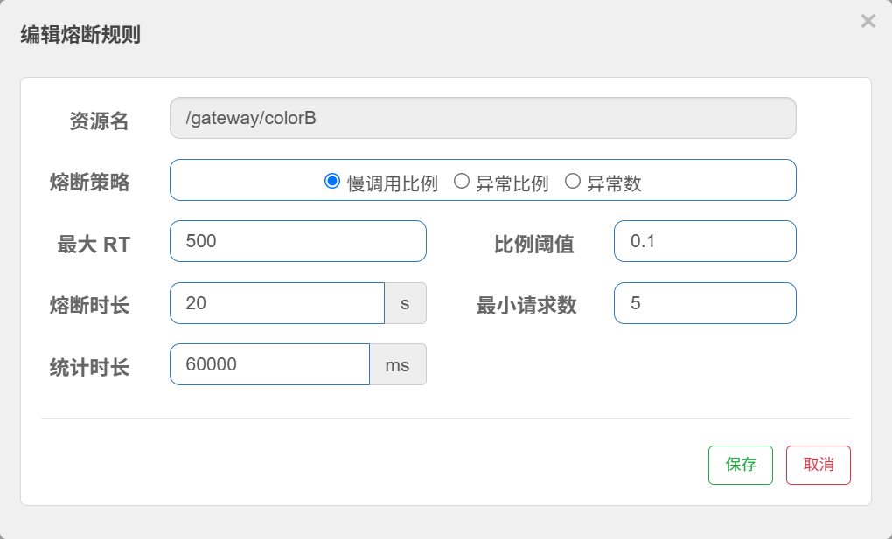
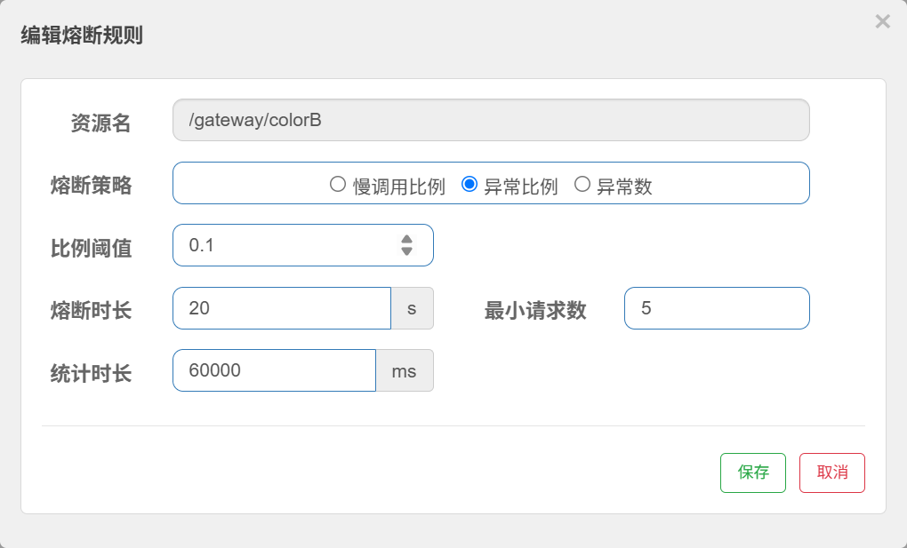
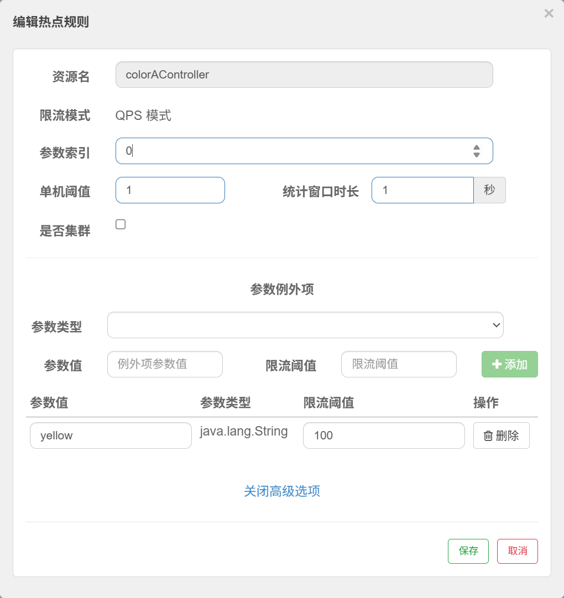

# Spring Cloud串讲笔记

## 开始微服务开发

### 场景

1. 简介
    用户订单服务系统，完成下单全流程微服务化开发


### 计划框架

1. 图解
    ```mermaid
    flowchart TD
    Client["Vue / Postman"] --> Gateway["sc-gateway"]
    Gateway --> Consumer["member-service-consumer"]
    Consumer --> Provider["member-service-provider"]
    Provider --> DB[("MySQL")]
    Consumer -. "调用接口" .-> API["member-api"]
    Provider -. "实现接口" .-> API
    ```

### 涉及技术栈

1. 服务注册与发现
    - Eureka
    - Nacos

2. 网关
    - Zuul
    - Spring Cloud Gateway

3. 流控
    - Sentinel

4. 分布式事务
    - Seata


## 前期准备

### 创建父工程

#### 父工程框架

1. 使用springboot initilizr创建一个项目，并删除`/src`目录。
2. 修改`pom.xml`，粘贴如下内容

    ```xml
    <?xml version="1.0" encoding="UTF-8"?>
    <project xmlns="http://maven.apache.org/POM/4.0.0"
            xmlns:xsi="http://www.w3.org/2001/XMLSchema-instance"
            xsi:schemaLocation="http://maven.apache.org/POM/4.0.0 https://maven.apache.org/xsd/maven-4.0.0.xsd">

        <modelVersion>4.0.0</modelVersion>

        <!-- 当前工程自身的坐标 -->
        <groupId>com.lcq</groupId>
        <artifactId>e-commerce-center</artifactId>
        <version>1.0.0-SNAPSHOT</version>
        <packaging>pom</packaging>

        <name>e-commerce-center</name>
        <description>电商中心微服务父工程</description>

        <!-- 聚合：声明由根工程统一构建的子模块 -->
        <modules>
            <module>member-api</module>
            <module>member-service-provider</module>
            <module>member-service-consumer</module>
            <module>sc-gateway</module>
        </modules>

        <!-- 全局版本和构建参数 -->
        <properties>
            <java.version>17</java.version>
            <maven.compiler.release>${java.version}</maven.compiler.release>
            <project.build.sourceEncoding>UTF-8</project.build.sourceEncoding>
            <project.reporting.outputEncoding>UTF-8</project.reporting.outputEncoding>

            <spring-boot.version>4.0.7</spring-boot.version>
            <spring-cloud.version>2025.1.2</spring-cloud.version>
            <spring-cloud-alibaba.version>2025.1.0.0</spring-cloud-alibaba.version>

            <mybatis-plus.version>3.5.17</mybatis-plus.version>
            <druid.version>1.2.28</druid.version>

            <maven-compiler-plugin.version>3.15.0</maven-compiler-plugin.version>
            <maven-surefire-plugin.version>3.5.4</maven-surefire-plugin.version>
            <maven-enforcer-plugin.version>3.6.3</maven-enforcer-plugin.version>
        </properties>

        <!-- 只管理依赖版本，不会把这些依赖自动加入子模块 -->
        <dependencyManagement>
            <dependencies>

                <!-- Spring Boot 依赖版本 -->
                <dependency>
                    <groupId>org.springframework.boot</groupId>
                    <artifactId>spring-boot-dependencies</artifactId>
                    <version>${spring-boot.version}</version>
                    <type>pom</type>
                    <scope>import</scope>
                </dependency>

                <!-- Spring Cloud 依赖版本 -->
                <dependency>
                    <groupId>org.springframework.cloud</groupId>
                    <artifactId>spring-cloud-dependencies</artifactId>
                    <version>${spring-cloud.version}</version>
                    <type>pom</type>
                    <scope>import</scope>
                </dependency>

                <!-- Spring Cloud Alibaba 依赖版本 -->
                <dependency>
                    <groupId>com.alibaba.cloud</groupId>
                    <artifactId>spring-cloud-alibaba-dependencies</artifactId>
                    <version>${spring-cloud-alibaba.version}</version>
                    <type>pom</type>
                    <scope>import</scope>
                </dependency>

                <!-- MyBatis-Plus 依赖版本 -->
                <dependency>
                    <groupId>com.baomidou</groupId>
                    <artifactId>mybatis-plus-bom</artifactId>
                    <version>${mybatis-plus.version}</version>
                    <type>pom</type>
                    <scope>import</scope>
                </dependency>

                <!-- Boot BOM 不管理 Druid Starter，因此在父工程单独管理 -->
                <dependency>
                    <groupId>com.alibaba</groupId>
                    <artifactId>druid-spring-boot-4-starter</artifactId>
                    <version>${druid.version}</version>
                </dependency>

                <!-- 统一管理项目内部公共 API 模块的版本 -->
                <dependency>
                    <groupId>${project.groupId}</groupId>
                    <artifactId>member-api</artifactId>
                    <version>${project.version}</version>
                </dependency>

            </dependencies>
        </dependencyManagement>

        <build>

            <!-- 管理可选插件；子模块声明后才真正启用 -->
            <pluginManagement>
                <plugins>
                    <plugin>
                        <groupId>org.springframework.boot</groupId>
                        <artifactId>spring-boot-maven-plugin</artifactId>
                        <version>${spring-boot.version}</version>
                        <executions>
                            <execution>
                                <id>repackage</id>
                                <goals>
                                    <goal>repackage</goal>
                                </goals>
                            </execution>
                        </executions>
                    </plugin>
                </plugins>
            </pluginManagement>

            <!-- 所有子模块继承并使用的构建插件 -->
            <plugins>

                <!-- 按 Java 17 编译，并保留方法参数名 -->
                <plugin>
                    <groupId>org.apache.maven.plugins</groupId>
                    <artifactId>maven-compiler-plugin</artifactId>
                    <version>${maven-compiler-plugin.version}</version>
                    <configuration>
                        <release>${maven.compiler.release}</release>
                        <parameters>true</parameters>
                        <encoding>${project.build.sourceEncoding}</encoding>
                    </configuration>
                </plugin>

                <!-- 在 test 阶段运行 JUnit 单元测试 -->
                <plugin>
                    <groupId>org.apache.maven.plugins</groupId>
                    <artifactId>maven-surefire-plugin</artifactId>
                    <version>${maven-surefire-plugin.version}</version>
                </plugin>

                <!-- 在构建开始时检查 JDK 和 Maven 版本 -->
                <plugin>
                    <groupId>org.apache.maven.plugins</groupId>
                    <artifactId>maven-enforcer-plugin</artifactId>
                    <version>${maven-enforcer-plugin.version}</version>
                    <executions>
                        <execution>
                            <id>enforce-build-environment</id>
                            <phase>validate</phase>
                            <goals>
                                <goal>enforce</goal>
                            </goals>
                            <configuration>
                                <rules>
                                    <requireJavaVersion>
                                        <version>[17,)</version>
                                    </requireJavaVersion>
                                    <requireMavenVersion>
                                        <version>[3.9.0,)</version>
                                    </requireMavenVersion>
                                </rules>
                            </configuration>
                        </execution>
                    </executions>
                </plugin>

            </plugins>
        </build>

    </project>

    ```

3. 说明
    这里的pom指定了数据库相关模块（MyBatisPlus、Druid）以及SpringBoot、SpringCloud、SpringCloud Alibaba的版本依赖。
    参考链接：
    - https://baomidou.com/getting-started/install/
    - https://github.com/alibaba/druid?tab=readme-ov-file#spring-boot-%E9%A1%B9%E7%9B%AE%E6%8E%A8%E8%8D%90

#### 父工程pom文件解析

### 创建api模块（创建并打包）

#### 创建请求对象

1. 总览
    - `MemberCreateRequest.java`
    - `MemberUpdateRequest.java`
    - `MemberQueryRequest.java`
    
1. `MemberCreateRequest.java`
    ```java
    package com.lcq.memberapi.request;

    import jakarta.validation.constraints.Email;
    import jakarta.validation.constraints.Max;
    import jakarta.validation.constraints.Min;
    import jakarta.validation.constraints.NotBlank;
    import jakarta.validation.constraints.Pattern;
    import jakarta.validation.constraints.Size;
    import lombok.AllArgsConstructor;
    import lombok.Data;
    import lombok.NoArgsConstructor;

    import java.io.Serializable;

    /**
    * 创建会员请求对象
    *
    * @author lcq
    * @version 1.0
    */
    @Data
    @NoArgsConstructor
    @AllArgsConstructor
    public class MemberCreateRequest implements Serializable {

        private static final long serialVersionUID = 1L;

        /**
        * 会员名称
        */
        @NotBlank(message = "会员名称不能为空")
        @Size(max = 50, message = "会员名称不能超过50个字符")
        private String name;

        /**
        * 会员密码
        */
        @NotBlank(message = "会员密码不能为空")
        @Size(
                min = 6,
                max = 64,
                message = "会员密码长度必须在6到64个字符之间"
        )
        private String pwd;

        /**
        * 手机号码
        */
        @Pattern(
                regexp = "^$|^1\\d{10}$",
                message = "手机号码格式不正确"
        )
        private String mobile;

        /**
        * 邮箱
        */
        @Email(message = "邮箱格式不正确")
        @Size(max = 100, message = "邮箱不能超过100个字符")
        private String email;

        /**
        * 性别：0未知，1男，2女
        */
        @Min(value = 0, message = "性别值不能小于0")
        @Max(value = 2, message = "性别值不能大于2")
        private Integer gender;
    }
    ```
1. `MemberQueryRequest.java`
    ```java
    package com.lcq.memberapi.request;

    import jakarta.validation.constraints.Max;
    import jakarta.validation.constraints.Min;
    import jakarta.validation.constraints.Size;
    import lombok.AllArgsConstructor;
    import lombok.Data;
    import lombok.NoArgsConstructor;

    import java.io.Serializable;

    /**
    * 会员分页查询请求对象
    *
    * @author lcq
    * @version 1.0
    */
    @Data
    @NoArgsConstructor
    @AllArgsConstructor
    public class MemberQueryRequest implements Serializable {

        private static final long serialVersionUID = 1L;

        /**
        * 查询关键字
        * 可用于匹配会员名称、手机号或邮箱
        */
        @Size(max = 50, message = "查询关键字不能超过50个字符")
        private String keyword;

        /**
        * 性别：0未知，1男，2女
        */
        @Min(value = 0, message = "性别值不能小于0")
        @Max(value = 2, message = "性别值不能大于2")
        private Integer gender;

        /**
        * 当前页码
        */
        @Min(value = 1, message = "页码不能小于1")
        private Integer pageNum = 1;

        /**
        * 每页数量
        */
        @Min(value = 1, message = "每页数量不能小于1")
        @Max(value = 100, message = "每页数量不能超过100")
        private Integer pageSize = 10;
    }

    ```
1. `MemberUpdateRequest.java`
    ```java
    package com.lcq.memberapi.request;

    import jakarta.validation.constraints.Email;
    import jakarta.validation.constraints.Max;
    import jakarta.validation.constraints.Min;
    import jakarta.validation.constraints.Pattern;
    import jakarta.validation.constraints.Size;
    import lombok.AllArgsConstructor;
    import lombok.Data;
    import lombok.NoArgsConstructor;

    import java.io.Serializable;

    /**
    * 修改会员请求对象
    *
    * @author lcq
    * @version 1.0
    */
    @Data
    @NoArgsConstructor
    @AllArgsConstructor
    public class MemberUpdateRequest implements Serializable {

        private static final long serialVersionUID = 1L;

        /**
        * 会员名称
        */
        @Size(
                min = 1,
                max = 50,
                message = "会员名称长度必须在1到50个字符之间"
        )
        private String name;

        /**
        * 手机号码
        */
        @Pattern(
                regexp = "^$|^1\\d{10}$",
                message = "手机号码格式不正确"
        )
        private String mobile;

        /**
        * 邮箱
        */
        @Email(message = "邮箱格式不正确")
        @Size(max = 100, message = "邮箱不能超过100个字符")
        private String email;

        /**
        * 性别：0未知，1男，2女
        */
        @Min(value = 0, message = "性别值不能小于0")
        @Max(value = 2, message = "性别值不能大于2")
        private Integer gender;
    }
    ```

#### 创建返回包装类

1. `Result.java`
    ```java
    package com.lcq.memberapi.result;

    import lombok.Data;
    import lombok.NoArgsConstructor;

    /**
    * 统一响应结果
    *
    * @param <T> 响应数据类型
    * @author lcq
    * @version 1.0
    */
    @Data
    @NoArgsConstructor
    public class Result<T> {

        private String code;
        private String msg;
        private T data;

        public Result(String code, String msg, T data) {
            this.code = code;
            this.msg = msg;
            this.data = data;
        }

        public static <T> Result<T> success(T data) {
            return new Result<>("200", "success", data);
        }

        public static <T> Result<T> success(String msg, T data) {
            return new Result<>("200", msg, data);
        }

        public static <T> Result<T> created(String msg, T data) {
            return new Result<>("201", msg, data);
        }

        public static <T> Result<T> error(String msg) {
            return new Result<>("500", msg, null);
        }

        public static <T> Result<T> error(String code, String msg) {
            return new Result<>(code, msg, null);
        }
    }
    ```

### 创建consumer模块

### 创建provider模块

### 创建Gateway模块

#### 配置

1. Maven引入
    ```xml
    <dependencies>
        <dependency>
            <groupId>org.springframework.boot</groupId>
            <artifactId>spring-boot-starter</artifactId>
        </dependency>

        <dependency>
            <groupId>org.springframework.boot</groupId>
            <artifactId>spring-boot-starter-test</artifactId>
            <scope>test</scope>
        </dependency>

        <dependency>
            <groupId>org.springframework.cloud</groupId>
            <artifactId>spring-cloud-starter-gateway-server-webmvc</artifactId>
        </dependency>

        <dependency>
            <groupId>com.alibaba.cloud</groupId>
            <artifactId>spring-cloud-starter-alibaba-nacos-discovery</artifactId>
        </dependency>

        <dependency>
            <groupId>com.alibaba.cloud</groupId>
            <artifactId>spring-cloud-starter-alibaba-nacos-config</artifactId>
        </dependency>

        <dependency>
            <groupId>org.springframework.cloud</groupId>
            <artifactId>spring-cloud-starter-loadbalancer</artifactId>
        </dependency>


    </dependencies>
    ```

2. `application.yml`
    - **注意：不同版本的配置有所不同**
    ```yml
    server:
        port: 80

    spring:
        application:
            name: "sc-gateway"

        profiles:
            active: dev


        cloud:
            nacos:
            config:
                server-addr: localhost:8848

            discovery:
                server-addr: localhost:8848

        config:
            import:
            - "optional:nacos:${spring.application.name}-${spring.profiles.active}.yaml"
    ```

#### 启动类


### 配置启动Nacos（含配置中心）

#### Nacos简介

1. 服务注册与发现

2. 配置中心

#### 启动Nacos

1. 下载（项目使用``）
    - https://github.com/alibaba/nacos/releases/download/1.2.1/nacos-server-1.2.1.zip
1. 傻瓜式启动
    - 双击`/nacos/bin`目录下的`startup.cmd`

3. 说明

    根据官方 GitHub tag，**Windows 的 `startup.cmd` 默认启动模式从 Nacos `1.3.2` 开始改成 `cluster`**。

    即到 `1.3.2` 以后，双击 `startup.cmd` 就不再等价于单机启动了。

    官方解决方案也很明确：单机模式要显式加 `-m standalone`。官方快速开始里 Windows 启动命令就是：

    ```bat
    startup.cmd -m standalone
    ```

    官方部署文档也写了：`standalone` 代表非集群模式，本地测试/单机试用用单机模式；集群模式用于生产环境。参考：[Nacos 快速开始](https://nacos.io/docs/latest/quickstart/quick-start/) 和 [Nacos 支持三种部署模式](https://nacos.io/docs/latest/guide/admin/deployment/)。

    至于为什么不是默认 `localhost`：这不是 Win11 的问题。官方“集群寻址”文档说明，如果没有显式配置寻址方式，Nacos 会先找 `cluster.conf`，再找 `nacos.member.list`，否则走 `address-server`；而 `address.server.domain` 的默认值就是 `jmenv.tbsite.net`。参考：[集群寻址](https://nacos.io/docs/latest/plugin/address-plugin/)。

    你本地最稳的做法就是以后都这样启动，在根目录`/nacos/bin`下运行cmd，然后输入如下命令：

    ```powershell
    .\startup.cmd -m standalone
    ```

    `2.5.2` 同理

#### SpringBoot配置

1. 说明
    - Spring Cloud Alibaba 版本（2025.1.0.0）与 Spring Boot 4.x 的组合，改变了配置加载方式。
        从 Spring Cloud Alibaba 2023.0.1.3 版本开始，Nacos 配置的加载机制发生了重大变更

    - 老版本：自动匹配`${spring.application.name}-${spring.profiles.active}.${spring.cloud.nacos.config.file-extension}`格式的配置文件。

    - 新版本：通过配置`spring.config.import`配置多个配置源。新版本的配置组（group）与命名空间（namespace）均在这个配置下设置。
        **特别的，需要加上`refreshEnable=true`**

2. 配置示例
    ```yaml
    spring:
        application:
            name: member-service-provider

        profiles:
            active: dev

        config:
            import:
            - "optional:nacos:${spring.application.name}-${spring.profiles.active}.${spring.cloud.nacos.config.file-extension}?group=DEFAULT_GROUP&refreshEnabled=true"

        cloud:
            nacos:
                config:
                    server-addr: localhost:8848
                    file-extension: yaml
                    group: 
                    namespace:
                    
                discovery:
                    server-addr: localhost:8848

    ```

3. 取用配置示例
    ```java
    package com.lcq.controller;

    import com.lcq.memberapi.result.Result;

    // 注意这里的@Value不是lombok
    import org.springframework.beans.factory.annotation.Value;
    import org.springframework.cloud.context.config.annotation.RefreshScope;
    import org.springframework.web.bind.annotation.RequestMapping;
    import org.springframework.web.bind.annotation.RestController;

    /**
    * @author lcq
    * @version 1.0
    */

    @RestController
    @RequestMapping("/nacos")
    @RefreshScope
    public class NacosCotroller {

        @Value("${nacos.name}")
        public  String name;

        @RequestMapping("/name")
        public Result name() {

            return Result.success(name);
        }

    }

    ```

4. 【待补充】用配置中心完成配置

#### 配置持久化

1. 所有Nacos配置均不会随重启丢失
    

### 配置启动Seata（含数据库）

#### Seata数据库结构简介

2. 下载与启动
    - 下载链接：https://github.com/apache/incubator-seata/releases/download/v0.9.0/seata-server-0.9.0.zip
    - 启动（完成下一节所示配置后启动）
        ```ps

        ```

#### 基本配置

1. seata配置文件一览
    ```text
    conf/
    ├── file.conf
    ├── registry.conf
    ├── nacos-config.txt
    ├── nacos-config.sh
    ├── nacos-config.py
    ├── db_store.sql
    └── db_undo_log.sql
    ```

    - `file.conf`：Seata运行参数

    - `registry.conf`：注册中心、配置中心在哪里

    - `nacos-config.txt`：当`配置中心=Nacos`时，要上传到Nacos的一整套参数

    - `db_store.sql`：Seata Server数据库建表

    - `db_undo_log.sql`：业务数据库建undo_log
    


1. 创建seata管理数据库`seata_server`
    ```sql
    CREATE DATABASE IF NOT EXISTS `seata_server`
    DEFAULT CHARACTER SET utf8mb4;
    ```

2. 创建管理数据库的表
    - 参考：`/seata/conf/db_store.sql`

2. 修改配置文件`/seata/conf/file.conf`
    - 当前修改的是服务端配置，启动时读取`store`字段
    - 修改数据库相关信息：数据库链接、用户名、密码
    - 修改存储模式为`db`
    ```conf
    ## transaction log store
    store {
    ## store mode: file、db
    mode = "db"

    ## file store
    file {
        dir = "sessionStore"

        # branch session size , if exceeded first try compress lockkey, still exceeded throws exceptions
        max-branch-session-size = 16384
        # globe session size , if exceeded throws exceptions
        max-global-session-size = 512
        # file buffer size , if exceeded allocate new buffer
        file-write-buffer-cache-size = 16384
        # when recover batch read size
        session.reload.read_size = 100
        # async, sync
        flush-disk-mode = async
    }

    ## database store
    db {
        ## the implement of javax.sql.DataSource, such as DruidDataSource(druid)/BasicDataSource(dbcp) etc.
        datasource = "dbcp"
        ## mysql/oracle/h2/oceanbase etc.
        db-type = "mysql"
        driver-class-name = "com.mysql.jdbc.Driver"
        url = "jdbc:mysql://127.0.0.1:3306/seata_server"
        user = "root"
        password = "lcq"
        min-conn = 1
        max-conn = 3
        global.table = "global_table"
        branch.table = "branch_table"
        lock-table = "lock_table"
        query-limit = 100
    }
    }
    ```

3. 修改配置文件`/seata/conf/registry.conf`
    - 这是注册到服务注册中心的相关配置
    - 忽略没有提及的配置，那些是是多余的。
    
    ```conf
    registry {
        # file 、nacos 、eureka、redis、zk、consul、etcd3、sofa
        type = "nacos"

        nacos {
            serverAddr = "localhost:8848"
            namespace = ""
            cluster = "default"
        }
    }

    config {
        # file、nacos 、apollo、zk、consul、etcd3
        type = "file"

        nacos {
            serverAddr = "localhost"
            namespace = ""
        }

        file {
            name = "file.conf"
        }
    }

    ```

4. 【注意事项】
    - `0.9.0`版本在Nacos中可能无法显示正确的服务名，而是显示`serverAddr`，需要用更新版本的Seata，并进行如下配置：
        ```conf
        registry {
            type = "nacos"
            nacos {
                application = "seata-server"
                serverAddr = "127.0.0.1:8848"
                group = "SEATA_GROUP"
                namespace = ""
                cluster = "default"
            }
        }
        ```

4. 【待补充】使用配置中心（即`config.type=nacos`）时的配置方法


#### 创建数据库与表

1. 

2. 为每个数据库与创建`undo_log`表（MySQL数据库）
    参考：
    - https://github.com/apache/incubator-seata/blob/2.x/script/client/at/db/mysql.sql
    - https://seata.apache.org/docs/user/quickstart/#example-powered-by-dubbo--seata
    - 下载资源`/seata/conf/db_undo_log.sql`
    ```sql
    CREATE TABLE IF NOT EXISTS `undo_log`
    (
        `branch_id`     BIGINT       NOT NULL COMMENT 'branch transaction id',
        `xid`           VARCHAR(128) NOT NULL COMMENT 'global transaction id',
        `context`       VARCHAR(128) NOT NULL COMMENT 'undo_log context,such as serialization',
        `rollback_info` LONGBLOB     NOT NULL COMMENT 'rollback info',
        `log_status`    INT(11)      NOT NULL COMMENT '0:normal status,1:defense status',
        `log_created`   DATETIME(6)  NOT NULL COMMENT 'create datetime',
        `log_modified`  DATETIME(6)  NOT NULL COMMENT 'modify datetime',
        UNIQUE KEY `ux_undo_log` (`xid`, `branch_id`)
    ) ENGINE = InnoDB AUTO_INCREMENT = 1 DEFAULT CHARSET = utf8mb4 COMMENT ='AT transaction mode undo table';
    ALTER TABLE `undo_log` ADD INDEX `ix_log_created` (`log_created`);
    ```

#### 使用Mybatis-Plus完成类的创建

#### 完成Seata基本配置

#### 【重要】版本说明

1. 说明
    由于本次使用了较新的`springboot4.0.7`版本，Nacos被迫同步升级至`3.2.0`，同时，为了兼容新版本，Seata升至`2.5.0`版本，本小节基于`2.5.0`版本做笔记

2. 结合当前项目，主要改动是：

    - Seata Server：旧的 `registry.conf + file.conf` 改成 2.5 的 `application.yml`。
    - 注册中心：统一配置 Nacos 的 `application、group、namespace、cluster`。
    - 事务组：把旧的 `my_test_tx_group` 换成项目事务组，并保证客户端与服务端映射一致。
    - 数据库：业务库的 `undo_log` 基本符合新版格式；`seata_server` 中的 `global_table、branch_table、lock_table` 明显偏旧，需要按 2.5 官方 SQL 调整，并补充 `distributed_lock` 等表。
    - 微服务：参与分布式事务的服务需要增加 Seata 客户端配置。现在只有 `member-service-storage` 引入了 Seata Starter，其他参与者后续也要引入。
    - 端口仍可使用 `8091`；Seata 2.5 将 HTTP 和事务端口进行了合并配置。


### 配置启动健康监测

### 配置启动Sentinel


## 服务注册与发现

### 简介

1. 技术介绍

2. 新老技术对比

3. Eureka

4. Nacos

### 【老技术】 Eureka

### Nacos基本配置

#### 配置文件

1. Nacos配置示例
    - 参考：https://sca.aliyun.com/docs/2025.x/user-guide/nacos/quick-start/
    ```yml

    ```


## 配置中心

### 简介

### 【待完善】注意事项

1. 非public属性更新会报错

2. 引入时的`optional:`

### 【重点】分模块访问配置中心

#### 使用Nacos配置中心配置数据源

1. 参考
    - 若依框架的数据源配置：https://gitee.com/dromara/RuoYi-Cloud-Plus/blob/2.X/ruoyi-modules/ruoyi-system/src/main/resources/application.yml

### Nacos 3.2.0 新版本

#### 安装、部署与启动


3. 启动
    - 在学习过程中，一般采用java8，而`Nacos 3.2.0`采用java17进行编译，因此我们需要获取java17，并临时修改环境变量以启动Nacos
    - 下列的`JAVA_HOME=...`需替换成java17的地址。
        ```cmd
        set "JAVA_HOME=C:\Users\Lenovo\.jdks\dragonwell-17.0.19"
        set "PATH=%JAVA_HOME%\bin;%PATH%"

        java -version
        where java
        ```


    - 然后启动Nacos
        ```cmd
        startup.cmd -m standalone
        ```    

## 网关

### 简介

#### 基本介绍

1. 功能简介
    网关作为所有请求的必经之路，承担了每一个请求的鉴权、负载均衡、限流、熔断、服务转发等功能。

2. 文档
    https://docs.spring.io/spring-cloud-gateway/reference/

3. 特点
    - 动态路由
    - 对路由指定Predicate（断言）和Filter（过滤）
    - 服务与发现
    - 请求限流
    - 路径重写

4. Spring Cloud Gateway提供：

    * 路由。
    * 断言。
    * 过滤器。
    * 服务发现。
    * 负载均衡。
    * 限流。
    * 熔断。
    * 重试。
    * 监控。
    * WebSocket转发。

    Spring Cloud Gateway 当前提供两个主要服务器版本：

    | 版本                     | 底层技术                  | 运行环境                   |
    | ---------------------- | --------------------- | ---------------------- |
    | Gateway Server WebFlux | WebFlux、Reactor、Netty | 响应式、非阻塞                |
    | Gateway Server Web MVC | Spring MVC函数式API      | Tomcat、Jetty等Servlet容器 |

5. 注意

    当前的Spring Cloud Gateway有两种编程方式，mvc和flux，这俩我没搞得太明白，现在笔记还是有点乱。

#### Spring Cloud Gateway 工作原理

1. 客户端向 Spring Cloud Gateway 发出请求。然后在 Gateway Handler Mapping 中找到与请求相匹配的路由，将其发送到 Gateway Web Handler。
2. Handler 再通过指定的过滤器链来将请求发送到我们实际的服务执行业务逻辑，然后返回。
3. 过滤器之间用虚线分开是因为过滤器可能会在发送代理请求之前（"pre"）或之后（"post"）执行业务逻辑。
4. Filter 在"pre"类型的过滤器可以做参数校验、权限校验、流量监控、日志输出、协议转换等，
5. 在"post"类型的过滤器中可以做响应内容、响应头的修改，日志的输出，流量监控等有着非常重要的作用。

#### 网关、注册中心和负载均衡器的关系


1. 各部分作用

    - `Nacos`：服务在哪里

    - `Gateway`：请求应该进入哪个服务

    - `LoadBalancer`：请求应该进入该服务的哪个实例


2. 完整调用过程：

    ```text
    浏览器请求Gateway
            ↓
    Gateway根据Predicate匹配路由
            ↓
    根据服务名查询Nacos
            ↓
    LoadBalancer选择服务实例
            ↓
    Gateway执行过滤器
            ↓
    转发到具体Provider
            ↓
    将响应返回浏览器
    ```

3. 注意：
    - Gateway不是注册中心，也不是单纯的LoadBalancer

    - Gateway 内部可以使用 Spring Cloud LoadBalancer。

### Spring Cloud Gateway 常用配置

#### 基本配置

1. `pom.xml`

    ```xml
    <dependency>
        <groupId>org.springframework.cloud</groupId>
        <artifactId>
        <!-- 或者引入mvc版本 -->
            spring-cloud-starter-gateway-server-webflux
        </artifactId>
    </dependency>
    <dependency>
        <groupId>com.alibaba.cloud</groupId>
        <artifactId>
            spring-cloud-starter-alibaba-nacos-discovery
        </artifactId>
    </dependency>

    <dependency>
        <groupId>org.springframework.cloud</groupId>
        <artifactId>
            spring-cloud-starter-loadbalancer
        </artifactId>
    </dependency>
    ```

2. `application.yml`
    ```yaml
    server:
      port: 9000
    
    spring:
      application:
        name: sc-gateway
    
      cloud:
    
        gateway:
          server:
            webflux:
              routes:
                - id: member-service-route
                  uri: lb://member-service-provider
                  predicates:
                    - Path=/api/member/**
                  filters:
                    - StripPrefix=1
    ```

#### 路由配置规则

1. 一条 Gateway 路由主要包含四部分：

    ```yaml
    - id: member-service-route
      uri: lb://member-service-provider
      predicates:
        - Path=/api/member/**
      filters:
        - StripPrefix=1
    ```

    | 配置           | 作用          |
    | ------------ | ----------- |
    | `id`         | 路由唯一标识      |
    | `uri`        | 请求转发目标      |
    | `predicates` | 判断请求是否匹配该路由 |
    | `filters`    | 转发前后处理请求和响应 |

2. 可以把它理解为：    
    - `Predicate`：这个请求是否归我处理？

    - `Filter`：转发前后需要做什么？

    - `URI`：最终转发到哪里？

3. uri与负载均衡

    - 固定地址：`uri: http://localhost:10001`不会使用注册中心，也无法自动负载均衡。

    - 服务名称：`uri: lb://member-service-provider`

        其中：

        - `lb`：LoadBalancer

        - `member-service-provider`：服务名称


    - 执行过程：

        ```text
        lb://member-service-provider
                ↓
        查询Nacos
                ↓
        获得10001、10002、10003
                ↓
        LoadBalancer选择一个实例
                ↓
        生成实际转发地址
        ```

    - 如果找不到可用实例，Gateway 默认通常返回：

        ```text
        503 Service Unavailable
        ```
### 断言

#### 基本介绍


1. 什么是断言（Predicate）？

    在 Spring Cloud Gateway 中，**断言**是路由匹配的条件。网关接收一个请求后，会依次遍历所有路由，检查该请求是否满足路由下定义的**所有断言**（逻辑与关系）。只有全部满足时，请求才会被转发到该路由指向的目标服务。

    Gateway 内置了丰富的工厂类（`RoutePredicateFactory`），覆盖了绝大多数常见的路由匹配场景。

2.  常用断言一览（含详细示例）

    | 断言名称 | 作用 | 配置示例（YAML） | 典型场景 |
    |---------|------|----------------|---------|
    | **Path** | 根据请求路径匹配 | `- Path=/api/user/**` | RESTful API 路由 |
    | **Method** | 根据 HTTP 方法匹配 | `- Method=GET,POST` | 仅允许特定方法的操作 |
    | **Host** | 根据请求头中的 `Host` 匹配 | `- Host=**.example.com` | 多域名服务分发 |
    | **Header** | 根据请求头是否存在及值匹配 | `- Header=X-Request-Version, v2` | 版本控制、灰度发布 |
    | **Query** | 根据查询参数（及可选值）匹配 | `- Query=page, \\d+` | 分页请求路由 |
    | **Cookie** | 根据 Cookie 名称及值（支持正则）匹配 | `- Cookie=sessionId, [a-f0-9]+` | 会话保持 |
    | **RemoteAddr** | 根据客户端 IP 地址或 CIDR 匹配 | `- RemoteAddr=192.168.1.0/24` | 内网访问限制 |
    | **After** | 在指定时间之后匹配 | `- After=2026-08-02T10:00:00+08:00` | 活动开启 |
    | **Before** | 在指定时间之前匹配 | `- Before=2026-08-02T18:00:00+08:00` | 活动结束 |
    | **Between** | 在指定时间段内匹配 | `- Between=2026-08-02T10:00, 2026-08-02T18:00` | 限时优惠 |
    | **Weight** | 按权重将请求分发到不同路由（按比例分流） | `- Weight=groupA, 80` | 灰度发布、AB测试 |

    > **注意**：所有断言可以组合使用，请求需要同时满足所有条件才会匹配。

#### 常用断言示例

1. Path 断言 – 路径匹配
    最常用，支持 `**`（任意层级）、`*`（单级）、`?`（单个字符）等通配符，也支持使用 `{segment}` 捕获路径变量。

    ```yaml
    spring:
    cloud:
        gateway:
        routes:
            - id: user_route
            uri: lb://user-service
            predicates:
                - Path=/api/user/**, /api/admin/**
    ```

    **捕获变量**：
    ```yaml
    - Path=/order/{id}
    ```
    可以通过 `ServerWebExchange.getAttribute("id")` 获取。


2. Method 断言 – HTTP 方法
    限制请求必须为指定方法（GET、POST、PUT、DELETE 等）。

    ```yaml
    - Method=GET,HEAD
    ```

    常用于对写操作路由单独处理。


3. Host 断言 – 域名匹配
    支持通配符 `*` 和 `?`。例如：
    - `*.example.com` 匹配 `api.example.com`, `www.example.com`
    - `??.example.com` 匹配 `ab.example.com` 但不匹配 `abc.example.com`

    ```yaml
    - Host=api.example.com, **.test.com
    ```


4. Header 断言 – 请求头
    需要同时指定头名称和期望的值（支持正则表达式）。

    ```yaml
    - Header=X-User-Role, admin|manager
    ```

    若只检查头是否存在，可以使用 `Header=MyHeader`（Spring Cloud 2021+ 支持）。

    

5. Query 断言 – 查询参数
    可以仅指定参数名，或同时指定参数名和值的正则。

    ```yaml
    - Query=token                 # 存在 token 参数即可
    - Query=page, \\d+            # page 必须是数字
    ```


6. Cookie 断言
    需要 Cookie 名称和值的正则表达式。

    ```yaml
    - Cookie=JSESSIONID, [A-Z0-9]+
    ```


7. RemoteAddr 断言 – IP 白名单
    支持单个 IP 或 CIDR 网段（如 `192.168.1.0/24`）。

    ```yaml
    - RemoteAddr=10.0.0.0/8, 172.16.0.0/12
    ```

8. 时间断言（After / Before / Between）
    时间格式为 ZonedDateTime（ISO 8601），例如 `2026-08-02T10:00:00+08:00`。

    - **After**：当前时间 >= 指定时间
    - **Before**：当前时间 <= 指定时间
    - **Between**：指定时间段内

    ```yaml
    - Between=2026-08-02T09:00+08:00, 2026-08-02T17:00+08:00
    ```

9. Weight 断言 – 路由级别权重分流
    这是一个**针对同一组内的多个路由**按比例分配流量的机制。
    每个路由需要指定**组名**和**权重值**（整数），同一组内权重之和不必为 100，实际比例 = 该路由权重 / 同组所有路由权重之和。
    
    ```yaml
    spring:
      cloud:
        gateway:
          routes:
            - id: v1_route
              uri: http://v1.example.com
              predicates:
                - Path=/api/**
                - Weight=groupA, 80   # 占 80%
    
            - id: v2_route
              uri: http://v2.example.com
              predicates:
                - Path=/api/**
                - Weight=groupA, 20   # 占 20%
    ```

    这样，访问 `/api/**` 的请求会按 8:2 比例分流到 v1 和 v2 服务。

    > **注意**：Weight 断言必须与其他断言（如 Path）配合使用，因为它本身只做权重分配，不限制请求特征。

#### 组合断言实例

1. 一个真实的灰度发布场景：只允许携带 `X-Version=v2` 头的、来自内网 IP 的 GET 请求，在某个时间段内路由到新版服务。
    
    ```yaml
    - id: gray_route
      uri: lb://new-service
      predicates:
        - Method=GET
        - Header=X-Version, v2
        - RemoteAddr=192.168.0.0/16
        - Between=2026-08-02T00:00+08:00, 2026-08-03T00:00+08:00
        - Weight=gray-group, 30   # 在满足上述条件的请求中，再按30%比例进入该路由
    ```

#### 自定义断言

1. 如果内置断言无法满足业务需求，你可以实现 `AbstractRoutePredicateFactory` 并扩展配置类，然后通过 `META-INF/spring.factories` 注册。例如实现一个“根据用户等级”的断言。

2. 示例：
    ```java
    @Component
    public class UserLevelRoutePredicateFactory 
            extends AbstractRoutePredicateFactory<UserLevelRoutePredicateFactory.Config> {

        public UserLevelRoutePredicateFactory() {
            super(Config.class);
        }

        @Override
        public Predicate<ServerWebExchange> apply(Config config) {
            return exchange -> {
                // 从请求头或token中获取用户等级，与config.getLevel()比较
                return config.getLevel().equals("VIP");
            };
        }

        public static class Config {
            private String level;
            // getter/setter
        }
    }
    ```

    YAML 中使用：
    - `UserLevelRoutePredicateFactory`这个类名会被自动切割后缀`RoutePredicateFactory`，识别字段`UserLevel`
    ```yaml
    - UserLevel=VIP
    ```

### 过滤器

#### 常用过滤器


1. 常用过滤器一览

    | Filter                 | 作用       |
    | ---------------------- | -------- |
    | `StripPrefix`          | 删除路径前缀   |
    | `PrefixPath`           | 增加路径前缀   |
    | `SetPath`              | 重新设置路径   |
    | `RewritePath`          | 使用正则改写路径 |
    | `AddRequestHeader`     | 增加请求头    |
    | `RemoveRequestHeader`  | 删除请求头    |
    | `SetRequestHeader`     | 设置请求头    |
    | `AddResponseHeader`    | 增加响应头    |
    | `RemoveResponseHeader` | 删除响应头    |
    | `AddRequestParameter`  | 增加请求参数   |
    | `SetStatus`            | 修改响应状态码  |
    | `RequestSize`          | 限制请求体大小  |
    | `Retry`                | 请求失败后重试  |
    | `CircuitBreaker`       | 熔断和降级    |
    | `RequestRateLimiter`   | 请求限流     |

2. 示例

    - 增加请求头：

        ```yaml
        filters:
          - AddRequestHeader=X-Gateway-Source, sc-gateway
        ```
        
    - Provider 可以读取：

        ```text
        X-Gateway-Source: sc-gateway
        ```
        
    - 删除请求头：

        ```yaml
        filters:
          - RemoveRequestHeader=X-Internal-Token
        ```
        
    - 限制请求体大小：

        ```yaml
        filters:
          - name: RequestSize
            args:
              maxSize: 10MB
        ```

#### 使用配置类配置

1. 示例

    ```java
    @Configuration
    public class GatewayRoutesConfig {

        @Bean
        public RouteLocator customRoutes(RouteLocatorBuilder builder) {
            return builder.routes()
                    .route("route_id_1", r -> r          // 开始定义第一个路由
                            .path("/api/**")             // 断言
                            .filters(f -> {              // 过滤器链
                                f.stripPrefix(1);
                                f.addRequestHeader("X-Request-Foo", "Bar");
                                return f;
                            })
                            .uri("http://example.com")   // 目标地址
                    )
                    .route("route_id_2", r -> r
                            .host("**.example.com")
                            .uri("lb://service-name")
                    )
                    .build();                            // 构建完成
        }
    }
    ```

#### 自定义全局过滤器

1. 全局过滤器介绍

    - 全局过滤器会拦截所有请求。
    - 路由过滤器只处理断言匹配的请求。

1. 下面的过滤器为请求增加链路 ID，并记录请求耗时（Flux版本）：

    ```java
    package com.lcq.scgateway.filter;

    import org.springframework.cloud.gateway.filter.GatewayFilterChain;
    import org.springframework.cloud.gateway.filter.GlobalFilter;
    import org.springframework.core.Ordered;
    import org.springframework.http.server.reactive.ServerHttpRequest;
    import org.springframework.stereotype.Component;
    import org.springframework.web.server.ServerWebExchange;
    import reactor.core.publisher.Mono;

    import java.util.UUID;

    @Component
    public class RequestTraceGlobalFilter
            implements GlobalFilter, Ordered {

        @Override
        public Mono<Void> filter(
                ServerWebExchange exchange,
                GatewayFilterChain chain
        ) {
            long startTime = System.currentTimeMillis();
            String requestId = UUID.randomUUID().toString();

            ServerHttpRequest request = exchange.getRequest()
                    .mutate()
                    .header("X-Request-Id", requestId)
                    .build();

            ServerWebExchange newExchange = exchange.mutate()
                    .request(request)
                    .build();

            return chain.filter(newExchange)
                    .then(Mono.fromRunnable(() -> {
                        long duration =
                                System.currentTimeMillis()
                                        - startTime;

                        System.out.println(
                                "requestId=" + requestId
                                        + ", path="
                                        + request.getURI().getPath()
                                        + ", duration="
                                        + duration
                                        + "ms"
                        );
                    }));
        }

        @Override
        public int getOrder() {
            return -100;
        }
    }
    ```

    > `getOrder()` 的值越小，过滤器优先级通常越高。

    - 请求阶段：

        ```text
        Order值小的过滤器
                ↓
        Order值大的过滤器
                ↓
        下游服务
        ```

    - 响应返回时顺序相反：

        ```text
        下游服务
                ↓
        Order值大的过滤器
                ↓
        Order值小的过滤器
        ```

    - 路由过滤器和全局过滤器会组成同一条有序过滤链。[Gateway全局过滤器](https://docs.spring.io/spring-cloud-gateway/reference/spring-cloud-gateway-server-webflux/global-filters.html)


## 负载均衡
### 课程版本的负载均衡

课程版本的默认负载均衡方式为轮询：

```text
第1次请求 → 10004
第2次请求 → 10006
第3次请求 → 10004
第4次请求 → 10006
```

课程还演示了使用随机算法：

```java
package com.hspedu.springcloud.config;

import com.netflix.loadbalancer.IRule;
import com.netflix.loadbalancer.RandomRule;
import org.springframework.context.annotation.Bean;
import org.springframework.context.annotation.Configuration;

@Configuration
public class RibbonRule {

    @Bean
    public IRule myRibbonRule() {
        return new RandomRule();
    }
}
```

修改后：

```text
10004
或
10006
```

由 Ribbon 随机选择。

课程要求测试完成后恢复原来的轮询算法。

需要注意：

```text
Nacos
= 服务注册与发现

Ribbon
= 课程版本的客户端负载均衡
```

Nacos 并不是直接代替 Ribbon 完成请求选择。
## 远程调用

### OpenFeign （服务调用）

#### 简介

1. OpenFeign 是什么？（核心定义）
    - **本质**：一个**声明式**的 WebService 客户端。你只需定义一个接口并在上面添加注解，即可完成对远程服务的调用，无需编写繁琐的 HTTP 请求代码。
    - **底层机制**：通过**动态代理**生成实现类，在调用时进行负载均衡并发起远程请求。
    - **核心优势**：让编写 Web Service 客户端变得非常简单。

2. OpenFeign 的核心特性
    - **可插拔**：支持可拔插式的编码器（Encoder）和解码器（Decoder）。
    - **原生集成**：Spring Cloud 对其封装后，完美支持 **Spring MVC 标准注解**（如 `@RequestMapping`）和 `HttpMessageConverters`。
    - **配合服务发现与负载均衡**：可以与 **Eureka**（服务注册/发现）和 **Ribbon**（客户端负载均衡）组合使用，实现服务间带负载均衡的调用。


3. Feign 与 OpenFeign 的区别（重点对比）

    | 对比维度 | **Feign（原生）** | **OpenFeign（Spring Cloud 增强版）** |
    | :--- | :--- | :--- |
    | **所属体系** | Netflix 旗下的独立 HTTP 客户端组件 | Spring Cloud 对 Feign 的封装与增强 |
    | **注解支持** | 只支持 **Feign 自有的注解**（如 `@RequestLine`） | 支持 **Spring MVC 注解**（如 `@RequestMapping`、`@GetMapping`） |
    | **功能完善度** | 轻量级，内置 Ribbon 做负载均衡 | 在 Feign 基础上增加了编码器、解码器、重试等更强大的扩展机制 |
    | **引入依赖** | `feign-core` 等原生依赖 | `spring-cloud-starter-openfeign` |
    | **一句话总结** | 基础实现 | **Feign 的加强版**（实际工作中混用时，通常默认指 OpenFeign） |

    > **精简记忆**：OpenFeign = Feign + 支持 Spring MVC 注解 + 增强功能。

    

4. 工作原理简析
    1. 在启动类上添加 `@EnableFeignClients` 注解，开启扫描。
    2. 在需要调用的接口上使用 `@FeignClient` 注解，并指定要调用的服务名（配合 Eureka）。
    3. Spring 容器启动时，通过动态代理生成接口的实现类。
    4. 调用时，结合 Ribbon 进行负载均衡，选出具体实例，拼接 URL 并发起 HTTP 请求。
    5. 接收响应后，利用解码器将数据转换为目标对象返回给调用方。


5. 官方参考
    - GitHub 地址：https://github.com/spring-cloud/spring-cloud-openfeign
    - Feign 原生参考：https://github.com/OpenFeign/feign

#### 日志配置

1. 基本介绍
    说明: Feign 提供了日志打印功能，可以通过配置来调整日志级别，从而对 Feign 接口的调用情况进行监控和输出
2. 日志级别
    - `NONE`：默认的，不显示任何日志
    - `BASIC`：仅记录请求方法、URL、响应状态码及执行时间;
    - `HEADERS`：除了 BASIC中定义的信息之外，还有请求和响应的头信息; 
    - `FULL`：除了HEADERS中定义的信息之外，还有请求和响应的正文及元数据。

3. 配置日志-应用实例
    ```java
    @Configuration
    public class OpenFeignConfig {

        @Bean
        Logger.Level loggerLevel(){
            //日志级别指定为 FULL
            return Logger.Level.FULL;
        }
    }
    ```
    
2. 修改 application.yml
    常见的日志级别有 5 种，分别是 error、warn、info、debug、trace
    - `error`：错误日志，指比较严重的错误，对正常业务有影响，需要运维配置监控的；
    - `warn`：警告日志，一般的错误，对业务影响不大，但是需要开发关注；
    - `info`：信息日志，记录排查问题的关键信息，如调用时间、出参入参等等；
    - `debug`：用于开发 DEBUG 的，关键逻辑里面的运行时数据；
    - `trace`：最详细的信息，一般这些信息只记录到日志文件中。

    ```yml
    eureka:
        client:
            register-with-eureka: true #将自己注册到 EurekaServer
            fetchRegistry: true #配置从 EurekaServer 抓取其它服务注册信息
            service-url:
                defaultZone: http://eureka9001.com:9001/eureka,
                http://eureka9002.com:9002/eureka
    logging:
        level:
            #对 MemberFeignService 接口调用过程 打印的日志信息-debug 级别
            com.lcq.springcloud.service.MemberFeignService: debug
    ```

#### 调用超时

1. Openfeign默认1s超时

2. 配置
    ```yml
    ribbon:
        #设置 feign 客户端超时时间（openFeign 默认支持 ribbon)
        #指的是建立连接后从服务器读取到可用资源所用的时间，
        #时间单位是毫秒
        ReadTimeout: 8000
        #指的是建立连接所用的时间，适用于网络状况正常的情况下，
        #两端连接所用的时间
        ConnectTimeout: 8000
    ```


### a

1. RPC、RestTemplate、HttpClient、OpenFeign

## 分布式链路追踪

### 待补充

1. seluth、zipkin、actuator

#暴露所有监控点
management:
endpoints:
web:
exposure:
include: '*


## 流控

### Sentinel 简介

1. 简介

    Sentinel（哨兵）以流量为切入点，从流量控制、熔断降级、系统负载保护等维度维护系统稳定

2. 熔断降级
    当调用链中某一服务/资源出现不稳定，产生请求堆积，则可由Sentinel对相关资源进行限流、熔断处理，让请求快速失败，避免影响其他资源导致级联故障

3. 系统负载保护
    在系统不被拖垮的情况下，调用系统资源提高系统吞吐率

4. 消息削峰填谷
    实践中有一个十分常见的情况，某一瞬间流量突然增大，令系统负载陡然升高，进而影响系统稳定性，但下一秒又没有这么多请求。此时就需要让请求在一个可以容忍的时间内排队，实现削峰填谷。

### Sentinel 配置与启动

1. 下载链接
    - https://github.com/alibaba/Sentinel/releases/download/1.8.9/sentinel-dashboard-1.8.9.jar

2. 启动
    ```cmd
    java -jar sentinel-dashboard-1.8.9.jar
    # 默认端口8080，若默认端口被占用，则需手动指定
    java -jar sentinel-dashboard-1.8.9.jar --server.port=9999
    ```

2. pom.xml
    ```xml
    <dependency>
        <groupId>com.alibaba.cloud</groupId>
        <artifactId>spring-cloud-starter-alibaba-sentinel</artifactId>
    </dependency>
    ```

3. application.yml
    - `sentinel.eager`：默认为`false`，Sentinel对服务的加载为懒加载，只有当对应微服务的Controller真正被访问过，才会在Sentinel面板注册，开启这个选项，会在微服务启动后立刻向Sentinel发送数据注册，不用先访问再注册

    - `sentinel.transport.port`：默认为`8719`，这是微服务开启的，与sentinel进行数据交互的端口，若端口被占，不会报错，而是顺着端口+1直至可用。

        > 一个微服务可以占用好几个端口开展不同的业务，这里的sentinel交互便是一个典型案例

    - `sentinel.transport.dashboard`：控制台端口，默认`8080`，也是sentinel启动时接收数据的端口。

    ```yaml
    spring:
      cloud:
        sentinel:
          eager: true
          transport:
            dashboard: localhost:9999
            port: 8719
    ```

### 流控规则

#### PostMan 使用简介

1. 设定访问路径

2. 在对应请求集合打开运行

3. 设置好次数、间隔时间，开始运行



#### 概念简介

1. 对话框

    

2. 解释
    - 资源名：一般为微服务内部的访问路径名
    - 针对来源：
    - 阈值类型：
        - QPS：每秒点击数（Query Per Second），用于衡量一个资源的访问频率
        - 线程数：当前处理请求的线程资源数
        - 区别：在一秒钟打过来5个请求，如果每个请求的200ms不相互重叠，则线程数始终为1，而QPS会达到5

3. 流控模式
    - 直接：即以当前资源进行流量控制
    - 关联：以另一资源的使用情况对当前资源进行流控
    - 链路：对从特定渠道访问某一资源的方式进行流控

4. 流控效果
    - 快速失败：通过直接令请求失败的方式将超载的流量释放
    - Warm up：一个由冷到热的启动过程 
    - 排队等待：令某一时刻的请求在一定时间内排队等待，实现削峰填谷。

5. 控制台总览
    

#### 【重点】什么是Sentinel的资源？

1. 在 Sentinel 里，**资源（Resource）不是固定等于 Controller 路径，也不是固定等于 Service 方法**。它本质上是：

    > **任何被 Sentinel 纳入统计、限流、熔断保护的逻辑单元，都可以叫资源。**

    官方解释：
    >资源
    >资源是 Sentinel 中的一个关键概念。它可以是任何东西，例如服务、方法，甚至是代码片段。
    >一旦通过 Sentinel API 进行封装，它就被定义为一种资源，并可以申请 Sentinel 提供的保护。

    最常见的两类就是：


    1. Controller 路径资源
    2. @SentinelResource 标记的方法资源


    比如：

    ```java
    @GetMapping("/gateway/colorA")
    public String colorA() {
        return colorService.colorA();
    }
    ```

2. 接入 Sentinel 的 Web 适配后，URL 可以自动成为资源，例如：

    ```text
    /gateway/colorA
    ```

    这种资源是 **Web 层自动埋点产生的资源**。Sentinel/Spring Cloud Alibaba 的 Web 集成会自动把 Web 请求纳入 Sentinel 资源体系。([GitHub][1])

    而 Service：

    ```java
    @SentinelResource("colorA")
    public String colorA() {
        ...
    }
    ```

    这里你又主动定义了一个资源：

    ```text
    colorA
    ```

3. 官方文档明确说明，`@SentinelResource(value = "sayHello")` 中的 `sayHello` 就是这个资源的**资源名**。[GitHub](https://github.com/alibaba/spring-cloud-alibaba/wiki/sentinel?utm_source=chatgpt.com)

    所以调用链实际上是：

    ```text
    HTTP请求
    ↓
    /gateway/colorA
    ↑
    Controller Web资源
    ↓
    Controller方法
    ↓
    colorService.colorA()
    ↓
    colorA
    ↑
    @SentinelResource定义的资源
    ↓
    Service真正业务逻辑
    ```

    因此 Dashboard 才会同时出现：

    ```text
    /gateway/colorA

    colorA
    ```

    它们虽然来自同一次请求，但在 Sentinel 看来是**两个独立资源**，可以各自统计、各自配置流控规则。

    你甚至可以同时配置：

    ```text
    /gateway/colorA
    QPS = 10

    colorA
    QPS = 3
    ```

    那么就是：

    ```text
    外部请求
    ↓
    Controller资源 /gateway/colorA
    最多约10 QPS
    ↓
    Service资源 colorA
    最多约3 QPS
    ↓
    业务方法
    ```

3. 总结

    > **Sentinel 中的资源是被 Sentinel 保护的逻辑单元。资源既可以由 Web 适配器自动生成，例如 Controller 的访问路径，也可以通过 `@SentinelResource` 显式定义，例如 Service 层的具体业务方法。**


    > **`@SentinelResource` 不仅可以用于 Service，本质上可以标记 Spring Bean 中需要保护的方法，只是实际开发中通常更适合用于业务层方法。** Spring Cloud Alibaba 官方示例也推荐 Web 层使用自动 Web 埋点，业务实现层使用 `@SentinelResource`。([GitHub][1])


[1]: https://github.com/alibaba/spring-cloud-alibaba/wiki/sentinel?utm_source=chatgpt.com "Sentinel · alibaba/spring-cloud-alibaba Wiki · GitHub"


#### 针对来源

1. 对话框

   

2. 实操

   * Sentinel 中的**针对来源**用于区分同一个资源的不同调用方。默认值为 `default`，表示不区分请求来源，对所有调用方统一进行流控。

   * 实现 `RequestOriginParser`，告诉 Sentinel 如何识别请求来源。这里以请求头 `origin` 作为调用方标识：

     ```java
     import com.alibaba.csp.sentinel.adapter.spring.webmvc.callback.RequestOriginParser;
     import jakarta.servlet.http.HttpServletRequest;
     import org.springframework.stereotype.Component;

     @Component
     public class SentinelRequestOriginParser implements RequestOriginParser {

         @Override
         public String parseOrigin(HttpServletRequest request) {

             String origin = request.getHeader("origin");

             return origin == null ? "default" : origin;
         }
     }
     ```

   * 假设存在资源：

     ```java
     @RequestMapping("/colorA")
     public Result<GatewayColorResponse> getColorA(
             @RequestParam(value = "color", required = false) String color) {

         return Result.success(new GatewayColorResponse(color, port));
     }
     ```

   * 在 Sentinel 中为 `/colorA` 添加流控规则，例如：

     ```text
     资源名：/colorA
     针对来源：member-service-consumer
     阈值类型：QPS
     单机阈值：1
     流控模式：直接
     流控效果：快速失败
     ```

   * 请求时携带不同的 `origin`：

     ```http
     origin: member-service-consumer
     ```

     Sentinel 会将该请求识别为来自 `member-service-consumer`，并应用上面的流控规则。

     而：

     ```http
     origin: other-service
     ```

     不会命中这条**针对 `member-service-consumer` 的规则**。

3. 完成上述操作后，就可以对**访问同一资源的不同调用来源分别进行流控**。

   ```text
   member-service-consumer ──→ /colorA ──→ 应用指定流控规则

   other-service ────────────→ /colorA ──→ 不应用该来源规则
   ```

这里最核心的区别可以记一句：

> **资源名决定“限制哪个资源”，针对来源决定“限制谁调用这个资源”。**


#### 直接流控模式

1. 对话框

    

2. 通过设定的资源名，直接限制资源访问到特定值。

#### 间接流控模式

1. 对话框

    

2. 当另一个资源的访问达到要求时，当前资源也不能访问

#### 链路流控模式

1. 对话框

    

2. 实操
    - 增加配置： 
        ```yaml
        spring:
          cloud:
            sentinel:
              web-context-unify: false
        ```
    - 在Service层方法增加注解：`@SentinelResource`
        ```java
        @Override
        @SentinelResource(value = "colorA", blockHandler = "colorAHandler")
        public String colorA(String color) {
            return "200";
        }

        public String colorAHandler(String color, BlockException ex) {

            return "500";
        }
        ```

    - 配置两个不同的Controller调用这个资源

        ```java 
        @RequestMapping("/colorA")
        public Result<GatewayColorResponse> getColorA(
                @RequestParam(value = "color", required = false) String color) {

            String s = colorService.colorA(color);

            if ("200".equals(s)) {

                return Result.success(new GatewayColorResponse(color, port));
            } else {
                return Result.error("限流");
            }
        }

        @RequestMapping("/colorB")
        public Result<GatewayColorResponse> getColorB(
                @RequestParam(value = "color", required = false) String color) {
            String s = colorService.colorA(color);

            if ("200".equals(s)) {

                return Result.success(new GatewayColorResponse(color, port));
            } else {
                return Result.error("限流");
            }

        }

        public record GatewayColorResponse(
                String color,
                String port
        ) {
        }
        ```

3. 完成上述操作后，就可以完成对特定访问路径进行流控

#### 快速失败

1. 对话框
 
    

#### Warm Up

1. 对话框

    

2. 说明
    warmUp模式中，有一个冷启动因子`coldFactor`，这个值默认为3，意为平常运行在控制值的1/3，当大量请求进来时，通过一定时间（预热时长）预热，逐渐将接受能力提高到最大值。

3. 新版本控制台不提供直接设置冷启动因子的选项，若想更改，需更改JVM参数：
    ```java
    -Dcsp.sentinel.flow.cold.factor=5
    ```


#### 排队等待

1. 对话框

    


2. 此时，如果突然打进来大量请求，这些请求会排队，如果排队时间超过100ms，就失败。

### 熔断降级

#### 简介

1. 文档

    https://sentinelguard.io/zh-cn/docs/circuit-breaking.html

2. 说明
    在微服务架构中，一个服务往往需要调用另一个服务，如下图所示
    
    但一个调用链上总会出现一个突然恶化的服务，因为这一个服务，可能整个请求的调用速度都会被拖慢，进而导致请求堆积，此时就需要一个手段，令这个不好用的服务暂时被拒绝访问或者限流。

3. 熔断,降级,限流三者的关系
    - 熔断强调的是服务之间的调用能实现自我恢复的状态
    - 限流是从系统的流量入口考虑, 从进入的流量上进行限制, 达到保护系统的作用
    - 降级, 是从系统业务的维度考虑，流量大了或者频繁异常, 可以牺牲一些非核心业务，保护核心流程正常使用

    即：
    - 熔断是降级方式的一种
    - 降级又是限流的一种方式
    - 三者都是为了通过一定的方式在流量过大或者出现异常时, 保护系统的手段

#### 熔断策略

1. 慢调用比例
    - **慢调用比例 (SLOW_REQUEST_RATIO)**：选择以慢调用比例作为阈值，需要设置允许的慢调用 RT(即最大的响应时间)，请求的响应时间大于该值则统计为慢调用
    - 当**单位统计时长(statIntervalMs)（一般为1min）** 内请求数目大于设置的最小请求数目，并且慢调用的比例大于阈值，则接下来的熔断时长内请求会自动被熔断
    - 熔断时长后, 熔断器会进入**探测恢复状态(HALF-OPEN 状态)**，若接下来的一个请求响应时间小于设置的慢调用 RT 则结束熔断，若大于设置的慢调用 RT 则会再次被熔断

    

 
2. 异常比列
    - **异常比例 (ERROR_RATIO)**：当单位统计时长(statIntervalMs)内请求数目大于设置的最小请求数目，并且异常的比例大于阈值，则接下来的熔断时长内请求会自动被熔断
    - 经过熔断时长后熔断器会进入探测恢复状态(HALF-OPEN 状态)
    - 若接下来的一个请求成功完成(没有错误)则结束熔断, 否则会再次被熔断
    - 异常比率的阈值范围是 [0.0, 1.0]，代表 0% - 100%

    


3. 异常数
    - **异常数 (ERROR_COUNT)**：当单位统计时长内的异常数目超过阈值之后会自动进行熔断
    - 经过熔断时长后熔断器会进入探测恢复状态(HALF-OPEN 状态)
    - 若接下来的一个请求成功完成(没有错误)则结束熔断，否则会再次被熔断

    


4. 重点概念

    - 单位统计时长：一般为1min，一般在单位时长中，会先无条件通过一定数量的请求避免误杀，然后开始统计比例或者总数。

### 热点规则

#### 基本介绍

1. 作为运维人员，我们在日常配置服务器时，通常会预留较大冗余，并对QPS等核心指标设置严格的限流阈值。这既是因为真实用户的访问在时间上天然分散，很少会集中爆发，也是为了防止恶意流量突袭。因此，对于瞬间出现的异常尖峰流量，我们的策略往往是直接拒绝，以保障整体服务稳定。

    然而，当突发热搜引发大量真实用户集中涌入时，情况就不同了——这些流量代表了正当的业务需求。此时，我们有必要动态放宽限流策略，在优先保障热点内容可访问的同时，仍需保留对恶意攻击的识别与防御能力，避免“趁人之危”的恶意流量借机冲垮服务。换言之，限流需具备弹性，能在热点事件中平衡“保真实用户”与“防恶意攻击”的双重目标。

2. 文档：https://github.com/alibaba/Sentinel/wiki/%E7%83%AD%E7%82%B9%E5%8F%82%E6%95%B0%E9%99%90%E6%B5%81


3. 简介

    - 热点参数限流会统计传入参数中的热点参数，并根据配置的限流阈值与模式，对包含热点参数的资源调用进行限流。
    - 热点参数限流可以看做是一种特殊的流量控制，仅对包含热点参数的资源调用生效
    - Sentinel 利用 LRU 策略统计最近最常访问的热点参数，结合令牌桶算法来进行参数级别的流控 https://blog.csdn.net/qq_34416331/article/details/106668747
    - 热点参数限流支持集群模式

#### 设置热点资源与限流处理方法

1. 代码
    ```java
    @RequestMapping("/colorA")
    @SentinelResource(value = "colorAController", blockHandler = "getColorAErr")
    public Result<GatewayColorResponse> getColorA(
            @RequestParam(value = "color", required = false) String color) {

        String s = colorService.colorA(color);

        if ("200".equals(s)) {

            return Result.success(new GatewayColorResponse(color, port));
        } else {
            return Result.error("限流");
        }
    }

    public Result<GatewayColorResponse> getColorAErr(
            @RequestParam(value = "color", required = false) String color,
            BlockException ex) {
        return Result.error("限流，在Controller");
    }
    ```

#### 为特定参数输入设置限流

1. 控制台

    

    - 意为选择第一个参数，设置特定数值`yellow`为例外项（即热点）


### 系统规则

1.  引例
    1. 如我们系统最大性能能抗 100QPS, 如何分配 /t1 /t2 的 QPS?
    2. 方案 1: /t1 分配 QPS=50 /t2 分配 QPS=50 , 问题, 如果/t1 当前 QPS 达到 50 , 而/t2 的 QPS 才 10, 会造成没有充分利用服务器性能. 
    3. 方案 2: /t1 分配 QPS=100 /t2 分配 QPS=100 , 问题, 容易造成 系统没有流量保护，造成请求线程堆积，形成雪崩. 
    4. 有没有对各个 资源请求的 QPS弹性设置, 只要总数不超过系统最大QPS的流量保护规则? 
        ==> **系统规则**


2. 文档
    https://github.com/alibaba/Sentinel/wiki/%E7%B3%BB%E7%BB%9F%E8%87%AA%E9%80%82%E5%BA%94%E9%99%90%E6%B5%81


3. 基本介绍
    系统规则作用, 在系统稳定的前提下，保持系统的吞吐量

    - 系统处理请求的过程想象为一个水管，到来的请求是往这个水管灌水，当系统处理顺畅的时候，请求不需要排队，直接从水管中穿过，这个请求的RT是最短的；
    
    - 反之，当请求堆积的时候，那么处理请求的时间则会变为：排队时间 + 最短处理时间

3. 系统规则
    
    - **Load 自适应（仅对 Linux/Unix-like 机器生效）**：系统的 load1 作为启发指标，进行自适应系统保护。当系统 load1 超过设定的启发值，且系统当前的并发线程数超过估算的系统容量时才会触发系统保护（BBR 阶段）。系统容量由系统的 maxQps * minRt 估算得出。设定参考值一般是 CPU cores * 2.5。
    
    - **CPU usage（1.5.0+ 版本）**：当系统 CPU 使用率超过阈值即触发系统保护（取值范围0.0-1.0），比较灵敏。
    
    - **平均 RT**：当单台机器上所有入口流量的平均 RT 达到阈值即触发系统保护，单位是毫秒。
    
    - **并发线程数**：当单台机器上所有入口流量的并发线程数达到阈值即触发系统保护。
    
    - **入口 QPS**：当单台机器上所有入口流量的 QPS 达到阈值即触发系统保护。

### 自定义方法

#### 简介

1. 在Sentinel中，自定义方法主要解决如下两个问题：
    - 控制台配置的流控规则触发后的返回值
    - 具体资源出现业务异常时，如何处理`Throwable`

2. 处理分两种
    - 为特定方法设定的处理方法，前面已经提到过
    - 全局处理类，一揽子解决具体问题，本节主要做这个

#### 全局限流处理类`GlobalBlockHandler`

1. 触发条件
    当控制台设定的限流条件触发后，进入限流处理，由资源的`@SentinelResource`注解完成定义

2. 示例
    ```java
    @GetMapping(value = "/t6")
    @SentinelResource(  value = "t6", 
                        blockHandlerClass = CustomGlobalBlockHandler.class, 
                        blockHandler = "handlerMethod1")
    public Result t6() {
        log.info("执行 t6() 线程 id= " + Thread.currentThread().getId());
        return Result.success("200", "t6()执行成功");
    }
    ```
2. 处理类
    - **注意：全局处理类的方法应为 `public static`**
    - **处理类的参数列表应与方法一致，或在最后增加`BlockException`类的参数**
    ```java
    public class CustomGlobalBlockHandler {
        public static Result handlerMethod1 (BlockException exception){
            return Result.error("400", "客户自定义异常处理 handlerm1()");
        }
        public static Result handlerMethod2 (BlockException exception){
            return Result.error("401", "客户自定义异常处理 handlerm2()");
        }
    }
    ```

#### 全局异常处理类`FallbackHandler`

1. 触发条件
    当业务代码出现异常时，进入异常处理。

2. 示例

    ```java
    @GetMapping(value = "/t6")
    @SentinelResource(
            value = "t6", 
            fallbackClass = CustomGlobalFallbackHandler.class, 
            fallback = "fallBackHandlerMethod1", 
            blockHandlerClass = CustomGlobalBlockHandler.class, 
            blockHandler = "handlerMethod1"
    )
    public Result t6() {
        if (++num % 5 == 0) {//假定: 当访问 t6 资源次数是 5 的倍数时，就出现了一个 java 的异常
            throw new RuntimeException("num 的值异常 num= " + num);
        }
        log.info("执行 t6() 线程 id= " + Thread.currentThread().getId());
        return Result.success("200", "t6()执行成功");
    }
    ```
3. 处理类
    - **注意：处理类的参数列表应与方法一致，或在最后增加`Throwable`类的参数**
    ```java
    public class CustomGlobalFallbackHandler {
        public static Result fallBackHandlerMethod1(Throwable e) {
            return Result.error("400", "java 异常信息= " + e.getMessage());
        }

        public static Result fallBackHandlerMethod2(Throwable e) {
            return Result.error("401", "java 异常信息= " + e.getMessage());
        }
    }
    ```

### 规范开发思路（by codex）

更规范的思路不是写“万能 `blockHandler`”，而是把 Sentinel 处理分层：

> 通用限流统一处理；只有真的需要业务兜底数据时，才写专用 `fallback/blockHandler`。

#### 1. Controller 接口限流：全局处理

项目使用的是 Spring Boot 4、Sentinel 1.8.9。对于普通 Spring MVC 接口，可以注册一个全局 `BlockExceptionHandler`，不需要给每个 Controller 写参数匹配的方法。

```java
@Configuration
public class SentinelWebConfig {

    @Bean
    public BlockExceptionHandler blockExceptionHandler(ObjectMapper objectMapper) {

        return (request, response, resourceName, exception) -> {
            response.setStatus(429);
            response.setCharacterEncoding(StandardCharsets.UTF_8.name());
            response.setContentType(MediaType.APPLICATION_JSON_VALUE);

            Result<Void> result =
                    Result.error("429", "请求过于频繁，请稍后重试");

            objectMapper.writeValue(response.getOutputStream(), result);
        };
    }
}
```

之后 Controller 可以简化为：

```java
@RequestMapping("/colorA")
public Result<GatewayColorResponse> getColorA(
        @RequestParam(required = false) String color) {

    String result = colorService.colorA(color);

    return Result.success(
            new GatewayColorResponse(color, port)
    );
}
```

也就是说，可以删除 Controller 中这些内容：

```java
@SentinelResource(
    value = "colorAController",
    blockHandler = "getColorAErr"
)
```

以及：

```java
public Result<GatewayColorResponse> getColorAErr(
        String color,
        BlockException ex) {
    ...
}
```

Spring Cloud Alibaba 已经自动将 Web URL 作为 Sentinel 资源，所以如果只是保护 HTTP 接口，一般不需要再给每个 Controller 加 `@SentinelResource`。官方也建议 Web 层优先使用 Web 适配，而将 `@SentinelResource` 放在服务实现层。[Spring Cloud Alibaba Sentinel 文档](https://github.com/alibaba/spring-cloud-alibaba/wiki/sentinel)

#### 2. Service 方法：没有真正的兜底数据，就不要写 handler

如果 `colorA()` 没有真正的降级结果，推荐：

```java
@SentinelResource("colorA")
public String colorA(String color) {
    return "正常业务结果";
}
```

不写 `blockHandler`，让 Sentinel 异常继续向上抛，再由全局异常处理统一转换成 429。

如果这个 Service 确实能够提供有意义的兜底数据，例如缓存数据，才写专用 handler：

```java
@SentinelResource(
    value = "queryProduct",
    blockHandler = "queryProductBlocked"
)
public Product queryProduct(Long id) {
    return productClient.query(id);
}

public Product queryProductBlocked(
        Long id,
        BlockException exception) {

    // 返回缓存，而不是随便返回 "500"
    return productCache.get(id);
}
```

这时参数匹配是合理的，因为兜底逻辑确实需要 `id`。

#### 3. 参数不同，但返回类型相同：使用 `defaultFallback`

如果很多方法都返回 `Result<?>`，又确实希望在注解层统一处理，可以使用 `defaultFallback`：

```java
public final class CommonFallbacks {

    private CommonFallbacks() {
    }

    public static Result<?> systemBusy(Throwable exception) {
        return Result.error("503", "服务暂时不可用");
    }
}
```

使用时：

```java
@SentinelResource(
    value = "queryUser",
    defaultFallback = "systemBusy",
    fallbackClass = CommonFallbacks.class
)
public Result<User> queryUser(Long id) {
    // ...
}
```

另一个参数完全不同的方法也可以使用：

```java
@SentinelResource(
    value = "queryOrder",
    defaultFallback = "systemBusy",
    fallbackClass = CommonFallbacks.class
)
public Result<Order> queryOrder(
        String orderNo,
        Integer type,
        Boolean detail) {
    // ...
}
```

`defaultFallback` 不需要复制原方法的参数列表，只能是：

```java
systemBusy()
```

或者：

```java
systemBusy(Throwable exception)
```

但它仍然要求返回类型兼容。因此 `String`、`Product`、`Result<?>` 等不同返回类型，无法全部使用同一个方法。[Sentinel 注解官方说明](https://sentinelguard.io/zh-cn/docs/annotation-support.html)

另外要小心：`fallback`/`defaultFallback` 还可能处理普通业务异常，容易把代码 Bug 悄悄吞掉，所以不建议把它当成所有异常的万能处理器。


### 持久化配置

#### 简介

1. 为什么需要持久化
    与Nacos不同，Sentinel的所有流控配置都是保存在微服务的内存中，重启直接丢失。Sentinel 规则持久化，就是把原本只存在微服务内存中的规则，保存到 Nacos；微服务启动或规则变更时，再从 Nacos 自动加载。Sentinel 官方把这种方式称为“原始模式”，主要用于测试，不适合生产环境。[Sentinel 控制台规则管理说明](https://github.com/alibaba/Sentinel/wiki/Sentinel-%E6%8E%A7%E5%88%B6%E5%8F%B0/a27a5f9396e674a9626b3600ceb42d7467971294)

2. 需要增加的依赖

    在需要读取 Sentinel 规则的微服务中增加：

    ```xml
    <dependency>
        <groupId>com.alibaba.csp</groupId>
        <artifactId>sentinel-datasource-nacos</artifactId>
    </dependency>
    ```

#### 三种规则管理模式

1. 原始模式

    ```text
    Dashboard → 微服务内存
    ```

    优点：简单。

    缺点：

    - 服务重启后规则丢失。
    - 多实例管理比较麻烦。
    - 不适合生产环境。

2. Pull 模式

    ```text
    本地文件/外部存储 ← 微服务定时读取
    ```

    优点：比纯内存可靠。

    缺点：

    - 有同步延迟。
    - 本地文件不适合容器和多实例。
    - 规则修改和冲突管理比较麻烦。

3. Push 模式

    ```text
    Nacos → 主动通知所有微服务
    ```

    优点：

    - 规则集中保存。
    - 修改后动态生效。
    - 所有实例自动获得相同规则。
    - 微服务重启后可以重新加载。

    这是 Sentinel 官方推荐的生产模式。Nacos、ZooKeeper、Apollo 都属于这种动态配置源。[Sentinel 生产环境说明](https://github.com/alibaba/Sentinel/wiki/%E5%9C%A8%E7%94%9F%E4%BA%A7%E7%8E%AF%E5%A2%83%E4%B8%AD%E4%BD%BF%E7%94%A8-Sentinel)

    注意：所谓 Push 并不是 Nacos 把 Java 对象硬塞给 Sentinel，而是客户端注册监听器，Nacos 配置变化后通知客户端，客户端随即重新加载规则。


#### 微服务的配置

1. 推荐这样写：

    ```yaml
    spring:
      application:
        name: member-service-nacos-consumer
    
      cloud:
        sentinel:
          eager: true
    
          transport:
            dashboard: localhost:9999
            port: 8719
    
          datasource:
            flow-rules:
              nacos:
                server-addr: localhost:8848
                data-id: ${spring.application.name}-flow-rules
                group-id: SENTINEL_GROUP
                data-type: json
                rule-type: flow
    ```

2. 如果 Nacos开启了认证：

    ```yaml
    spring:
      cloud:
        sentinel:
          datasource:
            flow-rules:
              nacos:
                server-addr: localhost:8848
                username: nacos
                password: nacos
                namespace: 你的命名空间ID
                data-id: ${spring.application.name}-flow-rules
                group-id: SENTINEL_GROUP
                data-type: json
                rule-type: flow
    ```

3. 各配置的含义如下：

    | 配置 | 含义 |
    |---|---|
    | `flow-rules` | 数据源名称，可以自己命名 |
    | `nacos` | 表示数据来自 Nacos |
    | `server-addr` | Nacos Server 地址 |
    | `data-id` | Nacos 中规则配置的 Data ID |
    | `group-id` | Nacos 配置所属分组 |
    | `namespace` | Nacos 命名空间ID，使用 public 时通常省略 |
    | `data-type` | Nacos 配置内容的格式 |
    | `rule-type` | 这份配置对应哪种 Sentinel 规则 |

4. 另一种方式

    ```yaml
    dataId: member-service-nacos-consumer
    groupId: DEFAULT_GROUP
    ```

    也能工作，只要 Nacos 中完全一致。

    不过更推荐给 Data ID 加上规则类型后缀：

    ```yaml
    data-id: member-service-nacos-consumer-flow-rules
    group-id: SENTINEL_GROUP
    ```

    这样看到名字就知道它保存的是流控规则。


#### 在 Nacos 中创建规则

进入 Nacos 控制台的“配置管理”，创建配置：

```text
Data ID: member-service-nacos-consumer-flow-rules
Group: SENTINEL_GROUP
配置格式: JSON
```

配置内容：

```json
[
  {
    "resource": "/member/openfeign/consumer/get/1",
    "limitApp": "default",
    "grade": 1,
    "count": 1,
    "strategy": 0,
    "controlBehavior": 0,
    "clusterMode": false
  }
]
```

一定要注意最外层是数组：

```json
[
  {
  }
]
```

不能只写：

```json
{
}
```

因为一个 Data ID 中可以保存多条规则：

```json
[
  {
    "resource": "/api/member",
    "grade": 1,
    "count": 1,
    "limitApp": "default",
    "strategy": 0,
    "controlBehavior": 0,
    "clusterMode": false
  },
  {
    "resource": "/api/order",
    "grade": 1,
    "count": 5,
    "limitApp": "default",
    "strategy": 0,
    "controlBehavior": 0,
    "clusterMode": false
  }
]
```

修改 Nacos 配置时，通常是在修改这一类型的完整规则列表。把内容改成：

```json
[]
```

相当于清空该数据源的流控规则。

---

#### 每个规则字段含义

1. `resource`

    ```json
    "resource": "/member/openfeign/consumer/get/1"
    ```

    被保护的 Sentinel 资源名称。

    它必须与 Sentinel Dashboard“簇点链路”中显示的资源名完全一致。

    如果保护的是 HTTP 接口，可能显示：

    ```text
    /member/openfeign/consumer/get/1
    ```

    如果保护的是：

    ```java
    @SentinelResource("queryMember")
    ```

    那么应该配置：

    ```json
    "resource": "queryMember"
    ```

    如果保护的是 OpenFeign 调用，资源名通常可能类似：

    ```text
    GET:http://member-service-provider/member/get/{id}
    ```

    所以不要仅凭感觉填写，应该先调用一次接口，再去 Sentinel“簇点链路”复制实际资源名。

1. `limitApp`

    ```json
    "limitApp": "default"
    ```

    表示针对哪个调用来源限流。

    `default` 表示不区分调用方，所有请求一起统计。

1. `grade`

    ```json
    "grade": 1
    ```

    阈值统计方式：

    ```text
    0：并发线程数
    1：QPS
    ```

    这里是 QPS。

1. `count`

    ```json
    "count": 1
    ```

    阈值。

    配合：

    ```json
    "grade": 1
    ```

    表示单个服务实例每秒最多通过大约一次请求。

    注意是“单机阈值”。假设有三个微服务实例：

    ```text
    实例1：QPS 1
    实例2：QPS 1
    实例3：QPS 1
    ```

    整个服务经过负载均衡后，理论总通过量可能接近 QPS 3。

    如果希望多个实例共同使用一个全局 QPS，需要研究 Sentinel 集群流控，而不只是：

    ```json
    "clusterMode": false
    ```

1. `strategy`

    ```json
    "strategy": 0
    ```

    流控模式：

    ```text
    0：直接
    1：关联
    2：链路
    ```

    一般接口限流使用 `0`。

    如果使用关联或链路模式，还需要正确配置关联资源等字段。

1. `controlBehavior`

    ```json
    "controlBehavior": 0
    ```

    流控效果：

    ```text
    0：快速失败
    1：Warm Up
    2：排队等待
    ```

    快速失败表示超过 QPS 后立即抛出 `BlockException`。

1. `clusterMode`

    ```json
    "clusterMode": false
    ```

    是否启用集群流控。

    `false` 表示每个微服务实例独立统计。

    把它简单改成 `true` 并不能自动完成集群限流，还需要配置 Token Server、Token Client 等集群流控组件。

---

#### 多种规则应该分不同 Data ID

建议按照规则类型分开存储：

```text
member-service-nacos-consumer-flow-rules
member-service-nacos-consumer-degrade-rules
member-service-nacos-consumer-system-rules
member-service-nacos-consumer-authority-rules
member-service-nacos-consumer-param-flow-rules
```

对应的微服务配置：

```yaml
spring:
  cloud:
    sentinel:
      datasource:
        flow:
          nacos:
            server-addr: localhost:8848
            data-id: ${spring.application.name}-flow-rules
            group-id: SENTINEL_GROUP
            data-type: json
            rule-type: flow

        degrade:
          nacos:
            server-addr: localhost:8848
            data-id: ${spring.application.name}-degrade-rules
            group-id: SENTINEL_GROUP
            data-type: json
            rule-type: degrade

        authority:
          nacos:
            server-addr: localhost:8848
            data-id: ${spring.application.name}-authority-rules
            group-id: SENTINEL_GROUP
            data-type: json
            rule-type: authority
```

常用对应关系：

| 规则 | `rule-type` |
|---|---|
| 流控规则 | `flow` |
| 熔断规则 | `degrade` |
| 热点参数规则 | `param-flow` |
| 系统规则 | `system` |
| 授权规则 | `authority` |
| Gateway流控规则 | `gw-flow` |
| Gateway API分组 | `gw-api-group` |

尤其要注意：

> 普通 Spring MVC 接口用 `flow`，Spring Cloud Gateway 网关规则用 `gw-flow`，两者不能混用。

#### Nacos 与 Sentinel Dashboard 谁负责修改规则

这是最容易踩坑的地方。

接入 Nacos 后，应该把 Nacos 当成唯一规则来源：

```text
Nacos = 规则真相来源
Sentinel 客户端 = 规则执行者
Dashboard = 监控和观察
```

如果你在 Nacos 中添加规则：

```text
Nacos → 微服务 → 规则生效
```

但是如果使用原版 Sentinel Dashboard 的普通流控规则页面修改：

```text
Dashboard → 微服务内存
```

它默认不会反向写入 Nacos。

于是可能出现：

1. Nacos 中 QPS 是 1。
2. Dashboard 中修改成 QPS 10。
3. 微服务内存暂时变成 10。
4. Nacos 下一次推送或服务重启。
5. 规则重新变回 1。

所以简单项目中要遵守：

> 只在 Nacos 修改持久化规则，不要再从普通 Dashboard 页面修改。

如果希望在 Sentinel Dashboard 中修改后自动写入 Nacos，需要改造 Dashboard，接入：

```java
DynamicRuleProvider
DynamicRulePublisher
```

官方仓库提供了示例，但默认 Dashboard 并没有完整开启这种生产能力。[Sentinel Nacos 推送示例说明](https://github.com/alibaba/Sentinel/wiki/Sentinel-%E6%8E%A7%E5%88%B6%E5%8F%B0%EF%BC%88%E9%9B%86%E7%BE%A4%E6%B5%81%E6%8E%A7%E7%AE%A1%E7%90%86%EF%BC%89?from=20421&from_column=20421)


 
## 分布式事务

### 介绍

1. 简介
    微服务时代，可能会出现多个微服务共同协作的场景，此时一个事务可能横跨多个服务，由此引出分布式事务。

### Seata的工作流程

1. 术语解释
    | 术语      | 中文含义    | 核心职责                               | 通常位于         |
    | ------- | ------- | ---------------------------------- | ------------ |
    | **XID** | 全局事务 ID | 唯一标识一次全局事务，并在微服务调用链中传播             | 请求上下文        |
    | **TC**  | 事务协调器   | 维护全局事务和分支事务状态，协调全局提交或回滚            | Seata Server |
    | **TM**  | 事务管理器   | 划定全局事务边界，开启全局事务，最终决定提交或回滚          | 全局事务发起服务     |
    | **RM**  | 资源管理器   | 管理本地分支事务，注册分支、报告状态，并执行 TC 的提交或回滚指令 | 访问数据库的微服务    |

    - Transaction ID XID: 全局唯一的事务ID
    - Transaction Coordinator(TC) : 事务协调器，维护全局事务的运行状态，负责协调并驱动全局事务的提交或回滚
    - Transaction Manager(TM) : 控制全局事务的边界，负责开启一个全局事务，并最终发起全局提交或全局回滚的决议;
    - Resource Manager(RM) : 控制分支事务，负责分支注册，状态汇报，并接收事务协调器的指令，驱动分支（本地）事务的提交和回滚

2. 关系图
    ```mermaid
    flowchart TB
        TM["TM：事务管理器<br/>开启全局事务<br/>发起提交或回滚"]
        TC["TC：事务协调器<br/>维护全局事务状态<br/>协调所有分支事务"]
        RMA["RM：服务 A<br/>管理分支事务 A"]
        RMB["RM：服务 B<br/>管理分支事务 B"]

        TM -->|"① 申请开启全局事务"| TC
        TC -->|"② 创建并返回 XID"| TM

        TM -.->|"③ XID 随服务调用传播"| RMA
        RMA -.->|"XID 继续传播"| RMB

        RMA -->|"④ 注册分支、报告状态"| TC
        RMB -->|"④ 注册分支、报告状态"| TC

        TM -->|"⑤ 发起全局提交或回滚"| TC
        TC -->|"⑥ 驱动分支提交或回滚"| RMA
        TC -->|"⑥ 驱动分支提交或回滚"| RMB
    ```

3. 流程

    1. TM 向 TC 申请开启全局事务。

    2. TC 创建全局事务，生成全局唯一的 XID，并将 XID 返回给 TM。

    3. XID 随着微服务之间的调用，在整个业务调用链中传播。

    4. 各微服务中的 RM 向 TC 注册分支事务，使这些分支事务归属于同一个 XID。

    5. 各 RM 执行本地数据库操作，并向 TC 汇报分支事务的执行状态。

    6. 全局业务执行结束后，TM 根据执行结果向 TC 发起全局提交或全局回滚决议。

    7. TC 根据 XID 找到其管理的全部分支事务，并通知相应 RM 完成提交或回滚。

3. 图解
    ```mermaid
    sequenceDiagram
        participant O as 订单服务（TM/RM）
        participant TC as Seata Server（TC）
        participant S as 库存服务（RM）
        participant A as 账户服务（RM）

        O->>TC: ① 申请开启全局事务
        TC-->>O: ② 创建并返回 XID

        Note over O,A: XID 随微服务调用链传播

        O->>TC: ③ 注册订单分支事务
        O->>S: ④ 扣减库存（携带 XID）
        S->>TC: ⑤ 注册库存分支事务
        S->>A: ⑥ 扣减余额（携带 XID）
        A->>TC: ⑦ 注册账户分支事务

        alt 所有业务执行成功
            O->>TC: ⑧ 发起全局提交
            TC->>O: 提交订单分支
            TC->>S: 提交库存分支
            TC->>A: 提交账户分支
        else 某个业务发生异常
            O->>TC: ⑧ 发起全局回滚
            TC->>O: 回滚订单分支
            TC->>S: 回滚库存分支
            TC->>A: 回滚账户分支
        end
    ```

### Seata工作原理解析

1. Seata通过一个事务XID来追踪一个事务

2. TC可以是一台机器，也可以是一个集群，他们由配置中的`seata.registry.cluster`参数声明

3. 路由
    - 一次分布式事务的起点（即`@GlobalTransaction`注解的方法）会向TC申请一个XID

    - 客户端通过配置与TC相同的registry（`seata.registry.nacos.server-addr`、`seata.registry.nacos.group`、`seata.registry.nacos.application`）找到对应的TC集群。

    - 此外，客户端通过`tx-service-group`为事务组命名，并通过`service.vgroupMapping.${tx-service-group}`的值映射到服务端`seata.registry.nacos.cluster`值相同的TC集群

    - 开始分布式事务，此时客户端会根据XID开启强制路由，防止同一次事务发送到不同的服务器。

    - Nacos配置如下

    ```properties
    # =========================================================
    # 一、Client 事务组路由配置
    # =========================================================

    # 将 ecommerce_tx_group 事务组映射到 default TC 集群
    service.vgroupMapping.ecommerce_tx_group=default

    # 是否禁用全局事务
    # false：启用Seata全局事务
    # true：禁用Seata全局事务
    service.disableGlobalTransaction=false


    # =========================================================
    # 二、Seata Server存储方式
    # =========================================================

    # 全局事务会话的存储方式
    store.mode=db

    # 全局锁的存储方式
    store.lock.mode=db

    # 全局事务和分支事务会话的存储方式
    store.session.mode=db


    # =========================================================
    # 三、Seata Server数据库配置
    # =========================================================

    # Seata Server使用的数据源连接池
    store.db.datasource=druid

    # 数据库类型
    store.db.dbType=mysql

    # MySQL 8及以上驱动
    store.db.driverClassName=com.mysql.cj.jdbc.Driver

    # Seata Server数据库连接地址
    store.db.url=jdbc:mysql://127.0.0.1:3306/seata_ecommerce_server?useUnicode=true&characterEncoding=utf8&rewriteBatchedStatements=true&useSSL=false&serverTimezone=Asia/Shanghai

    # 数据库用户名
    store.db.user=root

    # 数据库密码
    store.db.password=你的MySQL密码

    # 初始化连接数
    store.db.minConn=5

    # 最大连接数
    store.db.maxConn=30

    # 获取数据库连接的最大等待时间，单位毫秒
    store.db.maxWait=5000


    # =========================================================
    # 四、Seata Server表名
    # =========================================================

    # 全局事务表
    store.db.globalTable=global_table

    # 分支事务表
    store.db.branchTable=branch_table

    # 全局锁表
    store.db.lockTable=lock_table

    # Seata Server分布式锁表
    store.db.distributedLockTable=distributed_lock

    # 事务组表
    store.db.vgroupTable=vgroup_table

    # 单次查询全局事务的最大数量
    store.db.queryLimit=100


    # =========================================================
    # 五、Seata Server重试与清理配置
    # =========================================================

    # 二阶段提交失败后无限重试
    server.maxCommitRetryTimeout=-1

    # 二阶段回滚失败后无限重试
    server.maxRollbackRetryTimeout=-1

    # 提交状态事务的重试检查间隔，单位毫秒
    server.recovery.committingRetryPeriod=1000

    # 异步提交状态的重试检查间隔
    server.recovery.asynCommittingRetryPeriod=1000

    # 回滚状态的重试检查间隔
    server.recovery.rollbackingRetryPeriod=1000

    # 超时事务检查间隔
    server.recovery.timeoutRetryPeriod=1000

    # undo日志保留天数
    server.undo.logSaveDays=7

    # undo日志清理周期，单位毫秒，86400000为一天
    server.undo.logDeletePeriod=86400000
    ```

4. 分布式事务（一阶段）
    - 客户端通过代理对象拦截业务SQL，找到业务SQL更新的目标，并生成**前置镜像（Before Image）**
    - 执行业务SQL后更新业务数据，并在更新之后保存为**后置镜像（After Image）**
    - 生成行锁，确保数据一致性

5. 分布式事务（二阶段提交）
    - 二阶段如果顺利提交，则将一阶段的快照和行锁删除，完成数据清理。
5. 分布式事务（二阶段回滚）
    - 如果因任何情况造成事务无法顺利完成，则回滚阶段一已经执行的SQL

    - 回滚通过还原前置镜像完成。

    - 回滚前需要校验**脏写**即事务过程中是否有其他操作混入，脏写通过后置镜像校验。

    - 如果脏写确实存在，则后续操作需要转人工核验。


#### ⚙️ 实际执行时，它们是怎么“各取所需”的？

1. **服务端（Seata-Server）启动时**：
   - 连上 Nacos，拉取 DataId 为 `seataServer.properties` 的这份文件。
   - 解析时，只找以 `store.` 和 `server.` 开头的 Key。
   - 看到 `store.db.password=你的MySQL密码`，拿来连接数据库。
   - 看到 `service.vgroupMapping.ecommerce_tx_group=default`，**直接丢弃**（因为它不认识也不需要）。

2. **客户端（订单微服务）启动时**：
   - 连上同一个 Nacos，拉取**同一份** `seataServer.properties` 文件。
   - 解析时，只找以 `service.`（特别是 `service.vgroupMapping`）和 `client.` 开头的 Key。
   - 看到 `service.vgroupMapping.ecommerce_tx_group=default`，结合本地的 `seata.tx-service-group=ecommerce_tx_group`，得知要去 `default` 集群找 TC。
   - 看到 `store.db.password=你的MySQL密码`，**直接忽略**（它连上也没用，因为它不直接连 Seata 的库）。

#### 💡 为什么非要放在“同一个文件”里？

如果你把它们拆开，比如把 `store.*` 放在一个文件，`service.vgroupMapping` 放在另一个文件，Seata 也支持（配置中心支持多 DataId），但官方推荐放一起是因为：

1. **简化运维**：只维护一个 DataId（`seataServer.properties`），版本号清晰。
2. **消除依赖**：客户端和服务端只要连上同一个 Nacos，拉取同一个配置，就能保证路由映射和存储策略始终来自同一个“快照”，不会出现客户端映射是旧版本、服务端存储是新版本的错乱情况。


### Seata四种工作模式

Seata 的四大分布式事务模式，核心区别在于 **“一致性”**与 **“性能/灵活性”** 之间的权衡。可以按业务侵入程度从低到高来理解它们：

1. AT 模式 (Automatic Transaction) —— 自动挡，无侵入

    *   **一句话概括**：对业务代码零侵入，就像给本地事务加了“自动挡”。你只管写业务 SQL，Seata 自动帮你管理分布式事务的提交和回滚。
    *   **核心机制**：基于支持本地 ACID 事务的关系型数据库。它通过代理数据源，在执行 SQL 前后自动生成数据快照（`undo_log`）。一阶段直接提交本地事务并释放锁；二阶段若需回滚，则根据快照生成反向 SQL 进行补偿。
    *   **关键特性**：**高性能**（一阶段释放资源），**写隔离**（通过全局锁防脏写）。默认全局**读未提交**，可用 `SELECT ... FOR UPDATE` 升级为**读已提交**。
    *   **适用场景**：**绝大多数微服务场景**，追求高性能和低改造成本，可接受极短暂的数据不一致（最终一致性）。

2. TCC 模式 (Try-Confirm-Cancel) —— 手动挡，高性能

    *   **一句话概括**：业务代码侵入性强，但性能最高。开发者需手动实现 **Try（资源检查/预留）**、**Confirm（确认执行业务）** 和 **Cancel（释放预留资源）** 三个接口。
    *   **核心机制**：TCC 是服务化的两阶段提交。**Try** 作为一阶段负责资源预留；**Confirm/Cancel** 作为二阶段，根据全局事务结果全部执行或全部回滚。
    *   **关键特性**：**不依赖数据库事务**，可跨数据库、跨中间件。**无全局锁**，并发能力最强。但开发成本高，需处理幂等、空回滚和悬挂等问题。
    *   **适用场景**：**核心系统**等对性能有极致要求、业务逻辑可拆分为预留-确认-取消的场景。

3. SAGA 模式 —— 长事务，异步补偿

    *   **一句话概括**：专为**长事务**设计的解决方案，通过**事件驱动**和**异步执行**来保证最终一致性。
    *   **核心机制**：将长事务拆分为一系列本地短事务，每个事务都有对应的**补偿操作**。各参与者依次执行正向操作并提交本地事务；若某步失败，则**反向执行**已成功操作的补偿服务。
    *   **关键特性**：**不占用数据库锁**，性能高。**不保证隔离性**。Seata 通过**状态机引擎**来定义和执行服务流程。
    *   **适用场景**：**业务流程长、参与者多**，或涉及无法提供 TCC 三个接口的第三方/遗留系统。

4. XA 模式 —— 强一致性，但性能较低

    *   **一句话概括**：利用数据库自身对 **XA 协议**的支持来实现**强一致性**的分布式事务。
    *   **核心机制**：严格遵循数据库层面的两阶段提交（2PC）。事务资源（如数据库）在 **prepare** 阶段会阻塞并锁定资源，直到收到全局的 commit 或 rollback 指令。
    *   **关键特性**：**业务无侵入**，能保证**强一致性**和严格的**隔离性**。但**性能最差**，因为资源锁定周期长。
    *   **适用场景**：对数据**一致性要求极严苛**的金融核心场景，或需要从基于 XA 的老应用平滑迁移。

📊 四大模式对比总结

| 模式 | 业务侵入性 | 性能 | 一致性 | 适用场景 |
| :--- | :--- | :--- | :--- | :--- |
| **AT 模式** | **无侵入** | 高 | 最终一致性 | **绝大多数微服务场景** |
| **TCC 模式** | **高侵入** | **最高** | 最终一致性 | 核心系统，对性能有极致要求 |
| **SAGA 模式** | **高侵入** | 高 | 最终一致性 | **长事务**，涉及多方/遗留系统 |
| **XA 模式** | **无侵入** | **最低** | **强一致性** | 金融等对一致性要求极严苛的场景 |

总的来说，**AT 模式是首选**，能覆盖大部分需求。当 AT 模式的性能或隔离级别无法满足时，才需要考虑其他模式。

### Seata 2.5.0 新版本

#### 下载

1. 链接
    https://seata.apache.org/zh-cn/release-history/seata-server/

2. 插件下载
    由于Nacos 3.2.0 移除了 v1/v2 API，所以需要下载插件并重启Nacos，以适配Seata。

    https://github.com/nacos-group/nacos-api-legacy-adapter/releases/download/3.2.0.2/nacos-api-legacy-adapter-3.2.0.jar

    下载后复制到Nacos软件的`/nacos/plugins/`目录下，然后重启。

3. 启动时，如有乱码，则先执行：
    ```cmd
    set "JAVA_OPTS=%JAVA_OPTS% -Dfile.encoding=UTF-8"
    ```

#### 初始化

1. 创建数据库

2. 数据库源码
    新版Seata数据库与老版本不同，为防止不兼容，保留原数据库。

    ```sql
    --
    -- Licensed to the Apache Software Foundation (ASF) under one or more
    -- contributor license agreements.  See the NOTICE file distributed with
    -- this work for additional information regarding copyright ownership.
    -- The ASF licenses this file to You under the Apache License, Version 2.0
    -- (the "License"); you may not use this file except in compliance with
    -- the License.  You may obtain a copy of the License at
    --
    --     http://www.apache.org/licenses/LICENSE-2.0
    --
    -- Unless required by applicable law or agreed to in writing, software
    -- distributed under the License is distributed on an "AS IS" BASIS,
    -- WITHOUT WARRANTIES OR CONDITIONS OF ANY KIND, either express or implied.
    -- See the License for the specific language governing permissions and
    -- limitations under the License.
    --

    -- -------------------------------- The script used when storeMode is 'db' --------------------------------
    -- the table to store GlobalSession data

    CREATE DATABASE IF NOT EXISTS `seata_server_250`
        DEFAULT CHARACTER SET utf8mb4;

    use `seata_server_250`;

    CREATE TABLE IF NOT EXISTS `global_table`
    (
        `xid`                       VARCHAR(128) NOT NULL,
        `transaction_id`            BIGINT,
        `status`                    TINYINT      NOT NULL,
        `application_id`            VARCHAR(32),
        `transaction_service_group` VARCHAR(32),
        `transaction_name`          VARCHAR(128),
        `timeout`                   INT,
        `begin_time`                BIGINT,
        `application_data`          VARCHAR(2000),
        `gmt_create`                DATETIME,
        `gmt_modified`              DATETIME,
        PRIMARY KEY (`xid`),
        KEY `idx_status_gmt_modified` (`status` , `gmt_modified`),
        KEY `idx_transaction_id` (`transaction_id`)
    ) ENGINE = InnoDB
    DEFAULT CHARSET = utf8mb4;

    -- the table to store BranchSession data
    CREATE TABLE IF NOT EXISTS `branch_table`
    (
        `branch_id`         BIGINT       NOT NULL,
        `xid`               VARCHAR(128) NOT NULL,
        `transaction_id`    BIGINT,
        `resource_group_id` VARCHAR(32),
        `resource_id`       VARCHAR(256),
        `branch_type`       VARCHAR(8),
        `status`            TINYINT,
        `client_id`         VARCHAR(64),
        `application_data`  VARCHAR(2000),
        `gmt_create`        DATETIME(6),
        `gmt_modified`      DATETIME(6),
        PRIMARY KEY (`branch_id`),
        KEY `idx_xid` (`xid`)
    ) ENGINE = InnoDB
    DEFAULT CHARSET = utf8mb4;

    -- the table to store lock data
    CREATE TABLE IF NOT EXISTS `lock_table`
    (
        `row_key`        VARCHAR(128) NOT NULL,
        `xid`            VARCHAR(128),
        `transaction_id` BIGINT,
        `branch_id`      BIGINT       NOT NULL,
        `resource_id`    VARCHAR(256),
        `table_name`     VARCHAR(32),
        `pk`             VARCHAR(36),
        `status`         TINYINT      NOT NULL DEFAULT '0' COMMENT '0:locked ,1:rollbacking',
        `gmt_create`     DATETIME,
        `gmt_modified`   DATETIME,
        PRIMARY KEY (`row_key`),
        KEY `idx_status` (`status`),
        KEY `idx_branch_id` (`branch_id`),
        KEY `idx_xid` (`xid`)
    ) ENGINE = InnoDB
    DEFAULT CHARSET = utf8mb4;

    CREATE TABLE IF NOT EXISTS `distributed_lock`
    (
        `lock_key`       CHAR(20) NOT NULL,
        `lock_value`     VARCHAR(20) NOT NULL,
        `expire`         BIGINT,
        primary key (`lock_key`)
    ) ENGINE = InnoDB
    DEFAULT CHARSET = utf8mb4;

    INSERT INTO `distributed_lock` (lock_key, lock_value, expire) VALUES ('AsyncCommitting', ' ', 0);
    INSERT INTO `distributed_lock` (lock_key, lock_value, expire) VALUES ('RetryCommitting', ' ', 0);
    INSERT INTO `distributed_lock` (lock_key, lock_value, expire) VALUES ('RetryRollbacking', ' ', 0);
    INSERT INTO `distributed_lock` (lock_key, lock_value, expire) VALUES ('TxTimeoutCheck', ' ', 0);


    CREATE TABLE IF NOT EXISTS `vgroup_table`
    (
        `vGroup`    VARCHAR(255),
        `namespace` VARCHAR(255),
        `cluster`   VARCHAR(255),
    UNIQUE KEY `idx_vgroup_namespace_cluster` (`vGroup`,`namespace`,`cluster`)
    ) ENGINE = InnoDB
    DEFAULT CHARSET = utf8mb4;
    ```

3. 修改启动配置 `application.yml`

    - 配置位于 `\seata-server\conf`，此处配置仅为示例，可参照同目录下配置自行编写
    - 将注册方式改为 nacos
    - 将存储方式改为 db

    ```yaml
    #
    # Licensed to the Apache Software Foundation (ASF) under one or more
    # contributor license agreements. See the NOTICE file distributed with
    # this work for additional information regarding copyright ownership.
    # The ASF licenses this file to You under the Apache License, Version 2.0
    # (the "License"); you may not use this file except in compliance with
    # the License. You may obtain a copy of the License at
    #
    #     http://www.apache.org/licenses/LICENSE-2.0
    #
    # Unless required by applicable law or agreed to in writing, software
    # distributed under the License is distributed on an "AS IS" BASIS,
    # WITHOUT WARRANTIES OR CONDITIONS OF ANY KIND, either express or implied.
    # See the License for the specific language governing permissions and
    # limitations under the License.
    #

    server:
      port: 8091

    spring:
      application:
        name: seata-server
      main:
        web-application-type: none

    logging:
      config: classpath:logback-spring.xml
      file:
        path: ${log.home:${user.home}/logs/seata}
      extend:
        logstash-appender:
          # off by default
          enabled: false
          destination: 127.0.0.1:4560
        kafka-appender:
          # off by default
          enabled: false
          bootstrap-servers: 127.0.0.1:9092
          topic: logback_to_logstash
          producer:
            acks: 0
            linger-ms: 1000
            max-block-ms: 0
        metric-appender:
          # off by default
          enabled: false

    seata:
      config:
        # support: nacos, consul, apollo, zk, etcd3
        type: file

      registry:
        # support: nacos, eureka, redis, zk, consul, etcd3, sofa
        type: nacos
        nacos:
          application: seata-server
          server-addr: 127.0.0.1:8848
          group: SEATA_GROUP
          namespace:
          cluster: default
          context-path:
          ## 1. The following configuration is for the open source version of Nacos
          username:
          password:
          ## 2. The following configuration is for the MSE Nacos on Aliyun
          # access-key:
          # secret-key:
          ## 3. The following configuration is used to deploy on Aliyun ECS or ACK without authentication
          # ram-role-name:

      store:
        # support: file, db, redis, raft
        mode: db
        session:
          mode: db
        lock:
          mode: db

        db:
          datasource: druid
          db-type: mysql
          driver-class-name: com.mysql.jdbc.Driver
          url: jdbc:mysql://127.0.0.1:3306/seata_server250?rewriteBatchedStatements=true
          user: root
          password: lcq
          min-conn: 10
          max-conn: 100
          global-table: global_table
          branch-table: branch_table
          lock-table: lock_table
          distributed-lock-table: distributed_lock
          vgroup-table: vgroup_table
          query-limit: 1000
          max-wait: 5000
          druid:
            time-between-eviction-runs-millis: 120000
            min-evictable-idle-time-millis: 300000
            test-while-idle: true
            test-on-borrow: false
            keep-alive: false

    #  server:
    #    service-port: 8091 # If not configured, the default is '${server.port} + 1000'
    ```

#### 【进阶】用 Nacos 配置中心管理 Seata 配置

1. 介绍

    可以将除了注册中心与配置中心以外的配置放在 Nacos 中，以便复用。

2. 本地 `application.yml`

    ```yaml
    seata:
      config:
        # support: nacos, consul, apollo, zk, etcd3
        type: nacos
        nacos:
          server-addr: 127.0.0.1:8848
          namespace:
          group: SEATA_GROUP
          context-path:
          ## 1. The following configuration is for the open source version of Nacos
          username:
          password:
          ## 2. The following configuration is for the MSE Nacos on Aliyun
          # access-key:
          # secret-key:
          ## 3. The following configuration is used to deploy on Aliyun ECS or ACK without authentication
          # ram-role-name:
          data-id: seata250.yaml

      registry:
        # support: nacos, eureka, redis, zk, consul, etcd3, sofa
        type: nacos
        nacos:
          application: seata-server
          server-addr: 127.0.0.1:8848
          group: SEATA_GROUP
          namespace:
          cluster: default
          context-path:
          ## 1. The following configuration is for the open source version of Nacos
          username:
          password:
          ## 2. The following configuration is for the MSE Nacos on Aliyun
          # access-key:
          # secret-key:
          ## 3. The following configuration is used to deploy on Aliyun ECS or ACK without authentication
          # ram-role-name:
    ```

3. 其他配置可以放到Nacos对应的配置中

4. 注意事项
    - 此时的配置格式不同于之前的seata作为最外层，而是只读取内部Seata配置

### 【新版本】客户端配置

#### 类编写

1. 分布式事务方法

    ```java
    // 添加注解，写明分布式事务的名称以及回滚条件
    @GlobalTransactional(name = "create-order", rollbackFor = Exception.class)
    public OrderVO saveOrder(OrderCreateRequest request){...}
    ```

2. 主启动类
    ```java
    @SpringBootApplication
    @EnableDiscoveryClient
    @EnableFeignClients
    public class MemberServiceOrderApplication {

        public static void main(String[] args) {
            SpringApplication.run(MemberServiceOrderApplication.class, args);
        }

    }

    ```

#### 配置编写

1. `application.yml`

    参考前面章节

2. `pom.xml`
    ```xml
    <dependency>
        <groupId>com.alibaba.cloud</groupId>
        <artifactId>spring-cloud-starter-alibaba-seata</artifactId>
    </dependency>    
    ```

#### 配置代理数据源

1. 从`0.9.0`版本开始，Seata支持自动代理，通过修改参数开启
    ```properties
    # 默认为false
    support.spring.datasource.autoproxy=true
    ```

2. `1.0.0`版本开始，配置发生变动，修改为：
    ```properties
    client.support.spring.datasource.autoproxy=true
    ```

3. 若不使用自动代理，则需要手动编写配置类
    - 修改数据源为代理对象
    - 修改来自MyBatis的`SqlSessionFactory`
    ```java
    @Configuration
    public class DataSourceProxyConfig {

        @Bean("druidDataSource")
        @ConfigurationProperties(prefix = "spring.datasource")
        public DataSource druidDataSource() {
            return new DruidDataSource();
        }

        @Primary
        @Bean("dataSource")
        public DataSource dataSource(
                @Qualifier("druidDataSource") DataSource dataSource) {
            return new DataSourceProxy(dataSource);
        }
        @Bean
        public SqlSessionFactory sqlSessionFactory(
            DataSourceProxy dataSourceProxy) throws Exception {

            SqlSessionFactoryBean factoryBean = new SqlSessionFactoryBean();
            factoryBean.setDataSource(dataSourceProxy);
            factoryBean.setMapperLocations(
                new PathMatchingResourcePatternResolver()
                    .getResources(mapperLocations)
            );
            factoryBean.setTransactionFactory(
                new SpringManagedTransactionFactory()
            );

            return factoryBean.getObject();
        }
    }          
    ```

4. `1.1.1`版本后`seata-all`使用注解开启自动代理
    ```java
    @EnableAutoDataSourceProxy
    @SpringBootApplication
    public class StorageApplication {

        public static void main(String[] args) {
            SpringApplication.run(StorageApplication.class, args);
        }
    }
    ```

    - 配置
    ```yaml
    seata:
      enabled: true
  
      # 默认就是 true，可以不写
      enable-auto-data-source-proxy: true
  
      # 默认 AT，根据需要设置
      data-source-proxy-mode: AT
    ```


### 注意事项

#### 前端控制台（Seata-Console）

1. `Seata 1.5.0`首次加入 Seata-Console，可查询全局事务、分支事务和全局锁

2. 自`2.4.0`版本开始，Console移入`seata-namingserver`模块

3. 自`2.5.0`版本开始，Seata Server移除Spring Web，事务和Http合并到端口`8091`，控制台由8081端口提供。

4. 据`2.5.0`最新版本消息，此功能前端页面未直接打包进二进制包，而是需要手动从源码构建，当前功能慎用。

#### 配置与启动

1. 由于新版Seata只提供了框架，所以需要手动向`/seata-server/bin/`目录下添加与Spring版本仲裁版本一致的Mysql的jar包，如：
    ```text
    C:\Users\Lenovo\.m2\repository\com\mysql\mysql-connector-j\9.7.0\mysql-connector-j-9.7.0.jar
    ```

2. 当配置改为从Nacos获取时，由于缺少了SpringBoot对配置文件的宽松绑定，故需手动调整诸如以下配置变量：
    ```text
    tx-service-group  → txServiceGroup
    server-addr       → serverAddr
    data-id           → dataId
    vgroup-mapping    → vgroupMapping
    ```
    - 这一步十分重要，因为Seata内部的配置解析器没有将横杠转换为驼峰的能力，所以不改会报错，当然，这个问题不排除会在高版本解决。

    ```yaml
    # ===== 原配置（保留，用于对照） =====
    # store:
    #   # support: file 、 db 、 redis 、 raft
    #   mode: db
    #   session:
    #     mode: db
    #   lock:
    #     mode: db
    #
    #   db:
    #     datasource: druid
    #     db-type: mysql
    #     driver-class-name: com.mysql.jdbc.Driver
    #     url: jdbc:mysql://127.0.0.1:3306/seata_server250?rewriteBatchedStatements=true
    #     user: root
    #     password: lcq
    #     min-conn: 10
    #     max-conn: 100
    #     global-table: global_table
    #     branch-table: branch_table
    #     lock-table: lock_table
    #     distributed-lock-table: distributed_lock
    #     vgroup-table: vgroup_table
    #     query-limit: 1000
    #     max-wait: 5000
    #     druid:
    #       time-between-eviction-runs-millis: 120000
    #       min-evictable-idle-time-millis: 300000
    #       test-while-idle: true
    #       test-on-borrow: false
    #       keep-alive: false
    #
    # #  server:
    # #    service-port: 8091 #If not configured, the default is '${server.port} + 1000'
    
    # ===== 新配置（按 Seata 2.5.0 ConfigurationKeys 源码键名） =====
    store:
      # support: file 、 db 、 redis 、 raft
      mode: db
      session:
        mode: db
      lock:
        mode: db
    
      db:
        datasource: druid
        dbType: mysql
        driverClassName: com.mysql.cj.jdbc.Driver
        url: jdbc:mysql://127.0.0.1:3306/seata_server_250?rewriteBatchedStatements=true
        user: root
        password: lcq
        minConn: "10"
        maxConn: "100"
        globalTable: global_table
        branchTable: branch_table
        lockTable: lock_table
        distributedLockTable: distributed_lock
        vgroupTable: vgroup_table
        queryLimit: "1000"
        maxWait: "5000"
        druid:
          timeBetweenEvictionRunsMillis: "120000"
          minEvictableIdleTimeMillis: "300000"
          testWhileIdle: "true"
          testOnBorrow: "false"
          keepAlive: "false"
    
    ```


## 其他

### Maven 项目构建

1. 简介
    构建`member-api`的基本过程


# ？？？

