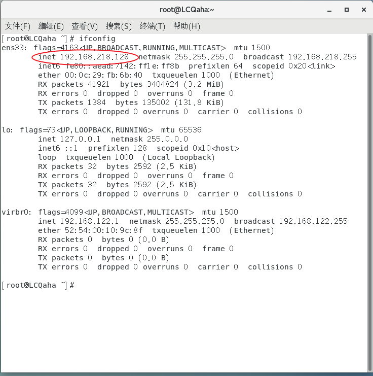
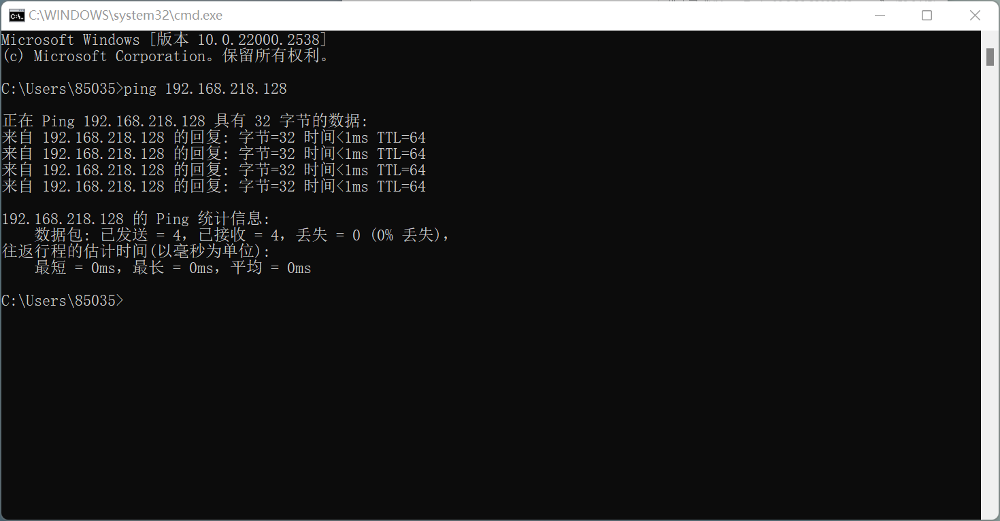
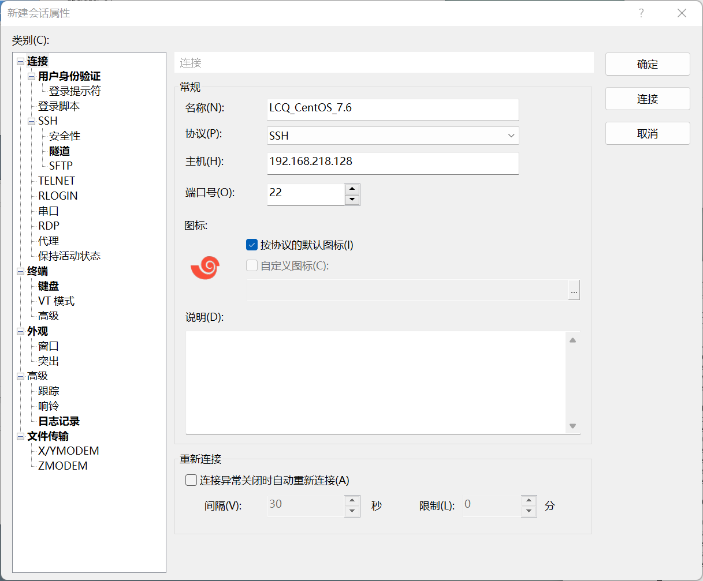
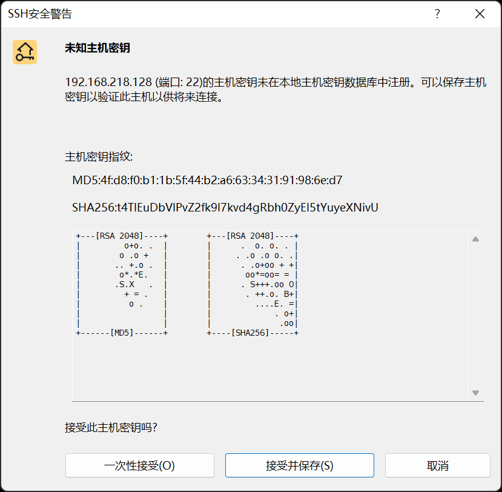
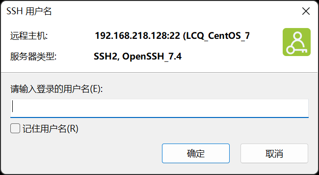
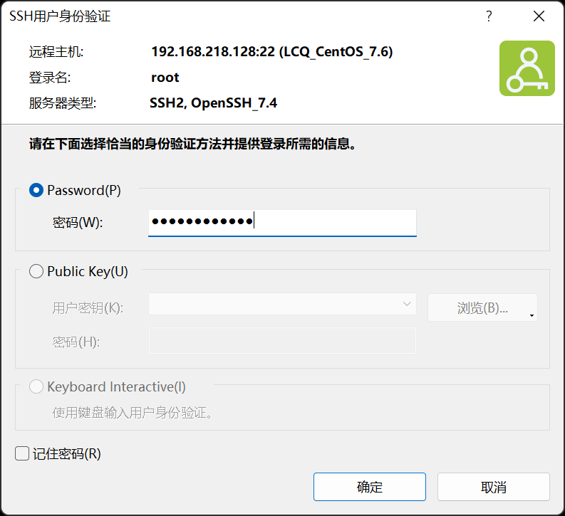
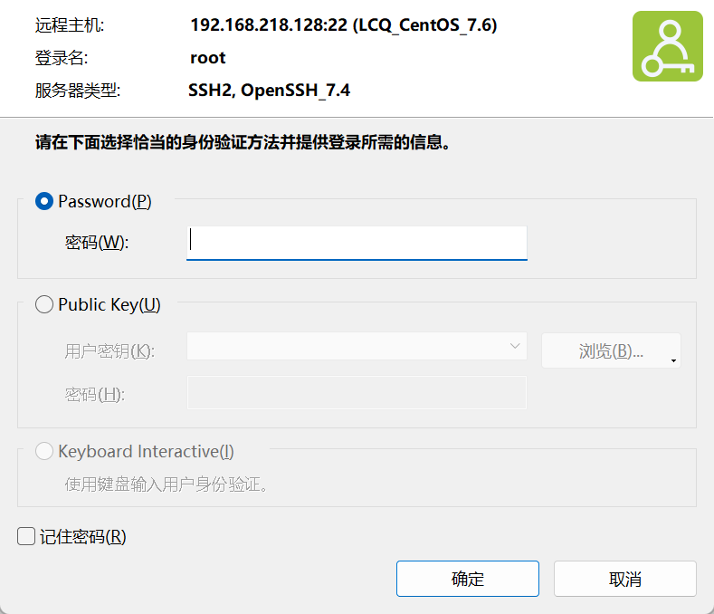
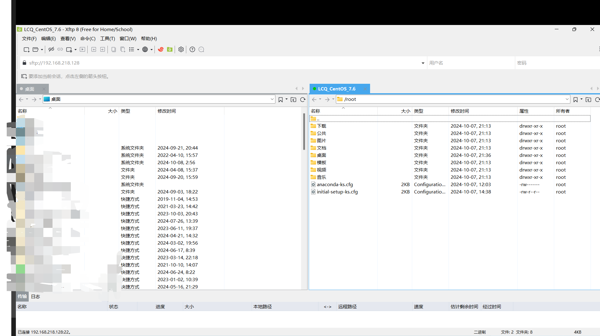

# 韩顺平 Linux 学习笔记

## PRE

[点击此处](https://www.kernel.org)进入 Linux 官网。

Linux 发行版

- Ubuntu
- RedHat
- CentOS
- Debain
- Fedora
- SuSE
- OpenSUSE

Unix
来自贝尔实验室，linux 是受其创始人开源精神感召创作的（ GNU/Linux 内核）。
[点击此处](https://www.bilibili.com/video/BV1Sv411r7vd/?p=4&share_source=copy_web&vd_source=d2703b4814ac43d97585ae499ae4f355)听故事

### 课程大纲

1. 基础篇
2. 实际操作篇
3. 高级篇
4. Java 定制篇
5. 大数据定制篇
6. python 定制篇
7. 企业面试题讲解篇

基于：centOS 7.6

### 详细内容

1. **基础篇**
   Linux 入门
   vm 和 Linux 的安装
   Linux 目录结构
2. **实际操作篇**
   远程登录（XShell XFtp）
   实用指令
   进程管理
   用户管理
   Vi 和 Vim 编辑器
   定时任务调度
   RPM 和 Yum
   开机、重启和用户登录注销
   磁盘分区、挂载
   网络配置
3. **高级篇**（面试常客）
   日志管理
   Linux 内核源码&内核升级（阅读 linux v0.01 源码，约 10000 行）
   定制自己的 Linux
   Linux 备份与恢复
   Linux 可视化管理工具 webmin 和 bt 运维工具
   Linux 入侵检测&权限划分&系统优化
   Linux 面试题
4. **Java 定制篇**
   搭建 JavaEE 开发环境
   - JDK 安装
   - IDEA 安装
   - Tomcat 安装
   - MySQL 安装
5. **大数据定制篇**
   Shell 编程
   - 概述
   - Shell 脚本执行方式
   - Shell 变量
   - 运算符
   - 条件判断
   - 流程控制
   - 函数
   - 定时维护 MySQL 数据库
6. **python 定制篇**
   Python 专业开发平台-Ubuntu
   Ubuntu 下开发 Python 开发环境
   APT 软件管理和远程登录

### 建议掌握

1. 基本操作命令
2. Linux 各种配置（环境变量、网络、服务等）
3. 搭建开发环境（`Javaee`、`Python`、大数据等）
4. 写一些基本的 Shell 脚本
5. 安全设置
6. 理解 Linux 内核，熟练掌握大型网站应用框架的组成并熟悉各个环节的部署与维护

### 学习方法论

1. 首先建立整体框架，不要死抠细节
2. 不需要掌握所有指令，但要掌握查询方法（手册、百度等）
3. 先学怎么做，再想为什么。（先动手，先实践）
4. Linux 不是编程，重点是实际操作（熟练掌握常用指令，有利于面试和实际项目）

### 使用场景

Linux 运维工程师

- 服务器规划
- 调试优化
- 日常监控
- 故障处理
- 数据备份/恢复
- 管理集群

Linux 嵌入式工程师

- 各种驱动开发
- 嵌入式场景下开发

场景

1. JavaEE
2. 大数据
3. PHP
4. Python
5. Go
6. C/C++

领域

- 个人桌面
- 服务器
- 嵌入式（优势：内核小。物联网趋势会带来更广阔的应用）

### 视频课程分 p

P3-P85 linux 基础篇
P86-P90 java 定制篇
P91-P107 大数据 shell 篇
P108-P115 python 定制篇
P117-P141 linux 高级篇
P142-P153 面试题

## 开始使用 Linux

### 安装

安装有两个选择，找一台新电脑，或者安装虚拟机。课程使用的是虚拟机

#### 安装 virtual machine

由于 VMware 团队已经被博通收购，故软件需进入博通官网下载。
博通账号注册请参照：[博通账号注册流程](./support/博通账号注册流程.md)

1. 下载：
   [1] [博通官网](https://support.broadcom.com/group/ecx/productdownloads?subfamily=VMware%20Workstation%20Pro)（需先登录）
   
   [2] [百度网盘链接](https://pan.baidu.com/s/1DSZhV3sdpy6g-exV-wpa8w?pwd=aaee)

2. 安装步骤：

   - 进入 BIOS，开启虚拟化设备支持（如果能直接安装成功，则跳过此步骤）
     [查看教程](https://jingyan.baidu.com/article/ab0b56305f2882c15afa7dda.html)
   - [安装](./support/VMware_install_guide.md)（暂时没写，这里是空的，无脑下一步就完事了，在填写许可证时，选择个人用途即可）

#### 安装 CentOS 7.6/8.1

1. 参考链接：

   - [CSDN：深入浅出 Linux 操作系统虚拟机环境下载安装](https://blog.csdn.net/Augenstern_QXL/article/details/122251037)
   - [阿里云镜像站关于 CentOS 的镜像介绍](https://developer.aliyun.com/mirror/centos) （CentOS 已经不再维护，这里有一些相关操作指南）
   - [阿里云镜像站 CentOS 过期源相关说明](https://developer.aliyun.com/mirror/centos-vault)

2. 下载 CentOS

   - [CentOS 7.6](https://mirrors.aliyun.com/centos-vault/7.6.1810/isos/x86_64/CentOS-7-x86_64-DVD-1810.iso)
   - [CentOS 8.1](https://mirrors.aliyun.com/centos-vault/8.1.1911/isos/x86_64/CentOS-8.1.1911-x86_64-dvd1.iso)
   - [百度网盘链接](https://pan.baidu.com/s/1t0em_yy0gDD90QUMNO5o6Q?pwd=26yf)

3. **虚拟机相关操作**（新建、克隆、快照、迁移与删除等）

   - [参考教程](./support/VMware_system_guide.md)

#### 安装 vmtools

1. 特点

   - 安装后，可以在 Windows 环境下更好的管理 vm 虚拟机。
   - 可以设置 Windows 和 CentOS 的共享文件夹。

2. 安装

   - 将 VMware Tools ISO 镜像挂载到虚拟机中。
     由于版本更新，`虚拟机-重新安装VMware Tools`可能无法直接安装，需要手动下载光盘映像后，在`设置`中链接下载的 iso 文件，然后执行接下来的操作。
   - 复制`VMwareTools-10.3.26-22085142.tar.gz`到`主文件夹-其他位置-计算机-opt`目录下。
   - 打开终端，输入如下代码：

     ```sh
     cd /opt                                            # 切换到 opt 目录
     ls                                                 # 查看当前目录下文件
     tar -zxvf VMwareTools-10.3.26-22085142.tar.gz      # 解压文件
     ls                                                 # 查看当前目录下文件
     cd vmware-tools-distrib                            # 切换到解压出的目录
     ./vmware-install.pl                                # 启动目录下的安装程序
     ```

   - 开始安装，一路回车即可。（可能最后会有一个问你是否卸载的选项，要选`no`，我还没遇到）

3. 使用
   - 在虚拟机菜单中`右键-设置-选项-共享文件夹`中，选择`总是启用`，然后添加一个在主机上的文件夹路径即可。
   - 通过`主文件夹-其他位置-计算机-mnt-hgfs`下可以看到共享的文件夹。
   - **注意**：真实的生产环境仍有区别，实际环境中需要使用**远程方式登陆**访问文件。

### 一些常用指令

```sh
pwd
ls
clear

```

## 目录结构

Linux 采用的**层式树状目录结构**，在实际生产环境中，我们是看不到图形化界面的，只能通过命令行进行操作，因此了解目录结构十分重要。

与 windows 不同的是，linux 的目录是已经被规划好了的，根目录（命令行中为`~`，图形界面中为`主文件夹`）下的每一个目录都有自己的任务。

**在 Linux 中，一切皆为文件。** 哪怕是一个硬件，在 linux 中也会被映射为一个文件。建议把根目录下的第一层的文件结构名称**全部背过**。

1. `/bin`（常用）
   意为`Binary（二进制）`，分为：`/usr/bin`、`/usr/local/bin`等，用于存放常用命令（如`cd`、`ls`、`pwd`等）。

2. `/sbin`（常用）
   `s`意为`super`，即系统管理员。分为：`/usr/sbin`、`/usr/local/sbin`等，用于存放系统管理员使用的命令与程序。
3. `/home`（常用）
   存放普通用户主目录，每个用户的目录相互独立，一般以用户的账号名命名。
4. `/root`（常用）
   系统管理员（超级权限用户）主目录
5. `/lib`
   意为`library（库）`。动态链接共享库，是开机所需的基本库，几乎所有应用程序都会用到这个库。
6. `/lost+found`
   意为`丢失与发现`。一般是空的，当系统非法关机时会存放一些文件。
   这个目录在图形化界面中时隐藏的，需要通过`ls`指令查看。
7. `/etc`（常用）
   源自拉丁语`Et cetera`，意为`以及其他`或`等`。系统管理所需配置文件和子目录，比如安装 mysql 数据库 `my.conf`。
8. `/usr`（常用）
   意为`user（用户）`。用于存放用户的应用程序和文件，类似于 Windows 的`C:\Program Files`。
9. `/boot`（常用）
   存放启动 Linux 时的核心文件。
10. `/proc`
    **别动它**。意为`process（进程）`。是一个虚拟目录，是系统内存的映射，访问这个目录来获取系统信息
11. `/srv`
    **别动它**。意为`service（服务）`，用于存放服务启动后需要提取的数据。
12. `/sys`
    **别动它**。Linux2.6 之后的内核所带的功能，此目录下安装了一个文件系统`sysfs`。
13. `/tmp`
    存放临时文件
14. `/dev`
    意为`device（设备）`，将所有硬件以文件形式存放于本目录下。
15. `/media`（常用）
    系统识别的一些外部媒体（如：光驱、U 盘等）挂载于这个目录下
16. `/mnt`（常用）
    意为`Mount（挂载）`，用于临时挂载别的文件系统，比如将共享文件夹挂载于此目录下的`hgfs`下
17. `/opt`
    意为`Optional（可选择的）`，默认为空，主机额外安装软件所存放的目录（是安装软件，不是安装好的软件）。放在别的目录下进行安装也可以，但这是一种约定俗成的方式，方便自己也方便别人。
18. `/usr/local`（常用）
    给主机额外安装软件的安装目录（安装好的软件），一般通过编译源码的方式安装程序。
19. `/var`（常用）
    意为`variable（变量数据）`，一般习惯将经常被修改的目录放在这个目录下，如各种日志。
20. `/selinux [security-enhance linux]`
    安全子系统，有三种工作模式，控制程序只能访问特定的文件。

## 远程登录

开发时的实际场景，应当是开发小组共享 Linux 服务器，正式上线的项目运行于公网，此时需要远程登录服务器，以方便开发。

### 软件（施工中……）

1. Xshell （用于远程登录）
   [free-for-home-school](https://www.netsarang.com/en/free-for-home-school/)
2. Xftp （用于文件传输）
3. [百度网盘资源](https://pan.baidu.com/s/14sh6Jx0jNJekzR0epgrdgQ?pwd=yxsm)

### 使用

1. XShell
   - 获取虚拟机 IP 地址：
     在终端中输入命令 `ifconfig`，即可获得 IP 地址。（如下图所示）
     
   - 测试延迟
     在 Windows 中使用指令`ping xxx.xxx.xxx.xxx`（具体值取决于 IP 地址）测试延迟。
     
   - 远程登录
     打开 XShell，新建一个会话，输入名称和主机 IP（虚拟机的 IP）。
     
     第一次打开会话时，会提示你`未知主机密钥`，这里我们选择`接受并保存`。
     
     输入用户名和密码，即可登录。
     
     
     然后即可在软件中输入 Linux 命令，进行操作。
     
2. Xftp

   - 像之前一样，输入 IP、输入账号密码。（按图中配置来，千万不要自作聪明改配置）
     
     

   - 将想要传输的文件`右键-传输`即可将文件传到对应的目录。
     
   - 如果文件名出现乱码，可以通过`文件-当前会话属性-选项-编码`改为`UTF-8`解决。

### 千万不要试

1. 使用指令实现远程控制
   在 XShell 中输入`reboot`，你会发现虚拟机中的系统重启了。

## Vi、Vim 快速入门

Linux 系统内置 Vi 文本编辑器。
Vim 具有编程能力，可以看做 Vi 的增强版，可以以字体颜色辨认语法正确性，还具有代码补完、编译、错误跳转等功能。

### 三种模式

1. 正常模式
   可以移动光标、使用`删除字符`、`删除整行`、`复制`、`粘贴`等功能。
2. 插入模式（编辑模式）
   按下`i`,`I`,`o`,`O`,`a`,`A`,`r`,`R`任意一个按键即可进入插入（编辑）模式，一般按`i`即可。
3. 命令行模式
   可以输入指令完成`读取`、`存盘`、`替换`、`离开Vim`、`显示行号`等动作。

### 快捷键

1. `ESC`：转回正常模式
2. `:` or `/`：转到命令行模式
3. 一些命令
   ```vim
   :wq  保存并退出
   :q   退出
   :q!  强制退出，不保存
   ```
4. 快捷键
   - 拷贝当前行：`yy`；拷贝当前行向下 5 行：`5yy`；
   - 将复制内容粘贴到当前行之下：`p`；
   - 删除当前行：`dd`；删除当前行向下 5 行：`5dd`；
   - 查找单词`word`：在命令行输入`/word`，按回车开始查找，按`n`查找下一个。查找到最后一个时，下一个会跳至第一个结果。`Shift+n`查找上一个。
   - 设置/取消文件行号
     显示：`:set nu`；取消：`:set nonu`。
   - 定位到文档开头/末尾
     开头：`gg`；末尾：`G`。
   - 撤销动作（输入字符、复制、粘贴等操作）：在正常模式下输入`u`。
   - 恢复：`Ctrl+r`。这两条命令加上数字可以进行批量撤销/恢复。
   - 定位文件位置，在一般模式下输入`xx+Shift+g`，即可快速定位到`xx`行。

### 举个例子

1. 用 Vim 编辑器编写一个`Hello.java`程序。

   - 输入指令

     ```sh
     vim Hello.java
     ```

   - 刚进入 Vim 编辑器是正常模式，按`i`转到插入模式。

   - java 代码如下：

     ```java
     public class Hello {
        public static void main(String[] args) {
           System.out.println("Hello, world!");
        }
     }
     ```

   - 存盘需要切换到命令行模式。
     先按`esc`，再输入：

     ```sh
     :wq         # w write, q quit
     ```

## 开机、重启和用户登录注销

### 开关机指令

```sh
shutdown -r now      # 立即重启，-r表示reboot
shutdown -h now      # 立即关机
shutdown -h 1        # 1分钟后关机；-h表示halt
shutdown             # 1分钟后关机，上面一行相当于shutdown的默认值

halt                 # 关机
reboot               # 重启
sync                 # 将内存数据同步到磁盘
```

**注意**：`shutdown`/`reboot`/`halt`均会自动执行`sync`，但希望学习的诸位养成一个习惯，写一下`sync`这条指令，小心驶得万年船。

### 登陆与注销

- 原则上不应使用 root 账号登录。
- 普通用户可以输入指令`su - username`，以`username`切换用户身份登录，如果切换的是系统管理员 root，输入密码后也可以获得命令行 root 权限。
- 输入`logout`注销用户（退出）（在图形界面下，此命令无效）
- 用户切换是一个链式结构，如果你在 A 用户下切换到 B 用户，然后再切换到 C 用户，即`A->B->C`这时在 C 下执行`logout`会退到 B 用户，当在 A 下`logout`会直接退出系统。

### 用户管理

1. 添加和删除用户
   Linux 操作系统是多任务多用户的操作系统，每一个用户拥有一个自己的目录，每一个要使用系统资源的用户都需要向系统管理员申请一个账号。

   ```sh
   useradd aha                      # 创建用户aha
   useradd -d /home/test ahooo      # 创建用户aho，并设置家目录为/home/test

   passwd aha                       # 修改用户aha的密码，如果不写用户名则默认修改当前用户的密码
                                    # 如果密码无效，再输入一遍就可以了

   userdel aha                      # 删除用户aha，但保留他的家目录
   userdel -r aha                   # 删除用户aha，并删除他的家目录 r remove
                                    # 如果要删除家目录，一定要慎重这会三组该用户所有工作成果

   ```

2. 查询用户信息

   ```sh
   id <username>                 # 查询用户信息（uid,gid,组名），若不存在目标用户，返回‘不存在’
   su - <username>               # 切换用户
                                 # 从权限高的用户向权限低的用户切换不需要输入密码，反之需要。

   whoami                        # 查看当前用户
   who am i                      # 同上
   ```

3. 用户组
   如果几位用户同属同一个工作小组，拥有相同的全线，那么可以将这些用户归到一个组中。

   ```sh
   groupadd <groupname>                   # 创建用户组
   groupdel <groupname>                   # 删除用户组

   useradd -g <groupname> <username>      # 将用户加入组，若不指定组，则会创建一个名为<username>的组
   usermod -g <groupname> <username>      # 将用户从当前组中移除，并加入到指定的组中

   ```

4. 用户和组的相关文件

   - `/etc/passwd`: 用户配置文件，记录各种用户信息。
     显示格式：`用户名:口令（加密）:用户标识号:组标识号:注释性描述:主目录:登录shell`
     对应标识：`<username>:<password>:<uid>:<gid>:<comment>:<home directory>:<login shell>`
     `login shell`: 用户使用的 Shell，用于翻译指令，如`Bash`。
   - `/etc/shadow`: 密码文件，记录密码的加密方式。
     显示格式：`登录名:加密口令:最后修改密码时间:最小时间间隔:最大时间间隔:警告时间:不活动时间:失效时间:标志`
   - `/etc/group`: 用户组文件，记录用户组信息。
     显示格式：`组名:密码:组ID:用户列表`

## 实用指令

### 指定运行级别

<a id="useful-commands"></a>

1. 运行级别介绍

   - 0：关机。系统停机状态，系统默认运行级别不能设为 0，否则不能正常启动。
   - 1：单用户工作状态，root 权限，用于系统维护，禁止远程登录。（可用于找回密码）
   - 2：多用户状态（无 NFS），但无网络服务
   - 3：完全的多用户状态（有 NFS ），登录后进入控制台命令行模式，有网络服务。
   - 4：保留级别
   - 5：X11 控制台，登录后进入图形 GUI 模式。（图形界面）
   - 6：系统正常关闭并重启，默认级别不能设置为 6。

   常用的运行级别是 3 和 5。
   也可以指定默认运行级别。

   开机流程：
   `开机->BIOS->/boot->system进程(pid=1)->运行级别->运行当前级别对应的服务`

2. 命令
   ```sh
   init [0123456] # 切换到指定的运行级别
   ```
3. 设置默认运行级别
   在`/etc/inittab`找到如下选项作出更改：

   - CentOS 7 以前

     ```sh
     analogous to runlevel [0123456]   # 设定默认运行级别
     ```

   - CentOS 7 及以后
     ```sh
     multiuser.target           # 设定默认运行级别为3（多用户模式）
     graphical.target           # 设定默认运行级别为5（图形界面）
     ```
   - 也可以通过指令：

     ```sh
     # 查看当前默认运行级别
     systemctl get-default

     # 设定默认运行级别
     systemctl set-default TARGET.target    # TARGET处填写具体运行模式
     multiuser.target           # 设定默认运行级别为3（多用户模式）
     graphical.target           # 设定默认运行级别为5（图形界面）
     #systemctl 可以理解成system control

     ```

     `TARGET`可填内容：

     - `multi-user.target`：多用户模式，级别 3。
     - `graphical.target`：图形界面

### 帮助指令

1. man 命令

   ```sh
   man [命令或配置文件]       # 查看帮助信息
   man ls                  # 查看ls命令的帮助信息
   ```

2. help 命令
   ```sh
   help [命令]              # 获得Shell内置的命令帮助信息
   ```

### 文件目录指令

1. `pwd`命令
   用于显示当前工作目录的绝对路径。
   绝对路径：从根目录开始，到当前目录的路径。如`/opt/test`
   相对路径：从当前目录开始，到目标文件的路径。如位于`opt`目录下，`test`
2. `ls`命令

   ```sh
   ls [选项] [目录]         # 显示目录下的文件列表

   # 在 linux 中，隐藏文件是`.*`的形式。

   ls -a       # 查看所有文件（包括隐含文件）all
   ls -l       # 查看文件详细信息（按列显示）list
   ls -la      # 查看文件详细信息（按列显示，包括隐含文件）
               # 指令可以组合

   ls -h       # 显示文件大小，以易读的方式显示（如：1K、1M、1G） h human
   ```

   常用选项：

   - `-a`：显示所有文件，包括隐藏文件。
   - `-l`：显示详细信息，包括文件类型、权限、所有者、大小、修改时间等。

3. `cd`命令

   ```sh
   cd [目录]                # 切换到指定目录
   cd ~                    # 切换到用户家目录
                           # root会回到root目录，其他用户会回到/home/<username>目录

   cd ..                   # 返回上一级目录

   # 从‘/home/<username>’使用相对路径进入'/root'
   cd ../../root
   ```

4. `mkdir`命令

   ```sh
   mkdir [选项] [目录名]           # 创建目录

   mkdir -p /tmp/a/b/c     # 创建多级目录
   mkdir /tmp/a            # 在指定位置创建目录

   ```

5. `rmdir`命令

   ```sh
   rmdir [选项] [目录名]       # 删除目录（目标目录必须为空）

   rmdir /tmp/a            # 删除指定目录

   rm -rf /tmp/a           # 强制删除（不需要为空）
                           # r代表递归，f代表强制
                           # 递归删除可以删除非空目录，强制删除不会有删除询问。
   ```

6. `touch`命令
   用于在指定位置创建空文件

   ```sh
   touch [文件名]       # 在当前目录创建空文件
   ```

7. `cp`命令

   ```sh
   cp [选项] source dest         # dest destination

   cp hello.c /home/aha        # 将hello.c文件复制到‘/opt/aha’目录下（前提是目录存在）

   cp -r /home/aha/ /opt/        # 将'aha'目录全部拷贝到'opt'目录

   \cp -r /home/aha/ /opt/       # 直接覆盖目标文件，不再询问
   ```

8. `mv`命令

   - 重命名
   - 移动文件

   ```sh
   mv oldNameFile newNameFile    # 重命名文件
   mv /home/aha/hello.c /opt   # 将'aha'目录下的hello.c文件移动到'opt'目录下

   mv /abc/ /opt                # 将'abc'目录移动到'opt'目录下
   mv /abc/ /opt/abc2           # 将'abc'目录移动到'opt'并重命名为'abc2'
   ```

9. `cat`命令
   相比于`vim`，`cat`只能查看不能修改，更加安全。

   ```sh
   cat [选项] [文件名]

   cat -n [文件名]      # 显示文件内容，并显示行号

   # 为了浏览方便，一般会带上管道命令 '|more'
   cat [文件名] | more
   ```

10. `more`命令
    是一个基于 Vi 编辑器的文本过滤器，用于浏览文件。

    ```sh
    more [文件名]
    ```

    |      操作       |         功能说明         |
    | :-------------: | :----------------------: |
    | `space`（空格） |        向下翻一页        |
    |     `Enter`     |        向下翻一行        |
    |       `q`       |           退出           |
    |    `Ctrl+f`     |       向下滚动一屏       |
    |    `Ctrl+b`     |       向上滚动一屏       |
    |       `=`       |     输出当前行的行号     |
    |      `:f`       | 输出文件名和当前行的行号 |

11. `less`命令
    如果使用`vi`或`more`命令，系统会将整个目标文件加载进内存中，若文件较大，则加载较慢。而`less`命令则只加载当前屏幕大小的内容，不会将整个文件加载进内存。

    |      操作       |                       功能说明                       |
    | :-------------: | :--------------------------------------------------: |
    | `space`（空格） |                      向下翻一页                      |
    |   `PageDown`    |                      向下翻一页                      |
    |    `PageUp`     |                      向上翻一页                      |
    |     `/str`      | 向下查找字符串`str`；<br> `n`向下查找，`N`向上查找。 |
    |     `?str`      | 向上查找字符串`str`；<br>`n`向上查找，`N`向下查找。  |
    |       `q`       |                         退出                         |

12. `echo`命令
    输出内容到控制台。

    ```sh
    echo [选项] [输出内容]

    echo $PATH          # 输出PATH环境变量
    echo $HOSTNAME      # 输出主机名

    echo "hello world"  # 输出字符串
    ```

13. `head`命令
    ```sh
    head [文件名]          # 显示文件开头10行
    head -n 5 [文件名]     # 显示文件开头5行
    ```
14. `tail`命令

    ```sh
    tail [文件名]          # 显示文件结尾10行
    tail -n 5 [文件名]     # 显示文件结尾5行
    tail -f [文件名]       # 实时显示文件内容，文件内容有更新时，屏幕也会更新。
                          # 追踪文件内容时，终端不能进行输入。

    ```

15. `>`、`>>`命令

    ```sh
    echo "hello world" > hello.txt      # 将字符串在命令行输出，并写入文件（覆盖原有内容）
    echo "hello world" >> hello.txt     # 将字符串在命令行输出，并写入文件（追加内容）

    ls -l > list.txt                    # 将ls命令的输出写入文件

    cat list.txt > hello.txt            # 将list.txt的内容写入hello.txt

    cal > cal.txt                       # 将日历输出到文件 cal calendar
    ```

    - `>`：重定向。
    - `>>`：追加

16. `ln`命令
    软链接，类似于 Windows 下的快捷方式`*.lnk`。
    在`ls -l`结果中，包含`->`的就是软链接。
    `cd`到软链接会直接转到链接的目录。

    ```sh
    ln -s [文件/目录] [链接名（相对或绝对路径）]         # 创建软链接 s soft
    ```

    **注意**：在删除软链接时，千万不要使用`rm -rf`。

    ```sh
    ln /root /home/my_root
    rm  /home/my_root   # 删除对应软链接
    rm  /home/my_root/   #会提示你删除的是一个目录，这时‘rm -rf’会删除真的root目录

    ```

17. `history`命令
    查看/执行 已经执行过的命令。
    ```sh
    history             # 查看所有历史命令
    history 10          # 查看最近10条命令
    !5                  # 执行曾经执行的第5条命令
    ```

### 时间日期类

1. `date`命令

   ```sh
   date                     # 显示当前时间
   date +%Y                 # 显示当前年份
   date +%m                 # 显示当前月份
   date +%d                 # 显示当前是哪一天
   date "+%Y-%m-%d %H:%M:%S"  # 显示当前日期和时间

   date -s "2018-01-01 12:00:00"   # 设置时间

   ```

2. `cal`命令
   ```sh
   cal [选项]               # 不加选项则显示当前月的日历
   cal 2020                # 显示2020年日历
   ```

### 搜索查找类

1. `find`命令

   ```sh
   find [搜索范围] [选项]
   find / -name "*.txt"    # 在根目录下搜索所有文件名包含.txt的文件
   find / -user LCQ         # 搜索当前用户的所有文件
   find / -size +100M      # 搜索大于100M的文件 + 表示大于，-表示小于

   find / -name "*.txt" |more # 分页显示

   ```

2. `locate`命令
   用于快速定位文件路径
   这条指令无需遍历整个文件系统，而是通过自己的数据库进行检索，速度较快。
   第一次使用前，需`updatedb`更新数据库

   ```sh
   updatedb
   locate [文件名]       # 搜索文件

   ```

3. `which`命令
   查看一个指令存放于什么目录

   ```sh
   which [指令名]       # 查看指令存放路径


   [root@LCQaha /]# which ls
   alias ls='ls --color=auto'
      /bin/ls
   [root@LCQaha /]# which reboot
   /sbin/reboot
   [root@LCQaha /]#
   ```

4. `grep`命令
   过滤查找，常与管道符号`|`结合使用。
   管道符`|`会将前一个指令的输出作为下一条指令的输入。

   ```sh
   grep [选项] [要查找的字符串] [文件名]

   grep -n              # 显示匹配行及行号
   grep -i              # 忽略大小写

   cat hello.txt | grep "hello"     # 在hello.txt文件中查找字符串hello

   ```

### 压缩解压类

1. `gzip`、`gunzip`命令
   `gzip`压缩文件，`gunzip`解压文件。
   ```sh
   gzip [文件]                   # 将文件转换为[文件.gz]
   gunzip [文件].gz              # 将文件转换为[文件]
   ```
2. `zip`、`unzip`命令
   `zip`压缩文件，`unzip`解压文件。
   `gzip`常用于文件，而`zip`常用于文件夹。

   ```sh
   zip [选项] [压缩包名].zip [文件/文件夹]
   unzip [选项] [压缩包名].zip

   zip -r                   # 递归压缩，不递归则只压缩目录本身。
   unzip -d <dir>           # 解压到指定目录

   ```

3. `tar`命令
   打包指令，会打包出`*.tar.gz`文件。

   ```sh
   tar [选项] *.tar.gz [打包内容]

   tar -c                 # 产生.tar打包文件    （建包）
   tar -v                 # 显示详细信息
   tar -f                 # 指定压缩后文件名    （指定文件名）
   tar -z                 # 打包同时压缩        （压缩或解压）
   tar -x                 # 解包文件            （解包）

   # 将多个文件打包并压缩(z)，指定压缩后文件为<gz_name>(f)，显示详细信息(v)
   tar -zcvf <gz_name>.tar.gz <dir1> <dir2> ...

   tar -zxvf <gz_name>.tar.gz <dir>    # 解压到指定目录
   ```

## 组管理与权限管理

### 组

1. Linux 中，每一个用户必须属于一个组。
2. Linux 中每一个文件都有所有者、所在组、其他组的概念。（？？？）
3. 当用户创建了一个文件，其属于用户所在组。之后修改时，这两个概念可独立修改。
4. 除文件从属的组，均为其他组。

```sh
ls -ahl                      # 可以显示文件所有者
ll                           # 同上

chown [用户名] [文件名]        # 修改文件所有者

groupadd [组名]               # 创建组
useradd -g [组名] [用户名]    # 将用户加入组

chgrp [组名] [文件名]         # 修改文件所在组

usermod -g [组名] [用户名]    # 修改用户所在组
                            # 该组须存在
cat /etc/group               # 查看所有已有组


usermod -d [目录名] [用户名]  # 修改用户主目录（初始登录目录）
                            # 用户需拥有进入新目录的权限


```

### 权限

先来看一段数据：

```sh
[root@LCQaha /]# ll
总用量 68
lrwxrwxrwx.   1 root root     7 10月  7 11:56 bin -> usr/bin
dr-xr-xr-x.   6 root root  4096 10月 13 10:41 boot
drwxr-xr-x.  19 root root  3260 10月 14 09:46 dev
drwxr-xr-x. 144 root root 12288 10月 16 10:31 etc
drwxr-xr-x.   4 root root  4096 10月 15 21:49 home
lrwxrwxrwx.   1 root root     7 10月  7 11:56 lib -> usr/lib
lrwxrwxrwx.   1 root root     9 10月  7 11:56 lib64 -> usr/lib64
drwx------.   2 root root 16384 10月  7 11:55 lost+found
drwxr-xr-x.   2 root root  4096 4月  11 2018 media
drwxr-xr-x.   3 root root  4096 10月  7 21:51 mnt
drwxr-xr-x.   7 root root  4096 10月 15 21:59 opt
dr-xr-xr-x. 245 root root     0 10月 14 09:46 proc
dr-xr-x---.  16 root root  4096 10月 16 12:19 root
drwxr-xr-x.  42 root root  1280 10月 16 10:31 run
lrwxrwxrwx.   1 root root     8 10月  7 11:56 sbin -> usr/sbin
drwxr-xr-x.   2 root root  4096 4月  11 2018 srv
dr-xr-xr-x.  13 root root     0 10月 14 09:46 sys
drwxrwxrwt.  35 root root  4096 10月 16 13:09 tmp
drwxr-xr-x.  13 root root  4096 10月  7 11:56 usr
drwxr-xr-x.  21 root root  4096 10月  7 14:02 var
```

#### rwx 权限

这段数据中，每一条信息前都有 10 位字符组成，现在来介绍其含义。
我们以 0~9 标记这 10 位。

1. 第`0`位代表：文件类型(d,-,l,c,b)
   - d：目录
   - l：链接（快捷方式）
   - c：字符设备文件（鼠标、键盘等）
   - b：块设备文件（硬盘、光驱等）
2. 第`1~3`位代表：所有者权限。
3. 第`4~6`位代表：所在组权限。
4. 第`7~9`位代表：其他用户权限。

**这些字母代表的就是用户对文件操作的 rwx 权限，分别对应读(r,read)、写(w,write)、执行(x,execute)。**

1. 作用于目录

   - r 权限：可以读取，使用`ls`查看其中的文件
   - w 权限：可以修改文件内容，对目录内创建、删除、重命名目录
   - x 权限：可以进入目录，执行文件

2. 作用于文件

   - r 权限：可以读取文件内容
   - w 权限：可以修改文件内容，但不能删除，删除需要取得对目录的 w 权限。
   - x 权限：可以执行。

3. rwx 权限还可以用数字表示：r=4,w=2,x=1，若拥有这三个权限，则表示为 4+2+1=7。（即三位二进制数）

4. 一些杂例
   - 当用户对一个目录拥有`--x`（仅执行）权限时，可以打开此目录，但无法读取此目录（无`r`），也无法修改其中文件的名字（无`w`），**但可以打开其中的文件/目录**。

#### 其他信息

其他信息表示如下（以第一行数据为例）：

```sh
lrwxrwxrwx.   1 root root     7 10月  7 11:56 bin -> usr/bin
```

从左至右依次为：

1. `lrwxrwxrwx.`：类型与 rwx 权限
2. `1`：硬链接数（目录下的文件与目录数量）
3. `root`：所有者
4. `root`：所在组
5. `7`：大小（字节数，若为目录则显示 4096）
6. `10月  7 11:56`：创建时间
7. `bin -> usr/bin`：名称，这里是软链接，会指向真正的链接。

#### 修改权限

使用`chmod`修改文件或目录的权限

1. 使用`+`、`-`、`=`变更权限
   ```sh
   chmod u=rwx,g=rx,o=x [文件/目录]      # 添加权限,u=用户，g=所在组，o=其他用户
   chmod o+w [文件/目录]                 # 为其他用户添加写权限
   chmod a-x [文件/目录]                 # 删除所有用户执行权限 a=所有用户
   ```
2. 通过数字变更权限

   ```sh
   chmod u=7,g=6,o=5 [文件/目录]       # u=b(111),g=b(110),o=b(101)
                                      # 赋予所有者读写执行权限
                                      # 所在组读写权限
                                      # 其他用户执行权限
   chmod 765 [文件/目录]               # 作用同上
   ```

### 修改文件所有者、所在组

1. `chown`命令

   ```sh
   chown [用户名] [文件名]               # 修改文件所有者
   chown -R [用户名]:[组名] [文件名]     # 修改文件所有者和所在组 R,递归

   ```

2. `chgrp`命令

   ```sh
   chgrp [组名] [文件名]         # 修改文件所在组（前提是组存在）
   chgrp -R [组名] [文件名]       # 修改文件所在组和所在组所有文件

   ```

   **注意**：

- 更改用户组后，可能无法立即生效，需要被更改的用户重新登陆。

## crond 基础（定时任务调度）

### 快速入门

Linux 中有一个 crond 后台程序，可以令系统在某一特定时间执行特定指令。
比如：

- 令系统在某一时间完成备份任务。
- 系统定时进行病毒扫描。

通过`crondtab`命令可以进行定时任务的设置

```sh
crondtab [选项]

crondtab -e          # 打开文本编辑器，编辑定时任务
crondtab -l          # 列出定时任务
crondtab -r          # 终止定时任务
service crond restart # 重启定时任务
```

1. 设置定时任务

   ```sh
   crontab -e     # 编辑定时任务
   ```

   输入如上命令后，会弹出一个文本编辑器，在当中编辑定时任务。

   ```text
   */1 * * * * ls -l /etc/ > /tmp/ls.txt
   ```

   上面文本的含义为：每隔一分钟，将`/etc`目录下的文件列表，保存到`/tmp/ls.txt`中。
   每一个`*`的位置都有自己的作用（这里的星号可以是数字或其他符号）：

   - 第一个`*`：表示每小时的第几分钟，取值 0~59。
   - 第二个`*`：表示每天第几小时，取值 0~23。
   - 第三个`*`：表示每月的第几天，取值 1~31。
   - 第四个`*`：表示每年的第几月，取值 1~12。
   - 第五个`*`：表示星期几，取值 0~7，1 为星期一，0/7 为星期日。

   **注意**：其中，天和星期可以同时存在，两者同时满足才会执行，但为了防止管理混乱，不建议这样写。

2. 特殊符号
   - `*`：代表任何时间，第一个`*`代表一小时中每分钟都执行一次
   - `,`：代表不连续的时间，如：`1,3,5`，表示在 1、3、5 三个时间点执行。
     如`0 8,12,16 * * *`代表指令在每天的 8:00、12:00、16:00 都执行。
   - `-`：代表连续的时间，如：`1-5`。
   - `*/n`：代表每 n 个时间执行一次，如：`*/2`，表示每两小时执行一次。
3. 借助脚本实现定时任务

   ```sh
   vim ~/myshell.sh        # 创建脚本文件（创建的脚本暂无可执行权限）
   chmod u+x ~/myshell.sh  # 为脚本增加可执行权限
   ~/myshell.sh            # 执行脚本

   ```

   以上是一个简单的创建、执行脚本的过程。
   脚本中的命令格式与命令行中相同。

   现在我们开始实现自动化（以每分钟一次为例）：

   ```text
   * * * * * /root/myshell.sh

   ```

### 一次性定时计划任务（at 命令）

1. 一些说明
   - `at`命令是一次性定时计划任务，`at`的守护进程`atd`以后台模式运行。
   - `atd`在默认情况下，每 60 秒检查一次作业队列，有作业时，检查作业运行时间，若时间匹配，则运行此作业。
   - `at`是一次性定时计划任务，执行完后就没了
   - **使用 at 命令时，务必保证 atd 进程启动，可通过以下命令查看：**
     ```sh
     ps -ef|grep atd
     ```
   - 编写任务时，若发生错误，须按`Ctrl+Backspace`退格。
2. 基本语法

   ```sh
   at [选项] [时间]     # 增加一个任务

   Ctrl+D            # 结束输入

   at 5pm+2 days      # 两天后的下午5:00执行
   >/bin/ls /home/    # 打印home目录下的文件
   # 按Ctrl+D 结束输入（两次）

   atq               # 查看待执行的任务

   # 明天下午5点钟，将时间存入指定文件
   at 5pm+1 tomorrow
   > date > /tmp/time.txt

   # 两分钟后写入
   at now + 2 minutes
   > echo "Hello World" > /tmp/hello.txt

   atrm [任务编号]         # 删除指定编号的任务
   ```

3. 指定时间的方式
   - `hh:mm`将在当天的 hh:mm 执行，若当天该时刻已过，则在第二天这个时刻执行。
   - 使用`midnight`（深夜）、`noon`（中午）、`teatime`（饮茶时间，一般指下午 4 点）等模糊词语指代
   - 采用 12 小时制，如：`12pm`
   - 指定具体日期，格式为`month day`（月 日）、`mm/dd/yy`（月/日/年）、`mm.dd.yy`（月.日.年）共计 3 种。如：`04:00 2024-10-17`
   - 相对计时法，`now + count time-unit`，如：`now + 1 hours`，表示在当前时间点之后 1 小时。
     单位：`minute`（分钟）、`hour`（小时）、`day`（日）、`week`（周）。
   - 直接使用`today`、`tomorrow`。
4. 选项
   |选项|含义|
   |:----:|:----:|
   |`-m`|指定任务执行完后，向用户发送邮件，即便没有标准输出|
   |`-I`|`atq`的别名|
   |`-d`|`atrm`的别名|
   |`-v`|显示任务将被执行的时间|
   |`-c`|打印任务内容到标准输出|
   |`-V`|显示版本信息|
   |`-q<队列>`|使用指定队列|
   |`-f<文件>`|从指定文件读入任务，而不是标准输入读入|
   |`-t<时间参数>`|以时间参数形式提交要运行的任务|

## 磁盘分区与挂载

1. 无论 Linux 有几个分区，供哪一个目录使用，归根结底都只有一个根目录，一个独立且唯一的文件结构，每个分区都是组成整个文件系统的一部分。
2. Linux 采用“载入”的方式将分区与目录联系起来。

### 磁盘分区

1. 一些说明
   - Linux 硬盘有 IDE 和 SCSI 两种，现在一般使用 SCSI。
   - 对于 IDE 硬盘，驱动器标识符为`hdx~`，`hd`代表硬盘类型 IDE，`x`代表盘号（a 为基本盘，b 为基本从属盘，c 为辅助主盘。d 为辅助从属盘），`~`为分区（用数字表示，1~4 为主分区或扩展分区，5 开始是逻辑分区）。
   - 对于 SCSI 硬盘，驱动器标识符为`sdx~`。
   - 例：`sdb3`指第二块 SCSI 硬盘的第 3 个分区。
2. 查看分区情况

   ```sh
   lsblk                   # 查看磁盘分区情况
   [root@LCQaha ~]# lsblk
   NAME   MAJ:MIN RM  SIZE RO TYPE MOUNTPOINT
   sda      8:0    0   20G  0 disk
   ├─sda1   8:1    0    1G  0 part /boot
   ├─sda2   8:2    0   17G  0 part /
   └─sda3   8:3    0    2G  0 part [SWAP]
   sr0     11:0    1 53.6M  0 rom

   ```

   - 设备名称|主设备号/次设备号|是否为可移除设备|大小|是否为只读设备|类型|挂载点
   - `sr0`为光驱

   ```sh
   lsblk -f            # 显示文件系统信息

   [root@LCQaha ~]# lsblk -f
   NAME   FSTYPE  LABEL        UUID                                 MOUNTPOINT
   sda
   ├─sda1 ext4                 18d0b2c9-6f23-4573-ad0c-e6d4104f67e4 /boot
   ├─sda2 ext4                 7e4c4154-a98a-4ab6-b394-7c5dfc25a3b0 /
   └─sda3 swap                 565d761c-4d5a-4d35-b1f5-4f5729ce0e52 [SWAP]
   sr0    iso9660 VMware Tools 2023-07-14-05-46-23-00
   [root@LCQaha ~]#

   ```

   - 分区情况|文件系统类型|设备标签|设备全局唯一标识符|挂载点

3. 添加一块硬盘

   - 虚拟机-设置-硬件-添加
   - 在向导中依次选择硬盘、SCSI、创建新的虚拟磁盘、输入大小。
   - 重启系统以识别新硬件，然后通过`lsblk`可以看到新硬件
     但由于硬盘还没有进行分区，所以只能看到硬盘本身。
   - 分区

     ```sh
     fdisk /dev/sdb           # 将sdb进行分区操作

      [root@LCQaha dev]# fdisk /dev/sdb
      欢迎使用 fdisk (util-linux 2.23.2)。

      更改将停留在内存中，直到您决定将更改写入磁盘。
      使用写入命令前请三思。

      Device does not contain a recognized partition table
      使用磁盘标识符 0x16087942 创建新的 DOS 磁盘标签。

      命令(输入 m 获取帮助)：m
      命令操作
         a   toggle a bootable flag                      #
         b   edit bsd disklabel
         c   toggle the dos compatibility flag
         d   delete a partition                          # 删除分区
         g   create a new empty GPT partition table
         G   create an IRIX (SGI) partition table
         l   list known partition types
         m   print this menu                             # 显示命令列表
         n   add a new partition                         # 新增分区
         o   create a new empty DOS partition table
         p   print the partition table                   # 显示磁盘分区（同fdisk -l）
         q   quit without saving changes                 # 不写入退出
         s   create a new empty Sun disklabel
         t   change a partition\'s system id
         u   change display/entry units
         v   verify the partition table
         w   write table to disk and exit                # 写入并退出
         x   extra functionality (experts only)
      命令(输入 m 获取帮助)：n
      Partition type:
         p   primary (0 primary, 0 extended, 4 free)     # 分区模式：主分区
         e   extended                                    # 分区模式：扩展分区
      Select (default p): p
      分区号 (1-4，默认 1)：1                             #分区数量
      起始 扇区 (2048-2097151，默认为 2048)：
      将使用默认值 2048
      Last 扇区, +扇区 or +size{K,M,G} (2048-2097151，默认为 2097151)：
      将使用默认值 2097151
      分区 1 已设置为 Linux 类型，大小设为 1023 MiB

      命令(输入 m 获取帮助)：w                              # 此步骤完成后，修改才真正生效
      The partition table has been altered!

      Calling ioctl() to re-read partition table.
      正在同步磁盘。
      [root@LCQaha dev]#

     ```

   - 格式化
     ```sh
     mkfs -t ext4 /dev/sdb1
     ```
   - 挂载

     ```sh
     # 以挂载到/newdisk为例
     mkdir /newdisk
     mount /dev/sdb1 /newdisk

     # 卸载分区
     umount /dev/sdb1
     ```

     此时并不能永久挂载，还要执行下面的操作

     ```vim
     vim /etc/fstab # 打开挂载文件


     # 下面两行效果相同任选一种写法即可
     # 磁盘id 挂载点 文件系统 挂载选项 是否备份 检查
     UUID=xxxxxxxx-xxxx-xxxx-xxxx-xxxxxxxxxxxx /newdisk ext4 defaults 0 0
     /dev/sdb1 /newdisk ext4 defaults 0 0

     ```

     - 第一个数字是备份选项，0 为不备份，1 为备份。
     - 第二个数字是检查选项，0 为不检查，1 为根目录，2 为其他目录。建议按照根目录、其他目录、不检查目录的顺序编辑挂载列表。

### 磁盘情况查询

1. `df -h` 查看磁盘使用情况
   ```
   [root@LCQaha ~]# df -h
   文件系统        容量  已用  可用 已用% 挂载点
   /dev/sda2        17G  5.2G   11G   33% /
   devtmpfs        895M     0  895M    0% /dev
   tmpfs           910M     0  910M    0% /dev/shm
   tmpfs           910M   11M  900M    2% /run
   tmpfs           910M     0  910M    0% /sys/fs/cgroup
   /dev/sda1       976M  144M  766M   16% /boot
   .host:/         954G  582G  373G   61% /mnt/hgfs
   tmpfs           182M   12K  182M    1% /run/user/42
   tmpfs           182M     0  182M    0% /run/user/0
   ```
2. `du -h <dir>` 查看目录磁盘占用情况（不加`<dir>`则查看当前目录。

   - `-h` 带计量单位。
   - `-s` 指定目录占用大小的汇总。
   - `-a` 含文件。
   - `--max-depth` 子目录深度。
   - `-c` 列出明细的同时，增加汇总值。

3. 实用指令

   - `ls -l <dir> | grep "^-" | wc -l`：统计目录`<dir>`下文件个数。

     ```sh
     [root@LCQaha opt]# ls -lh /opt/
     总用量 277M
     drwxr-xr-x. 3 root root 4.0K 10月 10 18:01 aha
     -rw-r--r--. 1 root root 226M 10月 15 21:55 ahooo.tar.gz
     -rw-r--r--. 1 root root   70 10月  9 17:04 hello.c
     drwxr-xr-x. 2 root root 4.0K 10月 15 22:00 home
     drwxr-xr-x. 2 root root 4.0K 10月 31 2018 rh
     drwxr-xr-x. 2 root root 4.0K 10月 15 22:00 tar1
     -rw-r--r--. 1 root root  52M 7月  14 2023 VMwareTools-10.3.26-22085142.tar.gz
     drwxr-xr-x. 8 root root 4.0K 7月  14 2023 vmware-tools-distrib


     # 使用正则将开头为'-'的行（即普通文件）输出
     [root@LCQaha opt]# ls -l /opt |grep "^-"
     -rw-r--r--. 1 root root 236221892 10月 15 21:55 ahooo.tar.gz
     -rw-r--r--. 1 root root        70 10月  9 17:04 hello.c
     -rw-r--r--. 1 root root  53949998 7月  14 2023 VMwareTools-10.3.26-22085142.tar.gz

     # 统计行数 wc会统计字节数、字数、行数，-l为只统计行数
     [root@LCQaha opt]# ls -l /opt |grep "^-"|wc -l
     3
     ```

   - `ls -l <dir> | grep "^d" | wc -l`：统计目录`<dir>`下目录个数
   - `ls -lR <dir> | grep "^-" | wc -l`：统计目录`<dir>`下文件个数（包括子目录）
   - `ls -lR <dir> | grep "^d" | wc -l`：统计目录`<dir>`下目录个数（包括子目录）
     一般情况下，`R`一定代表递归，但`r`不一定。
     比如`ls -lR <dir>`，`R`代表递归；
     `ls -lr`，`r`代表逆向。

   - `tree`：以树状显示目录结构
     这个指令不是系统自带的，需要安装后使用：

     ```sh
     yum install tree

     # 若无法使用，请先添加阿里镜像源
     wget -O /etc/yum.repos.d/CentOS-Base.repo https://mirrors.aliyun.com/repo/Centos-7.repo
     yum makecache
     ```

## 网络配置

### NAT 网络

1. 在 linux 中通过`ifconfig`查看 linux 网络信息。
   在 cmd 中通过`ipconfig`查看 Windows 网络信息。
2. 在 windows 的网络信息中：
   `VMnet8`：用于与虚拟机通信，与虚拟机处于同一网段。
   `无线网络连接`（或其他名字）：网卡地址，该地址经由网关可与外网通信。
   在虚拟机中`编辑-虚拟网络编辑器`，这里会有显示一系列网络信息。
3. `ping <ip/url>`：测试网络是否通。

（此处待补充 ip 地址相关信息）

### 网络环境配置

1. 自动获取
   登录后，通过界面设置自动获取 ip。
   缺点：每次启动 ip 不同，不能用于服务器

2. 指定 ip
   直接修改配置文件来指定 ip，并可以连接到外网。

   - 修改如下配置文件：

     ```sh
     vim /etc/sysconfig/network-scripts/ifcfg-eth33
     ```

   - 作如下编辑：

     ```sh
     # 以下为修改项
     BOOTPROTO="static"

     # 以下为增加项
     # 我们选择将IP设为192.168.200.130
     # 将网关设为192.168.200.2
     # 将域名解析器设为192.168.200.2

     IPADDR=192.168.200.130
     GATEWAY=192.168.200.2
     DNS1=192.168.200.2

     ```

   - 在虚拟机的虚拟网络编辑器中将`VMnet8`的子网 ip 修改到`192.168.200.0`；NAT 设置中将网关 ip 修改为`192.168.200.2`。
   - 输入如下指令使设置生效：

     ```sh
     # 以下指令任选其一
     service network restart
     reboot
     ```

### 主机名与 host 映射

1. 主机名

   - `hostname`：查看主机名
   - `vim /etc/hostname` 修改主机名。
   - 修改后重启生效

2. 设置 host 映射
   建设集群的关键技术
   设置 host 映射，虚拟机就可以通过主机名访问（ping 通）。

   - Windows
     在`C:\Windows\System32\drivers\etc\hosts`添加如下内容：

     ```sh
     # 将192.168.200.130 映射为 <hostname>
     192.168.200.130  <hostname>
     ```

   - Linux
     在`/etc/hosts`添加如下内容：

     ```sh
     # 将 192.168.200.1 映射为 <Mywin>
     192.168.200.1 <Mywin>
     ```

#### 主机名解析过程（Hosts、DNS）

- Hosts：一个文本文件，用于记录 IP 和 Hostname（主机名）的映射关系。
- DNS
  - 全称 Domain Name System，域名解析系统，是 Internet 上用于将域名与 IP 地址相互映射的分布式数据库。
  - 通过网络设置可以修改 DNS 服务器。

2. 应用实例：当你访问www.baidu.com时，发生了什么？
   - 浏览器检查**浏览器缓存**中有无此 IP，若有，访问，若没有，下一步。
   - 检查操作系统**DNS 解析器缓存**，若有，访问，若没有，下一步。
   - 如果本地解析器缓存未找到映射，则检查系统 hosts 文件。
   - 若以上均未找到，则到对应域名服务器查找。

## 进程管理

### 进程基本介绍

1. 在 linux 中，每个执行的程序都称为一个**进程**，进程会占用一部分内存。每一个进程都有一个 ID（pid，进程号）。
2. 进程有两种存在形式，**前台**与**后台**。一般情况下，前台进程会在屏幕显示直接与用户交互，后台进程不显示。
3. 一般系统的服务都以后台进程的方式存在，且会常驻于系统中直至关机。

### 查看进程

1. `ps`指令

   - `-a`：显示当前终端的所有进程信息。
   - `-u`：以用户的形式显示进程信息。
   - `-x`：显示后台进程运行的参数。（extended）
   - `-e`：显示所有进程。（every）
   - `-f`：以全格式显示。（format）

2. `ps`详解

   - `USER`：进程执行用户。
   - `PID`：进程号。
   - `%CPU`：CPU 使用率。
   - `%MEM`：内存使用率。
   - `VSZ`：虚拟内存占用（KB）。
   - `RSS`：物理内存占用（KB）。
   - `TTY`：终端名称。
   - `STAT`：进程状态。
     - `S`：Sleep（睡眠）状态。
     - `s`：该进程是会话的先导进程。
     - `N`：进程拥有比普通优先级更低的优先级
     - `R`：正在运行。
     - `D`：短期等待。
     - `Z`：僵死进程。
     - `T`：被跟踪或者被停止。
   - `START`：开始时间。
   - `TIME`：运行时间。
   - `COMMAND`：命令。

3. 应用实例：以全格式显示当前所有的进程，查看进程的父进程。

   ```sh
   ps -ef | grep sshd      # 查看 sshd 服务进程的详细信息

   # PPID栏显示的就是父进程的PID。


   ```

4. `pstree`命令
   可以更直观地显示进程 pid

   ```sh
   pstree [选项]

   pstree -p          # 显示进程PID
   pstree -u          # 显示进程所属用户
   ```

### 终止进程

当一个进程已经消耗了很大资源，或进程需要停止时，可以使用`kill`命令来终止进程。

1. `kill`和`killall`

   ```sh
   kill [选项] <PID>       # 根据进程ID终止进程
   killall <进程名称>      # 根据进程名称终止进程（支持通配符，适合在系统负载过大时使用）

   ```

   - `-9`：强制终止进程，使用此参数时，进程将立即终止。

2. 应用实例

   - 踢掉一个非法登录的用户。
     ```sh
     ps -aux | grep "sshd"      # 筛选出包含'sshd'的进程
     kill xxxxx                 # 杀死命令为'sshd:<username>'的进程
     ```
   - 终止远程登录服务`sshd`。
     ```sh
     kill <sshd_pid>                   # 杀死命令为'/usr/sbin/sshd -D'的进程
     /bin/systemctl start sshd.service # 重启sshd服务
     ```
   - 终止多个 gedit （文本编辑器）。
     ```sh
     killall gedit
     ```
   - 强制杀掉一个终端（Shell）。

     ```sh
     ps -aux | grep "bash"

     kill -9 <bash_pid>       # 杀死bash进程（需要'-9'）避开保护机制。

     ```

### 服务管理

服务的本质是运行在后台中的进程，通常监听摸个端口，等待其他程序的请求（如 MySQL、sshd、防火墙等），因此又称守护进程。

#### 查看服务

1. service 管理指令

   ```sh
   service <service_name> [start|stop|restart|reload|status]     # 开始|停止|重启|重载|查看状态

   # CentOS7以后，很多服务不再使用service来管理，而是使用systemctl来管理。
   # 继续使用service的服务存在于'/etc/init.d/'

   ```

2. `setup`命令
   这个命令会转到一个蓝色的对话框，具体功能下面详细讲一下：
   - 点击`系统服务`可以查看所有服务。其中：
   - 前面带`*`号的服务会随 linux 启动自动启动。
   - 点击空格键可以取消当前行的`*`号。
   - 最上面的几个`<SysV initscript>`服务可以使用`service`命令来管理。

#### 服务的运行级别

1. 开机流程：
   `开机->BIOS->/boot->system进程(pid=1)->运行级别->运行当前级别对应的服务`

2. 在`\etc/inittab`文件中，可以找到所有运行级别的定义。

   ```

   ```

……本节具体内容参照[`实用指令-指定运行级别`](#useful-commands)

1. `chkconfig`命令

   - 本命令可以设定指定服务在指定运行级别上自启动。
   - `chkconfig`管理的服务可在`/etc/init.d`目录下查看。

   ```sh
   chkconfig --list              # 查看所有服务
   chkconfig --list | grep <service_name> # 查看指定服务
   chkconfig --level <level> <service_name> [on|off]    # 设定指定服务在指定级别上打开/关闭自启动


   chkconfig --level 3 network off     # 将network服务在运行级别3上关闭自启动
   ```

2. `systemctl`命令

   - `systemctl`命令管理的服务在`/usr/lib/systemd/system`目录下。
   - `systemctl`默认对级别 3、5 生效。

   ```sh
   systemctl [start|stop|restart|status] <service_name>     # 开始|停止|重启|查看 指定的服务状态

   systemctl list-unit-files [|grep <service_name>]         # 查看服务开机启动状态
   systemctl enable <service_name>                          # 将指定的服务设置为开机启动
   systemctl disable <service_name>                         # 关闭指定服务开机启动
   systemctl is-enabled <service_name>                      # 查看指定服务是否开机自启动，比如查询sshd，可写为sshd or sshd.service


   systemctl status firewalld                               # 查看防火墙状态

   ```

#### 防火墙

用于拒绝外部访问未开启端口（服务）的请求。

防火墙关闭后，外部访问可以无限制地访问内部资源。

1. `netstat`命令
   用于显示网络连接状态。
2. `firewall`命令
   ```sh
   firewall-cmd --permenant --add-port=<端口号>/<协议>         # 打开端口
   firewall-cmd --permenant --remove-port=<端口号>/<协议>      # 关闭端口
   firewall-cmd --reload                                      # 重新载入，令修改的配置生效
   firewall-cmd --query-port=<端口号>/<协议>                   # 查看端口是否开启
   ```
3. `telnet`命令（windows）
   用于连接一个远程端口。

### 动态监控系统

1. `top`命令

   - 与`ps`命令类似，但是可以**实时**显示进程信息。
   - 进入 top 界面后，按`f`查看每一项具体含义。
   - 交互指令（唤起 top 后执行的指令）：
     - `P`：以 CPU 使用率排序，此为默认选项。
     - `M`：以内存使用率排序。
     - `N`：以`PID`排序。
     - `q`：退出`top`。

   ```sh
   top [选项]
   top -d <seconds>              # 设置刷新间隔，默认为3秒
   top -i                        # 不显示任何闲置或僵死的进程
   top -p <pid>                  # 显示指定进程的信息
   ```

   - 其信息及含义如下所示：

     ```sh
     top - 18:00:15 up 2 days,  1:28,  1 user,  load average: 0.00, 0.01, 0.05
     Tasks: 225 total,   1 running, 224 sleeping,   0 stopped,   0 zombie
     %Cpu(s):  1.4 us,  1.4 sy,  0.0 ni, 97.1 id,  0.0 wa,  0.0 hi,  0.0 si,  0.0 st
     KiB Mem :  1863252 total,   733608 free,   449972 used,   679672 buff/cache
     KiB Swap:  2097148 total,  2097148 free,        0 used.  1147900 avail Mem

     ```

     - `top`：当前系统时间，示例中为`18:00:15`。
     - `up`：系统已运行时间，示例中为`2 days,  1:28`。
     - `user`：用户数量。
     - `load average`：负载值，三个值的均值建议不要超过 0.7。
     - `Tasks`：任务数，示例中共有 225 个进程，其中运行 1 个、休眠 224 个、停止 0 个、僵死 0 个。
     - `%Cpu(s)`：
       - `us` (User): 用户空间占用 CPU 的百分比，示例中为 `1.4`。
       - `sy` (System): 系统空间占用 CPU 的百分比，示例中为 `1.4`。
       - `ni` (Nice): 改变过优先级的进程占用 CPU 的百分比，示例中为 `0.0`。
       - `id` (Idle): 空闲 CPU 百分比，示例中为 `97.1`。
       - `wa` (I/O wait): 等待 I/O 完成的时间百分比，示例中为 `0.0`。
       - `hi` (Hardware IRQ): 硬件中断占用 CPU 的百分比，示例中为 `0.0`。
       - `si` (Software IRQ): 软件中断占用 CPU 的百分比，示例中为 `0.0`。
       - `st` (Steal time): 虚拟机环境中，被其他虚拟机占用的 CPU 时间百分比，示例中为 `0.0`。
     - `KiB Mem`：内存使用情况，示例中总内存为 `1863252 KiB`，空闲内存为 `733608 KiB`，已用内存为 `449972 KiB`，缓冲/缓存内存为 `679672 KiB`。
     - `KiB Swap`：交换分区使用情况，示例中总交换分区为 `2097148 KiB`，空闲交换分区为 `2097148 KiB`，已用交换分区为 `0 KiB`，可用内存为 `1147900 KiB`

2. 实战案例

   - 监控指定用户
     - 在`top`页面输入`u`后`回车`
     - 输入目标用户名。
   - 终止指定进程
     - 在`top`页面输入`k`后`回车`
     - 输入目标`PID`。
   - 指定系统状态更新时间
     - `top -d 10`

3. `netstat`命令【涉及网络基本知识】

   ```sh
   netstat [选项]

   netstat -an # 按照一定顺序排列输出
   netstat -p  # 显示哪个进程在调用

   ```

   显示的内容：

   - `Proto`：协议
   - `Recv-Q`：接收队列，若不为 0，则代表有其他数据待接收
   - `Send-Q`：发送队列，若不为 0，则代表有其他数据待发送
   - `Local Address`：本地地址
   - `Foreign Address`：远端地址，若显示`0.0.0.0:*`，则代表尚未建立连接
   - `State`：状态
     - `LISTEN`：监听状态，等待连接请求。
     - `ESTABLISHED`：已连接。
     - `TIMED_WAIT`：等待时间。
   - `PID/Program name`：进程 ID 和进程名。

## 包管理

### rpm 包管理（Redhat Package Manager）

1. 查询

   ```sh
   rpm -qa | grep <package_name>    # 在所有已安装软件中过滤

   # q： 查询(query)
   # a： 显示所有信息

   rpm -q <package_name>            # 查询指定软件包是否安装
   rpm -qi <package_name>           # 查询指定软件包信息
   rpm -ql <package_name>           # 查询指定软件包中的文件路径
   rpm -qf <file_path>              # 查询指定文件属于哪个软件包

   [lcq@LCQaha ~]$ rpm -qa|grep firefox
   firefox-60.2.2-1.el7.centos.x86_64

   # 名称：firefox
   # 版本：60.2.2-1
   # 适用系统：CentOS 7.x

   ```

2. 删除

   ```sh
   rpm -e <package_name>            # 删除指定软件包(erase)
   rpm -e <package_name> --nodeps   # 删除指定软件包，忽略依赖关系(no dependencies)
   ```

3. 安装

   ```sh
   rpm -ivh <package_path>

   # i：安装(install)
   # v：提示(verbose)
   # h：进度条(hash)
   ```

### yum

yum 是一个 Shell 前端软件包管理器。基于 RPM 包管理，能够从制定的服务器自动下载 RPM 包并安装，可以自动处理依赖关系，一次安装所有依赖的软件包。

## 找回 ROOT 密码

果然，不出所料，你设置的 ROOT 密码奇难无比，然后你就把他忘掉了。不过没事，还是有抢救的空间的。

1. 首先，启动系统，在启动界面按`e`进入编辑界面。
2. 向下移动光标，找到`linux16`所在行，在行末添加`init=/bin/sh`。
3. 输入`Ctrl+x`，之后会进入单用户模式。
4. 在光标处输入`mount -o remount,rw /`，回车。
5. 输入`passwd`，回车。
6. 输入两次密码。
7. 输入`touch /.autorrelabel`，回车。
8. 输入`exec /sbin/init`，回车。
9. 等待，这个过程会很长，请耐心等待。

```sh
e
init=/bin/sh   # Ctrl+x
mount -o remount,rw /
passwd

touch /.autorelabel
exec /sbin/init
```

聪明的你一定想到了，ROOT 密码可以随便改，那岂不是很危险？
首先，你需要物理接触服务器，你能做到这一点，干点啥不好？

## 题外话

### 软件/网站推荐

1. processON
   用于绘制流程图等图像。

### 知识拓展

1. `0.0.0.0`和`127.0.0.1`的区别
   简单来说，前者可以接受所有来自网络接口的请求，而后者是一个**回环地址**只能接受来自本地的请求。

| 姓名 | 单位（高校、研究所） | 职称 | 详细信息                          | 论文                          |
| :--- | :------------------- | :--- | :-------------------------------- | :---------------------------- |
| 张三 | 北京大学             | 教授 | [详细信息](https://www.baidu.com) | [论文](https://www.baidu.com) |
