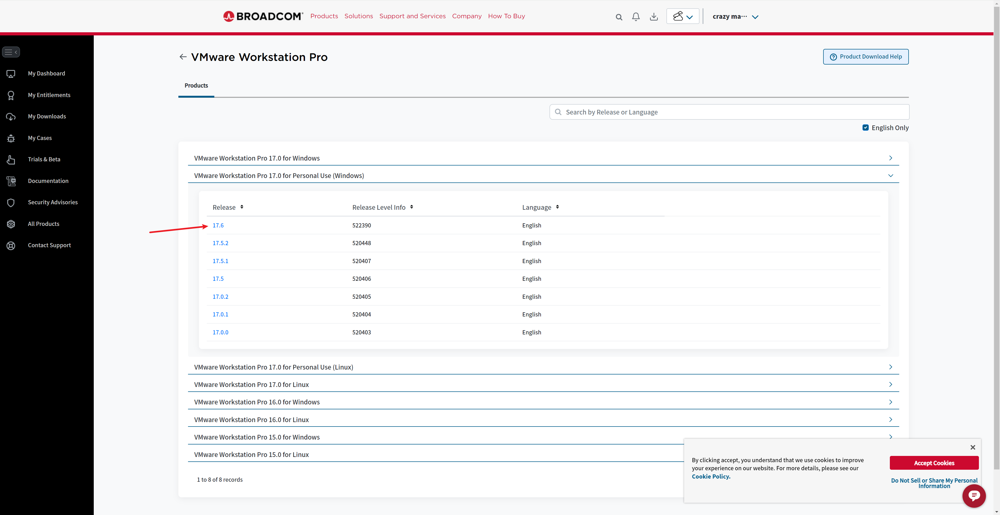
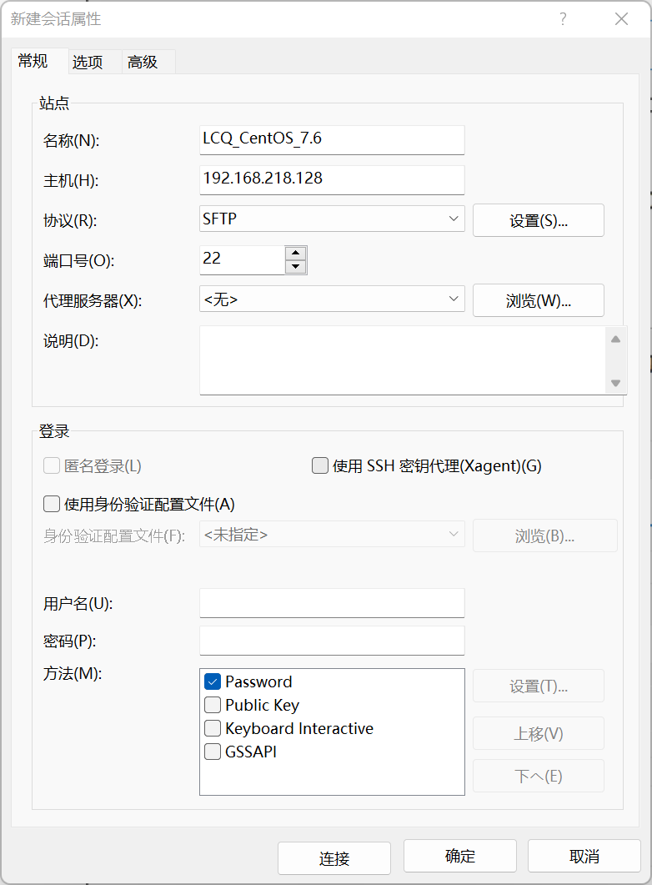

# 韩顺平 Linux 学习笔记

## PRE

[点击此处](https://www.kernel.org)进入 Linux 官网。

Linux 发行版

- Ubuntu
- RedHat
- CentOS
- Debain
- Fedora
- SuSE
- OpenSUSE

Unix
来自贝尔实验室，linux 是受其创始人开源精神感召创作的（ GNU/Linux 内核）。
[点击此处](https://www.bilibili.com/video/BV1Sv411r7vd/?p=4&share_source=copy_web&vd_source=d2703b4814ac43d97585ae499ae4f355)听故事

### 课程大纲

1. 基础篇
2. 实际操作篇
3. 高级篇
4. Java 定制篇
5. 大数据定制篇
6. python 定制篇
7. 企业面试题讲解篇

基于：centOS 7.6

### 详细内容

1. **基础篇**
   Linux 入门
   vm 和 Linux 的安装
   Linux 目录结构
2. **实际操作篇**
   远程登录（XShell XFtp）
   实用指令
   进程管理
   用户管理
   Vi 和 Vim 编辑器
   定时任务调度
   RPM 和 Yum
   开机、重启和用户登录注销
   磁盘分区、挂载
   网络配置
3. **高级篇**（面试常客）
   日志管理
   Linux 内核源码&内核升级（阅读 linux v0.01 源码，约 10000 行）
   定制自己的 Linux
   Linux 备份与恢复
   Linux 可视化管理工具 webmin 和 bt 运维工具
   Linux 入侵检测&权限划分&系统优化
   Linux 面试题
4. **Java 定制篇**
   搭建 JavaEE 开发环境
   - JDK 安装
   - IDEA 安装
   - Tomcat 安装
   - MySQL 安装
5. **大数据定制篇**
   Shell 编程
   - 概述
   - Shell 脚本执行方式
   - Shell 变量
   - 运算符
   - 条件判断
   - 流程控制
   - 函数
   - 定时维护 MySQL 数据库
6. **python 定制篇**
   Python 专业开发平台-Ubuntu
   Ubuntu 下开发 Python 开发环境
   APT 软件管理和远程登录

### 建议掌握

1. 基本操作命令
2. Linux 各种配置（环境变量、网络、服务等）
3. 搭建开发环境（`Javaee`、`Python`、大数据等）
4. 写一些基本的 Shell 脚本
5. 安全设置
6. 理解 Linux 内核，熟练掌握大型网站应用框架的组成并熟悉各个环节的部署与维护

### 学习方法论

1. 首先建立整体框架，不要死抠细节
2. 不需要掌握所有指令，但要掌握查询方法（手册、百度等）
3. 先学怎么做，再想为什么。（先动手，先实践）
4. Linux 不是编程，重点是实际操作（熟练掌握常用指令，有利于面试和实际项目）

### 使用场景

Linux 运维工程师

- 服务器规划
- 调试优化
- 日常监控
- 故障处理
- 数据备份/恢复
- 管理集群

Linux 嵌入式工程师

- 各种驱动开发
- 嵌入式场景下开发

场景

1. JavaEE
2. 大数据
3. PHP
4. Python
5. Go
6. C/C++

领域

- 个人桌面
- 服务器
- 嵌入式（优势：内核小。物联网趋势会带来更广阔的应用）

## 开始使用 Linux

### 安装

安装有两个选择，找一台新电脑，或者安装虚拟机。课程使用的是虚拟机

#### 安装 virtual machine

由于 VMware 团队已经被博通收购，故软件需进入博通官网下载。
博通账号注册请参照：[博通账号注册流程](./support/博通账号注册流程.md)

1. 下载：
   [1] [博通官网](https://support.broadcom.com/group/ecx/productdownloads?subfamily=VMware%20Workstation%20Pro)（需先登录）
   
   [2] [百度网盘链接](https://pan.baidu.com/s/1DSZhV3sdpy6g-exV-wpa8w?pwd=aaee)

2. 安装步骤：

   - 进入 BIOS，开启虚拟化设备支持（如果能直接安装成功，则跳过此步骤）
     [查看教程](https://jingyan.baidu.com/article/ab0b56305f2882c15afa7dda.html)
   - [安装](./support/VMware_install_guide.md)（暂时没写，这里是空的，无脑下一步就完事了，在填写许可证时，选择个人用途即可）

#### 安装 CentOS 7.6/8.1

1. 参考链接：

   - [CSDN：深入浅出 Linux 操作系统虚拟机环境下载安装](https://blog.csdn.net/Augenstern_QXL/article/details/122251037)
   - [阿里云镜像站关于 CentOS 的镜像介绍](https://developer.aliyun.com/mirror/centos) （CentOS 已经不再维护，这里有一些相关操作指南）
   - [阿里云镜像站 CentOS 过期源相关说明](https://developer.aliyun.com/mirror/centos-vault)

2. 下载 CentOS

   - [CentOS 7.6](https://mirrors.aliyun.com/centos-vault/7.6.1810/isos/x86_64/CentOS-7-x86_64-DVD-1810.iso)
   - [CentOS 8.1](https://mirrors.aliyun.com/centos-vault/8.1.1911/isos/x86_64/CentOS-8.1.1911-x86_64-dvd1.iso)
   - [百度网盘链接](https://pan.baidu.com/s/1t0em_yy0gDD90QUMNO5o6Q?pwd=26yf)

3. **虚拟机相关操作**（新建、克隆、快照、迁移与删除等）

   - [参考教程](./support/VMware_system_guide.md)

#### 安装 vmtools

1. 特点

   - 安装后，可以在 Windows 环境下更好的管理 vm 虚拟机。
   - 可以设置 Windows 和 CentOS 的共享文件夹。

2. 安装

   - 将 VMware Tools ISO 镜像挂载到虚拟机中。
     由于版本更新，`虚拟机-重新安装VMware Tools`可能无法直接安装，需要手动下载光盘映像后，在`设置`中链接下载的 iso 文件，然后执行接下来的操作。
   - 复制`VMwareTools-10.3.26-22085142.tar.gz`到`主文件夹-其他位置-计算机-opt`目录下。
   - 打开终端，输入如下代码：

     ```sh
     cd /opt                                            # 切换到 opt 目录
     ls                                                 # 查看当前目录下文件
     tar -zxvf VMwareTools-10.3.26-22085142.tar.gz      # 解压文件
     ls                                                 # 查看当前目录下文件
     cd vmware-tools-distrib                            # 切换到解压出的目录
     ./vmware-install.pl                                # 启动目录下的安装程序
     ```

   - 开始安装，一路回车即可。（可能最后会有一个问你是否卸载的选项，要选`no`，我还没遇到）

3. 使用
   - 在虚拟机菜单中`右键-设置-选项-共享文件夹`中，选择`总是启用`，然后添加一个在主机上的文件夹路径即可。
   - 通过`主文件夹-其他位置-计算机-mnt-hgfs`下可以看到共享的文件夹。
   - **注意**：真实的生产环境仍有区别，实际环境中需要使用**远程方式登陆**访问文件。

### 一些常用指令

```sh
pwd
ls
clear

```

## 目录结构

Linux 采用的**层式树状目录结构**，在实际生产环境中，我们是看不到图形化界面的，只能通过命令行进行操作，因此了解目录结构十分重要。

与 windows 不同的是，linux 的目录是已经被规划好了的，根目录（命令行中为`~`，图形界面中为`主文件夹`）下的每一个目录都有自己的任务。

**在 Linux 中，一切皆为文件。** 哪怕是一个硬件，在 linux 中也会被映射为一个文件。建议把根目录下的第一层的文件结构名称**全部背过**。

1. `/bin`（常用）
   意为`Binary（二进制）`，分为：`/usr/bin`、`/usr/local/bin`等，用于存放常用命令（如`cd`、`ls`、`pwd`等）。

2. `/sbin`（常用）
   `s`意为`super`，即系统管理员。分为：`/usr/sbin`、`/usr/local/sbin`等，用于存放系统管理员使用的命令与程序。
3. `/home`（常用）
   存放普通用户主目录，每个用户的目录相互独立，一般以用户的账号名命名。
4. `/root`（常用）
   系统管理员（超级权限用户）主目录
5. `/lib`
   意为`library（库）`。动态链接共享库，是开机所需的基本库，几乎所有应用程序都会用到这个库。
6. `/lost+found`
   意为`丢失与发现`。一般是空的，当系统非法关机时会存放一些文件。
   这个目录在图形化界面中时隐藏的，需要通过`ls`指令查看。
7. `/etc`（常用）
   源自拉丁语`Et cetera`，意为`以及其他`或`等`。系统管理所需配置文件和子目录，比如安装 mysql 数据库 `my.conf`。
8. `/usr`（常用）
   意为`user（用户）`。用于存放用户的应用程序和文件，类似于 Windows 的`C:\Program Files`。
9. `/boot`（常用）
   存放启动 Linux 时的核心文件。
10. `/proc`
    **别动它**。意为`process（进程）`。是一个虚拟目录，是系统内存的映射，访问这个目录来获取系统信息
11. `/srv`
    **别动它**。意为`service（服务）`，用于存放服务启动后需要提取的数据。
12. `/sys`
    **别动它**。Linux2.6 之后的内核所带的功能，此目录下安装了一个文件系统`sysfs`。
13. `/tmp`
    存放临时文件
14. `/dev`
    意为`device（设备）`，将所有硬件以文件形式存放于本目录下。
15. `/media`（常用）
    系统识别的一些外部媒体（如：光驱、U 盘等）挂载于这个目录下
16. `/mnt`（常用）
    意为`Mount（挂载）`，用于临时挂载别的文件系统，比如将共享文件夹挂载于此目录下的`hgfs`下
17. `/opt`
    意为`Optional（可选择的）`，默认为空，主机额外安装软件所存放的目录（是安装软件，不是安装好的软件）。放在别的目录下进行安装也可以，但这是一种约定俗成的方式，方便自己也方便别人。
18. `/usr/local`（常用）
    给主机额外安装软件的安装目录（安装好的软件），一般通过编译源码的方式安装程序。
19. `/var`（常用）
    意为`variable（变量数据）`，一般习惯将经常被修改的目录放在这个目录下，如各种日志。
20. `/selinux [security-enhance linux]`
    安全子系统，有三种工作模式，控制程序只能访问特定的文件。

## 远程登录

开发时的实际场景，应当是开发小组共享 Linux 服务器，正式上线的项目运行于公网，此时需要远程登录服务器，以方便开发。

### 软件（施工中……）

1. Xshell （用于远程登录）
   [free-for-home-school](https://www.netsarang.com/en/free-for-home-school/)
2. Xftp （用于文件传输）
3. 百度网盘资源

### 使用

1. XShell
   - 获取虚拟机 IP 地址：
     在终端中输入命令 `ifconfig`，即可获得 IP 地址。（如下图所示）
     
   - 测试延迟
     在 Windows 中使用指令`ping xxx.xxx.xxx.xxx`（具体值取决于 IP 地址）测试延迟。
     
   - 远程登录
     打开 XShell，新建一个会话，输入名称和主机 IP（虚拟机的 IP）。
     
     第一次打开会话时，会提示你`未知主机密钥`，这里我们选择`接受并保存`。
     
     输入用户名和密码，即可登录。
     
     
     然后即可在软件中输入 Linux 命令，进行操作。
     
2. Xftp

   - 像之前一样，输入 IP、输入账号密码。（按图中配置来，千万不要自作聪明改配置）
     
     

   - 将想要传输的文件`右键-传输`即可将文件传到对应的目录。
     
   - 如果文件名出现乱码，可以通过`文件-当前会话属性-选项-编码`改为`UTF-8`解决。

### 千万不要试

1. 使用指令实现远程控制
   在 XShell 中输入`reboot`，你会发现虚拟机中的系统重启了。

## Vi、Vim 快速入门

Linux 系统内置 Vi 文本编辑器。
Vim 具有编程能力，可以看做 Vi 的增强版，可以以字体颜色辨认语法正确性，还具有代码补完、编译、错误跳转等功能。

### 三种模式

1. 正常模式
   可以移动光标、使用`删除字符`、`删除整行`、`复制`、`粘贴`等功能。
2. 插入模式（编辑模式）
   按下`i`,`I`,`o`,`O`,`a`,`A`,`r`,`R`任意一个按键即可进入插入（编辑）模式，一般按`i`即可。
3. 命令行模式
   可以输入指令完成`读取`、`存盘`、`替换`、`离开Vim`、`显示行号`等动作。

### 快捷键

1. `ESC`：转回正常模式
2. `:` or `/`：转到命令行模式
3. 一些命令
   ```vim
   :wq  保存并退出
   :q   退出
   :q!  强制退出，不保存
   ```
4. 快捷键
   - 拷贝当前行：`yy`；拷贝当前行向下 5 行：`5yy`；
   - 将复制内容粘贴到当前行之下：`p`；
   - 删除当前行：`dd`；删除当前行向下 5 行：`5dd`；
   - 查找单词`word`：在命令行输入`/word`，按回车开始查找，按`n`查找下一个。查找到最后一个时，下一个会跳至第一个结果。`Shift+n`查找上一个。
   - 设置/取消文件行号
     显示：`:set nu`；取消：`:set nonu`。
   - 定位到文档开头/末尾
     开头：`gg`；末尾：`G`。
   - 撤销动作（输入字符、复制、粘贴等操作）：在正常模式下输入`u`。
   - 恢复：`Ctrl+r`。这两条命令加上数字可以进行批量撤销/恢复。
   - 定位文件位置，在一般模式下输入`xx+Shift+g`，即可快速定位到`xx`行。

### 举个例子

1. 用 Vim 编辑器编写一个`Hello.java`程序。

   - 输入指令

     ```sh
     vim Hello.java
     ```

   - 刚进入 Vim 编辑器是正常模式，按`i`转到插入模式。

   - java 代码如下：

     ```java
     public class Hello {
        public static void main(String[] args) {
           System.out.println("Hello, world!");
        }
     }
     ```

   - 存盘需要切换到命令行模式。
     先按`esc`，再输入：

     ```sh
     :wq         # w write, q quit
     ```

## 开机、重启和用户登录注销

### 开关机指令

```sh
shutdown -r now      # 立即重启，-r表示reboot
shutdown -h now      # 立即关机
shutdown -h 1        # 1分钟后关机；-h表示halt
shutdown             # 1分钟后关机，上面一行相当于shutdown的默认值

halt                 # 关机
reboot               # 重启
sync                 # 将内存数据同步到磁盘
```

**注意**：`shutdown`/`reboot`/`halt`均会自动执行`sync`，但希望学习的诸位养成一个习惯，写一下`sync`这条指令，小心驶得万年船。

### 登陆与注销

- 原则上不应使用 root 账号登录。
- 普通用户可以输入指令`su - username`，以`username`切换用户身份登录，如果切换的是系统管理员 root，输入密码后也可以获得命令行 root 权限。
- 输入`logout`注销用户（退出）（在图形界面下，此命令无效）
- 用户切换是一个链式结构，如果你在 A 用户下切换到 B 用户，然后再切换到 C 用户，即`A->B->C`这时在 C 下执行`logout`会退到 B 用户，当在 A 下`logout`会直接退出系统。

### 用户管理

1. 添加和删除用户
   Linux 操作系统是多任务多用户的操作系统，每一个用户拥有一个自己的目录，每一个要使用系统资源的用户都需要向系统管理员申请一个账号。

   ```sh
   useradd aha                      # 创建用户aha
   useradd -d /home/test ahooo      # 创建用户aho，并设置家目录为/home/test

   passwd aha                       # 修改用户aha的密码，如果不写用户名则默认修改当前用户的密码
                                    # 如果密码无效，再输入一遍就可以了

   userdel aha                      # 删除用户aha，但保留他的家目录
   userdel -r aha                   # 删除用户aha，并删除他的家目录 r remove
                                    # 如果要删除家目录，一定要慎重这会三组该用户所有工作成果

   ```

2. 查询用户信息

   ```sh
   id <username>                 # 查询用户信息（uid,gid,组名），若不存在目标用户，返回‘不存在’
   su - <username>               # 切换用户
                                 # 从权限高的用户向权限低的用户切换不需要输入密码，反之需要。

   whoami                        # 查看当前用户
   who am i                      # 同上
   ```

3. 用户组
   如果几位用户同属同一个工作小组，拥有相同的全线，那么可以将这些用户归到一个组中。

   ```sh
   groupadd <groupname>                   # 创建用户组
   groupdel <groupname>                   # 删除用户组

   useradd -g <groupname> <username>      # 将用户加入组，若不指定组，则会创建一个名为<username>的组
   usermod -g <groupname> <username>      # 将用户从当前组中移除，并加入到指定的组中

   ```

4. 用户和组的相关文件

   - `/etc/passwd`: 用户配置文件，记录各种用户信息。
     显示格式：`用户名:口令（加密）:用户标识号:组标识号:注释性描述:主目录:登录shell`
     对应标识：`<username>:<password>:<uid>:<gid>:<comment>:<home directory>:<login shell>`
     `login shell`: 用户使用的 Shell，用于翻译指令，如`Bash`。
   - `/etc/shadow`: 密码文件，记录密码的加密方式。
     显示格式：`登录名:加密口令:最后修改密码时间:最小时间间隔:最大时间间隔:警告时间:不活动时间:失效时间:标志`
   - `/etc/group`: 用户组文件，记录用户组信息。
     显示格式：`组名:密码:组ID:用户列表`

## 实用指令

### 指定运行级别

1. 运行级别介绍

   - 0：关机。
   - 1：单用户模式，可用于找回密码
   - 2：多用户模式，但无网络服务
   - 3：多用户模式，有网络服务。
   - 4：保留级别
   - 5：图形界面
   - 6：系统重启

   常用的运行级别是 3 和 5。
   也可以指定默认运行级别。

2. 命令
   ```sh
   init [0123456] # 切换到指定的运行级别
   ```
3. 设置默认运行级别
   在`/etc/inittab`找到如下选项作出更改：

   - CentOS 7 以前

     ```sh
     analogous to runlevel [0123456]   # 设定默认运行级别
     ```

   - CentOS 7 及以后
     ```sh
     multiuser.target           # 设定默认运行级别为3（多用户模式）
     graphical.target           # 设定默认运行级别为5（图形界面）
     ```
   - 也可以通过指令：

     ```sh
     # 查看当前默认运行级别
     systemctl get-default

     # 设定默认运行级别
     systemctl set-default TARGET.target    # TARGET处填写具体运行模式

     #systemctl 可以理解成system control

     ```

### 帮助指令

1. man 命令

   ```sh
   man [命令或配置文件]       # 查看帮助信息
   man ls                  # 查看ls命令的帮助信息
   ```

2. help 命令
   ```sh
   help [命令]              # 获得Shell内置的命令帮助信息
   ```

### 文件目录指令

1. `pwd`命令
   用于显示当前工作目录的绝对路径。
   绝对路径：从根目录开始，到当前目录的路径。如`/opt/test`
   相对路径：从当前目录开始，到目标文件的路径。如位于`opt`目录下，`test`
2. `ls`命令
   ```sh
   ls [选项] [目录]         # 显示目录下的文件列表
   ```
   常用选项：
   - `-a`：显示所有文件，包括隐藏文件。
   - `-l`：显示详细信息，包括文件类型、权限、所有者、大小、修改时间等。
3. `cd`命令

   ```sh
   cd [目录]                # 切换到指定目录
   cd ~                    # 切换到用户家目录
                           # root会回到root目录，其他用户会回到/home/<username>目录

   cd ..                   # 返回上一级目录

   # 从‘/home/<username>’使用相对路径进入'/root'
   cd ../../root
   ```

4. `mkdir`命令

   ```sh
   mkdir [选项] [目录名]           # 创建目录

   mkdir -p /tmp/a/b/c     # 创建多级目录
   mkdir /tmp/a            # 在指定位置创建目录

   ```

5. `rmdir`命令

   ```sh
   rmdir [选项] [目录名]       # 删除目录（目标目录必须为空）

   rmdir /tmp/a            # 删除指定目录

   rm -rf /tmp/a           # 强制删除（不需要为空）
                           # r代表递归，f代表强制
   ```

6. `touch`命令
   用于在指定位置创建空文件
   ```sh
   touch [文件名]       # 在当前目录创建空文件
   ```
7. `cp`命令

   ```sh
   cp [选项] source dest

   cp hello.c /home/aha        # 将hello.c文件复制到‘/opt/aha’目录下（前提是目录存在）

   cp -r /home/aha/ /opt/        # 将'aha'目录全部拷贝到'opt'目录

   \cp -r /home/aha/ /opt/       # 直接覆盖目标文件，不再询问
   ```

### 待分类项

1. 在 linux 中，隐藏文件是`.*`的形式。

   ```sh
   ls -a       # 查看所有文件（包括隐含文件）all
   ls -l       # 查看文件详细信息（按列显示）list
   ls -la      # 查看文件详细信息（按列显示，包括隐含文件）
               # 指令可以组合

   ```

## 找回 ROOT 密码

果然，不出所料，你设置的 ROOT 密码奇难无比，然后你就把他忘掉了。不过没事，还是有抢救的空间的。

1. 首先，启动系统，在启动界面按`e`进入编辑界面。
2. 向下移动光标，找到`linux16`所在行，在行末添加`init=/bin/sh`。
3. 输入`Ctrl+x`，之后会进入单用户模式。
4. 在光标处输入`mount -o remount,rw /`，回车。
5. 输入`passwd`，回车。
6. 输入两次密码。
7. 输入`touch /.autorrelabel`，回车。
8. 输入`exec /sbin/init`，回车。
9. 等待，这个过程会很长，请耐心等待。

```sh
e
init=/bin/sh   # Ctrl+x
mount -o remount,rw /
passwd

touch /.autorelabel
exec /sbin/init
```

聪明的你一定想到了，ROOT 密码可以随便改，那岂不是很危险？
首先，你需要物理接触服务器，你能做到这一点，干点啥不好？

## 题外话

### 软件/网站推荐

1. processON
   用于绘制流程图等图像。
