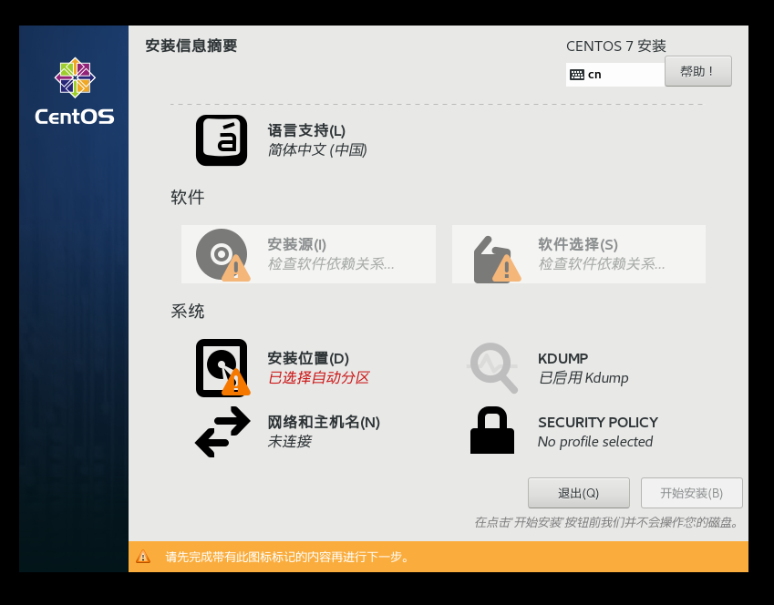
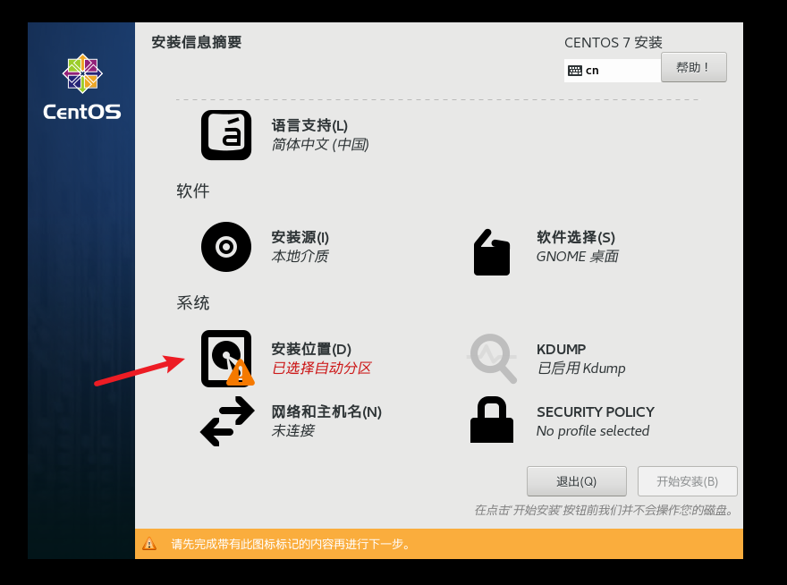

# VMware Workstation Pro 虚拟机使用指南

打开 VMware Workstation Pro 软件后，点击中间的`创建新的虚拟机`即可开始我们的虚拟机安装。

## 新建虚拟机

### 新建虚拟机向导

1. 选择`典型（推荐）`
   
2. 选择`稍后安装操作系统`
   
3. 操作系统选择`Red Hat Enterprise Linux 7 64位`（这里装的是 CentOS7.6，若安装 8.1 则选择`Red Hat Enterprise Linux 8 64位`）
   
4. 填写虚拟机名称和安装位置（不建议安装在 C 盘）
   
5. 最大磁盘大小依照建议大小填写即可，选择`将虚拟磁盘拆分为多个文件`
   
6. 自定义硬件
   
   - 内存
     将内存设置为建议值即可
     
   - 处理器
     处理器数量和每个处理器内核的**乘积**不得超过电脑 CPU 的逻辑核心数，否则会报错。
     可以通过`Ctrl+Shift+ESC`打开任务管理器查看 CPU 的逻辑核心数。（我的 CPU 是 4 核 8 线程，有 8 个逻辑处理器）
     
     
   - 网络适配器
     网络适配器选择`NAT`模式
     
7. 点击完成
   

### 虚拟机启动

1. 打开设置
   

   - 选择`使用ISO映像文件`
     
   - 选择下载好的对应版本的 ISO 镜像文件，打开
     

2. 点击`开启此虚拟机`
   
3. 点击进入系统后，用键盘选择`Install CentOS 7`
   **注意**：此时若想调出鼠标，需要`Ctrl+Alt`释放光标。
   
4. 选择语言
   
5. 点击`软件选择`
   
   依照下图选择安装内容
   
   等待系统检查软件依赖关系（可能会很久）
   
6. 选择`安装位置`
   
   - 选择`我要配置分区`
     
   - 配置引导区(boot)
     
   - 配置交换区(swap)
     
   - 配置根分区(root)
     
   - 点击`完成`后，选择`接受更改`
     
7. 点击`网络和主机名`
   
   打开以太网开关，填写主机名（该主机在网络上显示的名称）
   

8. 其他设置
   在学习期间可以关闭，KDUMP 建议在实际使用时打开。

   - 安全策略(SECURITY POLICY)
     
   - KDUMP
     

9. 设置 ROOT 密码和创建新用户
   - 为了保证系统安全，建议将 ROOT 密码设置为复杂密码。（当然千万要记住，不要把自己防住了）
   - 建议创建一个非 ROOT 的用户，用于日常使用、登陆。

## 虚拟机克隆

1. 直接拷贝一份安装好的虚拟机文件
   将虚拟机文件夹直接拷贝走，然后用虚拟机软件打开新文件中的`*.vmx`文件，即可获得一个全新的虚拟机。
2. 使用 VMware 的克隆功能
   - 在克隆时，需要关闭需要克隆的虚拟机。
   - 在虚拟机列表中，想要克隆的虚拟机上`右键-管理-克隆`进入克隆向导。
   - 在大数据/JavaEE 领域，这个方法可以用于快速构建一个集群。

## 虚拟机快照

快照可以理解为对当前状态进行一个记录，无论之后虚拟机状态发生任何变化，都可以通过快照功能，恢复到任意一个快照过的状态。

**注意**

- 如果现在有快照链`A -> B -> C -> now`可以恢复到`A`，再恢复到`B`。即可以恢复到比当前状态更新的快照。
- 快照可以有分支。
- 每一个快照都会占据虚拟机一定的磁盘空间，不要拍摄大量无意义的快照。
  操作方法

1. 通过对虚拟机列表中当前虚拟机`右键-快照-拍摄快照`。
2. 通过`右键-快照`可以选择恢复到哪一个快照。也可以进入`快照管理器查看快照链`

## 虚拟机的迁移与删除

1. 删除虚拟机所在的整个文件夹
2. 在虚拟机列表中，选择虚拟机，`右键-移除`。（此方法不会删除虚拟机源文件，只在列表中进行删除）

## 题外话

### 三种网络连接方式的区别

1. 桥接模式
   虚拟系统拥有同一网段下一个独立的 IP 地址，可以和外部系统通讯，但容易造成 IP 冲突。
2. NAT 模式
   网络地址转换模式，可以与外部系统通讯，不造成 IP 冲突，但外部系统无法访问虚拟机。
3. 主机模式
   一个独立的系统，不与外部发生联系。
