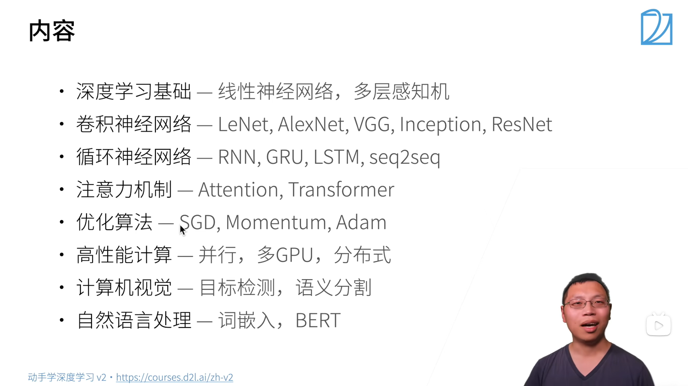

## 素材下载

[1] [动手学习深度学习](http://zh.d2l.ai)
[1-1] [GitHub 源码](https://github.com/d2l-ai/d2l-zh)
[2] [动手学习深度学习 v2](https://zh-v2.d2l.ai/)
[3] [课程主页](https://courses.d2l.ai/zh-v2)
[4] [课程论坛](https://discuss.d2l.ai/c/16)
[5] [pytorch 论坛](https://discuss.pytorch.org)

## 大纲



### 准备操作

```bash
conda env remove d2l-zh
conda create -n d2l-zh python=3.8 pip
conda activate d2l-zh
```

```bash
pip install -y jupyter d2l torch torchvision
```

```bash
wget https://zh-v2.d2l.ai/d2l-zh.zip
unzip d2l-zh.zip
jupyter notebook
```

[Ubuntu 环境下实操](https://www.bilibili.com/video/BV18p4y1h7Dr/?share_source=copy_web&vd_source=d2703b4814ac43d97585ae499ae4f355&t=363)

### 课程观看指南

#### 1.

# 笔记

## 介绍

### 深度学习简介

1.由机器学习定义的一个程序算法有大量参数输入和输出，用数据集来确定最佳参数集，就可以以某种度量性能的标准下，得到完成任务的最佳性能。

- 任意调整参数后的程序被称为`模型`。
- 通过操作参数而生成的所有不同程序的集合称为`模型族`。
- 使用数据集选择参数的元程序称为`学习算法`。

我们的目标，是精确定义一个问题，通过不断的迭代用算法找出最优参数。机器学习中的“学习”，指的就是训练模型的过程。

2. 无论什么机器问题，都离不开这四个组件

   - 用来学习的`数据(data)`。
   - 用来转换数据的`模型(model)`
   - 用来量化模型有效性的`目标函数(objective function)`
   - 调整参数以优化目标函数的`算法(algorithm)`

3. 数据
   数据集由样本构成，通常遵循`独立同分布(independent and identically distributed,i.i.d)`，每个样本都由一组特征向量组成，比如一张彩色照片，其包含长、宽、通道三个向量，那么一张照片就是三维的。
   数据的质量十分重要，如果输入的数据带有偏见，那训练出来的模型同样会带有偏见。
4. 模型
   深度学习与传统方法
5. 目标函数
   我们会定义一个函数用于度量模型的优劣程度，并希望将其优化至最低点，这就是我们常说的**损失函数**。**平方误差**函数最常见的损失函数之一
6. 优化算法
   当我们确定了数据、模型、目标函数后，还需要一种算法，来最小化损失函数，因为模型是靠损失函数作为标准来工作的。
   大多数流行的深度学习算法都基于一种基本的算法——**梯度下降**。这个方法会检查每一个参数，并对其进行少量的变动，并查看训练集损失的相应趋势，然后向减少损失的方向优化参数。

### 常见机器学习问题

#### 监督学习

监督学习，就是将一组数据打上标签，然后将数据用于训练模型，使模型能够在未见过的数据中完成标签的归类。
一般可分为以下步骤：

- 在一些数据中，为每个样本获取标签（这些标签可能需要手动标注）
- 选择有监督的学习算法，将训练集作为输入，输出一个“学习过的模型”.
- 将未出现过的样本输入模型，拿到预测的结果。
  

1. **回归**
   如果一个问题需要学习的标签是一个数值时，这个问题可以被归类为回归问题。回归问题就是令预测数值接近真实数值的过程。
2. **分类**
   判断是或不是的问题就是分类问题。
   分类问题中，有时可能无法 100%确定目标归属于哪一类后面会讲到运用**不确定性概念**的一些算法。
   分类问题常用的损失函数是交叉熵。
3. **标记问题**
   一个图像中可能有多个对象，这时采用分类方法就没有办法将这个图像分到具体的哪个类别当中，这时就可以使用给这张图片打上多个标签的办法来处理这个问题。
   标记问题又称为多标签分类。
   比如一篇文章可以用 5~10 个标签来标明它的内容。
4. **搜索**
   在网络搜索中，对结果的排序是一项十分重要的工程。
   比如依据某一相关性指标进行排序，用百度搜索中国大陆的一所大学时，前列的结果一定包含百度百科、分数线等信息。
5. **推荐系统**
   当一条信息被推送给用户时，系统根据用户的行为（如：点击、跳过）进行打分，根据评分系统为用户提供内容相似的信息。
6. **序列学习**
   - 标记和解析
     可以将一个句子中的实体(entity)（如：人名、地名等）标注出来。
   - 自动语音识别
     音频和文本没有一对一的关系，往往是采样得到的多个音频数据对应一个发音，多个发音对应一个单词，这就是典型的**序列到序列学习**问题。
   - 文本到语音
     将文本转化为语音
   - 机器翻译
     自动翻译

#### 无监督学习

相比于监督学习的照葫芦画瓢，无监督学习没有明确的目标，需要系统自发地去学习。

1. **聚类问题**（clustering）
   这次的分类问题不带有标签了，需要自发地生成标签（？？？）。比如对图片进行归类、根据浏览器记录将相似行为的用户进行分类。
2. **主成分分析问题**（principal component analysis）
   一个样本中可能可以提取出很多不同的参数，这些参数的重要性各不相同，只取最重要的几个，就可以比较准确的描述一个样本。
3. **因果关系**（causality）**和概率图模型**（probabilistic graphical models）**问题**
   事物之间的联系
4. **生成对抗性网络**（generative adversarial networks）

#### 与环境互动（没看懂）

分布偏移问题

#### 强化学习

### 深度学习的发展

一些重要的成果

1. 新的容量控制方法（如`dropout`）
2. 注意力机制
3. 多阶段设计
4. 生成对抗网络
5. 随机梯度下降
6. 并行计算
7. 深度学习框架

###

## 预备知识

### 数据操作

#### 入门

无论使用什么深度学习框架，都存在**张量类**（n 维数组）（在 pytorch 和 Tensorflow 中为`Tensor`，在 MXNet 中为`ndarry`）与 numpy 中的`ndarray`类似，区别在于深度学习框架中的张量类可以用 GPU 实现并行运算（numpy 只支持 CPU。此外，张量类支持**自动微分**。

张量表示一个由数值组成的 n 维数组。

```python
import torch

x=torch.arange(12)  # 创建一个0~11共计12个元素的向量
x.shape             # 查看张量大小
x.numel()           # 查看元素个数
x.reshape(4,3)      # 重新整理成4行3列
torch.zeros(4,3)    # 创建一个4行3列的零矩阵
torch.ones(4,3)     # 创建一个4行3列的1矩阵
torch.ones(2,3,4)   # 创建一个2个3行4列的矩阵（三维）
torch.randn(3,4)    # 创建一个3行4列的随机矩阵（使用标准正态分布采样）

# 使用tensor可以创建任意张量
torch.tensor([[1,2,3],[4,5,6]])

```

#### 运算符

1. `+`,`-`,`*`,`/`,`**`在这里均为按元素运算。

   ```python
   x=torch.tensor([1,2,3])
   y=torch.tensor([4,5,6])
   x+y,x-y,x*y,x/y,x**y,y//x

   '''
   运行结果：
   (tensor([5, 7, 9]),
   tensor([-3, -3, -3]),
   tensor([ 4, 10, 18]),
   tensor([0.2500, 0.4000, 0.5000]),
   tensor([  1,  32, 729]),
   tensor([4, 2, 2]))
   '''
   ```

2. 将张量连接起来
   ```python
   X=torch.arange(12,dtype=torch.float32).reshape(3,4)  #生成一个三行四列的张量，值的类型时32位浮点数。
   Y=torch.tensor([[0,0,1,0],[2,0,3,0],[1,2,3,4]])
   torch.cat((X,Y),dim=0),torch.cat((X,Y),dim=1) # dim=0表示纵向连接（按行），dim=1表示横向连接（按列）。
   ```
3. 其他

   ```python
   x==y # 判断对应位置元素是否相等，返回值是一个规模相同的张量
   x.sum() # 返回所有张量元素的加和
   ```

#### 广播机制

如果两个张量形状不匹配，进行运算时，他们会以某方式自我复制，令两个参与运算的张量的形状相同。

#### 索引和切片

#### 节省内存

#### 转换为其他 Python 对象
