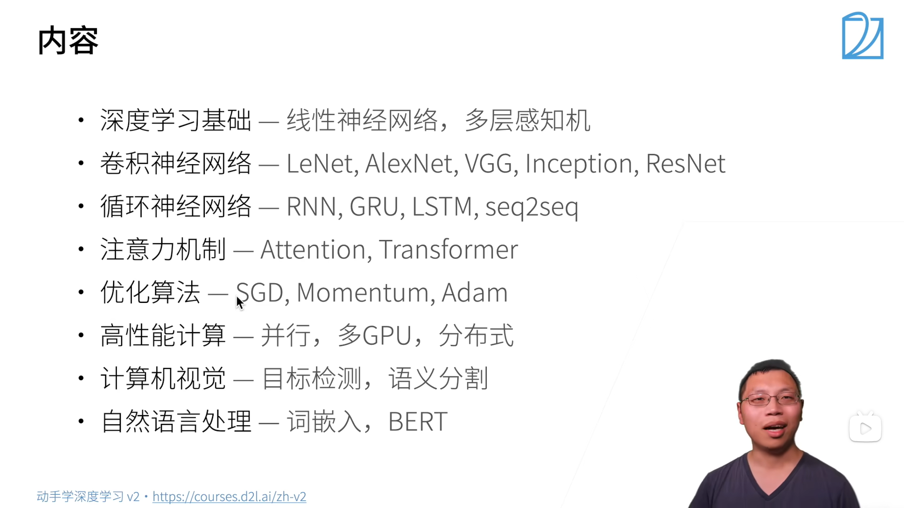

## 素材下载

[1] [动手学习深度学习](http://zh.d2l.ai)
[1-1] [GitHub 源码](https://github.com/d2l-ai/d2l-zh)
[2] [动手学习深度学习 v2](https://zh-v2.d2l.ai/)
[3] [课程主页](https://courses.d2l.ai/zh-v2)
[4] [课程论坛](https://discuss.d2l.ai/c/16)
[5] [pytorch 论坛](https://discuss.pytorch.org)

## 大纲



### 准备操作

```bash
conda env remove d2l-zh
conda create -n d2l-zh python=3.8 pip
conda activate d2l-zh
```

```bash
pip install -y jupyter d2l torch torchvision
```

```bash
wget https://zh-v2.d2l.ai/d2l-zh.zip
unzip d2l-zh.zip
jupyter notebook
```

[Ubuntu 环境下实操](https://www.bilibili.com/video/BV18p4y1h7Dr/?share_source=copy_web&vd_source=d2703b4814ac43d97585ae499ae4f355&t=363)

### 课程观看指南

#### 1.

# 笔记

## 介绍

### 深度学习简介

1.由机器学习定义的一个程序算法有大量参数输入和输出，用数据集来确定最佳参数集，就可以以某种度量性能的标准下，得到完成任务的最佳性能。

- 任意调整参数后的程序被称为`模型`。
- 通过操作参数而生成的所有不同程序的集合称为`模型族`。
- 使用数据集选择参数的元程序称为`学习算法`。

我们的目标，是精确定义一个问题，通过不断的迭代用算法找出最优参数。机器学习中的“学习”，指的就是训练模型的过程。

2. 无论什么机器问题，都离不开这四个组件

   - 用来学习的`数据(data)`。
   - 用来转换数据的`模型(model)`
   - 用来量化模型有效性的`目标函数(objective function)`
   - 调整参数以优化目标函数的`算法(algorithm)`

3. 数据
   数据集由样本构成，通常遵循`独立同分布(independent and identically distributed,i.i.d)`，每个样本都由一组特征向量组成，比如一张彩色照片，其包含长、宽、通道三个向量，那么一张照片就是三维的。
   数据的质量十分重要，如果输入的数据带有偏见，那训练出来的模型同样会带有偏见。
4. 模型
   深度学习与传统方法
5. 目标函数
   我们会定义一个函数用于度量模型的优劣程度，并希望将其优化至最低点，这就是我们常说的**损失函数**。**平方误差**函数最常见的损失函数之一
6. 优化算法
   当我们确定了数据、模型、目标函数后，还需要一种算法，来最小化损失函数，因为模型是靠损失函数作为标准来工作的。
   大多数流行的深度学习算法都基于一种基本的算法——**梯度下降**。这个方法会检查每一个参数，并对其进行少量的变动，并查看训练集损失的相应趋势，然后向减少损失的方向优化参数。

### 常见机器学习问题

#### 监督学习

监督学习，就是将一组数据打上标签，然后将数据用于训练模型，使模型能够在未见过的数据中完成标签的归类。
一般可分为以下步骤：

- 在一些数据中，为每个样本获取标签（这些标签可能需要手动标注）
- 选择有监督的学习算法，将训练集作为输入，输出一个“学习过的模型”.
- 将未出现过的样本输入模型，拿到预测的结果。
  

1. **回归**
   如果一个问题需要学习的标签是一个数值时，这个问题可以被归类为回归问题。回归问题就是令预测数值接近真实数值的过程。
2. **分类**
   判断是或不是的问题就是分类问题。
   分类问题中，有时可能无法 100%确定目标归属于哪一类后面会讲到运用**不确定性概念**的一些算法。
   分类问题常用的损失函数是交叉熵。
3. **标记问题**
   一个图像中可能有多个对象，这时采用分类方法就没有办法将这个图像分到具体的哪个类别当中，这时就可以使用给这张图片打上多个标签的办法来处理这个问题。
   标记问题又称为多标签分类。
   比如一篇文章可以用 5~10 个标签来标明它的内容。
4. **搜索**
   在网络搜索中，对结果的排序是一项十分重要的工程。
   比如依据某一相关性指标进行排序，用百度搜索中国大陆的一所大学时，前列的结果一定包含百度百科、分数线等信息。
5. **推荐系统**
   当一条信息被推送给用户时，系统根据用户的行为（如：点击、跳过）进行打分，根据评分系统为用户提供内容相似的信息。
6. **序列学习**
   - 标记和解析
     可以将一个句子中的实体(entity)（如：人名、地名等）标注出来。
   - 自动语音识别
     音频和文本没有一对一的关系，往往是采样得到的多个音频数据对应一个发音，多个发音对应一个单词，这就是典型的**序列到序列学习**问题。
   - 文本到语音
     将文本转化为语音
   - 机器翻译
     自动翻译

#### 无监督学习

相比于监督学习的照葫芦画瓢，无监督学习没有明确的目标，需要系统自发地去学习。

1. **聚类问题**（clustering）
   这次的分类问题不带有标签了，需要自发地生成标签（？？？）。比如对图片进行归类、根据浏览器记录将相似行为的用户进行分类。
2. **主成分分析问题**（principal component analysis）
   一个样本中可能可以提取出很多不同的参数，这些参数的重要性各不相同，只取最重要的几个，就可以比较准确的描述一个样本。
3. **因果关系**（causality）**和概率图模型**（probabilistic graphical models）**问题**
   事物之间的联系
4. **生成对抗性网络**（generative adversarial networks）

#### 与环境互动（没看懂）

分布偏移问题

#### 强化学习

### 深度学习的发展

一些重要的成果

1. 新的容量控制方法（如`dropout`）
2. 注意力机制
3. 多阶段设计
4. 生成对抗网络
5. 随机梯度下降
6. 并行计算
7. 深度学习框架

###

## 预备知识

### 数据操作

#### 入门

无论使用什么深度学习框架，都存在**张量类**（n 维数组）（在 pytorch 和 Tensorflow 中为`Tensor`，在 MXNet 中为`ndarry`）与 numpy 中的`ndarray`类似，区别在于深度学习框架中的张量类可以用 GPU 实现并行运算（numpy 只支持 CPU。此外，张量类支持**自动微分**。

张量表示一个由数值组成的 n 维数组。
例子：

1. RGB 图像：宽、高、通道三个维度，需要 3 维张量。
2. RGB 图像批量：增加了批量大小这个维度，需要 4 维张量。
3. 视频批量：增加了时间维度，需要 5 维张量。

```python
import torch

x=torch.arange(12)  # 创建一个0~11共计12个元素的向量
x.shape             # 查看张量大小
x.numel()           # 查看元素个数 number of elements
x.reshape(4,3)      # 重新整理成4行3列
torch.zeros(4,3)    # 创建一个4行3列的零矩阵
torch.ones(4,3)     # 创建一个4行3列的1矩阵
torch.ones(2,3,4)   # 创建一个2个3行4列的矩阵（三维）
torch.randn(3,4)    # 创建一个3行4列的随机矩阵（使用标准正态分布采样）

# 使用tensor可以创建任意张量
torch.tensor([[1,2,3],[4,5,6]])

```

#### 运算符

1. `+`,`-`,`*`,`/`,`**`在这里均为按元素运算。

   ```python
   x=torch.tensor([1,2,3])
   y=torch.tensor([4,5,6])
   x+y,x-y,x*y,x/y,x**y,y//x

   '''
   运行结果：
   (tensor([5, 7, 9]),
   tensor([-3, -3, -3]),
   tensor([ 4, 10, 18]),
   tensor([0.2500, 0.4000, 0.5000]),
   tensor([  1,  32, 729]),
   tensor([4, 2, 2]))
   '''
   ```

2. 将张量连接起来
   ```python
   X=torch.arange(12,dtype=torch.float32).reshape(3,4)  #生成一个三行四列的张量，值的类型时32位浮点数。
   Y=torch.tensor([[0,0,1,0],[2,0,3,0],[1,2,3,4]])
   torch.cat((X,Y),dim=0),torch.cat((X,Y),dim=1) # dim=0表示纵向连接（按行），dim=1表示横向连接（按列）。
   ```
3. 其他

   ```python
   x==y # 判断对应位置元素是否相等，返回值是一个规模相同的张量
   x.sum() # 返回所有张量元素的加和
   ```

#### 广播机制

如果两个张量形状不匹配，进行运算时，他们会以某方式自我复制，令两个参与运算的张量的形状相同。
其中一个张量有为 1 的维度时，才可触发广播机制。

#### 索引和切片

```python
X[-1]          # 最后一个元素
X[1:3]         # 第二个和第三个元素（标号为1和2）

```

#### 节省内存

```python
# 进行赋值时，新结果可能会分配新的内存
# 我们可以通过原地操作来避免

Z = torch.zeros_like(X)    # 创建一个与X形状相同的零张量
print (id(Z))
Z[:] = X + Y               # 对元素操作，而不是更改对象
print (id(Z))              # 提前分配空间后，可以执行原地操作，不会再分配内存。
```

如果后续不使用`X`，也可以使用`X[:]=X+Y`或`X+=Y`减少内存开销。

#### 转换为其他 Python 对象

### 数据预处理

#### 读取数据集

```python
import os

os.makedirs(os.path.join('..', 'data'),exist_ok=True)       # 创建目录，若目录已存在，不报错。
data_file = os.path.join('..', 'data', 'house_tiny.csv')    # 创建文件路径。

with open(data_file, 'w') as f:
    f.write('NumRooms,Alley,Price\n')  # 列名
    f.write('NA,Pave,127500\n')  # 每行表示一个数据样本
    f.write('2,NA,106000\n')
    f.write('4,NA,178100\n')
    f.write('NA,NA,140000\n')
```

```python
# 如果没有安装pandas，只需取消对以下行的注释来安装pandas
# !pip install pandas
import pandas as pd

data = pd.read_csv(data_file)    # 用pandas读取数据
print(data)
```

#### 处理缺失值

插值

```python
inputs, outputs = data.iloc[:, 0:2], data.iloc[:, 2]           # iloc,index location
inputs = inputs.fillna(inputs.mean(numeric_only=True))         # fillna,fill NAN
print(inputs)
```

```python
inputs = pd.get_dummies(inputs,dummy_na=True)*1   # 意为虚拟变量，将非数值元素转换为one-hot编码的数值元素。
print(inputs)
```

#### 转换成张量模式

```python
import torch

X = torch.tensor(inputs.to_numpy(dtype=float))
y = torch.tensor(outputs.to_numpy(dtype=float))

A = torch.tensor(inputs.values)

X, y, A
```

这里的输出会显示使用的 64 位浮点数，但一般使用 32 位就可以了。

### 线性代数基础

#### 降维

```python
import torch

X = torch.arange(20,dtype=torch.float32)

X.reshape(4,5)

sum1=X.sum()
sum2=X.sum(axis=0)
sum3=X.sum(axis=1)
sum4=X.sum(axis=[0,1])     # 用于指定沿那一维度求和，求和后该维度消失，sum4与sum1等价

# 可以通过参数keepdim来保留维度
# 保留维度只会令该维度为1，不会保留任何值（直接求和会降维）可以在后续计算中利用广播机制参与计算
sum5=X.sum(axis=1,keepdim=True)
```

#### 点积

```python
x = torch.arange(4)
y = torch.ones(4)

x,y,torch.dot(x,y)

```

#### 矩阵-向量积

```python
A = torch.arange(20).reshape(5,4)
x = torch.arange(4)

A.shape, x.shape, torch.mv(A, x)     # mv,matrix vector multiplication
```

#### 矩阵乘法

```python
torch.mm(A,B)           # mm,matrix multiplication
```

#### 范数

$ L*2 $范数表达式如下：
**$$\|\mathbf{x}\|\_2 = \sqrt{\sum*{i=1}^n x_i^2},$$\*\*

```python
u = torch.tensor([3.0, -4.0])
torch.norm(u)
```

### 微积分

矩阵求导规则
设定 X 发生转置。
||标量\[y(1,)\]|向量 $$ \mathbf{x}(n,1) $$ |矩阵 $$ \mathbf{X}(n,k) $$ |
|:---:|:---:|:---:|:---:|
|标量\[y(1,)\]|$$ \frac{\partial y}{\partial x}(1,) $$|$$ \frac{\partial y}{\partial \mathbf{x}}(1,n) $$|$$ \frac{\partial y}{\partial \mathbf{X}}(k,n) $$|
|向量 $$ \mathbf{y}(m,1) $$|$$ \frac{\partial \mathbf{y}}{\partial x}(m,1) $$|$$ \frac{\partial \mathbf{y}}{\partial \mathbf{x}}(m,n) $$|$$ \frac{\partial \mathbf{y}}{\partial \mathbf{X}}(m,k,n) $$|
|矩阵 $$ \mathbf{Y}(m,l) $$|$$ \frac{\partial \mathbf{Y}}{\partial x}(m,l) $$|$$ \frac{\partial \mathbf{Y}}{\partial \mathbf{x}}(m,l,n) $$|$$ \frac{\partial \mathbf{Y}}{\partial \mathbf{X}}(m,l,k,n) $$|

所有 y 统统不变，所有 x 统统转置，x 的复合向量也链式求导后统统转置。

### 自动微分

根据上面提到的表格，我们来做一个例子

假设 $$ \mathbf{x,w} \in \mathbb{R}^n , y\in\mathbb{R} $$

$$
z = (< \mathbf{x} + \mathbf{w} >-y)^2
$$

计算 $$ \frac{\partial z}{\partial \mathbf{w}} $$

1. 分解
   $$
   a=< \mathbf{x} + \mathbf{w} >
   $$
   $$
   b=a-y
   $$
   $$
   z=b^2
   $$
2. 链式求导
   $$
   \frac{\partial z}{\partial \mathbf{w}} = \frac{\partial z}{\partial b} \frac{\partial b}{\partial a} \frac{\partial a}{\partial \mathbf{w}} =\frac{\partial b^2}{\partial b} \frac{\partial a-y}{\partial \mathbf{a}} \frac{\partial <\mathbf{x,w}>}{\partial \mathbf{w}} = 2b \cdot \mathbf{1} - \mathbf{x}^T
   $$

#### 自动求导

有别于符号求导、数值求导

计算图：将计算表示为一个无环图，mxnet 等可以进行显示构造，pytorch 可以进行隐式构造。

自动求导的两种模式：
对于一个链式求导式：

$$
\frac{\partial y}{\partial x}=\frac{\partial y}{\partial u_n}\frac{\partial u_n}{\partial u_{n-1} }… \frac{\partial u_2}{\partial u_1} \frac{\partial u_1}{\partial x}
$$

1. 正向累积（从 x 出发）
2. 反向累积（从 un 出发）

优劣：

- 反向累积需要存储正向每一次的结果，正向不存储。所以神经网络吃显存。
- 正向累积每次计算都要从头到尾进行一遍

- 不是每次从头扫一遍，使整个过程每个操作子要扫一遍，有 n 个操作子

- 反向从根节点向下扫，可以保证每个节点只扫一次；正向从叶节点向上扫，会导致上层节点可能需要被重复扫多次（正向中子节点比父节点先计算，因此也无法像反向那样把本节点的计算结果传给每一个子节点）

#### 实现

1. 一个简单的例子

   ```python
   import torch

   x=torch.arange(4.0)

   x.requires_grad_(True)  # 等价于x=torch.arange(4.0,requires_grad=True)，之后可用x.grad访问梯度

   y=2*torch.dot(x,x)
   y.backward()            # 求导
   print(x.grad)           # 访问导数
   print(x.grad==4*x)      # 验证

   # 在默认情况下，PyTorch会累积梯度，我们需要清除之前的值
   x.grad.zero_()          # 梯度清零
   y=x.sum()
   y.backward()
   print(x.grad)

   ```

2. 非标量变量的反向传播
   ```python
   # 对非标量调用backward需要传入一个gradient参数，该参数指定微分函数关于self的梯度。
   # 本例只想求偏导数的和，所以传递一个1的梯度是合适的
   x.grad.zero_()
   y = x * x
   # 等价于y.backward(torch.ones(len(x)))
   y.sum().backward()         # 注意这里的sum，将向量转为标量
   x.grad
   ```
3. 分离计算
   将某些计算移动到计算图之外

   ```python
   x.grad.zero_()
   y = x * x
   u = y.detach()       # u只记录y的值，抛弃所有特征
   z = u * x            # 将u视为常数

   z.sum().backward()
   x.grad == u
   ```

4. Python 控制流的梯度计算
   使用自动微分的一个好处是：
   **即使构建函数的计算图需要通过 Python 控制流（例如，条件、循环或任意函数调用），我们仍然可以计算得到的变量的梯度**。
   在下面的代码中，`while`循环的迭代次数和`if`语句的结果都取决于输入`a`的值。

   ```python
   def f(a):
      b = a * 2
      while b.norm() < 1000:
         b = b * 2
      if b.sum() > 0:
         c = b
      else:
         c = 100 * b
      return c

   a = torch.randn(size=(), requires_grad=True)
   d = f(a)
   d.backward()

   a.grad == d / a
   ```

## 线性神经网络

### 线性回归

#### 建立模型

现在建立模型，假设有$n$个输入$x_n$，每个输入有权重$w_n$，则模型表示为：

$$
y=w_1x_1+w_2x_2+...+w_nx_n+b
$$

用向量表示为：

$$
y=<\mathbf{w},\mathbf{x}>+b
$$

其中，$\mathbf{w}$为一个 n 维的权重，$b$为一个标量偏差。

线性回归模型是一个单层的神经网络，其参数就是模型中的权重和偏差。这个神经网络含有一个输入层和一个输出层，单层指这个神经网络带权重的层只有一层。

#### 损失函数

现在，我们需要一个指标来衡量模型的好坏。损失函数$l(y,\hat{y})$，$y$为真实值，$\hat{y}$为预测值。
这里我们使用平方损失：

$$
l(y,\hat{y})= \frac{1}{2} (y-\hat{y})^2
$$

其实就是方差，$\frac{1}{2}$可以在求导时消掉。

#### 训练数据

收集一些数据用于决定参数值（权重与偏差），例如过去的实际信息数据。
假设我们有 n 个样本：

$$
\mathbf{X}=[\mathbf{x_1},\mathbf{x_2},...,\mathbf{x_n}]^T \\
\mathbf{y}=[y_1,y_2,...,y_n]^T
$$

#### 参数学习

训练损失：

$$
J(\mathbf{X},\mathbf{y},\mathbf{w},b)=\frac{1}{2n}\sum_{i=1}^n (y_i-<\mathbf{x}_i,\mathbf{w}>-b)^2= \frac{1}{2n} \sum_{i=1}^{n} \left\| y_i - \mathbf{X} \mathbf{w} - b \right\|^2
$$

最小化损失：

$$
\mathbf{w}^*, \mathbf{b}^* = \arg\min_{\mathbf{w}, \mathbf{b}} J(\mathbf{X}, \mathbf{y}, \mathbf{w}, b)
$$
