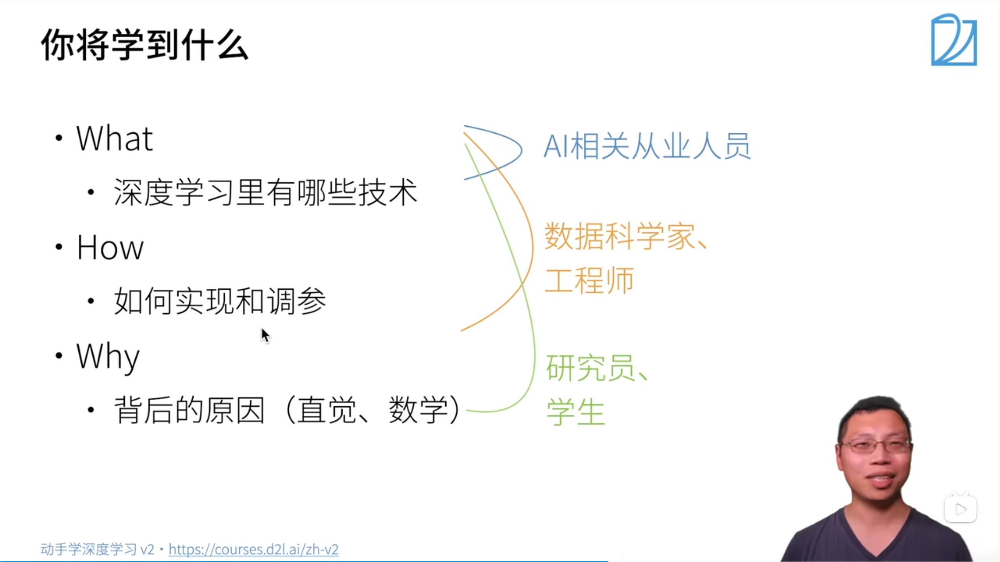
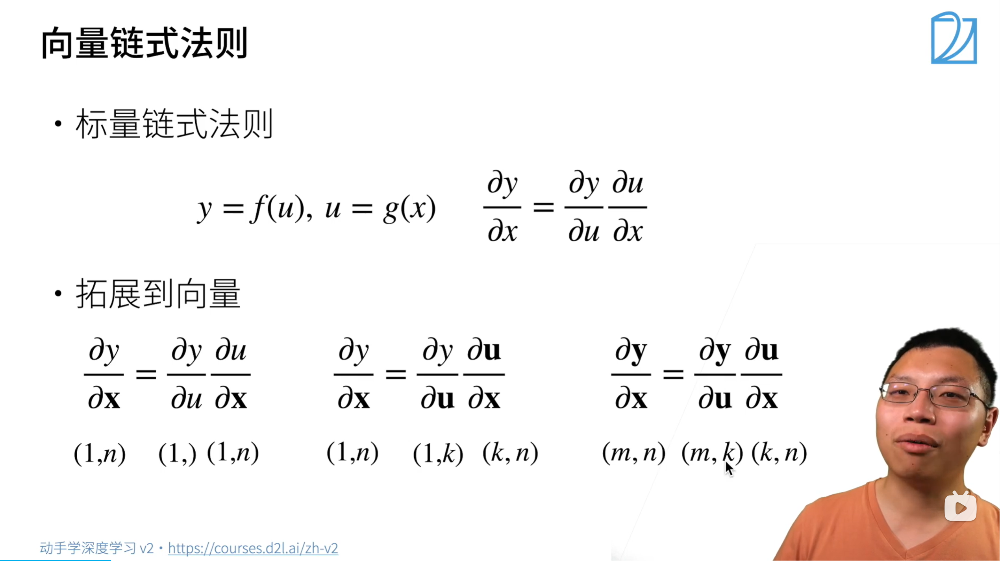
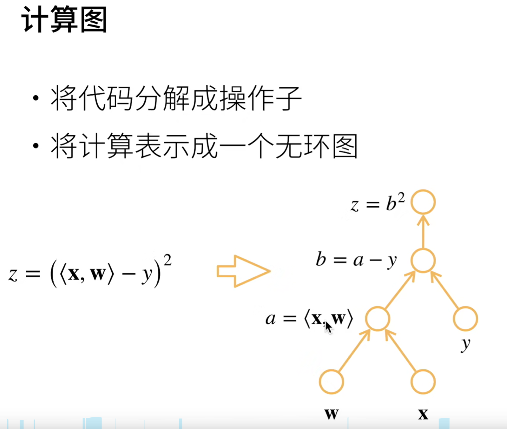
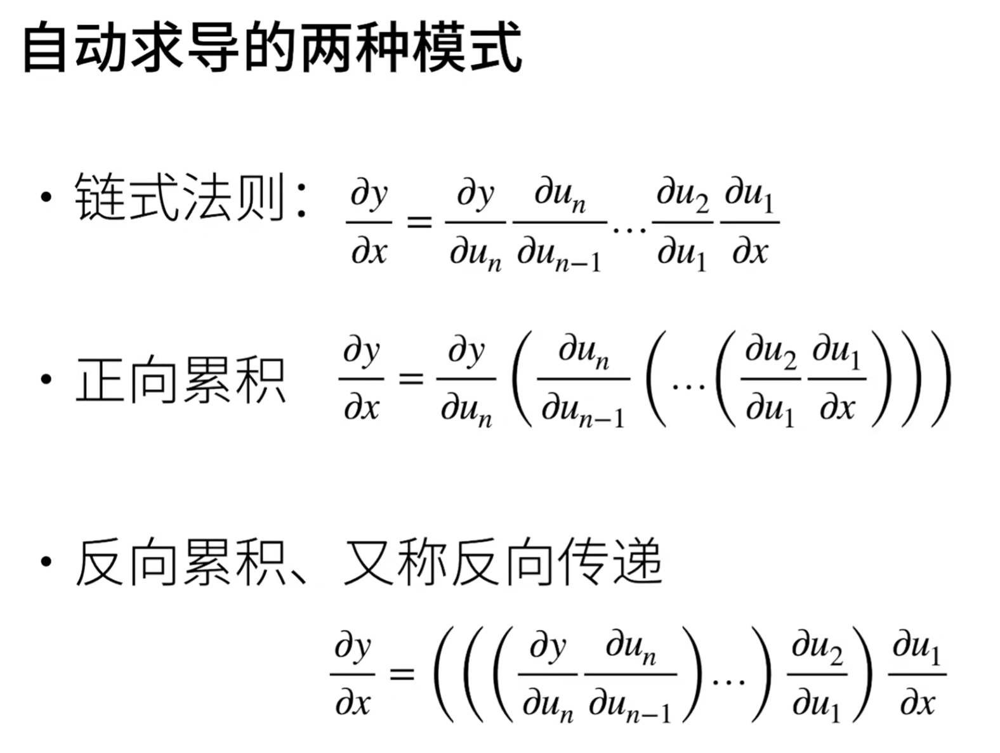

# 课程简介

## 素材下载

[1] [动手学习深度学习](http://zh.d2l.ai)
[1-1] [GitHub 源码](https://github.com/d2l-ai/d2l-zh)
[2] [动手学习深度学习 v2](https://zh-v2.d2l.ai/)
[3] [课程主页](https://courses.d2l.ai/zh-v2)
[4] [课程论坛](https://discuss.d2l.ai/c/16)
[5] [pytorch 论坛](https://discuss.pytorch.org)

## 大纲




### 介绍

深度学习的应用与突破：

1. 图片分类
   http://www.image-net.org
   http://qz.com/1034972/the-data-that-changed-the-direction-of-ai-research-and-possibly-the-world
2. 物体检测与分割
   https://github.com/matterport/Mask_RCNN
3. 样式迁移
   https://github.com/zhanghang1989/MXNet-Gluon-Style-Transfer/
4. 人脸合成
5. 文字生成图片
   https://openai.com/blog/dall-e/
6. 文字生成
7. 无人驾驶
8. 案例研究-广告点击

### 准备操作

1. 安装 conda/miniconda，并使用 conda 指令创建环境
   ```bash
   conda env remove d2l-zh                   # 移除现有名为"d2l-zh"的环境
   conda create -n d2l-zh python=3.8 pip     # 创建名为"d2l-zh"的环境，并安装 python3.8 和 pip
   conda activate d2l-zh                     # 进入这个环境
   ```
2. 安装必须的包
   本课程需要安装`jupyter`、`d2l`、`torch`、`torchvision`。
   其中：
   - `jupyter`：记事本
   - `d2l`：课程封装的代码库
   - `torch`：
   - `torchvision`：
   ```bash
   pip install -y jupyter d2l torch torchvision
   ```
3. Ubuntu 指令

   ```bash
   sudo apt update
   sudo apt install build-essential
   sudo apt install python3.8
   wget <miniconda_url>
   bash ...sh

   bash
   ```

4. 将服务器 8888 端口映射到本地
   ```sh
   ssh -L8888:Localhost:8888 <username>@<Ubuntu_ip>
   ```
5. 下载课程资源（Ubuntu）
   ```bash
   wget https://zh-v2.d2l.ai/d2l-zh.zip
   sudo apt install unzip
   unzip d2l-zh.zip
   jupyter notebook
   ```

[Ubuntu 环境下实操](https://www.bilibili.com/video/BV18p4y1h7Dr/?share_source=copy_web&vd_source=d2703b4814ac43d97585ae499ae4f355&t=363)

### 课程观看指南

#### 1.

# 笔记

## 介绍

### 深度学习简介

1.由机器学习定义的一个程序算法有大量参数输入和输出，用数据集来确定最佳参数集，就可以以某种度量性能的标准下，得到完成任务的最佳性能。

- 任意调整参数后的程序被称为`模型`。
- 通过操作参数而生成的所有不同程序的集合称为`模型族`。
- 使用数据集选择参数的元程序称为`学习算法`。

我们的目标，是精确定义一个问题，通过不断的迭代用算法找出最优参数。机器学习中的“学习”，指的就是训练模型的过程。

2. 无论什么机器问题，都离不开这四个组件

   - 用来学习的`数据(data)`。
   - 用来转换数据的`模型(model)`
   - 用来量化模型有效性的`目标函数(objective function)`
   - 调整参数以优化目标函数的`算法(algorithm)`

3. 数据
   数据集由样本构成，通常遵循`独立同分布(independent and identically distributed,i.i.d)`，每个样本都由一组特征向量组成，比如一张彩色照片，其包含长、宽、通道三个向量，那么一张照片就是三维的。
   数据的质量十分重要，如果输入的数据带有偏见，那训练出来的模型同样会带有偏见。
4. 模型
   深度学习与传统方法
5. 目标函数
   我们会定义一个函数用于度量模型的优劣程度，并希望将其优化至最低点，这就是我们常说的**损失函数**。**平方误差**函数最常见的损失函数之一
6. 优化算法
   当我们确定了数据、模型、目标函数后，还需要一种算法，来最小化损失函数，因为模型是靠损失函数作为标准来工作的。
   大多数流行的深度学习算法都基于一种基本的算法——**梯度下降**。这个方法会检查每一个参数，并对其进行少量的变动，并查看训练集损失的相应趋势，然后向减少损失的方向优化参数。

### 常见机器学习问题

#### 监督学习

监督学习，就是将一组数据打上标签，然后将数据用于训练模型，使模型能够在未见过的数据中完成标签的归类。
一般可分为以下步骤：

- 在一些数据中，为每个样本获取标签（这些标签可能需要手动标注）
- 选择有监督的学习算法，将训练集作为输入，输出一个“学习过的模型”.
- 将未出现过的样本输入模型，拿到预测的结果。
  

1. **回归**
   如果一个问题需要学习的标签是一个数值时，这个问题可以被归类为回归问题。回归问题就是令预测数值接近真实数值的过程。
2. **分类**
   判断是或不是的问题就是分类问题。
   分类问题中，有时可能无法 100%确定目标归属于哪一类后面会讲到运用**不确定性概念**的一些算法。
   分类问题常用的损失函数是交叉熵。
3. **标记问题**
   一个图像中可能有多个对象，这时采用分类方法就没有办法将这个图像分到具体的哪个类别当中，这时就可以使用给这张图片打上多个标签的办法来处理这个问题。
   标记问题又称为多标签分类。
   比如一篇文章可以用 5~10 个标签来标明它的内容。
4. **搜索**
   在网络搜索中，对结果的排序是一项十分重要的工程。
   比如依据某一相关性指标进行排序，用百度搜索中国大陆的一所大学时，前列的结果一定包含百度百科、分数线等信息。
5. **推荐系统**
   当一条信息被推送给用户时，系统根据用户的行为（如：点击、跳过）进行打分，根据评分系统为用户提供内容相似的信息。
6. **序列学习**
   - 标记和解析
     可以将一个句子中的实体(entity)（如：人名、地名等）标注出来。
   - 自动语音识别
     音频和文本没有一对一的关系，往往是采样得到的多个音频数据对应一个发音，多个发音对应一个单词，这就是典型的**序列到序列学习**问题。
   - 文本到语音
     将文本转化为语音
   - 机器翻译
     自动翻译

#### 无监督学习

相比于监督学习的照葫芦画瓢，无监督学习没有明确的目标，需要系统自发地去学习。

1. **聚类问题**（clustering）
   这次的分类问题不带有标签了，需要自发地生成标签（？？？）。比如对图片进行归类、根据浏览器记录将相似行为的用户进行分类。
2. **主成分分析问题**（principal component analysis）
   一个样本中可能可以提取出很多不同的参数，这些参数的重要性各不相同，只取最重要的几个，就可以比较准确的描述一个样本。
3. **因果关系**（causality）**和概率图模型**（probabilistic graphical models）**问题**
   事物之间的联系
4. **生成对抗性网络**（generative adversarial networks）

#### 与环境互动（没看懂）

分布偏移问题

#### 强化学习

### 深度学习的发展

一些重要的成果

1. 新的容量控制方法（如`dropout`）
2. 注意力机制
3. 多阶段设计
4. 生成对抗网络
5. 随机梯度下降
6. 并行计算
7. 深度学习框架

###

## 预备知识

### 数据操作

#### 入门

无论使用什么深度学习框架，都存在**张量类**（n 维数组）（在 pytorch 和 Tensorflow 中为`Tensor`，在 MXNet 中为`ndarry`）与 numpy 中的`ndarray`类似，区别在于深度学习框架中的张量类可以用 GPU 实现并行运算（numpy 只支持 CPU。此外，张量类支持**自动微分**。

张量表示一个由数值组成的 n 维数组。

- 例子

1.  RGB 图像：宽、高、通道三个维度，需要 3 维张量。
2.  RGB 图像批量：增加了批量大小这个维度，需要 4 维张量。
3.  视频批量：增加了时间维度，需要 5 维张量。

- 基本操作

  ```python
  import torch

  x=torch.arange(12)  # 创建一个0~11共计12个元素的向量
  x.shape             # 查看张量大小
  x.numel()           # 查看元素个数 number of elements
  x.reshape(4,3)      # 重新整理成4行3列
  torch.zeros(4,3)    # 创建一个4行3列的零矩阵
  torch.ones(4,3)     # 创建一个4行3列的1矩阵
  torch.ones(2,3,4)   # 创建一个2个3行4列的矩阵（三维）
  torch.randn(3,4)    # 创建一个3行4列的随机矩阵（使用标准正态分布采样）

  # 将列表转化为tensor张量
  torch.tensor([[1,2,3],[4,5,6]])

  ```

  特别的，运行下面的代码，你会发现虽然`a`和`b`id 不同，但变化却是关联的。

  ```python
  import torch

  a = arange(12)
  b = a.reshape(3,4)

  b[:] = 2
  print(a)

  id(a),id(b)

  """
  tensor([2, 2, 2, 2, 2, 2, 2, 2, 2, 2, 2, 2])
  (140250590661264, 140250593028112)
  """
  ```

  对于这种情况，如果确有需求分配内存来创建两个相同的矩阵，建议采用以下方式

  ```python
  import torch

  A = torch.arange(20).reshape(5,4)
  B = A.clone()

  ```

#### 运算符

1. `+`,`-`,`*`,`/`,`**`在这里均为**按元素运算**。

   ```python
   x=torch.tensor([1,2,3])
   y=torch.tensor([4,5,6])
   x+y,x-y,x*y,x/y,x**y,y//x

   '''
   运行结果：
   (tensor([5, 7, 9]),
   tensor([-3, -3, -3]),
   tensor([ 4, 10, 18]),
   tensor([0.2500, 0.4000, 0.5000]),
   tensor([  1,  32, 729]),
   tensor([4, 2, 2]))
   '''
   ```

   **注意**：这里的例子中，我们选择将两个张量中的值均设为整数，即`tensor.dtype=int64`，在实际操作中，张量一般为浮点型，即`tensor.dtype=float32`，可用以下两种方式定义：

   ```python
   torch.tensor([1.0,2,3,4])                    # 通过定义一个浮点类变量使结果变为浮点型
   torch.tensor([1,2,3,4],dtype=torch.float32)  # 直接更改类型定义
   ```

2. 将张量连接起来
   ```python
   X=torch.arange(12,dtype=torch.float32).reshape(3,4)  #生成一个三行四列的张量，值的类型时32位浮点数。
   Y=torch.tensor([[0,0,1,0],[2,0,3,0],[1,2,3,4]])
   torch.cat((X,Y),dim=0),torch.cat((X,Y),dim=1)
   ```
   - 使用`torch.cat()`可以拼接两个张量，其中，dim=0 表示纵向连接（按行），dim=1 表示横向连接（按列）。在更高维度中，通过更改`dim`的值可以令张量在对应的维数上完成拼接。
3. 其他

   ```python
   x == y # 判断对应位置元素是否相等，返回值是一个规模相同的张量
   x.sum() # 返回所有张量元素的加和
   ```

   - `sum`方法会将所有维度的值加成一个标量。

#### 广播机制

如果两个张量形状不匹配，进行运算时，他们会以某方式自我复制，令两个参与运算的张量的形状相同。
**注意：其中张量有一个维度为 1 时，才可触发广播机制。**

#### 索引和切片

与 Python 语法相同，切片遵循“左闭右开”

```python
X[-1]          # 最后一个元素
X[1:3]         # 第二个和第三个元素（标号为1和2）

```

#### 节省内存

```python
# 进行赋值时，新结果可能会分配新的内存
# 我们可以通过原地操作来避免

Z = torch.zeros_like(X)    # 创建一个与X形状相同的零张量
print (id(Z))
Z[:] = X + Y               # 对元素操作，而不是更改对象
print (id(Z))              # 提前分配空间后，可以执行原地操作，不会再分配内存。
```

如果后续不使用`X`，也可以使用`X[:]=X+Y`或`X+=Y`减少内存开销。（在不改变`X`id 的情况下完成数值更新）

#### 转换为其他 Python 对象

```python
# 将一个张量转换为 numpy 数组
A=X.numpy()
B=torch.tensor(A)

type(A),type(B)

# 将一个大小为1的张量转换为 Python 的标量
a=torch.tensor([1.2])
a,a.item(),float(a)


```

### 数据预处理

#### 读取数据集

```python
import os

os.makedirs(os.path.join('..', 'data'),exist_ok=True)       # 创建目录，若目录已存在，不报错。
data_file = os.path.join('..', 'data', 'house_tiny.csv')    # 创建文件路径。

with open(data_file, 'w') as f:
    f.write('NumRooms,Alley,Price\n')  # 列名：房间数量|街道类型|价格
    f.write('NA,Pave,127500\n')  # 每行表示一个数据样本，NAN：not a number
    f.write('2,NA,106000\n')
    f.write('4,NA,178100\n')
    f.write('NA,NA,140000\n')
```

```python
# 如果没有安装pandas，只需取消对以下行的注释来安装pandas
# !pip install pandas
import pandas as pd

data = pd.read_csv(data_file)    # 用pandas读取数据
print(data)
```

#### 处理缺失值

刚才输入的数据中有一些包含`NA`，即数据缺失，对于这种情况，我们可以对缺失数据**插值**或者**直接删除**数据。这里选择插值。

1. 填充数值列

   ```python
   inputs, outputs = data.iloc[:, 0:2], data.iloc[:, 2]           # iloc,index location
   inputs = inputs.fillna(inputs.mean(numeric_only=True))         # fillna,fill NAN
   print(inputs)
   ```

2. one-hot 编码

   ```python
   inputs = pd.get_dummies(inputs,dummy_na=True) * 1   # 意为虚拟变量，将非数值元素转换为one-hot编码的数值元素。
   print(inputs)

   """
   """
   ```

#### 转换成张量模式

先从`panda`转换为`numpy`，再转换为`tensor`。也可以调用`values`方法调取底层 numpy 数据。
两种方法在于，前者可以指定数据类型，后者可以使用原始数据。

```python
import torch

X = torch.tensor(inputs.to_numpy(dtype=float))
y = torch.tensor(outputs.to_numpy(dtype=float))

A = torch.tensor(inputs.values)

X, y, A

"""
(tensor([[3., 1., 0.],
         [2., 0., 1.],
         [4., 0., 1.],
         [3., 0., 1.]], dtype=torch.float64),
 tensor([127500., 106000., 178100., 140000.], dtype=torch.float64),
 tensor([[3., 1., 0.],
         [2., 0., 1.],
         [4., 0., 1.],
         [3., 0., 1.]], dtype=torch.float64))
"""
```

这里的输出会显示使用的 64 位浮点数，但一般使用 32 位就可以了。

### 线性代数基础

#### 创建一个矩阵

1. 矩阵的维数
   从下面的例子可以看出`reshape`方法的一些特点：

   - 最外层的维数对应`reshape`方法最左侧的参数。
   - 最内层的维数（列数）对应最右侧的参数
   - 在本例中，依次在`(1,1)`、`(1,2)`、`(1,3)`、`(2,1)`、`(2,2)`、`(2,3)`的维度生成了一个 4 行 5 列的矩阵。
   - 数值生成的顺序是由右到左的：`(1,1,1,1)-...>(1,1,1,5)->...`
   - 高维矩阵难以用直觉理解，需依赖实际操作。

   ```python
   X = torch.arange(120).reshape(2, 3, 4, 5)
   X
   """
   tensor([[[[  0,   1,   2,   3,   4],
          [  5,   6,   7,   8,   9],
          [ 10,  11,  12,  13,  14],
          [ 15,  16,  17,  18,  19]],

         [[ 20,  21,  22,  23,  24],
          [ 25,  26,  27,  28,  29],
          [ 30,  31,  32,  33,  34],
          [ 35,  36,  37,  38,  39]],

         [[ 40,  41,  42,  43,  44],
          [ 45,  46,  47,  48,  49],
          [ 50,  51,  52,  53,  54],
          [ 55,  56,  57,  58,  59]]],


        [[[ 60,  61,  62,  63,  64],
          [ 65,  66,  67,  68,  69],
          [ 70,  71,  72,  73,  74],
          [ 75,  76,  77,  78,  79]],

         [[ 80,  81,  82,  83,  84],
          [ 85,  86,  87,  88,  89],
          [ 90,  91,  92,  93,  94],
          [ 95,  96,  97,  98,  99]],

         [[100, 101, 102, 103, 104],
          [105, 106, 107, 108, 109],
          [110, 111, 112, 113, 114],
          [115, 116, 117, 118, 119]]]])
   """
   ```

2. 基本计算

   ```python
   A = torch.arange(20,dtype=torch.float32).reshape(5,4)
   B = A.clone()

   A * B          # Hadamard积，按元素乘法

   ```

   - Hadamard 积，记为：$X = A\odot B$

#### 降维

1. sum 方法

   - 使用 sum 方法对指定维数进行求和操作可以降低张量维度。
   - 当 sum 方法中不包含参数时，默认将张量中所有元素求和，得到一个标量。
   - 修改 sum 方法的`axis`参数可以控制求和的范围，所选维度会消失，原本该维度的值对应加和。
   - 修改参数`keepdims`为`True`可以不删除被求和维度，而是将这个维度改为 1，这样做的好处是在后面使用广播机制操作该张量时，由于维数没有变化，不会报错。
   - 使用`cumsum`方法可以沿特定的轴（由参数`axis`指定）累计求和

   ```python
   import torch

   X = torch.arange(20,dtype=torch.float32)

   X.reshape(4,5)

   sum1=X.sum()
   sum2=X.sum(axis=0)
   sum3=X.sum(axis=1)
   sum4=X.sum(axis=[0,1])     # 用于指定沿那一维度求和，求和后该维度消失，sum4与sum1等价

   # 可以通过参数keepdim来保留维度
   # 保留维度只会令该维度为1，不会保留任何值（直接求和会降维）可以在后续计算中利用广播机制参与计算
   sum5=X.sum(axis=1,keepdim=True)     # 不降维求和

   A.mean(axis=1)             # 按第1维求均值

   A.cumsum(axis=0)           # 沿特定轴计算累积和

   ```

2. 均值计算
   ```python
   A.mean(),A.sum()/A.numel()
   ```
   - `mean`方法用于求取当前矩阵中元素的均值。
   - `numel`方法用于记录矩阵中的元素个数。
   - `A.sum()/A.numel()`实际上是`mean`的底层实现。

#### 点积

当两个张量均为向量时，可以使用`dot`方法计算点积，得到一个标量。

```python
x = torch.arange(4)
y = torch.ones(4)

x,y,torch.dot(x,y)

```

#### 矩阵-向量积

当两个张量分别为矩阵和向量时，使用`mv`方法可以完成矩阵向量乘法。

```python
A = torch.arange(20).reshape(5,4)
x = torch.arange(4,dtype=torch.float32)

A.shape, x.shape, torch.mv(A, x)     # mv,matrix vector multiplication
```

#### 矩阵乘法

遵循线性代数规则

```python
torch.mm(A,B)           # mm,matrix multiplication
```

#### 范数

- 范数使用`norm`方法进行计算
- 特别的，$L_1$范数直接将各元素绝对值相加，如：`torch.abs(u).sum()`
- $L_2$范数表达式如下：

  $$
  \|\mathbf{x}\|_2 = \sqrt{\sum_{i=1}^n x_i^2},
  $$

- 矩阵的 Frobenius 范数（$F$ 范数）直接将所有矩阵元素的平方和开根号得到。

```python
u = torch.tensor([3.0, -4.0])
torch.norm(u)
```

### 微积分（标量向量求导）

矩阵求导规则
设定 X 发生转置。
||标量\[y(1,)\]|向量 $$ \mathbf{x}(n,1) $$ |矩阵 $$ \mathbf{X}(n,k) $$ |
|:---:|:---:|:---:|:---:|
|标量\[y(1,)\]|$$ \frac{\partial y}{\partial x}(1,) $$|$$ \frac{\partial y}{\partial \mathbf{x}}(1,n) $$|$$ \frac{\partial y}{\partial \mathbf{X}}(k,n) $$|
|向量 $$ \mathbf{y}(m,1) $$|$$ \frac{\partial \mathbf{y}}{\partial x}(m,1) $$|$$ \frac{\partial \mathbf{y}}{\partial \mathbf{x}}(m,n) $$|$$ \frac{\partial \mathbf{y}}{\partial \mathbf{X}}(m,k,n) $$|
|矩阵 $$ \mathbf{Y}(m,l) $$|$$ \frac{\partial \mathbf{Y}}{\partial x}(m,l) $$|$$ \frac{\partial \mathbf{Y}}{\partial \mathbf{x}}(m,l,n) $$|$$ \frac{\partial \mathbf{Y}}{\partial \mathbf{X}}(m,l,k,n) $$|

所有 y 统统不变，所有 x 统统转置，x 的复合向量也链式求导后统统转置。**这是运用了分子布局的结果**，简单来说，分子布局保留所有分子维度，转置所有分母维度。

#### 分子布局与分母布局

首先明确一个概念，分子/分母布局的依据是：求导后，矩阵的行数与分子相同还是与分母相同。

1.  概念

    - 两种布局的结果互为转置
    - 在计算场景下，最常用的是分母布局。
    - $\frac{\partial{A\mathbf{y}}}{\partial{\mathbf{y}}}=A^T$（分母布局）
    - $\frac{\partial{\mathbf{y}^T A\mathbf{y}}}{\mathbf{y}}=A\mathbf{y}+A^T\mathbf{y}$（分母布局）
      $\frac{\partial{\mathbf{y}^T A\mathbf{y}}}{\mathbf{y}}=2A\mathbf{y}(while A=A^T)$（对称矩阵，常见于二次型）
    -

2.  对于一个标量$f$和一个列向量$\mathbf{y}=[y_1,y_2,y_3]^T$，有：

    - 分母布局（Denominator Layout）：

    $$
    \frac{\partial f(\mathbf{y})}{\partial \mathbf{y}} =
    \begin{bmatrix}
    \frac{\partial f}{\partial y_1} \\
    \frac{\partial f}{\partial y_2} \\
    \frac{\partial f}{\partial y_3}
    \end{bmatrix}_{3 \times 1}
    $$

    - 分子布局（Numerator Layout）
      $$
      \frac{\partial f(\mathbf{y})}{\partial \mathbf{y}} =
      \left[
      \frac{\partial f}{\partial y_1},
      \frac{\partial f}{\partial y_2},
      \frac{\partial f}{\partial y_3}
      \right]_{1 \times 3}
      $$

3.  【向量对向量的导数】对于$\mathbf{f}(\mathbf{y})=[f_1(\mathbf{y}),f_2(\mathbf{y}),...,f_n(\mathbf{y})]^T$和$\mathbf{y}=[y_1,y_2,...,y_m]^T$
    - 分母布局（Denominator Layout）：
      $$
      \frac{\partial \mathbf{f}}{\partial \mathbf{y}} =
      \begin{bmatrix}
      \frac{\partial f_1}{\partial y_1} & \frac{\partial f_2}{\partial y_1} & \cdots & \frac{\partial f_n}{\partial y_1} \\
      \frac{\partial f_1}{\partial y_2} & \frac{\partial f_2}{\partial y_2} & \cdots & \frac{\partial f_n}{\partial y_2} \\
      \vdots & \vdots & \ddots & \vdots \\
      \frac{\partial f_1}{\partial y_m} & \frac{\partial f_2}{\partial y_m} & \cdots & \frac{\partial f_n}{\partial y_m}
      \end{bmatrix}_{m \times n}
      $$
    - 分子布局（Numerator Layout）：
      $$
      \frac{\partial \mathbf{f}}{\partial \mathbf{y}} =
      \begin{bmatrix}
      \frac{\partial f_1}{\partial y_1} & \frac{\partial f_1}{\partial y_2} & \cdots & \frac{\partial f_1}{\partial y_m} \\
      \frac{\partial f_2}{\partial y_1} & \frac{\partial f_2}{\partial y_2} & \cdots & \frac{\partial f_2}{\partial y_m} \\
      \vdots & \vdots & \ddots & \vdots \\
      \frac{\partial f_n}{\partial y_1} & \frac{\partial f_n}{\partial y_2} & \cdots & \frac{\partial f_n}{\partial y_m}
      \end{bmatrix}_{n \times m}
      $$
4.  【最小二乘法实例】
    https://www.bilibili.com/video/BV1W84y1H7HR
    梯度下降、最小二乘法等

#### 最小二乘法实例

#### 梯度下降法实例

### 自动微分

这一小节将简单介绍矩阵微分，若不想了解原理就直接跳转到自动求导小节。

#### 向量链式法则

1. 标量
   $$
   \begin{aligned}
   & y = f(u), \quad u = g(x) \\
   \Rightarrow & \frac{\partial y}{\partial x} = \frac{\partial y}{\partial u} \cdot \frac{\partial u}{\partial x}
   \end{aligned}
   $$
2. 向量



#### 线性回归实例

【分子布局】根据上面提到的表格，我们来做一个例子

假设 $$ \mathbf{x,w} \in \mathbb{R}^n , y\in\mathbb{R} $$

$$
z = (\langle \mathbf{x} , \mathbf{w} \rangle-y)^2
$$

计算 $$ \frac{\partial z}{\partial \mathbf{w}} $$

1. 分解
   $$
   a=\langle \mathbf{x} , \mathbf{w} \rangle,   b=a-y,   z=b^2
   $$
2. 链式求导
   $$
   \frac{\partial z}{\partial \mathbf{w}} = \frac{\partial z}{\partial b} \frac{\partial b}{\partial a} \frac{\partial a}{\partial \mathbf{w}} =\frac{\partial b^2}{\partial b} \frac{\partial a-y}{\partial \mathbf{a}} \frac{\partial \langle\mathbf{x,w}\rangle}{\partial \mathbf{w}} = 2b \cdot \mathbf{1} \cdot \mathbf{x}^T
   $$

#### 自动求导

自动求导的过程，是先前向传播存储中间变量计算结果，然后反向传播链式求导，最终得到结果。

有别于符号求导、数值求导

1. 符号求导
   根据法则，如：$$ x^a \to a x^{a-1}$$
2. 数值求导
   $$
    \frac{\partial f(x)}{\partial x} = \lim_{h \to 0} \frac{f(x+h)-f(x)}{h}
   $$

计算图：将计算表示为一个无环图，mxnet 等可以进行显示构造，pytorch 可以进行隐式构造。


简单来说，显式构造先给公式再给值，隐式构造先给值再给公式。

1. 显式构造（`Tensorflow`、`Theano`、`MXNet`）

   ```python
   from mxnet import sym

   a = sym.var()
   b = sym.var()
   c = 2 * a + b

   ```

2. 隐式构造（`PyTorch`、`MXNet`）
   ```python
   from mxnet import autograd,nd
   with autograd.record():
       a = nd.ones((2,1))
       b = nd.ones((2,1))
       c = 2 * a + b
   ```

**自动求导的两种模式**

对于一个链式求导式：

$$
\frac{\partial y}{\partial x}=\frac{\partial y}{\partial u_n}\frac{\partial u_n}{\partial u_{n-1} }… \frac{\partial u_2}{\partial u_1} \frac{\partial u_1}{\partial x}
$$

1. 正向累积（从 x 出发）
2. 反向累积（从 un 出发）

优劣：

- 反向累积需要存储正向每一次的结果，正向不存储。所以神经网络吃显存。
- 正向累积每次计算都要从头到尾进行一遍

- 不是每次从头扫一遍，使整个过程每个操作子要扫一遍，有 n 个操作子

- 反向从根节点向下扫，可以保证每个节点只扫一次；正向从叶节点向上扫，会导致上层节点可能需要被重复扫多次（正向中子节点比父节点先计算，因此也无法像反向那样把本节点的计算结果传给每一个子节点）

我们用一个例子来解释以上内容
原文链接：[前向微分和正向微分怎么理解？微分方式跟反向传播算法啥关系？【自动微分】系列第三篇](https://www.bilibili.com/video/BV1zD4y117bL)
【例】对$f(x_1, x_2) = \ln(x_1) + x_1x_2 - \sin(x_2)$分别进行前向传播与反向传播的计算。

1. 前向传播
   前向传播，就是将一个复杂的公式问题分解成简单的数值计算，通过计算每一层的数值，得出最终结果。
   值得注意的是，前向传播的过程中，需要记录每一层计算出的数值供后面的层使用，这在训练神经网络的过程中，会消耗极其巨大的内存资源，这也是占用 GPU 内存（显存）的祸源。

   - **输入变量**：\(x_1, x_2\)。
   - **中间变量计算**：

     - \(v_1 = \ln(x_1)\)：计算自然对数；
     - \(v_2 = x_1x_2\)：计算乘法；
     - \(v_3 = \sin(x_2)\)：计算正弦函数；
     - \(v_4 = v_1 + v_2\)：累加前两项；
     - \(f = v_4 - v_3\)：最终输出。

   - **数值示例**：假设 \(x_1 = 2, x_2 = 5\)，则：

     - \(v_1 = \ln(2) \approx 0.693\)；
     - \(v_2 = 2 \times 5 = 10\)；
     - \(v_3 = \sin(5) \approx -0.958\)；
     - \(v_4 = 0.693 + 10 = 10.693\)；
     - \(f = 10.693 - (-0.958) = 11.651\)。

   - 导数求解
     **1. 输入变量与初始导数**

     - 输入变量：\(x_1 = 2, x_2 = 5\)
     - 初始导数（对输入的偏导）：
       $$
       \frac{\partial x_1}{\partial x_1} = 1, \quad \frac{\partial x_1}{\partial x_2} = 0; \quad \frac{\partial x_2}{\partial x_1} = 0, \quad \frac{\partial x_2}{\partial x_2} = 1.
       $$

     **2. 中间变量导数计算**
     **(1) 计算 \(v_1 = \ln(x_1)\)**

     - **数值**：\(v_1 = \ln(2) \approx 0.693\)
     - **导数**（链式法则）：
       $$
       \frac{\partial v_1}{\partial x_1} = \frac{1}{x_1} \cdot \frac{\partial x_1}{\partial x_1} = \frac{1}{2} \cdot 1 = 0.5, \quad \frac{\partial v_1}{\partial x_2} = 0.
       $$

     **(2) 计算 \(v_2 = x_1 x_2\)**

     - **数值**：\(v_2 = 2 \times 5 = 10\)
     - **导数**（乘积法则）：

       $$
       \frac{\partial v_2}{\partial x_1} = x_2 \cdot \frac{\partial x_1}{\partial x_1} + x_1 \cdot \frac{\partial x_2}{\partial x_1} = 5 \cdot 1 + 2 \cdot 0 = 5,
       $$

       $$
       \frac{\partial v_2}{\partial x_2} = x_2 \cdot \frac{\partial x_1}{\partial x_2} + x_1 \cdot \frac{\partial x_2}{\partial x_2} = 5 \cdot 0 + 2 \cdot 1 = 2.
       $$

       **(3) 计算 \(v_3 = \sin(x_2)\)**

     - **数值**：\(v_3 = \sin(5) \approx -0.958\)
     - **导数**：

       $$
       \frac{\partial v_3}{\partial x_1} = 0, \quad \frac{\partial v_3}{\partial x_2} = \cos(x_2) \cdot \frac{\partial x_2}{\partial x_2} = \cos(5) \cdot 1 \approx 0.2837.
       $$

       **(4) 计算 \(v_4 = v_1 + v_2\)**

     - **数值**：\(v_4 = 0.693 + 10 = 10.693\)
     - **导数**（加法法则）：

       $$
       \frac{\partial v_4}{\partial x_1} = \frac{\partial v_1}{\partial x_1} + \frac{\partial v_2}{\partial x_1} = 0.5 + 5 = 5.5,
       $$

       $$
       \frac{\partial v_4}{\partial x_2} = \frac{\partial v_1}{\partial x_2} + \frac{\partial v_2}{\partial x_2} = 0 + 2 = 2.
       $$

       **(5) 计算最终输出 \(f = v_4 - v_3\)**

     - **数值**：\(f = 10.693 - (-0.958) = 11.651\)
     - **导数**（减法法则）：

       $$
       \frac{\partial f}{\partial x_1} = \frac{\partial v_4}{\partial x_1} - \frac{\partial v_3}{\partial x_1} = 5.5 - 0 = 5.5,
       $$

       $$
       \frac{\partial f}{\partial x_2} = \frac{\partial v_4}{\partial x_2} - \frac{\partial v_3}{\partial x_2} = 2 - 0.2837 = 1.7163.
       $$

       **3. 最终梯度结果**

       $$
       \nabla f = \left( \frac{\partial f}{\partial x_1}, \frac{\partial f}{\partial x_2} \right) = (5.5, 1.7163).
       $$

2. 反向传播
   反向传播通过链式法则从输出端向输入端逐层计算梯度，目标是求 \(f\) 对输入变量 \(x_1, x_2\) 的偏导数 \(\frac{\partial f}{\partial x_1}\) 和 \(\frac{\partial f}{\partial x_2}\)。具体步骤如下：

   - **初始化梯度**：

     - \(\frac{\partial f}{\partial f} = 1\)（输出对自身的导数为 1）。

   - **计算中间变量的梯度**：

     - **对 \(v_4\) 的梯度**：
       $$
       \frac{\partial f}{\partial v_4} = \frac{\partial f}{\partial v_4} = 1 \quad (\text{因为} \ f = v_4 - v_3)
       $$
     - **对 \(v_3\) 的梯度**：
       $$
       \frac{\partial f}{\partial v_3} = -1 \quad (\text{因为} \ f = v_4 - v_3)
       $$

   - **逐层反向传递梯度**：

     - **对 \(v_1\) 的梯度**：
       $$
       \frac{\partial f}{\partial v_1} = \frac{\partial f}{\partial v_4} \cdot \frac{\partial v_4}{\partial v_1} = 1 \times 1 = 1
       $$
     - **对 \(v_2\) 的梯度**：
       $$
       \frac{\partial f}{\partial v_2} = \frac{\partial f}{\partial v_4} \cdot \frac{\partial v_4}{\partial v_2} = 1 \times 1 = 1
       $$
     - **对 \(x_1\) 的梯度**：
       $$
       \frac{\partial f}{\partial x_1} = \frac{\partial f}{\partial v_1} \cdot \frac{\partial v_1}{\partial x_1} + \frac{\partial f}{\partial v_2} \cdot \frac{\partial v_2}{\partial x_1} = 1 \cdot \frac{1}{x_1} + 1 \cdot x_2
       $$
       代入数值：\(\frac{1}{2} + 5 = 5.5\)。
     - **对 \(x_2\) 的梯度**：
       $$
       \frac{\partial f}{\partial x_2} = \frac{\partial f}{\partial v_2} \cdot \frac{\partial v_2}{\partial x_2} + \frac{\partial f}{\partial v_3} \cdot \frac{\partial v_3}{\partial x_2} = 1 \cdot x_1 + (-1) \cdot \cos(x_2)
       $$

   - 代入数值：\(2 + (-1) \cdot \cos(5) \approx 2 - (-0.283) = 2.283\)。

#### 雅可比矩阵

在上一节中，我们讲到了正向传播和反向传播，这两种传播方式有不同的应用场景，正向传播适用于输出维数远大于输入的场景，反向传播适用于输出维数远小于输入的场景。神经网络的特点更符合后者，故神经网络常用反向传播。下面解释两种形式的原理。

1. 正向传播
   对于函数 \( y = f(x) \)，其中 \( f: \mathbb{R}^n \rightarrow \mathbb{R}^m \)，其 Jacobian 矩阵 \( J \) 是一个 \( m \times n \) 的矩阵，表示所有输出对输入的偏导数：

   $$
   J = \frac{\partial \mathbf{y}}{\partial \mathbf{x}} =
   \begin{bmatrix}
   \frac{\partial y_1}{\partial x_1} & \cdots & \frac{\partial y_1}{\partial x_n} \\
   \vdots & \ddots & \vdots \\
   \frac{\partial y_m}{\partial x_1} & \cdots & \frac{\partial y_m}{\partial x_n}
   \end{bmatrix}
   $$

   $$
   \mathbf{v} = \frac{\partial l}{\partial \mathbf{y}} = \left[ \frac{\partial l}{\partial y_1}, \frac{\partial l}{\partial y_2}, \ldots, \frac{\partial l}{\partial y_m} \right]^T
   $$

   $$
   J \cdot \mathbf{v} =
   \begin{bmatrix}
   \sum_{j=1}^n \frac{\partial y_1}{\partial x_j} v_j \\
   \vdots \\
   \sum_{j=1}^n \frac{\partial y_m}{\partial x_j} v_j
   \end{bmatrix}
   $$

   这个计算过程定义了一个矩阵$J$用于表示$y$对$x$的导数，又定义了向量$\mathbf{v}$作为**权重向量**。在这个过程中，遵循由$x$到$y$的过程，即正向传播过程。**因为正向传播中$x$的维度直接影响导数计算过程中内存占用，所以正向传播适用于输入更多的场景。**

2. **反向传播**：从输出层向输入层逐层传递梯度，利用链式法则计算每层的局部梯度。
   **关键公式**：
   $$
   \frac{\partial l}{\partial \mathbf{x}} = \frac{\partial l}{\partial \mathbf{y}} \cdot \frac{\partial \mathbf{y}}{\partial \mathbf{x}} = \mathbf{v}^T \cdot J
   $$
   其中：
   - $ \mathbf{v} = \frac{\partial l}{\partial \mathbf{y}} $ 是上游梯度（损失对输出的梯度）。
   - $ J = \frac{\partial \mathbf{y}}{\partial \mathbf{x}} $ 是雅可比矩阵。

#### 实现

1. 一个简单的例子

   ```python
   import torch

   x=torch.arange(4.0)

   x.requires_grad_(True)  # 等价于x=torch.arange(4.0,requires_grad=True)，之后可用x.grad访问梯度

   y=2*torch.dot(x,x)
   y.backward()            # 求导
   print(x.grad)           # 访问导数
   print(x.grad==4*x)      # 验证

   # 在默认情况下，PyTorch会累积梯度，我们需要清除之前的值
   x.grad.zero_()          # 梯度清零
   y=x.sum()
   y.backward()
   print(x.grad)

   ```

   - 为什么不用`y = 2 * x * x`？
     因为会报错。梯度计算只支持标量输入，这里的结果是一个向量。求导是对向量中每一个元素求的，而不是对整个向量求的。
     在机器学习中，loss（损失函数）通常是一个标量，如果 loss 是一个向量，随着神经网络层数的增加，会获得一个维数很多的矩阵，这样计算就会很麻烦（甚至算不出来）。
   - 为什么要进行梯度清零操作？
     pytorch 中的梯度不会自动清零，而是会在原值上累积，所以需要使用原地操作`zero_()`（方法名带`_`的为原地操作）将梯度清零
   - 【未解决】梯度不清零有什么好处？
     当一个批量太大（比如 128 张图片），可以将批量按组切割为数量不为 1 的小批量，然后将整个小批量的梯度累加起来，得到一个累加值用于后续计算。
     当然，这并不代表梯度累加是 pytorch 一个好的特性，部分学者认为这并不是一个好功能。
     另外，当做 multi-modality（多模态）相关工作时，有一个 weight 在不同的模型之间 share，这样的累加是有好处的。

2. 非标量变量的反向传播
   ```python
   # 对非标量调用backward需要传入一个gradient参数，该参数指定微分函数关于self的梯度。
   # 本例只想求偏导数的和，所以传递一个1的梯度是合适的
   x.grad.zero_()
   y = x * x
   # 等价于y.backward(torch.ones(len(x)))
   y.sum().backward()         # 注意这里的sum，将向量转为标量
   x.grad
   ```
3. 分离计算
   将某些计算移动到计算图之外

   ```python
   x.grad.zero_()
   y = x * x
   u = y.detach()       # u只记录y的值，抛弃所有特征
   z = u * x            # 将u视为常数

   z.sum().backward()   # 对z(x)计算梯度
   x.grad == u
   ```

4. Python 控制流的梯度计算
   使用自动微分的一个好处是：
   **即使构建函数的计算图需要通过 Python 控制流（例如，条件、循环或任意函数调用），我们仍然可以计算得到的变量的梯度**。
   在下面的代码中，`while`循环的迭代次数和`if`语句的结果都取决于输入`a`的值。

   ```python
   def f(a):
      '''
      定义一个函数，这个函数的值一定是f(a)=ka，梯度一定为k。（k为一个不确定的常数）
      因此，梯度的值一定为df/da = f(a)/a = k
      '''
      b = a * 2
      while b.norm() < 1000:
         b = b * 2
      if b.sum() > 0:
         c = b
      else:
         c = 100 * b
      return c

   a = torch.randn(size=(), requires_grad=True)    # 初始化一个标量（size=()视为0维张量，也就是标量）
   d = f(a)
   d.backward()

   a.grad == d / a
   ```

## 线性神经网络

### 线性回归

为了解释**线性回归**，我们举一个实际的例子：
我们希望根据房屋的面积（平方英尺）和房龄（年）来估算房屋价格（美元）。
为了开发一个能预测房价的模型，我们需要收集一个真实的数据集。
这个数据集包括了房屋的销售价格、面积和房龄。
在机器学习的术语中，该数据集称为**训练数据集**（training data set）或**训练集**（training set）。
每行数据（比如一次房屋交易相对应的数据）称为**样本**（sample），也可以称为**数据点**（data point）或**数据样本**（data instance）。
我们把试图预测的目标（比如预测房屋价格）称为**标签**（label）或**目标**（target）。
预测所依据的自变量（面积和房龄）称为**特征**（feature）或**协变量**（covariate）。

#### 建立模型

现在建立模型，假设有$n$个输入$x_n$，每个输入有权重$w_n$，则模型表示为：

$$
y=w_1x_1+w_2x_2+...+w_nx_n+b
$$

在这个例子中，x 为**样本特征**（如：面积、房龄等），y 为**目标**（如：房价）。

用向量表示为：

$$
y=\langle\mathbf{w},\mathbf{x}\rangle+b
$$

其中，$\mathbf{w}$为一个 n 维的权重，$b$为一个标量偏差。

线性回归模型是一个单层的神经网络，其参数就是模型中的权重和偏差。这个神经网络含有一个输入层和一个输出层，单层指这个神经网络带权重的层只有一层。

#### 损失函数

现在，我们需要一个指标来衡量模型的好坏。损失函数$l(y,\hat{y})$，$y$为真实值，$\hat{y}$为预测值。
这里我们使用平方损失：

$$
l(y,\hat{y})= \frac{1}{2} (y-\hat{y})^2
$$

其实就是方差，$\frac{1}{2}$可以在求导时消掉。

#### 训练数据

收集一些数据用于决定参数值（权重与偏差），例如过去的实际信息数据。
假设我们有 n 个样本：

$$
\mathbf{X}=[\mathbf{x_1},\mathbf{x_2},...,\mathbf{x_n}]^T \\
\mathbf{y}=[y_1,y_2,...,y_n]^T
$$

#### 参数学习

训练损失：

$$
J(\mathbf{X},\mathbf{y},\mathbf{w},b)=\frac{1}{2n}\sum_{i=1}^n (y_i-(\langle\mathbf{x}_i,\mathbf{w}\rangle+b))^2= \frac{1}{2n}  \left\| \mathbf{y} - \mathbf{X} \mathbf{w} - b \right\|^2
$$

最小化损失：

$$
\mathbf{w}^*, \mathbf{b}^* = \arg\min_{\mathbf{w}, b} J(\mathbf{X}, \mathbf{y}, \mathbf{w}, b)
$$

#### 显示解

将偏差加入权重 $ \mathbf{X}\leftarrow[\mathbf{X,1}] , \mathbf{w}\leftarrow[\mathbf{w,b}]^T $

$$
J(\mathbf{X},\mathbf{y},\mathbf{w})= \frac{1}{2n} \sum_{i=1}^{n} \left\| y_i - \mathbf{X} \mathbf{w} \right\|^2\\
\frac{\partial}{\partial \mathbf{w}} J(\mathbf{X},\mathbf{y},\mathbf{w}) = - \frac{1}{n} \sum_{i=1}^{n} \left( y_i - \mathbf{X} \mathbf{w} \right)^T \mathbf{X}
$$

对于一个线性模型，其二阶导一定是大于零。

损失函数是凸函数，所以最优解满足下述条件：

$$
\begin{align*}
&\frac{\partial l(\mathbf{X},\mathbf{y},\mathbf{w})}{\partial \mathbf{w}} = \mathbf{0} \\
    \quad \Leftrightarrow \quad &
    \frac{1}{n}(\mathbf{y}-\mathbf{X}\mathbf{w})^{\mathsf{T}} \mathbf{X} = \mathbf{0} \\
    \quad \Leftrightarrow \quad &
    \mathbf{w}^* = (\mathbf{X}^{\mathsf{T}}\mathbf{X})^{-1}\mathbf{X}^T\mathbf{y}
\end{align*}
$$

#### 总结

- 线性回归是对 n 维输入的加权外加偏差
- 使用平方损失来衡量预测值和真实值的差异
- 线性回归有显示解（**别的模型均没有**）
- 线性回归可看做单层神经网络

### 基础优化算法

#### 梯度下降

当一个函数没有显示解，该怎么办？

- 挑选一个参数的随机初始值，记为 $ \mathbf{w}_{0} $
- 不断更新 **$ \mathbf{w}_{0} $**，令其不断接近最优解
  $$
    \mathbf{w}_{i+1} = \mathbf{w}_i - \eta \nabla f(\mathbf{w}_i) = \mathbf{w}_i - \eta \frac{\partial f}{\partial \mathbf{w}}
  $$
  $f$ 为随时函数
  $\eta$ 学习率，步长的**超参数**（超参数是人为指定的参数），这个参数太大和太小都不合适。

1. 小批量随机梯度下降
   在整个训练集上计算梯度太贵，一个神经网络模型可能需要数分钟至数小时。
   可以随机采样 $b$ 个样本 $ i_1,i_2,...,i_b$ 来近似损失：
   $$
   f(\mathbf{w}) \approx \frac{1}{b}\sum_{i=1}^b f(\mathbf{w};\mathbf{x}_{i_j},\mathbf{y}_{i_j})
   $$
   这里的 $b$ 表示批量大小，是**另一个重要的超参数**。这个参数同样不能太大（开销太大）或太小（数据不精确）。

总结：

- 梯度下降通过不断沿着反梯度方向更新参数求解
- 小批量随机梯度下降是深度学习默认的求解算法
- **两个重要的超参数是批量大小 $b$ 和学习率 $\eta$**

### 线性回归的 pytorch 实现

任务：根据带有噪声的线性模型构造一个人造数据集，使用这个有限样本的数据集来恢复这个模型的参数。

1. 生成一个带有 1000 个样本的数据集

   ```python
   %matplotlib inline
   # 令生成的图表不会显示于窗口，而是显示于nb的命令行
   import random                          # 导入random库
   import torch                           # 导入torch库
   from d2l import torch as d2l           # 导入课程库的torch版本

   def synthetic_data(w, b, num_examples):  #@save
      """生成y=Xw+b+噪声"""
      X = torch.normal(0, 1, (num_examples, len(w)))
      y = torch.matmul(X, w) + b
      y += torch.normal(0, 0.01, y.shape)
      return X, y.reshape((-1, 1))

   true_w = torch.tensor([2, -3.4])
   true_b = 4.2
   features, labels = synthetic_data(true_w, true_b, 1000)

   print('features:', features[0],'\nlabel:', labels[0])

   d2l.set_figsize()
   d2l.plt.scatter(features[:, (1)].detach().numpy(), labels.detach().numpy(), 1)
   ```
