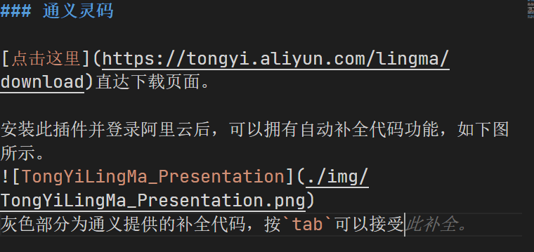
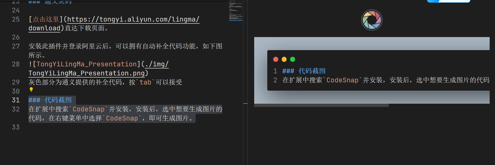
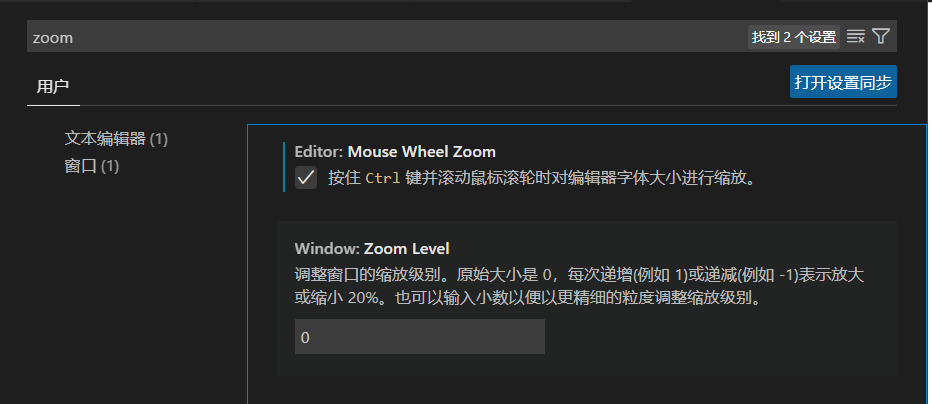

# vscode 安装与使用指南

## 安装

通过以下链接下载并安装：
[https://code.visualstudio.com/](https://code.visualstudio.com/)

## 必要功能配置

### 修改语言

在扩展中搜索`Chinese`，找到如下插件并安装。
.png>)

### C 语言

### Markdown

搜索并安装以下插件。

## 功能选配

### 通义灵码

[点击这里](https://tongyi.aliyun.com/lingma/download)直达下载页面。

安装此插件并登录阿里云后，可以拥有自动补全代码功能，如下图所示。

灰色部分为通义提供的补全代码，按`tab`可以接受

### 代码截图

在扩展中搜索`CodeSnap`并安装，安装后，选中想要生成图片的代码，在右键菜单中选择`CodeSnap`，即可生成图片。

### 代码格式化

参考以下链接：
[1] [CSDN：使用 vs code 编写 Markdown 文档时，自动格式化相关问题](https://blog.csdn.net/weixin_52108539/article/details/142316706)

## 常见问题解答

1.  代码界面无法缩放
    - 在设置中搜索`zoom`，找到`Editor:Mouse Wheel Zoom`，勾选`按住 Ctrl 键并滚动鼠标滚轮时对编辑器字体大小进行缩放。`即可。
    - 也可以使用`Ctrl +/-`进行缩放。
      ]

## 神奇的快捷键

1. `Ctrl+点击一个函数`: 跳转到函数定义处。
2.
